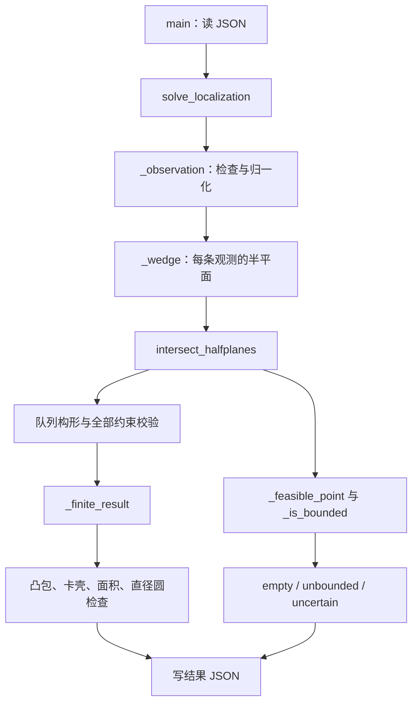
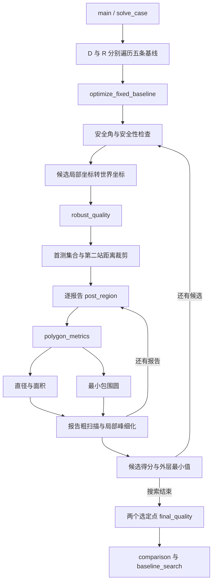

# 第二章　Q1 / Q2：从一条有误差的方向，到一个可解释的第二检测点

> 学习目标：你不仅能运行两问，还能在纸上推出角楔不等式、解释定位区域为什么是凸的、手算一个反例、说清第二站为什么保证接收，并沿着源码讲完两层优化。特别要分清：**区域包含真源的几何保证、覆盖给定多边形的数值检查、连续选址问题的全局最优证明，是三件不同的事。**
>
> 本章以本仓库的原上传源码为准，不把程序没有执行的步骤写进算法。`Q1:L257–265` 表示 `source/Q1/q1_solver.py` 第 257–265 行；`Q2:L307–400` 表示 `source/Q2/q2_solver.py` 第 307–400 行。生成器另写全名。题目页码指上传的 `20-B-.pdf` 的 PDF 页码，恰与页脚页码一致。

## 0. 这两问在七天学习中的位置

建议用两个五小时学习日完成本章，而不是连续读十小时。第一天读到第 6 节并完成 Q1；第二天读第 7–13 节完成 Q2。第 14–16 节用于后续答辩复习。这里的时间是学习安排，不是程序运行时间。

| 学习块 | 时间 | 必须亲手完成的产出 |
| --- | ---: | --- |
| Q1：题意、角度、半平面 | 75 分钟 | 不看代码写出两条角楔不等式，检查东、北两个方向 |
| Q1：半平面交、退化情形 | 75 分钟 | 手算矩形、空集、线段；说出 `uncertain` 的含义 |
| Q1：凸包、直径、直径圆 | 75 分钟 | 写出“只检查顶点”的证明，画正三角形反例 |
| Q1：运行与口述 | 75 分钟 | 跑固定种子；从 `main` 讲到输出，解释每个字段 |
| Q2：安全域与坐标转换 | 90 分钟 | 推出固定基线的安全角上界，并区分两个安全域 |
| Q2：MEC、圆外包络、物理可行报告 | 75 分钟 | 写出嵌套的最小最大模型，解释为何不能任意拼接位置与示向度 |
| Q2：源码、搜索、实验 | 75 分钟 | 跑 `--quick`；区分内层黄金分割与外层粗细网格 |
| Q2：答辩与查漏 | 60 分钟 | 回答第 15 节，不把数值近似说成连续全域证明 |

**第一遍需要掌握的主线**：误差有界 → 所有相容位置 → 角楔交 → 凸多边形 → 最坏空间尺度 → 为下一次观测选择位置。

**第二遍再深入的内容**：衰退方向判定、MEC 的三点支撑、全信息安全域推导、连续报告极大值的数值误差。不要因这些内容尚未熟练而跳过前面的最小例题。

## 1. 先把题意翻译成允许使用的信息

### 1.1 题目给了什么，程序实际用了什么

| 信息 | 题目位置 | 对 Q1 / Q2 的意义 | 当前代码 |
| --- | --- | --- | --- |
| 源在原点为中心、半径 1800 m 的圆域内 | 第 1 页 | 是位置先验；并非机器狗只能在圆内移动 | Q2 用 `ARENA_R=1800`；Q1 不加入此圆约束 |
| 示向度从正东起逆时针量，范围 `[0,360)` | 第 2 页附录 2(1) | 使用 `atan2(y,x)` 的坐标约定 | Q1 `_observation`；Q2 `local_to_world` |
| 示向误差在 ±1° 内；同地重复误差不变 | 第 2 页附录 2(1) | 可做集合包含；不能凭重复测量次数缩小误差带 | 两问都不平均重复测量 |
| 有效接收半径未知，但在 1000–1500 m | 第 3 页附录 2(2) | 收到信号说明距离不超过 1500；保证接收可用 1000 | Q2 的 `R_MIN`、`R_MAX` |
| 不超过 20 m 可光学定位并清除 | 第 3 页附录 2(8) | 应关心“能否选一个点覆盖所有可能源位置” | Q2 用最小包围圆半径作为主尺度 |
| 不超过 5 m 时，信号过强，不能得到普通示向度 | 第 3 页附录 2(9) | 普通方向报告还意味着距离大于 5 m | Q2 为保持凸性省略这个内洞，构成保守放宽 |
| 机器狗位置通常不受目标圆域约束 | 第 4 页 | 检测点在 1800 m 圆外不自动违规 | Q1 生成器可能生成圆外检测点 |

这里的“保守”需要指明对象：把可能位置集合放大，能够保留真源；在这个放大集合上算覆盖半径，会使**给定观测的空间不确定性**偏大。但以后在有限个观测上取最大值，又可能漏掉未采样观测的峰值。两个方向不能相互抵消后直接称“整体有保证”。

### 1.2 为什么这里没有误差服从均匀分布的假设

题目给出误差区间，但没有给出每个地点的误差独立、同分布、均值为零。Q1 和 Q2 选择的是有界误差模型：只要误差不越界，真源就应保留在可行集合里。

生成器用 `uniform(-1,1)` 只是产生本地测试数据的一种办法。**测试数据的抽样分布，不会自动成为求解器的建模假设。** Q2 文件头 L4–9 已明确说明不设误差分布，不平均重复测量。

### 1.3 先记住这些符号

| 符号 | 含义 | 单位 |
| --- | --- | --- |
| $S_i=(x_i,y_i)$ | 第 $i$ 个检测点 | m |
| $G=(x,y)$ | 未知真源 | m |
| $z_i$ | 测得的示向度 | °；三角函数前转弧度 |
| $\delta$ | 角误差半宽，默认 $1^\circ$ | ° |
| $u(t)=(\cos t,\sin t)$ | 单位方向向量 | 无量纲 |
| $W(S,z,\delta)$ | 以 $S$ 为顶点的可行角楔 | 位置集合 |
| $P$ | 多次观测的定位区域 | 位置集合 |
| $D(P)$ | 区域直径 $\max_{p,q\in P}\lVert p-q\rVert$ | m |
| $R(P)$ | 最小包围圆半径 $\min_c\max_{p\in P}\lVert p-c\rVert$ | m |
| $A(P)$ | 面积 | m² |
| $L=\lVert S_2-S_1\rVert$ | 两检测点间基线长度 | m |
| $\psi$ | 第二站相对首示向轴的偏角，带正负号 | ° |

距离、半径、直径都以米计，但含义不同。把 `worst_R_m` 与 `objective_value` 比较前，先看该行的 `objective` 是 `R` 还是 `D`。

## 2. 方法一：把有界误差写成凸可行集合

### 2.1 通用方法与外部讲义例题

**通用方法。** 对未知量 $x$，每条观测产生一个允许集合 $C_i$。所有观测同时成立的集合是 $\bigcap_i C_i$。若各 $C_i$ 是半空间，则交集是凸多面体；二维中是凸多边形、无界凸区域或退化集合。

**外部例题来源 [E1]。** Boyd、Vandenberghe 的官方《Convex Optimization》原版讲义，第 2 讲 “Hyperplanes and halfspaces”“Polyhedra”，讲义页 2–6、2–9，分别展示法向量指定的半空间与多个半空间围成的多边形；“Intersection”，页 2–12，还把对所有角参数成立的三角多项式幅值约束表示为一族凸带的交。该例说明：每个条件单独简单，全部同时成立要取交，而不是对边界求平均。原文链接见 [E1]。本节的无线电角楔与以下数值是针对 B 题重新推导的。

### 2.2 “方向差不超过 1°”的直接表达为什么不适合几何裁剪

直接写

$$
\bigl|\operatorname{wrap}_{[-180^\circ,180^\circ)}
(\operatorname{atan2}(y-y_i,x-x_i)-z_i)\bigr|\le\delta
$$

在逻辑上可以，但程序需要反复求角、处理 $359^\circ$ 与 $0^\circ$ 的接缝，还要处理 `atan2(0,0)`。角楔边界本来就是直线，把它转换成半平面更直接。

定义二维叉积

$$
\operatorname{cross}((a_x,a_y),(b_x,b_y))=a_xb_y-a_yb_x.
$$

它是带符号的平行四边形面积：向量 $b$ 在有向向量 $a$ 的左侧时为正，右侧时为负。

令下边界方向 $u_-=u(z-\delta)$，上边界方向 $u_+=u(z+\delta)$，待测位移 $v=X-S$。当 $0<\delta<90^\circ$ 时，角楔可以写成

$$
\operatorname{cross}(u_-,v)\ge0,
\qquad \operatorname{cross}(u_+,v)\le0.
$$

第一条表示在下边界的左边，第二条表示在上边界的右边。它们共同保留向前的小角楔；并不是把每条射线延长后留下前后两个楔。

### 2.3 推成代码使用的 $n\cdot X\le c$

展开第一条：

$$
\cos(z-\delta)(y-y_S)-\sin(z-\delta)(x-x_S)\ge0.
$$

移项得到

$$
\underbrace{(\sin(z-\delta),-\cos(z-\delta))}_{n_-}\cdot X
\le n_-\cdot S.
$$

第二条同理：

$$
\underbrace{(-\sin(z+\delta),\cos(z+\delta))}_{n_+}\cdot X
\le n_+\cdot S.
$$

这正是 `Q1:L257–265` 中 `_wedge` 的两个法向量。`HalfPlane` 在 `Q1:L19–27` 中统一存储 `normal`、`offset`；`residual(X)=normal·X-offset` 是违反约束的带符号数。

**自己检查一次东向观测。** $S=(0,0),z=0^\circ$，记 $t=\tan1^\circ$。两个约束等价于

$$
-tx\le y\le tx.
$$

若 $x<0$，下界大于上界，不能满足；因此这是正东前方的楔。若把某个法向量符号写错，就可能保留整个上半平面或反向楔。

**再检查北向。** $z=90^\circ$ 时应得到 $y\ge0$、$|x|\le y\tan1^\circ$。能完成这两个检查，比记住公式更有用。

### 2.4 为什么误差为零要另外补一条约束

若 $\delta=0$，上述两条约束互为反向，合起来只要求 $X-S$ 与方向向量共线，留下的是整条直线。此时需要

$$
u(z)\cdot(X-S)\ge0
\quad\Longleftrightarrow\quad -u(z)\cdot X\le-u(z)\cdot S
$$

把反向半直线删除。这就是 `Q1:L262–264` 的第三个法向量。Q1 支持误差为零的点、线段与射线案例；它不是可有可无的特殊处理。

Q2 的 `clip_wedge`（L157–166）没有这一零误差分支；Q2 正常流程固定使用 `DELTA_DEG=1.0`，所以该差异不会影响默认题设。

### 2.5 多次观测与一个可手算的交会例子

对于 $m$ 条观测，

$$
P=\bigcap_{i=1}^{m}W(S_i,z_i,\delta)
 =\{X:n_j\cdot X\le c_j,\ j=1,\ldots,2m\}.
$$

用 $S_1=(0,0),z_1=0^\circ$，$S_2=(100,-100),z_2=90^\circ$，$\delta=1^\circ$。第一条楔的中轴向东，第二条中轴向北，在 $(100,0)$ 附近交会。原 Q1 函数实际给出四个顶点：

| 顶点 | $x$ / m | $y$ / m |
| --- | ---: | ---: |
| $v_1$ | 98.224567 | 1.714516 |
| $v_2$ | 98.284439 | −1.715561 |
| $v_3$ | 101.714516 | −1.775433 |
| $v_4$ | 101.776516 | 1.776516 |

例如交点 $v_4$ 同时满足 $y=tx$ 和 $x=100+t(y+100)$，所以

$$
x=\frac{100}{1-t},\qquad y=\frac{100t}{1-t}.
$$

得到 $D=4.938542582$ m，$A=12.187172797$ m²。注意有误差的交会结果是一个区域，中心射线的交点只提供直觉，不能替代整个区域。

### 2.6 选择它的理由与替代方案

| 方法 | 所需信息／输出 | 本题如何取舍 |
| --- | --- | --- |
| 两条中心射线求交 | 忽略有界误差，得到单点 | 适合示意；不提供覆盖真源的区域 |
| 最小二乘拟合方向 | 需要选择残差与权重；通常得到单点 | 可以另做估计，但无法仅靠拟合值回答“所有相容位置有多大” |
| 概率滤波、误差椭圆 | 需要概率模型、协方差等 | 题设没有足够信息直接校准置信概率 |
| 角楔交 | 只需误差上界，得到全部相容位置的外包络 | 与 Q1 的多边形直径问题直接一致，也能供 Q2 做最坏情形选址 |

**保证的条件。** 真实方向误差确实不超过所用半宽、坐标约定正确，并忽略浮点误差时，真源一定属于所有角楔的交。若输入互相矛盾，可能得到空集，不能再声称“模型一定含真源”。

## 3. 方法二：半平面交，把不等式转成有序顶点

### 3.1 通用方法与外部讲义例题

**通用方法。** 已有 $n$ 个闭半平面，求全部约束共同允许的区域，并区分空、有界、无界。二维半平面交可用分治、对偶凸包、按边界方向排序后维护队列等算法。

**外部来源 [E2]。** David M. Mount 的《CMSC 754: Computational Geometry》讲义第 8 讲 “Halfplane Intersection and Point-Line Duality”，印刷页 40–41、图 34，展示若干上半平面交形成的下方折线边界，特别提醒结果可能无界或为空；随后给出“分别求两半集合，再合并凸区域”的分治算法。本源码使用方向排序加双端队列，属于同一问题的另一实现，不应说它逐行实现了讲义的分治法。

### 3.2 先用一个小例子弄懂交集

约束为

$$
x\ge0,\quad x\le2,\quad y\ge0,\quad y\le1.
$$

交集是矩形 $[0,2]\times[0,1]$。再加 $x+y\le2$，右上角 $(2,1)$ 被截掉，新增与边界的交点 $(2,0)$、$(1,1)$。这里 $(2,0)$ 原本已在边界，几何实现需要去重。

若再加 $x\le-1$，结果为空。若一开始只有 $x\ge0,y\ge0$，结果是无界第一象限，不能用一个任意“大盒子”截断后把盒子的直径称为答案。

### 3.3 第一步：规范化约束，才能比较松紧

`_normalise`（Q1:L43–59）把 $ax+by\le c$ 除以 $\sqrt{a^2+b^2}$，使法向量长度为 1。这样 $x\le2$ 与 $2x\le4$ 会具有相同表示，`offset` 的大小才可直接比较。

同方向约束只保留较小的 `offset`：例如 $x\le3$ 与 $x\le2$，前者完全多余。`_ordered`（L73–87）先按边界方向排序，再合并同向平行约束，并检查排序角度接缝两端。

注意“同向平行”与“反向平行”不同。$x\le2$ 和 $x\ge0$ 不能合并，因为它们共同形成带状区域。`_same_direction`（L68–70）同时检查叉积近零和点积为正。

### 3.4 为什么边界方向取 $(-b,a)$

对于 $n=(a,b)$，代码取 $d=(-b,a)$。若 $X_0$ 在边界 $n\cdot X_0=c$ 上，则

$$
\operatorname{cross}(d,X-X_0)
=-n\cdot(X-X_0).
$$

因此 $n\cdot X\le c$ 等价于“沿 $d$ 走时，可行域在左侧”。所有半平面都有相同的左右约定，队列删除规则才能统一。对应 `Q1:L62–65`。

### 3.5 两条边界的交点如何算

解

$$
a_xx+a_yy=c_a,\qquad b_xx+b_yy=c_b.
$$

令 $\Delta=a_xb_y-a_yb_x$，则

$$
x=\frac{c_ab_y-a_yc_b}{\Delta},\qquad
y=\frac{a_xc_b-c_ab_x}{\Delta}.
$$

`_intersection`（Q1:L90–97）直接实现这个公式。$|\Delta|\le10^{-12}$ 时当作平行，返回 `None`。几乎平行意味着分母很小，交点可能很远、对角度扰动很敏感；这同时是物理交会质量差和数值计算困难的信号。

### 3.6 双端队列维护的究竟是什么

`active` 中存的是当前边界半平面，不是观测点，也不是顶点。相邻两条边界的交点是候选区域顶点。

按方向加入新半平面 `hp` 时：

1. 若队尾最后两条边界的交点落在 `hp` 外面，队尾边界已经不可能继续成为最终交集边界，弹出队尾，直到尾部合法。
2. 同样检查队首两条边界，必要时弹出队首。
3. 把新半平面加入队尾。
4. 全部加入后，队首与队尾要闭合，再清理两端。

这对应 `Q1:L201–218`。`_cuts`（L105–107）组合“求交点”和“在不在新约束外”两件事。

**不要逐字背两个 `while`。** 应说：“我维护按方向排列的有效边界；新约束会使两端的一些相邻交点失效，因此从两端删掉已经被覆盖的边界。”

### 3.7 从候选顶点到可信输出，还做了什么

主流程没有直接相信队列。它还：

- 对候选交点求凸包，消除重复、共线中间点，统一顺序（L220）；
- 检查每个候选顶点是否满足**所有原始约束**（L225）；
- 对只有一点或一条线段的结果检查原约束是否真的限制了所有无界方向（L221–224）；
- 主流程未能形成有效有限区域时，寻找一个可行点，再分辨空、无界、数值不确定（L228–237）。

Q1 没有加入人工大边框，所以能诚实地输出 `unbounded`。

### 3.8 为什么能用法向量的最大角间隙检查有界性

若存在非零方向 $v$，使所有法向量满足 $n_i\cdot v\le0$，则从一个可行点 $X_0$ 出发，

$$
n_i\cdot(X_0+tv)\le n_i\cdot X_0\le c_i,
\quad t\ge0.
$$

整条射线都在区域中，因此区域无界。这类 $v$ 称为衰退方向。

二维中，所有法向量若能塞进某个闭半圆，就存在相应的逃逸方向；若法向量绕一圈后的任意相邻间隔都小于 $180^\circ$，则不存在这种非零方向。`_is_bounded`（Q1:L135–141）通过排序法向角、检查包括首尾接缝在内的最大间隙来判别。代码多留了 `PARALLEL_EPS` 裕量。

这个判定要配合非空性使用。空集不能靠“有没有逃逸方向”判断，所以程序先寻找可行点。

### 3.9 `_feasible_point` 的边界降维思想

从 $X=(0,0)$ 开始遍历约束。如果当前点违反新约束，就试着在新约束的边界上找一个满足已有约束的点。边界参数化为

$$
X(t)=cn+t(-n_y,n_x)
$$

（因为 $n$ 已是单位向量）。每个旧半平面都变成一个关于 $t$ 的一维不等式，更新 `lower` 或 `upper`；区间为空时就不可行。对应 `Q1:L110–132`。

例：新边界 $x=2$ 写成 $(2,t)$；旧约束 $y\ge0,y\le1$ 给出 $0\le t\le1$，于是 $(2,0)$ 就是可行见证。

### 3.10 六种状态，以及复杂度的准确说法

| `status` | 含义 | 直径／面积 |
| --- | --- | --- |
| `polygon` | 有限二维凸多边形 | 有有限值 |
| `segment` | 退化为线段 | 直径为长度，面积 0 |
| `point` | 退化为一点 | 直径与面积均为 0 |
| `empty` | 约束无共同可行点 | 代码用 `None`，JSON 为 `null` |
| `unbounded` | 有可行点，但区域无界 | 不输出人为有限值，附可行见证点 |
| `uncertain` | 已发现可行且按判据有界，但主流程未可靠构造有限形状 | 需要检查退化和数值条件；不能自动当作空集 |

方向排序加队列的标准核心是 $O(n\log n)$，队列中每条边界进出至多常数次。但是**整份当前 Q1 实现不能直接宣称最坏 $O(n\log n)$**：L225 的“全部约束 × 全部顶点”验证最坏为 $O(n^2)$，兜底 `_feasible_point` 也有二重循环。本文据源码把完整实现的最坏上界写为 $O(n^2)$，同时指出几何核心的较优复杂度。

这不是说程序一定慢。题目一条观测只增加两个半平面，实际输入通常很小，额外检查有明确价值。

## 4. 方法三：凸包与旋转卡壳计算区域直径

### 4.1 通用方法与外部论文例题

**通用方法。** 有限点集先取凸包；凸多边形的最远点对可从顶点的对踵对中寻找。旋转一对平行支撑线，维护可能构成最远点对的两侧顶点，避免枚举全部顶点对。

**外部来源 [E3]。** Godfried Toussaint 的原论文 *Solving Geometric Problems with the Rotating Calipers*（IEEE MELECON’83），§1、PDF 第 1 页与图 1，说明两个平行支撑线接触的顶点构成对踵对，旋转支撑线可枚举线性数量的此类点对。文中还特别讨论两边同时发生转动事件时的并列情形。以下矩形与数值例子是本章用于理解代码的自算例子，不冒充论文给出的坐标。

### 4.2 为什么任意两点的最大距离只需查顶点

设凸多边形顶点为 $v_1,\ldots,v_k$，任意两点可写为

$$
p=\sum_i\alpha_iv_i,\qquad q=\sum_j\beta_jv_j,
\quad \alpha_i,\beta_j\ge0,\quad\sum_i\alpha_i=\sum_j\beta_j=1.
$$

于是

$$
\begin{aligned}
\lVert p-q\rVert
&=\left\lVert \sum_{i,j}\alpha_i\beta_j(v_i-v_j)\right\rVert\\
&\le\sum_{i,j}\alpha_i\beta_j\lVert v_i-v_j\rVert\\
&\le\max_{i,j}\lVert v_i-v_j\rVert.
\end{aligned}
$$

反过来顶点也属于多边形，所以

$$
D(P)=\max_{i,j}\lVert v_i-v_j\rVert.
$$

这个证明才是“有限顶点代表连续区域”的理由。仅仅说“显然在角上”不足以解释算法。

### 4.3 为什么源码还要重新求凸包

`_convex_hull`（Q1:L144–157）用上下链：先按坐标排序，遇到非左转就弹出前一个点。叉积不大于 `EPS` 的共线或右转点不保留在链中。这样可以处理无序点、重复点和共线中间点。

Q1 `polygon_diameter`（L160–181）首先再次取凸包。对于 0、1、2 个点分别处理，只有至少 3 个点才进入卡壳。Q2 在 L246–270 有自己的凸包和直径实现，**没有从 Q1 文件导入函数**。

### 4.4 面积比较为什么等价于“移动远侧卡壳”

固定凸包边 $v_i\to v_{i+1}$，定义

$$
H_i(j)=\operatorname{cross}(v_{i+1}-v_i,\ v_j-v_i).
$$

因为边长对这一步不变，$H_i(j)$ 等于“边长 × 顶点到边界直线的有向距离”。让 $j$ 前进，直到下一顶点的 $H_i$ 不再增大，就找到该边对应的远侧支撑顶点。

源码的内层 `while` 正是在比较这个值（Q1:L173–176）。然后分别比较 $(v_i,v_j)$、$(v_{i+1},v_j)$ 两个距离（L177–180）。随 $i$ 沿凸包移动，远侧顶点也沿凸包向前移动，无须对每条边从头扫描。

凸包已按环序给出时，卡壳部分为 $O(k)$；当前函数先做凸包，因此其整体包含 $O(k\log k)$ 的预处理。不要把函数总成本与卡壳核心成本混写。

### 4.5 小例题：长 2、宽 1 的矩形

顶点依次是 $(0,0),(2,0),(2,1),(0,1)$。底边对应的远侧支撑线是 $y=1$，有两个并列顶点。真实直径是对角线 $\sqrt5$，不是长边 2，也不是矩形宽度 1。

这帮助区分三个概念：

- 面积：2；
- 某个方向上的宽度：随方向变化；
- 直径：所有方向上最大投影宽度，也等于最远点对距离。

代码使用 `> 当前面积 + EPS` 的前进条件，并比较边的两个端点。遇到平行边、重复点、共线点时，要结合凸包预处理和并列事件理解，不要用“严格大于”推断程序从来不会遇到并列情况。

## 5. Q1 的关键反例：直径的一半不总是覆盖半径

### 5.1 先精准回答题目问的圆

设 $p,q$ 为最远点对，$D=\lVert p-q\rVert$。最自然的“以定位区域直径为直径的圆”是以

$$
c_D=\frac{p+q}{2},\qquad r_D=\frac D2
$$

为中心与半径的圆。Q1 `_finite_result`（L184–198）构造这个中心，计算所有顶点到中心的最大距离，并返回覆盖布尔值与余量。

因为圆盘是凸的，若全部多边形顶点都在圆盘内，则它们的所有凸组合都在圆盘内，也就是整个多边形都被覆盖。因此检查顶点足够。

### 5.2 正三角形反例：一组坐标就能推翻“总能覆盖”

取

$$
A=(0,0),\quad B=(40,0),\quad C=(20,20\sqrt3).
$$

三边都长 40 m，故 $D=40$ m。以 $AB$ 为直径的圆心是 $(20,0)$，半径 20 m。但

$$
\lVert C-(20,0)\rVert=20\sqrt3\approx34.641>20.
$$

因此它不能覆盖三角形。最小包围圆的圆心为 $(20,20/\sqrt3)$，半径

$$
R=\frac{40}{\sqrt3}\approx23.094\ \text{m}.
$$

所以 $D\le40$ m 不能保证某个清除点距离所有可能源都不超过 20 m。这正是 Q2 引入 MEC 的理由。

该反例直接调用现有函数得到：

```text
Q1 polygon_diameter: 40.0
Q1 diameter_circle_covers: False
Q1 diameter_circle_cover_margin_m: -14.641016151377542
Q2 minimum_enclosing_circle:
  center = (20.0, 11.54700538379251)
  returned radius = 23.094010867585034
```

最后一个半径比数学精确值大 $10^{-7}$ m，这是 Q2 的覆盖审计裕量，不是新几何现象。

### 5.3 能不能换一个圆心，仍用半径 $D/2$ 覆盖

也不能任意换。若某半径为 $D/2$ 的圆同时包含距离为 $D$ 的两个端点，则

$$
D=\lVert p-q\rVert\le\lVert p-c\rVert+\lVert c-q\rVert\le D.
$$

两次不等式都必须取等号。于是圆心只能是中点，而且两端必须恰好在圆上。因此当前选定的最远点对直径圆如果漏掉其他点，就不存在“换个圆心但保持同样半径”的解决办法。

**一个有用结论：** 若 Q1 输出 `diameter_circle_covers=True`，忽略浮点裕量时，这个圆就是 MEC，因为任意覆盖圆半径都不能小于 $D/2$，而现在已经用 $D/2$ 完成了覆盖。若为 `False`，Q1 没有继续求 MEC；它只完成题目要求的覆盖判定。

### 5.4 余量怎么读

代码返回

$$
\text{margin}=D/2-\max_v\lVert v-c_D\rVert.
$$

- 明显负值：有顶点漏出圆；
- 接近 0：最远点对端点本来就在圆上，所以这很正常；
- 例如 $-2.5\times10^{-14}$ m：双精度舍入量级，程序通过 `EPS=10^{-10}` 判断为覆盖。

对非空有限区域，这个余量理论上不可能显著为正，因为最远点对两端的距离已经是 $D/2$。因此不要把它当作通常会有较大正值的“冗余安全半径”。

## 6. 方法四：最小包围圆把定位质量连接到清除动作

### 6.1 通用方法与真正的外部应用例题

**通用方法。** 给定点集 $V$，选择中心 $c$，使最远点到中心的距离最小：

$$
\min_{c\in\mathbb R^2}\max_{v\in V}\lVert v-c\rVert.
$$

**外部例题 [E4]。** ETH Zürich 官方讲义 *Geometry: Combinatorics & Algorithms* 的 Appendix G “Smallest Enclosing Balls”，印刷页 232、图 G.1，以村庄消防站选址为例：把房屋看作点，假设出行时间与欧氏距离成正比，最小化最慢到达某户的时间，就应把消防站放在最小包围圆中心。第 235 页讨论二维解由至多三个点确定，§G.2 介绍 Welzl 算法。B 题中，房屋点被替换为所有可能源位置，消防站位置被替换为下一步清除点。

### 6.2 为什么顶点的 MEC 就是多边形的 MEC

若圆盘包含顶点，则包含它们的凸包。反之，包含整个多边形当然包含顶点。因此，求连续多边形的最小包围圆，等价于求其有限顶点集的最小包围圆。Q2 `polygon_metrics`（L272–275）据此直接把顶点交给 `minimum_enclosing_circle`。

这与“直径只需检查顶点”的证明相关，但不是同一个推理：这里用的是圆盘的凸性，那里用的是凸组合与三角不等式。

### 6.3 一个圆最多需要三个支撑点

非空有限点集的最小包围圆可能由下列情形确定：

1. 只有一个位置：半径 0。
2. 两个点在直径两端：圆心是中点，半径为两点距离一半。
3. 三个不共线支撑点共同决定外接圆。三角形若是锐角，可能需要这三个点；若为钝角或直角，最长边的直径圆已经覆盖三角形。

直觉解释：若边界上的所有约束点都挤在圆周某个开半圆内，圆心可以往它们方向略移，使最大距离变小，原圆便不可能最优。最优圆的支撑点必须从相互制约的方向“卡住”圆心。二维最多三个支撑点就足够。

### 6.4 两点圆与三点圆的计算

两点圆是中点加半距离，对应 `Q2:L186–188`。

三点圆令 $u=b-a,v=c-a$，未知圆心写为 $a+w$。等距条件

$$
\lVert w\rVert^2=\lVert w-u\rVert^2=\lVert w-v\rVert^2
$$

消去 $\lVert w\rVert^2$，得到

$$
2u\cdot w=\lVert u\rVert^2,\qquad 2v\cdot w=\lVert v\rVert^2.
$$

解这个二元线性方程组便得到 `_circumcircle`（Q2:L191–199）。分母是 $2\operatorname{cross}(u,v)$；若近零，三点近共线，代码返回 `None`，避免用极小分母生成极大圆心。

### 6.5 当前增量算法到底做了什么

`minimum_enclosing_circle`（Q2:L202–235）的过程：

1. 用固定种子 `20260911` 打乱点顺序，让运行可复现。
2. 逐点加入。若新点已在当前圆内，当前圆仍能覆盖已处理点，无须重建。
3. 若新点 $p$ 在外，重建时把 $p$ 当作边界约束；遇到第二个违反点 $q$，先尝试两点直径圆。
4. 对更早的违反点 $r$，计算经过 $p,q,r$ 的圆，并按 $pq$ 左、右两侧维护候选。
5. 选满足这一增量边界结构的候选，继续处理。
6. 最后固定得到的圆心，重新计算它到**所有输入点**的最大距离，再加 $10^{-7}$ m。

这是随机增量最小包围圆思想的实现；Welzl 原论文 [E5] 可以帮助理解小支撑集合与随机增量，但不要把当前三重循环说成逐行照抄 Welzl 的递归伪代码。

**最后审计保证什么？** 它保证按当前浮点距离计算，返回半径覆盖输入顶点。即使中间舍入造成半径略小，最终会补足。它本身不能证明最终圆心在所有可能圆心中严格最优，也不等价于区间算术意义的机器证明。理论上的 MEC 性质与当前浮点实现的审计要分别说明。

### 6.6 为何不用所有两点、三点组合暴力算

暴力思路很适合用来理解和核对小例子：枚举所有两点圆、三点外接圆，逐个检查是否覆盖全部点，选半径最小者。但三点组合有 $O(k^3)$ 个，每个再检查 $k$ 个点，朴素总成本可达 $O(k^4)$。Q2 要对大量第二站和大量第二示向度重复求圆，增量法更合适。

随机增量理论在合适的随机顺序和精确谓词条件下可给出良好的期望效率；当前固定伪随机种子是可复现性措施，不能据此宣称每份输入的确定性最坏时间都是线性的。直接按源码三重循环计数，可给出 O(k³) 的朴素最坏上界；这与随机增量理论的期望效率是不同口径。

### 6.7 三个质量指标为何保留，但不能混用

| 指标 | 问的是什么 | 优点 | 局限 |
| --- | --- | --- | --- |
| $D$ | 两个相容位置最多相隔多远 | 与 Q1 直接一致，容易解释 | $D/2$ 未必能覆盖区域 |
| $R$ | 最好的单个中心距离最坏位置多远 | 直接对应 20 m 清除距离 | 必须求覆盖圆；两个观测通常未必足够达到 20 m |
| $A$ | 相容位置占多大面积 | 描述总体区域大小 | 很长很细的区域面积小，最远距离仍可能很大 |

例如长 100、宽 0.01 的矩形面积仅 1 m²，但覆盖半径约 50 m。面积小不能代替清除可靠性。

对平面有限集合有

$$
\frac D2\le R\le\frac D{\sqrt3}.
$$

下界来自任意最远点对。上界可由支撑点分情况理解：两点支撑时 $R=D/2$；三点支撑时，圆心周围三个方向至少有一个相邻圆心角不小于 $120^\circ$，而最小圆支撑结构保证相关间隔不超过 $180^\circ$，对应弦长至少 $\sqrt3R$，所以 $D\ge\sqrt3R$。正三角形取等号。

因此，$D\le40$ m 只是 $R\le20$ m 的必要条件；$D\le20\sqrt3\approx34.641$ m 是充分条件。直接算 MEC 可避免只用直径时的间隙。

## 7. 方法五：用鲁棒约束推出第二检测点的安全候选域

### 7.1 通用方法与外部讲义例题

**通用方法。** 决策 $s$ 必须对所有允许的不确定参数 $u\in U$ 满足约束：

$$
g(s,u)\le0\quad\forall u\in U
\quad\Longleftrightarrow\quad
\sup_{u\in U}g(s,u)\le0.
$$

先明确 $U$ 包含哪些情形，再把“所有情形”化成可计算的最坏值。这是鲁棒可行性的核心。

**外部例题 [E1]。** 官方《Convex Optimization》原版讲义 “Robust linear programming” 与 “deterministic approach via SOCP”，页 4–26、4–27，讨论线性约束的系数 $a=\bar a+Pu,\lVert u\rVert_2\le1$ 不确定时，要求所有 $a$ 都满足 $a^Tx\le b$。把线性式对球内 $u$ 取最大值，可写成 $\bar a^Tx+\lVert P^Tx\rVert_2\le b$。本题不确定的是源位置和接收半径；同样先做最坏情形化简，但不因此声称整个选址问题也是 SOCP。

### 7.2 先转到局部坐标，让几何只依赖首示向轴

令第一站为局部原点，首示向轴为局部 $a$ 轴。第二站在局部写为 $s=(a,b)$。其世界坐标是

$$
S_2=S_1+
\begin{pmatrix}
\cos z_1&-\sin z_1\\
\sin z_1&\cos z_1
\end{pmatrix}
\begin{pmatrix}a\\b\end{pmatrix}.
$$

这是 `Q2:L57–60` 的 `local_to_world`。旋转和平移不改变距离，安全性可以在局部推导，再转换到真实坐标。

固定基线 $L$ 时，

$$
a=L\cos\psi,\qquad b=L\sin\psi.
$$

对应 `candidate`（L403–405）。正负 $\psi$ 表示首示向轴两侧。`candidate` 还有一个 `side` 参数，但外层优化实际把符号直接放进 `psi`，调用时没有额外传这个参数。

### 7.3 第一条普通示向报告给出的位置信息

暂时省略 5 m 近场内洞，理想的凸首测集合是

$$
F_1=\Omega\cap B(S_1,1500)\cap W(S_1,z_1,\delta),
\qquad \Omega=B((0,0),1800).
$$

其中收到信号只说明源距第一站不超过自己的接收半径，而该半径至多 1500，所以可以加 $B(S_1,1500)$。**不能由“收到信号”推出距离至少 1000。** 1000 是接收能力的下界，不是源到检测点的距离下界。

如果忽略世界圆域截断，局部外包络为扇区

$$
\mathcal S_{1500}=\{ru(\eta):0\le r\le1500,\ |\eta|\le\delta\}.
$$

它包含真实首测可能位置。用它设计安全点，比利用某个特定首站位置的世界圆域截断更保守，但表达更简单、能够统一复用。

### 7.4 默认安全域：统一按 1000 m 保证接收

代码主流程采用

$$
K_U=\left\{s:\max_{g\in\mathcal S_{1500}}\lVert s-g\rVert\le1000\right\}.
$$

解释：无论真源在首测扇区哪个位置，第二站与它的距离都不超过 1000，而全向源的实际接收半径至少是 1000。因此第二站保证有信号。若距离不超过 5 m，可能得到过强信号而非普通方向报告，但这已经允许直接清除；这里“接收安全”不等同于“一定产生普通示向角”。

函数是 `safe_uniform_1000`（Q2:L91–94）。它没有使用某个生成器真值，也不检查某一个猜测源，而是检查整个扇区。

### 7.5 无限多个源位置，如何精确化成少数候选极值

对固定方向 $u(\eta)$，

$$
\lVert s-ru(\eta)\rVert^2=\lVert s\rVert^2+r^2-2r\,s\cdot u(\eta).
$$

这是关于 $r$ 的凸二次函数，在区间 $[0,R]$ 上的最大值一定出现在端点 $r=0$ 或 $r=R$。所以

$$
\max_{0\le r\le R,|\eta|\le\delta}\lVert s-ru(\eta)\rVert^2
=\max\left\{\lVert s\rVert^2,
\lVert s\rVert^2+R^2-2R\min_{|\eta|\le\delta}s\cdot u(\eta)\right\}.
$$

对 $s=(a,b)$，需要最小化 $a\cos\eta+b\sin\eta$。候选位置包括两端 $\eta=\pm\delta$，以及位于区间内的反向方向 $\eta=\operatorname{atan2}(b,a)+\pi+2k\pi$。这就是 `_sector_max_distance_sq`（L63–77）为什么除了两个端点，还检查内部反向方向。

对实际的向前安全候选，最小投影是

$$
a\cos\delta-|b|\sin\delta.
$$

于是默认安全约束可以明确写成

$$
\boxed{a^2+b^2\le1000^2}
$$

及

$$
\boxed{a^2+b^2+1500^2
-3000(a\cos\delta-|b|\sin\delta)\le1000^2.}
$$

在本题 $\delta=1^\circ$ 的几何下，也可将该域理解为三个圆盘的交：分别以 $0$、$1500u(-\delta)$、$1500u(\delta)$ 为圆心、半径均为 1000。满足这些约束的点位于扇区前方，内部反向极值不会成为遗漏项。通用函数仍检查反向方向，以便正确处理任意传入的 $s$。

### 7.6 固定基线上的安全弧：公式逐步来

代入 $a=L\cos\psi,b=L\sin\psi$，得到

$$
a\cos\delta-|b|\sin\delta=L\cos(|\psi|+\delta).
$$

所以安全性要求

$$
0<L\le1000,
\qquad
\cos(|\psi|+\delta)
\ge\frac{L^2+1500^2-1000^2}{2L\cdot1500}.
$$

从而

$$
\boxed{
|\psi|\le
\arccos\left(\frac{L^2+1500^2-1000^2}{3000L}\right)-\delta.
}
$$

角度必须使用同一单位。`safe_angle_limit`（Q2:L97–111）内部将 `acos` 的弧度结果转成度，再减去 `delta_deg`。当右侧无意义或非正时，优化器不搜索非共线安全候选。

原函数实际计算的上界如下：

| $L$ / m | 默认统一 1000 m 域的 $\lvert\psi\rvert$ 上界 | `full_information` 域上界 |
| ---: | ---: | ---: |
| 600 | 25.562841° | 71.542397° |
| 700 | 33.047732° | 68.512685° |
| 800 | 37.047507° | 65.421822° |
| 900 | 39.273893° | 62.256316° |
| 1000 | 40.409622° | 59.000000° |

这解释了为何“沿首示向轴垂直走，构造 90° 基线”不能作为统一保证接收的策略：它可能走出安全域。两条实际观测射线在源处的交会角，与第二站相对首示向轴的 $\psi$，也不是同一个角。

默认域的最短可行基线不是精确的 500 m。令 $\psi=0$，解安全边界：

$$
L_{\min}=1500\cos\delta
-\sqrt{1000^2-1500^2\sin^2\delta}
\approx500.114261\ \text{m}.
$$

在该最短值上只能位于轴线上；若要非零偏角，基线还要略长。`safe_angle_limit(500)` 返回 0，并不表示 $(500,0)$ 在 ±1° 扇区下安全；优化器会拒绝这个非正角度范围，实际安全性函数也会再次验证候选。

### 7.7 代码还提供的全信息安全域：为什么更大

设源到第一站的真实距离为 $r$，源的固定接收半径为 $\rho\in[1000,1500]$。第一站已经收到信号，意味着 $\rho\ge r$。因此，对这个源位置，最小相容接收半径其实是

$$
\rho_{\min}(r)=\max(1000,r).
$$

完整利用这条信息时，只需

$$
\lVert s-ru(\eta)\rVert\le\max(1000,r)
\quad\text{对全部允许的 }r,\eta.
$$

对 $r\le1000$，就是以 1000 为半径覆盖扇区 $\mathcal S_{1000}$。对 $r\ge1000$，平方后是

$$
\lVert s\rVert^2-2r\,s\cdot u(\eta)\le0.
$$

若在 $r=1000$ 已成立，那么 $s\cdot u(\eta)\ge\lVert s\rVert^2/2000\ge0$，左侧随 $r$ 增大而减小，所以更远的 $r$ 自动满足。于是可归结为

$$
K_F=\left\{s:\max_{g\in\mathcal S_{1000}}\lVert s-g\rVert\le1000\right\}.
$$

这就是 `safe_full_information`（Q2:L80–88）。固定基线时得到

$$
0<L\le1000,
\qquad |\psi|\le\arccos\frac{L}{2000}-\delta.
$$

有 $K_U\subseteq K_F$，所以利用接收信息后可选范围更大。

**“全信息”这个名称的准确边界。** 函数注释中的 “Exact robust domain” 对这里所用的**未截断、含 $r=0$ 的理想扇区模型**成立。若进一步利用真实世界圆域截断，以及普通方向报告必须 $r>5$，真正最大候选域还可能更大。因此不能把它称为“用尽了 B 题所有条件后的最大安全域”。

主入口 `solve_case` 没传 `domain`，所以仍用默认 `uniform1000`。函数存在不等于主流程采用。论文若把最终实验说成使用全信息域，应先改程序并重跑；当前章节只解释现状。

### 7.8 选更保守的域有什么意义，又牺牲了什么

统一 1000 m 域的优点是保证简单：候选点距每个相容源都不超过最小接收半径；公式与坐标位置关系清楚，也便于给出统一候选弧。

代价是可能排除更好的站点，特别是利用“首站已收到远距离源，源的实际接收半径不可能只有 1000”后，可以有更大横向基线。当前代码是一种**在选定保守域内的可复现策略**，不应宣称已经优化全部物理允许的位置。

下面的函数值可用于自检：

| 局部候选 $s$ / m | `safe_uniform_1000` | 理由 |
| --- | --- | --- |
| $(1000,0)$ | `True` | 扇区尖端到候选的距离恰为 1000；远端也在允许范围内 |
| $(0,600)$ | `False` | 1500 m 扇区远端距离约 1625.243 m |
| $(800,400)$ | `True` | 扇区上的最大距离约 894.427 m |
| $(600,400)$ | `True` | 扇区上的最大距离约 995.599 m |

安全只解决“能否保证接收到这个源”，并不直接解决“定位多准确”。例如 $(1000,0)$ 可能与首测轴几乎共线，接收安全而交会质量差。

## 8. 方法六：逐半平面裁剪与圆的外接多边形

### 8.1 通用方法与有坐标的外部例题

**通用方法。** 已知一个有序多边形，用一条半平面约束逐条检查边，保留内部顶点，在穿越边界的边上插入交点。连续执行，就得到多边形与多个半平面的交。

**外部例题 [E6]。** John E. Howland 在 Trinity University 的 *Polygon Clipping*，§2、图 1–2，给出正方形 $(0,0),(100,0),(100,100),(0,100)$ 被直线 $y=x-50$ 裁剪的例子。保留 $y\ge x-50$ 一侧后，右下角被去掉，新顶点为 $(50,0)$、$(100,50)$，得到五边形。讲义用 J 语言解释数组实现；本代码采用逐边循环，几何思想一致。

### 8.2 四种边穿越情况

对边 $a\to b$，定义

$$
f(a)=n\cdot a-c,\qquad f(b)=n\cdot b-c.
$$

理想内侧为 $f\le0$。

| 起点 $a$ | 终点 $b$ | 该边对输出贡献 |
| --- | --- | --- |
| 内 | 内 | 终点 $b$ |
| 内 | 外 | 边界交点 |
| 外 | 内 | 边界交点，然后终点 $b$ |
| 外 | 外 | 不添加 |

交点写成 $a+t(b-a)$。因为 $f$ 是仿射函数，

$$
0=f(a)+t(f(b)-f(a))
\quad\Longrightarrow\quad
t=\frac{f(a)}{f(a)-f(b)}.
$$

`clip_halfplane`（Q2:L124–144）直接用这个公式；再去掉相邻的几乎重复点。它从最后一个顶点开始连接到第一个顶点，因此隐式处理了闭合边，不需要输入列表末尾重复首顶点。

### 8.3 为什么 Q2 不直接重用 Q1 的队列

Q1 从一批角楔半平面开始，允许无界结果；Q2 已有圆域的有限多边形外包络，并且要反复加入首测楔、第二站接收圆、第二测楔。保持一个有序有限多边形，再做增量裁剪，代码接口很自然。

两种方法没有数学冲突。它们都在求凸集合交，只是维护的状态不同：Q1 主要维护有效边界队列，Q2 主要维护当前顶点列表。

### 8.4 圆不能直接写成有限个半平面：要选外包络

真圆盘为 $B(c,r)$。取 $n$ 个均匀法向量

$$
u_k=u(2\pi k/n),\quad k=0,\ldots,n-1,
$$

使用切线半平面

$$
u_k\cdot X\le u_k\cdot c+r.
$$

每个圆内点都满足这些约束，因此交出的正多边形包含整个圆盘。这个多边形的顶点半径为

$$
r_v=\frac r{\cos(\pi/n)},
$$

顶点角为 $(2k+1)\pi/n$。`circle_outer_polygon`（Q2:L114–121）正是这样生成初始世界圆域；`clip_disk_outer`（L147–154）则逐条加入另一个圆盘的切线半平面。

如果把顶点直接放在半径 $r$ 的圆上，会得到**内接**多边形，可能把真实合法位置删掉。集合成员定位通常需要保留真源，所以这里选择外接。

### 8.5 外包络有多粗：可以量化，但别过度解释

单个半径 1500 m 圆的最坏径向外扩量是

$$
e_n=1500\left(\sec\frac\pi n-1\right).
$$

| 边数 $n$ | 单圆最大径向外扩 / m | 代码中的典型用途 |
| ---: | ---: | --- |
| 72 | 1.429028 | `--quick` 外层搜索 |
| 96 | 0.803549 | 默认外层搜索 |
| 180 | 0.228492 | `--quick` 最终复评 |
| 360 | 0.057118 | 默认最终复评 |

1800 m 圆的同类误差再乘 1.2。这里描述的是**单个圆盘近似**，不能不经证明就把它当作最后定位半径误差上界：多个边界相交，尤其接近平行时，交点偏差可能被放大。

边数增加后通常更接近真圆，但 96 边与 360 边的法向网格不是简单的包含关系，多个集合交后的数值也不应机械声称单调递减。正确做法是记录分辨率，做收敛观察，同时保留“数值近似”的表述。

### 8.6 首测集合和第二测集合的实际构造

`first_feasible_polygon`（Q2:L169–178）：

1. 生成 $\Omega$ 的外接多边形；
2. 用 $B(S_1,1500)$ 的外接切线裁剪；
3. 加首测角楔。

`physical_base`（L278–279）再用 $B(S_2,1500)$ 裁剪。`post_region`（L282–284）再加第二测角楔。

若用帽子表示代码中的外包络，则

$$
\widehat F_1
=\widehat\Omega\cap\widehat B(S_1,1500)\cap W_1,
$$

$$
\widehat P_2(s,z)
=\widehat F_1\cap\widehat B(s,1500)\cap W(s,z,\delta).
$$

`first_feasible_polygon` 文档明确说省略普通方向报告对应的 5 m 内洞，保持凸性。在真实普通报告模型中，两站都应满足距离大于 5 m；当前两站的角楔都含自己的顶点，因此这是一个有意放宽的模型。

对默认的理想统一安全域来说，第二站距全部首测真候选已经不超过 1000，故 1500 圆约束在精确模型中往往冗余。但 `robust_quality` 可独立对任意第二站调用，外包络也有数值扩张，所以源码仍显式保留这个物理距离条件。

## 9. 方法七：只在物理相容的第二示向度上做最坏情形分析

### 9.1 通用方法与外部最坏情形例题的联系

**通用方法。** 设计一个动作前，考虑动作之后所有可能观测；每个观测又对应一组可能状态。优化应在“能够共同发生的状态—观测组合”上进行，而不是把各变量的单独取值范围直接做笛卡尔积。

这一做法仍采用第 7.1 节外部讲义 [E1] 的“对不确定集合取最坏值”思想。讲义例题中的不确定系数限制在指定椭球内；本题的不确定位置和示向度必须满足同一套角度、距离与场地条件。**不确定集的定义本身就是模型的一部分。** 以下报告可行域是本题的推导，讲义没有现成的无线电公式。

### 9.2 先写理想凸模型，再辨认代码近似

在省略近场内洞但保留精确圆盘的模型中，

$$
P_2(s,z)=F_1\cap B(s,1500)\cap W(s,z,\delta).
$$

允许的第二示向度集合为

$$
\mathcal Z(s)=\{z\in[0,360^\circ):P_2(s,z)\ne\varnothing\}.
$$

若交集里有一点 $g$，它同时符合首测、第二测方向及两站最远 1500 m 的接收限制，就存在一组相容源位置与有界方向误差；接收半径可取不小于两站距离和 1000 的数，且不超过 1500。

如果还要求普通方向报告，则必须排除 $\lVert g-S_1\rVert\le5$ 或 $\lVert g-s\rVert\le5$ 的点；当前代码没有排除。程序又用外接多边形代替圆，所以它实际使用

$$
\widehat{\mathcal Z}(s)
=\{z:\widehat P_2(s,z)\ne\varnothing\}.
$$

`robust_quality` 的注释（Q2:L313–316）称非空与报告物理可行相等价，理解时应加上模型边界：**对它使用的凸放宽集合成立；对原题全部精确物理条件只是保守筛选。** 只有由于外包络误差或被省略近场条件才出现的报告，也可能被计算进去。

### 9.3 一个不能随意拼接的例子

第一站 $(0,0)$，示向 $0^\circ$，源距最多 1500。第一楔内的纵坐标至多约 $1500\sin1^\circ\approx26.18$ m。

若第二站为 $(600,400)$，第二报告却取 $90^\circ$，其 ±1° 楔指向北方，必须进入第二站上方。它不可能与第一楔在允许距离内相交。因此这份第二报告不应该参与“可能发生的最坏观测”。

进一步，若拿一个具体真源 $g=(1000,0)$，第二站到源方向是 $315^\circ$。把这个真源与 $60^\circ$ 报告组合起来，也不满足误差约束。枚举“源的若干位置 × 互不相关的示向度”而不做相容性检查，会混入不可能事件。

当前程序不先猜真源；它对每个第二报告直接构造后验可行集合，非空才评价，从而避免这种错误组合。

### 9.4 正式目标的三层含义

主选点模型可以写成

$$
\boxed{
\min_{s\in K_U}\ 
\sup_{z\in\mathcal Z(s)}\ 
\min_{c\in\mathbb R^2}\ 
\sup_{g\in P_2(s,z)}\lVert g-c\rVert.
}
$$

从右向左读：

1. 真源在当前报告相容的区域里，考虑离中心最远的可能位置；
2. 在已知第二报告之后，选择最佳覆盖中心，得到 MEC 半径；
3. 在不知道第二报告之前，考虑所有可能报告中最难定位的一种；
4. 选择使这个最坏结果最小的安全第二站。

代码实现的是它的空间外包络与有限搜索近似。Q1 对照把里侧的 MEC 半径换为区域直径：

$$
\min_{s\in K_U}\sup_{z\in\mathcal Z(s)}D(P_2(s,z)).
$$

**顺序不能乱。** $\sup_z\min_c$ 允许在实际看到 $z$ 后改变清除中心；$\min_c\sup_z$ 则要求没看到第二报告就固定同一个中心，问题更严格，不是当前实现。

### 9.5 `robust_quality`：按源码逐步追踪

入口为 `Q2:L307–400`。固定一个世界坐标下的第二站 `second` 后：

| 步骤 | 行号 | 具体行为 |
| --- | --- | --- |
| 首测集合 | 318 | 按当前 `disk_sides` 构造 `first_poly` |
| 第二站距离约束 | 319 | 构造 `base`，暂时未加第二角楔 |
| 缓存 | 320–331 | 报告归一到 `[0,360)`，保留十位小数作键；裁剪后非空才保存 |
| 粗报告扫描 | 333–346 | 扫一整圈；空交集跳过；全部为空则报错 |
| 局部极大候选 | 351–368 | 对 `R`、`D`、`A` 各找粗网格局部峰，最多保留前 8 个 |
| 黄金分割 | 369–391 | 在各候选相邻粗网格区间内迭代 34 次，再加入末端若干点 |
| 分别取三个最大值 | 393–400 | 记录最大半径、最大直径、最大面积及各自报告 |

`polygon_metrics` 每次同时算三个指标，因此即使外层当前优化的是 `D`，内层也会计算 MEC 半径和面积。

### 9.6 三个“最坏”通常不是同一份报告

`RobustQuality`（Q2:L287–304）同时保留：

- `worst_R_m` 与 `report_at_worst_R_deg`；
- `worst_D_m` 与 `report_at_worst_D_deg`；
- `worst_A_m2` 与 `report_at_worst_A_deg`；
- `metrics_at_worst_R`：仅在最坏半径那份报告下的三种指标。

不能把 `worst_R_m,worst_D_m,worst_A_m2` 拼成一个必然存在的“最坏多边形”。它们是三个不同最大化问题的结果，最大值位置可以不同。想画一个具体后验区域，应选定一个报告，再调用 `post_region`。

### 9.7 两个计数的名字容易误导

`feasible_report_count=len(records)` 包含粗网格非空报告与细化末尾加入的记录，可能有重复。它不是全连续圆周上可行报告的“数量”，也不是可行角区间长度。

`report_evaluations=len(cache)` 计的是缓存中**不同的非空报告**。空交集不入缓存，所以它不是所有调用尝试次数。既不能把两者相除当作接收概率，也不能把它们当作采样均匀性的证据。

`RobustQuality.as_dict()` 明确添加 `continuous_report_maximum_certified=False`（L303）。这是精度口径的一部分。

主入口 `solve_case` 只挑选部分字段构造 `comparison`，所以最终 CLI JSON 不会原样保留这个诊断布尔值；它通过 `meets_20m_on_evaluated_reports` 的名称和顶层 `note` 说明采样范围。阅读函数级返回值与最终文件时要区分这一层摘要。

## 10. 方法八：两层粗细搜索与黄金分割

### 10.1 通用方法与外部可复算例题

**通用方法。** 一维无导数搜索适合每次评价较贵、导数不容易取得的目标。黄金分割在单峰区间内逐步缩短搜索区间，并复用一处函数值；粗网格加局部细化则先寻找有竞争力的区域，再提高局部分辨率。

**外部数值例题 [E7]。** Cornell University 的开放教材 *Derivative free optimization*，“Numerical Examples / Example 1: Golden Section Search”，使用 $f(x)=(x-2)^2+1$，初区间 $[0,5]$。首轮内点约为 1.91 和 3.09，前者函数值较小，区间缩为 $[0,3.09]$，继续逼近 $x=2$。该网页有少量排版笔误，本章采用题干区间与正确加法重新计算，不照抄其有误的符号。Heath 的官方教学模块 [E8] 对应《Scientific Computing: An Introductory Survey》§6.4.1、Algorithm 6.1、Example 6.8，特别说明保留极值的保证需要单峰条件。

### 10.2 黄金比例为什么能复用函数值

令 $\tau=(\sqrt5-1)/2\approx0.618034$，有 $\tau^2=1-\tau$。对区间 $[l,r]$ 取

$$
c=r-\tau(r-l),\qquad d=l+\tau(r-l).
$$

若做单峰最大化，且 $f(c)\ge f(d)$，保留 $[l,d]$。旧的 $c$ 恰好可成为新区间的一个黄金内点，因此只需算一个新点。最小化时比较方向相反。

Q2 内层在找最坏指标，所以是**最大化版本**：L380 的条件是 `fc >= fd`。每次缩短后的区间长度约乘 $\tau$，但区间缩得很短，只能说明这次局部搜索精细，不能证明没有漏掉另一个峰。

### 10.3 本程序里，黄金分割只用于内层报告搜索

应区分两层：

| 层次 | 变量 | 目标 | 实际方法 |
| --- | --- | --- | --- |
| 内层 | 第二报告 $z\in[0,360^\circ)$ | 在固定站点找最坏 $R,D,A$ | 全圆粗扫描 + 每指标最多 8 个局部峰附近的 34 次黄金分割 |
| 外层 | 第二站偏角 $\psi$ | 在固定基线上找较小的最坏指标 | 两侧粗网格 + 各侧最好角附近的细网格 |
| 最外层 | 基线 $L$ | 比较不同长度 | 默认只枚举 600、700、800、900、1000 m |

不能说程序在全部二维平面上做了连续全局优化，也不能说外层用的是黄金分割。

### 10.4 外层 `optimize_fixed_baseline` 怎么选点

`Q2:L408–469` 的流程：

1. 检查 `metric` 为 `R/D/A`。
2. 由 $L$ 算安全角上界，确定安全性函数。
3. 依次搜索负侧与正侧，角度大小从 `max(0.2,coarse_psi_deg)` 开始，以粗步长推进。
4. 每个候选先过 `safety`，再转为世界坐标，调用 `robust_quality`。
5. 找本侧最好粗点，在其左右一个粗步长内用细网格再搜，并保持离轴至少 0.05° 的侧别限制。
6. 在全部已评估候选中取最小分数。

`score`（L424–425）只用指定的单指标。虽然程序同时记录三种指标，但没有实现“先最小 R，再用 D 或 A 做字典序破同分”的规则。`min` 遇到完全相同的分数会按遍历顺序保留先出现项。

### 10.5 为何一般场景必须搜两侧

若第一站恰为原点、首示向轴为坐标轴，世界圆域不截断首测 1500 m 扇区，精确几何关于该轴对称，两侧等价。

但一般第一站不在原点，1800 m 世界圆域对两侧的截断不同。此时 $(a,b)$ 与 $(a,-b)$ 可能对应不同首测可行集合边界，定位效果也可能不同。Q2:L427–430 明确解释了这个原因。

还有数值层面的细节：外接圆的法向网格固定在世界坐标中，正负侧细网格的起点、是否恰好落在安全端点也未必镜像一致。因此微小的正负差异不一定全是物理不对称。当前实现确实评估两侧，但没有保证两侧采样集合严格镜像。

### 10.6 默认与 `--quick` 的真实参数

| 参数 | 默认 `solve_case` | `solve_case(..., quick=True)` | 代码位置 |
| --- | ---: | ---: | --- |
| 搜索时圆边数 | 96 | 72 | 486 |
| 搜索时报告粗步长 | 1° | 2° | 487 |
| 第二站粗偏角步长 | 1° | 2° | 488 |
| 第二站细偏角步长 | 0.1° | 0.25° | 489 |
| 选点后的圆边数 | 360 | 180 | 503 |
| 选点后的报告粗步长 | 0.2° | 0.5° | 504 |
| 每个内层局部区间黄金分割次数 | 34 | 34 | 379 |

`final_quality` 自身的默认 `report_step_deg=0.1`（L472–473），但 `solve_case` 调用时传入了上表的 0.2 或 0.5。看函数默认值时，必须继续检查调用处是否覆盖它。

`refine_step_deg` 虽出现在 `robust_quality` 的参数中，也由调用者传入，但函数体没有读取它。当前真正的内层细化由固定 34 次黄金分割决定。不能说“将这个参数减半，就把细化步长减半”。

粗报告扫描的真实步长为

$$
\frac{360^\circ}{\lceil360^\circ/\text{report\_step\_deg}\rceil},
$$

而非任意输入下都严格等于参数值。

### 10.7 两套目标是否真的独立选点

是。`solve_case`（Q2:L491–502）先遍历 `metric in ("D","R")`，在每个基线各运行一次 `optimize_fixed_baseline`，分别从 D 行与 R 行选最佳。因此对照是两套目标分别选点，而不是在一个已经选定的点上顺便报告两个指标。

然而它们**允许选出同一个点**。若相关后验集合经常有 $R\approx D/2$，两个目标排序相同完全合理。后面的固定种子演示就是这种情况，不能为展示方法差异而改写数值。

### 10.8 最终复评的范围，以及尚未提供的证书

程序根据搜索分辨率的分数，先确定一份最佳 D 点和一份最佳 R 点，再只对这两个点提高分辨率复评（L503–513）。没有在高分辨率下把全部基线候选重新排序，也没有再优化基线和偏角。因此高精度复评有可能改变候选间真实排序，而主程序没有自动追回这一变化。

这些声明可以明确成立：

- 已评估候选满足程序的解析安全性检查；
- 给定已评估报告，其圆外包络在精确几何意义上包含真圆模型的相容位置；
- MEC 最后的距离审计覆盖输入顶点；
- 返回点在本次已记录搜索候选中分数最好。

这些声明当前不能成立：

- 已穷尽整个安全二维候选域；
- 已找到全部连续示向度中的精确最坏值；
- 34 次黄金分割证明报告目标在区间内单峰；
- 五个基线的最好结果就是连续基线全局最好；
- 复评通过 20 m 就自动得到连续全部报告上的清除保证。

### 10.9 “外包络保守”与“有限最大值”为什么不能合并成保证

对一个确实可能的固定报告 $z$，理想情况下有

$$
P_2(s,z)\subseteq\widehat P_2(s,z),
\quad R(P_2(s,z))\le R(\widehat P_2(s,z)).
$$

但有限采样集合 $\mathcal Z_h$ 只给出

$$
\max_{z\in\mathcal Z_h}R(\widehat P_2(s,z)),
$$

而真正需要比较的是

$$
\sup_{z\in\mathcal Z(s)}R(P_2(s,z)).
$$

前者既有空间放大的向上误差，也可能有漏掉报告峰值的向下误差，二者大小未知，所以不能建立必然的大小关系。若需要严格证书，要额外发展区间分支定界、解析极值划分、经证明的连续性界加网格误差项等方法；当前源码没有这些步骤。

## 11. 从入口到输出：两问调用图与逐文件阅读顺序

### 11.1 Q1 调用图



| 阅读顺序 | 位置 | 阅读时应回答的问题 |
| --- | --- | --- |
| 1 | Q1:L283–302 `main` | JSON 取了哪些字段？输出写到哪里？ |
| 2 | L268–280 `solve_localization` | 误差范围怎么检查？约束在哪里生成？ |
| 3 | L240–265 `_observation/_wedge` | 角度从哪里来？为什么是这些法向量？ |
| 4 | L43–107 | 如何比较平行半平面、求交、判外？ |
| 5 | L201–237 | 怎样输出多边形？失败后如何区分状态？ |
| 6 | L144–198 | 直径怎么求？直径圆怎么判？ |
| 7 | L110–141 | 如何给出可行见证、判断是否无界？ |

这是按数据流读，而不是从第一行开始平均用力。

### 11.2 Q2 调用图



| 模块 | 位置 | 输入 | 输出／职责 |
| --- | --- | --- | --- |
| `solve_case` | Q2:L481–519 | 首测点、首示向、基线列表 | 两个方法的对照与十条基线搜索摘要 |
| `optimize_fixed_baseline` | L408–469 | 指标、固定基线、几何参数 | 一个候选站点及搜索诊断 |
| `robust_quality` | L307–400 | 固定第二站 | 有限报告搜索的最坏 R/D/A |
| `first_feasible_polygon` | L169–178 | 首测点与角度、圆边数 | 首测凸外包络 |
| `physical_base/post_region` | L278–284 | 首测多边形、第二站、第二报告 | 第二测后验外包络 |
| `polygon_metrics` | L272–275 | 多边形顶点 | `Metrics(D,R,A,vertex_count)` |
| `minimum_enclosing_circle` | L202–235 | 顶点集 | 覆盖中心及审计后的半径 |
| `safe_angle_limit` | L97–111 | 基线与域名 | 候选弧角度上界 |

### 11.3 同名概念在两问中的接口差别

| 细节 | Q1 | Q2 |
| --- | --- | --- |
| 初始可行域 | 只有观测角楔，允许无界 | 世界圆、接收圆、首测楔的有限外包络 |
| 核心交集接口 | 一组半平面 → 状态与顶点 | 一个多边形 + 一个半平面 → 新顶点 |
| 空集处理 | 返回 `status=empty` | 空列表；报告评价跳过它 |
| 圆指标 | 最远点对的直径圆是否覆盖 | 最小包围圆半径 |
| 误差半宽 | 输入可设 `[0,90)` | 主入口固定 1° |
| 对真源的依赖 | 不读取 `local_truth` | 不读取 `local_truth` |
| `include_circle` | 保留兼容参数，但 L203 直接删除；不改变覆盖判定 | 当前 Q2 自包含，不依赖这个参数 |

`Q1:L16` 定义了 `NUMERICAL_ANGLE_GUARD_DEG=0.0`，本文件后续没有使用该常量。Q1/Q2 默认是 1°；不要把 Q3/Q4 中的 1.0051° 保护宽度移植成这里已执行的事实。

## 12. 亲手跑一遍：固定种子的完整数据流

以下命令从仓库根目录执行。生成器会自动创建输出目录。都只使用 Python 标准库；无须安装几何库。

### 12.1 Q1：生成器如何保证数据与误差模型相容

`source/Q1/q1_generator.py`：

| 行号 | 实际操作 | 学习要点 |
| --- | --- | --- |
| 10–16 | 读取种子、点数；实际点数至少 3 | `--points 1` 也会生成 3 点，默认 4 点 |
| 17–19 | 在半径 1476 m 的圆域按面积均匀抽真源 | 半径使用 `sqrt(random())`，1476 来自 `1800*0.82` |
| 21–25 | 在真源周围分散生成站点，距源 500–1450 m，坐标保留六位小数 | 检测点不保证位于 1800 m 源分布圆内；题目允许这种位置 |
| 26–32 | 从量化后的检测点计算真实方位，生成误差，再量化到两位小数 | 量化后重新检查圆周角差是否仍在 ±1° 内，不合格就重抽 |
| 34–38 | 输出观测与 `local_truth` | 真值仅用于本地核验 |

角度差计算是 `(report-true+180)%360-180`。若真实方位为 359.8°、报告为 0.2°，误差应为 +0.4°，不是 −359.6°。

运行：

```bash
python source/Q1/q1_generator.py --seed 20260929 --output demo-output/q1_input.json
python source/Q1/q1_solver.py --input demo-output/q1_input.json --output demo-output/q1_result.json
```

生成的输入如下；仅压缩排版，数值与实际文件一致：

```json
{
  "case_id": "Q1-seed-20260929",
  "seed": 20260929,
  "epsilon_deg": 1.0,
  "observations": [
    {"position_m": [-1387.941092, 283.869424], "bearing_deg": 51.26},
    {"position_m": [-33.75358, 465.709799], "bearing_deg": 156.52},
    {"position_m": [-507.343228, 1643.695729], "bearing_deg": 241.44},
    {"position_m": [-1859.196669, 1169.791143], "bearing_deg": 341.28}
  ],
  "local_truth": {"source_m": [-937.2356958408238, 851.1315076011092]}
}
```

求解器的数据流：`main` 只把 `payload["observations"]`、`epsilon_deg` 交给几何求解函数，并补上 `case_id`（Q1:L289–290）。`seed` 和 `local_truth` 不参与定位。你可以删除 `local_truth` 后再运行，定位结果应相同。

### 12.2 Q1 的已验证输出及解释

控制台：

```text
状态: polygon
顶点数: 6
面积: 773.517 m²
直径: 44.459 m
```

结果文件中的关键精确数值：

```json
{
  "status": "polygon",
  "diameter_m": 44.458563995429614,
  "diameter_pair_m": [
    [-913.1643932192687, 866.1097286754843],
    [-952.8287894718245, 846.0274085292475]
  ],
  "area_m2": 773.5172572679585,
  "diameter_circle_covers": true,
  "diameter_circle_cover_margin_m": -2.4868995751603507e-14
}
```

该例直径圆覆盖全部六个顶点，数学 MEC 半径为直径的一半，约 22.229282 m，因此这两类尺度都提示：尚不能根据整个可行区域保证一次 20 m 清除。余量的极小负数是舍入误差，不能解释为漏出了可观距离。

你还应打开 `vertices_m`，确认六个点按凸包环序排列。它们不是六个真源，也不是六次随机估计，而是相容区域的边界顶点。

### 12.3 Q2：首测生成器的输入追踪

`source/Q2/q2_generator.py` L14–20 将首站随机放在距原点最多 450 m 处，再相对首站生成距 450–1400 m 的源；若源离原点超过 1750 m，则缩回 1750 m 圆周。L21–25 同样在两位小数量化后拒绝越过 ±1° 的报告。首站半径直接均匀抽样，因此不是在圆内按面积均匀抽首站。

运行：

```bash
python source/Q2/q2_generator.py --seed 20260929 --output demo-output/q2_input.json
python source/Q2/q2_solver.py --input demo-output/q2_input.json --output demo-output/q2_quick_result.json --quick
```

生成输入：

```json
{
  "case_id": "Q2-seed-20260929",
  "seed": 20260929,
  "first_station_m": [-245.09424208875873, 222.57734388382218],
  "first_bearing_deg": 239.09,
  "baselines_m": [600, 700, 800, 900, 1000],
  "local_truth": {
    "source_m": [-543.2941477665152, -286.1318174026561],
    "true_bearing_deg": 239.62162112213844
  }
}
```

`solve_case` 只读取首站、首示向、基线列表和案例名（Q2:L481–485、514）。没有读取 `local_truth`，也没有用真源位置优化站点。`epsilon_deg` 即使另加到这个输入里，主入口也不会使用它，主流程仍固定为 1°。

### 12.4 Q2 的已验证 quick 输出：两种方法在此例相同

```text
Q1直径方法：L=1000.0 m，ψ=-33.25°，最坏R=55.820 m，最坏D=111.640 m，面积=2188.869 m²
  第二检测点：(-1145.109, -213.282)
Q2最小包围圆方法：L=1000.0 m，ψ=-33.25°，最坏R=55.820 m，最坏D=111.640 m，面积=2188.869 m²
  第二检测点：(-1145.109, -213.282)
```

两行均对应下面的复评数值：

| 字段 | 值 |
| --- | --- |
| `baseline_m` | 1000.0 |
| `psi_deg` | −33.25 |
| `a_m` | 836.2861558477596 |
| `b_m` | −548.2932295199138 |
| `second_station_m` | [−1145.1089454857736, −213.28219044941164] |
| `worst_R_m` | 55.81992860320586 |
| `worst_D_m` | 111.6398570064117 |
| `worst_A_m2` | 2188.8690995741636 |
| `report_at_worst_R_deg` | 280.9772292406169 |
| `meets_20m_on_evaluated_reports` | `false` |

这里的 `worst` 全部按本次有限报告搜索口径理解。Q2 只要求较好的第二点选择策略；它并未要求所有首测都能仅靠再测一次达到清除精度。该例明确未达到 20 m，不能写成“两次检测保证清除”。

**如何正确讲述相同选点？** “我分别用最坏直径与最坏 MEC 半径执行了搜索，本案例两者选到了同一站点，复评值相同。这说明该案例没有展示两种目标的性能差异。MEC 的采用理由来自覆盖清除距离的正确性，而不是强行宣称每个案例都有数值改善。”

### 12.5 所有五条基线都真的算了吗

是。本次 `baseline_search` 的记录如下；数值为搜索分辨率结果，和上面的最终复评分辨率不同：

| 基线 / m | D 方法偏角 / ° | D 方法目标值 / m | R 方法偏角 / ° | R 方法目标值 / m |
| ---: | ---: | ---: | ---: | ---: |
| 600 | −25.562841 | 256.923968 | −25.562841 | 128.461984 |
| 700 | −33.047732 | 186.587636 | −33.047732 | 93.293818 |
| 800 | −37.047507 | 151.463848 | −37.047507 | 75.731924 |
| 900 | −38.273893 | 129.149625 | −38.273893 | 64.574813 |
| 1000 | −33.250000 | 111.639857 | −33.250000 | 55.819928 |

这张表支持“该次测试的五个基线中，1000 m 得到最好数值”。它不能支持“所有输入下 1000 m 一定最优”，也不能支持“1000 m 是任意连续基线下全局最优”。

### 12.6 默认精度与复现实验边界

去掉 `--quick` 即可运行默认精度：

```bash
python source/Q2/q2_solver.py --input demo-output/q2_input.json --output demo-output/q2_result.json
```

本章表中的数值是**已经实际运行的 quick 结果**，没有把它冒充默认精度结果。默认命令用于你自行补充分辨率比较，输出值应按实际文件填写，不要预先假设与 quick 完全相同。

一个有目的的精度观察顺序是：固定同一个第二站，改变报告粗步长；再固定报告步长，改变圆边数；最后才重新运行外层选点。若两种分辨率一起变，就难以判断数值变化来自圆近似、内层漏峰还是外层换点。即使观测到稳定，也应表述为“在所比较分辨率下稳定”，不能自动升级为全局证明。

## 13. 边界案例：会运行之后，应会读失败与退化

### 13.1 Q1 已直接调用原函数验证的案例

把半平面写成三元组 `(a,b,c)`，表示 `a*x+b*y<=c`：

| 约束 | 实际状态 | 应有解释 |
| --- | --- | --- |
| `(1,0,0),(-1,0,-1)` | `empty` | 同时要求 x≤0 与 x≥1 |
| `(1,0,0)` | `unbounded` | 单个半平面无界，可行见证为 (0,0) |
| `(1,0,0),(-1,0,0),(0,1,0),(0,-1,0)` | `point` | 只剩原点，直径与面积为 0 |
| `(1,0,1),(-1,0,0),(0,1,0),(0,-1,0)` | `segment` | [0,1]×{0}，直径 1，面积 0 |
| `(1,0,1),(-1,0,0),(0,1,1),(0,-1,0)` | `polygon` | 单位正方形，直径 √2，面积 1 |

零误差观测也已验证：

| `observations` 与 `epsilon_deg=0` | 实际状态 | 结果 |
| --- | --- | --- |
| `[[0,0,0]]` | `unbounded` | 正东射线 |
| `[[0,0,0],[10,0,180]]` | `segment` | 原点至 (10,0)，直径 10 |
| `[[0,0,0],[0,1,90]]` | `empty` | 东向射线与从 (0,1) 出发的北向射线不交 |

这些不是把原题误差改成零，而是在验证通用几何函数声称支持的退化范围。

### 13.2 遇到这些输出，不要误下结论

| 现象 | 正确解释与下一步 |
| --- | --- |
| 多次观测得到空集 | 检查角度约定、单位、源身份、输入误差是否真的有界；不能直接取顶点均值补一个答案 |
| Q1 无界 | 角楔约束没有封住所有方向；源的世界圆先验未被该求解器加入 |
| Q1 `uncertain` | 程序未可靠构造结果；保留状态，检查近平行、尺度和退化，不将其当作成功定位 |
| 加一次观测区域不变 | 新楔可能完全包含旧区域；不代表代码必然失效 |
| 面积为 0 | 可能是线段或点；必须同时查看直径与状态 |
| Q2 “no feasible second report” | 当前放宽集合、参数或几何输入无法产生任何被采到的非空报告；需要检查输入与采样，不是某个源被证明不存在 |
| Q2 “没有可用的安全第二检测点” | 给定基线列表没有成功产生可评估候选；不是对所有可能基线的不可行性证明 |
| Q2 三种最坏指标不成固定比例 | 形状会变，最大值也可能来自不同报告 |
| Q2 `meets_20m_on_evaluated_reports=true` | 只覆盖已评价报告的数值检查，字段名已限定范围 |

### 13.3 输入校验的现实范围

Q1 `_observation` 和 `_normalise` 检查有限数；`solve_localization` 拒绝空观测、负半宽及不小于 90° 的半宽。Q2 主入口的数据检查较少，主要信任生成器给出的有效输入；例如报告步长为 0、非有限坐标、非法圆边数不属于默认支持的正常用法。

`solve_case` 只在单个基线优化处捕获 `ValueError` 并跳过该行（Q2:L493–498），并未把所有异常都转成完整诊断。因此发现异常时，应先保存原输入、种子、命令与报错；不要把输入错误包装成算法找到了某种特殊最优解。

### 13.4 数值容差不是统计置信度

| 容差位置 | 代码取值 | 作用 |
| --- | --- | --- |
| Q1 约束判外 | `EPS=1e-10`，再乘尺度 | 缓和浮点边界误差 |
| Q1 近平行 | `PARALLEL_EPS=1e-12` | 避免小行列式除法 |
| Q1 直径圆 | 半径加 `EPS` 判断 | 容忍极小舍入差 |
| Q2 半平面裁剪 | `EPS=1e-9` | 判定边界内外 |
| Q2 去重复点／MEC 圆内判断 | 约 `1e-8` | 避免近重合点与边界抖动 |
| Q2 MEC 最终半径 | 加 `1e-7` m | 按计算距离做覆盖审计 |
| Q2 安全距离平方判定 | 加 `1e-7` | 平方距离比较裕量，单位是 m² |

这些常数服务于计算稳定性，不是“99% 置信度”，也不是仪器允许误差的概率描述。普通双精度加容差仍不同于严格舍入方向受控的数值证书。

## 14. 把选型理由压缩成一张答辩表

| 建模／算法选择 | 为什么适用于 B 题 | 保证或依据 | 没有声称的内容 |
| --- | --- | --- | --- |
| 有界角楔交 | 已知 ±1° 上界，同地误差不消失 | 相容真源保留在交集中 | 误差独立正态或平均后趋零 |
| 半平面表示 | 楔边界是直线，凸性明确 | 有限线性约束可计算 | 每次都一定得到非退化多边形 |
| 旋转卡壳 | Q1 要最远点对，区域凸 | 顶点直径与区域直径相等 | 完整源码含审计后仍总为 O(n log n) |
| MEC 半径为主目标 | 清除要求存在一个点距全部可能源≤20 m | 覆盖半径直接对应行动条件 | 任意形状都有 R=D/2 |
| 统一 1000 m 安全域 | 最小接收半径已知，保证可再观测或近场清除 | 对整个首测扇区的最远距离检查 | 已使用所有先验得到最大候选域 |
| 圆外接多边形 | 便于用同一裁剪器处理圆与角楔 | 精确构造下包含原圆盘 | 有限报告搜索因此自动成为上界 |
| 可行报告非空检查 | 避免位置和读数不相容 | 在所用凸模型内有共同位置 | 已排除近场、圆近似的全部虚假可行情形 |
| 双侧固定基线搜索 | 一般场地截断破坏对称；二维任务先化为一维 | 两侧候选实际都评估 | 五条基线等于连续全域 |
| 粗扫与局部黄金分割 | 每次几何评价有成本，无解析导数 | 可复现、可比较分辨率 | 全局单峰、全域最优、连续最坏值证书 |

## 15. 答辩口述：先说模型，再说代码，再说范围

每个答案先练成 30–60 秒；被追问时再展开前文推导。

### 问 1：示向度只是一个角度，为什么得到的是半平面交？

“题目给出 ±1° 有界误差，所以一条测量对应前方的 2° 角楔。角楔的两条边分别给出一个左侧和一个右侧半平面，法向量由正弦、余弦直接计算。多个观测都要成立，所以取这些半平面的交。Q1 的 `_wedge` 生成约束，`intersect_halfplanes` 求交。”

### 问 2：你为什么没有对多次测量平均？

“同地环境误差在一段时间内固定，题目没有给出独立零均值误差假设。重复读数不能按样本量开方缩小误差。因此我们保留误差区间，在不同位置用几何约束收缩集合。”

### 问 3：两条直线总能相交，为什么程序会返回无界？

“输入对应角楔而不是两条无误差直线。角楔可能有共同逃逸方向，交集就无界。Q1 也没有把目标世界圆作为额外裁剪边界，所以不能用场地有限来替它自动补出有限直径。”

### 问 4：为什么只检查顶点就能算直径？

“任意区域点都是凸包顶点的凸组合。把两个点的差写成顶点差的加权和，再用三角不等式，可知两点距离不超过最大的顶点对距离。顶点本身又属于区域，所以两者相等。”

### 问 5：旋转卡壳究竟比暴力快在哪里？

“凸包边依次转动时，远侧支撑顶点只沿凸包向前走，因此不必为每条边重新扫描全部顶点。卡壳部分线性；当前函数仍要先求凸包，完整 Q1 还含二次的约束审计，复杂度要分层描述。”

### 问 6：直径 40 m，能不能在中点清除？

“不能一般保证。边长 40 m 的正三角形直径为 40，但最小包围圆半径约 23.094 m。直径圆漏掉第三个顶点。只有额外验证直径圆覆盖全区域时，半直径才等于有效覆盖半径。”

### 问 7：MEC 是不是最大内切圆？

“不是。这里要一个圆把全部可能源位置包住，因此是最小外包圆。最大内切圆只描述区域内部能放多大圆，不能保证清除点到所有可能源的距离。两者即使都叫某种中心问题，目标也完全不同。”

### 问 8：安全第二站为什么还要用 1500 m，既然已经知道至少 1000 m？

“1500 用来描述首测后源可能在哪里：收到信号意味着距离至多 1500。1000 用来设计对任何源接收能力都有效的站点：第二站到所有首测可能位置都不超过 1000。一个是位置集合上界，一个是接收能力下界。”

### 问 9：第二站候选区域为什么是圆盘的交，不是圆盘的并？

“对于每个可能源位置，第二站都必须落在它的 1000 m 接收圆内。要同时对全部源位置成立，所以取交。取并只保证至少存在一个源位置可以接收，无法保证真实源一定可接收。”

### 问 10：为什么不用 90° 交会？

“良好的交会角确实有助于减小不确定性，但位置还必须保证接收。第二站相对首示向轴的偏角不是实际射线在源处的交会角。我们先推出安全候选弧，再在其中评价最坏后验覆盖半径，避免只优化几何角度而失去信号。”

### 问 11：你如何定义最坏误差？

“我们不用任意独立拼接的真源和第二报告。固定第二站，枚举第二示向度，求满足两次方向、距离和场地约束的后验集合；非空报告才有相容解释。对这些集合分别求 MEC，再找最大的半径。当前圆和近场处理是保守放宽，报告极大值则通过有限搜索近似。”

### 问 12：同一个报告的半径已经保守，为什么还不叫连续最坏上界？

“空间外包络保证的是该报告下的集合包含。有限报告采样可能漏掉采样间的峰值，因此跨报告取最大仍可能偏低。当前输出明确限定为已评价报告，没有连续区间证书。”

### 问 13：黄金分割 34 次后不是非常精确吗？

“它把已选局部区间压得很小，但只有在单峰条件成立时才保证不丢失该区间极值。程序没有证明目标全域单峰，还只细化粗网格中若干峰，所以迭代次数不能替代全局证明。”

### 问 14：两种方法输出一样，是不是没有真正做对照？

“源码外层分别用 D 和 R 重新优化，每个基线都执行两次搜索。相同结果是允许的。本章种子 20260929 的 quick 测试两种目标确实选择同一点，因此我们报告相同，不把它写成 MEC 的数值提升案例。”

### 问 15：第一站不在圆心，为什么仍可使用局部安全公式？

“旋转平移不改变距离。安全公式覆盖完整首测扇区，真实世界圆只会从这个扇区里删去位置，所以该保证仍成立。评价定位效果时程序再在世界坐标下加入场地圆，因而一般必须搜索轴线两侧。”

### 问 16：程序用了哪些真值？

“求解器只读取观测和规定的先验参数。生成器为了本地核验记录了 `local_truth`，但两问求解入口都没有读取它。可以删掉真值字段再跑同一个输入，输出应保持一致。”

### 问 17：你最需要承认的一项局限是什么？

“Q2 是在统一安全域、有限基线、有限角度搜索中选点；内层最坏报告和外层最优站点都没有连续全域证书。优点是每层模型和实现可追溯，能通过固定种子与分辨率实验复核。要进一步严格化，需增加连续极值证明或带误差界的全域搜索。”

## 16. 自测与参考答案

先遮住答案。能算出数值之后，再用一句话解释它解决的是哪个逻辑问题。

### 练习 1：东向角楔的符号

检测点为原点，示向 0°、半宽 1°。写出两个半平面，并判断 (100,1)、(−100,0)、(100,3) 是否可行。

**答案。** 等价约束是 $-x\tan1^\circ\le y\le x\tan1^\circ$。在 x=100 时纵坐标范围约 [−1.7455,1.7455]，故 (100,1) 可行，(100,3) 不可行；(−100,0) 的上下界反转，不可行。对应 Q1:L257–265。

### 练习 2：角度接缝

真实方向 359.8°，报告 0.2°，角误差是多少？为什么不能直接相减后取绝对值？

**答案。** 将差归一到 [−180°,180°) 得 +0.4°。角度在圆周上定义，0° 与 360° 相同。生成器的误差拒绝判断使用模运算处理接缝。

### 练习 3：零误差为什么不是整条直线

只输入 `[[0,0,0]]` 且 `epsilon_deg=0`，几何集合和代码状态分别是什么？哪个代码分支排除反向位置？

**答案。** 正东射线，状态 `unbounded`。Q1:L262–264 添加法向量 `(-cos(angle),-sin(angle))`，对应前向点积非负。

### 练习 4：同方向约束取谁

约束 `2x<=6` 与 `x<=2` 应保留哪一个？如果不规范化直接比较 6 和 2，会发生什么问题？

**答案。** 规范化后是 x≤3 与 x≤2，保留后者。这个特定例子直接比较也凑巧正确，但一般 `100x<=100` 与 `x<=2` 若直接比较 offset 100 和 2，会错保留较松的 x≤2；必须统一法向量长度。

### 练习 5：面积为零是否已经精确定位

可行区域为从 (0,0) 到 (100,0) 的线段。其面积、直径、MEC 半径是多少？能否保证 20 m 清除？

**答案。** 面积 0，直径 100，MEC 半径 50。不能保证。退化面积不能替代长度尺度。

### 练习 6：直径圆反例

正三角形边长为 30 m，写出直径、MEC 半径与一条边中点到第三点的距离。直径圆是否覆盖？MEC 是否满足 20 m？

**答案。** D=30，R=30/√3≈17.3205，第三点距边中点 15√3≈25.9808。半径 15 的直径圆不覆盖，但 MEC 的半径小于 20，存在可保证清除的圆心。可见“直径圆不覆盖”不等于“没有合格清除点”。

### 练习 7：直径阈值的充分必要性

判断：D≤40 m 是 R≤20 m 的充分条件还是必要条件？D≤20√3 m 又是什么条件？

**答案。** 前者是必要但不充分；后者是充分但不必要。一个长 39 m 的线段有 R=19.5 m，说明后者不是必要条件。

### 练习 8：接收半径与源距

第一站已接收到某源，能否断言源距在 [1000,1500] m 内？若实际源距为 1300 m，最小相容接收半径是多少？

**答案。** 不能，源可能更近；普通示向报告在精确题设中给出 5<距离≤1500。若源距 1300，接收半径至少 1300；这正是 `full_information` 比 `uniform1000` 可放宽的理由。

### 练习 9：安全弧计算

统一 1000 m 域，L=1000 m、δ=1°。求允许的最大绝对偏角。偏角 45° 是否安全？

**答案。** 比值为 0.75，上界 arccos(0.75)−1°≈40.409622°。45° 超界，不满足统一接收保证。

### 练习 10：为何径向最大值查端点

固定第二站与源方向，写出距离平方随源径向距离 r 的函数，并说明为何最坏 r 只需查 0 与 R。

**答案。** 函数为 $\lVert s\rVert^2+r^2-2r\,s\cdot u$，二阶导数为 2，是凸函数；任意区间内点的函数值不超过两端点值的最大者。此性质是 `_sector_max_distance_sq` 的径向化简依据。

### 练习 11：内接圆多边形为何危险

你把 1500 m 圆周上 96 个点直接连起来代替接收圆。对保留真源的目标，有什么风险？

**答案。** 得到的是内接多边形，圆周弧与弦之间的合法位置被删掉，真源可能被误排除。当前代码用切线半平面和顶点半径 r/cos(π/n) 构造外接多边形。

### 练习 12：最坏报告与固定清除中心

解释 $\sup_z\min_c\sup_{g\in P(s,z)}\lVert g-c\rVert$ 与 $\min_c\sup_z\sup_{g\in P(s,z)}\lVert g-c\rVert$ 的区别。哪一个更符合看到第二报告后再决定清除点？

**答案。** 第一个允许中心随观测改变；第二个要求所有报告共用一个预先确定的中心，通常更保守。当前程序对应第一个。

### 练习 13：参数追踪

把 `refine_step_deg` 从 0.2 改为 0.01，当前 `robust_quality` 是否会自动多采样？默认主入口最终复评的报告粗步长到底是 0.1° 还是 0.2°？

**答案。** 不会，该参数当前没有在函数体使用。默认 `solve_case` 显式传 0.2°；`final_quality` 自身的 0.1° 默认被覆盖。依据 Q2:L307–400、472–476、503–508。

### 练习 14：如何解释同种子结果

本章 quick 例子的两个方法选点相同，且最坏半径约 55.820 m。写一句可以放进论文的结论，再写一句不能写的结论。

**答案。** 可写：“本次固定种子与所用搜索分辨率下，两种目标选择相同第二站，复评最坏半径近似为 55.820 m，未达到 20 m。”不可写：“MEC 方法在所有场景优于直径方法，且两次观测必然达到清除精度。”

### 练习 15：找出不当复杂度声明

“程序采用 O(n log n) 半平面交，所以 Q1 全部实现最坏就是 O(n log n)。”哪里不严谨？

**答案。** 当前 Q1:L225 逐顶点验证全部约束，最坏 O(n²)；兜底 `_feasible_point` 也有二重循环。应区分标准队列核心、凸包／卡壳部分以及完整审计实现。

### 练习 16：设计一个真正有意义的核验

你要核验 Q2 求解器没有使用 `local_truth`，以及圆边数变化的影响，各应如何操作？

**答案。** 先保持其余输入完全不变，删除或更改 `local_truth`，结果应不变；这是数据依赖核验。再固定同一个第二站、同一报告步长，只改变 `disk_sides`，比较 R/D/A；这是空间离散敏感性观察。不要同时换种子、站点、边数和步长，否则难以归因。

## 17. 外部学习出处与阅读方法

下列均为原作者、大学课程或大学开放教材页面。这里仅概述与本章相关的小部分，并独立推导 B 题公式。读原文时先找指定章节、例图或例题；不必为理解两问通读整本书。

| 编号 | 精确来源与链接 | 本章实际使用位置 | 建议阅读问题 |
| --- | --- | --- | --- |
| E1 | Stephen Boyd、Lieven Vandenberghe，*Convex Optimization — Original lecture slides*，[官方 PDF](https://www.stanford.edu/~boyd/cvxbook/bv_cvxslides_original.pdf)；“Hyperplanes and halfspaces” 2–6、“Polyhedra” 2–9、“Intersection” 2–12、“Robust linear programming” 4–26、“deterministic approach via SOCP” 4–27 | 凸集合与量词化的鲁棒约束；原讲义页码按每讲重新编号 | “对所有不确定值成立”怎样变成一个最坏值约束？ |
| E2 | David M. Mount，*CMSC 754: Computational Geometry*，Lecture 8 “Halfplane Intersection and Point-Line Duality”，印刷页 40–41、Fig. 34，[Stanford 课程托管的原讲义 PDF](https://graphics.stanford.edu/courses/cs268-16-fall/Notes/cmsc754-lects.pdf) | 半平面交可能为空、无界；分治作为替代算法 | 输出为什么不能总假设为有限多边形？ |
| E3 | Godfried Toussaint，*Solving Geometric Problems with the Rotating Calipers*，IEEE MELECON’83，§1、PDF 第 1 页、Fig. 1，[大学课程托管论文](https://web.cs.swarthmore.edu/~adanner/cs97/s08/pdf/calipers.pdf)；[作者的旋转卡壳说明页](https://www-cgrl.cs.mcgill.ca/~godfried/research/calipers.html) | 支撑线、对踵对与直径；不是直接引用本文自算的矩形坐标 | 为什么远侧顶点可以顺序前移？ |
| E4 | ETH Zürich，*Geometry: Combinatorics & Algorithms*，Appendix G “Smallest Enclosing Balls”，印刷页 232（消防站例）、235（支撑点）、§G.2（Welzl），[官方讲义 PDF](https://geometry.inf.ethz.ch/gca18-G.pdf) | MEC 的选址含义与至多三个支撑点 | 覆盖所有位置和最小化最大距离为何相同？ |
| E5 | Emo Welzl，*Smallest Enclosing Disks (Balls and Ellipsoids)*，1991，LNCS 555，pp. 359–370，[作者公开原论文](https://people.inf.ethz.ch/emo/PublFiles/SmallEnclDisk_LNCS555_91.pdf)，尤其二维最小圆与随机增量部分 | 算法思想的原始研究出处；当前源码是自己的迭代实现 | 固定少数边界点后，为何子问题更简单？ |
| E6 | John E. Howland，*Polygon Clipping*，Trinity University，§2、Fig. 1–2，[原文](https://www.cs.trinity.edu/~jhowland/cs3353/pclip/pclip/) | 正方形被 y=x−50 裁成五边形的有坐标例题 | 每条边穿越边界时应该输出哪些点？ |
| E7 | Cornell University Computational Optimization Open Textbook，*Derivative free optimization*，“Numerical Examples / Example 1: Golden Section Search”，[大学开放教材](https://optimization.cbe.cornell.edu/index.php?title=Derivative_free_optimization) | (x−2)²+1 在 [0,5] 上的黄金分割例题；本文修正其少量排版笔误后复算 | 为什么一轮能复用一个函数值？ |
| E8 | Jeffrey Naisbitt、Michael Heath，*Golden Section Search*，Illinois 官方教学模块；对应 Michael T. Heath，*Scientific Computing: An Introductory Survey*，2nd ed.，§6.4.1、Algorithm 6.1、Example 6.8，[官方模块](https://heath.cs.illinois.edu/iem/optimization/GoldenSection/) | 单峰假设与区间保留保证 | 区间变短为什么不自动等于找到了全局极值？ |

本章本地证据还包括：上传题目 `20-B-.pdf` 第 1–4 页；`source/README.md` 的 Q1、Q2 与当前算法口径；四个原上传生成器／求解器文件。展示的 Q1 正常案例、半平面退化案例、三角形反例与 Q2 quick 五基线结果均由这些原函数或原命令实际运行得到；源码没有为本章演示作算法修改。

## 18. 学完这一章，应该能离开屏幕说出的五句话

1. 我把 ±1° 误差表示成角楔，用共同满足所有观测的集合代替一个未经保证的点估计。
2. 凸性让我把连续区域的直径与圆覆盖问题化成有限顶点问题，但半直径并不总等于最小覆盖半径。
3. 第二站先满足对全部相容源都能接收的安全约束，再比较观测后的最坏定位尺度。
4. 当前 Q2 用凸外包络和两层有限搜索，分别独立优化直径与 MEC 半径；代码的参数、调用和输出都能追踪。
5. 我能明确指出哪些是几何定理、哪些是浮点检查、哪些只是当前搜索范围内的数值结果。
