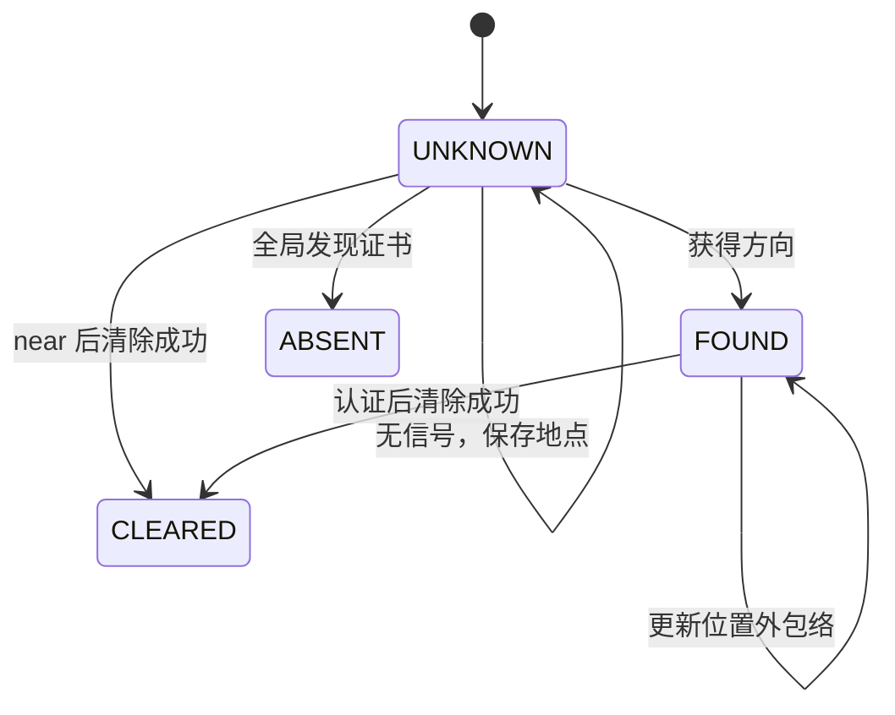

# 第 3 章　Q3：全向源的搜索、定位与清除

> 本章要回答的核心问题：机器狗只看到一次次检测与清除响应，怎样既不漏掉未知干扰源，又能保证每次清除的位置足够近，并尽量少走路？

## 3.0　学习目标与证据约定

读完本章，应能独立说明以下六件事：

1. 从圆盘覆盖推出“原点加八个外围点”的搜索骨架，并说明它保证发现什么。
2. 把带误差的示向度变成包含真源的几何约束，解释无信号为何只能排除半径 1000 m 的开圆盘。
3. 从最小包围圆得到清除证书，推导 19.8 m 阈值与最近认证清除点。
4. 解释局部主动测向的收缩、接收保证及有限步性质。
5. 区分频道身份、测向机当前频道、已发现数量与已清除数量。
6. 沿实际函数调用追踪一局运行，分清几何正确性、效率经验和官方测试证据。

本章采用下列缩写。代码行号以本工作区上传源码为准；本地求解器与官方求解器的前 502 行经逐行比较完全相同。

| 缩写 | 文件或材料 | 本章如何使用 |
| --- | --- | --- |
| `L` | [`source/Q3/q3_local_solver.py`](../source/Q3/q3_local_solver.py) | 几何与策略主实现；共 502 行。 |
| `O` | [`source/Q3/q3_official_solver.py`](../source/Q3/q3_official_solver.py) | 1–502 行同 `L`，514–712 行增加正式 HTTP 客户端和入口。 |
| `S` | [`source/Q3/q3_local_simulator.py`](../source/Q3/q3_local_simulator.py) | 本地源生成、响应、计时和统计；共 120 行。 |
| `R` | [`source/README.md`](../source/README.md) | 原程序的运行方式、参数说明和证据边界。 |
| `P` | 本次上传的 `20-B-.pdf`，题名《无线电干扰源的快速自动定位与清除》 | 第 1 页问题 3；第 2–3 页附录 1–2；第 3–4 页附录 3。原 PDF 不在仓库中。 |

外部材料分成“公开原例”和“本章推导”。公开原例有可访问的一手出处、具体节号或图号；本章补算明确标注，不能把我们自行选择的数据写成原教材例题。公开来源清单见本章末尾。

### 先看整个方法的职责

| 方法 | 通用问题 | Q3 中承担的职责 | 不能由它单独推出的结论 |
| --- | --- | --- | --- |
| 圆盘覆盖 | 有限个圆盘能否覆盖连续区域？ | 证明未知频道已经有充分发现机会。 | 某个已发现源已能安全清除。 |
| 集合成员估计 | 哪些参数仍与全部有界误差观测相容？ | 保持真源属于可行域外包络。 | 外包络中心就是真实位置。 |
| 最小包围圆及半径复核 | 一个集合能否装入足够小的圆盘？ | 产生“所有候选位置都离清除点足够近”的证书。 | 所有源都已被发现。 |
| 主动选点 | 到哪里再观测能缩小不确定性？ | 在保证接收的同时收缩单源定位域。 | 总旅行时间达到全局最优。 |
| 在线路径插入 | 新任务出现后先服务谁？ | 在固定搜索路线间安排定位与清除。 | 获得某个经典 TSP 算法的近似比。 |
| 状态机与幂等请求 | 有副作用的动作如何保持一致？ | 正确记住频道、时间、清除结果和未知请求。 | 服务端一定没有故障、一定遵守协议。 |

---

## 3.1　把题目写成一个可执行的观测模型

### 3.1.1　已知、未知与可控量

目标区域是

\[
\Omega=\{x\in\mathbb R^2:\|x\|\le 1800\}.
\]

第 \(i\) 个有效频道若存在源，位置记为 \(g_i\in\Omega\)，有效接收半径记为 \(\rho_i\in[1000,1500]\)。源数 \(N\) 满足 \(10\le N\le16\)，但机器狗不知道实际 \(N\)。20 个频道中，一个频道至多对应一个源，源的频道不随时间改变。Q3 全部为全向源，因此接收与距离有关，没有 Q4 的朝向盲区。

机器狗控制的是“在位置 \(p\)，对频道 \(i\) 做什么动作”。检测点不是先验给定的；下一点依赖先前响应。这已经是反馈决策问题。

题面给出的量必须与程序选择的量分开：

| 量 | 含义 | 来源 |
| --- | --- | --- |
| 1800 m | 源所在圆域的半径 | `P` 第 1 页。 |
| 1000–1500 m | 未知有效接收半径的区间 | `P` 第 3 页附录 2(2)。 |
| ±1° | 物理测向误差的确定性上界 | `P` 第 2 页附录 2(1)。 |
| 20 m | 光学精确定位并清除的距离条件 | `P` 第 3 页附录 2(8)。 |
| 5 m | 可直接清除的 `near` 条件 | `P` 第 3 页附录 2(9)。 |
| 995、999 m | 搜索构造和接收判定的保守半径 | 程序设计值，分别见 `L210`、`L187` 等。 |
| 19.8 m | 清除认证半径，留 0.2 m 余量 | 程序设计值，见 `L148`、`L413`。 |
| 600 m、0.1 | 插入阈值与侧移比例 | 启发式参数，见 `L239–240`。 |

### 3.1.2　三类检测响应分别证明什么

在尚未清除的有效频道上，理想物理模型为：

\[
\begin{array}{ll}
\|g_i-p\|>\rho_i &: \texttt{no\_signal},\\
\|g_i-p\|\le5 &: \texttt{near},\\
5<\|g_i-p\|\le\rho_i &: \texttt{direction}.
\end{array}
\]

不存在的频道也返回 `no_signal`。所以一次无信号不能区分“没有源”和“源离得太远”。

若返回 `direction`，设显示值为 \(\widehat\theta\)。它给出前向角楔，而不是完整直线，也不是一条没有误差的射线。真源满足

\[
\big|\operatorname{wrap}(\arg(g_i-p)-\widehat\theta)\big|\le\delta,
\qquad \|g_i-p\|\le1500.
\]

`wrap` 应理解为最短圆周角差。例如真实方向 359.9° 与读数 0.1° 相差 0.2°，不是 359.8°。代码使用三角函数构造边界方向，天然处理跨越 0° 的角楔。

同地点的误差固定是本题非常关键的条件。反复站在同一位置测同一频道，不会得到一批独立噪声样本；不能以“多测几次再平均，误差趋近于零”作为安全依据。`S18–19` 用位置相关的确定函数模拟这种性质，`L367` 用 25 m 最小移动间隔限制机会补测。25 m 是避免短基线浪费的策略值，不是题目保证的误差独立距离。

---

## 3.2　先学习圆盘覆盖，再推导九点搜索

### 3.2.1　公开原例：把二维覆盖化为圆周上的区间覆盖

Huang 与 Tseng 的论文《The Coverage Problem in a Wireless Sensor Network》§3.1、图 2 给出一个真实的圆周覆盖示例：对某个传感器，先算邻居在它圆周上覆盖的角区间，再将所有区间端点排序，扫描每段被多少邻居覆盖。图中的八个邻居产生多个重叠区间；进入一个区间加一，离开一个区间减一。论文随后以 Lemma 1、Theorem 1 连接圆周覆盖与区域覆盖，并在图 3 单独讨论重合圆心和区域边界。原文没有给这些八个邻居的一组数字坐标，本章也不补造“原文坐标”。[Q3-1]

论文同半径情形的基本构造可直接推导。两个半径为 \(r\) 的圆心距离为 \(d\)，把邻居放在被检圆心的正西方。相交弦与连心线形成直角三角形，因此覆盖弧的半角为

\[
\alpha=\arccos\frac{d}{2r},
\]

对应区间是 \([\pi-\alpha,\pi+\alpha]\)。

**本章补算。** 若 \(r=1,d=1\)，则 \(\alpha=\pi/3\)，西边邻居覆盖本圆周上 120° 到 240° 的弧。一个邻居只覆盖这段圆弧，不能据此宣布整个区域已覆盖。这个小算例的用途是读懂 `arc_covered_by_disk`，并非 Q3 的站点布置。

### 3.2.2　为什么 Q3 可以把“源被看见”变成“圆盘覆盖”

对于任一全向源，\(\rho_i\ge1000\)。若某次扫描位置 \(s\) 满足

\[
\|g_i-s\|\le999,
\]

则必在它的有效接收范围内。因此，只要扫描点集合 \(\mathcal S\) 满足

\[
\Omega\subseteq\bigcup_{s\in\mathcal S} B(s,999),
\]

并且仍为未知的频道在这些点都检测过，就不能再藏着一个从未发现的源。这是把未知接收半径替换成共同保证半径的稳健处理。

注意这里的圆盘以**检测点**为圆心；物理信号圆盘以**源**为圆心。两者能够互换，是欧氏距离对称：\(\|g-s\|=\|s-g\|\)。

### 3.2.3　构造：原点加一个正八边形的顶点

先用原点的圆盘覆盖中心，外围放 \(m\) 个等角度站点：

\[
s_k=a\left(\cos\frac{2\pi k}{m},\sin\frac{2\pi k}{m}\right),
\qquad k=0,\ldots,m-1.
\]

令设计覆盖半径为 \(\rho=995\)，目标圆半径 \(R_\Omega=1800\)，相邻站点夹角的一半为 \(\alpha=\pi/m\)。任意方向与最近外围站点方向的角差至多 \(\alpha\)。

在最难覆盖的外边界扇区中点，源到最近站点的距离平方是

\[
R_\Omega^2+a^2-2R_\Omega a\cos\alpha.
\]

要求它不超过 \(\rho^2\)，解关于 \(a\) 的二次不等式，得到

\[
a\in\left[
R_\Omega\cos\alpha-\sqrt{\rho^2-R_\Omega^2\sin^2\alpha},\;
R_\Omega\cos\alpha+\sqrt{\rho^2-R_\Omega^2\sin^2\alpha}
\right].
\]

`ring_sites` 选择较小根再向外增加 1 m：

\[
\boxed{a=1800\cos\frac{\pi}{m}
-\sqrt{995^2-1800^2\sin^2\frac{\pi}{m}}+1.}
\]

增加的 1 m 使站点从较小根向二次不等式内部移动。对默认 \(m=8\)，它确实仍在合法区间内；不能脱离区间检查，把“加 1”当成任何几何问题都成立的规则。

根式有意义要求 \(1800\sin(\pi/m)\le995\)，由此得到该对称构造需要 \(m\ge6\)。这是**该环形构造的条件**，不是关于任意平面布点最少传感器数量的全局最优定理。`ring_sites()` 的函数形参默认是 7，但正式入口实际使用 `Config(ring_m=8)`，读代码时应以后者为准。

### 3.2.4　仅覆盖外边界还不够：补完整个圆域的证明

半径 \(t\le995\) 的点由原点覆盖。只需证明 \(995\le t\le1800\) 的环带也被外围站点覆盖。

对与最近站点夹角为 \(\varphi\) 的点，\(|\varphi|\le\alpha\)，有

\[
\|x-s_k\|^2
=t^2+a^2-2ta\cos\varphi
\le f(t):=t^2+a^2-2ta\cos\alpha.
\]

\(f(t)\) 是凸二次函数。在闭区间 \([995,1800]\) 上，其最大值出现在端点。因此只要检查

\[
f(995)\le995^2,\qquad f(1800)\le995^2,
\]

就覆盖整个环带。这一步排除了“只画出边界圆被覆盖，但内部有洞”的漏洞。

默认九点方案的补算结果为：

| 检查量 | 数值 |
| --- | ---: |
| 外围站点距原点 \(a\) | 945.973419 m |
| 外边界最坏距离 \(\sqrt{f(1800)}\) | 994.278623 m |
| 内环端点最坏距离 \(\sqrt{f(995)}\) | 381.705913 m |
| 相邻外围站点距离 \(2a\sin(\pi/8)\) | 724.016710 m |
| 从原点依次走完八外围点的开放骨架长度 | 6014.090390 m |

八外围点约为

\[
(945.973,0),\ (668.904,668.904),\ (0,945.973),\ (-668.904,668.904),
\]

\[
(-945.973,0),\ (-668.904,-668.904),\ (0,-945.973),\ (668.904,-668.904).
\]

“开放骨架”不包含最后返回原点，因为题目没有这个要求；也不包含后续定位、清除及重新接上搜索路线的绕行。

### 3.2.5　为什么程序还要运行 `covers_arena`

解析证明解释默认九点为何有效；运行时证书还承担另一个任务：判断**目前真正完成扫描的点**是否已经足够。它不能把尚未访问的计划点当成完成的工作。

一般情况下，用半径 \(r\)、圆心 \(s\) 的圆盘覆盖圆心 \(c\)、半径 \(R\) 的圆周。令 \(d=\|s-c\|\)，连心线方向为 \(\beta\)。部分相交时余弦定理给出

\[
h=\arccos\frac{d^2+R^2-r^2}{2dR},
\]

覆盖角区间是 \([\beta-h,\beta+h]\)。跨越 0 的区间分成两段；完全包含、完全分离、同心情况分别处理。`L156–166` 实现这些分支，`merge_intervals` 排序合并，`interval_subset` 检查目标弧是否全部被并集包含。

`covers_arena` 的两个检查为：

1. \(\partial\Omega\) 的整圈是否被全部扫描圆盘覆盖；
2. 每个扫描圆周落在 \(\Omega\) 内的部分，是否被其他扫描圆盘覆盖。

第二步的作用是寻找内部暴露的圆弧。若存在一个内部未覆盖区域，它与覆盖区域相邻处必有某个扫描圆的暴露弧；只验外边界发现不了这样的洞。反过来，在圆域边界已覆盖、圆心重合已去重的前提下，内部若有洞，就会违反第二步。因此这是一种连续圆盘并集覆盖判据，不是有限网格抽样。`L192–194` 的去重也与公开论文专门讨论重合圆心的问题相呼应。

严格几何命题针对实数精确运算。当前实现用浮点数、角区间容差和 999 m 相对于物理 1000 m 的余量，属于有保护的数值实现；它没有使用带定向舍入的区间算术来逐条证明机器浮点误差上界。答辩应同时说清理论判据和实现层次。

### 3.2.6　九点的数量由正确性和效率共同决定

| 外围点数 \(m\) | \(a\)/m | 原点加外环的开放骨架/m | 连续 999 m 覆盖检查 |
| ---: | ---: | ---: | --- |
| 6 | 1135.552 | 6813.313 | 通过 |
| 7 | 1006.239 | 6245.327 | 通过 |
| 8 | 945.973 | 6014.090 | 通过 |
| 9 | 910.771 | 5894.803 | 通过 |
| 10 | 887.897 | 5826.653 | 通过 |

这张本章补算表说明两件事。第一，九点不是唯一正确的覆盖方案。第二，站点更多时骨架反而可以略短，但检测成本上升；站点更少时又会损失部分保证接收的机会补测。不能只优化外围点数或只比较骨架长度。

`R127–129` 把九点、600 m、0.1R 描述为有限配置比较中的稳健选择。由于本仓库没有那批比较的逐局原始记录，本章不把 README 中的耗时比例和参数优胜结论重新包装成已独立复核的实验。

还有一个容易漏掉的事实：默认 \(a<995\)，所以仅八个外围圆盘其实也覆盖原点及整个圆域。把上面的凸函数检查区间改为 \([0,1800]\)，有 \(f(0)=a^2<995^2\) 且外端也通过，即可证明；本章实际调用 `covers_arena(ring_sites(8))` 也返回真。原点扫描的作用是利用出发位置提前获得源的信息，便于在线决策。因此九点是当前执行策略，不能被称为几何上不可再减的站点数。

---

## 3.3　集合成员定位：每一步都保留真源

### 3.3.1　公开原例：Jaulin 的四地标定位题

Luc Jaulin 的《Codac2: Python manual》§8.3，印刷页 15–16，给出四地标的有界距离与方位测量，并给出求解程序。原题数据如下；角度单位为弧度。[Q3-2]

| 地标 \(m^{(i)}\) | 距离区间 | 方位区间 |
| --- | --- | --- |
| \((6,12)\) | \([10,13]\) | \([0.5,1]\) |
| \((-2,-5)\) | \([8,10]\) | \([-3,-1.5]\) |
| \((-3,10)\) | \([5,7]\) | \([1,2]\) |
| \((3,4)\) | \([6,8]\) | \([2,3]\) |

未知机器人位置 \(p\) 与一条测量相容，当且仅当存在允许的 \(d,\alpha\) 使

\[
m^{(i)}=p+d(\cos\alpha,\sin\alpha).
\]

原解用极坐标区域的分离算子构造每个相容集合，并用允许剔除一条数据的松弛交集处理四条观测。它展示的是“保留所有相容位置”的方法，不是对四个中点做最小二乘。

**对原题数据的本章补算。** 取 \(p=(-1,4)\)，对应四地标的距离约为 \(10.630,9.055,6.325,4.000\)，方位约为 \(0.852,-1.681,1.893,0\)。前三条都落在原题区间内，第四条不相容，所以这个点能通过“至多剔除一条”的条件。这个检验点是本章挑选的，并非原文宣称的唯一解。

Q3 与原例的角色有区别：原例已知地标、估计机器人；Q3 已知机器狗位置、估计源。把式子改写成

\[
g=p+d(\cos\alpha,\sin\alpha)
\]

即可看到共同的约束结构。Q3 不允许任意丢掉一条真实观测；题设承诺误差界成立，故主程序求普通交集。这里引用区间教材是说明集合估计思想，Q3 实际没有调用 Codac。

### 3.3.2　精确可行集与程序外包络

设已经收到的正向观测为 \((p_j,\widehat\theta_j)\)，无信号观测为 \(q_k\)。有效频道的真实位置属于

\[
F_i=\Omega\cap\bigcap_j\left(W(p_j,\widehat\theta_j,\delta)\cap B(p_j,1500)\right)
\cap\bigcap_k\{x:\|x-q_k\|>1000\}.
\]

这里仍是保守的物理信息表达：没有维护未知 \(\rho_i\) 的完整联合约束，也没有利用 `direction` 所隐含的 \(\|g-p\|>5\)。少用有效信息会使集合偏大，不会因为这一点删掉真源。

程序用凸多边形 \(P_i\) 外包络维护它，核心不变量是

\[
\boxed{g_i\in F_i\subseteq P_i.}
\]

“外包络”意味着其中可能含有已经不物理可行的点。算法宁可多留一些候选点，也不能删掉真源后给出错误清除证书。

### 3.3.3　初始圆域必须用外切多边形

`arena_polygon` 用 48 边形初始化每个频道的 \(P_i\)。顶点半径是

\[
R_{48}=\frac{1800}{\cos(\pi/48)},
\]

顶点角度增加 \(\pi/48\)，使边与半径 1800 的圆相切。因此 \(\Omega\subset P_i\)。若把顶点直接放在半径 1800 的圆上，就得到内接多边形，圆弧和边之间的合法源可能一开始就被删掉。`L59` 的强调具有证明意义。

### 3.3.4　示向角楔怎样变成两个半平面

设 \(\ell=(\cos(\widehat\theta-\delta),\sin(\widehat\theta-\delta))\)，\(u=(\cos(\widehat\theta+\delta),\sin(\widehat\theta+\delta))\)。由于角宽小于 180°，前向角楔可写成

\[
\operatorname{cross}(\ell,x-p)\ge0,
\qquad
\operatorname{cross}(u,x-p)\le0.
\]

其中 \(\operatorname{cross}((a,b),(c,d))=ad-bc\)。为了统一调用 `clip(poly,n,b)`，程序将两式写为 \(n\cdot x\le b\)：

\[
n_1=(\ell_y,-\ell_x),\quad b_1=n_1\cdot p;
\qquad n_2=(-u_y,u_x),\quad b_2=n_2\cdot p.
\]

`clip` 依次查看多边形的每条边。设端点的带符号量为 \(f_a=n\cdot a-b\)、\(f_c=n\cdot c-b\)，当一内一外时，交点参数是

\[
t=\frac{f_a}{f_a-f_c},\qquad x=a+t(c-a).
\]

保留内部端点和交点，就得到裁剪结果。`L40` 把边界向外推极小距离；`L50–55` 清理重复顶点。它实现的是半平面交的逐边裁剪版本。

### 3.3.5　为什么角宽是 1.0051°

物理角误差只有 ±1°，但程序看到的可能是两位小数显示值。设未量化读数 \(\widetilde\theta\) 满足

\[
d_{\mathbb S^1}(\widetilde\theta,\theta_{\rm true})\le1^\circ,
\]

显示值四舍五入到 0.01°，则其量化误差至多 0.005°。用圆周距离的三角不等式，得到

\[
d_{\mathbb S^1}(\widehat\theta,\theta_{\rm true})\le1.005^\circ.
\]

再加 0.0001° 计算裕量，代码定义

\[
\boxed{\delta=1.0051^\circ\approx0.0175423043\ {
m rad}.}
\]

这修正的是**从仪器到程序读数的包络**，没有修改题设的物理误差。一个具体例子是：真实方向 0.006°、未量化读数 1.006°，物理误差正好 1°；显示为 1.01° 后，显示角与真角相差 1.004°。若对显示角只开 ±1° 的楔，就会把这个合法真角排除。

`S28` 先模 360 再 `round(...,2)`，因此本地模拟器极靠近 360° 的输出在表示上可能成为 360.0；本地三角函数能处理这个等价角。`O585` 对官方响应要求 \([0,360)\)。这说明本地模拟与正式协议校验并不完全等价，角度归一化边界应由正式接口契约核对；不能把本地运行当成正式接口全覆盖测试。

### 3.3.6　第三个半平面为什么仍然安全

程序没有用很多线段拟合接收圆。它取

\[
R=\min\left(1500,\max_{v\in\operatorname{vert}(P_i)}\|v-p\|+\varepsilon\right),
\]

沿当前示向轴 \(e=(\cos\widehat\theta,\sin\widehat\theta)\) 加上

\[
e\cdot(x-p)\le R.
\]

因为 \(e\cdot(g-p)\le\|g-p\|\le R\)，这个半平面包含真源。它与两条角楔边界形成三角形；三角形远端角点的距离略大于 \(R\)，所以只是圆扇形的外包络，不是精确圆扇形。好处是保留凸多边形运算，并能推导简单收缩界。

为什么可以只看顶点求最大距离？任意 \(x=\sum_k\lambda_kv_k\)，\(\lambda_k\ge0\)、\(\sum_k\lambda_k=1\)，都有

\[
\|x-p\|\le\sum_k\lambda_k\|v_k-p\|\le\max_k\|v_k-p\|.
\]

顶点本身也属于多边形，故最大值确实在顶点达到。`maxdist` 是后续多条安全证书共用的基础。

### 3.3.7　无信号为什么排除 1000 m，而不是 1500 m

若频道存在未清除源，且 \(\|g-p\|\le1000\)，由于 \(\rho_i\ge1000\)，一定能接收。因此 `no_signal` 推出

\[
\|g-p\|>1000.
\]

它不能推出 \(\|g-p\|>1500\)：一个接收半径 1050 m、距离 1200 m 的源就会无信号。把 1500 m 圆盘删掉会误删真源。

删去圆盘后，集合通常不凸。`exclude_disk_hull` 使用

\[
P_i\leftarrow\operatorname{conv}\left(P_i\setminus\operatorname{int}B(p,1000)\right).
\]

其候选极点来自保留的原多边形顶点与边—圆交点，随后取凸包。圆周凹缺口的内部弧点无需作为外包络极点；若整个圆盘在多边形内部，这次取凸包甚至可能恢复为原多边形。那是信息损失，不是安全性损失。

`L84` 将排除半径稍减小，进一步避免浮点误差误删。未知频道先把无信号地点存入 `negatives`；第一次得到正向测量后才建立窄定位域，并重新施加历史排除信息。每次新的正向观测后重放这些排除条件，也可能让过去“凸化后没用”的信息再次发挥作用。

---

## 3.4　从最小包围圆到清除证书

### 3.4.1　公开原例：CGAL 的共线点例程

CGAL《Bounding Volumes》用户手册中 “Bounding Spheres for the Homogeneous Kernel” 的公开例程生成 100 个点：\((0,0),(-1,0),(2,0),(-3,0),\ldots\)，分别演示开启和关闭随机打乱顺序。教材借它展示输入顺序对增量算法效率的影响。[Q3-3]

**原例数据的本章推导。** 100 点的最左、最右点为 \((-99,0)\) 与 \((98,0)\)，间距 197。任何覆盖圆半径至少是 98.5；以 \((-0.5,0)\) 为中心、半径 98.5 的圆又包含全部点。因此原例的最小包围圆就是

\[
c=(-0.5,0),\qquad r_*=98.5.
\]

两点便能支撑最优解，其余 98 点只需检验是否在圆内。随机打乱影响如何找到它，不改变这个几何答案。

### 3.4.2　MEC 的定义与支撑点

最小包围圆半径为

\[
r_*(P)=\min_c\max_{x\in P}\|x-c\|.
\]

对凸多边形，只需将顶点作为输入。在二维中，最小圆可以由不超过三个边界支撑点确定：一个点对应零半径，两个点通常是直径端点，三个点对应非退化三角形的外接圆。CGAL 的 `Min_circle_2` 文档明确区分“包含全部点”“支撑集决定该圆”“支撑集不可再删”三项有效性条件。[Q3-4]

Welzl 的原始论文给出随机增量思想和期望线性时间结果。[Q3-5] 本程序的三层增量过程与其“新出现的外部点必须成为边界约束”的思想一致；两边界点子问题还可对照 Project Nayuki 的作者公开实现 `_make_circle_two_points`。[Q3-6]

`mec` 的读法是：

1. 用固定种子 271828 打乱顶点，保证重跑确定性。
2. 新点已在当前圆内，直接继续。
3. 新点在圆外，先把它作为单点圆；遇到另一个圆外点，用两点直径圆。
4. 对还在外部的旧点，计算三点外接圆，并按直线两侧保留必要的极端候选圆。
5. 最后从最终中心重新计算对**所有原始输入顶点**的最远距离，再加 \(10^{-6}\) m。

第五步尤其重要：真正交给策略作证书的半径是 `L146` 的复核半径，不是增量过程内部那个可能受容差影响的半径。即使一个候选中心未达到最优，只要所有顶点的半径上界可靠，它仍可用于安全性；损失的是清除时机和效率。

不能把“标准算法期望线性”直接说成“本实现每次必定线性”。本实现使用固定打乱、嵌套 Python 循环和切片，最坏运行开销与标准随机模型的平均分析要分开。

### 3.4.3　真正需要的清除条件是一个全称命题

在点 \(q\) 清除频道 \(i\)，需要保证

\[
\forall x\in P_i,\quad\|x-q\|\le20.
\]

若 \(P_i\subseteq B(c,r)\) 且 \(r\le19.8\)，到 \(c\) 清除即可。注意结论不是“源很可能在中心附近”，而是“即使源处于外包络最不利的位置，距离也不超过认证上界”。

精确可用清除点集合可以写成

\[
\mathcal C_{20}(P_i)=\bigcap_{v\in\operatorname{vert}(P_i)}B(v,20).
\]

程序不直接求这个圆盘交集，而使用一个简单的认证子集。由三角不等式，若

\[
\|q-c\|\le19.8-r,
\]

则

\[
\max_{x\in P_i}\|x-q\|
\le r+\|c-q\|\le19.8<20.
\]

因此

\[
\boxed{B(c,19.8-r)\subseteq\mathcal C_{20}(P_i).}
\]

19.8 m 是人为留出的 0.2 m 距离余量；它既不是题目要求，也不是“98% 置信区间”。若精确最小包围圆半径大于 20 m，就不存在一个点可对整个 \(P_i\) 保证 20 m 清除；而审计半径大于 19.8 m 只表示当前保守策略尚未认证，不能据此说物理上一定无法清除。

### 3.4.4　不必每次走到圆心：最近认证清除点

当前机器狗位置为 \(p\)，令 \(s=19.8-r\)。若 \(\|p-c\|\le s\)，当前位置已获证，可以原地清除。否则把 \(p\) 投影到圆盘 \(B(c,s)\)：

\[
\boxed{q=c+s\frac{p-c}{\|p-c\|}.}
\]

这是离 \(p\) 最近的认证子集中的点，对应 `nearest_certified_clear`。程序只声称“在该认证子圆盘内最近”，没有声称在更大的精确集合 \(\mathcal C_{20}\) 中全局最近。

**本章算例。** 若 \(c=(100,0)\)、\(r=10\)、\(p=(0,0)\)，则 \(s=9.8\)，最近认证清除点是 \(q=(90.2,0)\)。对任何真源 \(g\in B(c,10)\)，都有 \(\|g-q\|\le19.8\)。比走到圆心少走 9.8 m，节省 1.96 s 移动时间。

### 3.4.5　为什么“直径不超过 40 m”仍不能替代 MEC

任意可被半径 20 m 圆盘覆盖的集合，其直径当然不超过 40 m；反向不成立。边长 40 m 的等边三角形直径为 40 m，其最小包围圆半径却为

\[
\frac{40}{\sqrt3}\approx23.094>20.
\]

所以 Q1 的直径与 Q3 的清除安全指标有关，但不能相互替代。这也是本题跨问联系中最适合答辩追问的一点。

---

## 3.5　主动定位为什么能继续收缩

### 3.5.1　推导代码中的独立三角形包围圆

把测量点移到原点，并把示向轴旋到横轴。`bearing_update` 的三个半平面给出三角形

\[
T_R=\operatorname{conv}\{(0,0),(R,R\tan\delta),(R,-R\tan\delta)\}.
\]

设其外接圆心为 \((h,0)\)，圆同时通过原点与远端角点，故

\[
h^2=(R-h)^2+R^2\tan^2\delta.
\]

展开得

\[
2Rh=R^2(1+\tan^2\delta)=R^2\sec^2\delta,
\]

因此

\[
\boxed{h=\frac{R}{2\cos^2\delta}.}
\]

该外接圆半径也是 \(h\)，因而包住整个三角形。取第一次正向观测最坏 \(R=1500\)，得到

\[
h\approx750.230847\ {
m m}<751\ {
m m}.
\]

这说明第一次正向观测后，至少存在一个相当小的有保证圆包络。`L305–308` 构造这个三角形圆心，再对当前多边形全顶点复核半径；若比 `mec` 的结果更小就采用它。它是独立的几何后备候选，避免把局部进展证明完全押在某次 MEC 数值求解上。实际数值会比理想公式多极小容差。

### 3.5.2　侧移 0.1R 的几何含义

设当前包络 \(P_i\subseteq B(c,r)\)。机器狗从当前位置朝圆心看，单位方向为 \(d\)，垂直方向为 \(v=(-d_y,d_x)\)。`_tracking_point` 构造

\[
q_\pm=c\pm0.1r\,v.
\]

小侧移可以改善与旧示向线的交会角，同时仍使机器狗走到不确定区域附近。它不是把 Q2 的完整极小极大选址算法嵌入 Q3，也没有逐点枚举所有可能第二示向度。

对任一候选点，由三角不等式

\[
\max_{x\in P_i}\|x-q_\pm\|\le r+0.1r=1.1r.
\]

第一次正向观测后，\(1.1r\) 约不超过 825.254 m，远小于 999 m。因此在理想几何条件下，这些局部点有共同接收保证。代码仍逐顶点检查 `maxdist(q,t.poly)<=999`，不只相信概略推导。

候选点没有通过检查时返回圆心 `c`。这是一个安全回退，因为已认证的包络半径控制了所有可能源到圆心的距离。若两侧都可用，则按移动距离、以及到下一搜索站点距离的 0.15 倍评分。0.15 是路线偏好参数。

### 3.5.3　局部收缩界与 18 步保护

到达局部点 \(q\) 后，新的范围上界满足 \(R_{\rm new}\le1.1r\)。套用三角形包围圆公式，得到理想收缩界

\[
r_{\rm new}\le\frac{1.1}{2\cos^2\delta}\,r
\approx0.5501693\,r.
\]

于是第一次正向观测半径约 750.231 m 后，保守地再作 7 次这样的有效方向观测，便足以使理想上界低于 19.8 m。若得到 `near`，则可更早直接清除。有限次补测的理由是几何收缩，不是“随机走总会碰到”。

代码把每次 `_serve` 的局部测量限制设为 18 次，并检查新半径不能大于 \(0.9r+10^{-3}\)。0.9 比理论 0.551 宽松，用作异常检测；18 是实现保护界，不能倒过来当成最紧复杂度结论。

**必须区分两类观测。** 上述收缩推导针对主动走到 `q_±` 或 `c` 后的局部测向。途中已有停靠点的机会补测没有被要求满足这一比例；它可能提供很少的信息。源码也只在 `_serve` 的 `L425–426` 检查收缩，`_sweep_found` 没有同一检查。

如果在“所有可能位置都小于 999 m”的点得到 `no_signal`，程序立即报错。这意味着物理假设、历史响应或数值不变量至少有一项失效。它不会继续随机探索，也不会悄悄把该源记为已完成。

---

## 3.6　状态机：发现一个源与完成整场任务

### 3.6.1　公开原例：MIT 的闸机状态机

MIT 6.01SC 的 Lecture 2 handout 第 5–6 页用闸机解释有记忆的系统：状态为 `locked`、`unlocked`，输入为 `coin`、`turn`、`none`。投币转到解锁，转动转到锁定；没有动作时保留原状态，因此同一个 `none` 输入在两个状态下会产生不同输出。讲义还给出 `getNextValues(state, inp)` 的实现。[Q3-7]

这个例子教的是：输入本身不足以决定结果，还必须知道旧状态。Q3 中的“切换到频道 7”是否收费，也取决于当前测向频道；“返回无信号”意味着什么，还取决于这个频道以前有没有被确认存在、是否已经清除。

### 3.6.2　每个频道的四个状态

`Track.status` 的含义如下：

| 状态 | 已经知道什么 | 仍需完成什么 |
| --- | --- | --- |
| `UNKNOWN` | 尚未收到能够确认该频道存在源的响应。 | 继续执行发现扫描，或者得到全局不存在证书。 |
| `FOUND` | 收到过方向响应，维护着位置外包络。 | 收缩到清除条件并成功执行清除。 |
| `CLEARED` | 清除接口明确返回成功。 | 不再测量或重复清除此频道。 |
| `ABSENT` | 由数量上界或连续覆盖证明该频道没有未发现源。 | 无需继续搜索。 |



`near` 分支没有先改成 `FOUND`，而是直接调用 `_clear`。这符合“已经离源不超过 5 m”的更强证据。只有清除响应为 `success` 才计入 `CLEARED`。

### 3.6.3　源数上界如何形成完成证书

记 \(F\) 为 `FOUND` 频道数，\(C\) 为 `CLEARED` 频道数。因为每个源有唯一频道，且只对不同频道计数，有

\[
F+C\le N\le16.
\]

一旦 \(F+C=16\)，就推出 \(N=16\)，所有未知频道都不存在源，搜索可以结束；已发现但未清除的 \(F\) 个源仍须继续处理。`_certify_and_prune` 在 `L334–338` 实现此逻辑，把证书原因记为 `cardinality`。

一旦 \(C=16\)，则连清除任务也已完成，`run` 直接退出主循环。这里利用的是上界 16。下界 10 不能用作停止条件：清除了 10 个，仍可能还有 1–6 个没有发现。

`F+C` 是不同频道数量，不是方向读数条数。一个频道测了 20 次仍只贡献 1 个源。`Track.measurements` 只记录该频道收到方向响应的次数，也不是整局检测动作数。

### 3.6.4　连续覆盖如何证明其余频道不存在

若 \(F+C<16\)，可以依靠已经完成的扫描点集合 \(\mathcal S\) 的圆盘覆盖证书。考虑扫描结束后仍处于 `UNKNOWN` 的任意频道 \(i\)：

1. 它在每一次过去的 `_scan` 时也必为 `UNKNOWN`；否则状态不会退回未知。
2. `_scan` 对当时所有未知频道都检测，因此这个频道在每个 \(s\in\mathcal S\) 均有一次检测。
3. 若它存在源 \(g_i\in\Omega\)，覆盖证书保证存在 \(s\) 使 \(\|g_i-s\|\le999\)。
4. 全向源在该距离必能接收，响应应为 `direction` 或 `near`，与它仍为未知矛盾。

因此该频道可以标记 `ABSENT`。这个证明用到了“每个仍未知频道都扫描过所有已记录的扫描点”，不能仅证明机器狗走过这些坐标。

机会补测 `_sweep_found` 只检测已发现频道，所以它所在点不会自动加入 `scans`，不能拿来证明从未发现的频道不存在。单纯经过某点也不算扫描，因为移动中不能检测。

### 3.6.5　全清除需要两类证书同时成立

整场任务完成条件为

\[
\underbrace{\text{没有遗漏的未知源}}_{\text{数量上界或覆盖证书}}
\quad\land\quad
\underbrace{\text{所有已经发现的源均成功清除}}_{\text{逐源清除响应}}.
\]

安全清除一个源，只证明这次动作没有离它太远；不能证明别处没有源。反过来，完成九点扫描只证明已经发现了所有源；未清除的 `FOUND` 仍必须服务。

输出字段 `coverage_certified` 只在 `search_reason=='disk_union'` 时为真。若原因是 `cardinality`，它可以为假而任务仍正确完成。读输出应看 `search_certificate` 和频道状态，不要把这个布尔值误读成“整场是否成功”。

### 3.6.6　测向机当前频道是另一份状态

源频道编号与“接收机当前调谐频道”是不同概念。策略里的 `self.channel`、正式客户端里的 `current_channel`、本地模拟器里的 `channel` 都记录后者。

| 动作 | 位置变化 | 当前测向频道变化 | 服务计时 |
| --- | --- | --- | --- |
| `measure(p,i)` | 移动到 \(p\) | 改为 \(i\) | 检测 5 s；若原频道不同另加 1 s。 |
| `clear(p,i)` | 移动到 \(p\) | 保持原测向频道 | 本地成功 5 s，失败 3 s；清除目标编号不等于调谐动作。 |

对应代码是 `L284` 与 `L316` 的区别、`O656–657` 的区别，以及 `S23` 与 `S30–34`。`_scan` 优先检测当前频道（若它仍未知），能够省一次进入扫描序列的换台。

**本章状态核算例。** 假定均在同一点、相应清除可成功，初始频道为 1，依次执行 `measure(...,4)`、`clear(...,7)`、`measure(...,4)`。接收机频道依次为 4、4、4；动作耗时为 6、5、5 s，共 16 s。若误把清除动作当成切到 7，就会把第三步多算 1 s，还会影响后续扫描排序。

---

## 3.7　在线路线：哪里有证明，哪里是启发式

### 3.7.1　公开原例一：插入方法比较的是新增路线成本

Cook、Cunningham、Pulleyblank、Schrijver 的《Combinatorial Optimization》第 7 章 §7.2，印刷页 243–245，介绍插入构造：把新节点插入现有环游，使新增成本较小。书中同一个 1173 节点测试实例，图 7.2 的最近插入路线长度为 72337，图 7.3 的最远插入为 65980。书中明确把构造启发式、局部改进和最坏界区分开。[Q3-8]

这是真实的教材实例比较；它不说明“最远插入在 Q3 一定最好”，因为 Q3 的源位置还未知，且有测向服务成本。我们要借用的是新增距离的思想。把当前边 \(p\to s\) 换成 \(p\to c\to s\)，新增长度为

\[
\Delta(p,c,s)=\|p-c\|+\|c-s\|-\|p-s\|\ge0.
\]

**本章补算。** \(p=(0,0),s=(1000,0),c=(500,100)\) 时，\(\Delta=2\sqrt{500^2+100^2}-1000\approx19.804\) m。若 \(r=100\) m，代码评分约为 119.804 m，低于 600 m，因此这个已发现任务可以被插入。

### 3.7.2　公开原例二：启发式路线和已知最优解可以不同

Larson 与 Odoni 的《Urban Operations Research》§6.4.6，Example 9 给出一个垃圾收集路线实例：仓库加九个收集点。教材先得到长度 258 的最小生成树，加入长度 143 的匹配，得到长度 401 的欧拉游程；跳过重复访问后路线为 371，而此实例的已知最优值是 331。随后进一步局部调整可降为 347。[Q3-9]

这个公开算例最值得学习的不是记住那条路线，而是同时报告“构造结果”“改进结果”“比较基准”。同理，Q3 若只运行一种配置，就不能写成“路线已优化到全局最短”。

上述两份教材的静态 TSP 都预先知道待访问节点。Ausiello 等人的在线旅行商研究则明确研究按时间陆续到达的请求，并区分是否要求回到起点；其作者所在大学公开研究记录可核对这种模型定义。[Q3-10] Q3 的新任务由机器狗主动搜索发现，位置还会随测向收缩成变化的服务区域，和该论文的请求发布模型也有差别。故本文只作模型对照，不套用其竞争比。

### 3.7.3　Q3 实际用的评分和选择规则

设下一待扫描点为 \(s\)，已发现源 \(i\) 当前包络为 \(B(c_i,r_i)\)。`_choose` 使用

\[
J_i=\underbrace{\|p-c_i\|+\|c_i-s\|-\|p-s\|}_{\text{经圆心的新增距离}}
+\underbrace{r_i}_{\text{不确定性惩罚，单位 m}}.
\]

选择最小 \(J_i\) 的源；只有 \(J_i\le600\) m 才在下一扫描站点之前服务。否则先走搜索骨架。

这里的 \(r_i\) 是经验惩罚：实际服务可能经过多个局部测量点，最后清除点也不等于旧圆心，因此“经圆心的两段路”并不是真实最终绕行长度。600 m 换算成纯移动约 120 s，但评分还含不确定性项，不能称为精确 120 s 调度预算。

没有下一个搜索点时，`_choose` 用 \(\|p-c_i\|+r_i\) 选择下一个已发现源，确保继续清除剩余任务。`deferred` 对照模式只是在仍有搜索点时暂缓服务，骨架结束后仍会进入这个分支。

### 3.7.4　机会补测复用的是停靠位置，不是免费观测

`_sweep_found(p)` 会考虑所有尚未清除、半径仍大于 19.8 m 的已发现源。它还要求：

\[
\|p-p_{\rm last}\|\ge25,
\qquad
\max_{x\in P_i}\|x-p\|\le999.
\]

第一项避免紧挨最近一次有效方向观测点再测；第二项保证所有可能源位置都能接收。此处少的是额外移动，检测的 5 s 和可能的换台 1 s仍照计。

源码中的检查只对该频道的最近一次方向观测点 `last`，不是对全部历史地点做全局去重；经历其他地点后，仍可能再次回到更早的位置。答辩描述应与这个实际判断一致。

`opportunistic_clear=True` 的名字容易误导：在当前主线里，它控制 `_serve` 结束后调用 `_sweep_found`。这主要是“完成一次服务后，再给其他未清除频道补测”，并非把所有半径已小于 19.8 m 的源立即逐个清除。事实上 `_sweep_found` 会跳过这些小半径源，等待调度器再服务。

### 3.7.5　默认主线和研究分支必须分开

| 配置项 | 默认值 | 当前主线中的作用 |
| --- | --- | --- |
| `ring_m` | 8 | 原点加八外围点。 |
| `offset` | 0.10 | 主动定位侧移 \(0.1r\)。 |
| `insert_m` | 600.0 | 路线插入评分门槛。 |
| `negative` | `True` | 使用全向无信号排除信息。 |
| `opportunistic` | `True` | 扫描后复用停靠点补测已发现源。 |
| `opportunistic_clear` | `True` | 服务结束后补测其他已发现源。 |
| `mode` | `integrated` | 搜索与服务交织执行。 |
| `incidental` | `False` | 不在服务终点另加全未知频道扫描。 |
| `prune` | `False` | 不逐个删除未来环形站点。 |
| `rotate` | `False` | 不按首测方向旋转搜索环。 |
| `speculative_r` | 0.0 | 不在尚未认证时试探清除。 |

`run_case` 使用不改参数的 `Config()`。本章不会把关闭的研究分支当作默认算法成果。源码中也没有 2-opt：没有枚举两条路线边再进行交换的循环，`Config` 注释还明确说明不声称实现 2-opt。

---

## 3.8　时间会计：优化目标怎样落到每一个动作

### 3.8.1　公开原例：模拟时间与实际等待时间

SimPy 官方入门 “Basic Concepts → Our First Process” 给出一辆车交替停车 5 个时间单位、行驶 2 个时间单位的完整例子。运行到模拟时刻 15 时，事件依次发生于 0、5、7、12、14。它用 `env.now` 表示模拟时钟，`Timeout` 安排未来模拟事件。[Q3-11]

用这组公开数据手算一个周期，停车 5 加行驶 2 等于 7，第二周期结束于 14。这说明事件累计的模拟时间和执行 Python 程序花的真实时间是两个量。

Q3 的虚拟时钟由接口返回。检测动作已让模拟器推进 5 s，客户端无需再 `sleep(5)`。正式客户端的 `time.sleep` 用于连接等待和网络重试退避，消耗的是现实预算，不替代或增加题目中的检测服务时间。

### 3.8.2　逐动作成本

若当前位置为 \(p\)，当前测向频道为 \(j\)，则检测动作到 \(q\) 测频道 \(i\) 的增量为

\[
\Delta T_{\rm measure}=\frac{\|q-p\|}{5}+5+\mathbf1_{i\ne j}.
\]

本地模拟器清除动作的增量为

\[
\Delta T_{\rm clear}=
\frac{\|q-p\|}{5}+
\begin{cases}
5,&\text{成功：3 s 光学定位加 2 s 清除},\\
3,&\text{失败：只付光学定位时间}.
\end{cases}
\]

失败计 3 s 是 `S33` 中的本地规则；完整官方失败响应与计费语义仍应以官方接口附件为准。官方客户端在发送清除前按 5 s 检查预算上界，见 `O645–647`。

整局本地成本恒等式为

\[
\boxed{T=\frac{L_{\rm move}}5+5M+S_{\rm switch}+5C+3F_{\rm clear}.}
\]

这里 \(M\) 是全部检测次数，包括方向、近源与无信号；\(C\) 是成功清除数；\(F_{\rm clear}\) 是失败清除数。定位算法 CPU 计算时间不在这个虚拟成本和中，却消耗现实运行预算。

### 3.8.3　扫描顺序能节省多少换台

原点初始频道为 1。首次扫描所有 20 频道，若没有 `near` 插入清除，则

\[
T_{\rm origin}=20\times5+19\times1=119\ {
m s}.
\]

对后续一次含 \(q>0\) 个未知频道的同点扫描：若当前频道也在未知集合，排第一位则换台 \(q-1\) 次；若不在，进入第一个频道也需一次换台，总计 \(q\) 次。主线按当前频道优先、其余编号升序实现这一点。

扫描发生 `near` 时会立刻清除，所以完整动作成本还需加清除成本；上面的 \(5q+q-1\) 或 \(6q\) 只计算扫描中的检测与换台部分。

### 3.8.4　两种跨局均值不能混用

单局平均每源耗时为 \(A_k=T_k/C_k\)。在每局均有至少一个成功清除时，常用两种汇总为

\[
\overline A_{\rm case}=\frac1K\sum_{k=1}^K\frac{T_k}{C_k},
\qquad
\overline A_{\rm pooled}=\frac{\sum_kT_k}{\sum_kC_k}.
\]

后一式是按清除数加权的平均。**本章算例：** 两局分别 \((T,C)=(1000,10),(3200,16)\)，单局每源耗时为 100、200 s；逐局等权均值为 150 s/源，合并后为 \(4200/26\approx161.538\) s/源。

`S43–62` 同时输出两种统计，`S98–107` 还分别计算全部测试局与全清除成功局。若一局清除数为零，平均每源耗时未定义，代码在每源均值中跳过 `None`；研究报告应另外显式报告该失败局，不能让“未定义”消失在漂亮的平均值里。只报成功局的平均也可能有选择偏差，所以应同时报告总测试局数、全清除率和失败信息。

---

## 3.9　正式客户端：算法之外还有动作一致性

### 3.9.1　公开原例：已经创建了实例，却没收到响应

Malcolm Featonby 在 Amazon Builders' Library 的 “Making retries safe with idempotent APIs” 中给出一个单实例工作负载例子：调用方请求创建一个 EC2 实例，却因超时没有收到响应；若直接把重试当新请求，可能创建两个实例。文章的解法是由调用方提供唯一请求标识，服务端识别同一调用方、同一标识的重复请求；“同 ID、不同参数”应报参数不一致。[Q3-12]

映射到 Q3：一次 `/measure` 可能已经移动机器狗、换台并推进虚拟时间，只是响应丢了。若客户端换一个 `request_id` 再测，那就可能是第二个动作。丢响应不等于没执行。

RFC 9110 §9.2.2 以断连后重发 PUT 说明幂等请求，并要求非幂等方法只有在已知其语义可幂等或原请求未生效时才自动重试。[Q3-13] Q3 使用 POST，所以客户端的安全重试必须依赖**应用层的请求 ID 去重契约**，不能从 HTTP 的 POST 方法名推出。

### 3.9.2　当前代码确实做了什么

`OfficialClient` 的请求序列是严格串行的：

1. `action` 检查上个动作是否仍在 `pending`；如果是，禁止产生新 ID。
2. 为新动作增加序号，生成一次 `request_id`，组装请求体。
3. `_request` 保存 `path`、`payload` 和原始 `body`。
4. 网络错误或不可信响应触发重试，但仍复用同一请求内容和同一 ID。
5. 得到可信明确响应后，更新虚拟时间并清空 `pending`。
6. 重试耗尽且结果仍未知时保留 `pending`、抛出 `ResultUnknown`，停止生成后继动作。

默认 `retries=6` 对应最多初次加六次，共七次尝试。它是有限重试策略，不保证任何故障环境都最终成功。

可用一个状态表理解：

| 客户端认知状态 | 可做的事 | 对几何状态的影响 |
| --- | --- | --- |
| 没有待定动作 | 发送一个新动作。 | 暂不提前假设服务端已经执行。 |
| 同一动作在重试 | 复用旧请求 ID 和完整内容。 | 不以超时充当 `no_signal`。 |
| 收到合法明确接受 | 接受响应并继续。 | 由响应更新位置、频道、包络、时间。 |
| 收到明确拒绝 | 报协议错误。 | 不把被拒动作算成已执行。 |
| 结果未知且重试结束 | 保留待定状态并报错。 | 不生成新定位动作，也不假装全清除。 |

客户端行为本身可以从源码核对。服务器是否持久记录 ID、重复请求是否只执行一次，则需要服务端契约与测试证据。上传的题目 PDF 在附录 3 引用了通信附件，但没有包含这些详细条款；本章不把客户端代码当成服务端行为的证明。

### 3.9.3　为什么结果未知时连 `/exit` 也要限制

`main` 遇到异常并非无条件发送新 `/exit`，而是先调用 `can_exit()`。只有已经进入、没有退出、未尝试过退出、没有 `pending`，且还有现实余量时才允许退出。

原因是：前一个动作结果未知时，客户端无法安全确定动作序列已经到哪里。新 ID 的退出会把“未确认的几何动作”与“结束测试”并排留下。保留原动作 ID、停止后续请求，能使故障含义可审计。它仍然是故障停止，不能被写成完成了清除任务。

### 3.9.4　两套预算和响应检查

| 检查 | 代码位置 | 作用 |
| --- | --- | --- |
| 只接受本机回环 HTTP 地址 | `O516–520` | 与当前本机模拟器部署方式一致。 |
| 坐标有限且分量不超 \(2\times10^6\) | `O639–642` | 避免异常位置提交。 |
| 频道为 1–20 的整数，排除布尔值 | `O643` | 避免 Python 中 `bool` 作为 `int` 的混淆。 |
| 下一动作最坏虚拟增量 | `O644–647` | 移动加 5 s；检测需要时再加换台 1 s。 |
| `/enter` 后读取实际剩余现实时间 | `O666–668` | 不把每次运行都假定有完整 1200 s。 |
| 正常动作保留约 8 s 退出余量 | `O558–566` | 尽量避免在现实截止前还生成新动作。 |
| HTTP 状态与 `accepted` 同时检查 | `O567–588` | 不把“解析出了 JSON”当成动作成功。 |
| 数值有限、虚拟时钟不倒退、结果枚举合法 | `O570–588` | 防止错误响应进入策略状态。 |

题面还区分 25 分钟测试窗口与 `/enter` 后至多 20 分钟程序运行时间。`O667` 在调用进入之前记录时刻，再加返回的实际剩余时间设置截止时刻，这样不会把进入请求的网络耗时额外送给自己。

### 3.9.5　日志证明什么

正式客户端写自己的 JSONL 请求、响应、重试和汇总日志；请求队号被替换成 `<TEAM_ID>`。这些日志有助于定位程序和网络问题。题目要求的官方加密行为日志是另一份材料，不能用客户端 JSONL 替代。官方测试案例编码也不能从当前客户端自动推断。

本章没有启动官方模拟器、调用正式测试或取得官方日志。下节全部数值均明确属于本地教学复现。

---

## 3.10　代码地图：从公式到函数，再到真实调用

### 3.10.1　几何与策略逐段对应

`O1–502` 与 `L1–502` 相同，表中的本地行号也适用于官方单文件的同段。

| 代码位置 | 输入与输出 | 数学或策略责任 |
| --- | --- | --- |
| `L10`，`DELTA` | 定义 1.0051° 的弧度值 | 物理误差、显示量化与计算裕量。 |
| `L22–23`，`maxdist` | 点、顶点表 → 最大距离 | 包络半径、统一接收和清除距离的顶点检验。 |
| `L25–35`，`hull` | 点集 → 凸包 | 为无信号排除后的非凸集合构造凸外包络。 |
| `L37–56`，`clip` | 多边形、半平面 → 裁剪多边形 | 半平面相交，向外容差和重复点清理。 |
| `L58–61`，`arena_polygon` | 边数 → 初始多边形 | 外切 48 边形包含整个目标圆域。 |
| `L63–76`，`bearing_update` | 旧域、测量点、显示角 → 新外包络 | 两侧角楔约束与轴向范围约束。 |
| `L78–98`，`exclude_disk_hull` | 多边形、排除圆盘 → 凸外包络 | 安全使用全向无信号，减小排除半径以保守计算。 |
| `L100–107`，`inside_polygon` | 点、多边形 → 内外判定 | 本地审计辅助；主在线策略不读取真值调用它。 |
| `L109–118`，几何圆辅助 | 两点或三点 → 圆 | 直径圆、平移后计算的外接圆和容差内判定。 |
| `L120–146`，`mec` | 顶点表 → 中心与审计半径 | 寻找小包围圆，并对全部顶点复核。 |
| `L148–154`，`nearest_certified_clear` | 当前点、包围圆 → 清除点 | 投影到 \(B(c,19.8-r)\)。 |
| `L156–185`，圆弧与区间函数 | 圆盘几何 → 区间覆盖判定 | 将二维边界检查化为一维角区间并集。 |
| `L187–205`，`covers_arena` | 真正扫描过的点 → 布尔值 | 区域边界与内部暴露圆弧的连续覆盖证书。 |
| `L207–212`，`ring_sites` | 点数、旋转角、方向 → 外环点 | 默认策略传入 8，使用解析半径公式。 |
| `L228–265`，`Config/Track` | 配置与每频道状态 | 冻结主线、保留研究分支、维护未知域与历史测量。 |
| `L281–311`，`_observe` | 频道、位置 → 响应种类 | 接收后更新状态；负观测、near、正观测三分支。 |
| `L313–326`，`_clear` | 频道、位置、是否认证 → 成功与否 | 成功才计数；认证失败立即停止。 |
| `L332–351`，`_certify_and_prune` | 当前状态 → 更新搜索完成标志 | 数量上界或已扫描圆盘并集证书。 |
| `L353–369`，`_scan/_sweep_found` | 停靠点 → 一组实际观测 | 未知频道扫描与已发现频道机会补测。 |
| `L371–394`，`_make_plan` | 配置、历史 → 待扫描列表 | 默认生成固定环；旋转研究分支关闭。 |
| `L396–407`，`_tracking_point` | 单源包络、下一站 → 下一点 | 认证清除点、小侧移、接收检查、圆心回退。 |
| `L409–434`，`_serve` | 频道、下一站 → 服务到清除 | 18 步保护、收缩检查、完成后机会补测。 |
| `L436–452`，`_worth_extra_scan` | 当前路线与扫描历史 → 额外扫描值不值 | 研究分支；默认不会执行。 |
| `L454–468`，`_choose` | 已发现源、下一站 → 选择频道或不插入 | 绕行加半径评分，不含 2-opt。 |
| `L470–498`，`run` | 已初始化策略 → 汇总 | 原点扫描、建计划、搜索/服务交替、终止判断。 |
| `L501–502`，`run_case` | 行动接口、可选审计 → 单局结果 | 固定使用 `Config()` 的统一入口。 |

`L217` 中提到 `geometry.py` 的注释属于合并为单文件后残留的模块描述。当前文件已经把几何函数定义在同一文件顶部，实际并不需要外部 `geometry.py`。分析依赖应看 `import` 和实际定义，不能只看注释。

### 3.10.2　一次本地启动怎样进入策略

| 顺序 | 调用 | 数据在这一层的含义 |
| --- | --- | --- |
| 1 | `S78 main` | 读取循环数、批测种子和输出路径。 |
| 2 | `S85–86`：生成子种子、`make_case(seed)`、`Simulator(...)` | 模拟器生成并保存真值。 |
| 3 | `S88`：`solver.run_case(sim)` | 向求解器只传行动接口对象。 |
| 4 | `L502`：`Strategy(api,Config(),audit).run()` | 初始化 20 个频道轨迹。 |
| 5 | `L471`：`_scan((0,0))` | 对所有未知频道检测。 |
| 6 | `L357 → L282 → S20` | `_scan → _observe → Simulator.measure`。 |
| 7 | `S21–29 → L284–309` | 模拟器更新物理状态后返响应；策略使用响应裁剪定位域。 |
| 8 | `L471`：`_make_plan()` | 得到外围八点队列。 |
| 9 | `L483–487` | `_choose` 决定插入 `_serve`，或前往下一站 `_scan`。 |
| 10 | `L414–415 → L314 → S30` | 得到清除证书后调用模拟器清除。 |
| 11 | `L493–498 → S88–95` | 策略返回；模拟器使用真值核查是否全清除并记录案例。 |

从 Python 对象能力看，`sim` 对象上确实有 `sources` 属性；但当前 `Strategy` 的实现只调用 `measure` 和 `clear`，不读取该属性。严谨表述应是“实现中未读取真值”，而不是声称语言运行环境强制实施了访问隔离。正式求解器也不导入本地模拟器或随机源生成器。

### 3.10.3　正式启动增加了哪几层

正式运行由 `O683 main` 开始：解析队号与接口地址，创建 `OfficialClient`，等待端口开放，调用 `/enter`，然后运行相同的 `run_case(api)`。核心策略中的一次 `_observe` 最终到达

\[
\texttt{OfficialClient.measure}
\ \to\ \texttt{action('/measure',p,i)}
\ \to\ \texttt{\_request}
\ \to\ \texttt{HTTP POST}.
\]

读回响应时先经过 `_validate_success`，再返回策略。完成后 `main` 调用 `/exit`，写汇总并检查日志是否完整。客户端的预算和协议保护包在策略外围，因此相同策略可以在本地直接对象调用和正式 HTTP 通信两种环境下运行。

### 3.10.4　真实固定案例：前 21 个动作

下面是本章在 Python 3.12.14 中实际执行 `make_case(2026)` 后得到的本地轨迹。为避免大量重复，原点动作按频道组汇总；序号是检测与清除合并计数的实际动作号。

| 实际动作号 | 位置/频道 | 响应或操作 | 累计虚拟时间/s |
| --- | --- | --- | ---: |
| 1 | 原点，频道 1 | 无信号；保持频道 1 | 5.000 |
| 2–6 | 原点，频道 2–6 | 均无信号，每次加 6 s | 35.000 |
| 7 | 原点，频道 7 | 方向 41.72° | 41.000 |
| 8 | 原点，频道 8 | 无信号 | 47.000 |
| 9–11 | 原点，频道 9、10、11 | 方向 151.85°、104.94°、281.76° | 65.000 |
| 12–13 | 原点，频道 12、13 | 无信号 | 77.000 |
| 14–15 | 原点，频道 14、15 | 方向 207.96°、184.71° | 89.000 |
| 16–20 | 原点，频道 16–20 | 均无信号 | 119.000 |
| 21 | \((945.973419,0)\)，频道 20 | 先保留当前频道，移动后检测，无信号 | 313.194684 |

动作 21 增量可手算为

\[
\frac{945.973419}{5}+5=194.194684\ {
m s}.
\]

没有换台，因为上一动作结束时已经是频道 20。这就是状态机与时间会计进入真实路线的地方。

此后同站扫描未知频道；动作 28 在频道 8 得到方向 343.86°。先前在原点对频道 8 得到的无信号，也会被作为半径 1000 m 的历史排除条件重新施加。

### 3.10.5　同一案例中频道 7 的完整观测与清除链

以下列出该频道全部四次方向观测和一次清除；其他频道的中间动作没有展开。半径来自每次 `_audit` 调用时的真实策略状态。

| 动作号 | 检测/清除点约值 | 响应 | 更新后的包络半径/m | 累计虚拟时间/s |
| ---: | --- | --- | ---: | ---: |
| 7 | \((0,0)\) | 方向 41.72° | 750.230851 | 41.000000 |
| 47 | \((668.904220,668.904220)\) | 方向 32.70° | 182.628526 | 613.998026 |
| 143 | \((1244.869311,1038.154139)\) | 方向 211.70° | 163.394260 | 2975.582283 |
| 144 | \((975.811273,887.816782)\) | 方向 234.94° | 10.487204 | 3042.224330 |
| 145 | \((957.119260,861.429303)\) | 清除成功 | 已清除 | 3053.691757 |

最后一次观测后的包围圆心约为

\[
c=(951.736133,853.829953),\qquad r=10.487204.
\]

可用移动余量是 \(19.8-r\approx9.312796\) m，程序把当前位置投影到这个子圆盘，得到动作 145 的清除点。它没有先假设真源在圆心。

为了独立核对，本章在求解器外用模拟器真值做审计：每次更新后检查真源仍在多边形内，并检查它到所报圆心的距离不大于所报半径。该案例频道 7 的真源为 \((953.041425,855.753695)\)，实际清除距离约 6.988652 m。这个真值仅用于事后审计，没有参与下一动作的选择。

### 3.10.6　用总成本核对完整一局

同一案例结束时：

\[
L_{\rm move}=13718.578103730204\ {
m m},\quad
M=136,\quad S_{\rm switch}=127,\quad C=10,\quad F_{\rm clear}=0.
\]

代入得到

\[
T=\frac{13718.578103730204}{5}+5\times136+127+5\times10
=3600.715620746041\ {
m s}.
\]

每源耗时为 360.071562 s。完整路线远长于 6014.090390 m 的固定搜索骨架，这恰好说明局部定位、清除和接回搜索路线的成本不能忽略。

本章还跑了另外三个直接案例种子：

| 直接案例种子 | 源数/清除数 | 虚拟总时间/s | 每源耗时/(s/源) | 扫描站数 | 搜索完成证书 | 失败清除 |
| ---: | --- | ---: | ---: | ---: | --- | ---: |
| 2026 | 10/10 | 3600.716 | 360.072 | 9 | `disk_union` | 0 |
| 20260929 | 13/13 | 4217.264 | 324.405 | 9 | `disk_union` | 0 |
| 271828 | 15/15 | 3695.770 | 246.385 | 9 | `disk_union` | 0 |
| 0 | 16/16 | 4105.312 | 256.582 | 8 | `cardinality` | 0 |

这四局是代码讲解用的小规模可复现检查，没有用来估计总体成功概率、比较参数优劣或代替官方正式成绩。第四局展示了不走完全部九站也可证明完成搜索的合法情形。

### 3.10.7　怎样复现，怎样避免种子误会

在仓库根目录运行下面的只读教学命令，可复现第一局输出：

```bash
PYTHONDONTWRITEBYTECODE=1 python -c "import sys;sys.path.insert(0,'source/Q3');from q3_local_simulator import make_case,Simulator;from q3_local_solver import run_case;s=Simulator(make_case(2026),2026);r=run_case(s);print(r['cleared'],round(r['virtual_time_s'],3),round(r['average_time_s'],3),r['scan_sites'],r['search_certificate'])"
```

预期输出：

```text
10 3600.716 360.072 9 disk_union
```

这是直接把 2026 传给 `make_case`。而下列标准批测命令的 `--seed 2026` 是**批次种子**：`S84–86` 会先用它生成每局的子种子，所以不会得到上面的同一局。

```bash
python source/Q3/q3_local_simulator.py --loops 20 --seed 2026 --output q3_local_demo.json
```

批测结果 JSON 中保留了每局 `seed`，可以将失败局的那个子种子直接传给 `make_case` 重放。运行本地模拟器才是本地入口；`q3_local_solver.py` 仅定义函数和类，没有自动启动一场测试的 `main`。

---

## 3.11　正确性论证、回退与实验边界

### 3.11.1　可以给出的条件性定理

在下列假设下讨论精确几何算法：源静止、频道唯一、全部为全向、接收半径在规定区间、角误差及显示误差满足包络、行动响应可信且最终可完成，集合运算保持真源不变量。

**命题 A：发现完整性。** 完成九点扫描后，所有存在源的频道均已获得正向或 near 响应；或者，在此前已确认 16 个不同源时也可提前结束搜索。证明见 §3.2 和 §3.6。

**命题 B：清除安全性。** `near` 表明距离不超过 5 m；其余主线清除点满足 \(r+\|q-c\|\le19.8<20\)。因此每次主线认证清除都在物理清除范围内。证明依赖真源始终保留在外包络中。

**命题 C：单源有限定位。** 第一次方向响应后有约 750.231 m 的包围半径；后续主线主动测向在保证接收的点进行，理想半径以约 0.55017 的比例收缩，因而有限步达到认证阈值。

**合并。** 搜索骨架有限、源数有限，每个已发现源需要的主动定位步骤有限；在接口可持续完成动作的条件下，可以完成全部源的清除。

不能把这段条件性论证扩大为“在任何网络中，当前浮点程序一定完成官方测试”。浮点实现没有机器证明，客户端还可能遇到明确拒绝、超时和结果未知。异常停止保住的是结果表述的诚实性，并不等于任务成功。

### 3.11.2　各类回退的真实含义

| 情形 | 程序行为 | 应如何解释 |
| --- | --- | --- |
| 侧移点不满足统一接收检查 | 返回包围圆心 | 几何安全回退。 |
| MEC 候选较大 | 比较独立三角形中心的全点复核半径 | 另一种有效外包围圆候选。 |
| 得到 `near` | 同点直接清除 | 使用更强的距离信息。 |
| 不够“顺路” | 先去下一搜索站 | 调度延后；没有丢弃已发现任务。 |
| 已扫描站点不够覆盖 | 继续剩余骨架 | 搜索继续，不能宣告缺席。 |
| 计划耗尽但无覆盖/数量证书 | 报 `coverage certificate missing` | 拒绝给出虚假的不存在结论。 |
| 外包络变空 | 报不相容或数值异常 | 不用空集制造半径零的假清除证书。 |
| 认证清除失败 | 立即报错 | 主线安全不变量已受挑战。 |
| 保证接收点出现无信号或局部不收缩 | 立即报错 | 要追查物理、响应或数值假设。 |
| 网络错误 | 同 ID、同内容重试 | 以服务端幂等契约为前提的通信恢复。 |
| 请求最终结果未知 | 保留待定状态并停止 | 不用新 ID 延续一条未经确认的动作链。 |

试探清除失败后排除 20 m 圆盘的分支仅在开启 `speculative_r` 的研究模式可能触发，默认主线不会依靠失败清除获取信息。

### 3.11.3　哪些说法有证据，哪些还需要实验

| 说法 | 当前证据 | 合理表述 |
| --- | --- | --- |
| 默认搜索点能够连续覆盖目标圆域 | 解析构造、端点凸性检查、运行时圆弧证书 | 有几何证明。 |
| 认证清除点对全部保留候选位置安全 | 集合包含、顶点审计、三角不等式 | 有条件性安全证明。 |
| 主动局部定位有限步缩小 | 三角形圆包络与接收界 | 有理想几何收缩证明。 |
| 600 m 插入阈值最好 | README 的有限配置经验描述 | 当前未独立复核其原始比较数据。 |
| 0.1r 侧移全局最优 | 无连续全域优化证明 | 经验参数，可做消融比较。 |
| 本地四局全清除 | 本章真实执行与模拟器真值检查 | 教学检查通过，样本很小。 |
| 官方三局也达到这些数值 | 本章没有官方日志 | 不作此声称。 |
| Q3 实现了 2-opt 或完整 GTSP 求解 | 源码没有相应优化器 | 使用在线插入启发式。 |

若要继续做效率实验，应固定同一批案例子种子，比较 `sequential`、`deferred`、`integrated`，再单独关闭机会补测、改变 `offset` 或 `ring_m`；同时报告全清除率、失败原因、总虚拟时间、移动距离、测量和换台次数。只有这样才能把“观察到更快”归因到明确的策略差异。

---

## 3.12　答辩问答：先说结论，再补证明

**问 1：你们怎么知道还有没有没发现的源？**  
答：用全局发现证书。已确认 16 个不同频道时，由源数上界推出没有其他源；否则完成对仍未知频道的连续圆盘覆盖扫描，再以全向源最小接收半径推出剩余未知频道不存在。

**问 2：清除了 10 个为什么不能停止？**  
答：10 是源数下界，不是实际源数。只凭清除 10 个，无法排除还存在最多 6 个源。

**问 3：九点中的原点是几何覆盖必需的吗？**  
答：默认外围半径约 945.973 m，小于设计半径 995 m，所以八外围圆盘本身已经覆盖目标圆。原点扫描利用出发位置提前提供信息；九点是执行策略，没有声称最少覆盖点。

**问 4：为什么覆盖半径用 999 m，构造又用 995 m？**  
答：物理保证半径是 1000 m。995 m 用来构造留有几米余量的布点；999 m 用于运行时统一接收与覆盖判定，保留 1 m 余量。两个值是不同层的保守设计。

**问 5：为什么接收到方向后不是沿示向线直接走到头？**  
答：示向度有误差，沿线行走不一定提供足够横向几何信息。程序维护角楔交的整个候选域，在小包围圆附近侧移补测，保留接收保证并获得收缩。

**问 6：1.0051° 是否把题目的 1° 改大了？**  
答：物理误差仍为 1°。另加的 0.005°包住两位小数读数的量化误差，再加 0.0001°计算余量，使程序角楔仍包含真方向。

**问 7：无信号为什么不直接宣布频道为空？**  
答：它也可能是距离超出未知有效半径。对全向源一次无信号只能安全排除该点周围的 1000 m 开圆盘；需要覆盖全部目标区域后才能判不存在。

**问 8：MEC 中心是估计位置，为什么可在它附近直接清除？**  
答：决策不是依赖中心“估计得准”，而是用全部顶点审计半径证明真源在圆内，并令清除点满足 \(\|q-c\|+r\le19.8\)。这个上界覆盖最坏候选位置。

**问 9：如果 MEC 算法没有找到真正最小圆，还安全吗？**  
答：只要最终复核半径确实包含所有顶点，就仍能得到安全包围圆。圆过大会多测或多走；若半径被低估则安全性受损，所以程序用全点审计并留余量。

**问 10：你们有没有证明总时间最优？**  
答：没有。覆盖、位置保留和清除有几何证明；总时间由在线插入、小侧移和停靠点复用降低，参数优劣需固定案例的比较实验，当前代码没有全局路线最优证书。

**问 11：清除频道 7 后，当前频道是不是变成 7？**  
答：不是由清除目标决定。清除使用光学装置，代码保持原测向频道；只有 `measure` 更新当前测向频道。

**问 12：同一点多测几次平均，会不会更好？**  
答：题面说同地点误差固定，不能假设独立噪声再用平均减小安全误差界。移动形成新基线才可能增加新的几何约束。

**问 13：网络超时后重新发一个 ID 更保险吗？**  
答：结果可能已经执行，新 ID 会形成新动作。当前客户端在重试中复用旧 ID 和完整请求；若最终结果仍未知，就保留待定状态停止。此机制依赖服务端同 ID 去重契约。

**问 14：本地模拟器成功，能否称官方演练成功？**  
答：不能。本地模拟器采用自定义源分布与误差场，且没有完整 HTTP 故障环境；官方演练和正式成绩需要对应官方记录。

**问 15：`coverage_certified=False` 是不是漏搜？**  
答：要看 `search_certificate`。若是 `cardinality`，说明通过 16 源上界完成发现证书，布尔值为假只是没有采用圆盘并集证书。

**问 16：算法报“认证清除失败”后会怎么办？**  
答：主线停止并报告异常，不把失败算成成功，也不启用默认关闭的试探策略掩盖不变量失效。

---

## 3.13　练习与完整解答

### 练习 1：分清读数误差与物理误差

真实方向为 0.006°，物理读数为 1.006°，显示到两位小数。写出显示值、显示误差，并说明 ±1° 角楔和 ±1.0051° 角楔的差别。

**解答。** 显示值为 1.01°，它与真方向的圆周距离为 1.004°。物理误差正好 1°，符合题设；只围绕显示值开 ±1° 会删掉真方向，而 ±1.0051° 能包含它。

### 练习 2：解释无信号排除半径

某源接收半径为 1100 m，机器狗与它相距 1200 m，返回无信号。为什么删除 1500 m 圆盘错误？为何删除半径略小于 1000 m 的开圆盘安全？

**解答。** 真源在 1500 m 圆盘内但不能接收，删除该圆盘会误删真源。相反，若一个有效全向源距测点不超过 1000 m，它必在至少 1000 m 的接收范围内，不可能无信号；稍减小排除半径会多保留一些点，仍安全。

### 练习 3：计算三角形外包络

某次正向更新前，旧多边形给出的最大距离为 900 m。取 \(\delta=1.0051^\circ\)，求新的三角形包围圆半径上界。

**解答。** \(R=\min(1500,900)=900\) m，忽略极小计算余量，

\[
h=\frac{900}{2\cos^2(1.0051^\circ)}\approx450.138508\ {
m m}.
\]

即使 MEC 没有带来进一步改善，也有这个外包围圆可用。

### 练习 4：从矩形得到最近认证清除点

定位外包络为顶点 \((\pm12,\pm9)\) 的矩形，当前点 \(p=(40,0)\)。求 MEC、最近认证清除点和到达该点的移动时间。

**解答。** 两个对角顶点间距为 30，故半径至少 15；原点到每个顶点距离也为 15，所以 MEC 为 \(c=(0,0),r=15\)。认证子圆盘半径为 \(19.8-15=4.8\)，最近点 \(q=(4.8,0)\)。移动 35.2 m，耗时 \(35.2/5=7.04\) s。认证最大源距不超过 \(15+4.8=19.8\) m。

### 练习 5：发现完整性与清除完整性

情形 A：`FOUND=4`、`CLEARED=11`、其余未知，尚未覆盖全域。情形 B：`FOUND=4`、`CLEARED=12`、其余未知。分别能停止搜索吗？能结束任务吗？

**解答。** A 共确认 15 个源，可能还有第 16 个，因此不能仅凭数量停止搜索，也不能结束任务。B 已确认 16 个源，可以将剩余未知频道判为不存在并停止搜索，但还有 4 个已发现源要清除，任务尚未结束。

### 练习 6：为什么只覆盖外边界会漏掉内部洞

目标圆半径为 1800 m，在它的圆周上等距放八个扫描点，每个扫描圆盘半径 710 m。证明目标圆的外边界被覆盖，但中心没有被覆盖。

**解答。** 外边界任一点距最近站点的圆心角差至多 \(\pi/8\)，弦长至多

\[
2\times1800\sin(\pi/16)\approx702.325159<710.
\]

因此外边界被覆盖；中心距所有站点都为 1800，大于 710，所以中心未覆盖。这给出了必须检查内部暴露圆弧的明确反例。

### 练习 7：收缩到清除阈值需要几次

从半径上界 750.231 m 开始，每次主动方向测量最多乘以 0.551。至少需要多少次这样的测量，才能用这一上界保证不超过 19.8 m？

**解答。** 要满足 \(750.231(0.551)^k\le19.8\)，即

\[
k\ge\frac{\log(19.8/750.231)}{\log(0.551)}\approx6.1.
\]

所以取 \(k=7\)。这是理想几何的保守保证次数，不是声称每个案例实际都测七次，也不是机会补测必须满足同一收缩。

### 练习 8：一次扫描的频道成本

当前位置不变，要检测 14 个未知频道。当前测向频道也在未知集合中。若把它排第一位，检测加换台共多少秒？若先做了针对另一个频道的清除，是否必须重新付一次换台？

**解答。** \(14\times5+13=83\) s。清除不改变测向频道，因此只要原当前频道仍在未知集合，排序和换台数不因这次清除改变；清除动作本身的时间另计。

### 练习 9：核算一局总时间

一局移动 10000 m，检测 120 次，换台 110 次，成功清除 12 个，失败清除 0 次。求总虚拟时间与平均每源耗时。

**解答。** \(T=10000/5+5\times120+110+5\times12=2770\) s。每源耗时 \(2770/12\approx230.833\) s/源。若这 12 个不是全部实际源，还不能仅凭这个平均时间认为策略达标。

### 练习 10：读懂插入评分

当前点 \((0,0)\)，下一搜索站点 \((1000,0)\)。任务 A 的圆心为 \((500,100)\)、半径 100；任务 B 圆心为 \((500,500)\)、半径 250。默认 `_choose` 会选哪个？

**解答。**

\[
J_A=2\sqrt{500^2+100^2}-1000+100\approx119.804,
\]

\[
J_B=2\sqrt{500^2+500^2}-1000+250\approx664.214.
\]

选 A，且其评分不超过 600，允许插入；B 的评分超过阈值。评分并非精确未来服务时间，因此结论只描述这条启发式。

### 练习 11：超时后的正确状态

客户端向 `/clear` 发出 ID 为 `abc-17` 的动作，连接断开，没有收到可信响应。能否马上改用 `abc-18` 重发同样清除？若七次同 ID 尝试仍无法确认，能否用新 ID 发送退出？

**解答。** 不能改 ID 重发，因为第一个清除可能已经执行。应按服务端约定复用 `abc-17` 和完整请求。仍未知时保留 `pending`，当前代码阻止新动作，`can_exit()` 也不会允许一个新的退出。此时应报告结果未知或运行未完成。

### 练习 12：辨认实验结论的力度

已知本章四个本地固定种子均全清除。下列哪些说法成立：①这四局通过；②所有允许案例均通过了软件验证；③几何模型有条件性全清除论证；④九点在所有策略中最快；⑤可把表中数值写成官方三次正式成绩。

**解答。** ①成立，是实际运行事实。③可以成立，但依据是另外的几何证明和其假设，不是四次实验。②、④、⑤均无相应证据。有限样本用于发现实现错误与比较经验效率，不能替代连续全域证明或官方来源。

---

## 3.14　复述提纲与一手来源

### 五分钟复述提纲

1. **目标与信息：** 未知 10–16 源、20 个唯一频道；全向、接收半径有共同下界、角误差有确定界。
2. **发现：** 九点搜索骨架；圆盘连续覆盖或 16 源上界作为发现完成证书。
3. **定位：** 外切初始域、带量化裕量的角楔、无信号圆盘排除与凸外包络，始终保留真源。
4. **清除：** 审计包围半径；\(r+\|q-c\|\le19.8\)；小侧移保证接收并几何收缩。
5. **效率与执行：** 在线插入、机会补测、准确频道成本；串行、同 ID 重试、未知结果停止；效率经验与官方成绩各需其证据。

### 可逐项核查的公开来源

下列均为论文、作者教材、大学课程材料或原项目官方文档，于 2026-09-29 核查。除本章明确列出的原例数据外，推导与课堂算例均为本章重述、补算；没有整页复制原文或原图。

**[Q3-1] Chi-Fu Huang, Yu-Chee Tseng.** “The Coverage Problem in a Wireless Sensor Network,” WSNA 2003, pp. 115–121。定位：§3.1、Figure 2、Lemma 1、Theorem 1；边界特例见 Figure 3，异半径公式见 §3.2。已核查论文全文中角区间扫描与边界讨论。  
URL：[大学课程保存的原论文 PDF](https://cs.wmich.edu/gupta/teaching/cs5950/fall2011/coverage%20problem%20in%20WSNs%20by%20Huang%20and%20Tseng%20wsna03%2010.1.1.58.2392.pdf)。

**[Q3-2] Luc Jaulin.** *Codac2: Python manual*。定位：§8.3 “Exercises 11: Localization of a robot”，印刷页 15–16；四地标表、极坐标约束与 `q=1` 的公开解程序。  
URL：[作者发布的手册 PDF](https://webperso.ensta.fr/jaulin/codac2_doc.pdf)。

**[Q3-3] CGAL Project.** *Bounding Volumes: User Manual*。定位：“Bounding Spheres for the Homogeneous Kernel”，例程 `Min_circle_2/min_circle_homogeneous_2.cpp`；100 个交替正负的共线点，以及有/无随机打乱对照。  
URL：[官方用户手册](https://doc.cgal.org/latest/Bounding_volumes/index.html)。

**[Q3-4] CGAL Project.** `CGAL::Min_circle_2<Traits>` 类文档。定位：Detailed Description 的 support set 定义，以及 “Validity Check” 三个条件。  
URL：[官方类文档](https://doc.cgal.org/latest/Bounding_volumes/classCGAL_1_1Min__circle__2.html)。

**[Q3-5] Emo Welzl.** “Smallest enclosing disks (balls and ellipsoids),” *New Results and New Trends in Computer Science*, LNCS 555, 1991, pp. 359–370。定位：摘要中的随机算法与期望线性结果；此处只用作算法原始出处，不把该复杂度直接移植到固定打乱的 Python 实现。  
URL：[出版社 DOI 页面](https://doi.org/10.1007/BFB0038202)；[作者存档 PDF](https://people.inf.ethz.ch/emo/PublFiles/SmallEnclDisk_LNCS555_91.pdf)。

**[Q3-6] Project Nayuki.** “Smallest enclosing circle” 作者公开 Python 实现。定位：`make_circle`、`_make_circle_one_point`、`_make_circle_two_points`；尤其两边界点时按左右外接圆极值选择的实现。  
URL：[作者发布的源程序](https://www.nayuki.io/res/smallest-enclosing-circle/smallestenclosingcircle.py)。该来源用于算法结构对照，不据此认定当前上传代码的作者或来源归属。

**[Q3-7] MIT OpenCourseWare, 6.01SC.** “Lecture 2: Primitives, Combination, Abstraction, and Patterns,” 2011-02-08。定位：handout 第 5–6 页，“Example: Turnstile”“Turn Table”“Turnstile Class”。  
URL：[MIT 讲义 PDF](https://ocw.mit.edu/courses/6-01sc-introduction-to-electrical-engineering-and-computer-science-i-spring-2011/6befa2f7542ca110af48020a8c8cf8ad_MIT6_01SCS11_lec02_handout.pdf)。

**[Q3-8] William J. Cook, William H. Cunningham, William R. Pulleyblank, Alexander Schrijver.** *Combinatorial Optimization*，第 7 章 §7.2 “Heuristics for the TSP”，印刷页 243–245，Insertion Methods、Figures 7.2–7.3。定位：同一 1173 节点实例的最近插入与最远插入结果。旧教材中的时代性最佳纪录不作为当前纪录引用。  
URL：[MIT 课程提供的教材节选 PDF](https://math.mit.edu/~goemans/18453S17/TSP-CookCPS.pdf)。

**[Q3-9] Richard C. Larson, Amedeo R. Odoni.** *Urban Operations Research*，§6.4.6 “Solving TSP1”，Example 9 “Refuse-Collection Tour”，Figures 6.21–6.25。定位：258、143、401、371、331 的公开数值链。  
URL：[MIT 在线教材 §6.4.6](https://web.mit.edu/urban_or_book/www/book/chapter6/6.4.6.html)。

**[Q3-10] Giorgio Ausiello, Esteban Feuerstein, Stefano Leonardi, Leen Stougie, Maurizio Talamo.** *Algorithms for the on-line travelling salesman*, Memorandum COSOR 9909, Eindhoven University of Technology, 1999。定位：大学研究记录的 Abstract，在线请求和是否返起点两种问题定义。原 PDF 下载在本次检索中超时，因此本章只使用已核实的摘要模型定义，不引用未核实的证明或例题细节。  
URL：[作者所在大学的研究记录](https://research.tue.nl/en/publications/algorithms-for-the-on-line-travelling-salesman/)。

**[Q3-11] SimPy Project.** “Basic Concepts”，小节 “Our First Process”。定位：停车 5、行驶 2 的 `car` 过程以及运行到 15 的事件输出。  
URL：[SimPy 官方入门](https://simpy.readthedocs.io/en/latest/simpy_intro/basic_concepts.html)。

**[Q3-12] Malcolm Featonby.** “Making retries safe with idempotent APIs,” Amazon Builders' Library。定位：“Retrying and side effects”“Reducing client complexity”“Same client request ID, different intent”。原例是 EC2 单实例创建请求丢响应，不是 Q3 的测量接口。  
URL：[AWS 作者文章](https://aws.amazon.com/builders-library/making-retries-safe-with-idempotent-APIs/)。

**[Q3-13] R. Fielding, M. Nottingham, J. Reschke, eds.** *RFC 9110: HTTP Semantics*, June 2022，§9.2.2 “Idempotent Methods”。定位：PUT 请求断连后重试的例子，以及非幂等方法自动重试的语义条件。  
URL：[RFC Editor 原文 §9.2.2](https://www.rfc-editor.org/rfc/rfc9110.html#section-9.2.2)。

[Q3-1]: https://cs.wmich.edu/gupta/teaching/cs5950/fall2011/coverage%20problem%20in%20WSNs%20by%20Huang%20and%20Tseng%20wsna03%2010.1.1.58.2392.pdf
[Q3-2]: https://webperso.ensta.fr/jaulin/codac2_doc.pdf
[Q3-3]: https://doc.cgal.org/latest/Bounding_volumes/index.html
[Q3-4]: https://doc.cgal.org/latest/Bounding_volumes/classCGAL_1_1Min__circle__2.html
[Q3-5]: https://doi.org/10.1007/BFB0038202
[Q3-6]: https://www.nayuki.io/res/smallest-enclosing-circle/smallestenclosingcircle.py
[Q3-7]: https://ocw.mit.edu/courses/6-01sc-introduction-to-electrical-engineering-and-computer-science-i-spring-2011/6befa2f7542ca110af48020a8c8cf8ad_MIT6_01SCS11_lec02_handout.pdf
[Q3-8]: https://math.mit.edu/~goemans/18453S17/TSP-CookCPS.pdf
[Q3-9]: https://web.mit.edu/urban_or_book/www/book/chapter6/6.4.6.html
[Q3-10]: https://research.tue.nl/en/publications/algorithms-for-the-on-line-travelling-salesman/
[Q3-11]: https://simpy.readthedocs.io/en/latest/simpy_intro/basic_concepts.html
[Q3-12]: https://aws.amazon.com/builders-library/making-retries-safe-with-idempotent-APIs/
[Q3-13]: https://www.rfc-editor.org/rfc/rfc9110.html#section-9.2.2
