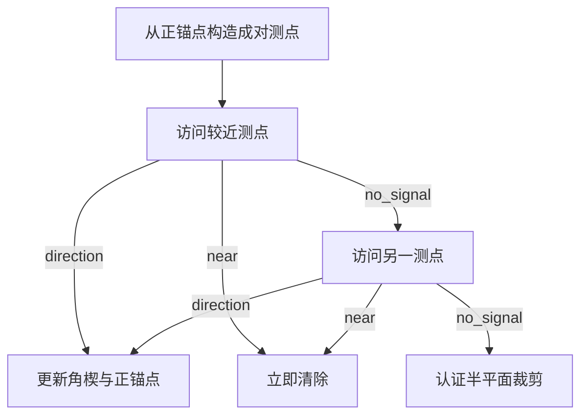
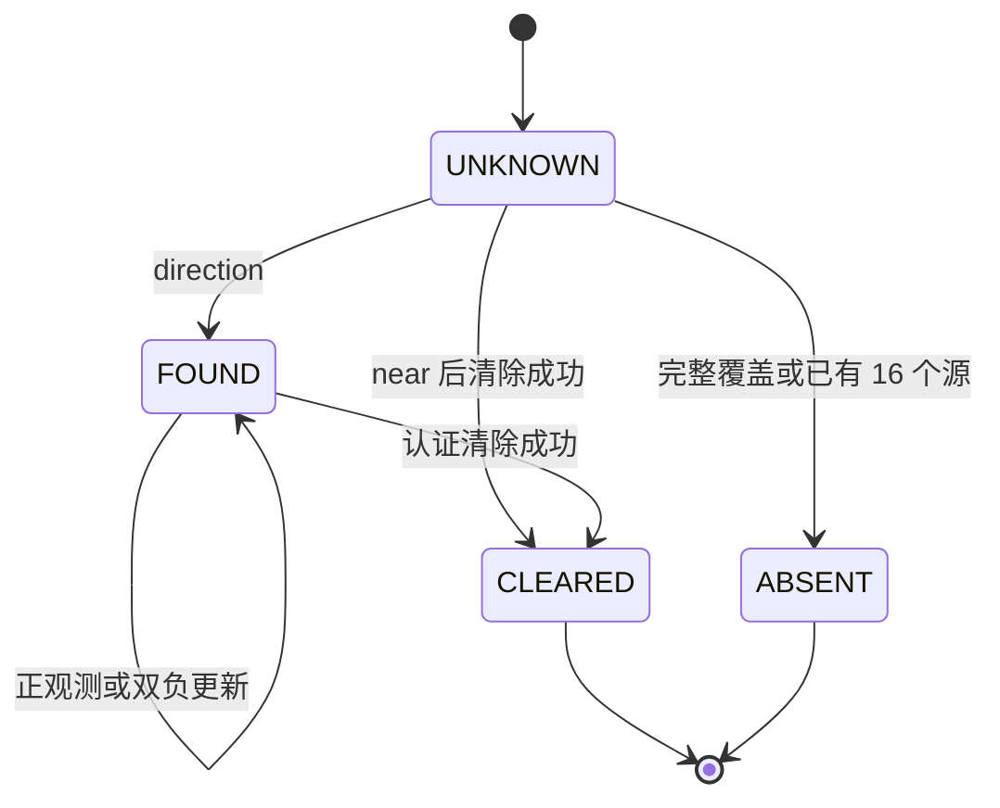

# 第四章　Q4：定向盲区、负观测与成对探测

> 学习目标：能够解释为什么“没有信号”通常不能删除位置；独立证明 25 个停靠点的方向覆盖；推导成对探测的距离条件、几何条件与收缩率；从代码追踪一次“双无信号—正观测—认证清除”的完整过程。
>
> 阅读顺序：先读第 1—5 节的通用方法与外部原例，再读第 6—12 节的 B 题推导，最后用第 13—16 节核对代码、演练和答辩。全文中的外部例题均标明原出处；另行设计的数字例子均标为“本章算例”。

## 1　通用起点：观测是在排除哪些状态

### 1.1　先写物理状态，再写观测

设未知状态为 \(x\)，检测动作是 \(a\)，环境扰动属于已知集合 \(w\in W\)，观测模型为

\[
y=h(x,a,w).
\]

收到读数 \(y\) 后，与它相容的状态集合为

\[
\mathcal H(a,y)=\{x:\exists w\in W,\ h(x,a,w)=y\}.
\]

如果之前的候选集合是 \(X\)，安全更新就是

\[
X^+=X\cap\mathcal H(a,y).
\]

这里的量词不能省略。删除一个候选状态，意味着已经证明：**允许的任何扰动都不能让这个状态产生当前读数。** “这个状态看起来不太像”不足以删除它。

如果为了计算方便使用外包络 \(\widehat X\supseteq X\)，应保持

\[
x_*\in X\subseteq\widehat X,
\]

其中 \(x_*\) 是真实状态。外包络可以偏大；偏大使定位慢一些，却保留真实状态。向内误裁一次，后面即使得到很小的包围圆，也可能只是对错误位置集合给出证书。

### 1.2　外部教材原例：符号传感器与空传感器

LaValle《Planning Algorithms》§11.1.1 的 Example 11.3 定义整数状态的符号传感器 \(h(x)=\operatorname{sgn}x\)；Example 11.6 定义所有状态都返回同一读数的空传感器。前者的负号排除非负整数；后者的固定读数不排除任何状态。参见 [1]，纸书第 562—563 页。

这个对照说明：读数的名字不决定它的信息量；信息量由观测模型的逆像决定。某个系统返回 `no_signal`，必须先问“哪些物理原因都能产生这个结果”。

**本章扩展算例。** 已知 \(x\in[-10,10]\)，传感器返回 \(\operatorname{sgn}(x+e)\)，其中 \(|e|\le2\)。返回正号只能推出 \(x>-2\)，不能推出 \(x>0\)。例如 \(x=-1,e=2\) 仍会返回正号。只要存在一个允许的误差解释读数，这个候选就应保留。

### 1.3　正观测与负观测没有天然的强弱次序

正观测往往确认“目标存在，且满足接收条件”；负观测可能对应多个原因。假设目标位置为 \(g\)，有效半径为 \(\rho\)，有向覆盖区域为 \(H\)。一次无信号可能表示

\[
\text{没有目标}\quad\lor\quad \|q-g\|>\rho
\quad\lor\quad q\notin H.
\]

这是一条“或”关系。要把它变成某个确定的几何不等式，必须先排除其他分支。设计测点以排除“距离太远”这个原因，就是主动检测的一种基本做法。

如果模型还允许遮挡、设备掉线、漏检或目标暂时停发，这些也会成为负观测的解释。此时本章后面的半平面结论需要重新检验，不能沿用理想模型的删除规则。

## 2　通用定向覆盖：从扇区到半平面

### 2.1　外部论文原例：更多开启的传感器未必覆盖更多目标

Ai 与 Abouzeid 的《Coverage by Directional Sensors》在 Fig. 1 展示同一组四个定向传感器与六个目标：一个配置开启四个传感器仍漏掉两个目标，另一个配置只开启三个却覆盖全部目标。论文 §III-A、§III-B 用位置、半径、视角和朝向定义扇区，并用点积判断目标是否落在扇区内。参见 [2]。这里复述原例的逻辑，不复制原图。

设定向设备位于 \(g\)，单位朝向为 \(n\)，全开角为 \(\alpha\)，半径为 \(\rho\)。点 \(q\) 被覆盖的条件是

\[
\|q-g\|\le\rho,\qquad
n^\mathsf T(q-g)\ge \|q-g\|\cos(\alpha/2).
\]

当 \(\alpha=\pi\) 时，\(\cos(\alpha/2)=0\)，角度条件简化为

\[
n^\mathsf T(q-g)\ge0.
\]

因此 180° 定向覆盖是“圆盘与一个经过源位置的闭半平面之交”。这个模型区分两种方向：\(n\) 是源的发射方向；\(g-q\) 是检测点指向源的测向方向。它们不能混用。

### 2.2　未知朝向下，为什么要围住目标

给定目标位置 \(g\)，设附近检测点组成集合

\[
S_g=\{s_j:\|s_j-g\|\le R_{\min}\}.
\]

希望对每一个单位朝向 \(n\)，至少有一个检测点满足 \(n^\mathsf T(s_j-g)\ge0\)。一个非常有用的充分必要条件是

\[
g\in\operatorname{conv}(S_g).
\tag{4.1}
\]

**充分性。** 若 \(g=\sum_j\lambda_js_j\)，\(\lambda_j\ge0\)，\(\sum_j\lambda_j=1\)，则

\[
\sum_j\lambda_j n^\mathsf T(s_j-g)=0.
\]

所有参与的点积不可能同时严格为负，故至少一个检测点位于覆盖闭半平面内。

**必要性。** 若 \(g\) 不在有限点集 \(S_g\) 的凸包中，取凸包内距 \(g\) 最近的点 \(z\)，令 \(n=(g-z)/\|g-z\|\)。最近点的性质给出 \((g-z)^\mathsf T(s-z)\le0\)，从而对所有 \(s\in S_g\)，有

\[
n^\mathsf T(s-g)\le-\|g-z\|<0.
\]

朝向 \(n\) 的源会避开所有这些检测点。若 \(S_g\) 为空，当然也不能保证发现。

这条判据比“每个位置都有一个不远的站点”更强。全向覆盖只要求有近点；180° 未知方向覆盖要求近点在几何上包围该位置。这里利用了边界包含在有效覆盖角度内；若边界不接收，边界退化情形要单独处理。

### 2.3　把连续覆盖证明转换成三角形检查

若某区域被若干三角形铺满，每个三角形的三个顶点都是检测点，且最长边不超过 \(R_{\min}\)，那么区域中的任意点都满足式 (4.1)。

证明分两步。设 \(g=\sum_i\lambda_i v_i\) 在一个三角形内。对任意顶点 \(v_j\)，

\[
\|g-v_j\|
=\left\|\sum_i\lambda_i(v_i-v_j)\right\|
\le\sum_i\lambda_i\|v_i-v_j\|
\le R_{\min}.
\]

所以三个顶点都足够近；同时 \(g\) 本来就在这三个点的凸包中。这样的证明覆盖三角形内部、边和顶点，不依赖网格采样密度。

## 3　通用安全裁剪：外包络与“删不掉”

### 3.1　外部原例：同一个函数的两种区间计算

Jaulin 与 Walter 的《Set inversion via interval analysis for nonlinear bounded-error estimation》§3.3、Example 4 讨论 \(f(x)=x^2-x\)，\(x\in[-1,3]\)。直接区间计算得到 \([-3,10]\)，改写为 \(x(x-1)\) 得到 \([-6,6]\)，两者相交为 \([-3,6]\)，真实值域为 \([-1/4,6]\)。参见 [3]，第 1057 页。

下面重新算一遍关键步骤：

\[
[-1,3]^2-[ -1,3]=[0,9]-[-1,3]=[-3,10].
\]

而

\[
[-1,3]\,([-1,3]-1)=[-1,3][-2,2]=[-6,6].
\]

准确值域可由 \(f(x)=(x-1/2)^2-1/4\) 看出。区间结果偏宽源于同一变量的相关性在分别运算时被忽略。偏宽仍可安全包含真值。

### 3.2　从原例提炼安全删除规则

假设实测结果规定 \(f(x)\in Y\)，候选盒子 \(B\) 有可信的函数外包络 \(F(B)\supseteq f(B)\)。

| 检查结果 | 可以作出的结论 | 后续处理 |
| --- | --- | --- |
| \(F(B)\cap Y=\varnothing\) | 盒中没有相容状态 | 删除整个盒子 |
| \(F(B)\subseteq Y\) | 盒中所有状态都相容 | 接受整个盒子 |
| 两者部分相交 | 目前不能判断全部状态 | 继续细分或保留为外包络 |

SIVIA 利用这样的判别与细分构造内外集合。Q4 的实现没有运行 SIVIA；它选择容易表示成凸多边形的外包络，并用半平面裁剪。共同的原则是：删除必须由包含关系或不相容证明支持。

**本章算例。** 候选位置有两个小区域 \(A,B\)。当前位置无信号；\(A\) 距离近但可能背向发射，\(B\) 距离远。若只按距离解释无信号而删除 \(A\)，便忽略了方向这个隐变量。真正应问的是：对 \(g\in A\)，是否还有一个允许的朝向能解释历史全部观测？只要有，就不能删。

### 3.3　保留隐变量，还是设计观测消去隐变量

有两种常用路线：

1. 维护联合集合 \(X\subseteq\{(位置,半径,朝向,类型)\}\)，每次按完整观测关系更新，再向位置平面投影。这能利用更多证据，但集合通常非凸，维数也更高。
2. 维护位置的保守外包络，设计少量特殊探测动作，使几次观测合起来可以推出与未知朝向无关的安全不等式。

成对探测属于第二条路线。它的价值在于通过动作的几何结构，获得可以直接执行的低维裁剪规则。

## 4　通用主动感知：一次检测的价值取决于下一步能做什么

### 4.1　外部论文原例：两扇门后的老虎

Kaelbling、Littman、Cassandra 的论文《Planning and acting in partially observable stochastic domains》§5.1 给出 Tiger problem：打开安全门奖励 10，打开老虎所在门损失 100，听一次代价 1；听辨正确率为 0.85。参见 [4]，第 119—120 页。

对均匀先验，听到“老虎在左边”后的左侧概率为 0.85；连续两次相同听辨后为

\[
p=\frac{0.85^2}{0.85^2+0.15^2}\approx0.9698.
\]

只看立即收益，打开右门的期望为 \(10p-100(1-p)=110p-100\)。第一次听后是 \(-6.5\)，第二次同向听后约为 \(6.68\)。这项重算展示检测如何改变行动价值；完整最优策略还依赖剩余时域、折扣和开门后的重置，不能仅由这两个数决定。

### 4.2　概率置信与确定包含是两种任务约定

Tiger problem 明确给出概率观测模型，可以用贝叶斯更新。若只有误差上界、没有可信误差分布，应使用集合来表达“所有仍可能的状态”。两种信息状态分别是：

| 表示 | 维护对象 | 典型停止标准 |
| --- | --- | --- |
| 概率方法 | 后验分布 \(b(x)\) | 成功概率达到阈值，或期望收益允许行动 |
| 集合成员方法 | 相容集合或它的外包络 \(P\) | 对所有 \(g\in P\)，动作都成功 |

LaValle 在 §12.1.1 将信息状态作为新的规划状态，在式 (12.1) 用“整个相容集合都在目标集内”定义保证成功的目标条件。[1] Q4 的清除证书正好可以采用这种形式。

特别要注意，题设同地点测向误差固定。不能把同一点测十次当成十个独立样本，再套用标准误差按 \(1/\sqrt{10}\) 缩小的结论。改变空间位置能够改变观测几何；是否统计独立仍需要额外的模型支持。

### 4.3　一个可以指导设计的通用目标

设 \(P\) 为位置外包络，动作 \(a\) 的代价是 \(c(a)\)，结果集合为 \(\mathcal Y(P,a)\)，结果 \(y\) 后的更新为 \(T(P,a,y)\)。可以设计

\[
a^*\in\arg\min_a\left\{
c(a)+\beta\max_{y\in\mathcal Y(P,a)}R\bigl(T(P,a,y)\bigr)
\right\},
\tag{4.2}
\]

其中 \(R\) 是不确定集合的最小包围圆半径，\(\beta\) 负责把米转换为时间或价值单位。也可以把“最终一定能清除”作为硬约束，再最小化最坏累计代价。

式 (4.2) 是通用的设计框架。本章代码没有求解这个连续、多步的极小极大问题。它选取一个可证明收缩的成对动作模板，再用局部路径评分减少额外移动。这样能分别解释可靠性来自哪里、效率来自哪里。

## 5　通用清除证书与在线路径选择

### 5.1　最小包围圆解决的是最坏距离

给定凸多边形 \(P\)，最小包围圆问题是

\[
\min_c R(c),\qquad R(c)=\max_{g\in P}\|g-c\|.
\]

只检查顶点即可：任意内部点都是顶点的凸组合，距离的凸性保证它到 \(c\) 的距离不超过顶点距离的最大值。

Welzl 的 1991 年论文《Smallest enclosing disks (balls and ellipsoids)》研究有限点集的最小包围圆，给出期望线性时间的随机算法；二维圆的边界由少量支撑点决定。[5] 本章程序采用随机打乱后的增量构造思想，并在返回前重新计算全部顶点到圆心的最大距离。不能仅凭“算法属于同一家族”就将原论文的所有复杂度结论照搬到这份实现。

**本章算例。** 边长 36 的等边三角形，直径是 36，但其最小包围圆半径为

\[
36/\sqrt3\approx20.785.
\]

因此“定位区域直径小于 40”还不能保证找到一个距所有候选点都不超过 20 的清除点。应检查包围圆半径，或直接检查清除点到所有候选点的最大距离。

### 5.2　外部算法：插入一站的路程增量

Rosenkrantz、Stearns、Lewis 的经典论文在 §3、式 (3.1) 定义：把点 \(k\) 插入路线边 \((x,y)\) 的增量是

\[
\Delta L=d(x,k)+d(k,y)-d(x,y).
\tag{4.3}
\]

论文 §4 对特定静态度量旅行商插入算法给出近似界。[6] 这些前提包括已知节点、完整路线构造和相应插入规则。

**本章算例。** 当前点 \(p=(0,0)\)，下一固定站 \(s=(1000,0)\)，候选任务 A 的中心 \((500,100)\)、不确定半径 30；任务 B 的中心 \((100,500)\)、不确定半径 10。二者距当前位置都约为 509.902，但

\[
\Delta L_A\approx19.804,\qquad
\Delta L_B\approx539.465.
\]

若再加不确定半径作定位难度惩罚，A 的分数约 49.804，B 为 549.465。这个例子说明“当前最近”与“插入当前路段最顺路”不同。

### 5.3　为什么只能把 Q4 的调度称为启发式

Q4 的目标要靠检测才逐渐出现，目标位置也只是集合；执行定位会改变当前位置，还可能顺带获得其他频道的信息。这与静态旅行商问题的固定节点距离表不同。

程序只评估当前点到下一覆盖站之间的插入，并加上一个半径项；600 m 是执行阈值。它没有搜索所有任务次序，也没有对未来全部观测结果做动态规划。因此可以称为在线的顺路服务启发式，不能引用静态插入算法的两倍界来声称本程序也有相同比例保证。

## 6　回到 B 题：从题设逐项建立模型

本章据题目 `20-B-.pdf` 第 1—4 页、附录 1—4，以及仓库 `source/README.md` 和当前 `source/Q4/` 源码写成。题设事实与程序选择分列如下。

| 项目 | 题设事实 | 当前 Q4 实现 |
| --- | --- | --- |
| 源位置 | 半径 1800 m 的闭圆域 | 用外切正 64 边形初始化位置外包络 |
| 源数量、频道 | 10—16 个；各占不同频道；频道 1—20 | 维护 20 个独立 `Track` |
| 定向覆盖 | 朝向两侧各 90°，包括边界 | 闭半平面接收模型 |
| 接收半径 | 每源固定，在 1000—1500 m | 1000 用于保证探测距离，1500 用于正观测初始上界 |
| 测向误差 | 全域不超过 ±1°；同地点误差固定 | 计算角楔半角 1.0051° |
| 检测 | 停下检测；每次 5 s；换台 1 s | 检测与换台由模拟器推进虚拟时间 |
| 移动 | 直线，5 m/s | 按每次动作目标点计算移动 |
| `near` | 距源不超过 5 m 且位于辐射区，无法测向 | 立即在当前位置清除 |
| 清除 | 距源不超过 20 m 即成功，与辐射角无关 | MEC 半径不超过 19.8 m 后选择认证清除点 |

物理模型中，对未清除源 \(g_i\)，若为定向源则有未知单位向量 \(n_i\)。检测点 \(q\) 的接收条件为

\[
\|q-g_i\|\le\rho_i,
\quad\text{且}\quad
n_i^\mathsf T(q-g_i)\ge0.
\tag{4.4}
\]

全向源省略第二项。接收且距离大于 5 m 时，示向度满足

\[
\left|\operatorname{wrap}\bigl(\theta_i(q)-\arg(g_i-q)\bigr)\right|\le1^\circ.
\]

程序的额外 0.005° 用于两位小数输出量化保护，0.0001° 是数值裕量。这里应称为计算外包络保护；题设误差本身仍为 ±1°。本地模拟器的两位小数舍入可在 `q4_local_simulator.py:30` 直接核对。

### 6.1　全状态表达说明普通无信号为何不能裁剪

对已知存在的定向源，完整候选状态可以写成

\[
X\subseteq\{(g,\rho,n):g\in\Omega,\rho\in[1000,1500],\|n\|=1\}.
\]

普通负观测对应

\[
X^+=\{(g,\rho,n)\in X:
\|q-g\|>\rho\ \lor\ n^\mathsf T(q-g)<0\}.
\tag{4.5}
\]

如果还不知道该频道是否有源，必须加上“不存在”的分支。只维护位置投影时，式 (4.5) 不能简化成 \(\|q-g\|>1000\)。

**误删反例 A。** 源在 \(g=(100,0)\)，接收半径 1000，朝向正东。机器狗在 \(q=(0,0)\)，只距源 100 m，却在背向半平面，因此无信号。如果无信号就删除以 \(q\) 为心的 1000 m 圆盘，真实源立即被删除。

当前 `_observe()` 对 `no_signal` 不更新多边形；它只更新当前位置、频道、时间和该频道的最近测点。只有第 9 节证明成立的双负观测才触发裁剪。

## 7　25 站如何保证发现：一个连续几何证明

### 7.1　先核对实际站点与访问顺序

`coverage_route()` 位于本地与正式求解器共同的第 85—89 行。站点是

\[
O=(0,0),
\]

\[
I_k=995\bigl(\cos(k\pi/4),\sin(k\pi/4)\bigr),\quad k=0,\ldots,7,
\]

\[
E_j=1838\bigl(\cos(j\pi/8),\sin(j\pi/8)\bigr),\quad j=0,\ldots,15.
\]

共 \(1+8+16=25\) 个站。访问次序为中心、\(I_0\) 到 \(I_7\)、\(E_{14},E_{15},E_0,\ldots,E_{13}\)。几何覆盖取决于站点集合；访问顺序影响移动时间。外圈半径超过 1800 m 并不违反原题：目标被限制在圆域内，机器狗动作坐标只受接口给定的大范围数值限制。

### 7.2　外圈先包住目标圆域

外圈正十六边形的内切圆半径为

\[
r_{\rm in}=1838\cos(\pi/16)\approx1802.683345>1800.
\]

所以整个目标圆域包含在外圈正十六边形内。仅凭“外圈顶点半径 1838 大于 1800”还不够；需要检查边中点距离，也就是内切半径。

### 7.3　把外圈多边形分成 32 个小三角形

以下下标分别按 8 或 16 取模。内圈八边形由 8 个三角形

\[
\triangle(O,I_k,I_{k+1})
\]

铺满。每个 45° 环带扇区对应五边形

\[
I_k,E_{2k},E_{2k+1},E_{2k+2},I_{k+1}.
\]

把它沿对角线分成

\[
\begin{aligned}
&\triangle(I_k,E_{2k},E_{2k+1}),\\
&\triangle(I_k,E_{2k+1},I_{k+1}),\\
&\triangle(I_{k+1},E_{2k+1},E_{2k+2}).
\end{aligned}
\]

八个扇区给出 24 个三角形，加上中心的 8 个，总计 32 个。它们的内部互不重叠，拼成整个外圈正十六边形。

所有可能的边长只有下列几类：

| 边的类型 | 长度公式 | 数值/m |
| --- | --- | ---: |
| 中心到内圈 | \(995\) | 995.000000 |
| 相邻内圈点 | \(2\cdot995\sin(\pi/8)\) | 761.540030 |
| 同射线内外圈点 | \(1838-995\) | 843.000000 |
| 相邻外圈点 | \(2\cdot1838\sin(\pi/16)\) | 717.152024 |
| 夹角 22.5° 的内外圈点 | \(\sqrt{995^2+1838^2-2\cdot995\cdot1838\cos(\pi/8)}\) | 994.519353 |

最长边为 995 m。因此任意目标 \(g\) 所在三角形的三个检测顶点，距离 \(g\) 都不超过 995 m，小于每个源的最小有效接收半径 1000 m。

### 7.4　距离覆盖加凸包，得到方向覆盖

任取定向朝向 \(n\)。由第 2.2 节的凸组合证明，上述三角形至少有一个顶点 \(v\) 满足

\[
n^\mathsf T(v-g)\ge0.
\]

这个顶点同时满足距离要求，故在那里会得到 `direction` 或 `near`。全向源只需要距离条件，也被覆盖。

**结论。** 在题设半平面辐射、没有额外漏检且源静止的模型下，扫描 25 站处每个尚未知频道，能发现所有未清除源。这个结论是对连续位置和连续朝向成立的证明；不需要声称“抽样足够密所以不会漏”。

### 7.5　为什么可以把剩余频道标成 `ABSENT`

有两个独立的充分条件：

1. 已知存在的频道数达到 16。题设源数上限为 16，频道又互不相同，所以其余频道不存在源。
2. 所有 25 个站已完成对当时未知频道的扫描。若某频道仍为 `UNKNOWN`，假设它有源会与覆盖证明矛盾。

发现 10 个源不能据此停止，因为 10 只是数量下限。`FOUND` 与 `CLEARED` 都计入已知存在数量；已清除频道不能从计数中丢掉。

25 站完整骨架的相邻直线段总长约为 17926.061 m，不含中途定位与清除的绕行。站点数、半径和顺序没有最少站数或最短路线的证明。几何可行与时间最优是两个需要分别回答的问题。

## 8　正观测怎样维护安全位置集合

### 8.1　以最近一次正观测为局部坐标系

设正锚点为 \(a\)，读数为 \(\theta\)，单位轴向和侧向分别为

\[
u=(\cos\theta,\sin\theta),\qquad v=(-\sin\theta,\cos\theta).
\]

把候选源写成

\[
g=a+xu+yv.
\]

用计算半角 \(\delta=1.0051^\circ\)，角楔约束为

\[
x\ge0,\qquad |y|\le x\tan\delta.
\tag{4.6}
\]

正观测说明真实距离不超过 1500 m。程序将已知距离上界记为 \(U\)，并增加保守的轴向约束

\[
x\le U.
\tag{4.7}
\]

注意式 (4.7) 是半平面，允许少量欧氏距离大于 \(U\) 的角楔角点。代码没有用圆弧精确裁剪距离圆；这是一种便于计算的外包络。

### 8.2　角楔怎样成为两个半平面

令

\[
\ell=(\cos(\theta-\delta),\sin(\theta-\delta)),\quad
h=(\cos(\theta+\delta),\sin(\theta+\delta)).
\]

则楔内点满足

\[
(\ell_y,-\ell_x)^\mathsf T(g-a)\le0,
\]

\[
(-h_y,h_x)^\mathsf T(g-a)\le0.
\]

因为角宽小于 180°，这两个半平面的交正好给出向前角楔。`direction_update()` 第 44—46 行依次裁剪这两个半平面和轴向距离半平面。

`_positive()` 的次序是：

1. 从旧多边形与 1500 m 确定 \(U_0=\min(1500,\max_{z\in P}\|z-a\|+\mathrm{EPS})\)。
2. 与新角楔及轴向上界相交，得到 \(P^+\)。
3. 把当前位置记为新正锚点，保存新示向度。
4. 以 \(\min(U_0,\max_{z\in P^+}\|z-a\|+\mathrm{EPS})\) 更新 `U`。
5. 重算 `center`、`radius`。

这里存储的是“保证真实源距离不超过它”的上界；`U` 不是接收半径的估计值，也不等于 MEC 半径。

### 8.3　正锚点还提供了一个没有显式存储的事实

对定向源，其未知朝向 \(n\) 一定满足

\[
n^\mathsf T(a-g)\ge0.
\tag{4.8}
\]

这表示锚点确实处于辐射闭半平面。程序没有保存一个朝向区间，但成对探测证明会使用式 (4.8)。最近测点 `last` 可以是无信号点；它不能替代 `anchor`。

## 9　成对探测：把两个负观测变成安全半平面

### 9.1　两个点是怎样选择的

在上述局部坐标中，取

\[
q_+=a+\lambda Uu+\eta Uv,\qquad
q_-=a+\lambda Uu-\eta Uv,
\tag{4.9}
\]

代码参数为

\[
\lambda=0.5,\qquad\eta=0.05.
\]

程序先去离当前点更近的那个；这个换序只改变移动量，不改变两点的几何证据。

成对动作有三个可能的终止分支：



它不是“无论如何都测两次”。首点取得正观测后，本轮立即结束，下一轮按新的锚点与尺度重建测点。

### 9.2　条件一：两个探测点都必须处于保证距离内

先用略宽但易算的三角形外包络

\[
T(U)=\{(x,y):0\le x\le U,\ |y|\le x\tan\delta\}.
\]

对 \(\lambda=1/2\)，每个 \(g\in T(U)\) 到任一探测点的距离不超过

\[
\kappa U,
\quad
\kappa=\sqrt{\frac14+(\eta+\tan\delta)^2}.
\tag{4.10}
\]

可以直接用 \(|x-U/2|\le U/2\)、\(|y\mp\eta U|\le U(\tan\delta+\eta)\) 得到这个上界。也可利用距离凸性检查三角形三个顶点。

本程序中

\[
\tan\delta\approx0.017544104,
\qquad\kappa\approx0.504541580.
\]

又因 \(U\le1500\)，

\[
\|q_\pm-g\|\le0.504541580\cdot1500
\approx756.812370<1000.
\tag{4.11}
\]

因此两个点无论遇到哪个真实候选源，都不会因接收距离不够而无信号。5 m 近距离也不会变成无信号：若接收角度满足，接口应返回 `near`。

对一般 \(0<\lambda<1\)，一个便于核验的充分条件是

\[
U\sqrt{\max(\lambda,1-\lambda)^2+(\eta+\tan\delta)^2}
\le R_{\min}.
\tag{4.12}
\]

条件可进一步收紧，但当前参数已有很大的距离余量。

### 9.3　条件二：探测线段必须横跨整个锚点角楔

线段 \([q_-,q_+]\) 位于 \(x=\lambda U\)，纵向范围为 \([-\eta U,\eta U]\)。它截住全部角楔射线所需的条件是

\[
\eta\ge\lambda\tan\delta.
\tag{4.13}
\]

本程序右侧约为 \(0.008772052\)，而 \(\eta=0.05\)，因此成立。\(\eta\) 太小，两个点可能都落在角楔某条真实射线同一侧；\(\eta\) 太大，则探测距离与横向移动代价会增加。

### 9.4　核心定理及完整证明

**定理。** 假定：源存在且尚未清除；\(a\) 是对它取得正观测的锚点；真实位置满足角楔与上界；两个探测点满足距离条件；横跨条件 (4.13) 成立；没有模型外漏检。若 \(q_+\)、\(q_-\) 都返回 `no_signal`，则

\[
u^\mathsf T(g-a)<\lambda U.
\tag{4.14}
\]

**证明第一步：识别负观测的原因。** 两点都在有效距离内，全向源不可能产生无信号。故这个分支只能由定向源产生，并且

\[
n^\mathsf T(q_+-g)<0,\qquad
n^\mathsf T(q_--g)<0.
\tag{4.15}
\]

严格小于来自题设：辐射边界属于可接收范围。

**证明第二步：反设源在探测线或它前方。** 设 \(g=a+xu+yv\)，且 \(x\ge\lambda U\)。射线段 \([a,g]\) 与探测直线的交点为

\[
r=a+\lambda Uu+\frac{\lambda U}{x}yv.
\]

由角楔条件，

\[
\left|\frac{\lambda U}{x}y\right|
\le\lambda U\tan\delta\le\eta U.
\]

因此 \(r\in[q_-,q_+]\)，可写成两个负观测点的凸组合。式 (4.15) 于是推出

\[
n^\mathsf T(r-g)<0.
\tag{4.16}
\]

**证明第三步：利用正锚点制造矛盾。** 另一方面

\[
r-g=\left(1-\frac{\lambda U}{x}\right)(a-g).
\]

括号非负，而正锚点给出式 (4.8)，所以

\[
n^\mathsf T(r-g)\ge0,
\]

与式 (4.16) 矛盾。故必须有 \(x<\lambda U\)。证毕。

这是“两个负观测”发挥作用的具体原因：它们的连线横跨可能的源射线；正锚点又位于已知的接收一侧。证明没有估计定向方向的数值。

### 9.5　裁剪与尺度更新

程序保守地保留闭半平面

\[
P^+=P\cap\{g:u^\mathsf T g\le u^\mathsf T a+\lambda U\}.
\tag{4.17}
\]

同时由角楔内 \(\|g-a\|\le x/\cos\delta\)，得

\[
U^+\le\frac\lambda{\cos\delta}U
\approx0.500076943U.
\tag{4.18}
\]

`_dual_negative()` 第 156 行做式 (4.17)，第 158 行取式 (4.18) 与当前多边形最大距离的较小值，然后重算 MEC。双负观测不产生新正锚点，旧锚点仍保留。

### 9.6　三个误用反例

**反例 B：一个负观测不够。** 取 \(a=(0,0)\)、\(g=(800,0)\)、\(U=1500\)、半径 1000、\(n=(-0.01,-\sqrt{1-0.01^2})\)。锚点的点积为 8，大于零。\(q_+=(750,75)\) 的点积约为 \(-74.50\)，所以无信号；\(q_-=(750,-75)\) 则有信号。若首点无信号后立即裁到 \(x\le750\)，就删掉了真实源 \(x=800\)。

**反例 C：两个点不在保证距离内。** 取 \(g=(800,0)\)、\(a=(0,0)\)、半径 1000、朝向正西。选 \(q_\pm=(600,\pm1200)\)，两点都距源约 1216.55 m，因超距而无信号。若据此裁到 \(x\le600\)，同样误删。双负观测的名称本身不提供安全性。

**反例 D：两个点没有跨住角楔。** 取 \(g=(800,10)\)、\(a=(0,0)\)、\(n=(-0.02,\sqrt{1-0.02^2})\)、半径 1000，读数取 0°。真实角度约 0.716°，符合误差界。选 \(q_\pm=(750,\pm5)\)。锚点有信号，两点均在 1000 m 内，却都在背向半平面。真实源仍位于 \(x=800>750\)。原因是线段在 \(x=750\) 处只覆盖 \(y\in[-5,5]\)，而真实射线在那里有 \(y=9.375\)。

以上三个反例分别对应：必须成对、必须认证距离、必须横跨角楔。

## 10　为什么成对探测会结束

### 10.1　正分支与双负分支都压缩尺度

为看清算法而先采用精确实数计算，忽略极小的数值容差。维护不变量

\[
P\subseteq a+T(U),\qquad g_*\in P.
\]

若本轮取得正观测，新的位置集合是旧集合的子集。由式 (4.10)，它到新锚点的最大距离不超过 \(\kappa U\)；`_positive()` 利用这个最大距离更新上界，故

\[
U^+\le\kappa U\approx0.504541580U.
\]

若本轮双负，则式 (4.18) 给出约 0.500077 倍。若返回 `near`，直接完成清除。于是未清除情况下，每轮都具有约 0.505 以下的统一尺度收缩。

### 10.2　从距离尺度转成 MEC 半径上界

三角形 \(T(U)\) 的顶点为

\[
(0,0),\quad(U,U\tan\delta),\quad(U,-U\tan\delta).
\]

取圆心 \((c,0)\)，令它到顶点的距离相等，有

\[
c^2=(U-c)^2+U^2\tan^2\delta,
\]

因此

\[
c=\frac{U}{2\cos^2\delta}.
\]

以它为圆心、半径 \(c\) 的圆覆盖三角形，故

\[
R(P)\le\frac{U}{2\cos^2\delta}.
\tag{4.19}
\]

这是一个足够用的上界；实际旧角楔交集往往远小于整三角形。

以 \(U_0=1500\)、每轮都用较慢的收缩率 \(\kappa\) 计算：

| 完成轮数 \(k\) | \(1500\kappa^k\)/m | 由式 (4.19) 给出的半径上界/m |
| ---: | ---: | ---: |
| 0 | 1500.000 | 750.231 |
| 1 | 756.812 | 378.523 |
| 2 | 381.843 | 190.980 |
| 3 | 192.656 | 96.358 |
| 4 | 97.203 | 48.616 |
| 5 | 49.043 | 24.529 |
| 6 | 24.744 | 12.376 |

因此在这些不变量与精确计算条件下，6 轮已足以降到 19.8 m 以下。代码的 9 轮上限是异常保护：达到上限会抛出错误，不能把它理解为到第 9 轮会强行清除。

数值实现的 `EPS` 外扩、`mec()` 的半径重算和 0.2 m 清除裕量提升了计算稳健性，但并非带定向舍入的形式化浮点证明。上表是理想几何收缩推导，异常上限是运行保护，二者应分开陈述。

## 11　认证清除与 25 m 机会复用

### 11.1　19.8 m 证书到底证明什么

已知 \(P\subseteq B(c,R)\)，且 \(R\le19.8\)。任取

\[
z\in B(c,19.8-R),
\]

对真实源 \(g_*\in P\)，有

\[
\|z-g_*\|\le\|z-c\|+\|c-g_*\|
\le19.8-R+R=19.8<20.
\tag{4.20}
\]

因此不必总走到 MEC 圆心。设当前位置为 \(p\)、\(s=19.8-R\)：

\[
z=\begin{cases}
p,&\|p-c\|\le s,\\
c+\dfrac{s}{\|p-c\|}(p-c),&\|p-c\|>s.
\end{cases}
\tag{4.21}
\]

`nearest_clear()` 正是把当前位置投影到这个安全圆盘，获得圆盘内最近的清除点。

这里的“最近”有明确范围：最近于充分安全圆盘 \(B(c,19.8-R)\)。完整可清除集合是

\[
\bigcap_{g\in P}B(g,20),
\]

它通常更大，程序没有求在这个完整交集中的最近点。清除操作与无线电朝向无关，所以无需再证明 \(z\) 位于辐射半平面。

### 11.2　`near` 是另一条独立的清除证书

`near` 表示接收区内距源不超过 5 m，因此当前点本身就在 20 m 清除半径内。这个分支不需要等待多边形收缩，也不需要再求第二个示向度。注意背向源即使距离 3 m，也可能是 `no_signal`；不能把近距离反过来当作必得 `near` 的保证。

### 11.3　机会复用的全部条件

机器人因其他任务停下来时，`_reuse(limit=2)` 尝试顺便检测已发现频道。其条件逐项为：

| 代码条件 | 含义 | 不代表什么 |
| --- | --- | --- |
| `status == 'FOUND'` | 源已发现、尚未清除 | 不能替代未知频道覆盖扫描 |
| `radius > 19.8` | 还需要缩小位置集合 | 已达证书的源交给清除流程 |
| `maxdist(self.p, poly) <= 999.0` | 所有多边形候选都在保证距离内 | 不保证朝向允许接收 |
| `last is not None` | 有该频道的历史测点 | `last` 不一定是正锚点 |
| `dist(self.p, last) >= 25.0` | 与该频道最近测点至少相距 25 m | 不保证独立误差或足够大的交会角 |
| 按半径降序最多选两个 | 优先处理更不确定的频道，控制停靠开销 | 不是全局最优的信息价值排序 |

第 144 行用 `<25.0` 跳过，因此恰好 25 m 满足距离条件。比较对象是**同一频道最近一次检测的位置**，包括无信号检测；不是上一条任意频道动作位置，也不是仅与正锚点比较。

25 m 门槛减少短基线重复测量，但它是效率启发式。两点相距 25 m 仍可能与源几乎共线，也可能都在背向半平面。复用无信号只更新 `last`，不会直接裁剪。普通复用与认证成对探测的推理条件不同。

## 12　一步一步跟踪一次单频道服务

### 12.1　案例说明与复现方法

这是本章构造的**单源服务子程序算例**，用于核对 `_service()` 的分支，不是一局满足 10—16 源要求的正式案例，也不是官方测试成绩。真实源设为

\[
g=(200,0),\quad\rho=1000,\quad n=(-1,0),
\]

即向西辐射。令示向误差恒为 0，读数仍按本地接口保留两位小数。0° 误差符合题设误差上界。运行的是当前原始求解器；只用一个临时模拟器子类替换教学环境的误差函数。

在仓库根目录可用以下片段复现关键结果，不改写源程序：

```python
import math
import sys
sys.path.insert(0, "source/Q4")
import q4_local_solver as solver
from q4_local_simulator import Simulator, Source

class ExactTeachingSimulator(Simulator):
    def _error(self, source, position):
        return 0.0

sim = ExactTeachingSimulator([
    Source(1, (200.0, 0.0), 1000.0, True, math.pi, 0.0)
])
strategy = solver.Strategy(sim)
strategy._observe(1, (0.0, 0.0))
strategy._service(1)
print(strategy.tracks[1].status)
print(strategy.max_pair_rounds, sim.measurements, sim.distance, sim.time)
```

### 12.2　运行记录及每一步的理由

以下数字来自对上述算例实际调用当前源码后的记录，显示值取适当小数位；累计时间包含移动和检测，不含任何人为等待。

| 步骤 | 动作点/m | 返回或更新 | `U`/m | MEC 半径/m | 累计虚拟时间/s |
| --- | --- | --- | ---: | ---: | ---: |
| 0 | \((0,0)\) | `direction = 0°` | 1500.000 | 750.231 | 5.000 |
| 1 | \((750,75)\) | `no_signal` | 1500.000 | 750.231 | 160.748 |
| 2 | \((750,-75)\) | `no_signal` | 1500.000 | 750.231 | 195.748 |
| 2 后 | 不增加动作 | 保留 \(x\le750\) | 750.115 | 375.115 | 195.748 |
| 3 | \((375.058,-37.506)\) | `no_signal` | 750.115 | 375.115 | 276.111 |
| 4 | \((375.058,37.506)\) | `no_signal` | 750.115 | 375.115 | 296.113 |
| 4 后 | 不增加动作 | 保留 \(x\le375.058\) | 375.115 | 187.587 | 296.113 |
| 5 | \((187.558,18.756)\) | `direction = 303.56°` | 27.100 | 4.494 | 338.800 |
| 6 | \((191.622,12.676)\) | `clear = success` | — | — | 345.263 |

**步骤 0。** 锚点在源的西侧，有信号。首个 0° 读数产生向东的长角楔。读数给出射线方向，不能仅凭它知道源距锚点 200 m，所以初始 `U` 仍为 1500。

**步骤 1—2。** 两个点都在源东侧，落在背向半平面。首个无信号没有改变多边形；第二个无信号才触发认证裁剪。新的 `U` 为 \(750/\cos\delta\)，所以略大于 750。

**步骤 3—4。** 两个新探测点仍在真实源东侧，再次双负。因为当前位置在上轮下方点，先访问本轮下方点，这体现了 `_pair_round()` 的近点优先换序。

**步骤 5。** 新点的横坐标约 187.558，小于源的 200，进入辐射半平面。其真实指源向量约为 \((12.442,-18.756)\)，示向度舍入后为 303.56°。新旧角楔相交很小，MEC 中心约为 \((200.127,-0.049)\)，半径约 4.494。此时不再访问本轮另一点。

**步骤 6。** 安全圆盘半径 \(19.8-4.494\approx15.306\)。投影所得清除点距真实源约 15.194 m，成功。这里选择的清除点与 MEC 圆心不同，式 (4.20) 保证它对整个候选集合安全。

整个服务使用 3 轮成对动作、6 次检测、0 次换台、1 次成功清除、0 次失败清除，移动约 1551.313 m。时间核算为

\[
T=1551.312844/5+6\times5+1\times5
\approx345.262569\ \mathrm{s}.
\]

这个算例也展示了一个效率限制：因为最初距离不确定，前两轮走过了真实源。保证收缩的策略未必使每一次行走都短。

## 13　逐函数对应当前源码

本节行号对应本次核对的原始文件。`q4_local_solver.py` 共 208 行；其第 1—208 行与 `q4_official_solver.py` 第 1—208 行逐行相同。正式文件随后增加独立 HTTP 客户端，不导入本地模拟器。

### 13.1　数学与策略核心

以下“共同”表示本地与正式求解器具有相同行号。

| 数学或决策 | 函数/对象 | 当前行号 | 阅读时要核对的细节 |
| --- | --- | --- | --- |
| 角误差、清除与探测参数 | 模块常量 | 共同 8—13 | `DELTA`、19.8、0.5、0.05、25.0 |
| 半平面裁剪 | `clip` | 共同 24—37 | 第 26 行向外加容差；第 29—31 行插交点并保留内点 |
| 初始位置外包络 | `arena_polygon` | 共同 39—41 | 用 \(1800/\cos(\pi/64)\) 生成外切多边形；不能改成同半径内接多边形 |
| 正观测角楔 | `direction_update` | 共同 43—47 | 两条角边加一条轴向上界；没有圆弧精确交 |
| 两点支撑圆、三点圆 | `_diameter_circle`, `_circum` | 共同 49—56 | 近共线时 `_circum` 返回 `None` |
| MEC 计算 | `mec` | 共同 58—76 | 固定种子 271828；返回前按所有顶点重新取最大距离并加 \(10^{-6}\) |
| 最近充分安全清除点 | `nearest_clear` | 共同 78—83 | 安全圆盘投影；不是整个可清除区域的全局最近点 |
| 25 站几何与访问顺序 | `coverage_route` | 共同 85—89 | 中心、8 内圈、16 外圈；外圈先 14、15 |
| 每频道信息状态 | `Track` | 共同 91—101 | `anchor`、`last`、`U` 和 `radius` 各有不同语义 |
| 初始策略状态 | `Strategy.__init__` | 共同 103—107 | 原点、频道 1、20 条轨迹 |
| 接纳正观测 | `_positive` | 共同 109—112 | 更新正锚点、距离上界、角楔和 MEC |
| 执行清除 | `_clear` | 共同 113—120 | 认证清除失败即异常，不静默计为成功 |
| 解释三种检测结果 | `_observe` | 共同 121—129 | 无信号不裁；`near` 直接清；每次检测更新 `last` |
| 已知存在数与未知终结 | `_known_count`, `_finish_unknown_if_possible` | 共同 130—139 | 16 个已知或完整覆盖；10 个不触发 |
| 停靠时复用 | `_reuse` | 共同 140—147 | 999 m 距离条件、同频道 25 m 门槛、最多两个 |
| 覆盖站逐频道扫描 | `_scan_site` | 共同 148—154 | 当前频道优先，扫描未知频道后再复用 |
| 双负认证裁剪 | `_dual_negative` | 共同 155—158 | 半平面阈值 \(\lambda U\) 与 \(\lambda/\cos\delta\) 收缩 |
| 一轮成对探测 | `_pair_round` | 共同 159—169 | 固定本轮测点；首点正观测即返回；只有双负才裁 |
| 单源服务闭环 | `_service` | 共同 170—178 | 达证书就清，最多 9 轮后报错；完成后复用 |
| 在线插入评分 | `_choose_insert` | 共同 179—187 | 绕行增量加 `radius`；600 m 阈值 |
| 总调度与输出 | `run`, `run_case` | 共同 188—208 | 发现、服务、覆盖交替；2000 次外层循环保护 |

### 13.2　状态机及两个容易混淆的量



无信号使 `UNKNOWN` 保持未知；它也能使 `FOUND` 保持发现状态而不改变多边形。图中省略了这些自环和异常退出。

| 变量 | 含义 | 更新时机 |
| --- | --- | --- |
| `anchor` | 最近一个有示向度的正检测点 | `direction` 时更新；双负后不变 |
| `last` | 本频道最近一次检测的位置 | 每次检测都更新，包括无信号 |
| `U` | 相对于正锚点的真实源距离上界 | 正观测或双负后更新 |
| `radius` | 当前位置多边形的包围圆半径 | 多边形有效更新后重算 |

例如首测后 `U=1500`，MEC 半径约为 750；两者相差约一倍，本来就不应该混作一个量。

### 13.3　本地模拟器怎样实现题设

| 行号 | 对象 | 可核对的事实 |
| --- | --- | --- |
| 8—10 | `Source` | 频道、位置、半径、定向标志、朝向、误差相位 |
| 16—17 | `_move` | 移动时间为距离/5 |
| 18—20 | `_visible` | 定向接收用点积；全向直接通过 |
| 21—22 | `_error` | 固定空间函数，幅度夹在 ±1°；同位置重复不改变误差 |
| 23—31 | `measure` | 5 s 检测、1 s 换台，依次判无信号、`near`、示向度 |
| 32—36 | `clear` | 仅检查距离不超过 20 m；成功 5 s，失败 3 s |
| 38—43 | `make_case` | 圆域面积均匀位置，半径均匀抽样，1 到 \(n-1\) 个定向源 |
| 45—65 | `_average` | 分开输出逐局等权、合并源数加权与时间分解 |
| 82—109 | `main` | 批量运行、记录 seed、全清除状态和异常、写结果 JSON |

`_visible()` 使用 \(-10^{-10}\) 的数值容差，这与数学上的边界包含方向一致，但不等于官方内部采用相同浮点实现。误差函数的空间相关结构也是本地模拟的选择，题设没有指定这个正弦余弦场。

### 13.4　正式客户端：几何正确以外的运行条件

| 文件行号 | 函数 | 作用 |
| --- | --- | --- |
| 正式 219—231 | `OfficialClient.__init__` | 只允许回环 HTTP 地址；初始化时间、位置、频道与请求状态 |
| 正式 254—262 | `_cutoff`, `_attempt_timeout` | 为正常退出保留现实时间 |
| 正式 263—283 | `_validate_success` | 检查 HTTP/`accepted`、时间、三种检测结果与清除结果 |
| 正式 284—323 | `_request` | 同一动作重试复用原请求体与 `request_id`；结果未知时不擅自认定失败 |
| 正式 324—344 | `action` | 阻止未决动作后生成新 ID；验证坐标频道；检查下一动作虚拟时间预算 |
| 正式 352—355 | `enter` | 使用返回的实际剩余现实时间建立期限 |
| 正式 356—361 | `measure`, `clear`, `exit`, `can_exit` | 清除不改变测向频道；未决请求时不能新发退出动作 |
| 正式 368—391 | `main` | 进入、执行、退出、记录结果；异常时仅在可安全退出时退出 |

`action()` 对下一次检测的上界是移动时间 +5 s，必要时 +1 s；清除使用移动时间 +5 s。程序没有在每次检测后另等 5 秒，因为该 5 秒属于模拟器虚拟时间。

本章仅说明已读取的实现；HTTP 字段的具体官方定义还需结合附件协议。不能把本地 JSONL 当作题目要求导出的官方加密正式日志，也不能从本地案例 seed 编造正式案例编码。

## 14　证据、实验与结论的边界

### 14.1　四层结论要分别写

| 结论 | 证据 | 适用前提 |
| --- | --- | --- |
| 25 站保证发现 | 三角剖分、边长、凸包证明 | 静止源；180° 闭半平面；最小半径 1000；扫描动作完成 |
| 双负裁剪保留真值 | 距离排除、线段横跨、正锚点证明 | 原正锚点有效；无模型外漏检；角误差上界成立 |
| 认证清除成功 | 候选集合包含真值与三角不等式 | 几何外包络未误删；动作按目标点执行 |
| 总时间较短 | 同条件对照实验与统计 | 仅适用于实际比较的参数、样本与环境 |

前三条不直接证明最后一条。程序还有现实时间上限、网络异常、数据校验、9 轮与 2000 次循环保护；这些条件触发时可能中断，不能把理论几何保证扩大为任何运行环境下无条件完成。

### 14.2　适合验证这一策略的实验

应保留每局种子与全部失败局，不只统计成功局。除随机混合案例外，可设计以下定点压力场景：

1. 目标靠近 1800 m 边界，朝向径向外侧，检查外圈发现。
2. 目标位于三角剖分的边和顶点，朝向让一个或多个站恰好位于辐射边界。
3. 接收半径恰为 1000 m，测向误差取端点附近，检验保守距离和角楔。
4. 正锚点接近辐射边界，首个成对测点无信号、第二点有信号，检验反例 B 的分支。
5. 多轮双负后才转正，检查 `anchor` 没有被无信号点替换。
6. 同频道两个停靠点距离为 24.9、25.0、25.1 m，核对复用门槛语义。
7. 一局恰有 10 个和恰有 16 个源，区分完整覆盖终止与数量上限终止。

对效率参数进行比较时，应让不同配置运行相同案例。可比较复用开关、25 m 门槛、插入阈值、覆盖顺序；每项变化都要重新检查是否影响已有证明。尤其改变外圈半径、站数、\(\lambda\)、\(\eta\) 时，应先核对几何不等式，再讨论平均耗时。

**本章实际运行的固定种子小演示。** 在仓库根目录执行以下命令；输出路径可换成自己的结果目录：

```bash
python source/Q4/q4_local_simulator.py --loops 10 --seed 20260929 --output q4_demo_20260929.json
```

核对结果如下。它是本地 10 局复现演示，样本量不足以刻画尾部失败概率，也不是官方成绩。

| 指标 | 实际结果 |
| --- | ---: |
| 全清除局数 | 10/10 |
| 源总数 / 定向源总数 | 145 / 66 |
| 失败清除次数 | 0 |
| 每局平均虚拟时间 | 6675.53 s |
| 逐局等权平均每源耗时 | 468.43 s |
| 合并源数加权平均每源耗时 | 460.38 s |
| 每局平均移动距离 | 26126.63 m |
| 每局平均移动 / 检测 / 换台 / 清除时间 | 5225.33 / 1172.00 / 205.70 / 72.50 s |

实际核对运行使用同一命令参数，将输出文件放在仓库外的临时目录；改变 `--output` 不改变生成的案例和上述虚拟时间指标。程序现实运行时间受机器影响，不作为该固定种子的恒定结果。

### 14.3　统计指标与正式报告

对第 \(j\) 局，记源总数 \(N_j\)、成功清除数 \(C_j\)、虚拟时间 \(T_j\)。题设单局指标为

\[
\text{清除比例}=C_j/N_j,\qquad
\text{平均每源耗时}=T_j/C_j.
\]

跨局时，

\[
\frac1M\sum_{j=1}^M\frac{T_j}{C_j}
\quad\text{与}\quad
\frac{\sum_jT_j}{\sum_jC_j}
\]

通常不同；前者按局等权，后者按清除源数加权。\(C_j=0\) 时每源耗时无定义，不能写成 0；还需报告失败数与错误原因。

本地模拟器两种平均都会输出。应注明所用分母、是否包含失败局以及案例分布。本章没有官方三次测试的结果；正式表格中的案例编码和成绩必须来自实际官方记录。

### 14.4　当前实现的具体限制

- 25 站是有证明的可行构造，没有最少站数证明。固定访问顺序没有最短路证明。
- 普通负观测没有被充分利用。即使在认证距离内，一次负观测也可能约束朝向；当前代码未维护完整位置—朝向联合集合。
- 成对模板为保证最坏收缩而设计，可能走过近源，单次移动未必经济。
- 999 m 与 25 m 门槛只解决各自的距离余量和短基线复用问题；它们不保证接收到定向信号，也不保证好交会角。
- 初始圆域用外切多边形，正观测距离圆用轴向半平面。保守近似可能增加检测次数。
- MEC 返回半径覆盖当前顶点，使清除证书更稳健；浮点几何仍不是经过形式化验证的精确算术。
- 本地误差场、分布与官方未知案例不必一致。本地全清除率不能替代连续几何证明或官方正式成绩。

## 15　答辩追问：回答时先说条件，再说结论

### 问 1：Q3 的圆盘覆盖，为什么不能直接用于 Q4？

答：一个点在接收半径内，只满足距离条件；定向源还要求检测点处于它的辐射半平面。未知朝向下要让近检测点的凸包包含源位置。25 站通过小三角形剖分满足这个更强条件。

### 问 2：25 个点覆盖了无穷多个源位置和方向，依据是什么？

答：外圈十六边形内切半径约 1802.683 m，包住目标圆域；32 个三角形铺满该多边形，所有边不超过 995 m。源所在三角形三个顶点都在最小接收半径内，凸组合又保证它们不可能都处于任意辐射半平面的外侧。

### 问 3：一个站就很近了，为何还要强调凸包？

答：近点解决接收距离，凸包解决任意方向。如果所有近点在源的一侧，源可以朝相反方向发射，把它们全部避开。

### 问 4：无信号为什么不直接排除附近区域？

答：近但背向也无信号。源在 \((100,0)\) 朝东，原点距它 100 m 仍无信号，就是反例。要删除必须排除所有相容朝向解释。

### 问 5：两个无信号为什么突然可以删？

答：这里不是任意两点。它们处在认证接收距离内，且连线横跨正锚点角楔。如果源在连线前方，锚点到源的线段会穿过这条探测线段；正锚点要求交点在接收侧，双负要求交点在背向侧，矛盾。因此可保留锚点这一侧。

### 问 6：源是全向还是定向都不知道，会影响双负推理吗？

答：认证距离内的全向源不可能双负；出现双负本身排除了全向类型。正观测分支则对两种类型均成立，所以无需事先分类。

### 问 7：如果两个负点其实都因为太远而无信号呢？

答：那就不能裁。当前参数保证它们到全部候选位置不超过约 756.813 m，小于最小半径 1000 m。条件失效时必须停止使用这条推理。

### 问 8：\(\lambda=0.5\)、\(\eta=0.05\) 是最优值吗？

答：它们同时满足横跨角楔与距离条件，并带来约 0.505 的收缩上界。当前源码没有给出连续参数空间的全局最优证明；若声称某配置更快，应给同案例对照实验。

### 问 9：为什么不用位置集合直径判断能不能清除？

答：直径不超过 40 m 不保证半径 20 m 的一个圆能覆盖集合；边长 36 m 的等边三角形就是反例。清除需要控制一个行动点到全部候选位置的最大距离，MEC 与这个条件直接对应。

### 问 10：明明半径小于 19.8，为何清除点不是圆心？

答：距圆心不超过 \(19.8-R\) 的任意点都安全。代码取该安全圆盘中离当前位置最近的点，减少移动；三角不等式保证距真源不超过 19.8。

### 问 11：25 m 的意义是不是让测向误差独立？

答：不能这样说。它避免同频道在极短基线处重复使用检测，属于效率规则；题设未给出独立距离。较大空间间隔也不保证正交交会或处在辐射方向。

### 问 12：你们用了旅行商插入法，所以是不是两倍近似？

答：代码借用了绕行增量形式，但目标位置未知、逐步发现，评分加入半径，只在下一覆盖边上插入。因此静态旅行商特定算法的近似界不适用；我们称之为在线启发式。

### 问 13：发现 10 个源是否能结束？

答：不能。10 是下限；必须完整完成覆盖并清除发现的源，或者已知存在数达到上限 16，再清除全部已发现源。

### 问 14：理论上都能结束，为什么代码还有轮数上限？

答：理论推导依赖传感器语义、误差界和位置集合不变量。轮数上限用来暴露实现、协议或假设异常；触发后报错，不把未完成任务伪装成完成。

### 问 15：正式程序与本地程序有没有读取真值的区别？

答：策略核心前 208 行相同，策略通过 `measure`、`clear` 两个接口读取反馈。正式文件的后半部是独立 HTTP 客户端，没有导入本地真值生成器。本地模拟器可以访问真值来判定反馈和计算评价指标；这不等于策略使用了真值。

## 16　练习与解答

### 练习 1　把方向写成点积

一个源位于 \((10,20)\)，朝向正北，半径 1000。判断 \((10,19)\)、\((10,20)\)、\((510,20)\)、\((10,1021)\) 能否接收。暂不区分 `near` 与 `direction`。

**解答。** 朝向 \(n=(0,1)\)，角度条件为 \(q_y\ge20\)。第一点在背向侧；第二、第三点可接收，第三点在辐射边界且距离 500；第四点方向满足，但距离 1001 超出半径。第二点在几何模型中满足接收，接口会用近距离结果处理。

### 练习 2　证明一次覆盖必须考虑围住源

源在原点，三个可达检测点为 \((1,1)\)、\((2,1)\)、\((1,2)\)。能否保证任意朝向都被接收？

**解答。** 不能。取 \(n=(-1,-1)/\sqrt2\)，三个点与 \(n\) 的点积均为负。它们虽然都近，但凸包不含原点。

### 练习 3　检查另一个外圈半径

把 Q4 外圈半径改为 1800，仍使用 16 个等角点。仅凭外圈多边形能否包住半径 1800 的目标圆域？

**解答。** 不能。其内切半径 \(1800\cos(\pi/16)\approx1765.414\)。圆域在边中点方向上伸出多边形，原来的三角剖分覆盖证明不再覆盖这些区域。这不自动证明整个新方案必然漏检，但证明必须重新建立。

### 练习 4　推导双负所需的横向距离

若 \(U=1200\)、\(\lambda=0.5\)、\(\delta=1.0051^\circ\)，探测线位于锚点前方多少米？两探测点到轴线至少应相距多少米才能跨住整个角楔？代码实际选多少米？

**解答。** 探测线在 600 m 处；每侧至少为 \(600\tan\delta\approx10.5265\) m。代码每侧取 \(0.05\times1200=60\) m，两点之间为 120 m。题目中的“每侧距离”与“两点间距”不要混淆。

### 练习 5　检验一组过大的参数

保持 \(\lambda=0.5\)、\(U=1500\)、\(\delta=1.0051^\circ\)，改用 \(\eta=0.6\)。能否继续引用本章距离认证？

**解答。** 不能。式 (4.10) 给出

\[
1500\sqrt{0.25+(0.6+0.0175441)^2}\approx1192\ \mathrm m>1000.
\]

该上界不能保证所有候选位置都在接收距离内，故双负不能按原规则裁剪。事实上远端角点也会产生超距，问题不是单纯上界太松。

### 练习 6　用清除余量减少移动

MEC 中心 \(c=(100,0)\)、半径 \(R=12\)，当前位置 \(p=(0,0)\)。按代码证书计算最近清除点、移动距离、到所有候选点的最坏距离上界。

**解答。** 余量为 7.8，安全点为 \(z=(92.2,0)\)，移动 92.2 m。最坏距离不超过 \(7.8+12=19.8\) m。若走到圆心，需走 100 m，多走 7.8 m，即多用 1.56 s。

### 练习 7　区分 `last` 与 `anchor`

某频道在 A 点得到示向度，随后 B 点无信号。下一停靠点 C 距 A 为 40 m、距 B 为 10 m，其余复用条件均满足。程序是否复用该频道？成对探测用哪个锚点？

**解答。** 不复用，因为 `last=B`，距离只有 10 m，小于 25 m。正锚点仍为 A；B 的无信号没有把 `anchor` 改成 B。

### 练习 8　复算单频道轨迹的时间

第 12 节中移动 1551.312844 m，检测 6 次，换台 0 次，成功清除 1 次。若误把程序再等待的 5 s 加在每次检测后，会报告多少额外时间？

**解答。** 正确虚拟时间约 345.262569 s。额外加入 \(6\times5=30\) s 会得到约 375.262569 s，属于重复计时。现实程序运行时长与虚拟任务耗时也要分别记录。

### 练习 9　判断三种结束理由

分别判断：A. 清除了 10 个源但还有未知频道；B. 已发现或清除的不同频道恰为 16，且最终全部清除；C. 25 站全部扫描完毕，剩余未知频道均无发现，全部已发现源已清除。

**解答。** A 不足以宣布完成；B 可依据数量上限完成；C 可依据方向覆盖完成。B 中仅“发现 16 个”还不够，发现后的清除必须全部完成。

### 练习 10　把保证与性能拆开陈述

请改写“我们使用 25 个最优站点和最优插入算法，仿真全成功，所以在所有情况下全局最快”。

**解答。** 可写为：“在题设理想接收模型下，25 站的三角剖分保证发现全部源，成对探测与 MEC 证书保证安全定位清除。访问顺序、复用门槛和插入规则用于改善耗时，其性能通过指定案例集的对照测试评价；本文未证明站数最少或总时间全局最优。”

## 17　带着三条线索回读代码

第一次只追踪不变量：`poly` 始终包含真实位置，`anchor` 始终是正观测位置，`U` 始终是相对锚点的可靠上界。

第二次只追踪证据：普通无信号为什么不删；双负时距离分支如何被排除；MEC 与清除点如何构成成功证明。

第三次只追踪代价：25 站访问顺序、插入绕行、最多两个复用频道、25 m 门槛、近点优先和清除余量如何影响移动与检测时间。把这三条线分清，才能既说出算法为什么可靠，也准确说明哪些部分仍属于效率选择。

## 参考来源与精确阅读位置

以下链接为原作者、出版社或高校托管的论文/教材。外部例题在正文中经过概述与重算；本题 25 站构造、成对探测证明、数字轨迹与练习按当前源码另行推导，不宣称来自外部论文。

1. Steven M. LaValle. *Planning Algorithms*. Cambridge University Press, 2006. [Chapter 11: Sensors and Information Spaces](https://lavalle.pl/planning/ch11.pdf)，§11.1.1，Example 11.3、11.6；[Chapter 12: Planning Under Sensing Uncertainty](https://lavalle.pl/planning/ch12.pdf)，§12.1.1、式 (12.1)。对应通用观测逆像和信息集合目标。
2. Jing Ai, Alhussein A. Abouzeid. *Coverage by Directional Sensors*. WiOpt, 2006. [作者所在高校托管的论文稿](https://sites.ecse.rpi.edu/~abouzeid/preprints/2006wiopt.pdf)，Fig. 1，§III-A、§III-B；[出版记录](https://eudl.eu/doi/10.1109/wiopt.2006.1666444)。作者稿标注 2005 年草稿日期，会议出版年为 2006。对应方向覆盖原例与扇区点积判定。
3. Luc Jaulin, Eric Walter. *Set inversion via interval analysis for nonlinear bounded-error estimation*. Automatica, 29(4), 1053–1064, 1993. [作者主页 PDF](https://webperso.ensta.fr/jaulin/paper_automatica93.pdf)，§3.3、Example 4、式 (22)—(23)，以及 §5 的集合反演算法。对应有界误差与外包络原例。
4. Leslie Pack Kaelbling, Michael L. Littman, Anthony R. Cassandra. *Planning and acting in partially observable stochastic domains*. Artificial Intelligence, 101, 99–134, 1998. [作者主页 PDF](https://people.csail.mit.edu/lpk/papers/aij98-pomdp.pdf)，§5.1—§5.2，第 119—120 页。对应 Tiger problem 原例；正文的两次更新为按原参数重算。
5. Emo Welzl. *Smallest enclosing disks (balls and ellipsoids)*. LNCS 555, 359–370, 1991. [作者主页 PDF](https://people.inf.ethz.ch/emo/PublFiles/SmallEnclDisk_LNCS555_91.pdf)；[出版社摘要与 DOI](https://doi.org/10.1007/BFb0038202)。对应最小包围圆与随机算法背景；不据此把当前三重增量循环写成已证最坏线性。
6. Daniel J. Rosenkrantz, Richard E. Stearns, Philip M. Lewis II. *An Analysis of Several Heuristics for the Traveling Salesman Problem*. SIAM Journal on Computing, 6(3), 563–581, 1977. [高校托管重印本](https://disco.ethz.ch/courses/fs16/podc/readingAssignment/1.pdf)，§3、式 (3.1)，§4、Theorem 4；[原文 DOI](https://doi.org/10.1137/0206041)。对应插入增量与近似界的适用范围。
7. 本题原始材料：`20-B-.pdf`，问题 4、附录 1—4；当前仓库 [`source/README.md`](../source/README.md)、[`q4_local_solver.py`](../source/Q4/q4_local_solver.py)、[`q4_official_solver.py`](../source/Q4/q4_official_solver.py)、[`q4_local_simulator.py`](../source/Q4/q4_local_simulator.py)。行号按本章核对版本记录；若后续源码改变，应同步重核映射。
