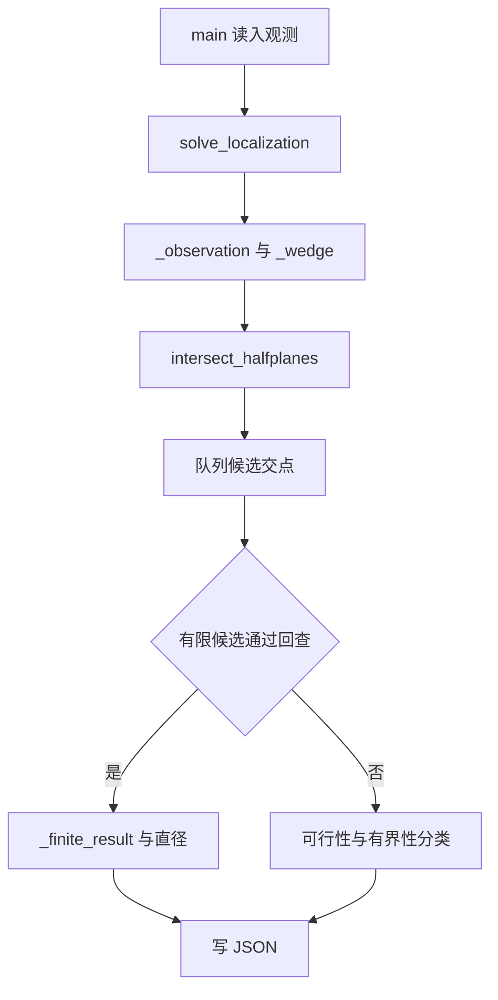

# 05 源码地图与逐段精读

## 5.0 怎样用这一章准备逐行答辩

本章以仓库 `source/` 中未修改的 Python 文件为准。行号用 `nl -ba` 核对，函数与类的起止用 Python AST 的 `lineno/end_lineno` 复核；装饰器算在类或方法范围内。表中的范围是实际定义范围，不包含后面的空行。遇到一行写了多条语句时，按执行顺序解释。

答辩时，对被指到的代码按以下顺序回答：**输入是什么 → 表示哪条数学约束 → 修改什么状态 → 哪个函数继续使用结果 → 什么情况下报错或不能作更强结论**。只念变量名或把 `for` 翻译成“循环”是不够的。

本章的“保证”均以程序采用的物理模型及数值容差为前提。它区分三类依据：解析几何关系、程序中的运行时检查、有限数值搜索或本地试验。三者不能互换。

### 5.0.1 文件与真实入口

| 文件 | 入口与责任 | 不应误读之处 |
| --- | --- | --- |
| `source/Q1/q1_generator.py:8-41` | `main()` 生成一组观测 JSON。 | 生成器知道真值，求解器不读取 `local_truth`。 |
| `source/Q1/q1_solver.py:283-302` | `main()` 读取 JSON，调用 `solve_localization`，写结果。 | 不计算最小包围圆；会检查“直径圆”是否覆盖顶点。 |
| `source/Q2/q2_generator.py:6-35` | 生成一个物理相容的首测。 | 只生成首测，不替优化器选择第二站。 |
| `source/Q2/q2_solver.py:481-538` | `solve_case → optimize_fixed_baseline → robust_quality`。 | D 与 R 两种目标各自重新选站；有限搜索不是连续全局证明。 |
| `source/Q3/q3_local_simulator.py:78-120` | 创建本地真值与 `Simulator`，调用 `q3_local_solver.run_case`。 | 本地 solver 文件没有命令行主入口，单独执行不会开始一局。 |
| `source/Q3/q3_official_solver.py:683-712` | 创建 HTTP 客户端，等待、入场、运行同一策略、退出、记日志。 | 正式文件不导入本地模拟器。 |
| `source/Q4/q4_local_simulator.py:82-118` | 创建全向/定向混合本地源，调用本地 solver。 | 模拟器的可见性分支与策略的普通无信号分支分属不同职责。 |
| `source/Q4/q4_official_solver.py:368-391` | Q4 正式 HTTP 入口。 | 正式策略同样不能读取模拟器隐藏真值。 |

### 5.0.2 本地与正式的重复代码确实相同

逐字节检查得到：

| 本地代码 | 正式代码中的对应范围 | 结论 |
| --- | --- | --- |
| `source/Q3/q3_local_solver.py:1-502` | `source/Q3/q3_official_solver.py:1-502` | 502 行完全一致。Q3 几何、状态、调度与 `run_case` 的行号一一相同。 |
| `source/Q4/q4_local_solver.py:1-208` | `source/Q4/q4_official_solver.py:1-208` | 208 行完全一致。Q4 的核心策略行号一一相同。 |

后文讲 Q3/Q4 核心时列本地文件名；**同一行号也精确对应上表中的正式文件**，不是“近似对应”。正式文件后半段才是新增客户端。重复是单文件提交的组织方式，不代表两套不同算法。

Q3 第 217 行注释还写着“geometry.py”，但当前目录没有这个模块，几何实现就在同一个 solver 的第 1–212 行；不能照注释声称运行时导入了它。Q2 的“Q1直径方法”标签也不表示导入 Q1：Q2 第 246–270 行自行实现凸包和直径，只借用“以 D 为目标”的方法含义。

### 5.0.3 最常见的量与不变量

| 量/状态 | 在代码中的含义 | 答辩时应说的关系 |
| --- | --- | --- |
| `Point` | 二元组 `(x,y)`，单位米。 | 点和位移向量都用同一种容器；含义由调用处决定。 |
| 半平面 `(n,b)` | `n·x <= b`。 | 所有裁剪都保留这一侧。 |
| `poly` | 按边界顺序排列的凸多边形顶点，允许退化。 | 用保守外近似维持真实源仍在集合内；不能当概率置信区间。 |
| `center,radius` | 覆盖当前顶点及其凸包的圆。 | 每个源到圆心的距离不超过 `radius`；清除依据是覆盖而非平均误差。 |
| `D` 与 `R` | 最远两点距离与最小包围圆半径。 | 总有 `D <= 2R`，通常不能反写成 `R=D/2`。 |
| `UNKNOWN/FOUND/CLEARED/ABSENT` | 未知/已发现未清除/已确认清除/有证据不存在。 | 一次无信号不等于频道不存在。 |
| `virtual_time_s` | 模拟器返回的任务时间。 | 与 Python 程序耗时、HTTP 超时是不同的时钟。 |
| `pending` | 已准备或发送但结果尚未确认的正式动作。 | 结果未知时不允许生成新请求 ID。 |

## 5.1 Q1：从示向度到半平面交，再到直径

### 5.1.1 数据类型和小函数：每个符号的用途

本节文件均为 `source/Q1/q1_solver.py`。

| 定义与精确位置 | 参数 → 返回/状态 | 操作、调用关系与数学意义 |
| --- | --- | --- |
| `HalfPlane`，`source/Q1/q1_solver.py:19-27` | `normal: Point, offset: float` → 冻结数据对象。 | 表示闭半平面 `normal·X<=offset`；由 `_normalise` 和 `_wedge` 创建。`frozen=True` 防止随后改写这两个字段。 |
| `HalfPlane.residual`，`source/Q1/q1_solver.py:26-27` | 点 → `n·x-b`。 | 负数在内、零在边上、正数在外； `_outside` 再加数值阈值。 |
| `_cross`，`source/Q1/q1_solver.py:30-31` | 两个二维向量 → 叉积标量。 | `ax*by-ay*bx`；正号用于左转，绝对值对应平行四边形面积。排序、凸包、卡壳都用它。 |
| `_sub`，`source/Q1/q1_solver.py:34-35` | 两点/向量 → 坐标差。 | 构造边和相对位置，避免把点的绝对坐标直接当方向。 |
| `_distance2`，`source/Q1/q1_solver.py:38-40` | 两点 → 距离平方。 | 比较远近时省去开平方；最终输出再开根号。 |
| `_normalise`，`source/Q1/q1_solver.py:43-59` | `HalfPlane`、`((a,b),c)` 或 `(a,b,c)` → 单位法向量的 `HalfPlane`。 | 接受三种输入格式；转浮点、拒绝 NaN/无穷和零法向量；同时除以正数 `hypot(a,b)`，保留原不等式方向和集合。 |
| `_direction`，`source/Q1/q1_solver.py:62-65` | 半平面 → `(-b,a)`。 | 法向量逆时针转 90°。沿此方向看，可行域在边界左侧；这是半平面交排序的方向约定。 |
| `_same_direction`，`source/Q1/q1_solver.py:68-70` | 两半平面 → 布尔值。 | 叉积近零判平行，点积大于零判同向。只有平行还不够：相反方向的两个约束可能形成条带，不能合并。 |
| `_intersection`，`source/Q1/q1_solver.py:90-97` | 两条边界 → 交点或 `None`。 | 用二阶线性方程的行列式求交；`abs(det)<=1e-12` 按平行处理。`None` 不代表半平面交空，只代表此对边界没有可靠唯一交点。 |
| `_outside`，`source/Q1/q1_solver.py:100-102` | 半平面、点 → 布尔值。 | 以 `EPS*max(1,abs(offset),abs(x),abs(y))` 放宽残差判断；相对坐标尺度控制舍入影响。 |
| `_cuts`，`source/Q1/q1_solver.py:105-107` | 新半平面、两旧边界 → 布尔值。 | 先求旧交点再判它是否被新约束排除；平行情形返回 False，留给后面的可行性/有界性判别兜底。 |

第 13–16 行定义 `Point`、`EPS=1e-10`、`PARALLEL_EPS=1e-12` 和 `NUMERICAL_ANGLE_GUARD_DEG=0.0`。最后一个名称在当前文件中没有被读取；不要声称它已被加进每个角楔。Q1 实际角宽由 `solve_localization` 的 `epsilon_deg` 决定。

### 5.1.2 观测转换：为什么是这两个法向量

| 定义与位置 | 输入、输出与依赖 |
| --- | --- |
| `_observation`，`source/Q1/q1_solver.py:240-254` | 一条字典或长度为 3 的序列 → `(float x,float y,bearing%360)`。 |
| `_wedge`，`source/Q1/q1_solver.py:257-265` | 站点、报告角度、误差半宽 → 两个或三个 `HalfPlane`。 |
| `solve_localization`，`source/Q1/q1_solver.py:268-280` | 观测列表与误差半宽 → 定位结果字典；调用上面两函数和 `intersect_halfplanes`。 |

`_observation` 第 241–246 行允许 `position_m`/`position`、`bearing_deg`/`svd_deg` 两组键，位置也可以是 `{"x":...,"y":...}`。第 248–253 行对序列长度和数值有限性作校验。`%360` 把方向统一到一圈，不改变几何方向。

设站点为 (p)，报告为 θ，半宽为 ε；下、上边界单位向量分别为 (u_-=u(θ-ε))、(u_+=u(θ+ε))。前向角楔满足：

\[
u_-\times(x-p)\ge0,\qquad u_+\times(x-p)\le0.
\]

展开第一式，得到 `(sin(lower),-cos(lower))·x <= n·p`；第二式得到 `(-sin(upper),cos(upper))·x <= n·p`。这正是第 259–261、265 行。两个法向量的符号决定保留哪一侧，不能随意反号。

第 262–264 行专门处理 ε=0：两侧不等式只能限制在一条直线上，因此另加 `-u·(x-p)<=0`，即 `u·(x-p)>=0`，把整条直线限制成向前射线。

`solve_localization` 第 269–274 行要求 `0<=epsilon<90` 且至少一条观测；这个角宽条件确保一个前向角楔能用相应凸半平面交表达。第 275 行是双层列表推导：每条观测各给出 2 条约束，ε=0 时给 3 条。第 276 行求交，第 277–279 行把规范化后的观测和角宽附加到结果里，不读取真值，也不重新拟合平均方位角。

### 5.1.3 半平面排序与双端队列

**`_ordered`：`source/Q1/q1_solver.py:73-87`。** 参数为可迭代半平面，返回规范化、按边界方向排序、同向去冗余后的列表。

1. 第 74 行先统一法向量长度，否则不能直接比较不同约束的 `offset`。
2. 第 75 行用 `atan2(y,x)%tau` 得到完整的 [0,2π) 方向并排序；只用 `atan(y/x)` 会丢象限且怕 x=0。
3. 第 77–82 行处理相邻同向边界。单位法向量相同的时候，`n·x<=c` 中 c 越小越严格，所以保留较小 offset。
4. 第 83–86 行补查圆周首尾，因为接近 0° 与 360° 的同向方向可能被排序拆到两端。

**`intersect_halfplanes`：`source/Q1/q1_solver.py:201-237`。** 输入半平面可迭代对象；返回含 `status`、顶点、面积、直径等字段的字典。

| 行段 | 精确执行含义 | 为什么需要 |
| --- | --- | --- |
| 203 | `del include_circle`。 | 这是保留的兼容参数，当前不控制任何圆计算；后面仍会输出直径圆覆盖检查。 |
| 204–211 | 排序后逐条入队；新约束若排除队尾两线交点则 `pop`，排除队首两线交点则 `popleft`，最后 `append`。 | 方向有序时，被切掉的旧边界只需从两端删除，保留可能构成最终边界的约束。每条边界在主队列中至多入队、出队一次。 |
| 212–215 | 用首约束修剪尾端，再用尾约束修剪首端。 | 输入遍历是线性的，多边形边界是闭环；必须收口。 |
| 217–220 | 相邻边界求交，包括尾与首；若没有平行交点则再取凸包。 | 得到候选顶点顺序并去掉重复/共线点。 |
| 224 | 至少 3 个顶点，或退化为点/线段且原约束方向保证有界。 | 只有两条相邻线的交点不能被误当成“定位成一个点”：两条半平面的交仍可能是无界角域。 |
| 225–226 | 检查每个候选顶点满足每条原约束，通过才返回有限结果。 | 这是对队列结果的独立回查，不只信任中间队列。凸性使顶点满足即可推出它们的凸包满足。 |
| 228–235 | 求可行点；没有则 `empty`；有且不有界则 `unbounded` 并给见证点。 | “空”与“无界”都有可能没有有限闭多边形，不能按顶点数直接区分。 |
| 236–237 | 其余返回 `uncertain`。 | 已找到可行点且方向应有界，但候选闭图形未通过验证；代码保留不确定结果，不伪造顶点。 |

复杂度要完整说：排序是 (O(m\log m))，主队列部分是 (O(m))；第 225 行的全约束回查是 (O(mh))，兜底 `_feasible_point` 最坏 (O(m^2))。所以不能把整段实现不加条件地都称为 (O(m\log m))。

### 5.1.4 空集、无界与退化情形

**`_feasible_point`：`source/Q1/q1_solver.py:110-132`。** 输入规范化约束列表；返回可行点，或 `None`。它只作分类，不寻找“最好的定位点”。

初始点为原点。第 113–115 行如果当前点满足新约束，直接继续；否则把点移到新约束的边界上。因法向量已单位化，`base=n*offset` 在边界上，`tangent=(-ny,nx)` 沿边界。新点写成

\[
x=\text{base}+t\,\text{tangent}.
\]

第 119–121 行把每条旧约束代入，变成 `coefficient*t <= bound`。系数正，更新 t 的上界；系数负，除法反向，更新下界；系数近零且 bound 负，说明这条边界上不可能满足旧约束，返回 None。第 128 行判断上下界是否冲突；第 130 行把 0 投影到允许区间，选离 base 最近的参数，再写回坐标。

为什么可转到“新边界上找”？此前约束的可行域是凸集，原可行点违反新约束；若合并后仍有可行点，把二者连线，会在新边界上经过一个满足全部旧约束的点。

**`_is_bounded`：`source/Q1/q1_solver.py:135-141`。** 返回是否不存在非零无界移动方向。对法向量按角排序，补最后到最前的一段圆周空隙；若最大间隙小于 π，法向量在各个方向封闭了逃逸通道。数学上判断的是衰退锥

\[
\{d:n_i\cdot d\le0\ \forall i\}=\{0\}.
\]

它本身不判可行性；一个矛盾约束组也可能方向封闭。因此主函数先分可行/不可行，再用它区分有界/无界。少于 3 条约束直接返回 False。

### 5.1.5 凸包、旋转卡壳与结果字段

| 定义与精确位置 | 输入 → 输出 | 逐段阅读要点 |
| --- | --- | --- |
| `_convex_hull`，`source/Q1/q1_solver.py:144-157` | 点集 → 逆时针凸包顶点。 | 145–147：转浮点、去重、字典序排序、处理 0/1 点。157：上下链去掉重复端点再拼接。 |
| 内部 `chain`，`source/Q1/q1_solver.py:149-155` | 有序点列 → 单侧凸链。 | 152–153：最后两个点与新点不构成足够明确左转时弹出中间点；154 再入栈。维持凸链，不保留直边上的中间点。 |
| `polygon_diameter`，`source/Q1/q1_solver.py:160-181` | 点列 → `(直径,最远点对)`。 | 162 先取凸包；164–169 对 0、1、2 点分别处理；普通情况以叉积高度移动对踵点 j，比较边两端到 j 的平方距离。 |
| `_finite_result`，`source/Q1/q1_solver.py:184-198` | 非空有限候选顶点 → 结果字典。 | 再清理凸包；极短线段合并成点；按顶点数分类；算直径、鞋带面积、直径圆覆盖与最小覆盖裕量。 |

卡壳第 174–176 行比较的不是两点距离，而是“同一条边到下一个候选顶点的有向高度”，即 `cross(edge,point-edge_start)`。在凸多边形上转动边时，最远支撑顶点沿同一方向推进，所以 j 不必为每条边从头搜索。第 177–180 行才比较真正距离，并同时检查边的两端。

`_finite_result` 的第 190–191 行是鞋带公式 (A=\frac12|\sum x_i y_{i+1}-y_i x_{i+1}|\)。第 192–198 行用最远点对的中点、D/2 构造直径圆，逐顶点检查 `farthest<=radius+EPS`。凸圆包含所有顶点就包含整个凸包；但“最远点对是直径”并不自动保证这个圆覆盖所有点，等边三角形就是反例。字段 `diameter_circle_cover_margin_m=radius-farthest` 为负便说明有顶点落在圆外。

### 5.1.6 Q1 入口与生成器的可解释执行轨迹

`source/Q1/q1_solver.py:283-298` 的 `main(argv=None)`：第 284–287 行解析 `--input/--output`；288 读 UTF-8 JSON；289 调用求解；290 用输入 case_id 或文件名作标识；291 创建目录；292 写易读 JSON；293–297 打印状态；298 返回进程成功码 0。第 301–302 行只在直接执行文件时运行入口，导入函数时不会执行。

拿到一个观测文件后，实际调用链为：



`source/Q1/q1_generator.py:8-41` 只有一个 `main`：

| 行段 | 做什么与为什么 |
| --- | --- |
| 9–16 | 参数、随机种子、独立随机发生器；观测数至少 3。未给种子时从 `SystemRandom` 取一个并记录，以便复现。 |
| 17–19 | 在半径 `1800*0.82` 的圆内按面积均匀采样真源：角度均匀，半径取 `R*sqrt(U)`。若直接 `R*U`，会更偏向圆心。 |
| 21–26 | 围绕真源布置多站：大致等角分布加扰动、距离 500–1450m、站点坐标四舍五入；用 `atan2(source-station)` 算真示向。 |
| 29–33 | 加 ±1° 随机误差并四舍五入成两位小数；把圆周差折到 [−180°,180°)，若最终误差超过 1° 就重抽。 | 
| 34–38 | 输出 seed、观测与仅用于本地核验的 `local_truth`。注意“先限制误差、再量化”可能越界，因此前一步要对最终报告重查。 |
| 39–41、43 | 打印路径等信息；脚本直接执行时调用 main。 |

## 5.2 Q2：安全第二站与最坏剩余不确定性

本节所有 solver 定义在 `source/Q2/q2_solver.py`。它没有在线移动动作，也没有 HTTP；任务是给定首站/首报告，数值选择第二站。

### 5.2.1 基础运算与坐标变换完整索引

| 定义与精确位置 | 参数 → 返回 | 用途 |
| --- | --- | --- |
| `add`，`source/Q2/q2_solver.py:33-34` | a,b → a+b。 | 平移。 |
| `sub`，`source/Q2/q2_solver.py:37-38` | a,b → a−b。 | 边向量和相对坐标。 |
| `mul`，`source/Q2/q2_solver.py:41-42` | 向量 a、标量 k → ka。 | 插值、圆心中点。 |
| `dot`，`source/Q2/q2_solver.py:45-46` | a,b → 点积。 | 半平面残差、投影、距离平方。 |
| `cross`，`source/Q2/q2_solver.py:49-50` | a,b → 二维叉积。 | 鞋带、转向、外接圆行列式、卡壳。 |
| `dist`，`source/Q2/q2_solver.py:53-54` | a,b → 欧氏距离。 | 包围圆及距离检查。 |
| `local_to_world`，`source/Q2/q2_solver.py:57-60` | 首站、首报告角、局部 a,b → 世界点。 | 将局部坐标按首示向旋转，再加首站平移：`S1+a*u+b*v`。 |
| `candidate`，`source/Q2/q2_solver.py:403-405` | 基线 L、偏角 ψ、side=1 → 局部站点。 | `(L cosψ, side*L sinψ)`。实际优化使用带正负号的 ψ，side 参数保持默认 1。 |

局部 x 轴沿首示向、局部 y 轴向左。第 25–30 行把误差半宽定为 1°，接收半径范围定为 1000–1500m，源场地半径定为 1800m，几何残差容差定为 (10^{-9})。首站不在原点时，源场地圆仍以世界原点为圆心，因此正负 ψ 两侧可能不再等价。

### 5.2.2 安全域函数：公式就在这些行

| 定义与精确位置 | 参数 → 返回 | 保证的内容 |
| --- | --- | --- |
| `_sector_max_distance_sq`，`source/Q2/q2_solver.py:63-77` | 局部站点 s、扇区半径 ρ、半宽 δ → 最大距离平方。 | 求 `max ||s-r*u(eta)||²`，`0<=r<=ρ, abs(eta)<=δ`。 |
| `safe_full_information`，`source/Q2/q2_solver.py:80-88` | s、δ、rmin → 布尔值。 | 利用“首站已经收到”的信息，检测截到 rmin 的首测扇区是否都在 `B(s,rmin)`。 |
| `safe_uniform_1000`，`source/Q2/q2_solver.py:91-94` | s、δ、rmin、rmax → 布尔值。 | 整个 1500m 首测扇区都离第二站至多 1000m；这是更保守、统一使用最小接收半径的设计。 |
| `safe_angle_limit`，`source/Q2/q2_solver.py:97-111` | 固定 L、安全域名、δ、半径上下界 → 最大绝对偏角或 None。 | 给外层一维站点搜索一个解析安全弧边界。 |

`_sector_max_distance_sq` 展开平方为

\[
\|s-r u(\eta)\|^2=L^2+r^2-2r\,[a\cos\eta+b\sin\eta].
\]

对固定 η，它是 r 的凸二次式，最大值在 r=0 或 r=ρ。第 69–75 行找角度区间上点积的最小值：检查两端，再检查与 s 反向的内部驻点 `psi+pi+2*pi*k`。第 77 行把 r=0 的 `length2` 与外弧最坏值比较。因此这段不是用角度采样近似安全域，而是枚举解析极值位置。

`safe_full_information` 为什么只用 rmin？如果真实源距首站 r，首站收到说明真实接收半径至少为 `max(rmin,r)`。对 r>=rmin，要求 `||s-r*u||<=r` 等价于 `L²<=2r*s·u`；一旦 rmin 处满足，相关投影为非负，r 增大只使条件放宽。对 r<=rmin 则需覆盖整个短扇区。于是归结为第 88 行的检测。这个函数所称 exact 是对该未截场地的首测信息模型，不是利用世界场地边界后的最大安全域。

固定 L 后，最不利角度在离 s 最远的扇区边，得到：

\[
|\psi|\le
\begin{cases}
\arccos\!\left(\dfrac{L}{2r_{\min}}\right)-\delta,&\text{full\_information},\\
\arccos\!\left(\dfrac{L^2+r_{\max}^2-r_{\min}^2}{2Lr_{\max}}\right)-\delta,&\text{uniform1000}.
\end{cases}
\]

对应第 103–111 行。第 101 行还要求 `0<L<=rmin`，因为扇区包含首站附近位置，过远站点无法对所有可能源统一保证接收。`ratio>1` 返回 None；负的剩余角宽压为 0。优化器随后拒绝 0 角宽，避免只能共线的候选。

### 5.2.3 外接多边形与逐边裁剪

| 定义与精确位置 | 输入 → 输出 | 关键操作与集合语义 |
| --- | --- | --- |
| `circle_outer_polygon`，`source/Q2/q2_solver.py:114-121` | 圆心、半径、边数 → 外接正多边形。 | 边数至少 24；顶点半径 `radius/cos(pi/sides)`，顶点角度偏移半个角步长，使边到圆心距离恰为 radius。 |
| `clip_halfplane`，`source/Q2/q2_solver.py:124-144` | 凸顶点序列、法向量、偏移 → 裁后顶点序列。 | 按每条边是否跨越 `n·x=offset` 增加交点与内侧端点，去除连续重复顶点。 |
| `clip_disk_outer`，`source/Q2/q2_solver.py:147-154` | 多边形、圆心、半径、边数 → 交圆外接多边形的结果。 | 每个均匀方向 n 用 `n·x<=n·center+radius` 作切线约束；空集后提前退出。 |
| `clip_wedge`，`source/Q2/q2_solver.py:157-166` | 多边形、站点、报告、δ → 与角楔的交。 | 两个法向量与 Q1 相同，调用两次裁剪。默认 δ=1°。 |
| `first_feasible_polygon`，`source/Q2/q2_solver.py:169-178` | 首站、首报告、δ、边数 → 首测可行域外包络。 | 外接场地圆 → 外接首站 1500m 圆 → 首测角楔，按此顺序相交。 |
| `physical_base`，`source/Q2/q2_solver.py:278-279` | 首测多边形、第二站、边数 → 第二站 1500m 距离限制后的公共基底。 | 与第二个报告无关，可以在内层搜索之前只算一次。 |
| `post_region`，`source/Q2/q2_solver.py:282-284` | 公共基底、第二站、第二报告、δ → 后验区域外包络。 | 给公共基底增加第二个角楔。 |

裁剪第 128–137 行先令 a 为最后一个点，以便自然处理“末点到首点”的闭边。边两端残差为 fa、fb，若内外判断不同，线性插值得到交点参数

\[
t=\frac{f_a}{f_a-f_b},\qquad x=a+t(b-a).
\]

它来自 `f(a+t(b-a))=(1-t)fa+t*fb=0`。随后只保留内侧 b；第 138–143 行清理相邻重复点和首尾重复点，避免后续产生零长度边。这里以 `fa<=EPS` 判内，但交点公式仍求精确零残差，因此 EPS 是浮点判别容差，不是整个多边形的严格符号区间证书。

圆一定要外接：内接多边形会错误排除靠近真实圆弧的可能源。外接多边形多保留了一些点，所以对某个已评价报告得到的 D/R/A 偏向保守。首测 `direction` 还隐含离站超过 5m，代码第 173–174 行明确不挖这个小内孔，以保留凸性并保持外包络。

### 5.2.4 面积、直径与最小包围圆逐函数索引

| 定义与精确位置 | 参数 → 返回 | 方法与关系 |
| --- | --- | --- |
| `polygon_area`，`source/Q2/q2_solver.py:181-183` | 顶点序列 → 面积。 | 鞋带公式；少于 3 点面积 0。 |
| `_diameter_circle`，`source/Q2/q2_solver.py:186-188` | 两点 → `(中点,距离/2)`。 | 两个边界支撑点的最小圆。 |
| `_circumcircle`，`source/Q2/q2_solver.py:191-199` | 三点 → `(圆心,半径)` 或 None。 | 平移到 a 附近后解等距方程；行列式小于 `1e-14` 视为共线。 |
| `minimum_enclosing_circle`，`source/Q2/q2_solver.py:202-235` | 非空点集 → `(圆心,审核后的半径)`。 | 固定随机种子的增量最小包围圆，最终对所有原点重新取最大距离再加 `1e-7`。 |
| `Metrics`，`source/Q2/q2_solver.py:238-243` | D、R、A、顶点数 → 冻结数据对象。 | 作为单个报告的几何指标，不包含最坏报告搜索。 |
| `_hull`，`source/Q2/q2_solver.py:246-255` | 点集 → 凸包。 | 去重、排序、上下链；少于等于 2 点直接返回。 |
| `_hull.chain`，`source/Q2/q2_solver.py:249-254` | 单向点序 → 凸链。 | 叉积 `<=1e-10` 弹出中间点，保持凸性。 |
| `polygon_diameter`，`source/Q2/q2_solver.py:257-270` | 点集 → `(直径,点对)`。 | 对凸包作旋转卡壳；与 Q1 同原理，空集返回 `(0,None)`。 |
| `polygon_metrics`，`source/Q2/q2_solver.py:272-275` | 非空多边形 → `Metrics`。 | 依次算直径、MEC 半径和面积。空集不能传到其中的 MEC。 |

外接圆公式第 192–199 行：令 (u=b-a,v=c-a,o=\text{center}-a)，由到 a、b 等距得 (2o\cdot u=\|u\|^2)，到 a、c 等距得 (2o\cdot v=\|v\|^2)。解这个二元方程组，分母就是 `2*cross(u,v)`。平移是为了减轻用大绝对坐标平方相减的消减误差。

MEC 的非平凡部分不能简化成“逐点求外接圆”：

1. 第 204–208 行拒绝空输入，复制点序并用固定种子 20260911 打乱。随机顺序为了增量算法效率，可复现种子不代表给测向误差赋概率。
2. 第 209–212 行若新点 p 已在当前圆内，无需变化；否则 p 必須成为新圆的边界支撑点，先从零半径圆开始。
3. 第 213–218 行旧点 q 若在外，改成 p、q 为直径的圆，并固定这两个边界点。
4. 第 219–230 行，先只看该直径圆外的旧点 r；计算过 p、q、r 的外接圆，并按 r 在 pq 左/右分组。左侧保留圆心有向高度最大的候选，右侧保留最小的候选；这些是满足固定 p、q 边界条件所需的极端圆。
5. 第 231–233 行从可用侧候选选半径较小者。共线三点没有唯一外接圆，返回 None 后跳过。
6. 第 234–235 行最后不直接信任内部 r，而是保留求出的圆心，重新算所有输入点到该圆心的最大距离并加微小裕量。这个半径能保证覆盖当前浮点顶点；它可能比理想精确 MEC 半径大一点，审计不等于在浮点下形式化证明“全局最小”。

### 5.2.5 内层最坏报告搜索：完整阅读 `robust_quality`

`RobustQuality` 在 `source/Q2/q2_solver.py:287-304`，保存三个独立最坏值、各自达到最坏值的报告、R 最坏时的整套 `Metrics`、搜索计数和精度参数。其 `as_dict()` 在 `source/Q2/q2_solver.py:301-304` 用 `asdict` 递归转字典，明确加 `continuous_report_maximum_certified=False`。

**主函数 `robust_quality`：`source/Q2/q2_solver.py:307-400`。** 输入第二站，关键字参数包括首站/首示向/δ/圆边数/报告网格步长；返回 `RobustQuality`。它不修改任何机器人状态。

数学目标是对第二站 s 计算

\[
\widehat Q(s)\approx\max_{z:P_2(s,z)\ne\varnothing}Q(P_2(s,z)),\quad Q\in\{D,R,A\}.
\]

选择报告 z 后再求可行区域，保证“源位置与报告误差”相容；不能分别取一个最坏源和一个与它不相容的报告硬拼。代码中的 (P_2) 是圆的外接多边形近似，所以非空可行性也针对外包络，会多接纳一些边缘报告。

| 行段 | 操作 | 数学/工程理由 |
| --- | --- | --- |
| 318–320 | 建首测集合、第二站物理距离基底与缓存。 | 距离约束不随报告改变，重复使用。 |
| 322–331 | 内部 `evaluate(z)`：将角度 `%360` 后四舍五入到 10 位作键；命中缓存则返回；否则裁角楔，空集返回 None，非空算指标并缓存。 | 合并 0°/360° 等价方向，节约三个目标共同搜索的重复开销。空集结果没有写入缓存。 |
| 333–344 | 令 `count=ceil(360/report_step)`，均匀取 `z=i*360/count`；非空记录在 `records` 和 `coarse`，空值仍在 coarse 中占位置。 | 真实网格间距是 `360/count`，不一定恰等于参数值；保留空槽才能看相邻方向是否可行。 |
| 345–346 | 一个可行网格报告都没找到则抛错。 | 这是当前有限网格没有结果，不是连续报告域为空的正式证明。 |
| 351–367 | 对 R、D、A 各自找粗网格局部极大：邻居不可行按负无穷处理；没有候选时取当前记录最大点作备用。 | 三个指标最坏位置可以不同，要分别细化。 |
| 368–370 | 只取数值最大的 8 个局部峰，在左右各一个网格间距范围内细化。 | 控制计算成本；没有证明其他未选峰不含更高连续峰。 |
| 372–374 | 内部 `field_value(z)`，从 evaluate 取当前指标；空集合回负无穷。 | 把带可行性判断的问题转为有界标量最大化。 |
| 376–387 | 黄金比例取 c,d，比较 fc,fd，保留较大值一侧，重复 34 次。 | 重用一个内部评价，减少调用；该方法对单峰区间最有依据，此处没有证明每个区间单峰。 |
| 388–391 | 将细化后 5 个位置中的可行值追加到 `records`。 | 最终最大值从 records 里选。细化过程中的其他缓存评价并非全部追加到 records。 |
| 393–400 | 分别取 records 中的 R/D/A 最大行，组装返回值。 | `metrics_at_worst_R` 中的 D/A 是 R 最坏报告处的 D/A，不必等于全报告最坏 D/A。 |

内部函数的精确范围是 `source/Q2/q2_solver.py:322-331`（`evaluate`）与 `source/Q2/q2_solver.py:372-374`（`field_value`）。

**容易被问住的输出口径：** `feasible_report_count=len(records)` 可以包含重复追加的报告；`report_evaluations=len(cache)` 只数不同键的非空缓存，不包括每次空集尝试，也不等于所有 evaluate 调用次数。参数 `refine_step_deg` 虽在签名和调用中出现，但函数体没有读取它；真正细化轮数固定为 34，不能说它控制了最终步长。

圆外近似对一个给定报告的 D/R/A 是保守的，**并不能推出有限报告最大值是连续最坏值的上界**。报告漏采样可能低估峰值；圆多保留位置可能高估指标；两种方向的误差不能自动互相抵消。

### 5.2.6 外层选站与主入口逐段精读

**`optimize_fixed_baseline`：`source/Q2/q2_solver.py:408-469`。** 输入目标名 `R/D/A`、基线 L、首测信息、安全域、搜索精度；返回最佳被评价候选的站点坐标、ψ、质量与数值范围说明。

| 行段 | 状态/分支与原因 |
| --- | --- |
| 416–421 | 校验目标；算安全角极限；没有非共线安全弧则报错；选择 uniform1000 或 full_information 安全判定器。 |
| 424–425 | 内部 `score(q)` 将目标字母映射到对应最坏值；精确函数范围为 `source/Q2/q2_solver.py:424-425`。 |
| 430–441 | 对负、正两侧分别粗搜。从 `max(0.2,coarse_psi_deg)` 开始，每步加 coarse；每个点先验安全，转世界坐标，再调用 robust_quality。保存 `(score,psi,q)`。 |
| 442–456 | 每侧单独找最佳粗点，在其前后一个 coarse 宽度内用 fine 步长再搜；将范围夹到安全弧，且与 0° 至少隔 0.05°。 |
| 457–461 | 无候选则报错；从两侧所有被评价点取最小分数，再计算最终局部/世界坐标。 |
| 462–469 | 返回候选数、最优被评价值及 `continuous_global_optimum_claimed=False`。 | 

“两側搜索”很关键：若首站位于世界原点，首测扇区与场地圆关于首示向对称，则两侧可能等价；首站平移后，世界场地截断通常破坏这种对称。第 430 行明确搜两侧，不能口述成只搜左边再镜像。

`final_quality` 在 `source/Q2/q2_solver.py:472-477`：给已选定第二站换更细圆边数和报告网格，再调用 `robust_quality`、转字典；它不重新优化 ψ 或基线。其签名没有 δ 参数，使用 robust_quality 默认 1°。

`solve_case` 在 `source/Q2/q2_solver.py:481-519`：

1. 第 482–485 行读取首站、首示向和基线列表；默认基线 600、700、800、900、1000m。
2. 第 486–489 行选择 quick/常规精度：搜索圆边数 72/96，报告步长 2°/1°，外层 coarse 2°/1°，fine 0.25°/0.1°。
3. 第 491–499 行分别以 D 和 R 为目标遍历全部基线；某基线 `ValueError` 时跳过。A 可由底层优化器单独使用，但这个入口不优化 A。
4. 第 500–502 行要求至少有候选，并分别选 D 方案和 R 方案。
5. 第 503–513 行用更细的 180/360 边、0.5°/0.2° 报告网格复评这两个固定方案。`meets_20m_on_evaluated_reports` 字段精确地只说“已评价报告上 R<=20m”。
6. 第 514–519 行输出比较表和所有基线搜索摘要，固定主方法为 R。输入里的额外真值不会读取，输入自带其他误差字段也不改变此处固定 `DELTA_DEG=1` 的模型。

`main(argv=None)` 在 `source/Q2/q2_solver.py:521-536`，解析输入/输出/quick，读 JSON，调用 solve_case，创建目录，写 JSON，打印两套方案和第二站坐标。第 538 行触发脚本入口。

完整执行顺序是：`main → solve_case → 对每个目标和L调用 optimize_fixed_baseline → 对每个安全ψ调用 robust_quality → 对每个报告调用 post_region/polygon_metrics → 选站 → final_quality复评 → 输出`。内层是最大化，外层是最小化，这就是该实现的 minimax 结构；这里的 max/min 都受有限搜索范围约束。

### 5.2.7 Q2 生成器

`main()` 在 `source/Q2/q2_generator.py:6-34`，第 35 行是脚本入口。

| 行段 | 输入/操作/输出 |
| --- | --- |
| 7–12 | 解析 seed/output，记录可复现 seed，并创建独立 Random。 |
| 14–17 | 采样距原点 0–450m 的首站，再在其周围 450–1400m 采样源。这里首站半径是均匀分布，不是面积均匀采样。 |
| 18–21 | 若源离场地原点超过 1750m，把它径向缩回 1750m，再算首站到最终源的真方位。 |
| 22–25 | 加误差、两位小数量化，并对最后圆周误差重查，保证生成报告仍在 ±1° 内。 |
| 26–30 | 保存首站、首报告、基线候选和 `local_truth`；不保存第二站答案。 |
| 31–34 | 打印 seed、首测与输出位置。 |

## 5.3 Q3：全向源在线发现、集合定位与清除

以下核心代码的位置同时适用于 `source/Q3/q3_local_solver.py` 和 `source/Q3/q3_official_solver.py`，它们的前 502 行逐字相同。表中以本地文件给出 `file:line`，正式代码按同一行号查找。Q3 将机器人动作藏在 `api` 接口后面；几何计算本身不接触真值。

### 5.3.1 几何小函数与保守量

| 定义与精确位置 | 参数 → 返回 | 调用与不变量 |
| --- | --- | --- |
| `add`，`source/Q3/q3_local_solver.py:12` | a,b → a+b。 | 构造世界点、插值、圆心。 |
| `sub`，`source/Q3/q3_local_solver.py:13` | a,b → a−b。 | 相对方向与边向量。 |
| `mul`，`source/Q3/q3_local_solver.py:14` | a,s → sa。 | 缩放位移。 |
| `dot`，`source/Q3/q3_local_solver.py:15` | a,b → 点积。 | 残差、二次交点系数、投影。 |
| `cross`，`source/Q3/q3_local_solver.py:16` | a,b → 叉积。 | 转向、凸包、外接圆。 |
| `norm`，`source/Q3/q3_local_solver.py:17` | 向量 → 长度。 | `hypot(*a)` 将二元组拆成两个实参。 |
| `dist`，`source/Q3/q3_local_solver.py:18` | 两点 → 距离。 | 路程、覆盖与清除判定。 |
| `unit`，`source/Q3/q3_local_solver.py:19-21` | 向量 → 单位向量。 | 太短时返回 `(1,0)`，避免除零；侧移方向在圆心与当前位置几乎重合时仍确定。 |
| `maxdist`，`source/Q3/q3_local_solver.py:22-23` | 点 p、凸包顶点 → 最大顶点距离，空集为 0。 | 距离是凸函数，所以最大值可由顶点控制整个凸包。空集默认值只是工具约定，主流程会另行拒绝空可行域。 |
| `hull`，`source/Q3/q3_local_solver.py:25-35` | 点集合 → 凸包。 | 字典序去重、构造上下凸链，非左转时弹栈；用于无信号后的凸松弛。 |
| `clip`，`source/Q3/q3_local_solver.py:37-56` | 多边形、n、b → 与半平面的交。 | 与 Q2 同样逐边裁剪，但第 40 行先把 b 增加 `EPS*max(1,norm(n))`；各边交点仍按残差线性插值。 |
| `arena_polygon`，`source/Q3/q3_local_solver.py:58-61` | sides=48 → 场地圆的外接正多边形。 | 顶点半径 `1800/cos(pi/sides)`，保持源集合包含真实场地。 |

第 7–10 行的 `DELTA=radians(1.0051)` 包含物理 1°、两位小数报告的 0.005° 量化裕量与 0.0001° 数值保护。代码计算用弧度，API 接收/返回的 `svd_deg` 用度，入口处有显式转换。

`clip` 第 43–49 行跨边相交的参数是 `fa/(fa-fc)`，原理与 Q2 一样；第 50–55 行去重。由于阈值先加到 b 中，裁的是略向外扩的半平面。法向量通常是单位向量；`max(1,norm(n))` 保证在更大法向量尺度下也有相应保护。

### 5.3.2 正观测更新为什么是一个三角形外包络

**`bearing_update`：`source/Q3/q3_local_solver.py:63-76`。** 输入当前 `poly`、站点 p、报告角；输出裁过后的凸多边形。

第 68 行取 `R=min(1500,maxdist(p,poly)+EPS)`：既不超过物理最大接收距离，又利用旧可行域收紧距离上界。第 69–74 行裁两个角楔边界；第 75–76 行再裁 `u·(x-p)<=R`。

为何不直接求圆弧交？任意真实源满足 `||x-p||<=R`，必有 `u·(x-p)<=R`；后者是圆的一个支撑半平面，和两条角楔边围成前向三角形。它比真实圆扇区稍大，但裁剪快且始终保留真实源。

把 p 放在原点，u 当 x 轴，三角形顶点是

\[
(0,0),\quad(R,R\tan\delta),\quad(R,-R\tan\delta).
\]

令圆心为 `(h,0)`，使它到原点与角点等距，有

\[
h^2=(R-h)^2+R^2\tan^2\delta
\Rightarrow h=\frac{R}{2\cos^2\delta}.
\]

所以一次正观测至少给出一个半径约 `0.500154R` 的可覆盖圆。这个公式实际出现在 `Strategy._observe` 第 305 行，不只存在于文字证明中。首个 `R<=1500`，因此覆盖半径小于 751m，是后续移动到圆心仍在 1000m 保证接收范围内的依据。

### 5.3.3 无信号不是“没有源”，而是安全排除一块区域

**`exclude_disk_hull`：`source/Q3/q3_local_solver.py:78-98`。** 输入当前凸区域 P、测站 c、可排除圆半径；返回

\[
\operatorname{conv}\bigl(P\setminus B^\circ(c,r)\bigr)
\]

的保守浮点构造。Q3 的源全向，接收半径至少 1000m，因此某频道在 c 无信号，若该频道确有尚未清除的源，它不在保证接收的 1000m 范围内。取凸包会把一部分已排除区域重新填回来，但仍不会把真实源错误删掉。

| 行段 | 具体操作与理由 |
| --- | --- |
| 83–85 | 空集原样返回；排除半径减少 `1e-5`，保留圆外的原顶点，并再放宽 `1e-6`。 | 
| 86–90 | 遍历每条边，写作 `a+t*d`，令 f=a−c；与圆交点满足 `A*t²+B*t+C=0`，其中 A=d·d，B=2f·d，C=f·f−r²。 |
| 89、91–93 | 零长度边跳过；判别式负则不相交；否则安全开平方。 |
| 94–97 | 两个根若在略放宽的 [0,1] 内，夹回该区间并加入边圆交点。 |
| 98 | 对“留下的原顶点 + 边圆交点”取凸包。 | 

为什么只取这些点？去掉开圆后，原多边形的外边界仍由原顶点和边上的圆交点控制；朝向洞的圆弧对凸包贡献的是弦，取凸包无需保留曲线洞。若无信号发生在尚未发现的频道，策略只保存负观测，首次正观测后再对紧区域批量应用这些排除，避免对整个场地反复作较松的凸化。

**`inside_polygon`：`source/Q3/q3_local_solver.py:100-107`。** 参数 p、poly、tol；返回是否在多边形内。空集 False，点集合比较距离，线段用投影参数与垂距，普通凸多边形检查每条有向边的左侧。当前默认策略没有直接调用它；它是供本地审计等用途的辅助函数，不是每次 HTTP 观测都会执行的真值检查。

### 5.3.4 包围圆与最近认证清除位置

| 定义与精确位置 | 参数 → 返回 | 要点 |
| --- | --- | --- |
| `_diameter`，`source/Q3/q3_local_solver.py:109-110` | a,b → 中点圆。 | 固定两个边界支撑点。 |
| `_circum`，`source/Q3/q3_local_solver.py:111-117` | a,b,c → 外接圆或 None。 | 平移求二元等距方程，`abs(D)<1e-18` 判近共线。 |
| `_in`，`source/Q3/q3_local_solver.py:118` | circle,p → 布尔值。 | 距离不超过内部半径加 `1e-9`，只用于增量构造。 |
| `mec`，`source/Q3/q3_local_solver.py:120-146` | 非空顶点 → 圆心、审核半径。 | 固定种子 271828 打乱；p/q/r 三层增量构造和两侧极值圆与 Q2 相同；最终返回 `maxdist(c,points)+1e-6`。 |
| `nearest_certified_clear`，`source/Q3/q3_local_solver.py:148-154` | 当前位置 p、覆盖圆 c/r、clear_r=19.8 → 最近的认证清除点。 | 将 p 投影到圆盘 `B(c,19.8-r)`；r 太大则报错。 |

MEC 第 127–143 行依次处理“新点已覆盖”“强制 p 为边界”“强制 p,q 为边界”“左/右极端三点圆”。第 144–146 行独立重新计算最大距离：真实源在顶点凸包内，因此这个审核半径才是清除证书使用的半径。

最近清除点公式：若 `slack=19.8-r<0`，还不能认证；若当前位置已满足 `||p-c||<=slack`，不必移动；否则返回

\[
q=c+\frac{19.8-r}{\|p-c\|}(p-c).
\]

由三角不等式，对任意可能源 g，`||q-g||<=||q-c||+||c-g||<=19.8<20`。这是当前覆盖圆给出的充分条件集合中的最近点；代码没有声称它是所有实际可清除位置中的绝对最近点。

### 5.3.5 连续覆盖证书：为什么不是网格检查

| 定义与精确位置 | 输入 → 输出 | 调用关系与含义 |
| --- | --- | --- |
| `arc_covered_by_disk`，`source/Q3/q3_local_solver.py:156-166` | 目标圆 c/R、覆盖圆 s/r → 若干 [0,2π] 角区间。 | 求目标圆周上被覆盖圆覆盖的部分。 |
| `merge_intervals`，`source/Q3/q3_local_solver.py:168-173` | 角区间列表 → 排序合并后的区间。 | 相交/相接间隔合并，用微小阈值处理舍入。 |
| `interval_subset`，`source/Q3/q3_local_solver.py:175-185` | 目标区间与覆盖区间 → 布尔值。 | 合并覆盖区间，然后逐目标从左往右推进覆盖游标。 |
| `covers_arena`，`source/Q3/q3_local_solver.py:187-205` | 测站列表、radius=999 → 布尔值。 | 检查整个场地边界，以及每个检测圆在场地内的暴露圆弧。 |
| `ring_sites`，`source/Q3/q3_local_solver.py:207-212` | 外围点数 m、旋转角 phi、顺逆时针 → m 个外围点。 | 默认函数参数 m=7，但提交 `Config.ring_m=8`；此函数不返回原点。 |

`arc_covered_by_disk` 第 158–160 行处理同心、全覆盖、相离/内含不交。一般情况第 161–162 行由余弦定理求覆盖半角：

\[
\alpha=\arccos\frac{d^2+R^2-r^2}{2dR},\qquad d=\|s-c\|.
\]

`max(-1,min(1,...))` 防止舍入让 acos 的参数落到定义域外。中心角用 atan2。第 163–166 行若区间跨过 0，就拆为两段，避免直接比较负角与正角。

`interval_subset` 的 x 是“当前目标区间已经被连续覆盖到哪里”。覆盖区间在 x 左侧就跳过；下一区间左端超过 x 就出现空洞，停止；否则推进 x。目标终点前仍有空洞即 False。

`covers_arena`：

1. 第 192–194 行去掉几乎重合的测站，避免相同圆彼此制造无意义边界关系。
2. 第 195–197 行检查场地圆周的整圈都被检测圆覆盖。只做这一步不够，圆内仍可能有孔洞。
3. 第 198–204 行对每个检测圆，求它处在场地内的那段圆周，再要求该段都被其他检测圆覆盖。若存在一个未覆盖内孔，它的边界必然含某检测圆的场地内暴露弧；此检查排除这样的孔洞。
4. 全部通过才 True。radius=999m 留了 1m 接收裕量，这个检查没有用有限空间网格替代连续圆弧。

`ring_sites` 第 210 行的站点半径来自相邻外围站服务的场地边界中点。令场地半径 A=1800、半角 β=π/m、接收设计半径 r=995，解

\[
a^2-2A a\cos\beta+A^2=r^2
\]

取较小根，代码再加 1m。m<6 被拒绝，是为了根号内部及覆盖几何的要求。函数注释“Origin plus m outer sites”描述整体方案；实际返回值只含外围 m 点，原点在 `Strategy.run:471` 单独扫描。

### 5.3.6 接口、配置和每频道状态

| 类与精确位置 | 字段/契约 | 对算法的作用 |
| --- | --- | --- |
| `Actions`，`source/Q3/q3_local_solver.py:224-226` | `measure(position,channel)->dict`（225）；`clear(position,channel)->dict`（226）。 | `Protocol` 描述所需接口；本地 Simulator 和正式 OfficialClient 都提供这两个方法，无需读取隐藏字段。方法体 `...` 是接口占位。 |
| `Config`，`source/Q3/q3_local_solver.py:228-254` | 不可变策略参数。 | 主流程用 `Config()`，没有在正式入口覆盖研究参数。 |
| `Track`，`source/Q3/q3_local_solver.py:256-265` | 每个频道的可变状态。 | `field(default_factory=...)` 给每个频道创建独立多边形和负观测列表。 |
| `Strategy`，`source/Q3/q3_local_solver.py:267-498` | api、配置、20 个 Track、位置/频道/时间、覆盖与调度状态。 | 所有在线决策集中在此类，几何辅助函数不发送动作。 |

Config 默认值逐项解释：

| 精确行号 | 值 | 实际用途 |
| --- | --- | --- |
| 238–240 | `ring_m=8, offset=.10, insert_m=600` | 原点加 8 外围点；定位点侧移 0.1R；服务插入评分阈值 600m。 |
| 241–244 | `negative/opportunistic/opportunistic_clear=True, mode='integrated'` | 使用负观测；扫描停靠点与服务结束点可复用已知频道；按绕路成本插入服务。 |
| 249–254 | `incidental=False, scan_spacing=500, scan_policy='distance', prune=False, rotate=False, speculative_r=0` | 研究/对照分支默认关闭；不新增偶遇全扫描、不删固定覆盖点、不自适应旋转、不试探性清除。 |

Track 第 258–265 行：`status` 默认 UNKNOWN；`poly` 初始场地外包络；`negatives` 记录 `(位置,排除半径)`；`center/radius` 初始 `(0,0)/inf`；`last` 是**上次正方向观测位置**，不是所有类型观测的最后一次；`bearing` 保存那次报告；`measurements` 只对 direction 累加，不等于 API 总测量次数。

`Strategy.__init__` 在 `source/Q3/q3_local_solver.py:268-275`：构造频道 1–20，初始机器人位置原点、测向频道 1、时间 0；`scans` 是完成全未知频道扫描的点，`pending` 是将访问的外围站点，`coverage_done/search_reason` 是发现结束状态；另记录动作数、覆盖检查数、最大多边形顶点数、最大单源定位步数和计划是否建立。

`Strategy._audit` 在 `source/Q3/q3_local_solver.py:277-279`：更新 `max_vertices`，若调用方提供 audit 回调，再把频道、Track、当前位置交给回调。默认 `run_case(api)` 没有回调，正式策略不会因此获得真值。

### 5.3.7 一次观测如何改变 Track：`_observe`

**位置：`source/Q3/q3_local_solver.py:281-311`。** 输入频道 i、请求位置 p；返回测量结果字符串。它是副作用方法：调用 API、移动策略当前位置、改当前频道/虚拟时间/动作计数，并依结果更新该频道。

| 行段 | 分支与准确语义 |
| --- | --- |
| 282–286 | 发 `api.measure(p,i)`；accepted 假则报错。只有接受后才更新本地位置、测向频道、动作数与模拟器返回时间。 |
| 287–293 | `no_signal`：总是保存 `(p,1000)`；如果已经 FOUND 且 negative 开启，则排除保证接收圆并取凸包，再算 MEC；若空集立即报“模型/观测不一致”。UNKNOWN 阶段只保存，不立刻裁初始大多边形。 |
| 294–295 | `near`：调用同点认证 `_clear`。近距离阈值 5m 小于清除半径 20m，无需继续求角楔。 |
| 296–303 | `direction`：标记 FOUND，记录 last/bearing，增加正方向计数；保存裁剪前可用距离上界，裁正角楔；再重放所有历史负观测；非空才计算 MEC。 |
| 304–308 | 用上节推导的三角形圆心 h 作第二个候选，再对当前 poly 算实际覆盖半径 tr。如果比 MEC 实现返回半径更小，就采用此候选。 | 
| 309–311 | 调 audit；未知结果类型报错；正常返回结果字符串。 |

第 305 行那个独立圆并不是“再估计一个真源坐标”。它给出一个可以逐顶点审计的覆盖证书，即便增量 MEC 受数值误差影响，仍有解析三角形结构可以利用。负观测重放后集合只会更小，所以该圆继续覆盖。

### 5.3.8 清除动作、覆盖停止与扫描复用

**`_clear`：`source/Q3/q3_local_solver.py:313-326`。** 输入频道、位置、是否有证书；返回是否清除成功，并更新位置/时间/动作/频道 Track 状态。

- 314–319：发动作，校验 accepted，成功就标记 CLEARED、清除计数加一。这里不修改 `self.channel`，因为清除不会改变接收机当前测向频道。
- 320–321：未知 clear_result 报错；如果有证书却返回 `no_target_in_range`，直接报错，不把失败当成成功或无事发生。
- 322–326：只有显式的研究性非认证清除失败，才添加 `(p,20)` 负观测、排除清除圆、更新 MEC 并返回 False。默认配置不会主动进入试探清除分支。

| 方法与精确位置 | 输入/输出/状态 | 分支与选择理由 |
| --- | --- | --- |
| `_coverage`，`source/Q3/q3_local_solver.py:328-330` | 测站列表 → bool；覆盖检查数加一。 | 包装 `covers_arena`，方便记录几何证书成本。 |
| `_certify_and_prune`，`source/Q3/q3_local_solver.py:332-351` | 无显式参数；更新 coverage_done、pending、search_reason、UNKNOWN 状态。 | 已完成则返回；已发现/清除 16 源，用题设上限终止搜索；否则尝试连续圆并覆盖证书；prune 研究分支只在剩余点仍能保证覆盖时删未来站。 |
| `_scan`，`source/Q3/q3_local_solver.py:353-361` | 一个位置；无返回值。 | 提取所有 UNKNOWN 频道，当前接收频道优先，依次观测；加入 scans；机会复用 FOUND 频道；尝试结束发现。 |
| `_sweep_found`，`source/Q3/q3_local_solver.py:363-369` | 停靠点 p；无返回值。 | 只处理 FOUND、半径尚大于 19.8、已有正观测的频道；离上次正观测至少 25m，且整个可行域距 p 不超过 999m，才在此点补测。 |

`_certify_and_prune` 的第 334 行是 `==16`，用的是源数**上限**，不是假定每局恰好 16 个。发现到上限意味着余下 UNKNOWN 必为空；若只发现 10–15 个，必须靠覆盖证据。第 339–343 行只有 `covers_arena(scans)` 成功才把其他 UNKNOWN 标 ABSENT。第 344–351 行的 prune 默认关闭；它试删一个点，再检验已扫点加未来点的并是否仍覆盖，是可行性保护下的贪心删点，不是路径全局最优算法。

复用规则的 999m 在 Q3 意味着必然有信号，避免为获取方向又丢失接收。25m 最小基线是减少同位置/短基线冗余的启发式，不是 25m 以上每次就增加固定信息量的定理。

### 5.3.9 规划、定位点和单源服务

**`_make_plan`：`source/Q3/q3_local_solver.py:371-394`。** 默认设置 `phi=0,clockwise=False`，用 Config 的 m=8 生成外围路线，置 `_plan_ready=True`，尝试覆盖认证。若之前已按源数结束发现，则 pending 为空。

第 377–391 行是默认关闭的旋转研究分支：根据已有 FOUND 的报告角，枚举 0 或半角偏移、顺逆时针；对每个已发现源找最近环点，以 `0.12*k*norm(site0)+distance` 累加打分。这个分数把较晚访问的环点与距离一起惩罚，是有限候选启发式，不能声称 minimax 最优或 2-opt。

**`_tracking_point`：`source/Q3/q3_local_solver.py:396-407`。** 参数 Track 与下一覆盖站（可为 None）；返回下一定位/清除位置。

1. 已 `r<=19.8`，直接返回最近认证清除点。
2. 取当前位置到圆心的单位方向 d，再转 90° 得 v；候选为 `c±0.1r*v`，offset 为 0 时只取 c。
3. 第 403 行逐候选检查当前多边形的最大距离 `<=999`；没有可用侧移点就退回圆心。第一正观测的圆小于 751m，使默认策略的圆心回退具备接收依据。
4. 无下一站时选择最近候选；有下一站时最小化 `当前位置距离 + .15*到下一站距离`。0.15 是移动启发式权重，不是物理常量。

侧移的作用是改变观测几何，同时不破坏距离保证。若新测站 q 到旧圆心至多 0.1r，则旧区域到 q 的距离至多 1.1r；一次正观测三角形包围半径至多约 `1.1r/(2cos²δ)≈.55017r`。这个收缩解释了为什么不用一直在同一站重复测量；程序没有依靠误差独立、零均值或平均抵消。

**`_serve`：`source/Q3/q3_local_solver.py:409-434`。** 输入某 FOUND 频道和下一覆盖站；无显式返回，持续更新该 Track，直到清除或异常。

| 行段 | 执行内容与不变量 |
| --- | --- |
| 410–415 | 单源循环；最多 18 个定位步；若半径达到证书阈值，算最近安全清除点并清除。 |
| 416–418 | 仅 speculative_r>0 且半径够小时允许试探清除，默认关闭。失败由 `_clear(...,False)` 作负约束。 |
| 419–426 | 算定位点、保存旧半径、观测、步数加一。保证接收点却 no_signal 是不变量失败；direction 后半径仍大于 `0.9*oldr+1e-3` 也报错。 | 
| 427–430 | 记录最大步数；在服务终点复用其他 FOUND 频道；重新检查发现是否可结束。 |
| 431–434 | incidental 研究开关启用时，可能在服务终点新增一次全部 UNKNOWN 扫描；主策略关闭。 |

0.9 不是理论收缩因子的推导值；它是留有余量的运行时上界检查。18 也不是函数每次必须测 18 次，而是异常保护上限。

### 5.3.10 调度研究分支与主循环

`_worth_extra_scan` 在 `source/Q3/q3_local_solver.py:436-452`，返回是否值得一次研究性额外全扫描，只在 `incidental=True` 时可从 `_serve` 到达。

- 438–439：distance 策略只检查当前位置离所有已扫站至少 scan_spacing。
- 440–446：另一种分支尝试把当前位置加入已扫站后，贪心删去仍可省掉的未来站；一个也省不掉则 False。
- 内部 `length` 位于 `source/Q3/q3_local_solver.py:447-448`，用 `zip([self.p]+sites,sites)` 配对相邻路段求路径长度。
- 449–452：省去路径距离除以速度 5，得到节时代理；UNKNOWN 频道数 q 的扫描费用上界约 6q 秒，加 5 秒裕量，只有节时更大才做。

`_choose` 在 `source/Q3/q3_local_solver.py:454-468`，输入下一站或 None，返回待服务频道或 None。无 FOUND 直接 None。没有下一覆盖站或 `mode='sequential'` 时，以到圆心距离加半径评分；`mode='deferred'` 且还在发现阶段则不插入；默认 integrated 时评分为

\[
\underbrace{\|p-c\|+\|c-s_{next}\|-\|p-s_{next}\|}_{\text{经圆心绕路增加量}}+r.
\]

半径 r 惩罚服务还可能偏离圆心的剩余不确定性。最小评分不超过 600m 才插入，不然先去下一覆盖站。该函数没有 `heapq`、动态规划或 TSP 精确求解器，每次直接扫当前 FOUND 列表取最小值。

**`run`：`source/Q3/q3_local_solver.py:470-498`。** 真正在线主循环：

| 行段 | 先后次序与结束依据 |
| --- | --- |
| 471 | 先扫原点，再建立外围路线；最初原点扫描所得信息可用于研究性旋转，但默认不旋转。 |
| 472–478 | 主循环计数，上限 1000 轮/5000 动作保护；已清除 16 个则按源数上限结束。 |
| 479–481 | 重新计算 FOUND/UNKNOWN 列表；两者都空，说明所有频道已清除或有不存在证据。 |
| 482–487 | 看下一 pending 站；若 `_choose` 给频道，则服务；否则弹出并扫描下一站。 |
| 488–492 | 路线没有剩余但仍 UNKNOWN 时，必须再做认证；缺证书报错，不能仅因“走完若干点”就假称全清。 |
| 493–498 | 输出清除数、虚拟时间、每源时间、动作/扫描/证书检查数、最复杂几何与定位步数、各频道状态。 |

字段 `coverage_certified` 只在 `search_reason=='disk_union'` 时 True。若按发现 16 个结束，`search_certificate='cardinality'`，coverage_certified 为 False 并不意味着任务没有完成证据，而是证据种类不同。每源时间分母为成功清除数，为零则 None。

`run_case(api,audit=None)` 位于 `source/Q3/q3_local_solver.py:501-502`，只创建 `Strategy(api,Config(),audit)` 并 `.run()`；正式副本相同行号也是这个入口。它不加载历史结果，也不读取源列表。

### 5.3.11 Q3 本地模拟器：隐藏环境在哪里

以下文件为 `source/Q3/q3_local_simulator.py`，它第 6 行只导入本地 solver。

| 类/函数与精确位置 | 参数、返回和状态 | 精读 |
| --- | --- | --- |
| `Source`，`source/Q3/q3_local_simulator.py:8-10` | channel、position、radius、phase 的冻结记录。 | 隐藏源真值仅在模拟器一侧持有。 |
| `Simulator`，`source/Q3/q3_local_simulator.py:12-34` | 提供 measure/clear 的环境对象。 | 不通过返回值暴露真位置/半径/误差相位。 |
| `Simulator.__init__`，`source/Q3/q3_local_simulator.py:13-15` | sources、seed → 建对象。 | 按频道建立源字典、空清除集合、原点位置、频道1、时间/里程/测量/换台/失败计数；seed 被保存，本误差函数不在每次测量用它重抽。 |
| `Simulator._move`，`source/Q3/q3_local_simulator.py:16-17` | 新位置 p → 无返回。 | 先累计距离与 `距离/5` 秒，再改变当前位置。 |
| `Simulator._error`，`source/Q3/q3_local_simulator.py:18-19` | 源、站点 → [−1°,1°] 误差。 | 0.62*sin 与 0.38*cos 的位置相关组合，再夹界；同一源同一站点误差相同，不是每次独立噪声。 |
| `Simulator.measure`，`source/Q3/q3_local_simulator.py:20-29` | p、频道 → accepted/时间/结果字典。 | 移动、加5秒测量、换频道另加1秒；源不存在/已清除/超接收范围则无信号；5m内 near；否则真角+误差并量化为两位小数。 |
| `Simulator.clear`，`source/Q3/q3_local_simulator.py:30-34` | p、频道 → accepted/时间/clear_result。 | 移动后检查未清除真源是否在20m内；成功加5秒并标记，失败加3秒；不改变接收频道。 |
| `make_case`，`source/Q3/q3_local_simulator.py:36-41` | seed → Source 列表。 | 均匀取整数源数10–16，无放回选频道；圆内按面积均匀源位置；半径1000–1500，独立误差相位。 |
| `_average`，`source/Q3/q3_local_simulator.py:43-62` | 多局结果 → 汇总字典或 None。 | 同时算逐局等权与合并源数加权每源时间、各项均值和四部分时间。第45行 sources 局部变量没有用于后续返回。 |
| `_print_average`，`source/Q3/q3_local_simulator.py:64-76` | 标题、汇总 → 打印，无返回。 | avg 为 None 则不输出；两个每源时间都展示，便于避免统计口径混淆。 |
| `main`，`source/Q3/q3_local_simulator.py:78-118` | 命令行/提示输入 → 跑批、写 JSON。 | 120行触发直接执行。 |

`measure` 第 28 行先对角度 `%360` 再 `round(...,2)`；极端边缘报告可能显示 360.00，策略的三角函数仍有周期意义。这个本地接口不像正式客户端那样另外验证 `[0,360)`。不能把本地宽松字典接口等同于官方协议的完整校验。

`main` 的数据流：79–84 解析 loops/seed/output、建立批次随机器；85–90 每局取一个独立子 seed，创建真环境，调用 `solver.run_case(sim)`，捕获异常并保留错误；91–96 记录**模拟器实际清除数**、时间、里程和动作统计；98–109 对全部局和全清成功局分别汇总；110–111 写文件；113–118 打印摘要。

判“全清”的 `len(sim.cleared)==len(src)` 在模拟器端，它能用真值作评估；算法自己的完成依据仍是上限/覆盖证书与频道状态。两种角色要分清。

时间分解第 55–58 行为：移动距离/5、测向次数×5、换台次数×1、成功清除×5+失败清除×3。逐局等权平均为 `mean(T_k/C_k)`，合并源数加权平均为 `sum(T_k)/sum(C_k)`；源数不同或失败时，两者通常不相等。`average_all_cases` 包含失败局的实际成本；`average_successful_cases` 才只取全清局。

## 5.4 Q4：定向源改变了无信号的含义

本节核心范围为 `source/Q4/q4_local_solver.py:1-208`；`source/Q4/q4_official_solver.py:1-208` 与之逐字相同，同一行号直接对应。

Q4 的关键不是另换一个三角测量公式，而是增加隐藏的可见半平面。某次无信号可能因为源在背向一侧，即使距离只有几米，也不能像 Q3 那样排除 1000m 圆。因此代码不包含 Q3 的 `exclude_disk_hull`；普通 `no_signal` 只记下实际动作状态，不能直接裁掉源的位置。

### 5.4.1 常量与几何函数完整索引

| 定义与精确位置 | 输入 → 输出 | 语义及与 Q3 的关系 |
| --- | --- | --- |
| `add`，`source/Q4/q4_local_solver.py:15` | a,b → a+b。 | 平移与构造探测点。 |
| `sub`，`source/Q4/q4_local_solver.py:16` | a,b → a−b。 | 位置差。 |
| `mul`，`source/Q4/q4_local_solver.py:17` | a,s → sa。 | 标量缩放。 |
| `dot`，`source/Q4/q4_local_solver.py:18` | a,b → 点积。 | 半平面与距离方程。 |
| `cross`，`source/Q4/q4_local_solver.py:19` | a,b → 叉积。 | 外接圆与支撑点判侧。 |
| `norm`，`source/Q4/q4_local_solver.py:20` | a → 长度。 | 裁剪容差。 |
| `dist`，`source/Q4/q4_local_solver.py:21` | a,b → 距离。 | 路线、清除、复用。 |
| `maxdist`，`source/Q4/q4_local_solver.py:22` | p、poly → 最大顶点距离，空集 0。 | 控制整个凸区域距离。 |
| `clip`，`source/Q4/q4_local_solver.py:24-37` | poly,n,b → 裁后的多边形。 | 第26行向外放宽 b，第27–32行跨边插值与内侧保留，第33–36行去重。 |
| `arena_polygon`，`source/Q4/q4_local_solver.py:39-41` | sides=64 → 场地外接正多边形。 | 比 Q3 默认 48 边更细，但仍是外接。 |
| `direction_update`，`source/Q4/q4_local_solver.py:43-47` | poly,p,报告角,U → 正观测后的区域。 | 两个角楔半平面加轴向投影 `u·(x-p)<=U`；U 由策略调用方传入。 |
| `_diameter_circle`，`source/Q4/q4_local_solver.py:49-50` | a,b → 中点圆。 | 两支撑点圆。 |
| `_circum`，`source/Q4/q4_local_solver.py:52-56` | a,b,c → 外接圆或 None。 | 平移后解等距方程，近共线返回 None。 |
| `mec`，`source/Q4/q4_local_solver.py:58-76` | 非空点 → 圆心、审核半径。 | 固定种子271828的增量 MEC；最后 `maxdist+1e-6` 确认覆盖。 |
| `nearest_clear`，`source/Q4/q4_local_solver.py:78-83` | 当前位置、圆心、半径 → 最近认证清除点。 | 与 Q3 投影到 `B(c,19.8-r)` 的公式相同。 |
| `coverage_route`，`source/Q4/q4_local_solver.py:85-89` | 无参数 → 25 个站点。 | 原点，半径995的8内圈点，半径1838的16外圈点；外圈访问顺序为14、15、0…13。 |

第 6–13 行定义 Point、TAU、EPS、同 Q3 的 DELTA，以及 `CLEAR_CERT=19.8`、`LAMBDA=.5`、`ETA=.05`、`REUSE_MIN_BASELINE=25`。这些常量分别控制认证清除半径、成对点前进比例、横向分离比例、复用最小基线。

`mec` 第 59 行拒绝空集；60 打乱副本；61–75 逐层强制 p、p/q、p/q/r 支撑圆，左右两侧保留极端候选，最后取半径较小者；76 重新审计覆盖半径。与 Q3 的区别主要是写法更紧凑，不是另一种 MEC 原理。

### 5.4.2 25 点路线在代码里做了什么、没有做什么

`coverage_route` 第 86 行生成每隔 45° 的内圈点，第 87 行生成每隔 22.5° 的外圈点，第 88 行只改变访问顺序，第 89 行拼成 1+8+16=25 点。第 88 行的换序不会改变覆盖集合，只影响走路长度。

全向覆盖只要求每个可能源至少有一个站在保证接收距离内；定向覆盖还要保证未知的任意半平面朝向都至少看见一站。一个可用的等价几何条件是：对任意源位置 g，落在其保证接收范围内的站点集合 S(g) 满足

\[
g\in\operatorname{conv}S(g).
\]

否则存在一条过 g 的分离线，使所有站点都在某个方向的背向半平面。路线参数应由这种连续位置与方向覆盖论证支持，不能只展示若干随机朝向成功就当证明。

**当前 Q4 程序没有像 Q3 `covers_arena` 那样在运行时检查这个条件。** 它直接使用固定路线，并在完整走完后把剩余 UNKNOWN 置 ABSENT。因此“路线已执行完”是程序状态；其正确性依赖固定 25 点方案的几何覆盖论证。外圈 1838m 大于源场地半径 1800m；代码将1800当作源的允许位置圆，不把它作为测站的硬坐标边界。

### 5.4.3 Track 与 Strategy 状态

| 类/方法与精确位置 | 参数/状态 | 作用 |
| --- | --- | --- |
| `Track`，`source/Q4/q4_local_solver.py:91-101` | status、poly、center、radius、anchor、last、bearing_deg、U、measurements。 | 各频道独立实例，poly 使用 default_factory；U 初始1500。 |
| `Strategy`，`source/Q4/q4_local_solver.py:103-206` | API、20个Track、机器人状态、固定路线和访问下标。 | 管理发现、成对定位、清除、调度。 |
| `Strategy.__init__`，`source/Q4/q4_local_solver.py:104-107` | api → 建对象。 | 初始原点/频道1/时间0，创建路线、coverage_index=0、coverage_done=False、max_pair_rounds=0。 |
| `Strategy._update_mec`，`source/Q4/q4_local_solver.py:108` | Track → 无返回，更新 center/radius。 | 将几何计算集中为一行，调用 `mec(t.poly)`。 |

必须分清两个“最后位置”：

- `anchor`（97行）是**最近一次正方向观测站**。它既提供带误差角楔，也证明这个站处在源的可见半平面内；这是双无信号推理的前提。
- `last`（98行）在 `_observe:124` 对每种测量结果都更新，用于25m复用过滤。无信号可以改变 last，但不会改变 anchor、bearing_deg 或 U。
- `U`（100行）是相对正锚点的保守距离上界，同时配合当前角楔控制前向投影；它与 MEC 半径不是同一个量。源可能离 anchor 很远，而当前不确定区域圆已经很小。
- `measurements` 仅在 `_positive` 中递增，即正方向观测次数。

### 5.4.4 正观测与普通无信号分支

**`_positive`：`source/Q4/q4_local_solver.py:109-112`。** 输入频道、正观测站、报告角；无显式返回，更新该频道。

第110行先取 `U=min(1500,maxdist(p,old_poly)+EPS)`，再与新角楔及投影界相交；第111行拒绝空集；第112行一次更新 FOUND、多边形、正锚点、报告角、距离界、正观测计数和 MEC。新的 U 为 `min(旧距离界,新多边形到p最大距离+EPS)`，进一步利用已有信息。它不会估计定向源的 heading。

**`_observe`：`source/Q4/q4_local_solver.py:121-129`。** 输入频道和测量站；返回测量结果字符串。

| 行段 | 操作与含义 |
| --- | --- |
| 122–124 | 发 API，拒绝则报错；接受后更新位置、当前测向频道、虚拟时间、动作数和该频道 last。 |
| 126 | direction 调 `_positive`，替换正锚点。 |
| 127 | near 先标 FOUND，再同点认证清除。clear 不受源的发射朝向限制。 |
| 128 | no_signal 正常返回，但**不改 poly、不减 U、不改 anchor**；其他未知结果报错。 |
| 129 | 把结果返回给成对探测等调用方，由调用方判断能否组合推理。 |

**`_clear`：`source/Q4/q4_local_solver.py:113-120`。** 输入频道、站点、certified=True；返回布尔值并更新动作状态。成功标 CLEARED、计数加一；未知结果报错；认证清除失败则抛错。若显式 certified=False 失败，只返回 False，没有 Q3 的失败圆排除逻辑；默认策略所有主动清除都有证书。

### 5.4.5 成对点公式与两类收缩

**`_pair_round`：`source/Q4/q4_local_solver.py:159-169`。** 参数频道 i；完成至多两次测量，必要时再调用 `_dual_negative`。设正锚点为 a，报告方向单位向量 u，左法向 v，当前距离界 U，代码第162–163行构造

\[
q_\pm=a+\lambda Uu\pm\eta Uv,
\qquad \lambda=0.5,\ \eta=0.05.
\]

第164行选择离机器人近的一侧先测，只交换访问顺序，不改变两个几何点。

| 行段 | 为什么这样分支 |
| --- | --- |
| 160–161 | 必须有 anchor，否则不能把“锚点可见”作为推理前提。 |
| 165–166 | 先测 q1。若 near 已清除，或获得 direction，立即返回；direction 已建立一个新锚点并缩小区域，不必继续测旧计划 q2。 |
| 167–168 | q1 为 no_signal 才测 q2。同样只要有正/near 就返回。 |
| 169 | 只有同一轮、同一旧正锚点、这对点都无信号，才执行双负裁剪。普通两次无信号不能随意触发它。 |

**为什么这两个点不会因超出1000m而无信号？** 忽略极小数值裕量，旧区域在锚点坐标满足 `0<=x<=U, abs(y)<=x*tan(delta)`。最远距离发生在三角形顶点。对 q+、q−统一可取上界

\[
\max_{g\in P}\|q_\pm-g\|
\le U\max\left(\sqrt{\lambda^2+\eta^2},
\sqrt{(1-\lambda)^2+(\tan\delta+\eta)^2}\right)
\approx0.504542U.
\]

U≤1500时约为756.813m，远低于1000m。这个宽裕间隔也吸收了代码 EPS 级别的扩张。因此若测得 direction，新距离上界约缩到旧U的0.504542倍；若无信号，才可以归因于定向可见性而非未知接收半径。

**为什么双无信号可删前半段？** 假定某候选源 g 的前向投影 x≥λU。锚点到 g 的线段，与探测点横线 `x=λU` 相交于 h。角楔保证 `abs(h_y)<=λU*tan(delta)<ηU`，所以 h 位于 q+ 与 q−之间。锚点可见，源本身在可见半平面边界上，因此整段 a–g、尤其 h 都在可见闭半平面内。若 q+ 与 q−都不可见，它们的连线段会全在不可见开半平面，产生矛盾。于是这样的 g 必须排除，留下 `u·(g-a)<=λU`。

对应函数 **`_dual_negative`：`source/Q4/q4_local_solver.py:155-158`**：

1. 156行调用 clip，增加 `u·x<=u·anchor+λU`。
2. 157行空集合则报错，拒绝静默失去真源。
3. 158行把径向界更新为 `min(λU/cos(delta),maxdist(anchor,poly)+EPS)`，再更新 MEC。由角楔 `r*cos(delta)<=前向投影` 得到这个 secant 因子；数值约0.500077U。

两类分支都使 U 约减半，但方向信息的来源不同：正分支来自新测角，双负分支来自正锚点、范围保证、未知半平面共同约束。代码无需辨识源究竟全向还是定向，也无需恢复发射朝向。对全向源，这两个点既保证在接收范围内，就不会正常走到双无信号分支。

### 5.4.6 覆盖结束、复用、服务与插入

| 方法与精确位置 | 输入/输出/状态 | 每个关键分支的用途 |
| --- | --- | --- |
| `_known_count`，`source/Q4/q4_local_solver.py:130` | 无参数 → FOUND或CLEARED的频道数。 | 源数上限证据；不计 UNKNOWN/ABSENT。 |
| `_finish_unknown_if_possible`，`source/Q4/q4_local_solver.py:131-139` | 无返回，可能设置 ABSENT/coverage_done。 | 已知源数>=16，或25点路线已走完，才把其余UNKNOWN置ABSENT；后者依赖固定路线的覆盖论证。 |
| `_reuse`，`source/Q4/q4_local_solver.py:140-147` | limit=2 → 无返回，至多补测两个频道。 | 筛 FOUND、r>19.8、当前点到多边形最大距离<=999；排除 last 为空或基线<25；半径大者优先。 |
| `_scan_site`，`source/Q4/q4_local_solver.py:148-154` | 站点p → 无返回。 | UNKNOWN频道中当前测向频道优先；逐一测，已知16即提前停；再复用2个FOUND，路线下标加一，检查发现结束。 |
| `_service`，`source/Q4/q4_local_solver.py:170-178` | 一个FOUND频道 → 无返回，直至清除/报错。 | r<=19.8则最近点清除；否则最多9轮成对探测；记录最大轮数，服务后复用2频道并再判发现结束。 |
| `_choose_insert`，`source/Q4/q4_local_solver.py:179-187` | 下一站或None → 频道或None。 | 评分为绕路增加量+r；无下一站则当前位置到圆心距离+r；有下一站时最小评分<=600才插入。 |

Q4 `_reuse` 的 `maxdist<=999` **只保证距离范围，不保证源朝向可见**。若复用得到 no_signal，就按普通无信号处理，不裁剪也不报接收不变量失败；它和 Q3 `_sweep_found` 的全向接收意义不同。Q4 用 last 而非 anchor 作25m检查，最近一次复用失败也会阻止马上原地再试。

`_service` 第176行“超过9轮”是异常保护，不是每个源固定探测18次。某一轮第一测就是 direction 时，只发生一次测量；near 可以立即清除。停止看 `radius`，而几何收缩证明主要控制 U：两者均为不同形式的保守范围，随相交一起缩小。

### 5.4.7 Q4 主循环可跟踪执行顺序

`run` 位于 `source/Q4/q4_local_solver.py:188-206`，`run_case(api)` 位于 `source/Q4/q4_local_solver.py:208`。

1. 189行先扫描路线第0点原点，此动作使 coverage_index 变为1。
2. 191–196行每轮先更新发现结束状态，再查看是否仍有 FOUND 或 UNKNOWN；二者均无就结束。
3. 197行仅在未结束覆盖且下标仍有站时拿下一站，否则 None。
4. 198–200行先尝试插入单源服务，不能插入就去下一覆盖站。
5. 201行没有下一站但仍有FOUND，就按近圆心加半径选源服务；202再做一次结束检查。
6. 203行属于 `while ... else`：循环因2000次上限自然耗尽才抛错；正常 break 不执行 else。
7. 204–206行返回清除数、虚拟时间、每源时间、动作数、已访问覆盖点数、coverage_done、最大成对轮数、频道状态。

`coverage_done=True` 只说明发现阶段可结束，可能还有 FOUND 等待清除。真正 run 的正常终止还要求没有 FOUND/UNKNOWN；不能仅检查 coverage_done 就宣称全清。

### 5.4.8 Q4 本地模拟器完整索引

| 定义与精确位置 | 参数 → 返回/状态 | 与物理模型的对应 |
| --- | --- | --- |
| `Source`，`source/Q4/q4_local_simulator.py:8-10` | channel、position、radius、directional、heading、phase。 | 冻结真值记录；heading为弧度，可见半平面法向方向。 |
| `Simulator`，`source/Q4/q4_local_simulator.py:12-36` | 隐藏源与动作计时环境。 | 提供策略需要的measure/clear接口。 |
| `Simulator.__init__`，`source/Q4/q4_local_simulator.py:13-15` | sources → 对象。 | 建源字典、已清除集合、位置/频道/时间与里程/次数统计。 |
| `Simulator._move`，`source/Q4/q4_local_simulator.py:16-17` | p → 无返回。 | 里程增加，移动时间=距离/5，更新位置。 |
| `Simulator._visible`，`source/Q4/q4_local_simulator.py:18-20` | 源s、站p → bool。 | 全向源直接True；定向源检验 `(p-g)·u(heading)>=-1e-10`。 |
| `Simulator._error`，`source/Q4/q4_local_simulator.py:21-22` | 源、站 → 角误差。 | .61sin+.39cos的确定性位置相关误差，夹在±1°。 |
| `Simulator.measure`，`source/Q4/q4_local_simulator.py:23-31` | p/ch → 公共结果字典。 | 先移动、测量5秒、按需换台1秒；不存在/已清除/太远/不可见任一成立即无信号；之后才判near和direction。 |
| `Simulator.clear`，`source/Q4/q4_local_simulator.py:32-36` | p/ch → 成功或范围内无目标。 | 只看真实距离<=20和未清除状态，**不调用_visible**；成功5秒、失败3秒。 |
| `make_case`，`source/Q4/q4_local_simulator.py:38-43` | seed → 源列表。 | 10–16个源、无重复频道、场地内面积均匀位置、1000–1500接收半径；定向数量1至n−1，确保本地样本同时有两类源。 |
| `_average`，`source/Q4/q4_local_simulator.py:45-65` | 多局结果 → 汇总或None。 | 与Q3两种每源时间和时间分解相同，另统计每局定向源数；sources局部变量同样未用于返回。 |
| `_print_average`，`source/Q4/q4_local_simulator.py:67-80` | 标题、汇总 → 打印。 | 展示定向源数、全清数、两个均值口径与时间分解。 |
| `main`，`source/Q4/q4_local_simulator.py:82-116` | 参数/用户局数 → 批量结果JSON。 | 118行脚本入口；按模拟器真清除数评估每局，保留异常。 |

`_visible` 定义的是以源为边界点、heading向量为内法向的**闭半平面**，不是“机器人自身朝向”。测站位于边界时也算可见，阈值略放宽处理浮点。

`measure` 第27行先判不可见再判第28行near：一个离源5m以内、但在其背向半平面的站，仍得到no_signal。清除则没有方向门槛，正是为什么集合足够小时可以按20m距离证书直接清除。

`main` 83–86行解析并记录批次seed；87–94行生成每局子seed与混合源、运行策略、捕获异常、累计真清除/距离/测量/换台/失败清除；96–107分别汇总全部局和成功局；108–109写JSON；111–116打印结果。这个本地生成分布只是测试设计，不是正式未知源的概率分布承诺。

## 5.5 Q3/Q4 正式 HTTP 客户端：逐方法对应与状态机

正式客户端不是额外定位算法，而是把策略的 `measure/clear` 变成可审计、串行、带预算的 HTTP 动作。Q3 与 Q4 的实现语义基本一致，Q4把一些语句压在同一行，行号不同；以下逐项列出，不能简单加一个固定行号偏移。

### 5.5.1 所有新增类与方法的位置

表中 Q3 全称为 `source/Q3/q3_official_solver.py`，Q4 全称为 `source/Q4/q4_official_solver.py`。每个范围都给出完整相对文件名，便于直接跳到源文件。

| 定义 | Q3 精确范围 | Q4 精确范围 | 输入 → 返回/状态 |
| --- | --- | --- | --- |
| `ProtocolError` | `source/Q3/q3_official_solver.py:510` | `source/Q4/q4_official_solver.py:215` | RuntimeError子类；表达请求已明确拒绝或明确协议错误。 |
| `BudgetExceeded` | `source/Q3/q3_official_solver.py:511` | `source/Q4/q4_official_solver.py:216` | RuntimeError子类；预算不足，停止新动作。 |
| `ResultUnknown` | `source/Q3/q3_official_solver.py:512` | `source/Q4/q4_official_solver.py:217` | RuntimeError子类；无法确定动作是否执行/结果是什么。 |
| `OfficialClient` | `source/Q3/q3_official_solver.py:514-681` | `source/Q4/q4_official_solver.py:219-366` | 连接、日志、请求ID、时间预算与动作状态的有状态客户端。 |
| `__init__` | `source/Q3/q3_official_solver.py:515-531` | `source/Q4/q4_official_solver.py:220-231` | base_url、robot_id、log_path、timeout=5、retries=6 → 建客户端。 |
| `_log` | `source/Q3/q3_official_solver.py:532-537` | `source/Q4/q4_official_solver.py:232-235` | 一个可JSON化对象 → 写一条JSONL，失败则记log_failed/log_error。 |
| `_disconnect` | `source/Q3/q3_official_solver.py:538-542` | `source/Q4/q4_official_solver.py:236-240` | 无参数 → 关闭当前连接并置None。 |
| `_connection` | `source/Q3/q3_official_solver.py:543-550` | `source/Q4/q4_official_solver.py:241-248` | 可选timeout → 可用HTTPConnection。 |
| `_safe_payload` | `source/Q3/q3_official_solver.py:551-552` | 没有独立方法；等价操作在288行。 | 复制请求字典、把robot_id替换为`<TEAM_ID>`，用于请求日志。 |
| `_finite` | `source/Q3/q3_official_solver.py:553-557` | `source/Q4/q4_official_solver.py:249-253` | 任意值 → 是否为有限的int/float且不是bool。 |
| `_cutoff` | `source/Q3/q3_official_solver.py:558-560` | `source/Q4/q4_official_solver.py:254-256` | path → 此类动作的现实时间截止点或None。 |
| `_attempt_timeout` | `source/Q3/q3_official_solver.py:561-566` | `source/Q4/q4_official_solver.py:257-262` | path → 本次网络超时秒数，或抛预算异常。 |
| `_validate_success` | `source/Q3/q3_official_solver.py:567-588` | `source/Q4/q4_official_solver.py:263-283` | path、HTTP状态、解析对象 → 无返回；无效时抛不同异常。 |
| `_request` | `source/Q3/q3_official_solver.py:589-633` | `source/Q4/q4_official_solver.py:284-323` | path、payload、可选body → 经校验的响应字典；负责同ID重试。 |
| `action` | `source/Q3/q3_official_solver.py:634-658` | `source/Q4/q4_official_solver.py:324-344` | path、可选位置/频道 → 响应字典；负责新ID与动作前校验。 |
| `wait_until_open` | `source/Q3/q3_official_solver.py:659-665` | `source/Q4/q4_official_solver.py:345-351` | 最多wait_s=300秒 → 端口可连接则返回，否则超时。 |
| `enter` | `source/Q3/q3_official_solver.py:666-668` | `source/Q4/q4_official_solver.py:352-355` | 无参数 → /enter响应，并设置deadline/max_virtual/entered。 |
| `measure` | `source/Q3/q3_official_solver.py:669` | `source/Q4/q4_official_solver.py:356` | p,ch → `action('/measure',p,ch)`。 |
| `clear` | `source/Q3/q3_official_solver.py:670` | `source/Q4/q4_official_solver.py:357` | p,ch → `action('/clear',p,ch)`。 |
| `exit` | `source/Q3/q3_official_solver.py:671-674` | `source/Q4/q4_official_solver.py:358-360` | 无参数 → /exit响应；已确认退出时返回缓存。 |
| `can_exit` | `source/Q3/q3_official_solver.py:675` | `source/Q4/q4_official_solver.py:361` | 无参数 → 是否可以安全尝试新退出请求。 |
| `close` | `source/Q3/q3_official_solver.py:676-681` | `source/Q4/q4_official_solver.py:362-366` | 无参数 → 关闭连接与日志；不发送/exit。 |
| `main` | `source/Q3/q3_official_solver.py:683-711` | `source/Q4/q4_official_solver.py:368-390` | 命令行/环境变量/输入 → 运行一局并返回退出码0或1。 |

这三个异常类的 `pass` 不是遗漏算法：它们只通过“类型不同”让调用方走不同处理路径，继承的构造与错误消息已足够使用。

### 5.5.2 构造、连接与日志：有哪些状态

| 操作 | Q3行段 / Q4行段 | 精确解释 |
| --- | --- | --- |
| 解析地址 | 516–520 / 221–223 | 用urlsplit；要求http、有hostname、没有其他路径/查询/片段；只允许127.0.0.1、localhost、::1。客户端目标是本机正式模拟器。 |
| 校验队号 | 521–522 / 224 | 队号非空，UTF-8字节数<=64，不含Unicode类别Cc/Cf的控制/格式字符。字节长度不等于中文字符个数。 |
| 初始连接状态 | 523–524 / 225 | 保存host/port/队号/timeout/retries；conn=None，第一次请求才连接。 |
| 请求与时间状态 | 525–528 / 226–228 | 随机UUID前12个十六进制字符作本次前缀，serial=0；deadline未知；虚拟上限初值360000，入场后覆盖；初始位置原点、频道1；pending为空；退出未尝试。 |
| 创建日志 | 529–531 / 229–231 | `Path.parent.mkdir`建目录，`open('x')`排他创建，避免覆盖旧日志；写program与UTC时间元信息。 |
| 日志实际写入 | 534–537 / 233–235 | 每个对象压缩JSON一行，禁NaN，立刻flush；失败标志保留并向stderr告警，但该次日志错误不直接中断已经执行中的策略动作。 |
| 断开 | 538–542 / 236–240 | 如有连接就close，忽略关闭过程OSError，最终conn=None，重试时可重建。 |
| 建立/复用 | 543–550 / 241–248 | 无连接则建HTTPConnection并connect；设置TCP_NODELAY减少小请求延迟；已有连接复用，但同步更新连接与底层socket超时。 |

`_safe_payload` 和 Q4 第288行只在**请求日志副本**中替换robot_id，发送出去的payload仍有真实队号；元数据也用占位符。响应体与无效响应raw片段按收到的内容记录，所以不能从这两行推出“日志任意字符串都经过全局匿名化”。

每个新动作的请求ID形如 `随机前缀-递增序号`。它用于把一次逻辑动作与其网络重试绑定。UUID前缀降低不同进程复用ID的风险；serial只在 `action` 创建新动作时加一，重试循环没有再次加一。

### 5.5.3 数值和预算校验

`_finite` 先拒绝bool，是因为Python中 `isinstance(True,int)` 为True；若直接允许int，错误的布尔时间或坐标也会通过。再将数转float做isfinite，并捕获溢出/类型/值错误。

`_cutoff`：普通动作截止点是 `deadline-8s`，退出动作是 `deadline-.25s`。8秒是为收尾退出预留的现实时间，不加到虚拟时间里。未入场、deadline未知时返回None。

`_attempt_timeout`：无deadline用配置timeout；否则算cutoff减monotonic当前值，非正即抛BudgetExceeded；正值则返回 `max(.05,min(timeout,remaining))`。注意有0.05秒下限，这不是硬实时调度的形式化截止保证；它是请求预算控制，实际网络操作仍可能受系统调度影响。

动作前虚拟预算在 Q3第644–647行 / Q4第334–337行：

\[
\Delta T_{upper}=\frac{\|p_{new}-p_{old}\|}{5}+5
+\begin{cases}1,&\text{measure且需要换台},\\0,&\text{其他}.
\end{cases}
\]

清除失败仅3秒、成功5秒，所以对clear取5秒是保守增量。若旧时间加这个增量超过 `max_virtual-.001`，不发送动作。实际时间始终以合法响应里的 `virtual_time_s` 更新，不在客户端自己加5，也不为一次测向 `sleep(5)`。

### 5.5.4 `_validate_success` 的每一种检查

Q3 `source/Q3/q3_official_solver.py:567-588` 与 Q4 `source/Q4/q4_official_solver.py:263-283` 采用同样的核心校验。

| 检查 | Q3 / Q4 行段 | 失败为何分类如此 |
| --- | --- | --- |
| 顶层必须为dict，accepted必须为bool | 568–569 / 264–265 | 数据结构或状态不可信，抛ResultUnknown，不能据此确认成功或拒绝。 |
| real_timestamp_ms、virtual_time_s必须为有限非负数 | 570–571 / 266–267 | 字段缺失、bool、NaN/无穷、负值都拒绝。 |
| HTTP状态必须200，并与accepted一致 | 572–575 / 268–271 | 非200且明确accepted=False为ProtocolError；非200却accepted=True为ResultUnknown；200但accepted=False也明确拒绝。 |
| 虚拟时间不能倒退 | 576 / 272 | 比已确认时间低超过1e-5则ResultUnknown；不能用倒退时间继续预算。 |
| /enter额外字段 | 577–581 / 273–277 | 三个时限字段须有限非负；remaining_real_duration_s还必须是<=1200的整数秒。之后使用实际remaining，而非固定1200。 |
| /measure结果 | 582–585 / 278–281 | 只接受no_signal、near、direction；direction还须有0<=svd_deg<360的有限数。 |
| /clear结果 | 586–587 / 282 | 只接受success或no_target_in_range。accepted=True表示动作受理，不等于成功清除了源。 |
| /exit结果 | 588 / 283 | exit_reason必须为user_exit。 |

HTTP可重试错误码429/500/502/503/504在 `_request` 中更早有专门分支，不先进入这个成功校验器。它们只有在返回对象明确 `accepted is False` 且两个时间字段是有限数时，才被当作“明确拒绝、可重试”；这个专门分支做的是有限性检查，非完整成功响应的非负与单调性检查。

### 5.5.5 `_request`：请求体为什么只序列化一次

| Q3行段 | Q4行段 | 逐段执行与理由 |
| --- | --- | --- |
| 590 | 285 | 把payload编码为UTF-8 JSON bytes，禁止NaN，采用紧凑分隔符。若调用时已有body就复用它。此语句在重试循环外，保证同一逻辑动作每次发送完全相同body。 |
| 591–594 | 286–289 | 无pending时保存path、payload副本、body，并记一条request；初始化last异常和unknown标志。pending先建立、后发送，便于保留尚未确认动作。 |
| 595–600 | 290–294 | `range(retries+1)`，默认6次重试意味着最多7次发送尝试；每次保存monotonic开始时刻、算超时、取连接、POST、读状态和全部响应体。 |
| 601–604 | 295–298 | UTF-8解码并json.loads；parse_constant拒绝JSON中的NaN/Infinity；无效时日志保存最多1000字节原始内容的替代解码片段，再抛ResultUnknown。 |
| 605 | 299 | 写response日志，含request_id、attempt、耗时、HTTP状态和解析体。响应已记录不等于已通过后续校验。 |
| 606–611 | 300–305 | 对指定临时错误码作前述accepted=False/时间字段有限性检查；可信拒绝变成特殊`OSError('HTTP ...')`交给重试；不可信状态转ResultUnknown。 |
| 612–616 | 306–308 | 完整校验。ProtocolError表示明确拒绝，清pending后向外抛；完全成功则更新客户端虚拟时间、清pending、返回对象。 |
| 617–621 | 309–312 | BudgetExceeded：若此前没有出现结果未知，清pending并记aborted_before_send；若已有未知发送，则保留pending。无论哪种都向外抛。 |
| 622 | 313 | 明确协议拒绝直接向上，不进入自动重试分支。 |
| 623–625 | 314–316 | 网络/超时/HTTP异常或ResultUnknown：保存last；累积unknown标志；断开连接；记retry日志。普通连接故障也保守归为可能未知，不声称一定没有执行。 |
| 626–631 | 317–321 | 已到最后尝试就退出；否则retry_count加一，指数退避0.1、0.2、0.4…最多1.5秒，并裁到剩余预算；没有等待空间则停止，否则sleep。 |
| 632–633 | 322–323 | 若unknown曾为真，抛ResultUnknown并保留pending；否则全部都是明确未执行的临时拒绝，清pending后抛ConnectionError。 |

第623–624 / 314–315行最难读的是unknown表达式：

```python
unknown = unknown or isinstance(exc, ResultUnknown) or not (
    isinstance(exc, OSError) and str(exc).startswith('HTTP ')
)
```

解释为：**只要有一次尝试结果不明确，这个逻辑动作就持续保持“可能已执行”状态，直到收到同ID的可信响应。** 唯一不新增unknown的重试异常，是代码自己从“明确accepted=False的临时HTTP错误”构造的 `OSError('HTTP ...')`。后来的某次明确拒绝不能抹掉更早一次未知执行的风险。

如果服务器依据request_id提供幂等语义，“第一次已执行但响应丢失”后用原ID重试可以得到同一动作的结果。换新ID可能把移动、检测、清除计费再执行一次，因此策略不能绕过 `action` 手工新发请求。

### 5.5.6 `action`：新动作与重试动作的分界

| Q3行段 | Q4行段 | 具体内容 |
| --- | --- | --- |
| 635–636 | 325–326 | 路径必须是enter/measure/clear/exit；pending不为空立即ResultUnknown，禁止创建另一个逻辑动作。 |
| 637–638 | 327–328 | measure/clear必须有位置与频道；enter/exit不能带这些字段。 |
| 639–643 | 329–333 | 位置必须两维、有限且每坐标绝对值<=2e6，转float；频道必须是非bool的int且1–20。 |
| 644–648 | 334–338前部 | 对移动动作检查虚拟预算，再检查现实预算。全部通过才生成ID。 |
| 649–654 | 338–340 | serial加一，构造arena_id=default、robot_id、request_id；按需要增加position字典和channel。 |
| 655–658 | 341–344 | 调_request；只有确认返回后才更新位置；只有measure改current_channel。返回响应给Strategy。 |

核心不变量是：**客户端的position、current_channel和virtual_time只跟随已确认动作更新**。结果未知则不猜新位置，也不给下一个动作估算错误移动成本。`clear` 虽带channel指定清除对象，但不会改变用于测向换台计费的current_channel。

`action`不是一个完整通用协议框架：它着重校验参数、pending和预算，并未在每条路径前逐一校验“必须已enter且尚未exit”的所有状态组合。当前main固定按合法顺序调用，提供了这部分执行约束。

### 5.5.7 等待、入场、退出与关闭

`wait_until_open` 反复尝试TCP连接：单次timeout=.5s，失败sleep=.25s，到wait_s截止就抛TimeoutError。TCP端口能连接只说明服务开始监听；正式协议是否可用仍由随后的enter响应校验决定。

`enter` 在发送前记录monotonic开始时间，收到合法响应后设 `deadline=started+remaining_real_duration_s`，并读取实际max_virtual_duration_s，标entered=True。这样把入场网络耗时也保守计算在现实预算内。Q4第354行多了一次remaining数值范围检查；前面的统一校验已经更严格地排除了bool并要求整数，因此是额外防护，正常行为与Q3一致。

`exit` 先判断是否已经确认退出：是则直接返回exit_response，不再发动作；否则把exit_attempted设True，再调用action('/exit')，成功才标exited并缓存响应。

`can_exit` 是多个条件的逻辑与：已entered、尚未exited、尚未exit_attempted、没有pending、距离deadline还有0.25s以上。尤其pending未知时，它返回False，避免因异常清理又用一个新ID发送exit，打破串行幂等状态。

`close` 仅清理本地连接与日志，**不会发送退出动作**。日志关闭出错会设置log_failed并打印stderr；main的返回码随后也会反映此标志。

### 5.5.8 两种具体调用轨迹：答辩可直接跟着走

**正常的一次测向，以Q3为例：**

1. `Strategy._observe:282` 调用 `OfficialClient.measure:669`。
2. measure调 `action:634-658`；假设当前位置A、下一位置B、频道变更，预算上界为 `dist(A,B)/5+6` 秒。
3. 校验通过，serial从k变k+1，产生ID `prefix-(k+1)`。
4. `_request:591-593`存pending并记请求；599发POST；600–616解析、校验响应、更新virtual_time并清pending。
5. action第656–657行确认位置B、测向频道；响应返回Strategy。
6. `_observe:284-309`同步策略状态，若direction则裁区域、更新圆；然后调度器继续决定下一动作。

**动作可能执行了但响应超时：**

1. 原payload/body/ID保存在_request局部变量及pending里。
2. 超时走623–631，unknown变True、断连接、退避，仍重发同一body和ID。
3. 若同ID响应最终合法，616清pending，整个策略只消费一次确认结果。
4. 若全部尝试耗尽仍未知，632抛ResultUnknown且pending保留；main捕获异常，can_exit因pending非空为False。
5. finally仍会close本地资源；程序以失败退出码结束，日志保留原请求ID供查证。它没有“失败后改ID强行继续”的路径。

Q4同样的轨迹由 `_observe:122 → measure:356 → action:324-344 → _request:284-323` 构成。

### 5.5.9 正式main的完整执行顺序

| 阶段 | Q3行段 / Q4行段 | 做什么与返回含义 |
| --- | --- | --- |
| 参数与队号 | 684–689 / 369–372 | 解析robot-id、URL、wait；队号优先命令行，再环境变量CUMCM_ROBOT_ID，最后交互输入。 |
| 日志名与客户端 | 690–692 / 372–373 | 时间戳含微秒，日志置runs；建OfficialClient、初始化ok/计时。构造在try外，非法参数或日志创建失败会直接报错，不进入后面的已入场收尾流程。 |
| 等待与入场 | 693–695 / 374–376前部 | 等接口、enter；入场后重置程序计时，打印开始。 |
| 策略与正常退出 | 696 / 376后部 | `run_case(api)`运行完整在线策略，然后调用exit；不是先退出再补清除。 |
| 结果落盘 | 697–700 / 377–379 | summary追加程序实际耗时与重试数；写.summary.json；记summary日志和退出确认；若日志不完整则仍以错误处理。 |
| 人类可读结果 | 701–703 / 380–382 | 每源时间为None时显示N/A；打印清除数、虚拟时间和本地记录位置。 |
| 异常与收尾 | 704–710 / 383–389 | 捕获Exception/KeyboardInterrupt；记fatal并显示未完成；只有can_exit真才尝试退出，退出失败再记录；finally始终close。 |
| 返回码 | 711 / 390 | ok且日志完整返回0，否则1；Q3第712行/Q4第391行用SystemExit把它交给操作系统。 |

日志失败可能发生在策略与退出实际上已经成功之后，代码仍会返回1并报告记录不完整。因此查看失败时要同时看 `strategy_complete`、`exit_confirmed`、fatal和日志标志，不能从一个非零进程码反推出“源一定没清完”。反过来，本地summary也不是官方模拟器导出的正式成绩证明。

## 5.6 六个 Windows 启动脚本：所有可执行行

启动脚本没有数学算法，但会改变工作目录、串联程序、传递参数与保存退出码，答辩时不能简单说“只是双击用的”。

### 5.6.1 Q1/Q2 生成并求解

`source/Q1/run.bat:1-12` 与 `source/Q2/run.bat:1-12` 结构完全相同，区别只有第5/7行调用的文件名前缀。

| 行号与精确位置 | 执行含义 | 原因 |
| --- | --- | --- |
| `source/Q1/run.bat:1`；`source/Q2/run.bat:1` | `@echo off`关闭命令回显，@使本行本身也不回显。 | 屏幕重点展示Python输出。 |
| `source/Q1/run.bat:2`；`source/Q2/run.bat:2` | `setlocal`开始局部环境作用域。 | 脚本设置的环境状态在结束后不污染调用会话。 |
| `source/Q1/run.bat:3`；`source/Q2/run.bat:3` | `chcp 65001 >nul`切到UTF-8代码页并隐藏命令自身提示。 | 支持中文结果输出。 |
| `source/Q1/run.bat:4`；`source/Q2/run.bat:4` | `pushd "%~dp0"`进入脚本目录；`|| exit /b 1`在失败时退出。 | 相对输入、输出路径与.py文件都以脚本所在目录为基准，不受双击时工作目录影响。 |
| `source/Q1/run.bat:5`；`source/Q2/run.bat:5` | 运行对应generator，写`q1_input.json`或`q2_input.json`。 | 每次启动新生成一局；未指定seed由生成器选择并记录。 |
| `source/Q1/run.bat:6`；`source/Q2/run.bat:6` | 若上一命令退出码>=1，跳到finish。 | 生成失败时不继续拿旧输入或缺失输入求解。 |
| `source/Q1/run.bat:7`；`source/Q2/run.bat:7` | 用固定输入名调用solver，指定结果JSON名。 | 启动真正的求解入口。Q2这里没有--quick，使用常规精度。 |
| `source/Q1/run.bat:8-9`；`source/Q2/run.bat:8-9` | finish标签后立即保存ERRORLEVEL到RC。 | 后续popd/pause可能改变环境或错误码，要先保留Python阶段的结果。 |
| `source/Q1/run.bat:10`；`source/Q2/run.bat:10` | popd恢复原目录。 | 与pushd配对。 |
| `source/Q1/run.bat:11`；`source/Q2/run.bat:11` | pause等待按键。 | 双击窗口不会结果一闪而过。 |
| `source/Q1/run.bat:12`；`source/Q2/run.bat:12` | `exit /b %RC%`返回保存的退出码。 | 把实际阶段结果传给上层，不把pause结果当求解结果。 |

这两个脚本没有 `%*`，因此不是通用的参数转发器。想固定seed时，应直接运行生成器命令，或按需要另行显式传入；本章不修改原脚本。

### 5.6.2 Q3/Q4 本地与正式入口

四个脚本都是9行：`source/Q3/run_local.bat:1-9`、`source/Q3/run_official.bat:1-9`、`source/Q4/run_local.bat:1-9`、`source/Q4/run_official.bat:1-9`。

| 行段 | 四份文件中的共同作用 |
| --- | --- |
| 1–4 | 依次关回显、启局部作用域、用UTF-8、进入脚本目录，语义同上。 |
| 5 | 调下面表中唯一入口，并用`%*`原样转发脚本收到的所有参数。 |
| 6 | 立即保存Python退出码到RC。 |
| 7–9 | 恢复目录、暂停窗口、以RC结束。 |

| 精确入口行 | 命令与参数去向 |
| --- | --- |
| `source/Q3/run_local.bat:5` | `python q3_local_simulator.py %*`；loops/seed/output由模拟器解析。 |
| `source/Q3/run_official.bat:5` | `python q3_official_solver.py %*`；robot-id/url/wait由正式main解析。 |
| `source/Q4/run_local.bat:5` | `python q4_local_simulator.py %*`。 |
| `source/Q4/run_official.bat:5` | `python q4_official_solver.py %*`。 |

## 5.7 只讲这份源码真正用到的 Python 与标准库

这是“被问到语法时去哪查”的附录，不要求初学者先背完所有语法再看算法。`source/requirements.txt:1-2`说明Python>=3.10、不需要第三方包；代码里的泛型类型标注与`X | None`写法也对应这个版本口径。

### 5.7.1 数据、函数和控制流

| 实际语法/工具 | 源码例子 | 初学者解释与常见误解 |
| --- | --- | --- |
| 二元组、解包 | `source/Q1/q1_solver.py:45`；`source/Q4/q4_local_solver.py:162` | `a,b=point`拆出坐标；`return x,y`返回一个二元组，不是函数返回两个独立通道。 |
| 索引、负索引、切片 | `source/Q1/q1_solver.py:207-210`；`source/Q2/q2_solver.py:213` | `[-1]`是最后一项；`[:i]`是i以前的副本。双端队列访问首尾，MEC只回看此前已处理点。 |
| 赋值与同一行多语句 | `source/Q4/q4_local_solver.py:112` | 分号只是把若干顺序语句压在一行；不是并行执行。tuple赋值右侧先求值，再写左侧，因此可安全交换q1/q2。 |
| 类型标注 | `source/Q1/q1_solver.py:13,90`；`source/Q3/q3_local_solver.py:268` | `Point`是别名，`-> Point | None`说明可能没有交点；标注主要帮助阅读，不自动验证输入数值。实际验证仍需if。 |
| `from __future__ import annotations` | `source/Q1/q1_solver.py:3`等 | 延后处理类型注解，便于类和类型引用；不改变几何运算结果。 |
| 默认参数和仅关键字参数`*` | `source/Q2/q2_solver.py:307-310` | second可位置传入，后面first/disk_sides等必须写名字，减少多个数值参数传错顺序。 |
| `*args`式拆包与`**dict` | `source/Q3/q3_local_solver.py:17`；`source/Q3/q3_official_solver.py:699` | `hypot(*a)`把二元组拆开；`**summary`把字典键值并入新字典。它们不是乘法或乘方。 |
| 列表/字典推导 | `source/Q1/q1_solver.py:275`；`source/Q3/q3_local_solver.py:270` | 用规则生成容器；嵌套for的顺序从左到右。频道字典为每个i调用一次Track，得到20个独立状态。 |
| 生成器表达式 | `source/Q3/q3_local_solver.py:23` | `max(dist(...) for ...)`按需逐项生成距离；`default=0`处理空输入。 |
| `sorted/set/reversed` | `source/Q1/q1_solver.py:145,157` | set去重，sorted排序，reversed逆序；它们配合构造上下凸链。set本身不提供顶点环绕顺序。 |
| `enumerate/range/zip` | `source/Q2/q2_solver.py:209`；`source/Q3/q3_local_solver.py:447-448` | enumerate同时给下标与元素；range给整数序列；zip配对相邻点算路程。 |
| `lambda`、`key=`、`getattr` | `source/Q2/q2_solver.py:393-395`；`source/Q3/q3_local_solver.py:467` | lambda写很短的评分函数，min/max按key比较；getattr按字段名字符串取R/D/A，避免为每个指标复制整段搜索。 |
| 条件表达式 | `source/Q1/q1_solver.py:188` | `x if condition else y`在一个表达式内按条件择一，嵌套在这里分类点/线段/多边形。 |
| `and/or`短路 | `source/Q3/q3_official_solver.py:675` | 从左到右，结果已确定时不再算后面条件；因此部分表达式可以安全访问已有对象，也能把多个退出前提串起来。 |
| `is None`、`is True/False` | `source/Q3/q3_official_solver.py:607` | 检查确切的空值或布尔对象，区别于数值相等。例如1==True，却不应当作协议布尔accepted。 |
| `break/continue/return` | `source/Q4/q4_local_solver.py:165-169,191-203` | break结束当前循环；continue跳到下一轮；return离开整个函数。正测后return防止再执行旧锚点双负推理。 |
| `while ... else` | `source/Q4/q4_local_solver.py:191-203` | else只在循环没有被break而自然结束时运行，用于检测超过循环上限。它不是配最近的if。 |
| `raise/try/except/finally` | `source/Q3/q3_official_solver.py:693-710` | raise报告异常；except分类处理；finally不论成功失败都清理资源。捕获异常不代表假装成功。 |
| `assert` | `source/Q2/q2_solver.py:234` | 表达程序内部“非空输入后应构造出圆”的断言。最终覆盖仍由235行重算距离完成，assert本身不是几何最优性证明。 |
| `if __name__=='__main__'` | `source/Q1/q1_solver.py:301-302` | 直接运行时执行main，作为模块导入时只定义函数/类；这是本地模拟器能够调用solver而不启动另一次命令行的原因。 |

### 5.7.2 dataclass 与接口

`dataclass`会按声明字段生成常用构造等方法，减少大量重复的`self.x=x`。实际例子是 `HalfPlane`（Q1:19–27）、`Metrics`（Q2:238–243）、`Config/Track`（Q3:228–265）与各模拟器Source。

- `@dataclass(frozen=True)`禁止实例字段被重新赋值；它不等价于递归冻结任何可能放进去的可变对象。本代码的Config主要是数值/布尔/字符串，适合作默认配置。
- `field(default_factory=list)`在每个实例构造时新建列表。若所有Track共享一个可变列表，一次频道更新会污染其他频道，破坏独立源状态。
- `asdict`实际用于 `source/Q2/q2_solver.py:302`，会把包含Metrics的RobustQuality递归变成普通字典供JSON输出。
- `Protocol`用于声明最小动作接口，`Callable`标注可选audit回调，`Iterable/Sequence`描述参数可遍历/可按序访问的要求，不是新算法。
- `Actions.measure`的完整位置是 `source/Q3/q3_local_solver.py:225`，`Actions.clear`为 `source/Q3/q3_local_solver.py:226`；正式文件同号。它们的`...`不发送任何动作，真正实现由Simulator或OfficialClient提供。
- `@staticmethod`用于正式客户端`_finite`（Q3:553–557，Q4:249–253）；它只检查一个值，不读取self，因此不需要实例隐式参数。

### 5.7.3 math、deque与random

| 工具 | 实际用途 | 应会解释的点 |
| --- | --- | --- |
| `math.atan2(y,x)` | Q1排序、Q1/Q2生成真示向、Q2安全扇区、Q3覆盖圆弧。 | 返回向量完整象限角；参数顺序是y在前、x在后。 |
| `radians/degrees/sin/cos/tan` | 各题角楔与坐标变换。 | 三角函数吃弧度；报告角度需要转换；π与tau分别为半圈/整圈。 |
| `%360`与`%tau` | Q1观测、Q2报告缓存、覆盖弧中心角。 | 把角归入一圈；圆周差用`(a-b+180)%360-180`才能正确跨0°比较。 |
| `hypot/dist/sqrt` | 距离、半径、二次方程、面积均匀采样。 | hypot用于范数；比较平方距离时可不先开方；sqrt(U)采样半径来自面积随r²增长。 |
| `acos`和夹界 | Q2安全弧、Q3覆盖半角。 | 输入必须在[−1,1]，浮点计算后夹界避免纯舍入导致domain error。 |
| `inf/isfinite` | Track初始未知半径、线性区间无穷界、协议数字检查。 | inf表示尚无有限界，不是已计算出真实半径；正式JSON禁止NaN/无穷。 |
| `collections.deque` | `source/Q1/q1_solver.py:205-215`。 | 双端队列两端入/出适合按方向的半平面交；普通list头部删除要搬动元素。 |
| `random.Random(seed)` | 生成器、本地case、MEC打乱。 | 独立且可复现的伪随机发生器；固定seed可以复现相同测试或增量顺序。 |
| `SystemRandom().randrange` | 未指定seed时选择一个批次/样例seed。 | 从系统随机来源取seed，再在输出中保存。 |
| `sample/shuffle/uniform/randint` | 选不同频道、打乱点、连续半径、整数源数。 | sample不重复，shuffle原地改列表顺序，randint含两端。MEC先复制输入再shuffle，不改调用方点序。 |

本源码没有使用`heapq`。Q3/Q4调度用列表评分与min/sorted，因此不需要为答辩补讲一个实际没有出现的优先队列实现。Q2导入的csv、time和Iterable，以及Q3正式文件额外导入的asdict在当前执行逻辑中未使用；不能据导入名声称代码会导出CSV、计Q2运行时间或调用这些功能。

### 5.7.4 文件、JSON、命令行与时间

| 标准库/用法 | 实际位置举例 | 为什么这样用 |
| --- | --- | --- |
| `argparse.ArgumentParser/add_argument/parse_args` | Q1:283–287；Q2:521–526；Q3正式:684–688。 | 定义参数类型、默认值、必填项、帮助文字；`action='store_true'`把--quick转成bool。 |
| `Path.read_text/write_text` | Q1:288,292；Q2:527,530。 | 明确UTF-8处理中文JSON；不依赖平台默认编码。 |
| `Path.parent.mkdir(parents=True,exist_ok=True)` | Q1:291；Q3模拟器:111。 | 创建缺失的多层目录，目录已经存在也正常。 |
| `Path.open('x')` | Q3正式:530；Q4正式:230。 | 独占创建新日志；不是覆盖模式w，也不是追加旧日志模式a。 |
| `json.loads/dumps` | 各main与正式_request。 | JSON映射到dict/list/数字/字符串/bool/None；dumps反向序列化。它不是直接执行Python代码。 |
| `ensure_ascii=False/indent=2/separators` | Q1:292；Q3正式:534,590。 | 前者保留中文，indent用于人读结果，separators用于一行紧凑日志/请求。 |
| `allow_nan=False/parse_constant` | Q3正式:534,590,601。 | 发送与日志拒绝非标准JSON特殊数；响应解析显式拒绝NaN/Infinity标记。 |
| JSON与JSONL | Q3正式:530,534,698。 | 结果JSON是一个完整对象；JSONL是一行一个对象，便于请求/响应逐条追加。不能把整份JSONL当一个普通JSON对象读取。 |
| `flush()` | Q3正式:534。 | 把Python缓冲区内容尽快交给底层，减少异常时仍留在缓冲区的日志；它不是额外的文件系统持久化证明。 |
| `os.environ.get` | Q3正式:689；Q4正式:372。 | 从当前进程环境读队号，避免写死到源码；不读取隐藏源信息。 |
| `datetime.now/strftime/timezone.utc` | Q3正式:531,690。 | 生成记录时间和唯一性较好的文件名；这些展示时间不用来控制剩余预算。 |
| `time.monotonic` | Q3正式:564,596,667。 | 计算截止时间与等待，不受系统日历时间跳变影响。 |
| `time.perf_counter` | 本地模拟main与正式main。 | 记录程序实际执行耗时，与模拟器虚拟时间分开。 |
| `time.sleep` | Q3正式:631,664。 | 只用于网络重试退避或等端口；不是模拟移动/测向的任务计时。 |
| `sys.stderr` | Q3正式:537,706。 | 把错误提示与正常结果分开；`flush=True`使提示及时显示。 |

### 5.7.5 HTTP 与辅助标准库

HTTP请求由方法、路径、头部、JSON body组成。本程序使用 `POST /enter`、`POST /measure`、`POST /clear`、`POST /exit`，头部声明 `application/json; charset=utf-8`。`http.client.HTTPConnection`负责连接和请求，`getresponse()`取响应头/状态，`read()`读body；`json.loads`解析后，仍须验证业务字段，HTTP200本身不代表源已被清除。

`socket.create_connection`用于开端口等待，`with`退出时关闭这个探测用TCP连接；正式HTTP连接由客户端另行建立并复用。`socket.TCP_NODELAY`减少小TCP请求的发送等待，不改变模拟器虚拟计时。`urllib.parse.urlsplit`拆URL；`uuid.uuid4`构造请求前缀；`unicodedata.category`识别队号中的控制/格式字符。它们均出现在两份正式文件新增导入段（Q3:505–508，Q4:211–213）并有对应实际调用。

## 5.8 任意指一段代码时的答辩练习索引

每题先不看答案，在30–60秒内说出“输入、约束、状态、后续用途、限制”。

| 老师指向 | 应回答的核心，不能只逐字翻译 |
| --- | --- |
| Q1:79 | 已单位化同向法向量，offset更小代表更严格半平面；因此覆盖原约束交且减少冗余。 |
| Q1:120–125 | 把新边界参数化，再把每个旧二维约束化成一维t上下界；负系数除法反向。 |
| Q1:174–176 | 比较点到当前边的叉积高度，推进对踵点，下一段才比较真正欧氏距离。 |
| Q1:224–225 | 防止两条半平面交出的边界点被误判为有界单点；还要检查全部原约束。 |
| Q1:262–264 | 零角宽两侧只限定直线，第三条约束补前向射线。 |
| Q2:72–77 | 扇区最远距离需考虑反向内部驻点；径向凸二次的最大在0或外圆弧。 |
| Q2:118 | 外接正多边形顶点半径除以cos，保证边而不是顶点与圆相切，保留所有真实可能源。 |
| Q2:225–233 | MEC两固定边界点下，左右分别保留限制最强的三点圆，最后选择较小可行候选。 |
| Q2:368–391 | 对最多8个粗峰做有限黄金分割细化，只将最终5点评价加入records；不是连续全域证书。 |
| Q2:430 | 场地原点与首站未必重合，场地截断可破坏首示向两侧对称，必须分别搜索。 |
| Q3:84–98 | 负观测排保证接收圆，但挖洞使集合非凸，因此用剩余顶点/边圆交点的凸包作安全松弛。 |
| Q3:198–204 | 只检查场地边界不能排除内部孔洞，还要检查检测圆在场地内是否存在暴露弧。 |
| Q3:305–308 | 来自角楔加投影界三角形的解析覆盖圆；再对当前多边形审核半径，作为独立候选。 |
| Q3:403、425 | 前者确认整个可行域在保证接收范围，后者确认观测后的收缩；两条是不同不变量。 |
| Q3:463–468 | 到下一覆盖站的绕路增加量加不确定半径，与600m阈值比较，是调度启发式。 |
| Q4:128 | 定向源背向也会无信号，普通单次负测不能像Q3删1000m圆。 |
| Q4:158 | 双负后投影上界减半，但U是径向界，需除cos(delta)再利用顶点距离收紧。 |
| Q4:163–169 | 正锚点对称探测；第一点有正信息就重建锚点并终止本轮，只有两点都负才用双负定理。 |
| Q4:143–144 | 999只保证距离，25m过滤上一次任意测量附近的重复复用；仍可能方向不可见。 |
| Q3正式:636 / Q4正式:326 | pending意味着上一动作未确认，生成新ID可能重复动作/计费，必须停止。 |
| Q3正式:624 / Q4正式:315 | 一次结果未知就累积unknown，除非后来确认同ID响应；后来的明确临时拒绝不能抹去此前未知发送。 |
| Q3正式:675 / Q4正式:361 | 退出也是动作，需要已入场、未尝试、无pending且还有现实预算；finally关闭资源不等于无条件发exit。 |

### 5.8.1 覆盖范围与有意不逐行复述的内容

本章覆盖了十个Python文件中的所有显式类、函数、方法和嵌套函数；Q3/Q4共用核心通过逐字相同、同号映射同时覆盖本地与正式两份。六个bat的可执行语句、脚本主入口、模块常量、关键数据字段与导入库实际用法也已解释。

有意不为每一行单独写一句话的只有：空行、shebang、纯说明注释/文档字符串、已经在附录按用途解释的import，以及同一功能块中连续的输出格式化语句。输出字段和统计口径已整体解释；同一行多条非平凡赋值与困难条件分支均按执行顺序展开。注释若与实际实现不一致（例如Q3的geometry.py说明）、参数未被使用、数值结果不具备连续证书，本章明确按实际代码说明，不能用注释替代代码证据。
