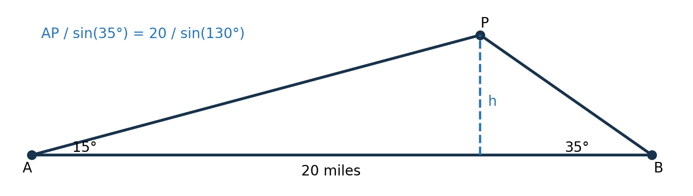
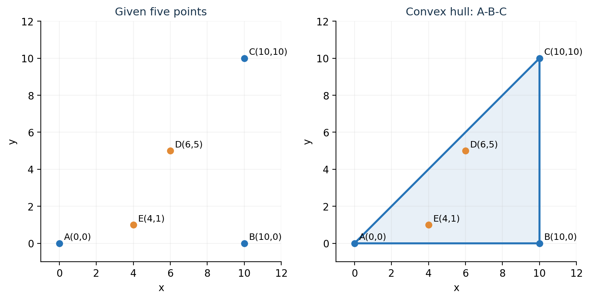
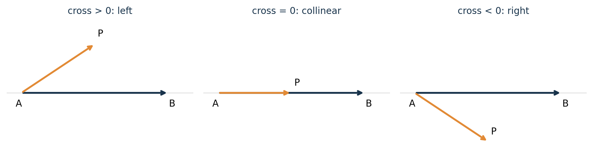
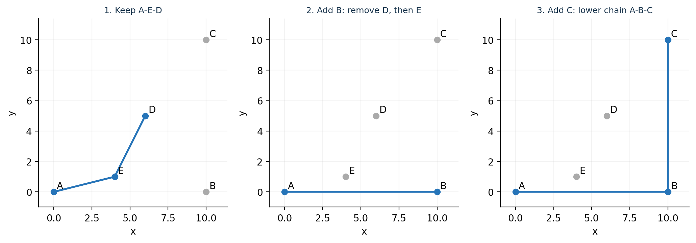
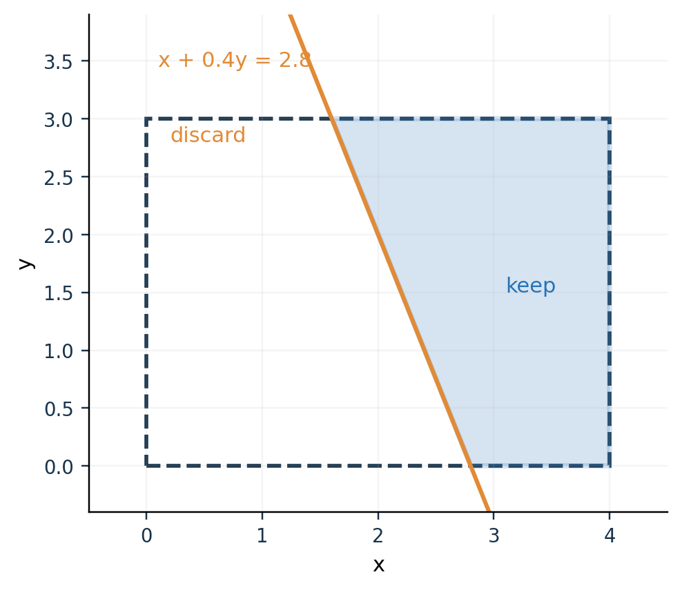
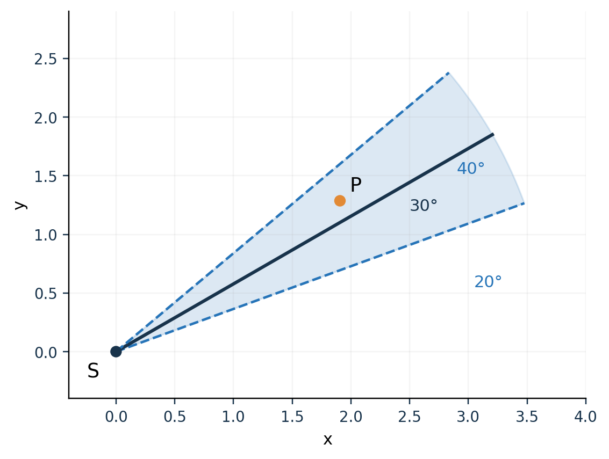

# 第 1–2 课　从坐标到凸包与角楔

## 这两课学什么，学到哪里就够了

拿一张纸，画几个点。我们准备依次解决三个很具体的问题：

1. **方向：**从一个点看另一个点，它在什么方向？
2. **包围：**有一堆点，怎样用一根绷紧的橡皮筋围住它们？
3. **筛选：**一个位置要同时满足几条条件，最后剩下哪一片区域？

它们分别引出向量与方位角、凸包、半平面交。角度有误差时，把前后两类知识接起来，就能得到角楔。直到本课最后的应用习题，我们才处理自己的 Q1。

**本课的达标标准：**能手算一遍五点凸包；能用叉积判断左右；能把“方向在两个角之间”画成区域并写成两个不等式；能解释一个新不等式怎样裁掉多边形。暂时不需要学三维凸包，也不需要背算法发展史。

建议把本课分为三次：坐标与经典测高例题约 80 分钟；凸包、手算和复做约 100 分钟；半平面、角楔、Q1 应用和代码约 140 分钟。加上画图、错题和口述，可占第一天及第二天前半。时间按自己的计算速度调整。

本课的教学顺序参考 OpenStax 开放教材和 Dave Mount 的计算几何课程讲义；凸包的具体五点数据取自 CGAL 作者维护的入门示例。这样既有标准知识的教材出处，又有可逐项核对的实际例题输入。手算、图和讲解在这里重新展开；没有把自行补充的计算冒称原书答案。

---

## 1　坐标是地点，向量是从这里到那里的移动

### 1.1　先看一对点

在方格纸上标出 \(A=(1,2)\)、\(B=(4,6)\)。这两个数的意思是：先横着走，再竖着走。若把向右、向上定为正方向，从 \(A\) 到 \(B\) 就要向右走 3、向上走 4。

把这次移动记为

\[
\overrightarrow{AB}=B-A=(4-1,6-2)=(3,4).
\]

上面是一个最小计算演示，用来认识记号。**点是位置；向量是变化。**两者都可以写成两个数，但使用时要说清含义。

勾股定理给出这次移动的直线距离：

\[
|AB|=\sqrt{3^2+4^2}=5.
\]

写成一般公式，就是

\[
\|B-A\|=\sqrt{(b_x-a_x)^2+(b_y-a_y)^2}.
\]

双竖线 \(\|\cdot\|\) 在本课只表示“向量的长度”。下标 \(x,y\) 分别表示横、纵分量。

### 1.2　把长度拿掉，只保留方向

向量 \((3,4)\) 与 \((6,8)\) 指向相同，只是后者长一倍。用向量除以自身长度，可以把箭头缩成长度 1：

\[
\frac{(3,4)}{5}=\left(\frac35,\frac45\right).
\]

这样的箭头叫**单位向量**。如果方向角为 \(\theta\)，它也可以写成

\[
u(\theta)=(\cos\theta,\sin\theta).
\]

本课从向右的方向开始量角，逆时针为正。因此 \(u(0^\circ)=(1,0)\)，\(u(90^\circ)=(0,1)\)，\(u(180^\circ)=(-1,0)\)。把这三个方向亲手画一遍。

若三角函数已经生疏，只需先恢复这件事：在直角三角形里，\(\cos\theta\) 是邻边除以斜边，\(\sin\theta\) 是对边除以斜边，\(\tan\theta\) 是对边除以邻边。把斜边设成 1，就得到上面的单位向量。

### 1.3　度和弧度是同一个角的两种单位

一整圈既可以记成 \(360^\circ\)，也可以记成 \(2\pi\) 弧度。所以

\[
\text{弧度}=\text{度}\times\frac\pi{180}.
\]

在纸上写 \(\sin30^\circ=1/2\) 没有问题；Python 的 `math.sin` 接受弧度，因此要写 `math.sin(math.radians(30))`。`math.sin(30)` 的参数代表 30 弧度。

当已知移动向量 \((\Delta x,\Delta y)\) 时，`atan2(Δy, Δx)` 根据两个分量恢复方向。它比直接算 `atan(Δy/Δx)` 方便：竖直方向不用除以零，左右两个半平面也能区分。

**停下来检查。**若从 \(A\) 到 \(B\) 的向量是 \((3,4)\)，从 \(B\) 到 \(A\) 是什么？答案为 \((-3,-4)\)。长度仍为 5，方向反转。若这个问题还需要猜，先不要往下背公式。

---

## 2　经典例题：用两个地面站求飞机高度

### 2.1　这是什么方法，从哪里来

这是**三角测量**的基础例题：已知一个三角形的一条边和两个角，恢复其他边长。这里用到的标准工具是正弦定理。

例题数据取自 OpenStax《Precalculus 2e》第 8.1 节 Example 6，标题为 “Finding an Altitude”。两地面站相距 20 英里，飞机位于两站之间的上空，图中两仰角为 \(15^\circ\)、\(35^\circ\)。下图按原题数据重新绘制。[G1]



图中的平面是竖直剖面。\(A,B\) 是地面站，\(P\) 是飞机，\(h\) 才是要求的高度。先分清“飞机到地面站的斜距”与“飞机到地面的高度”。

### 2.2　正弦定理为什么成立

从一个三角形顶点向对边作高。若这条高分别落在两个直角三角形里，可以把同一个高度写成

\[
h=b\sin A=a\sin B.
\]

把两边除以 \(ab\)，得到

\[
\frac{\sin A}{a}=\frac{\sin B}{b}.
\]

换另一个顶点作高，同样能接上第三组“角与它正对的边”。于是

\[
\frac{a}{\sin A}=\frac{b}{\sin B}=\frac{c}{\sin C}.
\]

你需要记住的关系是**同一个比值里，边必须与角相对**。只记公式里的字母，遇到换图就容易错。

### 2.3　一行一行求出高度

**第一步：补出第三个角。**三角形三个内角的和为 \(180^\circ\)，所以飞机处的内角为

\[
\angle APB=180^\circ-15^\circ-35^\circ=130^\circ.
\]

**第二步：找一条斜边。**边 \(AP\) 对着 \(35^\circ\)，地面边 \(AB=20\) 对着 \(130^\circ\)，所以

\[
\frac{AP}{\sin35^\circ}=\frac{20}{\sin130^\circ},
\qquad
AP=\frac{20\sin35^\circ}{\sin130^\circ}.
\]

**第三步：从斜边取出竖直高度。**在左侧直角三角形里，\(h\) 是 \(15^\circ\) 的对边，因此

\[
h=AP\sin15^\circ
=\frac{20\sin35^\circ\sin15^\circ}{\sin130^\circ}
\approx3.87582\ \text{英里}.
\]

按原书要求保留一位小数，就是 \(3.9\) 英里。

这一计算的结构是“从两个精确方向确定交会位置”。它给出一个点的原因，是题里把角度当成精确已知。请先把这个理想情形学会，角度不精确的情形留到第 7 节。

### 2.4　只用原题做三个检查

1. 为什么不能把 \(35^\circ-15^\circ=20^\circ\) 当作飞机处的内角？
2. 若先求 \(BP\)，它应该和哪个角放在同一个正弦定理比值里？
3. 最后得到 \(AP\) 后，为什么还需要再乘 \(\sin15^\circ\)？

答案依次为：两站的底边朝向相反，须使用三角形内角和；\(BP\) 对着 \(15^\circ\)；\(AP\) 是斜距，而要求的是竖直分量。三问都能画图解释，再进入下一种几何问题。

---

## 3　凸包：橡皮筋围住一堆点

这部分属于**计算几何**的入门内容。Dave Mount 在马里兰大学 CMSC 754 第 2 讲中，同样从橡皮筋直观开始，再讲凸性、方向判定和扫描算法；讲义还明确对应 de Berg 等人的《Computational Geometry: Algorithms and Applications》第 1 章。[G5] 本课把必要基础拆得更细，再用 CGAL 的五点输入做完整手算。

### 3.1　先理解“凸”，再理解“包”

在实心圆盘内部任意选两点，把它们连起来，整条线段都留在圆盘里。实心三角形和实心矩形也有这个性质。这样的集合叫**凸集**。

反过来，在一个月牙形区域里，某些内部点之间的连线会穿出月牙。这时它就不是凸集。

严格定义只把刚才的话写成公式：若 \(A,B\) 都在集合里，那么

\[
(1-t)A+tB,\qquad 0\le t\le1,
\]

也都在集合里。这里 \(t=0\) 是 \(A\)，\(t=1\) 是 \(B\)，中间的 \(t\) 依次走过它们之间的线段。例如 \(t=1/2\) 是中点。

**凸包**是包含给定全部点的最小凸集。想象每个点是一根钉子，用橡皮筋把所有钉子围住，然后收紧。橡皮筋围起的区域就是凸包。最外面的钉子成为凸包顶点；完全在里面的钉子不改变这条边界。

数学上凸包包括内部。程序通常只保存按边界顺序排列的顶点，这已经足以重建整个凸多边形。

### 3.2　经典实例：CGAL 的五个点

CGAL 官方 `array_convex_hull_2.cpp` 入门例子给出的五点是

\[
A=(0,0),\quad B=(10,0),\quad C=(10,10),
\quad D=(6,5),\quad E=(4,1).
\]

坐标逐项取自原例；字母标签是本课加的。原例调用计算几何库，本课接下来用同一份输入，自己手算 Andrew 单调链。[G2]



先用眼睛判断：橡皮筋应经过 \(A,B,C\)，\(D,E\) 被包在里面。现在不要急着看算法，先证明这个观察。

三角形 \(ABC\) 中的点恰好满足

\[
0\le y\le x\le10.
\]

检查 \(D=(6,5)\)：\(0\le5\le6\le10\)；检查 \(E=(4,1)\)：\(0\le1\le4\le10\)。所以三角形确实包含全部五点。另一方面，任何包含 \(A,B,C\) 的凸集，都必须包含它们之间的整个三角形。于是这个三角形就是所求的最小凸集。

五点例容易看出来。如果有五千个点，就需要可重复执行的步骤。下一节的算法完成的正是这件事。

---

## 4　用叉积判断转弯，再用 Andrew 单调链求凸包

### 4.1　为什么算法要知道左转还是右转

沿着凸多边形边界逆时针走，不能突然向内凹一下。我们需要一个只用坐标就能判断转弯方向的办法。

二维向量 \(u=(u_x,u_y)\)、\(v=(v_x,v_y)\) 的叉积在这里记成一个数：

\[
\operatorname{cross}(u,v)=u_xv_y-u_yv_x.
\]

在向右为 \(x\) 正方向、向上为 \(y\) 正方向的坐标系中，给出三个点 \(A,B,P\)，计算

\[
c=\operatorname{cross}(B-A,P-A).
\]

若 \(c>0\)，\(P\) 在有向直线 \(A\to B\) 左侧；若 \(c<0\)，在右侧；若 \(c=0\)，三点共线。



这个符号有面积意义：

\[
\text{三角形 }ABP\text{ 的面积}=\frac{|c|}{2}.
\]

绝对值给面积大小，正负号保留左右顺序。因此这里可以不算角度、不调用反三角函数，就判断转弯。

### 4.2　先拿经典五点例中的三个点手算

用 \(A=(0,0)\)、\(E=(4,1)\)、\(D=(6,5)\)：

\[
\operatorname{cross}(E-A,D-A)
=\operatorname{cross}((4,1),(6,5))
=4\times5-1\times6=14>0.
\]

所以 \(A\to E\to D\) 是左转。

代码也常写成 \(\operatorname{cross}(E-A,D-E)\)。它仍等于 14，因为

\[
\operatorname{cross}(E-A,D-E)
=\operatorname{cross}(E-A,D-A)
-\operatorname{cross}(E-A,E-A),
\]

最后一项为零。**两个公式使用了不同起点，但判断同一个转弯。**这能解释源码为什么把第二个向量写成“新点减上一个点”。

### 4.3　标准算法的名字与步骤

这里教的是 **Andrew 单调链凸包算法**，也常叫 Graham–Andrew 扫描的一种形式。CGAL 作者文档介绍了该算法及其 \(O(n\log n)\) 时间复杂度。[G3] Mount 讲义第 4–8 页讲的是按横坐标排序、维护上下链的扫描变体；它与本课使用的转弯检查、删除旧拐角属于同一条教学路线。[G5]

“单调”说的是：先按横坐标从小到大走一遍，再反方向走一遍。算法只做四件事：

1. 删除重复点，按 \(x\) 从小到大排序；\(x\) 相同就比较 \(y\)。
2. 正着扫，维护下边界。每来一个点，检查末尾三点是否仍然左转。
3. 若不是左转，删掉中间那个旧点，继续向前检查；合格后再加入新点。
4. 反着扫得到上边界，把两条链拼起来，公共端点只保留一次。

“删掉旧点”在程序里叫 `pop`。这里删除的是**当前链末尾不合格的拐角**；并不是把点从原始输入里永久抹掉。正向链没有使用的点，仍可能出现在反向链中。

### 4.4　经典五点例：完整计算下边界

排序结果是

\[
A(0,0),\ E(4,1),\ D(6,5),\ B(10,0),\ C(10,10).
\]

开始时列表为空。少于两个旧点就直接加入，因为还凑不成一个转弯。

| 读入点 | 需要检查的转弯 | 叉积 | 处理后列表 |
|---|---|---:|---|
| \(A\) | 不足三个点 | — | \(A\) |
| \(E\) | 不足三个点 | — | \(A,E\) |
| \(D\) | \(A\to E\to D\) | \(14\) | \(A,E,D\) |
| \(B\) | \(E\to D\to B\) | \(-26\) | 先删 \(D\) |
| 仍是 \(B\) | \(A\to E\to B\) | \(-10\) | 再删 \(E\)，加入 \(B\)：\(A,B\) |
| \(C\) | \(A\to B\to C\) | \(100\) | \(A,B,C\) |

其中第一次删除的算式为

\[
\operatorname{cross}(D-E,B-D)
=\operatorname{cross}((2,4),(4,-5))
=2(-5)-4(4)=-26.
\]

删掉 \(D\) 后必须再次检查。因为新的末尾三点已经变成 \(A,E,B\)，它也向错误一侧转弯：

\[
\operatorname{cross}(E-A,B-E)
=\operatorname{cross}((4,1),(6,-1))=-10.
\]

这就是算法使用 `while` 循环的原因：一个新点可能让多个旧拐角失效，单次 `if` 不够。



### 4.5　上边界也要亲自算一遍

反向输入为 \(C,B,D,E,A\)。前三点 \(C\to B\to D\) 的叉积是 \(-40\)，删 \(B\)，留下 \(C,D\)。

加入 \(E\) 时，\(C\to D\to E\) 的叉积为 6，暂时得到 \(C,D,E\)。加入 \(A\) 时：

1. \(D\to E\to A\) 的叉积为 \(-14\)，删 \(E\)；
2. \(C\to D\to A\) 的叉积为 \(-10\)，再删 \(D\)；
3. 上边界最后为 \(C,A\)。

下边界 \(A,B,C\) 和上边界 \(C,A\) 各去掉最后一个点，再拼接，得到 \(A,B,C\)。这样公共端点 \(A,C\) 都只出现一次。

### 4.6　它为什么快，什么时候要特别处理

排序需要 \(O(n\log n)\) 时间。扫描中每个点最多入链一次、出链一次；看起来有两层循环，累计工作却是 \(O(n)\)。所以总量级为 \(O(n\log n)\)。

正确性的直观依据是：在已经排好序的点中，一个向内折回的拐角不可能属于正在构造的外侧边界；去掉它后继续检查，更早的边界仍按同一规则维护。上、下两条外侧边界合起来围住全部输入点。

共线的点要先约定输出形式。若只保留凸包拐角，就把叉积等于零时的中间点也删除。若希望边上的每个输入点都保留，就需要调整规则。**几何区域可以相同，返回的点列表却不同。**

还应处理零点、一点、两点；它们的凸包分别为空、一个点、一条线段，不能强行当成有面积的多边形。

### 4.7　本节必须会的复做

盖住第 4.4、4.5 节，只看 CGAL 原始五点，重新写出排序、下链、上链。检查自己是否能解释以下三句：

- 为什么必须先排序？因为维护上、下边界时，需要新点按一个方向有序到来。
- 为什么有时连续删两个点？因为删一次以后，新的末尾转弯也可能不合格。
- 为什么凸包只有三个顶点？因为另外两点在这个三角形内部。

能独立复做这个例题，就达到了本课对凸包的要求。无需现在背会其他凸包算法。

---

## 5　半平面交：同时满足几个条件

### 5.1　从一个不等式开始

直线 \(x=10\) 把平面分为两边。条件 \(x\le10\) 选择它左侧所有点，并包含直线本身；这叫一个**闭半平面**。

一般形式为

\[
ax+by\le c.
\]

\((a,b)\) 是垂直于边界的方向，叫**法向量**。这里可以先用最直接的办法理解它：把一个点的坐标代入左边，若结果不大于右边，该点就被保留。

同一个半平面也写为

\[
n\cdot X\le c,
\qquad n=(a,b),\ X=(x,y),
\qquad n\cdot X=ax+by.
\]

中间的点号是点积，在二维就是“对应分量相乘后相加”。不要把它和上一节的叉积混淆：一个是加法，一个是交叉相乘再相减。

### 5.2　仍然使用刚才的经典三角形

CGAL 五点的凸包三角形可以写成三个半平面的共同部分：

\[
y\ge0,\qquad x\le10,\qquad y\le x.
\]

把它们统一写成“左边小于等于右边”：

\[
-y\le0,\qquad x\le10,\qquad -x+y\le0.
\]

一个点要同时通过三项检查。满足第一个而不满足第二个，仍然不能留下。

“同时满足”对应集合的**交**，符号是 \(\cap\)。若三个半平面分别为 \(H_1,H_2,H_3\)，三角形就是 \(H_1\cap H_2\cap H_3\)。求这个交集的几何问题叫半平面交。

此处是对同一经典数据的独立延伸计算：原 CGAL 示例输入点，本节把已经求出的三角形改写成不等式，没有说原示例还执行了这些步骤。

### 5.3　为什么交出来的区域仍然是凸的

先看一个半平面。若 \(A,B\) 都满足 \(n\cdot X\le c\)，它们之间的点为 \(X=(1-t)A+tB\)，则

\[
n\cdot X=(1-t)(n\cdot A)+t(n\cdot B)
\le(1-t)c+tc=c.
\]

所以整条线段都在半平面内。若 \(A,B\) 同时在多个半平面里，这个证明对每一条约束都成立，线段也就同时在每一个半平面里。

因此，多个半平面的交一定是凸集。它可能是多边形，也可能为空、无界、一个点或一条线段。

请区分两种输入：**凸包从点出发，找包住全部点的边界；半平面交从不等式出发，找满足全部条件的区域。**它们经常得到同一个凸多边形，却解决不同的输入问题。

---

## 6　怎样真的算交集：一次只裁掉一侧

### 6.1　标准方法：Sutherland–Hodgman 多边形裁剪

这是一种计算机图形学里的经典算法：一个多边形有一部分跑到显示窗口之外，要把外部部分裁掉。赫尔辛基大学公开教学页用箭头形多边形演示了按窗口左、上、右、下边界逐次裁剪，以及四种进出边界的情况。[G4]

本课先看懂**一条直线对应的一次裁剪**。只要会做一次，再把新的多边形交给下一条直线，重复即可。

已有多边形的顶点必须按绕边界的顺序存放。沿边 \(A\to B\) 移动，起点和终点各有“内、外”两种状态，于是恰好四种情况：

| 起点 \(A\) | 终点 \(B\) | 应往结果列表加入什么 | 直观含义 |
|---|---|---|---|
| 内 | 内 | \(B\) | 整条边保留 |
| 内 | 外 | 交点 \(I\) | 走到边界就停止 |
| 外 | 内 | 交点 \(I\)，再加 \(B\) | 从边界进入，再走到终点 |
| 外 | 外 | 不加点 | 整条边留在这一半平面的外侧 |

这张表就是原教学页的四种情形，用中文重新说明。这里每次裁的是一个半平面；“两端都在外面”才可以直接删除整条线段。不要把该规则误用于任意弯曲窗口。

### 6.2　边界上的交点怎么求

设要保留 \(n\cdot X\le c\)，定义一个方便检查的数

\[
f(X)=n\cdot X-c.
\]

\(f(X)\le0\) 是内部，\(f(X)>0\) 是外部。边上的点可写成

\[
I=A+t(B-A).
\]

交点在边界上，所以 \(f(I)=0\)。把上式代入：

\[
0=f(A)+t\bigl(f(B)-f(A)\bigr),
\qquad
t=\frac{f(A)}{f(A)-f(B)}.
\]

两端真正处在不同侧时，\(t\) 在 0 到 1 之间。这也是计算结果的自检条件。这里没有斜率，水平边和竖直边都可以使用。

### 6.3　读图练习：四种情况在一张图里

下面的图是为练四种情况绘制的数值演算图，并非原大学教学页的坐标。虚线矩形是初始区域，橙线为 \(x+0.4y=2.8\)，保留右侧蓝色部分。



从 \((0,0)\) 起逆时针绕矩形：

- 下边：外到内，输出 \((2.8,0)\)、\((4,0)\)；
- 右边：内到内，输出 \((4,3)\)；
- 上边：内到外，输出 \((1.6,3)\)；
- 左边：外到外，不输出。

因此新多边形的四个顶点为

\[
(2.8,0),\ (4,0),\ (4,3),\ (1.6,3).
\]

验证交点并不难：\(2.8+0.4\times0=2.8\)，\(1.6+0.4\times3=2.8\)。两点确实在同一条边界上。

### 6.4　另一种实现：把边界排好序，用双端队列维护

逐边裁剪需要一个已有的有界多边形。有些程序直接收到一组半平面，不预先给一个大矩形，就会使用**按边界方向排序的半平面交**。

它的工作对象换成了边界列表：

1. 给每条边界规定行走方向，使保留的一侧总在左边；
2. 按方向角排序；同向平行边界只保留更严格的一条；
3. 把可能成为最终边界的直线依次放进一个双端队列；
4. 加入新边界时，检查队列两端相邻边界的交点；若交点被新条件排除，就移走相应的旧边界，再检查；
5. 首尾也做同样清理，最后求相邻边界交点。

双端队列可以从头、尾两边取走元素。它节省的是“每次加入新条件都从头重算”的工作。这与上一节凸包里的删除无效拐角有相似之处，但队列此时存的是半平面，不是坐标点。

用前面三角形作一次独立延伸：在 \(y\ge0,x\le10,y\le x\) 之外，加入多余条件 \(x+y\le30\)。暂时由 \(x=10\)、\(x+y=30\) 得到交点 \((10,20)\)；检查新条件 \(y\le x\)，它不合格。清理后这条多余斜边不再成为最终边界。三角形仍为 \(ABC\)。

**本课对这一实现的要求：**会说队列里存什么、为什么检查交点、为何需要同向合并、为何不能把无界区域误当多边形。完整队列退化处理放在最后的源码导读中，不要求第一遍阅读就背下全部分支。

---

## 7　方向读数有误差，射线就扩成角楔

### 7.1　先用普通测量语言说清楚

前面的飞机例题把一个方向视为确定的。现在想象一个平面方向仪报告“\(30^\circ\)，误差不超过 \(10^\circ\)”：真实方向可能是 \(20^\circ\)，也可能是 \(34^\circ\)，还可能是 \(40^\circ\)。报告没有告诉你距离。

所以应保留从 \(20^\circ\) 到 \(40^\circ\) 之间的所有前向射线。这块向外张开的区域叫**角楔**。这里使用 \(10^\circ\) 是为了图上看得清，属于一般误差几何示意。



图里的蓝色只画到有限距离，方便显示；若没有额外距离信息，数学上的角楔一直向外延伸。它不是一个有限扇形，也不是一个概率分布。

### 7.2　用已经学会的“左右侧”写下来

设测量位置为 \(S\)，报告方向为 \(\theta\)，误差半宽为 \(\delta\)。令

\[
u_-=u(\theta-\delta),\qquad
u_+=u(\theta+\delta),\qquad
v=X-S.
\]

先只考虑 \(0<\delta<90^\circ\)，所以整块楔形张角小于 \(180^\circ\)。一个候选位置 \(X\) 要在角楔里，必须满足两句话：

1. \(v\) 在下边界 \(u_-\) 的左侧或边界上；
2. \(v\) 在上边界 \(u_+\) 的右侧或边界上。

用叉积翻译，就是

\[
\operatorname{cross}(u_-,v)\ge0,
\qquad
\operatorname{cross}(u_+,v)\le0.
\]

你不必先背两个符号。画一条向右的下边界，在它上方选点，叉积应为正；画上边界，在它下方选点，叉积应为负。这样可以自己恢复公式。

### 7.3　把它变成裁剪程序接受的格式

程序接受 \(n\cdot X\le c\)，所以把两个叉积展开。

下边界的条件为

\[
\cos(\theta-\delta)(y-s_y)
-\sin(\theta-\delta)(x-s_x)\ge0.
\]

两边乘以 \(-1\)，再把与 \(S\) 有关的常数移到右侧，得到

\[
n_-\cdot X\le n_-\cdot S,
\qquad
n_-=(\sin(\theta-\delta),-\cos(\theta-\delta)).
\]

同样展开上边界：

\[
n_+\cdot X\le n_+\cdot S,
\qquad
n_+=(-\sin(\theta+\delta),\cos(\theta+\delta)).
\]

现在你已经从图独立推到了两个半平面。一次读数给两条约束，几次读数就把这些约束全部放在一起求交。

### 7.4　两个容易忽略的边界情况

**跨过 \(0^\circ\)。**例如报告接近 \(359^\circ\)，真实方向接近 \(0^\circ\)，它们可以只差一度。若直接相减，会误以为相差几百度。向量写法通过正弦、余弦的周期性自然跨过零度；角差也可归到 \([-180^\circ,180^\circ)\) 再比较。

**误差恰为零。**当 \(\delta=0\)，两条边界重合，两个半平面只限制出一条完整直线。还需补上

\[
u(\theta)\cdot(X-S)\ge0,
\]

把背后的半条线去掉，才能得到正向射线。

### 7.5　为什么同样的角度误差，远处位置更不确定

把坐标轴暂时转到报告方向：沿报告方向的距离记为 \(a\ge0\)，垂直方向的偏移记为 \(b\)。看一个直角三角形，便有

\[
|b|\le a\tan\delta.
\]

所以在前向距离 \(a\) 处，楔形横截面的全宽为 \(2a\tan\delta\)。距离翻倍，全宽也翻倍。这里比较的是同一个角度误差，并没有把它误写成固定的坐标误差。

---

## 8　课后应用：把 Q1 当作本课综合习题

到这里，你已经学习了通用方法。下面才接回自己的题：多个检测点给出平面示向度，每条读数允许 \(\pm1^\circ\) 的角误差，求允许位置区域，并进一步描述它的大小。直径与包围圆放到下一课。

### 习题 Q1-A：先独立建模，不看代码

检测点为 \(S_i\)，报告为 \(\theta_i\)。请完成四步：

1. 画第 \(i\) 条读数的两条边界；
2. 写出它对应的两个半平面；
3. 写出全部读数共同允许的集合；
4. 解释为什么不能直接把报告中心线的交点当成完整答案。

**参考解答。**令 \(\delta=1^\circ\)，每个角楔为

\[
W_i=\{X:n_{i,-}\cdot X\le n_{i,-}\cdot S_i,
\ n_{i,+}\cdot X\le n_{i,+}\cdot S_i\}.
\]

仅使用这些角观测得到

\[
F_{\text{angle}}=W_1\cap W_2\cap\cdots\cap W_m.
\]

中心线相当于擅自把误差设为零。即使它们恰好交于一点，也没有代表全部允许位置；若带误差的中心线不共点，仍可能存在非空的共同允许区域。

与经典飞机例题相比，几何空间从竖直剖面换成水平面，已知方向从精确角换成区间，输出从一个位置换成一片位置集合。三角函数与方向关系仍可用，求解目标发生了变化。

### 习题 Q1-B：用真实输入检查第一条约束

打开仓库中的 `examples/q1_seed_20260929_input.json`。第一站为

\[
S_1=(-1387.941092,283.869424),
\qquad\theta_1=51.26^\circ.
\]

因此两条边界角为 \(50.26^\circ\)、\(52.26^\circ\)。把它们代入第 7.3 节，得到下列近似值：

\[
\begin{aligned}
n_-&=(0.768953424,-0.639304804),
&n_-\cdot S_1&\approx-1248.741141,\\
n_+&=(-0.790796414,0.612079269),
&n_+\cdot S_1&\approx1271.329428.
\end{aligned}
\]

纸笔检查两件事：代入 \(X=S_1\)，两条不等式都恰好取等号；代入从 \(S_1\) 沿报告方向向前走的点，两条约束都应通过。显示值经过舍入，精确边界判断以程序保留的浮点数为准。

### 习题 Q1-C：逐条加入读数，预判形状怎样变

用同一个固定输入，依次只使用前 1、2、3、4 条观测。先预测：新增条件后，旧区域中的点会增加还是减少？区域直径一定严格减小吗？

本仓库现有求解器复算结果如下，单位为米：

| 使用观测数 | 状态 | 顶点数 | 直径 |
|---:|---|---:|---:|
| 1 | `unbounded` 无界 | 不返回有限多边形 | 无有限值 |
| 2 | `polygon` | 4 | 49.427379 |
| 3 | `polygon` | 4 | 44.458564 |
| 4 | `polygon` | 6 | 44.458564 |

解释：取交不会加入原来没有的点，所以理想精确模型下区域只会缩小或保持。直径可能不变，最后两行就是例子。顶点数反而可以增加，因为一条新边界可能切掉一个旧角并产生两个新角；顶点更多不表示区域更大。

这些是现有固定种子输入的本地复算，作用是练读程序。不要把四行数据说成一般定理；“三条观测一定够”“四条一定更好”都推不出来。

### 习题 Q1-D：目标圆域有没有真的放进程序

题目还有目标所在区域。若把半径 1800 米的圆盘记为 \(\Omega\)，同时使用这个先验与角观测时，应写成

\[
F=\Omega\cap F_{\text{angle}}.
\]

但当前 Q1 求解器的 `intersect_halfplanes` 第 203 行直接删除了 `include_circle` 参数；其计算结果是角约束的半平面交，**并没有加入目标圆盘约束**。生成器把测试真值放在圆内，也不等于求解器已经使用圆域裁剪。

这道练习要培养的能力是：从输入和真正执行的代码确认结论，而不是根据参数名字猜功能。答辩解释现有版本时，准确说“这里计算多条角度观测的共同允许区域”即可。若被问到圆域，再说明现有函数的范围。

---

## 9　最后才打开代码：把学过的动作逐项找出来

本节行号对应仓库当前 `source/Q1/q1_solver.py`。阅读顺序按调用含义安排；不要从第一行 import 开始背。

### 9.1　先读入口，确定程序拿了什么

`main` 在第 283–298 行。第 288 行读 JSON，第 289 行只把 `observations` 和 `epsilon_deg` 交给 `solve_localization`。生成器附带的 `local_truth` 没有作为定位输入。

`solve_localization` 在第 268–280 行：

| 行号 | 做的事 | 本课对应的数学动作 |
|---|---|---|
| 269–271 | 检查误差半宽属于 \([0,90^\circ)\) | 保证用两个半平面表示前向小角楔的模型范围 |
| 272 | 规范化各条观测 | 提取站点坐标和方向角 |
| 273–274 | 拒绝空观测输入 | 没有读数时不假装已经定位 |
| 275 | 每条观测调用 `_wedge`，收集全部约束 | 一条读数给两个半平面；零误差另有正向约束 |
| 276 | 调用 `intersect_halfplanes` | 所有约束取交 |
| 277–280 | 附上输入说明并返回 | 方便结果追溯 |

### 9.2　再读 `_wedge`：现在每一个符号都有来处

第 257–265 行依次完成：

1. 取出测站 \(S=(x,y)\)；
2. 计算 \(\theta-\delta,\theta+\delta\)，并转为弧度；
3. 建立第 7.3 节推出来的 \(n_-,n_+\)；
4. 若误差为零，补上正向限制；
5. 返回 `HalfPlane(normal, normal·S)`。

`HalfPlane` 在第 20–27 行保存 \(n\cdot X\le c\)。`residual` 返回 \(n\cdot X-c\)，正好是裁剪一节的 \(f(X)\)。它的正负告诉你一个点在哪边。

### 9.3　凸包代码：把五点手算逐行贴回去

凸包函数 `_convex_hull` 在第 144–157 行。

| 行号 | Python 写法的作用 | 经典五点例中发生什么 |
|---|---|---|
| 145 | 转浮点、去重、排序 | 得到 \(A,E,D,B,C\) |
| 146–147 | 零点或一点直接返回 | 无需构造链 |
| 149–150 | 定义扫描过程并建立空列表 | 准备存当前边界 |
| 151 | 按给定顺序取点 | 依次读 \(A,E,D,B,C\) |
| 152 | 检查末尾三点叉积是否不大于容差 | 读 \(B\) 时先算 \(-26\)，再算 \(-10\) |
| 153 | 删除旧的末尾点 | 先删 \(D\)，再删 \(E\) |
| 154 | 加入新点 | 加入 \(B\)，继续到 \(C\) |
| 157 | 正、反扫，去掉重复端点后连接 | 得到 \(A,B,C\) |

`result[-1]` 是列表最后一个点，`result[-2]` 是倒数第二个点。`[:-1]` 表示保留除最后一个之外的元素；`reversed(rows)` 表示反向读取。

理论上用叉积 `<= 0` 删除非左转点，源码使用 `<= EPS`。`EPS=1e-10` 是处理浮点近零值的实现容差。它不是物理上的 \(1^\circ\) 测量误差，两者的含义不能混用。

### 9.4　半平面交代码：先会讲主干，再查异常分支

`intersect_halfplanes` 在第 201–237 行，使用第 6.4 节的方向排序与双端队列；本 Q1 没有调用逐边裁剪函数。

| 函数或行号 | 核心作用 | 为什么需要 |
|---|---|---|
| `_normalise`，43–59 | 把法向量长度化为 1 | 使同向约束的右端值可以直接比较 |
| `_ordered`，73–87 | 按边界方向排序，合并同向约束 | 给队列提供有序边界；移除较松的同向重复约束 |
| `_intersection`，90–97 | 联立两条边界直线 | 找出相邻边界候选顶点 |
| `_outside`，100–102 | 检查约束残差并加尺度容差 | 避免微小浮点误差把边界点误当外点 |
| 205–215 | 队列两端与首尾清理 | 移除被后续条件排除的旧边界 |
| 217–226 | 求交点，整理凸包，逐约束核验 | 候选图形必须确实满足全部输入条件 |
| `_feasible_point`，110–132 | 尝试找到一个可行点 | 用来区分空集和仍有可行点的情形 |
| `_is_bounded`，135–141 | 检查约束方向能否封闭区域 | 有交点不代表整个集合有界 |
| 228–237 | 返回 `empty`、`unbounded` 或 `uncertain` | 无法得到可靠有限图形时不伪造数值 |

归一化的理由可以用一个一眼能算的等价式说明：\(x\le10\) 和 \(2x\le20\) 是同一约束。若不先归一化，只拿 10 与 20 比较，会误以为第一条更严格。

两直线平行时没有唯一交点。`_intersection` 通过行列式判断近乎平行并返回 `None`，不拿一个虚构分母继续算。

第 6.4 节的排序与队列主干通常按 \(O(m\log m)\) 讨论；**当前完整函数还包含全约束核验和可行性补救**，不能把主干复杂度不加说明地当作所有分支的复杂度。

### 9.5　逐边裁剪去哪里找

本课先讲裁剪，是因为它便于画图手算，也会在后续题目反复使用。实际位置是 `source/Q2/q2_solver.py` 的 `clip_halfplane` 第 124–144 行，以及 `clip_wedge` 第 157–166 行。

因此，对代码的准确说法是：Q1 使用排序与双端队列求半平面交；Q2 等处在已有多边形上逐条裁剪。二者都在求共同满足约束的区域，存储对象和更新步骤不同。

---

## 10　运行与口头验收

### 10.1　只运行已有固定输入

在仓库根目录运行：

```bash
python source/Q1/q1_solver.py --input examples/q1_seed_20260929_input.json --output q1_course_result.json
```

预期状态为 `polygon`，顶点数为 6，面积约 \(773.517\ \mathrm{m}^2\)，直径约 \(44.459\ \mathrm{m}\)。下一课再解释直径是怎样计算的。运行后把结果文件与 `examples/q1_seed_20260929_result.json` 对照即可。

### 10.2　闭卷做一个三分钟说明

请按这四句话的次序讲，每句话后面都能在纸上画出相应对象：

> 方向用单位向量表示。二维叉积的符号告诉我，一个候选点在有向边界的左边还是右边。一次有界角误差观测给出一个前向角楔，角楔可以写成两个半平面的交。把全部观测约束一起求交，就得到共同允许区域；程序再根据是否为空、是否有界等情况返回相应结果。

然后打开 `_wedge`，从图推出两行 `normals`，最后打开 `_convex_hull`，用 CGAL 五点例解释一次连续 `pop`。能做到这一点，已经是在理解代码。

### 10.3　本课评委追问

**问：你们为什么不用最小二乘直接求一个点？**

答：本段程序的目标是保留满足每条硬误差上界的全部位置。最小二乘通常最小化一组残差的平方和，主要返回一个拟合点；即使能拟合，也还需另外证明整个允许区域或最大偏差。这里用集合交，正好直接表达“每条读数都要满足”。这不表示最小二乘本身错误，而是当前需要的输出不同。

**问：半平面交为什么是凸多边形？**

答：每个半平面是凸集，交仍然凸；当交集有界、非空且有面积时，直线边界围出凸多边形。也可能出现空、无界、点和线段，因此程序要分类。

**问：你们是不是先把检测点做凸包，就得到源的位置？**

答：不是。定位约束由检测点和方向读数共同生成，先求半平面交；凸包用于整理候选顶点及后续几何计算。检测点的凸包本身不能表达示向角条件。

**问：为什么不直接比较两个角的大小？**

答：角度有 \(360^\circ\) 周期，零度两边的方向可能很近。用正弦、余弦和叉积描述两条边界，周期性自然保留；输入角也先规范化。

**问：新观测一定让定位精度变好吗？**

答：在观测可靠、约束正确的模型下，取交不会扩大集合；但可能新增的是冗余条件，所以某个大小指标未必严格下降。固定输入中，从三条到四条观测的直径就保持不变。

**问：为什么浮点容差不能完全设成零？**

答：三角函数和交点计算使用浮点数，理论在边界上的点可能出现极小正残差。容差用于处理这类数值误差；它应该受尺度和模型要求控制，不能随意放大后冒充原始物理误差。

## 本课材料出处与阅读范围

- **[G1] OpenStax, *Precalculus 2e*, §8.1, Example 6, “Finding an Altitude”.** 本课采用其 20 英里、\(15^\circ\)、\(35^\circ\) 测高问题并重新推导。初学者只需读这一例与本节正弦定理，不必一次读完全部三角形分类。<https://openstax.org/books/precalculus-2e/pages/8-1-non-right-triangles-law-of-sines>
- **[G2] CGAL 5.6.2, `Convex_hull_2/array_convex_hull_2.cpp`.** 五点输入的直接出处。原程序调用 `convex_hull_2`；本课的 Andrew 逐步手算是对相同输入的独立展开，不声称原默认调用必然选择 Andrew。<https://doc.cgal.org/5.6.2/Convex_hull_2/Convex_hull_2_2array_convex_hull_2_8cpp-example.html>
- **[G3] CGAL 5.6.2, *2D Convex Hulls and Extreme Points*, User Manual.** 参看 “Convex Hull”“Example using Graham-Andrew's Algorithm”“Extreme Points and Hull Subsequences”。用来核查算法名称、扫描形式与复杂度；无需学习本页的 C++ 类型系统。<https://doc.cgal.org/5.6.2/Convex_hull_2/index.html>
- **[G4] University of Helsinki, “Sutherland–Hodgman Polygon Clipping”, 1996.** 重点看逐窗口边裁剪图及 “Four Types of Edges”。本课四种输出规则与该教学页对应，坐标演算图为独立教学绘图。<https://www.cs.helsinki.fi/group/goa/viewing/leikkaus/intro2.html>
- **[G5] Dave Mount, University of Maryland, CMSC 754, Lecture 2: “Convex Hulls in the Plane”, Fall 2023.** 讲义第 1–3 页给出直观与基本定义，第 4–8 页展开扫描、方向判定与正确性。按这两个范围查阅即可，后面的分治凸包属于拓展。<https://www.cs.umd.edu/class/fall2023/cmsc754/Lects/lect02-hulls.pdf>
- **原始算法文献线索：** Ivan E. Sutherland 与 Gary W. Hodgman, “Reentrant Polygon Clipping”, *Communications of the ACM*, 17(1), 32–42, 1974，DOI: <https://doi.org/10.1145/360767.360802>。这是继续追溯方法的文献，不要求本周通读。
- **本题可运行的一手材料：** `source/Q1/q1_solver.py`、`source/Q1/q1_generator.py`、`source/Q2/q2_solver.py`；固定输入与输出位于 `examples/`。本课所列行号与数值按这些文件核查。

**进入下一课前：**先不看提示复做 CGAL 五点凸包，再把 Q1 第一条读数画成角楔。如果仍说不清“点集凸包”和“约束交集”的区别，停下来画两幅图，暂缓背旋转卡壳和最小包围圆。
