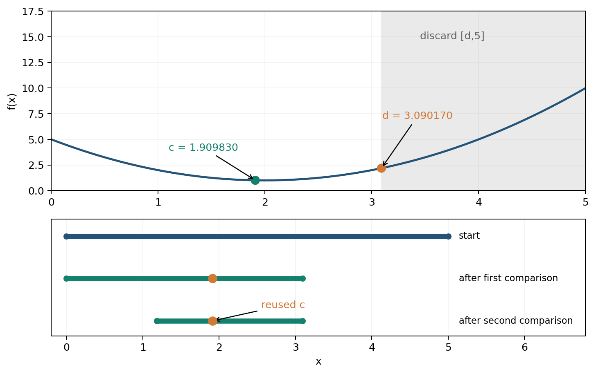

# 第 3 课　凸集的直径与最小包围圆

地图上有一块凸多边形区域。量一量其中最远的两个位置，可以知道这块区域最多跨越多长；找一个圆把整块区域包住，可以知道从同一个中心出发，最远需要走多远。这是两个不同的问题。

例如，三个位置为 $A=(0,0)$、$B=(4,0)$、$C=(2,3)$。其中最远的两点是 $A,B$，距离为 4。但是，以 $AB$ 中点为圆心、半径为 2 的圆包不住 $C$。本课分别求这两个问题的答案。

## 3.1　点集的直径

本课考虑有限点集，以及包含边界的有界凸多边形。一个点集中的两点能够相隔多远？所有点对距离中的最大值，叫作这个点集的**直径**。

若点集记作 $P$，直径记作 $D(P)$，则

$$
D(P)=\max_{x,y\in P}\|x-y\|.
$$

这里的 $x,y$ 是从 $P$ 中选出的两个点，$\|x-y\|$ 表示它们的欧氏距离，也就是平面上的直线距离。

直径不只属于圆。长为 10 的线段，直径为 10；长为 4、宽为 3 的矩形，直径是对角线的长度 $\sqrt{4^2+3^2}=5$；半径为 $r$ 的圆盘，直径才是熟悉的 $2r$。

对于有限个点，可以逐一计算所有点对的距离。例如本课开头的三个点满足

$$
|AB|=4,\qquad |AC|=|BC|=\sqrt{13}<4,
$$

所以这组三点的直径为 4。若 $P$ 包含整个三角形及其内部，内部有无穷多个点，还能只检查这三个顶点吗？

## 3.2　凸多边形的直径为什么可以只看顶点

先固定一个点 $y$，再看一条线段上的点 $x$。若线段两端为 $v_1,v_2$，则

$$
x=\lambda v_1+(1-\lambda)v_2,\qquad 0\le\lambda\le1.
$$

这表示 $x$ 是两端点的加权平均：$\lambda=1$ 时在 $v_1$，$\lambda=0$ 时在 $v_2$，中间的权重给出线段上的其余位置。由三角不等式，

$$
\begin{aligned}
\|x-y\|
&=\|\lambda(v_1-y)+(1-\lambda)(v_2-y)\|\\
&\le\lambda\|v_1-y\|+(1-\lambda)\|v_2-y\|\\
&\le\max\{\|v_1-y\|,\|v_2-y\|\}.
\end{aligned}
$$

最后一步用到了一个简单事实：两个数的加权平均不会超过其中较大的数。因此，线段上总有一个端点，到 $y$ 的距离不小于 $x$ 到 $y$ 的距离。

凸多边形内的每个点也能表示为顶点的加权平均：

$$
x=\sum_{i=1}^n\lambda_i v_i,\qquad
\lambda_i\ge0,\qquad \sum_{i=1}^n\lambda_i=1.
$$

这样的表示叫作**凸组合**。沿用刚才的计算，

$$
\|x-y\|
\le\sum_{i=1}^n\lambda_i\|v_i-y\|
\le\max_i\|v_i-y\|.
$$

所以，先固定 $y$，可以把 $x$ 换成某个顶点而不减小距离；再固定换好后的 $x$，可以把 $y$ 换成某个顶点而不减小距离。于是得到：

> 凸多边形的最远点对，可以从它的顶点中选出。

因此，如果顶点依次为 $v_1,\ldots,v_n$，就有

$$
D(P)=\max_{1\le i,j\le n}\|v_i-v_j\|.
$$

直接比较所有顶点对需要计算 $n(n-1)/2$ 个距离。顶点较少时，这就是一种容易实现的方法。顶点很多时，可以利用凸多边形的边界顺序，减少需要检查的点对。

## 3.3　旋转卡壳：按边界顺序寻找最远点对

### 平行的两把尺子

用两把平行直尺从两侧夹住一个凸多边形。每把尺子都接触多边形，并使整个多边形位于它的一侧。具有这个性质的直线叫作**支撑线**。能被一对平行支撑线接触到的两个顶点，叫作一对**对踵点**。


图中左侧的两条支撑线分别接触底边 $AB$ 和顶点 $C$；右侧分别接触边 $CD$ 和顶点 $B$。两条线之间量的是垂直距离，而要求的直径是两个顶点之间的距离。

为什么寻找对踵点有用？设 $x,y$ 已经是最远点对。分别过它们作垂直于 $xy$ 的直线，整个多边形一定在这两条线之间。否则，越过一条直线的点，到另一端的距离就会超过 $|xy|$。所以最远点对一定能被一对平行支撑线夹住。

保持两把尺子平行并缓慢转动，接触位置会沿凸多边形的边界向前移动。这就是**旋转卡壳**的基本想法。它利用有序的凸包边界，依次产生可能成为最远点对的顶点组合。

这一算法的经典图例见 Toussaint 的论文 *Solving Geometric Problems with the Rotating Calipers*，第 1 节、图 1。[原论文](https://web.cs.swarthmore.edu/~adanner/cs97/s08/pdf/calipers.pdf) 下面用一组整数坐标进行手算；这些坐标是教学补充数据。

### 用叉积寻找另一侧的顶点

设凸多边形的顶点按逆时针排列。当前边是 $v_iv_{i+1}$，边向量为

$$
e=v_{i+1}-v_i.
$$

对于另一个顶点 $v_j$，计算

$$
H_i(j)=\operatorname{cross}(e,v_j-v_i).
$$

二维叉积 $\operatorname{cross}((a,b),(c,d))=ad-bc$。由于顶点按逆时针排列，其余顶点在当前边的左侧，$H_i(j)$ 为非负数。它是三角形 $v_iv_{i+1}v_j$ 面积的两倍，因此也等于

$$
H_i(j)=\text{当前边长}\times\text{顶点到当前边所在直线的距离}.
$$

当前边固定时，边长不变，比较叉积就等于比较高度。找到高度最大的顶点 $v_j$ 后，再计算 $v_j$ 到当前边两端的距离，更新已知的最大点对距离。

具体操作如下：

1. 取当前边 $v_iv_{i+1}$，沿边界向前移动指针 $j$，直到下一顶点的叉积高度不再增加。
2. 计算 $\|v_i-v_j\|$ 和 $\|v_{i+1}-v_j\|$。
3. 当前边前进一条，远侧指针从刚才的位置继续前进。

若相邻两个远侧顶点等高，就要把它们都作为候选。这通常发生在两侧有平行边时。对于只有一个点或两个点的输入，直接返回零或两点距离即可。

### 四边形手算

取逆时针顶点

$$
A=(0,0),\quad B=(4,0),\quad C=(3,3),\quad D=(0,2).
$$

先看边 $AB$。边向量为 $(4,0)$，所以任意点 $(x,y)$ 对应的叉积高度为 $4y$。顶点 $C$ 的高度是 12，$D$ 的高度是 8，远侧顶点为 $C$。此时检查

$$
|AC|^2=3^2+3^2=18,\qquad
|BC|^2=(-1)^2+3^2=10.
$$

计算过程中可以比较距离平方，最后再开方，因为非负数及其平方的大小顺序相同。

| 当前边 | 顶点 $A,B,C,D$ 的叉积高度 | 远侧指针的移动 | 检查的距离平方 | 已知最大距离平方 |
|---|---|---|---|---|
| $AB$ | $0,0,12,8$ | 先找到 $C$ | $AC:18$，$BC:10$ | 18 |
| $BC$ | $12,0,0,10$ | $C\to D\to A$ | $BA:16$，$CA:18$ | 18 |
| $CD$ | $6,10,0,0$ | $A\to B$ | $CB:10$，$DB:20$ | 20 |
| $DA$ | $0,8,6,0$ | 保留 $B$ | $DB:20$，$AB:16$ | 20 |

从 $AB$ 转到 $BC$ 时，远侧指针从旧位置 $C$ 出发。沿 $C,D,A$ 的高度依次为 $0,10,12$，继续到 $B$ 就降为 0，因此停在 $A$。这里按 $A,B,C,D,A,\ldots$ 的循环顺序前进，走过 $D$ 后会回到 $A$。

再看第三行，其边向量是

$$
D-C=(-3,-1),
$$

而 $B-C=(1,-3)$，所以

$$
H_{CD}(B)=(-3)(-3)-(-1)(1)=10.
$$

此步发现 $|DB|^2=4^2+(-2)^2=20$，超过此前的 18。最终直径为

$$
D(P)=\sqrt{20}\approx4.4721,
$$

最远点对为 $B,D$。

旋转卡壳用叉积确定远侧候选，再用点对距离确定直径。随着当前边转过一周，远侧顶点也沿边界向前走，不需要为每条边重新从所有顶点中寻找。因此，在已有有序凸包的条件下，扫描的计算量与顶点数成正比，记为 $O(n)$；两两枚举为 $O(n^2)$。若输入是一组无序点，通常要先用 $O(n\log n)$ 的时间求凸包。

## 3.4　最小包围圆：为所有位置选择同一个中心

### 消防站放在哪里

ETH Zürich 的几何讲义用消防站说明这一问题：地图上有若干房屋，希望选择一个站址，使最远住户的到达时间尽量短。若行驶距离按直线计算，而且各方向速度相同，就相当于使消防站到最远房屋的距离尽量小。[原讲义，附录 G，图 G.1](https://geometry.inf.ethz.ch/gca18-G.pdf)

设房屋位置为 $p_1,\ldots,p_n$。先固定一个站址 $c$，到最远房屋的距离为

$$
R(c)=\max_i\|p_i-c\|.
$$

以 $c$ 为圆心、$R(c)$ 为半径画圆，就能包住全部房屋。再移动圆心，把这个半径尽量减小：

$$
R_*=\min_c\max_i\|p_i-c\|.
$$

所得的圆叫作**最小包围圆**，英文为 minimum enclosing circle，常缩写为 MEC。它给出一个圆心和一个半径。这里的圆心可以自由选择，不要求它恰好落在某栋房屋上。

### 两个点的情况

设只有两栋房屋 $A,B$。任意一个能包住它们的圆，圆心为 $c$，半径为 $r$，则

$$
|AB|\le |Ac|+|cB|\le2r.
$$

因此，所有可行的圆都满足 $r\ge |AB|/2$。取 $AB$ 的中点为圆心、$|AB|/2$ 为半径，就能达到这个下界，所以它是最小包围圆。

先证明任何圆的半径都不小于 $|AB|/2$，再给出半径恰为 $|AB|/2$ 的圆，就证明了这个圆最小。

### 三个点的情况

为消防站例补充以下坐标：

$$
A=(0,0),\qquad B=(4,0),\qquad C=(2,3).
$$


橙色虚线圆以最长边 $AB$ 为直径，蓝色圆是三点的最小包围圆，$O$ 为蓝色圆的圆心。

最长边 $AB$ 的中点是 $(2,0)$，半长度为 2。但 $C$ 到 $(2,0)$ 的距离为 3，所以这个圆包不住 $C$。现在需要重新选择圆心。

图形关于直线 $x=2$ 对称，可以把圆心设为 $(2,t)$。这个简化有明确理由：把任意圆心 $(u,t)$ 移到 $(2,t)$，它到 $C$ 的距离不会增加；它到 $A,B$ 中较远者的距离也不会增加。因此，总能在对称轴上找到一个最优圆心。

圆心 $(2,t)$ 到三点的距离分别为

$$
|OA|=|OB|=\sqrt{4+t^2},\qquad |OC|=|3-t|.
$$

从 $(2,0)$ 向上移动时，到 $C$ 的距离先缩短，到 $A,B$ 的距离则增大。两种距离相等时，

$$
4+t^2=(3-t)^2,
$$

展开并整理得到

$$
4+t^2=9-6t+t^2,\qquad t=\frac56.
$$

于是

$$
c_*=\left(2,\frac56\right),\qquad
R_*=\sqrt{4+\frac{25}{36}}=\frac{13}{6}\approx2.1667.
$$

这确实是最小值：若 $t<5/6$，到 $C$ 的距离大于 $13/6$；若 $t>5/6$，到 $A,B$ 的距离大于 $13/6$。前面又已经证明偏离对称轴不能改善结果，所以这个圆在整个平面上最优。

三个点的坐标平均值为 $(2,1)$。以它为中心时，最远距离为 $\sqrt5\approx2.2361$，大于 $13/6$。因此，取平均位置并不能保证最远距离最小。

## 3.5　由少量边界点确定一个圆

最小包围圆缩到不能再缩小时，会有一些输入点落在圆周上。能够决定这个最小圆的点称为**支撑点**。在平面上，总能选出至多三个支撑点；这一性质见 ETH 讲义附录 G 的定理 G.4。[原讲义](https://geometry.inf.ethz.ch/gca18-G.pdf)

例如，上一节的两个房屋决定一个直径圆；三栋房屋的例子中，三个点都落在最小圆的圆周上。

| 支撑点数 | 最小圆的形状 | 求法 |
|---|---|---|
| 1 | 半径为 0 的圆 | 圆心就是该点 |
| 2 | 以两点连线为直径的圆 | 取中点，半径为距离的一半 |
| 3 | 三个不共线点的外接圆 | 求两条垂直平分线的交点 |

三点不共线，并不一定需要三点共同决定最小圆。若三角形是直角或钝角三角形，最长边的直径圆已经覆盖第三个点；若是锐角三角形，则需要三点的外接圆。若三点共线，只需最外侧的两个点。

### 三点外接圆怎样计算

设三点为 $p_i=(x_i,y_i)$，圆心为 $(u,v)$。圆心到三个点距离相等，所以

$$
(u-x_1)^2+(v-y_1)^2
=(u-x_2)^2+(v-y_2)^2,
$$

$$
(u-x_1)^2+(v-y_1)^2
=(u-x_3)^2+(v-y_3)^2.
$$

展开后，$u^2,v^2$ 项相消，得到两个一次方程：

$$
\begin{aligned}
2(x_2-x_1)u+2(y_2-y_1)v
&=x_2^2+y_2^2-x_1^2-y_1^2,\\
2(x_3-x_1)u+2(y_3-y_1)v
&=x_3^2+y_3^2-x_1^2-y_1^2.
\end{aligned}
$$

三点不共线时，可以解出唯一圆心，再计算它到任一点的距离作为半径。例如，把 $A=(0,0),B=(4,0),C=(2,3)$ 代入，得到

$$
8u=16,\qquad 4u+6v=13,
$$

所以 $u=2,v=5/6$，与上一节相同。

### 逐点加入的求解方法

支撑点少，使我们能够在加入新点时逐步修改当前圆。这种方法叫作**增量法**：“增量”就是每次增加一点输入。

假设已经求出前面若干点的最小圆，随后加入点 $p$。

- 若 $p$ 在圆内或圆周上，原圆仍覆盖全部点，答案不变。加入条件不可能让最优半径变小，而原半径仍能达到。
- 若 $p$ 在圆外，需要重新求圆。新的最小圆会把 $p$ 放在边界上，再结合以前的点确定其余支撑点。

下面把“重新求圆”展开。取一组便于手算的点

$$
A=(0,0),\qquad B=(4,0),\qquad C=(2,4),
$$

暂按 $A,B,C$ 的顺序加入。注意这里把前例的第三点向上移到了 $(2,4)$。

新点落在旧圆外时，先以新点为中心建立半径为零的临时圆，再按顺序重新检查旧点。旧点也在圆外，就先用新点与这个旧点作直径圆；这个直径圆若漏掉更早的点，再求通过三个点的外接圆。

| 当前操作 | 暂用圆心 | 半径 | 接下来检查什么 |
|---|---|---|---|
| 加入 $A$ | $(0,0)$ | 0 | 还没有旧点 |
| 加入 $B$，再检查 $A$ | $(2,0)$ | 2 | $AB$ 直径圆覆盖前两点 |
| 加入 $C$ | $(2,4)$ | 0 | $C$ 距旧圆心为 4，大于 2，开始重建 |
| 重新检查 $A$ | $(1,2)$ | $\sqrt5$ | 暂取 $CA$ 直径圆 |
| 重新检查 $B$ | $(3,2)$ | $\sqrt5$ | 暂取 $CB$ 直径圆，再检查更早的 $A$ |
| 检查 $A$ 是否被新圆覆盖 | $(2,3/2)$ | $5/2$ | 原临时圆漏掉 $A$，改用三点外接圆 |

其中，$B$ 到 $CA$ 直径圆圆心 $(1,2)$ 的距离为 $\sqrt{13}>\sqrt5$，所以第五行确实需要重建。重建为 $CB$ 直径圆后，$A$ 到圆心 $(3,2)$ 的距离也是 $\sqrt{13}>\sqrt5$，因此还要执行最后一行。

最后的三点外接圆可以直接解得：

$$
8u=16,\qquad 4u+8v=20,
$$

$$
(u,v)=(2,3/2),\qquad
R=\sqrt{2^2+(3/2)^2}=5/2.
$$

此时 $A,B,C$ 都在圆周上。关键在于，每次换圆以后，要重新检查它是否覆盖更早的点；仅用新点和某个旧点作直径圆，并不能保证覆盖全部点。

处理很多点时，先随机打乱加入顺序，可以改善这种增量构造的期望计算量。Welzl 的经典随机算法就利用了“新点是否在圆内”和“已知边界点不超过三个”这两个性质。[Welzl 原论文](https://people.inf.ethz.ch/emo/PublFiles/SmallEnclDisk_LNCS555_91.pdf)

随机的是处理顺序，所有输入点仍要被处理。下面的源码练习使用这一思想的迭代实现。

## 3.6　直径与包围圆的关系

把两个问题放在一起比较：

| 问题 | 数学式 | 要选择什么 | 得到什么 |
|---|---|---|---|
| 直径 | $\max_{x,y\in P}\|x-y\|$ | 集合中的两个点 | 最远点对及距离 |
| 最小包围圆 | $\min_c\max_{x\in P}\|x-c\|$ | 平面上的一个中心 | 圆心及覆盖半径 |

有限点集，以及包含边界的有界区域，都是平面上的**紧集**。对非空紧集，最远点存在，直径与最小包围圆半径满足

$$
\frac{D(P)}2\le R_*(P).
$$

证明仍然是三角不等式：最小圆包住任意两点 $x,y$，因此

$$
\|x-y\|\le\|x-c_*\|+\|c_*-y\|\le2R_*.
$$

对所有点对取最大值，便有 $D(P)\le2R_*(P)$。

等号有时成立，例如两个点、一条线段或一个矩形；有时不成立，例如前面的三点例中

$$
\frac D2=2<\frac{13}{6}=R_*.
$$

凸多边形的包围圆也可以只从顶点计算。因为圆盘是凸集，包住两个点就包住它们之间的线段；进一步，包住全部顶点就包住这些顶点的全部凸组合。因此，覆盖顶点的圆也覆盖整个凸多边形。

若集合不包含边界，距离的上界可能只能无限接近而无法达到。例如开线段的长度为 10，任意两个内部点的距离都小于 10，却可以无限接近 10。

## 3.7　课后练习

### 1．线段与面积

一条长 10 的线段，它的直径和最小包围圆半径分别是多少？面积为零，能否说明最小包围圆半径很小？

### 2．一个直角三角形

求 $A=(0,0)$、$B=(4,0)$、$C=(0,3)$ 的直径和最小包围圆。

### 3．换一组数据做旋转卡壳

凸多边形的逆时针顶点为

$$
A=(0,0),\quad B=(6,0),\quad C=(4,3),\quad D=(0,2).
$$

固定边 $BC$，计算 $A,D$ 的叉积高度，并求这一步要检查的两个距离平方。继续计算，求整个多边形的直径。

### 4．增量圆的另一条分支

按次序加入 $A=(0,0),B=(4,0),C=(2,1)$。加入第三点时，需要重新求圆吗？写出最终圆心和半径。

### 5．Q1 的距离与清除位置

多次有界误差测向后，角楔相交得到源的可能位置区域 $P$，假设它非空且有界。

1. 两个与观测相容的源位置，最远可能相隔多少？
2. 要把机器狗放在一个位置，使它到每个相容源的距离都不超过 20 m，应检查什么？
3. $D(P)\le40$ 能否保证第二项要求？

## 3.8　练习参考解答

### 1．线段与面积

直径为 10，最小包围圆以线段中点为圆心，半径为 5。面积为零不能控制包围圆半径：线段长度可以任意大，而面积始终为零。

### 2．一个直角三角形

三边长度为 $4,3,5$，所以直径为 $|BC|=5$。以 $BC$ 为直径的圆，圆心为 $(2,1.5)$，半径为 $2.5$。第三点 $A$ 到圆心的距离为

$$
\sqrt{2^2+1.5^2}=2.5,
$$

也在圆周上。任何包围圆的半径都不小于直径的一半 $2.5$，而这个圆达到了下界，所以它最小。

### 3．旋转卡壳

$C-B=(-2,3)$，$A-B=(-6,0)$，$D-B=(-6,2)$，故

$$
H_{BC}(A)=(-2)\cdot0-3\cdot(-6)=18,
$$

$$
H_{BC}(D)=(-2)\cdot2-3\cdot(-6)=14.
$$

远侧点为 $A$。检查当前边两端到 $A$ 的距离，得到 $|BA|^2=36$、$|CA|^2=25$。

各边的检查结果如下：

| 当前边 | 远侧点 | 检查的距离平方 |
|---|---|---|
| $AB$ | $C$ | $AC:25$，$BC:13$ |
| $BC$ | $A$ | $BA:36$，$CA:25$ |
| $CD$ | $B$ | $CB:13$，$DB:40$ |
| $DA$ | $B$ | $DB:40$，$AB:36$ |

所以最远点对为 $B,D$，直径为 $\sqrt{40}\approx6.3249$。

### 4．增量圆

加入前两点后，圆心为 $(2,0)$，半径为 2。第三点 $C=(2,1)$ 到圆心的距离为 1，已经在圆内，所以保留原圆。最终圆心仍为 $(2,0)$，半径仍为 2。

### 5．Q1 的距离与清除位置

第一问求 $D(P)$，也就是 Q1 中的区域直径。

第二问需要同一个位置 $c$ 满足

$$
\|g-c\|\le20\qquad\text{对每个 }g\in P.
$$

这等价于

$$
\min_c\max_{g\in P}\|g-c\|\le20,
$$

也就是 $R_*(P)\le20$。满足时，最小包围圆圆心可作为清除位置。

第三问不能。取边长为 40 的正三角形，直径为 40，最小包围圆是它的外接圆。三角形高为 $20\sqrt3$，圆心到顶点的距离为高的 $2/3$，所以

$$
R_*=\frac{40}{\sqrt3}\approx23.094>20.
$$

因此，$D\le40$ 是必要条件，却不是充分条件。

## 3.9　把例题对应到 Q1、Q2 程序

打开 [Q1 求解器](../source/Q1/q1_solver.py) 和 [Q2 求解器](../source/Q2/q2_solver.py)，可以找到本课的几何步骤。

| 数学步骤 | 源码位置 | 主要计算 |
|---|---|---|
| 从点集得到有序凸包 | `source/Q1/q1_solver.py`，144–157 行 | 排序去重，用叉积构造上下链 |
| 沿凸包寻找远侧顶点 | 同文件，160–176 行 | 用 `i` 表示当前边，用 `j` 表示远侧顶点，比较叉积高度 |
| 更新直径 | 同文件，177–181 行 | 比较当前边两端到 `j` 的距离平方，最后开方 |
| 检查直径圆是否包住顶点 | 同文件，184–198 行 | 取最远点中点与半距离，再检查其余顶点 |
| 求两点圆和三点圆 | `source/Q2/q2_solver.py`，186–199 行 | 中点公式，以及两个一次方程 |
| 逐点构造包围圆 | 同文件，202–235 行 | 打乱顺序，判断新点在圆内还是圆外，必要时重新定圆 |
| 计算区域指标 | 同文件，272–275 行 | 分别计算直径、包围圆半径和面积 |

Q1 中的 `diameter_circle_covers` 回答“最远点的直径圆能否包住全部顶点”。当它为真时，这个圆达到了 $D/2$ 的下界，也就是最小包围圆；当它为假时，还需要另求包围圆。

在仓库根目录运行以下代码：

```python
import sys
sys.path.insert(0, "source/Q1")
sys.path.insert(0, "source/Q2")
import q1_solver
import q2_solver

quad = [(0, 0), (4, 0), (3, 3), (0, 2)]
print(q1_solver.polygon_diameter(quad))

houses = [(0, 0), (4, 0), (2, 3)]
print(q2_solver.minimum_enclosing_circle(houses))
```

第一项应给出直径约 `4.472135955`，最远点为 $(4,0)$ 与 $(0,2)$，点对顺序可以相反。第二项应给出圆心约 `(2, 0.8333333333)`，半径约 `2.1666667667`。程序返回的半径比 $13/6$ 大约 $10^{-7}$，因为它最后重新检查覆盖距离并加入了一个很小的数值裕量。

再读 [固定种子 Q1 结果](../examples/q1_seed_20260929_result.json)：`vertices_m` 列出区域顶点，`diameter_m` 给出最远点距离，`diameter_circle_covers` 给出直径圆的覆盖检查结果。角楔交若为空或无界，应先处理这种状态；本课的有限顶点算法用于非空有界的多边形。

---

# 第 4 课　极小极大优化与数值搜索

假设要用同一个数代表两次读数 2 和 8。取 2 会完全符合第一次读数，却离第二次读数很远；取 8 则相反。如果要求两边的误差都尽量小，怎样选这个代表值？

这个问题已经具有选址问题的基本结构：先选一个方案，再看它面对不同情况时最差会怎样。下面先用这个小例子建立模型，然后学习一种只需要比较函数值的搜索方法。

## 4.1　用一个数代表两次读数

把代表值记作 $x$，它与两次读数的误差为

$$
|x-2|,\qquad |x-8|.
$$

这里的误差是差的绝对值，也叫作**绝对残差**。例如 $x=4$ 时，两项误差为 2 和 4。如果要求较大的误差尽量小，就应评价

$$
E(x)=\max\{|x-2|,|x-8|\}.
$$

几个候选值的结果如下：

| 代表值 $x$ | 与 2 的误差 | 与 8 的误差 | 较大误差 $E(x)$ |
|---|---|---|---|
| 2 | 0 | 6 | 6 |
| 4 | 2 | 4 | 4 |
| 5 | 3 | 3 | 3 |
| 6 | 4 | 2 | 4 |
| 8 | 6 | 0 | 6 |

表格提示 $x=5$ 最好。要证明它对所有实数 $x$ 都最优，可以用三角不等式：

$$
6=|8-2|\le|8-x|+|x-2|\le2E(x).
$$

所以 $E(x)\ge3$。取 $x=5$ 恰好得到 $E(5)=3$，因而最优。

对于任意两个已知数 $a<b$，相同的推导给出

$$
\min_x\max\{|x-a|,|x-b|\}
=\frac{b-a}{2},
\qquad x_*=\frac{a+b}{2}.
$$

也可以从图形上理解：当 $a\le x\le b$ 时，两项误差分别为上升直线 $x-a$ 和下降直线 $b-x$。取两者较大值，就是沿两条直线的上边界读数；上边界的最低处在两线相交的位置。

让最大绝对残差最小的问题，叫作**切比雪夫逼近**。Boyd 与 Vandenberghe 的 *Convex Optimization* 第 1.2.2 节和第 6.1.1 节给出了这一标准模型；这里使用的是只有两个数据、一个常数参数的特例。[作者公开教材](https://web.stanford.edu/~boyd/cvxbook/bv_cvxbook.pdf)

### 把最大误差写成共同上限

还有一种等价的写法。设 $t$ 是所有误差共同遵守的上限，要求

$$
|x-a|\le t,\qquad |x-b|\le t,
$$

再把 $t$ 尽量减小：

$$
\begin{aligned}
\text{最小化}\quad &t,\\
\text{满足}\quad &|x-a|\le t,\\
&|x-b|\le t.
\end{aligned}
$$

例如 $a=2,b=8,t=3$ 时，两项约束分别要求 $x\in[-1,5]$ 和 $x\in[5,11]$，它们的交集只有 $x=5$。如果把 $t$ 再减小，两段允许区间就会分开，没有可行的 $x$。

每个绝对值约束又可以拆成两个一次不等式：

$$
x-a\le t,\quad a-x\le t,\quad
x-b\le t,\quad b-x\le t.
$$

所以这个例子也能写成线性规划：目标和约束都是变量的一次表达式。引入共同上限的改写适用于许多最大值目标；是否进一步成为线性规划，还取决于具体函数和约束。

## 4.2　极小极大模型

上例的决策是 $x$，要兼顾的情况是“读数为 2”或“读数为 8”，损失是代表值与读数的距离。先对情况取最大值，再对方案取最小值，这种模型叫作**极小极大模型**，英文为 minimax。

一般地，设

- $X$ 为允许选择的方案集合；
- $U$ 为需要考虑的情况集合；
- $L(x,u)$ 为采用方案 $x$、遇到情况 $u$ 时的损失。

先定义固定方案的最坏损失

$$
Q(x)=\max_{u\in U}L(x,u),
$$

再求

$$
\min_{x\in X}Q(x)
=\min_{x\in X}\max_{u\in U}L(x,u).
$$

在读数例中，$X=\mathbb R$、$U=\{2,8\}$、$L(x,u)=|x-u|$。在消防站例中，$x$ 是站址，$u$ 是房屋位置，$L(x,u)$ 是站址到房屋的距离。

### 选择的先后顺序

“先选代表值，再得知实际读数”和“先得知读数，再选代表值”，答案不同。

若实际读数可能是 2 或 8，而代表值必须提前固定，最小的最坏误差是 3。若允许读到 2 后选 2、读到 8 后选 8，误差总是零。前者只能预先选一个值；后者能够根据情况改变选择。

因此，

$$
\min_x\max_u L(x,u)
$$

中的内外顺序表达了信息获得的时机，不能随意交换。

连续情况集合上，最大值有时无法取得。例如 $u\in(0,1)$ 时，$u$ 可以无限接近 1，却取不到 1。这时用符号 $\sup$ 表示**上确界**，即能盖住所有函数值的最小上界。若最大值确实存在，$\sup$ 就等于 $\max$。

### 鲁棒要求

如果只知道不确定量位于某个范围，就可以要求每一种允许情况都满足条件。这种针对全部允许情况作出的保证，称为**鲁棒要求**。

例如，要求方案的损失对每个 $u\in U$ 都不超过 $r$，写成

$$
L(x,u)\le r\quad\text{对每个 }u\in U,
$$

等价于

$$
\sup_{u\in U}L(x,u)\le r.
$$

若题目只给误差上下界，并没有给出概率分布，就无法直接计算有明确概率意义的平均误差。极小极大模型在这里使用的是允许范围内的最坏损失。

## 4.3　黄金分割搜索

上一节把求解分成两步：计算固定方案的成绩 $Q(x)$，再寻找成绩最好的方案。有时 $Q(x)$ 能直接写成简单公式，有时每计算一次都要运行一段程序。只要能代入 $x$ 得到函数值，就可以尝试**无导数搜索**，即依靠函数值比较来寻找最优位置。

黄金分割搜索是一种一维无导数方法。它处理的是“在一个区间上，怎样找到函数的最低处”这一步。

### 一个已知答案的数值例子

Cornell 的开放优化教材给出如下例题：

$$
f(x)=(x-2)^2+1,\qquad x\in[0,5].
$$

[原例：Derivative free optimization，Golden Section Search，Example 1](https://optimization.cbe.cornell.edu/index.php?title=Derivative_free_optimization)

从公式可以看出，最小点是 $x=2$，最小值为 1。下面只用代入和比较的方法搜索，用已知答案检查每一步。

### 为什么能够删去一段区间

这个函数在 $x=2$ 左侧下降、右侧上升，只有一个谷底。这样的形状称为**单谷形状**；数值优化中也常把它称为单峰函数的最小化情形。以下先假设函数在谷底两侧分别严格下降和严格上升。

在当前区间 $[a,b]$ 中取两个点，满足

$$
a<c<d<b.
$$

如果 $f(c)<f(d)$，谷底不可能在 $d$ 的右侧。因为若谷底在那一侧，$c,d$ 都还在下降段上，就应有 $f(c)>f(d)$，与比较结果矛盾。因此可以保留 $[a,d]$。

同理：

| 比较结果 | 保留区间 | 理由 |
|---|---|---|
| $f(c)<f(d)$ | $[a,d]$ | 谷底不在 $d$ 右侧 |
| $f(c)>f(d)$ | $[c,b]$ | 谷底不在 $c$ 左侧 |
| $f(c)=f(d)$ | 可保留 $[c,d]$ | 严格单谷时，谷底位于两点之间 |

实际迭代也可以在等值时保留 $[a,d]$ 或 $[c,b]$，便于继续复用已有点。单谷条件是区间删减的依据；Heath 的官方教学模块也以这一条件介绍黄金分割法。[教学模块](https://heath.cs.illinois.edu/iem/optimization/GoldenSection/)

### 黄金比例从哪里来

令

$$
\tau=\frac{\sqrt5-1}{2}\approx0.618034,
$$

并把两个内部点放在

$$
c=b-\tau(b-a),\qquad d=a+\tau(b-a).
$$

以 $a=0,b=\ell$ 表示当前区间，两个点的位置就是

$$
c=(1-\tau)\ell,\qquad d=\tau\ell.
$$

假设保留了 $[a,d]$，新区间长度为 $\tau\ell$。我们希望旧点 $c$ 正好成为新区间的右侧内部点，就需要

$$
(1-\tau)\ell=\tau(\tau\ell),
$$

即

$$
\tau^2=1-\tau.
$$

解这个方程并取 $0<\tau<1$ 的根，就得到上面的 $0.618034$。因此，除初始化需要计算两个函数值外，后面每轮只需要计算一个新点的函数值。

### 逐轮计算

对 $f(x)=(x-2)^2+1$，前三轮如下。表中数字均由原函数重新计算。

| 轮次 | 当前区间 | $c$ | $d$ | $f(c)$ | $f(d)$ | 保留区间 |
|---|---|---|---|---|---|---|
| 1 | $[0,5]$ | 1.909830 | 3.090170 | 1.008131 | 2.188471 | $[0,3.090170]$ |
| 2 | $[0,3.090170]$ | 1.180340 | 1.909830 | 1.671843 | 1.008131 | $[1.180340,3.090170]$ |
| 3 | $[1.180340,3.090170]$ | 1.909830 | 2.360680 | 1.008131 | 1.130090 | $[1.180340,2.360680]$ |



第一轮保留下来的点 $1.909830$，在第二轮成为右侧内部点，其函数值直接沿用；第三轮又继续使用这个点。图中的水平线段表示各轮区间，同色点标出这次被复用的位置。每个保留区间都包含真正的最小点 2。

再走一轮，区间为 $[1.180340,2.360680]$，旧点 $1.909830$ 成为右侧内部点。左侧补充新点 $1.631190$，代入得到

$$
f(1.631190)\approx1.136021>f(1.909830)\approx1.008131,
$$

因此保留 $[1.631190,2.360680]$。

每轮通常把区间长度缩为原来的 $\tau$ 倍。可以在区间长度小于预定容差时停止，并用区间中点近似最小点。在单谷条件成立时，区间一直包含最小点，所以中点的位置误差不超过最后区间长度的一半。

### 在极小极大求解中怎样使用

若固定方案后的损失是一个关于情况参数 $u$ 的函数，内层可能需要找最大值。求 $h(u)$ 的最大值等价于求 $-h(u)$ 的最小值，因此也可以使用同样的区间搜索思想，只把比较方向反过来。

黄金分割解决某一个一维搜索步骤，本身并不建立极小极大模型。使用前仍要确定：当前改变的是方案还是情况参数，评价函数是什么，以及搜索区间是否具有单谷或单峰结构。

函数如果有多个谷，局部比较可能删掉包含全局最小值的区间。常用的数值做法是先在网格上粗略计算，再对若干较好的区间分别细化。它能提供较好的候选值；连续全域的最优性还需要额外的函数性质或误差界。

## 4.4　例题：比较两个测量站

下面用四个可能位置，把“选站—收到报告—更新候选位置—计算最坏损失”完整算一遍。坐标为教学数据。

### 题目

未知目标位于以下四点之一：

$$
g_1=(1,0),\quad g_2=(2,0),\quad
g_3=(0,1),\quad g_4=(0,2).
$$

可选测量站为 $A=(0,0)$ 或 $B=(2,2)$。接收半径为 10，两站到全部候选目标的距离均小于 10。设备报告目标方位，误差不超过 $\pm1^\circ$。

收到报告后，把仍与报告相容的位置留下，计算它们的最小包围圆半径。选择一站，使所有可能报告中的最大半径尽量小。

### 第一步：一个报告会留下哪些位置

记首次已知的候选集为

$$
F_1=\{g_1,g_2,g_3,g_4\}.
$$

固定站点 $s$，从 $s$ 看向 $g$ 的真实方位记作 $\theta_s(g)$。若目标实际位于 $g$，设备可能报告从 $\theta_s(g)-1^\circ$ 到 $\theta_s(g)+1^\circ$ 的任意角度。因此，一个站点的全部可能报告组成集合

$$
Y(s)=\bigcup_{g\in F_1}
[\theta_s(g)-1^\circ,\theta_s(g)+1^\circ].
$$

角度以 $360^\circ$ 为一周，例如 $-1^\circ$ 与 $359^\circ$ 是同一方向。以下角度区间都按这个规则理解。

收到报告 $y$ 后，仍可能的目标位置组成**后验候选集**：

$$
F_2(s,y)=
\{g\in F_1:
|\operatorname{wrap}(\theta_s(g)-y)|\le1^\circ\}.
$$

其中 $\operatorname{wrap}$ 把角度差换成 $[-180^\circ,180^\circ)$ 内的等价值，用来计算两方向之间的最短角差。例如 $359^\circ$ 与 $1^\circ$ 的差应按 $-2^\circ$ 处理。

对每个报告求 $R(F_2(s,y))$，其中 $R$ 表示最小包围圆半径。站点的最坏成绩就是

$$
Q(s)=\max_{y\in Y(s)}R(F_2(s,y)).
$$

最后比较 $Q(A)$ 和 $Q(B)$。

### 第二步：计算站 A

从 $A=(0,0)$ 看，$g_1,g_2$ 都在正 $x$ 轴方向，真实方位为 $0^\circ$；$g_3,g_4$ 都在正 $y$ 轴方向，真实方位为 $90^\circ$。

| 可实现的报告 $y$ | 后验候选集 | 最小圆圆心 | 半径 |
|---|---|---|---|
| $[-1^\circ,1^\circ]$ | $\{g_1,g_2\}$ | $(1.5,0)$ | 0.5 |
| $[89^\circ,91^\circ]$ | $\{g_3,g_4\}$ | $(0,1.5)$ | 0.5 |

这两段报告区间互不重叠，并且已经包含所有可能报告。所以

$$
Q(A)=0.5.
$$

站 A 能分辨目标在哪一条轴上，却不能分辨同一条轴上的两个候选点。

### 第三步：计算站 B

从 $B=(2,2)$ 看四个候选点，真实方位分别为：

| 目标 | 从 B 指向目标的向量 | 真实方位 |
|---|---|---|
| $g_1$ | $(-1,-2)$ | $243.435^\circ$ |
| $g_2$ | $(0,-2)$ | $270^\circ$ |
| $g_3$ | $(-2,-1)$ | $206.565^\circ$ |
| $g_4$ | $(-2,0)$ | $180^\circ$ |

围绕每个真实方位取 $\pm1^\circ$ 的报告区间，四段区间互不重叠。因此，任意一个可实现报告只与一个候选点相容。单点的包围圆半径为零，所以

$$
Q(B)=0.
$$

两个可选站已经全部比较，故最优站为 $B$。这个结论考虑了误差范围内的全部连续报告，而不只是四个真实方位。

在这个离散例子中，报告区间容易分组，因此能够直接算完内层最大值。目标位置变成一个连续区域后，每个报告会留下一个新的区域，通常就需要几何裁剪和数值搜索。

## 4.5　课后练习

### 1．三个读数

用一个数 $x$ 代表读数 1、3、9，使最大绝对误差最小。写出代表值和最大误差，并证明最优。

### 2．先知道情况会怎样

若实际读数只可能为 1 或 9，比较以下两种规则下的最小最坏误差：

1. 必须提前选定一个代表值；
2. 可以在看到实际读数后再选代表值。

### 3．换一个函数做黄金分割

对

$$
f(x)=(x-1)^2+2,\qquad x\in[0,4],
$$

完成前两轮黄金分割搜索。每轮写出两个内部点、函数值、保留区间，并指出哪一个值被复用。

### 4．误差变大后的测量站

把第 4.4 节中站 B 的方位误差半宽从 $1^\circ$ 改成 $15^\circ$。它还能保证后验半径为零吗？求新的 $Q(B)$。

## 4.6　练习参考解答

### 1．三个读数

任意 $x$ 都满足

$$
8=|9-1|\le|9-x|+|x-1|
\le2\max\{|x-1|,|x-3|,|x-9|\}.
$$

因此最大误差至少为 4。取 $x=5$ 时，三项误差为 $4,2,4$，达到下界，所以最优代表值为 5，最大误差为 4。处于两端之间的读数 3 没有进一步增大所需误差上限。

### 2．先知道情况会怎样

第一种规则的最小最坏误差为 4，代表值为 5。第二种规则每次直接选择实际读数，误差为 0。两种规则获得信息的时间不同，所以对应的优化问题不同。

### 3．黄金分割

第一轮由 $[0,4]$ 得到

$$
c\approx1.527864,\qquad d\approx2.472136.
$$

代入新函数，

$$
f(c)\approx2.278640<f(d)\approx4.167184,
$$

所以保留 $[0,2.472136]$。

第二轮复用旧点 $1.527864$，只需计算新的左侧点：

$$
c\approx0.944272,\qquad d\approx1.527864,
$$

$$
f(c)\approx2.003106<f(d)\approx2.278640.
$$

所以保留 $[0,1.527864]$。两个区间都包含由公式可见的最小点 1。

### 4．误差变大后的测量站

相邻的 $g_1,g_2$ 两个方位相差约 $26.565^\circ$，小于 $30^\circ$，所以两段 $\pm15^\circ$ 报告区间会重叠。例如报告 $256.7^\circ$ 同时与两者相容，此时后验为 $\{g_1,g_2\}$，包围圆半径为 0.5。

$g_4,g_3$ 的两段报告区间也有重叠，留下的两点相距 1，半径同样为 0.5。中间两方位 $206.565^\circ$ 与 $243.435^\circ$ 相差约 $36.870^\circ>30^\circ$，相应区间不重叠。因此，一个报告最多留下上述某一对点，不会同时留下三点。于是

$$
Q(B)=0.5.
$$

## 4.7　章末综合题：Q2 的第二站选址

### 题目

场地为以原点为圆心、半径 1800 m 的圆盘。首次检测点为 $s_1$，收到的方位报告为 $z_1$，误差不超过 $\pm1^\circ$。源的接收半径固定但未知，范围为 1000–1500 m。

现在选择第二检测点 $s$。到达后得到新的报告 $z$，再根据两次报告确定源的候选区域，并选择清除中心。清除要求是：同一个中心到每个相容源位置的距离都不超过 20 m。

采用以下计算方式：用正常示向的角楔与最大接收距离构造候选区域；第二站要求对所有候选源都满足 1000 m 的统一接收保证。

完成以下问题：

1. 写出首次观测后的候选集 $F_1$、固定第二站和报告后的候选区域 $P(s,z)$，以及全部可实现报告的集合。
2. 写出安全第二站的条件。
3. 平移、旋转坐标，使首站在原点、首次报告朝向正 $x$ 轴。用完整扇区 $0\le r\le1500$、$|\eta|\le1^\circ$ 包住首次候选集。第二站距首站 $L=1000$ m，求允许偏角 $\psi$ 的范围。
4. 以最坏报告下的包围圆半径评价站点，建立选址模型。
5. 说明程序怎样计算，读取给定的 Q2 演示结果。

以下逐项解答。

### 解答一：从观测构造候选集

记 $B(a,r)$ 为以 $a$ 为圆心、半径为 $r$ 的闭圆盘，即

$$
B(a,r)=\{g:\|g-a\|\le r\}.
$$

先只加入场地限制，源必须位于

$$
\Omega=B(0,1800).
$$

第一次能够接收，说明源到首站最多为 1500 m。于是先把范围缩为

$$
F_{\mathrm{range}}=\Omega\cap B(s_1,1500).
$$

再加入方位。记 $W(s,z)$ 为顶点在 $s$、中心方向为 $z$、半角为 $1^\circ$ 的角楔。对 $g\ne s$，角楔条件为

$$
|\operatorname{wrap}(\arg(g-s)-z)|\le1^\circ,
$$

其中 $\arg(g-s)$ 是从站点指向源的方位；角楔也包含顶点 $s$。首报告把范围进一步缩为

$$
F_1=F_{\mathrm{range}}\cap W(s_1,z_1).
$$

把这两次缩小合写，就是

$$
F_1=\Omega\cap B(s_1,1500)\cap W(s_1,z_1).
$$

现在固定第二站 $s$。先用第二次接收距离筛选，记为

$$
F_s=F_1\cap B(s,1500).
$$

收到某一个报告 $z$ 后，再取它与第二角楔的交集，便得到该报告的后验区域：

$$
P(s,z)=F_s\cap W(s,z)
      =F_1\cap B(s,1500)\cap W(s,z).
$$

用一个两点小例看这次更新。暂取

$$
F_1=\{(2,0),(2,2)\},\quad s=(0,0),
$$

把误差暂设为零、最大接收距离设为 3。两点距站点分别为 2 和 $2\sqrt2$，都不超过 3，所以距离筛选后仍保留两点。随后，不同报告产生不同结果：

| 候选报告 | 加入方向限制后的候选集 | 是否可实现 |
|---|---|---|
| $0^\circ$ | $\{(2,0)\}$ | 是 |
| $45^\circ$ | $\{(2,2)\}$ | 是 |
| $90^\circ$ | 空集 | 否 |

因此，报告必须与至少一个候选源相容。把所有能产生非空区域的报告放在一起，才得到报告集合

$$
\mathcal Z(s)=
\{z\in[0,360^\circ):P(s,z)\ne\varnothing\}.
$$

上述各次相交约束的始终是同一个源位置。在两点小例中，$90^\circ$ 找不到这样的源，因而不进入最坏情况比较。

Q2 还区分 5 m 内的近场反馈。上述普通示向的计算保留了角楔顶点附近的小区域，没有从集合中挖去近场部分。这样得到的是包含真实候选集的凸区域，便于用多边形裁剪计算。

### 解答二：写出安全站点集合

接收半径可能只有 1000 m。采用统一保证，就要使第二站到每个候选源的距离都不超过 1000 m：

$$
\|s-g\|\le1000\qquad\text{对每个 }g\in F_1.
$$

等价地，

$$
\max_{g\in F_1}\|s-g\|\le1000.
$$

固定一个候选源 $g$，允许的站点位于圆盘 $B(g,1000)$ 内；所有候选源的要求必须同时满足，因此安全站点集合为

$$
\mathcal S=\bigcap_{g\in F_1}B(g,1000).
$$

这与消防站模型有相似的距离条件：每个候选源都给站点施加一个限制。真实源虽然只有一个，但在确定它的位置以前，需要同时照顾全部候选。

### 解答三：把安全条件化成允许偏角

在局部坐标中，候选源写成

$$
g=r(\cos\eta,\sin\eta),\qquad
0\le r\le1500,\quad |\eta|\le1^\circ,
$$

第二站写成

$$
s=L(\cos\psi,\sin\psi).
$$

这里的 $L$ 是两站之间的距离，称为**基线长度**；$\psi$ 是第二站方向偏离首次报告方向的角度。利用余弦定理，

$$
\|s-g\|^2=L^2+r^2-2Lr\cos(\psi-\eta).
$$

先固定方向 $\eta$。右侧关于 $r$ 是开口向上的二次函数，在闭区间 $[0,1500]$ 上的最大值必在端点取得。因此只需检查

$$
r=0\quad\text{和}\quad r=1500.
$$

第一项要求 $L\le1000$。

本题取 $L=1000$。仅检查扇区中心线上的远端源 $(1500,0)$，就得到

$$
1000^2+1500^2-2(1000)(1500)\cos\psi\le1000^2,
$$

即 $\cos\psi\ge0.75$，所以安全站只能位于 $|\psi|\le41.409622^\circ$ 的范围内。在这个范围内，扇区中与第二站夹角最大的方向位于另一侧边缘，夹角为 $|\psi|+1^\circ$。夹角越大，余弦越小，距离越大。

于是完整的安全条件为

$$
L\le1000,
$$

$$
L^2+1500^2-2L(1500)\cos(|\psi|+1^\circ)
\le1000^2.
$$

代入 $L=1000$：

$$
\cos(|\psi|+1^\circ)\ge0.75,
$$

$$
|\psi|\le\arccos(0.75)-1^\circ
\approx40.409622^\circ.
$$

因此本题的允许偏角为

$$
-40.409622^\circ\le\psi\le40.409622^\circ.
$$

对于其他固定的 $L>0$，同样的整理给出

$$
|\psi|\le
\arccos\!\left(
\frac{L^2+1500^2-1000^2}{2L(1500)}
\right)-1^\circ,
$$

同时要满足 $L\le1000$、反余弦有定义，以及右端非负。若这些条件不成立，该基线下就没有满足这项扇区保证的允许角度。

这里的约 $40.41^\circ$ 是安全站位的最大偏角。它只划定可选范围，还没有比较站点的测量效果。完整扇区包住了实际候选集；实际场地边界若截掉部分扇区，利用截断信息还可能扩大安全站点集合。

### 解答四：从单个报告到最优站点

先固定第二站 $s$ 和一个可实现报告 $z$。报告后的区域为 $P(s,z)$，它的最小覆盖半径为

$$
R(P(s,z))
=\min_c\max_{g\in P(s,z)}\|g-c\|.
$$

圆心 $c$ 在收到报告后才选择，因此不同报告可以对应不同的清除中心。

但是，第二站在报告到来之前就要选好。站点 $s$ 的成绩应取所有可实现报告中的最坏半径：

$$
Q_R(s)=\sup_{z\in\mathcal Z(s)}R(P(s,z)).
$$

最后在安全站点中选择成绩最好的一个：

$$
\min_{s\in\mathcal S}Q_R(s).
$$

把三步合起来，就得到

$$
\boxed{
\min_{s\in\mathcal S}
\sup_{z\in\mathcal Z(s)}
\min_c
\max_{g\in P(s,z)}
\|g-c\|
}.
$$

从外到内，各变量的作用如下：

| 变量 | 表示什么 | 什么时候确定 |
|---|---|---|
| $s$ | 第二检测点 | 第二次观测之前 |
| $z$ | 第二次方位报告 | 到站测量后 |
| $c$ | 清除中心 | 根据该报告形成候选区域之后 |
| $g$ | 仍与全部观测相容的源 | 在该候选区域内逐一考虑 |

若某站满足 $Q_R(s)\le20$，就意味着每个允许报告之后，都能找到一个清除中心覆盖全部相容源。

也可以用直径评价站点：

$$
Q_D(s)=\sup_{z\in\mathcal Z(s)}D(P(s,z)).
$$

这会得到另一种选址目标。第 3 课已经说明，直径与包围圆半径相关，却不总满足 $R=D/2$，所以两种目标需要分别求解。

### 解答五：数值求解的步骤

实际的 $F_1$ 和 $P(s,z)$ 由圆盘与角楔相交形成。程序用圆的外接多边形表示圆盘，再用直线半平面逐次裁剪。对于半径为 $r$ 的圆，正 $n$ 边形的顶点半径取为

$$
\frac{r}{\cos(\pi/n)},
$$

就能使它的边与圆相切，从外侧包住圆。

一次站点评分依次执行以下操作：

1. 由首测候选区加入第二站的最大接收圆，形成可继续裁剪的区域。
2. 在报告角网格上取一个 $z$，加入第二角楔；交集为空时跳过这个报告。
3. 对非空区域计算直径、最小包围圆半径和面积。
4. 在粗网格发现的若干峰值附近，用黄金分割形式的局部搜索细化最坏报告。
5. 对保留的报告记录取最大值，得到该站点的数值成绩。

这里内层寻找的是峰顶，所以函数值比较方向与求谷底时相反。外层则在每条固定基线上先粗略比较偏角，再细化较好的站位，最后比较多条基线。

多边形近似与报告采样有不同的作用。若真实区域 $P$ 包含在计算区域 $\widetilde P$ 中，则

$$
R(P)\le R(\widetilde P).
$$

而对同一个报告评分函数 $f$，只检查有限报告集合 $Z_{\rm sample}\subseteq Z$，则

$$
\max_{z\in Z_{\rm sample}}f(z)
\le\sup_{z\in Z}f(z).
$$

前一项通过扩大位置集合使单次覆盖要求更保守；后一项只计算一部分报告。理解这两个关系，才能说明数值结果对应的范围。

### 源码对应

打开 [Q2 求解器](../source/Q2/q2_solver.py)，模型中的步骤对应如下。

| 数学步骤 | 函数或行号 | 输入与输出 |
|---|---|---|
| 计算站点到扇区的最大距离平方 | `_sector_max_distance_sq`，63–77 行 | 局部站点、扇区半径和角半宽 → 最大距离平方 |
| 检查统一 1000 m 保证 | `safe_uniform_1000`，91–94 行 | 站点 → 是否安全 |
| 计算固定基线下的允许偏角 | `safe_angle_limit`，97–111 行 | 基线长度 → 偏角上限 |
| 以多边形表示圆盘 | 114–121、147–154 行 | 圆心、半径和边数 → 多边形或裁剪约束 |
| 形成首测候选区 | `first_feasible_polygon`，169–179 行 | 首站和首报告 → 候选多边形 |
| 形成第二次报告后的区域 | 278–284、318–330 行 | 第二站和报告 → 后验多边形 |
| 计算站点的最坏报告成绩 | `robust_quality`，307–400 行 | 站点 → 保留报告中的最坏指标 |
| 在固定基线上选站 | `optimize_fixed_baseline`，408–469 行 | 基线长度和评价目标 → 候选最优站 |
| 比较多条基线 | `solve_case`，481–519 行 | 案例输入 → D、R 两种目标的结果 |

其中，固定报告的评分包含以下几行：

```python
poly = post_region(base, second, key, delta_deg)
if not poly:
    return None
result = polygon_metrics(poly), poly
```

第一行用角楔裁剪候选区；第二、三行排除空集报告；最后计算非空区域的几何指标。

对每一种指标，程序分别选择最坏报告：

```python
row_R = max(records, key=lambda row: row[1].mec_radius_m)
row_D = max(records, key=lambda row: row[1].diameter_m)
row_A = max(records, key=lambda row: row[1].area_m2)
```

这三个最大值可能来自不同报告。例如，面积最大的区域未必最细长，直径最大的区域也未必具有最大的包围圆半径。

### 读取一次结果

使用仓库中的 [固定种子 Q2 输入](../examples/q2_seed_20260929_input.json) 和 [quick 结果](../examples/q2_seed_20260929_quick_result.json)。这是一组本地演示数据。

本次 D、R 两种目标都选中了

$$
L=1000\text{ m},\qquad \psi=-33.25^\circ.
$$

复评得到的包围圆半径约为

$$
55.8199286\text{ m},
$$

字段 `meets_20m_on_evaluated_reports` 为 `false`。这说明该站在本次计算的外包区域与保留报告中没有达到 20 m 阈值。

计算区域比真实候选区域大，所以这项数值不能直接说明真实候选区域也一定需要超过 20 m 的半径；有限候选站的比较，也不能推出所有连续站位都不可能达到要求。它给出的是当前模型和搜索分辨率下的站点比较结果。

### 综合题讨论

**为什么用最坏半径作为目标？**

因为清除条件要求同一个位置覆盖所有相容源，最小包围圆半径直接对应所需清除距离。又因为题设给出的是误差范围，当前模型考虑其中的所有允许报告。面积可以作为辅助指标，但长而窄的区域可能面积很小、覆盖半径很大。

**为什么常数逼近能写成线性规划，Q2 却使用搜索？**

常数逼近的绝对值误差可以拆成有限个一次不等式。Q2 中，改变站点会改变角楔和后验区域，评分还要先求包围圆，再比较不同报告。求解时先确定这些层次，再为各层选用适合的计算方法。

**为什么采用无导数方法？**

后验多边形的顶点会随站点和报告改变，产生最坏值的报告也可能切换，因此评价函数未必处处光滑。程序能够直接计算每个候选方案的成绩，就可以通过函数值进行比较和细化。

**增加网格密度有什么作用？**

更密的报告网格可能发现此前未取到的较坏报告，更密的站位网格可能发现更好的站点。比较不同分辨率的结果，还能观察数值是否稳定。若需要连续全域的保证，则要进一步控制采样间隙与几何近似的误差。

---

## 参考资料

| 资料 | 阅读位置 | 对应内容 |
|---|---|---|
| Godfried Toussaint，*Solving Geometric Problems with the Rotating Calipers*，1983 | §1、图 1，PDF 第 1–2 页；[原论文](https://web.cs.swarthmore.edu/~adanner/cs97/s08/pdf/calipers.pdf)；[作者说明](https://www-cgrl.cs.mcgill.ca/~godfried/research/calipers.html) | 凸多边形直径、平行支撑线与旋转卡壳 |
| ETH Zürich，*Geometry: Combinatorics & Algorithms*，附录 G | 印刷页 232、图 G.1；235、定理 G.4；236、§G.2；[官方讲义](https://geometry.inf.ethz.ch/gca18-G.pdf) | 消防站例、最小包围圆的支撑点、增量构造 |
| Emo Welzl，*Smallest Enclosing Disks (Balls and Ellipsoids)*，1991 | LNCS 555，359–370；[作者公开论文](https://people.inf.ethz.ch/emo/PublFiles/SmallEnclDisk_LNCS555_91.pdf) | 随机增量算法 |
| Stephen Boyd、Lieven Vandenberghe，*Convex Optimization*，2004 | §1.2.2，式 (1.6)–(1.7)，印刷页 6–7；§6.1.1，293；[作者版 PDF](https://web.stanford.edu/~boyd/cvxbook/bv_cvxbook.pdf) | 切比雪夫逼近与共同误差上限 |
| Cornell，*Computational Optimization Open Textbook* | Derivative free optimization → Numerical Examples → Example 1；[原例](https://optimization.cbe.cornell.edu/index.php?title=Derivative_free_optimization) | $f(x)=(x-2)^2+1$ 在 $[0,5]$ 上的黄金分割搜索 |
| Jeffrey Naisbitt、Michael Heath，*Golden Section Search* | Heath 第 2 版教材 §6.4.1、算法 6.1、例 6.8；[官方教学模块](https://heath.cs.illinois.edu/iem/optimization/GoldenSection/) | 单谷条件、区间删减与黄金分割 |

四边形、三栋房屋和四点测向例使用本章给出的教学坐标；公式推导、计算表和习题解答均可按这些数据复算。
