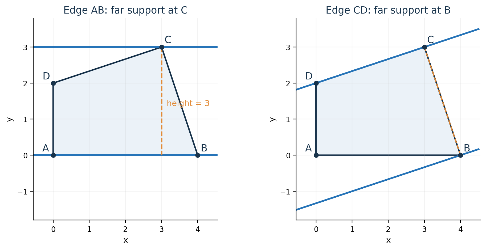
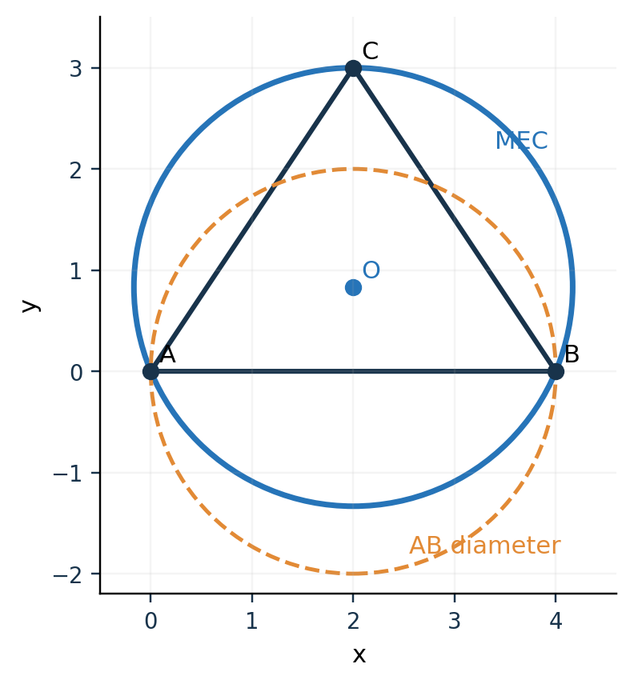

# 第 3 课　凸集的直径与最小包围圆

一块不规则区域需要两个不同的尺度：它内部最远的两点相隔多远，以及一个圆最小要多大才能把它全部罩住。本课先提出这两个几何问题，分别证明有限点化的理由，学习旋转卡壳与最小包围圆的求法，最后用同一个三点例比较它们。**章末应用之前没有比赛设定。**

**学习路线。** 直径的定义 → 极值为什么在顶点 → 旋转卡壳的操作与手算 → 消防站例提出最小包围圆 → 两点、三点求圆 → 习题 → Q1/Q2 应用及代码。每读完一节，应能说出当前求的是“两个位置”还是“同一个覆盖中心”。

进入本章前，你只需会三件事：用勾股定理算两点距离，识别凸多边形，会算二维叉积。若叉积仍不熟，先回上一章做一遍“三点左转还是右转”的例题。

## 3.0　问题与方法的名称

| 名称 | 它是什么 | 用一句日常话说它解决什么 |
|---|---|---|
| 点集或区域的直径 | 一个几何问题 | 里面相距最远的两个位置，离多远？ |
| 旋转卡壳 | 求解一类凸几何问题的算法思想 | 沿凸形外缘转动两条平行支撑线，顺序找候选点对 |
| 最小包围圆，MEC | 一个几何优化问题 | 把所有点包住，圆能有多小？ |
| 随机增量法 | 一种求解算法 | 一个点一个点加入；只有新点破坏当前答案时才修正 |
| 极小极大，minimax | 一种选择方案的准则 | 先看每个方案最差会怎样，再挑最差表现最好的 |
| 黄金分割搜索 | 一维数值优化算法 | 在具有单谷形状的区间上，只比函数值就不断缩小最小值所在区间 |

这些名称不能互相替代。“我们用了最小包围圆”说明求什么；“我们用随机增量法计算它”才说明怎样求。“鲁棒”在这里指考虑允许范围内的所有情况，不是泛指“程序很稳定”。

---

## 3.1　定义：点集的直径

先在纸上画一个凸多边形。你想给它量一个尺寸：拿两个点分别放在区域内，拉开，能拉到的最大距离就是**区域直径**。

圆的直径恰好是大家熟悉的“两倍半径”。但一般区域也有直径；三角形、四边形、线段都可以谈直径，并不要求它长得像圆。

若区域记作 $P$，写成公式是

$$
D(P)=\max_{x,y\in P}\|x-y\|.
$$

逐项读它：从 $P$ 里选两个位置 $x,y$，计算距离，取所有可能选择中的最大值。式子里没有圆心，也没有“覆盖全部位置”的要求。

### 经典问题出处：Toussaint 的凸多边形直径图例

Godfried Toussaint 在 1983 年论文 *Solving Geometric Problems with the Rotating Calipers* 的第 1 节、图 1 中，讲的是一个已按边界排好顶点的凸多边形：用两条平行支撑线夹住它，转动支撑线，找最远点对。这就是本节跟学的经典图例。[原论文，第 1–2 页](https://web.cs.swarthmore.edu/~adanner/cs97/s08/pdf/calipers.pdf)

作者的说明页交代了来源：Shamos 于 1978 年用这一思想求凸多边形直径，Toussaint 后来命名并推广了“旋转卡壳”。它属于**计算几何**，这里是平面算法。[作者说明页](https://www-cgrl.cs.mcgill.ca/~godfried/research/calipers.html)

原图没有供逐步计算的坐标。因此下面先讲原图表达的操作，再明确用一组教学补充坐标练习；不把补充坐标称为论文原数据。

## 3.2　命题：凸多边形的最远点对可以取在顶点

假设多边形有 $n$ 个顶点。即使只检查顶点，两两比较也有 $n(n-1)/2$ 对。区域内部则有无穷多个点。第一步必须解释：为什么能从连续区域退到有限顶点？

直观上，把内部点向某个远离另一点的方向推，总能推到边界上而不使距离变小；沿着一条边继续看，最远位置又能在端点取得。因此最远点对可以选在顶点中。

下面是一段可用于答辩的证明。先用两个边界顶点说明：若 $x=\lambda v_1+(1-\lambda)v_2$，其中 $0\le\lambda\le1$，那么对固定的 $y$，

$$
\|x-y\|
\le \lambda\|v_1-y\|+(1-\lambda)\|v_2-y\|
\le \max\{\|v_1-y\|,\|v_2-y\|\}.
$$

第一步是三角不等式；第二步说加权平均不超过最大项。凸多边形中任意点都是顶点的凸组合，应用同一个道理，先把 $x$ 换成某个顶点，再把 $y$ 换成某个顶点，就证明了

$$
D(P)=\max_{i,j}\|v_i-v_j\|.
$$

**本节掌握线：**能够自己画图并讲出这两次“换成顶点”；不必背一整页抽象凸分析。

## 3.3　算法：沿凸包枚举对踵点

### 先在纸上做一个动作

拿两把直尺，保持平行，夹住凸多边形。每把尺子接触边界，整个多边形在它的一侧，这样的直线叫**支撑线**。两条平行支撑线接触到的一对顶点，叫一对**对踵点**。这个名词在这里就是“能够被一对平行尺子从两边夹住的顶点”。

缓慢转动两把尺子。接触点有时停在顶点上，有时沿边转移到下一个顶点。凸形外缘的方向有顺序，所以接触点也沿边界前进，不必反复退回起点。

算法利用的正是这个顺序。不能把任意乱序点列直接当作凸多边形使用；需要先求凸包，并让顶点沿边界一致地排列。



图为教学补充坐标的原创示意。左图固定底边 $AB$，远侧支撑点是 $C$；右图固定边 $CD$，远侧支撑点是 $B$。两条支撑线之间的垂直距离帮助我们寻找候选点，最后仍要计算候选顶点之间的欧氏距离。

### 用叉积找到“离这一条边最远”的顶点

沿逆时针凸包取当前边 $v_i v_{i+1}$，令

$$
e=v_{i+1}-v_i,\qquad H_i(j)=\operatorname{cross}(e,v_j-v_i).
$$

$H_i(j)$ 是三角形面积的两倍。当前边长固定，因此它越大，$v_j$ 到这条边所在直线的垂直距离越大。**比较的是高度，暂时不是两个顶点之间的距离。**

操作分成两步：

1. 沿凸包向前移动远侧指针 $j$，直到再前进一步不能增加 $H_i(j)$。
2. 比较 $\|v_i-v_j\|$ 和 $\|v_{i+1}-v_j\|$，更新迄今最大的点对距离。

然后让当前边走到下一条边，远侧指针从刚才的位置继续走。标准的完整对踵枚举还要处理等高的相邻顶点；平行边会产生这种情况。不要将一般位置下的图例当成可以忽略平行边的理由。

### 手算一遍：为经典算法补充的四边形

本组整数坐标是**教学补充数据**，用于落实刚才的经典算法；不是 Toussaint 原图的坐标。逆时针顶点为

$$
A=(0,0),\quad B=(4,0),\quad C=(3,3),\quad D=(0,2).
$$

先只算底边 $AB$。边向量是 $(4,0)$，所以对点 $(x,y)$，叉积为 $4y$。$C$ 给出 12，$D$ 给出 8，故远侧点是 $C$。这时检查

$$
|AC|^2=3^2+3^2=18,\qquad |BC|^2=(-1)^2+3^2=10.
$$

保留 18。继续转动，完整计算如下；使用距离平方是为了暂时不反复开方。

| 当前边 | 各顶点 $A,B,C,D$ 的叉积高度 | 远侧点 | 此步检查的距离平方 | 目前最大值 |
|---|---|---|---|---|
| $AB$ | $0,0,12,8$ | $C$ | $AC:18$，$BC:10$ | 18 |
| $BC$ | $12,0,0,10$ | $A$ | $BA:16$，$CA:18$ | 18 |
| $CD$ | $6,10,0,0$ | $B$ | $CB:10$，$DB:20$ | 20 |
| $DA$ | $0,8,6,0$ | $B$ | $DB:20$，$AB:16$ | 20 |

最终 $D(P)=\sqrt{20}$，最远点对为 $B,D$。你应能独立复算表格的 $CD$ 一行：边向量 $D-C=(-3,-1)$，$B-C=(1,-3)$，叉积为 $(-3)(-3)-(-1)(1)=10$。

### 为什么能比两两枚举更快

两两枚举每次都从头检查所有搭配，计算量为 $O(n^2)$。卡壳让两侧接触点顺着凸包前进，扫描阶段为 $O(n)$。如果输入还没有凸包，先排序求凸包通常需要 $O(n\log n)$。

这个结论是对**标准算法的相应阶段**说的；实际程序若还要逐顶点核查全部约束，应把那部分成本另算。

**学会到这里：**能手算上表；能解释“叉积找远侧点，距离找直径”；知道指针单向前进来自凸性。七天内不要求你复述完整的摊还复杂度证明。

## 3.4　第二个标准问题：最小包围圆

### 跟学 ETH 的经典选址例

ETH Zürich 的 *Geometry: Combinatorics & Algorithms*，附录 G 开头，用村庄消防站解释最小包围球：房屋位置已知，若路程按直线距离计、行驶速度相同，希望最远住户的到达时间尽量短，就把消防站放在最小包围圆的圆心。[原讲义，印刷页 232，图 G.1](https://geometry.inf.ethz.ch/gca18-G.pdf)

这里必须看清假设：不考虑道路绕行、不考虑交通拥堵、各方向速度相同。改变这些假设，就可能需要路网距离或带权选址模型。

先不求最优。你在地图上随便选一个站址 $c$，测量它到每户的距离。最远那一户的距离为

$$
R(c)=\max_i\|p_i-c\|.
$$

以 $c$ 为圆心、$R(c)$ 为半径画圆，恰好能把所有房屋包住。现在移动 $c$，让这个半径尽量小，便得到

$$
R_* = \min_c\max_i\|p_i-c\|.
$$

这就是**最小包围圆问题**。你可以直接把公式念成：“挑一个中心，让中心到最远的点的距离尽量小。”

### 两栋房屋：先用下界证明，再给出达到下界的方案

房屋在 $A,B$。任何能包住它们的半径 $r$、圆心 $c$ 都满足

$$
|AB|\le |Ac|+|cB|\le2r.
$$

所以 $r\ge |AB|/2$。以 $AB$ 中点为圆心、半径 $|AB|/2$，恰好达到这个下界，因而最优。

请记住这种证明结构：**任何方案都不能小于某数；我给出的方案达到这个数；所以最优。**仅仅画一个看起来合适的圆，还不是最优性证明。

### 三栋房屋：两点决定的圆可能不够

原消防站例没有给具体坐标。下面是为它补充的**教学手算实例**：

$$
A=(0,0),\quad B=(4,0),\quad C=(2,3).
$$



橙色虚线是以 $AB$ 为直径的圆；蓝色圆是最小包围圆。图中 $O$ 为蓝色圆的圆心。

**第 1 步：先试刚学会的两点方法。**最长边是 $AB=4$，中点为 $(2,0)$，直径圆半径为 2。可是 $C$ 到该中点的距离是 3，因此它在圆外。不能因为找到最远点对，就说已经找到包住全部点的圆。

**第 2 步：利用对称性。**最优圆心在直线 $x=2$ 上，设为 $(2,t)$。到 $A,B$ 的距离相同，为 $\sqrt{4+t^2}$；到 $C$ 的距离为 $|3-t|$。在本题最优位置两类最远距离达到平衡，于是解

$$
4+t^2=(3-t)^2,
\qquad t=\frac56.
$$

得到

$$
c_*=(2,5/6),\qquad R_* = \frac{13}{6}\approx2.1667.
$$

**第 3 步：为什么这次能断言最小。**若仍取 $x=2$，当 $t<5/6$ 时，距 $C$ 大于 $13/6$；当 $t>5/6$ 时，距 $A$ 或 $B$ 大于 $13/6$。若圆心偏离对称轴，$A,B$ 中至少一栋的水平距离会大于 2，而到 $C$ 的距离也不会因水平偏移降低。因此不能得到更小半径。

该例三点的平均位置是 $(2,1)$，最大距离为 $\sqrt5\approx2.2361$，比 $13/6$ 大。**求坐标平均值与控制最远距离是不同目标。**

## 3.5　多点求解：支撑点与增量构造

想象一个圆被里面的点撑住，圆缩到再也缩不动。在二维中，总能找出至多三个点，单靠它们就能确定同一个最小包围圆。ETH 讲义称这样的最小决定子集为 basis；见印刷页 235，定理 G.4。[原讲义](https://geometry.inf.ethz.ch/gca18-G.pdf)

先掌握二维的三种情况：

| 决定点 | 圆是什么 | 手算做法 |
|---|---|---|
| 一个点 | 半径为 0 的退化圆 | 圆心就是该点 |
| 两个点 | 以两点连线为直径的圆 | 取中点与半距离 |
| 三个不共线点 | 在需要三个支撑点时，为它们的外接圆 | 解两条垂直平分线的交点 |

不是“随便挑三个点作外接圆”。三点若构成钝角或直角三角形，最长边的直径圆已经足够；共线时也只需要两个端点。即使很多点恰在同一圆周上，仍可能只选出两个或三个点决定该圆。

### 一点点加入：随机增量思想

Emo Welzl 1991 年论文给出了著名的随机方法。其直观入口是：先解决已有点，再加入新点；新点在当前最小圆内，就不用改；新点在外，新的最小圆必须让这个点成为边界约束之一。[作者公开论文](https://people.inf.ethz.ch/emo/PublFiles/SmallEnclDisk_LNCS555_91.pdf)

为何“新点在圆内就不用改”？原圆仍覆盖全部点；而加入点不可能让最优半径比原来更小，因此原圆继续最优。

新点在外时，把它作为一个已知边界点，再处理旧点。若又遇到破坏当前圆的点，就固定两个边界点；二维至多再由第三个点决定圆。随机顺序用来控制平均工作量，不表示允许漏点。

**本课只要求你能跟踪两次分支：圆内则保留，圆外则重建。**递归随机算法的期望复杂度证明放在深入阅读。你们程序使用固定种子的迭代实现，不能说它逐行照搬了 Welzl 论文里的递归伪代码。

## 3.6　小结与课内习题

| 问题 | 数学式 | 输出 | 不能由它直接推出什么 |
|---|---|---|---|
| 直径 | $\max_{x,y\in P}\|x-y\|$ | 两个最远位置及距离 | 最远点中点能覆盖全部位置 |
| 最小包围圆 | $\min_c\max_{x\in P}\|x-c\|$ | 一个中心及覆盖半径 | 这个中心是每种其他目标下的最佳中心 |

对任意非空有界点集，$D/2\le R_*$。证明就是两点距离不超过经圆心相连的两段半径。但这个不等式不必取等号，上一节三角形已经给了反例。

圆盘是凸集。它若包住凸多边形的每个顶点，就包住全部顶点的凸组合，也就包住整个多边形。所以区域的最小包围圆仍可只从顶点计算。

### 两道即时检查

1. 一条长 10 的线段，直径、最小包围圆半径分别是多少？
2. 一个区域面积为零，能否说明其最小包围圆半径很小？

**解答。**第 1 题为 10 和 5。第 2 题不能：很长的线段面积也为零。回答时要能画出这条线段，而不只是背“不能”。

## 3.7　章末应用：Q1 的直径与 Q2 的覆盖半径

下面把比赛题当成本课习题。前一章已经学过：每次有界角误差得到一个角楔，多次观测取交，得到源的可能位置区域 $P$。

### 应用 3A：Q1 为什么要求直径，而清除又要看包围圆

**题目。**解释下列两个问题的差别：

1. 与观测相容的两个源位置，最远可能相隔多少？
2. 要把机器狗放在一个位置，保证距每个相容源都不超过 20 m，应该检查什么？

**解答。**问题 1 是直径。问题 2 要选同一个中心覆盖全部候选位置，是最小包围圆。若 $R_*\le20$，存在这样的清除点；反过来，若存在这样的点，也必有 $R_*\le20$。

必要条件 $D\le40$ 不足以替代它。边长为 40 的正三角形，直径为 40，最小包围圆半径为 $40/\sqrt3\approx23.094$，不能用 20 m 半径覆盖。这是把标准反例的尺度改成题目的清除阈值。

### 应用 3B：在真实源码里找到刚才的每一步

以下行号对照仓库当前源码，路径从仓库根目录起算。

| 你刚学到的数学动作 | 源码位置 | 看这段时要指出什么 |
|---|---|---|
| 先求凸包 | `source/Q1/q1_solver.py`，144–157 行 | 排序去重；上下链；用叉积弹出不构成所需转向的点 |
| 以叉积找远侧点 | 同文件，160–176 行 | `i` 是当前边；`j` 沿凸包前进；比较的是面积的两倍 |
| 比较真正的点对距离 | 同文件，177–181 行 | 依次比较当前边两端到 `j` 的距离平方，最后才开方 |
| 审核直径圆是否覆盖 | 同文件，184–198 行 | 用最远点中点、半直径作圆；再查所有顶点是否在圆内 |
| 两点定圆与三点定圆 | `source/Q2/q2_solver.py`，186–199 行 | 中点；垂直平分线等价方程；共线时返回 `None` |
| 增量包围圆 | 同文件，202–235 行 | 固定种子打乱；圆内跳过；圆外重新约束；末尾重新量所有点的距离 |
| 对同一区域同时计算三项指标 | 同文件，272–275 行 | 直径、包围圆半径、面积分别计算，没有直接令 $R=D/2$ |

打开 [Q1 求解器](../source/Q1/q1_solver.py) 和 [Q2 求解器](../source/Q2/q2_solver.py) 后，只追踪这几段。先不把命令行解析、CSV 导入等外围细节混进几何算法。

特别留意 Q1：`diameter_circle_covers` 是**检查直径圆的结果**，并不是这个函数计算了一个最小包围圆。名字中的 `include_circle` 也不能当成已经裁剪场地圆的证据：201–204 行保留接口参数后就将它删除，Q1 实际是半平面交。

Q2 的包围圆最后用 `max(dist(...)) + 1e-7` 重算半径（235 行）。这使返回的中心与半径在浮点计算中覆盖输入点；它是数值覆盖复核，不等于用严格舍入证明该中心在所有浮点误差下仍精确最优。

### 应用 3C：自己运行一次标准小例，再打开比赛输入

在仓库根目录启动 Python，把下面内容逐行输入。这里先把通用例题送给你们的算法，目的在于确认“教材一步”与“代码一步”是同一个动作。

```python
import sys
sys.path.insert(0, "source/Q1")
sys.path.insert(0, "source/Q2")
import q1_solver
import q2_solver

quad = [(0, 0), (4, 0), (3, 3), (0, 2)]
print(q1_solver.polygon_diameter(quad))

houses = [(0, 0), (4, 0), (2, 3)]
print(q2_solver.minimum_enclosing_circle(houses))
```

应得到直径约 `4.472135955`，点对为 $(4,0),(0,2)$，顺序可以相反；三点圆心约 `(2, 0.8333333333)`，半径约 `2.1666667667`。末尾比 $13/6$ 大约 $10^{-7}$，对应刚讲过的覆盖裕量。

再打开 [固定种子 Q1 结果](../examples/q1_seed_20260929_result.json)，找 `vertices_m`、`diameter_m` 和 `diameter_circle_covers`。不必背住随机坐标；要会解释三个字段各回答什么问题。

### 评委追问练习

**为什么没用两两枚举？**小规模时两两枚举完全可用，也很适合作核对；凸包顶点有序时，旋转卡壳复用远侧指针，扫描阶段较快。选择理由来自输入结构和重复调用成本，不能回答“因为暴力法不正确”。

**为什么不取多边形重心？**重心与最小化最大距离不是同一个目标；消防站三点例已给出数值反例。清除要求覆盖全部可能位置，因此选包围圆的中心更贴近条件。

**这个算法每次都能得到有限圆吗？**对非空有限点集可以。Q1 的角楔交可能为空或无界；必须先看状态，不能把无界区域当成几个有限顶点硬算。

---

# 第 4 课　极小极大优化与数值搜索

上一课已经在最小包围圆中出现一次“先找固定圆心的最远点，再选圆心”。本课抽出共同的决策模型：**方案先确定，不利情况后揭示，评价方案时先算最坏值。**先在切比雪夫逼近的经典例子中把顺序和解法学清；当评价函数只能数值计算时，再学黄金分割的前提与步骤。最后才把 Q2 当作多层极小极大的应用题。

**学习路线。** 经典逼近题 → 极小极大定义与量词顺序 → 一维无导数搜索例 → 方法适用边界 → Q2 安全站点和后验区域 → 课后题、源码与结果解释。重点不是背一个长公式，而是能逐层说明“谁在选择、谁在变化、何时才知道”。

## 4.1　经典问题：最大残差最小化

Boyd 与 Vandenberghe 的 *Convex Optimization*，第 1.2.2 节、式 (1.6)，给出一个经典例子：选择参数，使若干表达式的**最大绝对残差**尽量小。第 6.1.1 节称它为 Chebyshev approximation，也叫 minimax approximation。[作者公开教材，印刷页 6–7、293](https://web.stanford.edu/~boyd/cvxbook/bv_cvxbook.pdf)

不用一开始就读矩阵。先取原例最简单的一维特例：用同一个数 $x$ 去代表两个已知数 $a<b$。两个误差是 $|x-a|$、$|x-b|$。你要解决

$$
\min_x\max\{|x-a|,|x-b|\}.
$$

这不是新编造一个题名：它是教材参数式在两个观测、一个常数参数时的特例。下面的推导是为了初学者重新展开的。

### 第一步：先把 $x$ 固定，求它的“成绩”

暂且只看 $a\le x\le b$。左端误差是 $x-a$，随着 $x$ 增大而上升；右端误差是 $b-x$，随着 $x$ 增大而下降。这个 $x$ 的成绩取两者较大值。

画出一条上升直线和一条下降直线，沿它们的**上边界**读值。上边界最低的位置就是两线相交处。因此

$$
x-a=b-x,
\qquad x_*=(a+b)/2,
\qquad \text{最坏误差}=(b-a)/2.
$$

若 $x<a$ 或 $x>b$，到更远端点的距离至少超过 $b-a$，显然不优。这也检查了刚才只在区间内分析的合法性。

### 第二步：把“最大值”改写成共同上限

引入一个误差上限 $t$，要求每个误差都不超过它：

$$
\begin{aligned}
\text{最小化}\quad &t,\\
\text{满足}\quad &|x-a|\le t,\qquad |x-b|\le t.
\end{aligned}
$$

还可拆成四个线性不等式。这种做法叫**上图形式**或辅助上界变量形式。先记住具体动作：把一个“最大值目标”变成“同一个上限限制所有项”，再把上限压低。

它是教材中的标准改写技巧。并不表示以后看到任意一个 `min max`，就一定能变成线性规划；还要看里面的函数和约束是什么。

## 4.2　定义：先选方案、后见情况

把消防站中心、常数拟合值都抽象成决策 $x$，把可能的房屋或误差场景记作 $u$。损失写作 $L(x,u)$，则

$$
\min_{x\in X}\max_{u\in U}L(x,u)
$$

要按以下顺序读：

1. 假定我已经选了某个 $x$。
2. 在所有允许的 $u$ 中，找这个 $x$ 最糟糕的一项。
3. 更换 $x$，让这个最糟糕值尽量小。

$X$ 是允许选的方案集合，$U$ 是需要防备的情况集合。若连续范围上最大值未必能取得，严格写法常用 $\sup$，即上确界。初学时先理解“盖住所有值的最小上界”。

**顺序不能随便交换。**先知道 $u$ 再选择 $x$，通常更容易。例如只有两个端点 $a,b$：先选一个固定代表值，最坏误差是 $(b-a)/2$；若看到实际端点后才允许选择代表值，直接选该端点，误差为 0。这是信息获得时机不同，不是计算技巧不同。

### “鲁棒”在这里需要什么假设

你知道不确定量属于一个集合，但没有把它当作已知概率分布。于是要求全部允许情况都满足条件，或者优化其中最坏的损失。

若知道可靠的概率模型，可以研究平均损失或某种风险水平。这些目标与最坏损失各有用途。现在只要会辨认：**误差有上下界，不自动意味着它服从正态分布或均匀分布。**

## 4.3　算法：单峰函数的黄金分割搜索

课本中的常数逼近有解析解。但实际评价一个方案时，可能要先运行几何裁剪，再求包围圆；函数值可以算，导数却很难写。

这时进入**无导数优化**：依靠函数值比较寻找好方案。先学一维中最清楚的黄金分割法，再讨论它能用于什么程度的结论。

### 经典数值例：Cornell 开放教材的黄金分割 Example 1

Cornell 的 *Computational Optimization Open Textbook*，`Derivative free optimization` 页中 “Numerical Examples / Example 1: Golden Section Search” 给出的原例是

$$
f(x)=(x-2)^2+1,\qquad x\in[0,5].
$$

[原例链接](https://optimization.cbe.cornell.edu/index.php?title=Derivative_free_optimization)

这里只采用原例函数与区间；以下数字重新计算。原网页在初始化和一次重命名处有排版问题，阅读时以公式 $[0,5]$ 和下列推算为准。

这个函数显然在 $x=2$ 时最小，最小值为 1。教材特意用一个已知答案的简单函数，方便检查数值算法是否走对。练习时暂时当作“只能代入函数，不能用求导直接解”。

### 先搞清删区间的依据

要求 $f$ 在当前区间呈**单谷形状**：先下降后上升，唯一谷底，或符合相应单峰约定。在 $a<c<d<b$ 处取两个内部点。

- 若 $f(c)<f(d)$，最小点不可能在 $d$ 的右侧，否则在走向谷底的下降段上应有 $f(c)>f(d)$；因此保留 $[a,d]$。
- 若 $f(c)>f(d)$，对称地保留 $[c,b]$。

等值情形在严格单谷假设下可保留含谷底的较小区间。代码用一种固定分支处理等值。

Michael Heath 的官方教学模块明确把单峰条件作为区间保留的前提，对应其教材第 6.4.1 节、算法 6.1、例 6.8。[大学教学模块](https://heath.cs.illinois.edu/iem/optimization/GoldenSection/)

### 为什么偏偏用 0.618

令

$$
\tau=\frac{\sqrt5-1}{2}\approx0.618034,
\qquad c=b-\tau(b-a),\qquad d=a+\tau(b-a).
$$

它满足 $\tau^2=1-\tau$。删去一边后，旧的一个内部点刚好落在新区间所需的黄金分割位置。所以后续每轮只需新算一个函数值。这个比例来自**复用已计算位置**的要求，不是经验选了一个神奇小数。

### 原例逐步计算

1. 从 $[0,5]$ 开始：$c=1.909830,d=3.090170$；$f(c)=1.008131<f(d)=2.188471$，保留 $[0,3.090170]$。
2. 从 $[0,3.090170]$ 开始：$c=1.180340,d=1.909830$；$f(c)=1.671843>f(d)=1.008131$，保留 $[1.180340,3.090170]$。
3. 从 $[1.180340,3.090170]$ 开始：$c=1.909830,d=2.360680$；$f(c)=1.008131<f(d)=1.130090$，保留 $[1.180340,2.360680]$。

把第二行的 $1.909830$ 圈起来：它就是上一行的旧点，被再次使用。每轮保留的区间仍包含真正解 2。

**自己动手。**不要看答案，算下一轮的新点应在旧点 $1.909830$ 的左侧还是右侧。答案：左侧；新区间内部点约为 $1.631190$ 和 $1.909830$。因为右侧旧点仍被保留，只需补左侧新点。

### 学会到什么程度才够

你应能解释“为何可以删一段”“为何复用一个值”“为何需要单谷假设”，并算出前两轮。七天答辩准备不要求推导所有一维优化算法。

还要守住一条边界：若函数有多个谷，仅凭局部两个值删区间可能丢掉全局最佳点。先网格扫描、再细化若干好区间，是有用的数值策略；没有额外证明时，不能把它称作连续全域最优证明。

## 4.4　小结：模型、性质与数值方法

| 层次 | 要回答的问题 | 本课例子 |
|---|---|---|
| 建模 | 我决定什么，哪些情况必须考虑，什么叫好？ | 选 $x$，控制最大绝对残差 |
| 数学结构 | 是否凸、是否单峰、能否换成等价约束？ | 常数切比雪夫逼近能转成线性约束 |
| 求解方法 | 实际怎样找数值答案？ | 解析求解、网格扫描、黄金分割 |

“极小极大”本身不是一段固定程序。“采用极小极大模型，再用有限网格与局部搜索近似求解”，才是一句完整说明。

---

## 4.4a　完整例题：从候选站一直算到最坏报告

前几节分别讲了极小极大、包围圆与黄金分割。现在先用一个**与比赛无关、可全部手算**的离散定位例，把三者的输入输出接起来。这是本教材构造的教学数据，不是 Q2 的模拟成绩。

**题目。** 已知未知目标必在
$F_1=\{g_1=(1,0),g_2=(2,0),g_3=(0,1),g_4=(0,2)\}$ 四处之一。接收半径为 10，所有这些位置和以下两站的距离都不超过 10。设备在第二站给出从该站指向目标的方位 $y$，误差界为 $\pm1^\circ$。可选站 $A=(0,0)$ 或 $B=(2,2)$。输出是哪一站的**最坏后验最小包围圆半径**较小。报告 $y$ 是连续角度，必须处理所有可实现报告，不能只挑目标的真方向当报告。

**一般模型。** 对固定站 $s$，令 $\theta_s(g)=\arg(g-s)$，$W(s,y)=\{g:|\operatorname{wrap}(\theta_s(g)-y)|\le1^\circ\}$。于是

$$
\begin{aligned}
Y(s)&=\bigcup_{g\in F_1}[\theta_s(g)-1^\circ,\theta_s(g)+1^\circ],\\
F_2(s,y)&=F_1\cap W(s,y),\\
Q(s)&=\max_{y\in Y(s)}R(F_2(s,y)),\\
s^*&=\arg\min_{s\in\{A,B\}}Q(s).
\end{aligned}\tag{4.8}
$$

$Y(s)$ 的第一个式子是由“报告必须由至少一个真位置及允许误差产生”推出来的。只有 $F_2(s,y)\ne\varnothing$ 的读数才进入最大值。接收半径的可行性已在题设核实，不能在比较质量时忘记硬约束。

**站 A 的全部报告类别。** $g_1,g_2$ 的真方位同为 $0^\circ$；$g_3,g_4$ 的真方位同为 $90^\circ$。可实现报告是 $[-1^\circ,1^\circ]\cup[89^\circ,91^\circ]$。第一段内每个报告的后验为 $\{g_1,g_2\}$，其 MEC 圆心 $(1.5,0)$、半径 $0.5$；第二段后验为 $\{g_3,g_4\}$，圆心 $(0,1.5)$、半径也为 $0.5$。所以 $Q(A)=0.5$。

**站 B 的全部报告类别。** 四个真方位依次为约 $243.435^\circ,270^\circ,206.565^\circ,180^\circ$。以各方向为中心的四段 $\pm1^\circ$ 报告区间互不重叠。任何可实现报告只与一个 $g_i$ 相容；单点 MEC 半径为 0，故 $Q(B)=0$。两站已穷尽，极小极大解是 $B$，值为 0。

**这里学到了什么。** 一条“站点 → 可能报告集 → 每个报告的后验 → 每个后验的 MEC → 站点最坏值 → 站间比较”的链，不能省掉中间环节。这里可穷尽，是因为 $F_1$ 只有四个离散点，报告区间也可以按端点分段。Q2 的 $F_1$ 却是连续角楔与圆域的交，站位与报告也是连续变量；它用外包多边形、有限采样和局部细化计算近似，不能直接援引本例的穷尽证明。

**立即练习（附解）。** 把站 B 的方位误差半宽改成 $15^\circ$，是否仍可保证 $Q(B)=0$？解：相邻方向差为 $26.565^\circ<30^\circ$，报告区间发生重叠，例如 $y=256.7^\circ$ 同时与 $243.435^\circ$ 和 $270^\circ$ 相差不超过 $15^\circ$。其后验至少含 $g_1,g_2$，两点相距 1，MEC 半径至少 $0.5$，所以原来的零半径结论失效。此题只要求推翻 $Q(B)=0$，不凭一例就宣布新最坏值的完整数值。

## 4.5　章末应用：Q2 的第二站选址

现在只引入完成练习需要的题设：首次测向有 $\pm1^\circ$ 误差；源的接收半径在 1000–1500 m 范围内；需要选择第二检测点，并评价第二次报告之后的不确定区域。20 m 是最终清除距离。

### 应用 4A：先说明决策与发生顺序，不急着列大公式

**题目。**Q2 中，哪个量由我们选？哪个量还不知道？什么时候才能选清除中心？

**解答。**我们先选第二站 $s$。到那里测量后才得到报告 $z$。根据这个报告形成新的相容区域 $P(s,z)$，然后才可以为该区域选一个覆盖中心 $c$。

因此一次完整的评分流程是：

1. 暂定第二站 $s$。
2. 暂定一种允许出现的报告 $z$，形成 $P(s,z)$。
3. 为这个区域计算 $R(P)=\min_c\max_{g\in P}\|g-c\|$。
4. 改变报告 $z$，找最坏的半径，作为站点 $s$ 的成绩。
5. 比较不同的安全站点，选成绩最小的。

只在这五句话能说顺以后，再写压缩公式：

$$
\min_{s\in\mathcal S}
\sup_{z\in\mathcal Z(s)}
\underbrace{\min_c\sup_{g\in P(s,z)}\|g-c\|}_{\text{该报告下的最小包围圆半径}}.
$$

$\mathcal S$ 是安全第二站集合；$\mathcal Z(s)$ 是在站点 $s$ 可相容的报告集合。这一式把消防站问题放在内层，再多加“未来报告”“预先选站”两层。最外层的站点变量不等于最内层的清除圆心。

这里不能只给 $\mathcal Z$ 和 $P$ 起名字，还须会**从已知数据构造它们**。令场地 $\Omega=B(0,1800)$，首站 $s_1$，报告 $z_1$，并把一次有效接收可达到 1500 m 的条件写入：

$$
F_1=\Omega\cap B(s_1,1500)\cap W(s_1,z_1),\qquad
W(s,z)=\{g:|\operatorname{wrap}(\arg(g-s)-z)|\le1^\circ\}.
$$

对暂定站位 $s$ 和暂定报告 $z$，按已知条件更新得到

$$
P(s,z)=F_1\cap B(s,1500)\cap W(s,z),\qquad
\mathcal Z(s)=\{z\in[0,360^\circ):P(s,z)\ne\varnothing\}.
$$

因此“可实现”要求**同一个源位置**同时满足首读数、第二接收距离和第二读数；不能分别拿两个互不相容的源来拼一个极端情况。严格物理模型还跟踪每个源自己的固定接收半径 $\rho\in[1000,1500]$ 和 5 m 近场反馈；上面是程序使用的宽松集合构造。`first_feasible_polygon` 以外切多边形保存 $F_1$ 的外包络，`physical_base` 加第二个最大接收盘，`post_region` 再加第二角楔；由外包络得到的非空候选报告也可能含边界附近的假可行报告，故数值表述为“在程序模型里可行”。

**一个可手算的微型例。** 暂取 $F_1=\{(2,0),(2,2)\}$、$s=(0,0)$、误差暂设为零、最大接收距离 3。报告 $z=0^\circ$ 的后验为 $\{(2,0)\}$；报告 $45^\circ$ 的后验为 $\{(2,2)\}$，因为后者距离为 $2\sqrt2<3$。报告 $90^\circ$ 的后验为空，不进入最坏报告集合。把这三个集合自己画出来，再回到连续角楔和多边形，不会把“每一个角度都可能”当作前提。

### 应用 4B：安全第二站为什么是“对所有可能源都能接收”

**题目。**第一次观测后，源可能在集合 $F_1$ 中。采用统一的 1000 m 接收保证时，写出第二站条件。为什么不能只检查一个猜测的源位置？

**解答。**要使每个相容源位置都距离第二站不超过 1000 m：

$$
\max_{g\in F_1}\|s-g\|\le1000,
\qquad
\mathcal S=\bigcap_{g\in F_1}B(g,1000).
$$

每个可能源 $g$ 都给出一个允许站点的圆盘。必须同时满足，所以取交。只满足其中某个圆盘，仅说明某个猜测的源可以接收。

这与消防站的区别很具体：消防站同时服务多个真实房屋；这里真源只有一个，但尚不知道哪个候选是真的，所以在保证性设计中需要照顾全部候选。

### 应用 4C：把安全条件手算成一段允许角度

**题目。**平移旋转坐标，把首站放在原点、首示向指向正 $x$ 轴。用完整扇区 $0\le r\le1500$、$|\eta|\le1^\circ$ 作为首测候选的保守范围。第二站离首站 $L$，偏离首示向 $\psi$。取 $L=1000$，算统一接收保证下允许的最大 $|\psi|$。

**步骤 1：先固定源的方向 $\eta$。**源坐标是 $g=r(\cos\eta,\sin\eta)$，第二站为 $s=L(\cos\psi,\sin\psi)$。余弦定理给出

$$
\|s-g\|^2=L^2+r^2-2Lr\cos(\psi-\eta).
$$

**步骤 2：处理所有距离 $r$。**右侧是关于 $r$ 的开口向上二次函数。因此在闭区间 $[0,1500]$ 上，最大值在端点取得。只需检查 $r=0$ 和 $r=1500$。注意：开口向上函数的最大值在区间端点，最小值却可能在内部。

**步骤 3：处理所有方向。**在当前安全弧的角度范围内，最远扇区端点与第二站的夹角为 $|\psi|+1^\circ$。于是要同时满足

$$
L\le1000,
\qquad
L^2+1500^2-2L(1500)\cos(|\psi|+1^\circ)\le1000^2.
$$

代入 $L=1000$：

$$
\cos(|\psi|+1^\circ)\ge0.75,
\qquad
|\psi|\le\arccos(0.75)-1^\circ\approx40.409622^\circ.
$$

这里的“40.41°”是**第二站相对首示向的允许偏角**，不是两条观测射线在真实源处的交会角，更不是最佳站点答案。它只回答安全可行性，之后还要评价定位质量。

为何保留完整扇区？它简单且保守；实际场地圆可能截掉扇区的一部分，利用截断信息可进一步放宽某些候选。当前默认站点安全搜索没有声称已得到利用所有先验的最大安全域。

### 应用 4D：连续集合怎么变成程序可算的对象

**题目。**在某个固定第二站和固定报告下，要先求相容区域，再算圆。源码在哪些地方引入近似？

**解答。**程序用圆的外接多边形与角楔裁剪来表达区域；普通示向报告还意味着不在 5 m 近场内，但程序不挖去这个小孔，以保持凸性。因此计算集合是保守放宽。针对这个固定报告，包围放宽后的区域需要的半径不会小于包围真实区域所需的半径。

但接下来用有限个报告取最大值，是另一个动作。有限采样可能漏掉两个样点之间的峰值，所以不能因为“每个样点的空间集合是外包的”，就说“整个连续报告范围的最大值也被严格盖住”。

用两个符号记住方向即可：若 $P\subseteq\widetilde P$，则 $R(P)\le R(\widetilde P)$；而若 $Z_{\rm sample}\subseteq Z$，则对同一个函数 $f$，$\max_{z\in Z_{\rm sample}}f(z)\le\sup_{z\in Z}f(z)$。一个扩大空间集合，一个缩小检查的报告集合，不能混成同一条保证。

## 4.6　源码对应：从站点到最坏报告

本节到代码才使用具体函数名；如果你还说不清应用 4A 的五步，先回去重做。

| 课堂动作 | `source/Q2/q2_solver.py` 行号 | 应当读懂的输入、输出与分支 |
|---|---|---|
| 检查站点距整个扇区最远多远 | `_sector_max_distance_sq`，63–77 | 输入局部站点、扇区半径、角半宽；输出最大距离平方；代码也考虑反向方向落在区间内的情况 |
| 用统一 1000 m 条件筛选 | `safe_uniform_1000`，91–94 | 将上述最大值与 $1000^2$ 比较 |
| 由固定 $L$ 计算允许角度 | `safe_angle_limit`，97–111 | 应用 4C 中的反余弦公式 |
| 用外接多边形表示圆盘 | 114–121、147–154 | 顶点半径除以 $\cos(\pi/n)$；切线半平面逐个裁剪 |
| 得到首测候选区 | `first_feasible_polygon`，169–179 | 场地圆、1500 m 接收圆、首测角楔取交；不挖近场小孔 |
| 第二站和报告形成后验区域 | 278–284、318–330 | 先加第二接收圆，再加第二角楔；空集报告跳过 |
| 对报告找最大值 | `robust_quality`，307–400 | 先扫圆周报告角；再针对 R/D/A 各细化最多 8 个粗网格峰值；最终分别取最大 |
| 对站点找最小值 | `optimize_fixed_baseline`，408–469 | 固定基线，两侧偏角先粗后细；安全才评分；最后取最小 |
| 比较多条基线与两种目标 | `solve_case`，481–519 | 分别按 D 与 R 重新搜索，并对选出的站点加密复评 |

### 只读一小段，练习把代码译成人话

`robust_quality` 的核心评分在 326–330 行：

```python
poly = post_region(base, second, key, delta_deg)
if not poly:
    return None
result = polygon_metrics(poly), poly
```

逐行说：用这次候选报告裁剪已有相容区域；如果交集为空，这个报告与当前放宽模型不相容，不参与评分；否则计算区域的直径、包围圆半径和面积。

再看 393–395 行：

```python
row_R = max(records, key=lambda row: row[1].mec_radius_m)
row_D = max(records, key=lambda row: row[1].diameter_m)
row_A = max(records, key=lambda row: row[1].area_m2)
```

这是对每一种指标分别找最坏报告。最坏半径、最坏直径、最坏面积未必出现在同一个报告上，不应把三个数自动拼成某一个实际多边形的三项指标。

### 为什么代码里的黄金分割在求“最大值”

课堂例子求谷底；Q2 内层想找最坏报告，求的是峰顶。因此它在 380 行使用 `fc >= fd` 来决定保留方向。数学上，求 $f$ 的最大值等价于求 $-f$ 的最小值。

它在粗网格候选峰附近迭代 34 次。迭代次数多，说明局部区间细；未证明该区间单峰、也未证明所有峰都已捕获时，不能由此宣称连续最坏值认证。

### 三个容易从函数名误读的地方

1. `safe_full_information`（80–88 行）在文件里保留了另一安全域的实现，但默认 `solve_case` 使用 `uniform1000`。能够解释备选方法，不等于默认路径已经运行了它。
2. `refine_step_deg` 出现在 `robust_quality` 的形参中，当前函数体没有使用它。实际细化由粗峰区间和固定 34 次迭代控制；不能只改这个参数就声称报告采样变密。
3. `final_quality` 的默认报告步长是 0.1°，但正常 `solve_case` 明确传入 0.2°，quick 模式传入 0.5°（503–508 行）。回答“实际用了多少”应追到调用处。

这些细节留到第三天源码练习时读，不需要在第一遍几何入门时一起背。

## 4.7　课后习题：读取一次 Q2 数值报告

打开 [固定种子 Q2 输入](../examples/q2_seed_20260929_input.json) 与 [quick 结果](../examples/q2_seed_20260929_quick_result.json)。这是仓库已有的本地演示记录，不是外部教材数据，也不是官方成绩。

**题目。**仅根据文件回答：选了哪条基线？哪种目标得到什么站点？记录中的最坏半径约 55.82 m 能说明什么？

**参考解答。**本次 quick 搜索的 D 与 R 两种目标都选中 $L=1000$ m、$\psi=-33.25^\circ$；复评半径约 55.8199286 m，字段 `meets_20m_on_evaluated_reports` 为 `false`。该记录表示本次离散搜索与放宽模型的数值评价没有达到 20 m 判据。

它不能用来断言“所有连续候选站点都不可能达到 20 m”，也不能证明两种目标在全部场景都选择相同站点。更不能把有限报告的最大值叫作已认证的连续最大值。

### 方法选择的答辩练习

**问：为什么要最小化最坏半径，不优化平均面积？**

答：清除条件是一个位置能覆盖全部相容源，因此半径与清除距离直接对应。题设只给误差范围，没有给可信的报告概率分布，所以当前模型评价允许报告中的最坏情况。面积可以辅助比较形状，但长而窄的区域即使面积小，仍可能需要很大的覆盖半径。

**问：为什么不直接用线性规划？教材刚才不是能化成线性规划吗？**

答：课堂的常数逼近只有绝对线性误差，能拆成有限线性不等式。Q2 的外层站点会改变后验集合，评分还包含包围圆与连续报告最坏值，不能直接沿用那个简单线性规划。程序选择固定基线、两侧角度搜索并加密复评。

**问：为什么不直接用梯度下降？**

答：区域裁剪的顶点结构会改变，内层最坏报告也会切换，目标没有现成的光滑导数表达。当前每次可以直接评价函数值，故采用无导数数值搜索。这里没有给出梯度法一定失败的证明，也没有给出所用搜索的全局最优证明。

**问：是否把最坏源位置与最坏报告独立拼起来了？**

答：报告先通过后验区域非空检查；对应的源必须与该报告的角楔约束相容。代码是在所用的外包近似模型内检查相容性，因此还需承认圆近似与近场孔省略带来的保守放宽。

**问：增加网格密度有什么用，是否足以证明全局最优？**

答：有助于检查数值结果对分辨率是否敏感，也可能发现漏掉的峰或更好候选；多次结果接近仍属于数值证据。连续全域结论需要额外的界、全局结构证明或覆盖全部候选的认证方法。

## 4.8　自测与答辩过关标准

先盖住书，在纸上完成以下任务，再回看源码。

1. 画一个三角形，说明直径圆为什么会漏点；独立算出第 3 课三点例的圆心和半径。
2. 画两条平行支撑线，解释卡壳指针为何沿凸包前进；复算一次叉积高度和一次点对距离。
3. 用“固定方案—找最坏—换方案”讲清极小极大；举出先知道情况再决策会改变答案的端点例。
4. 完成黄金分割原例前两轮，指出单峰假设和复用旧函数值的位置。
5. 从 Q2 源码依次指出“安全站域、后验区域、单报告半径、最坏报告、最优候选站”各在什么函数中。

能做到这些，就达到了本章的入门与答辩要求。扩展阅读才包括随机算法的严格期望复杂度、一般鲁棒优化对偶理论和连续全域认证；它们不应挤占你先把上述五项真正学会的时间。

## 本章出处与使用范围

本章文字与推导重新编写。外部来源负责交代标准方法、经典问题与原例位置；补充的小坐标已在出现处标记。请按下面指定的小节阅读，不要求七天内通读整本原书。

| 资料 | 精确位置 | 本章怎样使用 |
|---|---|---|
| Godfried Toussaint，*Solving Geometric Problems with the Rotating Calipers*，1983 | §1，图 1，PDF 第 1–2 页；[原论文](https://web.cs.swarthmore.edu/~adanner/cs97/s08/pdf/calipers.pdf)；[作者说明](https://www-cgrl.cs.mcgill.ca/~godfried/research/calipers.html) | 凸多边形直径的原始图例、支撑线及算法来源；整数四边形为教学补充 |
| ETH Zürich，*Geometry: Combinatorics & Algorithms*，附录 G | 印刷页 232 的消防站例；235 的定理 G.4；236 的 §G.2；[官方讲义](https://geometry.inf.ethz.ch/gca18-G.pdf) | 原有应用例、少量支撑点、增量思想；三栋房屋坐标为教学补充 |
| Emo Welzl，*Smallest Enclosing Disks (Balls and Ellipsoids)*，1991 | LNCS 555，359–370；[作者公开论文](https://people.inf.ethz.ch/emo/PublFiles/SmallEnclDisk_LNCS555_91.pdf) | 随机算法的原始出处；不将当前迭代源码说成原论文原样代码 |
| Stephen Boyd、Lieven Vandenberghe，*Convex Optimization*，2004 | §1.2.2，式 (1.6)–(1.7)，印刷页 6–7；§6.1.1，293；[作者版 PDF](https://web.stanford.edu/~boyd/cvxbook/bv_cvxbook.pdf) | 切比雪夫逼近参数式及共同误差上限的改写；两数据特例在本文重新展开 |
| Cornell，*Computational Optimization Open Textbook* | `Derivative free optimization` → `Numerical Examples` → `Example 1`；[原例](https://optimization.cbe.cornell.edu/index.php?title=Derivative_free_optimization) | 使用原函数 $(x-2)^2+1$、原区间 $[0,5]$，自行复算迭代数值 |
| Jeffrey Naisbitt、Michael Heath，*Golden Section Search* | 对应 Heath 第 2 版教材 §6.4.1、算法 6.1、例 6.8；[官方教学模块](https://heath.cs.illinois.edu/iem/optimization/GoldenSection/) | 明确黄金分割的单峰前提与区间保留理由 |

源码映射基于本仓库 `source/Q1/q1_solver.py` 与 `source/Q2/q2_solver.py` 的当前行号。课程没有修改算法；精确几何结论、浮点实现检查与有限搜索结果在课文中分别说明。
