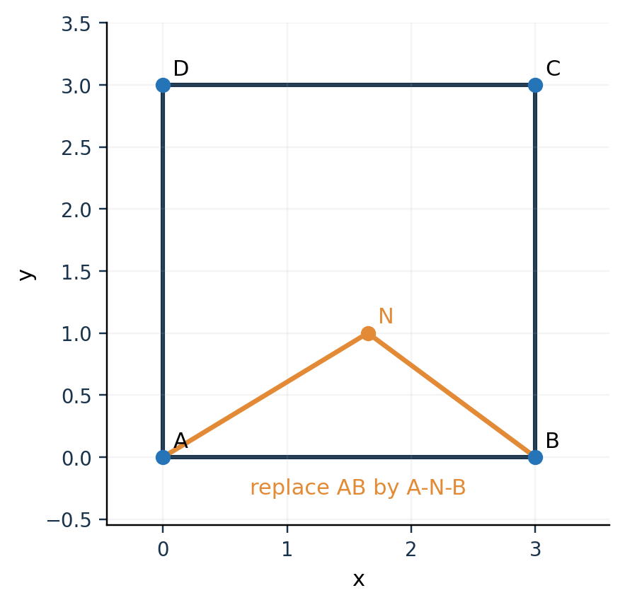

# 第 5 课　覆盖、旅行商与启发式：先分清要解决什么

**本课的位置：**第 4 天前半段。先用约 100 分钟学完 5.1–5.7，再用约 60 分钟做课后 B 题练习。需要会集合的并集、两点距离和加减法。本课不要求证明计算复杂性定理。

**学完的标准：**给你一组“谁能负责什么”，你能判断覆盖；给你一张距离表，你能算路线；给你一条现有路线和一个新任务，你能算插入增加多少路程。最后才解释自己的代码用了哪一步。

## 5.1　先用两个问题认识这门课

一个项目需要五种编程语言。每名程序员会其中几种。你要找尽量少的人，凑齐五种语言。这叫**集合覆盖问题**（set cover）：挑哪些集合，使它们合起来包含全部需求。

如果人已经选好，现在要依次去他们的住处收材料，再回学校，怎样走最短？这才是**旅行商问题**（traveling salesman problem，TSP）：全部地点已知，挑一个访问顺序。

这两个问题的输入、答案长得不同：

| 问题 | 输入 | 一个答案是什么 | 要优化什么 |
|---|---|---|---|
| 集合覆盖 | 需求清单；每个候选者能满足哪些需求 | 候选者名单 | 人数或选取成本 |
| 闭合 TSP | 必访地点；两两路费或距离 | 访问次序，最后回起点 | 全程成本 |
| 开放访问路径 | 必访地点、起点及终点要求 | 访问次序，未必返回 | 全程成本 |

**暂停自问：**“用三个人能完成所有工作”回答了去这三家时怎样走吗？没有；它甚至还没有使用地址。反过来，“有一条很短的路线”也不能说明选中的三个人具备全部技能。

本课依次学“覆盖是否完成”“路线是否短”“信息后来才出现时怎样决策”。先把每个问题单独做懂，才把它们组合起来。

## 5.2　经典教材例题一：组建程序员团队

### 原题在哪里

Luca Trevisan 的 CS261 课程讲义《Lecture 4: TSP and Set Cover》§2 用下列编程团队说明集合覆盖。这里保留原例的人员与技能数据，中文叙述和下面的推算重新编写。[5-1]

需求是 C、C++、Ruby、Python、Java。候选者如下：

| 人员 | C | C++ | Ruby | Python | Java |
|---|:---:|:---:|:---:|:---:|:---:|
| Andrea | ✓ | ✓ |  |  |  |
| Ben |  | ✓ |  |  | ✓ |
| Lisa |  | ✓ | ✓ | ✓ |  |
| Mark | ✓ |  |  |  | ✓ |

### 第一步：把“挑人”写成集合

把全部需求叫作全集 $U$：

\[
U=\{\mathrm{C,C++,Ruby,Python,Java}\}.
\]

每个人对应一个子集。例如 Lisa 对应

\[
S_L=\{\mathrm{C++,Ruby,Python}\}.
\]

挑 Lisa 和 Mark，满足的需求是两个子集的并：

\[
S_L\cup S_M=U.
\]

并集中的同一种语言只记一次。两个人都会 C++，并不等于多满足一项新需求。

### 第二步：找到答案，并说明为什么已经最少

Lisa 与 Mark 能凑齐五种语言，因此两个人足够。表里没有任何一个人会五种语言，因此一个人不够。把这两句话合起来，才证明最少人数就是二。

这是一种很常用的证明结构：

1. 给出一个方案，说明“至多需要二”。
2. 排除更小的方案，说明“至少需要二”。
3. 上下界相等，得到最优值。

**“我找到一个能用的方案”和“我证明它是最优方案”是两种不同的工作。**答辩中也要分别说清。

### 第三步：学一个容易执行的通用算法

如果人员很多，不便枚举全部组合，可以每次选**能补齐最多尚缺技能**的人。这叫贪心集合覆盖。

```text
尚缺需求 ← 全部需求
已选人员 ← 空名单
只要尚缺需求非空：
    选一个能覆盖最多尚缺需求的人
    把他加入名单
    从尚缺需求中删除他会的技能
```

在本例中，先选 Lisa，一次满足三项；剩下 C、Java，再选 Mark。执行过程是：

| 步骤 | 尚缺需求 | 选择 | 选择后剩下 |
|---|---|---|---|
| 1 | 五种语言 | Lisa | C、Java |
| 2 | C、Java | Mark | 空集 |

这里贪心恰好得到最优解。其终止条件“没有尚缺需求”保证覆盖完成；这一个例子的成功还不能证明贪心对所有输入都选人最少。一般算法的近似理论放在扩展阅读中，七天准备只需把操作与保证的区别讲清。

**立即检查：**第一轮之后再看 Andrea，为什么只算他新覆盖一项？因为 C++ 已经有了，只有 C 是新增贡献。

## 5.3　经典教材例题二：四个地点怎样走

### 原题在哪里

David Lippman 的开放教材《Math in Society》“Graph Theory and Network Flows”，印刷页 63–66，先枚举四点巡回，再用同一图讲最近邻。原边权如下；这里改用表格呈现。[5-2]

| 起点\终点 | A | B | C | D |
|---|---:|---:|---:|---:|
| A | 0 | 4 | 2 | 1 |
| B | 4 | 0 | 13 | 9 |
| C | 2 | 13 | 0 | 8 |
| D | 1 | 9 | 8 | 0 |

**先读懂数据。**$d(A,B)=4$ 是 A 到 B 的成本。表是对称的，因此反向成本相同。这里的权重是抽象路费，不能按图中线段的长短读取，也不能假定它来自平面直线距离。例如 $13>4+2$，所以它不满足三角不等式。

要求：从 A 出发，B、C、D 各访问一次，最后回 A，总成本尽量小。

### 方法一：穷举，得到可以核验的最优答案

先固定起点 A，剩下三个字母共有 $3!=6$ 种排列。由于顺着走和倒着走成本相同，只需比较三条不同的巡回：

| 巡回 | 逐段相加 | 总成本 |
|---|---|---:|
| A–B–C–D–A | $4+13+8+1$ | 26 |
| A–B–D–C–A | $4+9+8+2$ | 23 |
| A–C–B–D–A | $2+13+9+1$ | 25 |

最优值是 23。这里“最优”的依据是所有情况都比较过；不是因为这条路线看起来比较自然。

若有 $n$ 个地点，固定起点、合并逆序后有 $(n-1)!/2$ 条不同巡回（$n>2$）。地点增加时，枚举数量增长很快。例如 10 点已需要比较 $9!/2=181440$ 条。穷举适合教学小例和小规模核验，未必适合在反馈过程中反复执行。

### 方法二：最近邻，先学懂“贪心”究竟在贪什么

**最近邻算法**每一步选当前位置到尚未访问地点中成本最低的那个；全部访问后再回起点。

从 A 开始，亲手在表里划掉访问过的点：

| 当前点 | 还没访问的点及当前成本 | 本步选谁 |
|---|---|---|
| A | B:4，C:2，D:1 | D |
| D | B:9，C:8 | C |
| C | B:13 | B |
| B | 全部访问完毕 | 回 A，成本 4 |

因此得到 A–D–C–B–A，总成本 $1+8+13+4=26$。第一步省下来的钱，使后面必须承担 C–B 的高成本。**局部最省的一步，没有自动包含全局最省的理由。**

“贪心”是决策方式：每次按当前评价挑一个最好的；“启发式”说明我们用这种规则快速构造有用方案，但没有在这里保证全局最优。不要把“启发式”理解成没有算法、随便猜。

### 最优、近似保证、启发式：三个标签怎样用

| 标签 | 你必须拿出什么依据 | 本课的例子 |
|---|---|---|
| 精确求解 | 能证明输出就是最优值 | 四点穷举全部三种巡回 |
| 有近似比的算法 | 特定假设下，证明所得成本至多为最优的某个倍数 | 标准度量 TSP 的某些插入算法；本课只认识名称 |
| 启发式 | 清楚的可执行规则；通常还要实验比较效果 | 最近邻，或后面按绕行量选任务 |

一个算法可以既是启发式又在某些假设下有近似比。标签要跟随具体算法、成本模型与定理前提，不能跟随相似的名字。

## 5.4　第二个标准技巧：把新点插入现有路线

Cook 等的《Combinatorial Optimization》§7.2 专门介绍 TSP 插入方法。它们从小巡回出发，每次添加一点；不同版本在“选哪个新点”上有区别。[5-3]

先不背版本名称。只看一个动作：原来路线中的一段是 A–B，现在必须顺便访问 N，就把这一段换成 A–N–B。



图是本课独立绘制的几何示意。蓝点为原路线地点，橙点 N 是新地点；它不声称复原某本教材的原图。

原来这一段花费 $d(A,B)$，替换后花费 $d(A,N)+d(N,B)$。路线其余部分没有改变，所以变化量是

\[
\boxed{\Delta=d(A,N)+d(N,B)-d(A,B).}
\]

减号的理由就是扣掉被拆掉的旧边。若忘了减旧边，就没有在比较“多花了多少”。

对于欧氏直线距离，三角不等式保证 $\Delta\ge0$：绕经一个点不可能比直线更短；N 在 A–B 线段上时可等于零。对于不满足三角不等式的一般边权，变化量不必非负。

图中 A=$(0,0)$、B=$(3,0)$、N=$(1.65,1)$。独立补算得到

\[
\Delta=\sqrt{1.65^2+1}+\sqrt{1.35^2+1}-3\approx0.6094.
\]

### 用刚才的经典数据再练一次插入

以下是**基于 5.3 原数据的课内延伸**，并非声称原书给了这段插入解法。已有路线 A–C–D–A，现在把 B 插入。原路线成本为 $2+8+1=11$。

| 插入到哪一段 | 变化量 | 新总成本 |
|---|---|---:|
| A–C | $AB+BC-AC=4+13-2=15$ | 26 |
| C–D | $CB+BD-CD=13+9-8=14$ | 25 |
| D–A | $DB+BA-DA=9+4-1=12$ | 23 |

选择 D–A 这一段，得到 A–C–D–B–A。对于**这条已定小路线与这个新点**，我们检查了全部三个插入位置，因此找到了最佳插入位置。这不等于在一般情形下证明全部点的最终路线全局最优。

### 几种经常被混叫的规则

| 规则 | 每一步究竟比较什么 |
|---|---|
| 最近邻 | 当前位置到每个未访点的成本 |
| 最近插入 | 先找离已有巡回最近的未访点，再选它的插入位置 |
| 最便宜插入 | 比较各个未访点、各个插入位置的增加成本 |
| 2-opt | 已有完整路线，尝试换掉两条边以改进路线 |

七天内要会前面的变化量手算；2-opt 会说明“它是路线改进方法”即可。没有在自己的程序中找到对应操作，就不要在答辩中宣称程序实现了它。

## 5.5　为什么后来才出现的任务需要在线决策

“在线”在算法课里的意思是：输入逐步揭示，必须在知道全部信息之前行动。它与程序是否联网无关。

把四点 TSP 的距离表遮住一部分：你只知道 A、B，走到 B 才发现还有 C，而且到 C 后又可能发现 D。此时穷举当前已知地点，只能优化当前已知的子问题。未来任务会改变路线；以前已经走过的距离也无法撤销。

一个实际可行的思路是保存一条基础路线，有新任务时计算它是否顺路；若暂时太绕，就先继续基础路线。每次获得新信息后再计算。这是滚动决策的直观含义。

本课不展开所有在线算法理论。需掌握的是：

1. “未来所有地点都已知”和“新地点要靠观测才发现”是不同的输入条件。
2. 动态刷新分数，不等于已经求解全体未来情形的最优策略。
3. 启发式可以负责效率；任务完成与安全，还需另外的判据。

## 5.6　课内练习：先遮住答案

**练习 5A。** 在编程团队原例中，若先选 Andrea，再选 Lisa，当前还缺什么？下一步必须补谁的一项能力？这个选择次序最终需要几个人？

**练习 5B。** 四点原例从 C 出发执行最近邻。按“当前点—剩余点—选择”写出四步，并算总成本。它是否达到 23？

**练习 5C。** 同一四点数据中，已有 A–B–D–A，要插入 C。逐一比较三个插入位置。

**练习 5D。** 一家公司先选择仓库使每个客户至少被一个仓库服务，再给货车排仓库访问顺序。前半是哪种问题，后半是哪种问题？仅优化后半能保证仓库数量最少吗？

### 核答案与典型错因

- 5A：还缺 Java。Ben 或 Mark 都能补上，因此共三个人。说明选人次序会影响数量。
- 5B：C–A–D–B–C，成本 $2+1+9+13=25$。仍非最优。把所有起点都试一遍会改善某些例子，也不会因此自动成为精确算法。
- 5C：插入 A–B 增量 $2+13-4=11$；插入 B–D 增量 $13+8-9=12$；插入 D–A 增量 $8+2-1=9$。选 D–A，原长 14，新长 23。
- 5D：前半为覆盖选址，后半为访问排序。已固定的仓库数量不会因为换了访问顺序而减少。

做到这里，应能离开比赛题，单独讲清覆盖、TSP 和插入算法。下面开始把自己的题当课后应用。

## 5.7　课后应用 B-5：把 Q3、Q4 的工作拆开

### 应用题目

一台移动检测设备在平面寻找位置未知的多个源。它要到合适的地点检测，再走近已发现的源完成清除。问：集合覆盖与 TSP 思想各管哪一部分？源码是否把源的真坐标交给了旅行商算法？

### 解答第一步：先作对应

| 经典问题里的对象 | 本题里的对应 | 新增困难 |
|---|---|---|
| 全部必须满足的技能 | 圆域内任一可能源位置都必须有机会被发现 | 需求是连续区域里的无限多位置 |
| 一名成员覆盖的技能集合 | 一次停车检测能保证接收的源位置集合 | Q4 还存在未知朝向 |
| 挑好后要访问的地点 | 覆盖站点，以及已发现的定位清除任务 | 后者在运行过程中才出现 |
| 固定城市坐标 | 已发现源的位置候选集合 | 没有准确坐标；定位服务会改变当前位置 |
| 路线总成本 | 移动、检测、换频道、清除的总时间 | 缩短距离未必使全部时间按相同比例减少 |

当前程序先构造有覆盖证明的站点集，再把定位任务穿插进访问过程。它没有运行经典的贪心集合覆盖来挑最少站点，也没有求解源真值坐标的完整 TSP。**覆盖、服务排序、单源定位各有自己的任务和证据。**

### 解答第二步：Q3 怎样获得覆盖保证

全向源最小接收半径为 1000 m。所以只要某站离源小于 1000 m，并检测对应频道，就一定会收到该源。把源可能的位置圆域记为 $\Omega$，站点集合记为 $S$，希望满足

\[
\Omega\subseteq\bigcup_{s\in S}B(s,999).
\]

这里 $B(s,999)$ 是以检测站为圆心的保证发现圆盘，999 给 1000 留出余量。问题变成连续圆域覆盖。

默认构造是原点加八个环上站点。令目标圆半径 $R=1800$，设计半径 $\rho=995$，站点环半径为 $a$。相邻外围站点夹角为 $45^\circ$，任一方向离最近站点方向不超过 $22.5^\circ$。外边界最难覆盖的位置满足余弦定理：

\[
R^2+a^2-2Ra\cos(\pi/8)\le\rho^2.
\]

解二次不等式，取较小根向内部移动 1 m，正是程序中的

\[
a=1800\cos(\pi/8)
-\sqrt{995^2-1800^2\sin^2(\pi/8)}+1
\approx945.9734\ \mathrm m.
\]

中心 995 m 内由原点负责；对半径从 995 到 1800 的同一扇区，距最近外围站点的距离平方是径向变量的凸二次函数，在区间上最大值出现在端点。内端距离约 381.71 m，外端小于 995 m，因此整个扇区都被覆盖。八个扇区合起来覆盖外围环带。

**本题要求你多处理的部分：**经典团队例题只需逐项打勾；这里不能只在图上抽几个网格点打勾。代码另用圆弧区间检查边界及内部潜在孔洞，给定实际已扫描站点后再确认覆盖。完整实现见 Q3 `covers_arena` 第 187–205 行。

Q4 则不能仅靠近点圆盘，因为源可能背向设备。它采用 25 站；为什么还要让附近站点“包围”源，将在第 7 课证明。

### 解答第三步：读懂实际插入评分

设设备在 $p$，下一覆盖站为 $s$。某个已发现源的候选区被圆心 $c$、半径 $r$ 的圆包住。当前主线算

\[
\boxed{\text{score}=\underbrace{\|p-c\|+\|c-s\|-\|p-s\|}_{\text{假设访问中心的绕行量}}+r.}
\]

前三项就是 5.4 学过的插入变化量。再加 $r$，是给“仍需定位、实际服务终点未必等于 $c$”一个粗略惩罚。它与路程同为米，便于相加；**$r$ 不是已经证明精确等于后续定位所需路程**。

代码在候选任务中选最小分数；不超过 600 m 才插入当前路段，否则先去下一覆盖站。已没有下一覆盖站时，按 $\lVert p-c\rVert+r$ 选任务。600 是策略参数，需要通过对照实验评价效果，不由经典 TSP 定理自动导出。

下面是本题公式的独立训练数据：$p=(0,0)$、$s=(1000,0)$。

| 任务 | 候选圆中心 | 半径 | 距当前点 | 绕行量 | 最终分数 |
|---|---|---:|---:|---:|---:|
| A | $(500,100)$ | 30 | 509.902 | 19.804 | 49.804 |
| B | $(100,500)$ | 10 | 509.902 | 539.465 | 549.465 |

两个任务现在一样近，但 A 更顺着去下一站的方向，因此 A 先做。这个例子帮你理解为什么代码没有只按当前位置的距离排序。它是教学补算，不是正式比赛成绩。

### 解答第四步：把式子放回源码

行号按本仓库当前文件。Q3 本地与正式求解器前 502 行相同；Q4 前 208 行相同。

| 学过的动作 | Q3 本地文件位置 | Q4 本地文件位置 |
|---|---|---|
| 构造基础访问点 | `ring_sites` 207–212；`Config.ring_m=8` 238；原点扫描 471 | `coverage_route` 85–89，中心＋8 内圈＋16 外圈 |
| 找已发现但未完成的任务 | `_choose` 455 | `_choose_insert` 181–182 |
| 计算三项绕行量 | 463 | 184 |
| 加不确定半径 | 465 | 183–184 |
| 选最小值并判 600 阈值 | 467–468；参数 240 | 187 |
| 真正执行一次服务，再重新决策 | `run` 479–487 | `run` 194–200 |
| 宣告未知频道已排查完 | `_certify_and_prune` 332–343 | `_finish_unknown_if_possible` 130–139 |

源码：[Q3](../source/Q3/q3_local_solver.py)；[Q4](../source/Q4/q4_local_solver.py)。先找函数名，再找表中行号。正式 HTTP 文件是在相同策略后增加客户端，不是另一套路线算法。

### 代码精读：只看这六行，逐句翻译

Q3 第 462–468 行的关键语句：

```python
t=self.tracks[i]; c,r=t.center,t.radius
detour=dist(self.p,c)+dist(c,next_site)-dist(self.p,next_site)
score=detour+1.0*r
values.append((score,i))
score,i=min(values)
return i if score<=self.cfg.insert_m else None
```

1. `tracks[i]` 是第 $i$ 个频道的状态记录，取出当前位置外包圆。
2. `detour` 比较经中心和直接去下一站的距离。
3. `score` 加半径惩罚；系数 `1.0` 是这份策略的选择。
4. 把分数和频道号一起保存，之后才能知道要服务谁。
5. `min` 按元组顺序比较，先比分数；完全相等时频道号较小者优先。
6. 返回频道号表示“先服务它”；返回 `None` 表示本次没有值得插入的任务，主循环会去下一覆盖站。

这段代码只选择任务。它不计算新的方位角、不移动机器人、也不发清除请求；真正动作发生在 `_serve` 或 `_service`。

### 应用练习 B-5-1：算法名能否这样写

请判断并改写下列汇报句：

1. “我们用 TSP 保证搜索到所有干扰源。”
2. “我们采用最便宜插入，因此总时间不超过最优的两倍。”
3. “我们做了 2-opt，所以路线没有交叉。”
4. “代码里有 `rotate` 和 `prune`，正式主线会优化覆盖站。”

**参考解答：**

1. 发现完整性来自覆盖构造和每个未知频道的扫描；插入调度负责减少绕行。
2. 当前只比较当前路段，并加候选半径惩罚；任务在线出现、成本还包括测量等，因此不能套标准静态 TSP 的近似比。
3. 当前主线没有实现 2-opt。应说“采用在线插入评分”，不额外宣称不存在的优化。
4. Q3 `Config` 第 249–254 行中 `incidental=False`、`prune=False`、`rotate=False`、`speculative_r=0`。它们是保留的本地研究选项，默认入口 `Config()` 没启用。

### 应用练习 B-5-2：为何路程短不一定全部时间最少

本地模拟器计时是

\[
T=L/5+5M+S+5C_{\mathrm{succ}}+3C_{\mathrm{fail}},
\]

其中 $L$ 为米数，$M$ 为检测次数，$S$ 为换台次数，$C$ 为清除次数。单位都是秒。请解释：一个改进减少 50 m 路程，却增加三次检测，不计其他变化，总时间会怎样？

**解答：**移动省 $50/5=10$ s，检测多 15 s，总共反而增加 5 s。源码依据为两套本地模拟器 `_move`、`measure`、`clear`；Q3 第 16–34 行，Q4 第 16–36 行。

## 5.8　答辩时的四个追问

**问：为什么选择这个插入评分？**

答：它直接估计把已发现任务插进当前搜索路段的额外移动量，再用候选半径粗略表示定位负担。每次只对已发现频道比较，计算便宜且能随反馈更新。选择它是为了效率；完成与清除安全分别由覆盖和几何证书负责。

**问：为什么不直接求 TSP 最优？**

答：经典 TSP 先给出全部固定地点。这里源位置未知，要边检测边发现，而且服务一个源会改变自己的位置与其他源的信息。即使精确解当前中心点的 TSP，也只是一个随观测变化的近似子问题。

**问：为什么是 600，不是 500？**

答：它是主线固定的启发式阈值。代码说明其作用，但没有证明 600 在所有实例上最优。比较其他值需要使用同样种子、同样题设与全部时间指标做对照实验。

**问：所有频道都有候选多边形，是否表示每个频道都存在源？**

答：没有。初始化候选区域表示“如果该频道有源，它可能在哪”。`UNKNOWN` 和 `FOUND` 是不同状态；收到正观测或 `near` 才证实存在。只有覆盖完成或已知存在数达到上限 16，才排除其余未知频道。

## 5.9　本课结束前的口头验收

请不用术语先讲，再补术语：

> 先选一些地点，使每个可能目标至少能被某次检测覆盖；这处理发现完整性。已经有一批要去的地点时，再排访问次序；这与旅行商有关。我们的任务是运行中才出现的，于是每次用绕行量加候选半径评分，决定是否插到下一覆盖站之前。这是在线启发式，没有全局最短保证。

能自己讲出来，并手算 5.3 和 5.4 的表，才进入第 6 课。

## 本课来源与原文入口

- **[5-1]** Luca Trevisan，*CS261 Lecture 4: TSP and Set Cover*，§2 “The Set Cover Problem”，2011-01-21。使用 Andrea、Ben、Lisa、Mark 的原始团队例子；没有把课内新数据冒充其原题。<https://lucatrevisan.wordpress.com/2011/01/21/cs261-lecture-4-tsp-and-set-cover/>
- **[5-2]** David Lippman，*Math in Society*，章节 “Graph Theory and Network Flows”，印刷页 63–66（当前章节 PDF 第 15–18 页）。使用四点边权与穷举、最近邻原例；插入练习为本课在相同数据上的延伸。作者文件标注 CC BY-SA。<https://www.opentextbookstore.com/mathinsociety/current/GraphTheory.pdf>
- **[5-3]** W. J. Cook、W. H. Cunningham、W. R. Pulleyblank、A. Schrijver，*Combinatorial Optimization*，第 7 章 §7.2 “Heuristics for the TSP”，尤其 “Insertion Methods”。用于核对标准算法名称及定义；未移植原书历史实验纪录或近似保证到本题。MIT 课程节选：<https://math.mit.edu/~goemans/18453S17/TSP-CookCPS.pdf>

以上原文已于 2026-09-29 在线核对。原例之外的推导、图示和 B 题迁移为本教材独立讲解。一般算法定义与公开数据用于教学；不整段翻译复制原教材。
