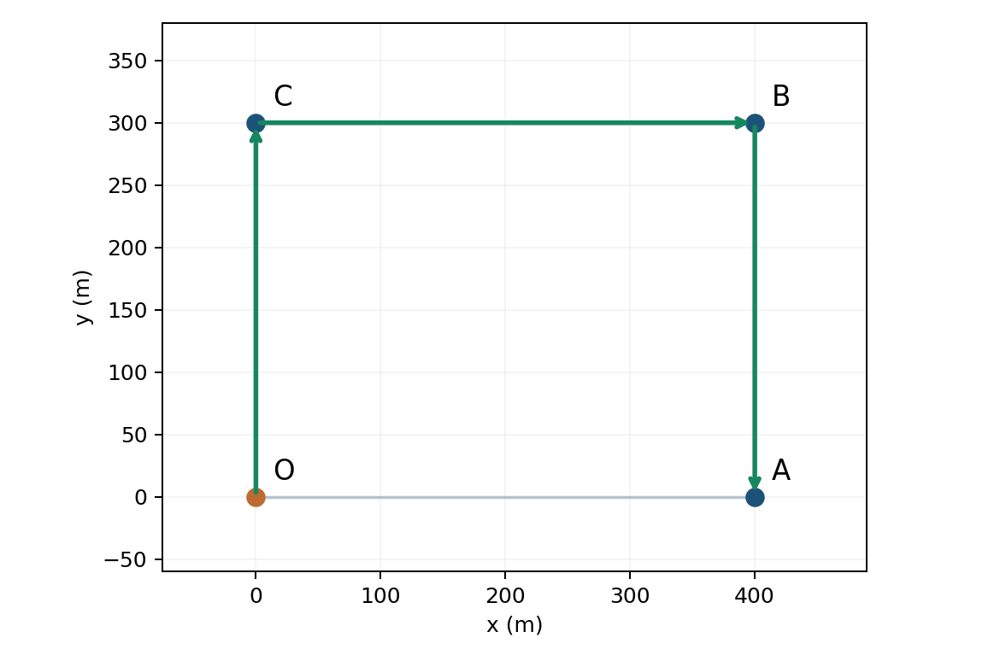
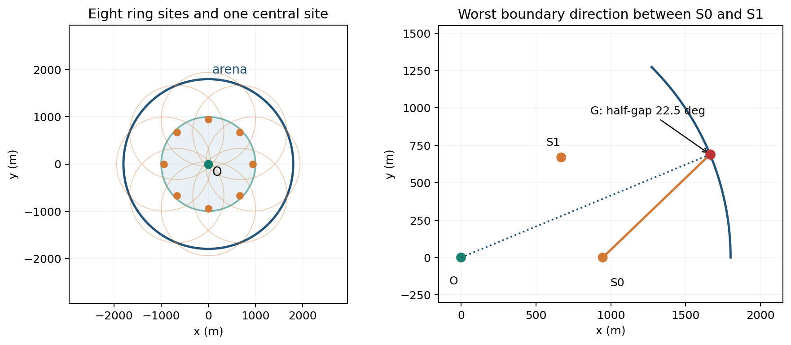

# 第 5 课　路线、在线插入与搜索覆盖

## 5.1　三处都要去，怎样少走路

一名巡查员从园区门口 $O$ 出发，要依次检查 $A$、$B$、$C$ 三处设备。园区内可以直线行走，三项检查都必须完成，检查结束后可以直接离开，不要求返回门口。四个位置的坐标如下，单位都是米：

$$
O=(0,0),\qquad A=(400,0),\qquad B=(400,300),\qquad C=(0,300).
$$



先走到最近的地方，整段路就最短吗？要回答这个问题，先把“怎样走”写成一个可以比较答案的数学问题。

### 把走路顺序写成变量

用 $d(P,Q)$ 表示两点 $P$、$Q$ 之间的直线距离。若 $P=(x_P,y_P)$、$Q=(x_Q,y_Q)$，则

$$
d(P,Q)=\sqrt{(x_P-x_Q)^2+(y_P-y_Q)^2}.
$$

因此，矩形的横边长 400 m，竖边长 300 m，两条对角线都长 $\sqrt{400^2+300^2}=500$ m。例如 $d(O,B)=500$，而 $d(A,B)=300$。

这道题中，坐标和距离已经给定，真正需要选择的是访问顺序。把第一、第二、第三个访问点分别记为 $\pi_1,\pi_2,\pi_3$。这些需要由我们选择的量叫作**决策变量**。例如 $(\pi_1,\pi_2,\pi_3)=(A,B,C)$，表示走 $O\to A\to B\to C$。

一个答案必须满足的要求叫作**约束**。这里每个 $\pi_j$ 都必须从 $A,B,C$ 中选，而且三个选择不能重复。三个位置、三个互不重复的选择，正好保证每处检查一次。

路线总长就是要比较的数值，称为**目标函数**。我们希望它尽可能小，于是得到模型

$$
\begin{aligned}
\min\quad
&L=d(O,\pi_1)+d(\pi_1,\pi_2)+d(\pi_2,\pi_3),\\
\text{满足}\quad
&\pi_1,\pi_2,\pi_3\in\{A,B,C\},\\
&\pi_1,\pi_2,\pi_3\text{ 两两不同}.
\end{aligned}
\tag{5.1}
$$

符号 $\min$ 表示“在所有满足约束的选择中，寻找最小值”。满足约束的路线叫作**可行路线**；在可行路线中总长最小的，才叫作**最优路线**。

这里没有 $d(\pi_3,O)$ 这一项，因为题目不要求回到门口。这种有起点、终点不必回到起点的路线叫作**开放路径**。如果要求返回，就要把末点到 $O$ 的距离加进目标函数，形成闭合巡回。通常所说的旅行商问题，研究的是访问给定地点的最短巡回；本例先采用更接近后面搜索任务的开放路径。

### 三个地点可以把所有顺序算完

第一处有 3 种选择，第二处剩 2 种，第三处只剩 1 种，所以共有 $3\times2\times1=6$ 种顺序。逐个计算即可得到精确答案：

| 路线 | 各段距离之和 / m | 总长 / m |
|---|---|---:|
| $O\to A\to B\to C$ | $400+300+400$ | 1100 |
| $O\to A\to C\to B$ | $400+500+400$ | 1300 |
| $O\to B\to A\to C$ | $500+300+500$ | 1300 |
| $O\to B\to C\to A$ | $500+400+500$ | 1400 |
| $O\to C\to A\to B$ | $300+500+300$ | 1100 |
| $O\to C\to B\to A$ | $300+400+300$ | 1000 |

最短路线是 $O\to C\to B\to A$，总长为 1000 m。这里能够说“最短”，是因为六种可能性都比较过了。

这个例子里，每次走向最近的未访地点，也恰好得到 $O\to C\to B\to A$。但“恰好算对这一题”和“所有题都能这样算”是两回事。每一步只在当前几个选择中比较，称为作出局部选择。接下来换一种常用的路线构造方法，看看局部选择和整条路线的最优值有什么关系。

## 5.2　把一个地点插到已有路线里

假设巡查清单最初只有 $A,B$，已经排成了 $O\to A\to B$。后来清单补上 $C$，我们希望保留原来 $A$ 在 $B$ 之前的顺序，把 $C$ 插进去。

这种做法称为**插入法**：先有一条路线，再把新地点放进路线的某个位置。为了知道哪个位置更合算，要先算一次插入究竟增加多少路程。

### 插入增量为什么要减去原来的一段

设旧路线中有一段 $a\to b$，准备把新地点 $x$ 放在中间。旧的这一段长 $d(a,b)$；改成 $a\to x\to b$ 后，这部分长 $d(a,x)+d(x,b)$。路线的其他部分没有变化，相减时全部抵消。因此增加的路程是

$$
\boxed{\Delta(a,x,b)=d(a,x)+d(x,b)-d(a,b).}
\tag{5.2}
$$

$\Delta$ 读作“增量”，这里表示“新路线总长减去旧路线总长”。减去 $d(a,b)$ 很重要：这段原本就要走，不能再当成新任务带来的额外路程。

直线距离满足**三角不等式**：绕经一点的两段路不会比直接走更短，即 $d(a,x)+d(x,b)\ge d(a,b)$。所以本课的插入增量不会是负数。

开放路径还有一个特殊位置：末尾。如果旧路线停在 $b$，把 $x$ 追加为终点，只增加 $d(b,x)$，因为后面没有一段原路需要替换。起点 $O$ 则固定不变，不能把新地点插到出发之前。

### 一遍完整的插入计算

旧路线 $O\to A\to B$ 长 $400+300=700$ m。插入 $C$ 共有三个位置：

| 插入位置 | 增加的路程 / m | 新路线 | 新路线总长 / m |
|---|---:|---|---:|
| $O$ 与 $A$ 之间 | $300+500-400=400$ | $O\to C\to A\to B$ | 1100 |
| $A$ 与 $B$ 之间 | $500+400-300=600$ | $O\to A\to C\to B$ | 1300 |
| 追加到 $B$ 之后 | $d(B,C)=400$ | $O\to A\to B\to C$ | 1100 |

两个位置并列最小。若事先约定并列时选靠前的位置，就得到 $O\to C\to A\to B$，总长 1100 m。

现在回看上一节：全局最短路线长 1000 m，而且其中 $B$ 在 $A$ 之前。本次插入始终保留 $A$ 在 $B$ 之前，因此不会产生那条路线。我们已经找到了**给定旧顺序时的最佳插入位置**，但仍比允许重新排序的最优路线多走 100 m。

### 怎样用插入法逐步构造路线

如果地点按照 $A,B,C$ 的顺序进入清单，可以这样计算：

1. 从只含起点的路线开始，先得到 $O\to A$。
2. 每读入一个新地点，比较它插入各段之间的增量，同时比较末尾追加的增量。
3. 选择增量最小的位置；若并列，按约定选靠前的位置。
4. 更新路线，再处理下一个地点。

例如插入 $B$ 时，放在 $O,A$ 之间增加 $500+300-400=400$ m，追加在 $A$ 后只增加 300 m，所以先得到 $O\to A\to B$。随后插入 $C$，就得到刚才的三行计算表。

为什么采用一个可能多走路的方法？因为它计算简单。已有 $k$ 个待访地点时，一个新地点只需比较 $k+1$ 个插入位置；如果把所有 $k+1$ 个地点重新排列，则有 $(k+1)!$ 种顺序。这里的阶乘 $n!=n(n-1)\cdots1$ 表示逐项相乘，例如 $10!=3628800$。地点增多后，逐个枚举会迅速变重。

这种用简单规则较快构造可行答案、但一般不保证全局最优的方法，叫作**启发式方法**。使用它的理由是希望在计算量和路线质量之间作出合适取舍。前面的 1100 m 与 1000 m 已经给出了本例中取舍的实际代价。

## 5.3　人已经出发后，新任务怎样加入

前两节中，路线都还可以在纸上修改。现在巡查员已经走出门口，途中才收到新的报修消息。已经走过的路不能撤销，未来还会出现什么任务也不知道。只根据当前已知信息作出下一步选择，这样的决策称为**在线决策**。

设巡查员当前在 $p$，原计划下一站是 $s$，刚发现一项任务位于 $c$。这时有两个直接的选择：

- 继续按原计划走 $p\to s$，暂时保留新任务；
- 先处理新任务，按 $p\to c\to s$ 的方向绕行。

第二个选择的额外路程仍可用式 (5.2)：

$$
\Delta=d(p,c)+d(c,s)-d(p,s).
$$

区别在于，现在比较的是从**当前位置**出发的下一段行程。较早经过的站点已经成为历史，不参加这次重排。

例如 $p=(0,0)$、$s=(400,0)$，新任务在 $c=(200,150)$。两段绕行都长 $\sqrt{200^2+150^2}=250$ m，而原路长 400 m，因此

$$
\Delta=250+250-400=100\ \mathrm m.
$$

若我们规定“多走不超过 150 m 就现在处理”，就会插入这项任务。150 m 是策略选择的门槛；距离公式本身不会告诉我们应当选 150 m 还是其他数值。

### 位置还不确定时，为什么评分里会出现半径

报修消息有时只说明设备在某个小区域内。用圆心 $c_i$、半径 $r_i$ 的圆把任务 $i$ 的所有可能位置包住，称为这个位置区域的**包围圆**。半径越大，表示我们还不能把任务位置确定得很准。例如 $r_i=20$ m，表示目标仍可能在圆心周围 20 m 内的某处。

绕经圆心的增量可以计算，但到达圆心后可能还要继续寻找。为了让位置较确定的任务得到更多优先考虑，可以采用评分

$$
H_i=
\underbrace{d(p,c_i)+d(c_i,s)-d(p,s)}_{\text{绕经估计圆心的路程增量}}
+\lambda r_i.
\tag{5.3}
$$

其中 $\lambda\ge0$ 是我们选定的权重。$\lambda=1$ 时，半径每增加 1 m，评分也增加 1 m。这个加项表达一种偏好：在绕行相近时，优先处理较容易定位的任务。它没有声称实际服务一定恰好再走 $\lambda r_i$ 米。

设当前已发现且尚未完成的任务组成集合 $\mathcal J$。具体规则是：先计算每个 $i\in\mathcal J$ 的 $H_i$，选评分最小的一个；如果它不超过门槛 $h$，就先服务它，否则继续去下一巡查站。$\mathcal J$ 里只放已经知道的任务，未来任务不能提前参加比较。

沿用刚才的坐标，若 $r=20$ m、$\lambda=1$，则评分为 $100+20=120$ m。门槛为 100 m 时继续巡查，门槛为 150 m 时先服务。两种选择用的是同一个几何增量，改变的是行动规则。

一次服务完成后，巡查员的真实位置、剩余任务和位置估计可能都变了，应重新计算评分。于是在线过程是“观察—选择—行动—再观察”。这条规则给出了当前可执行的决定；若要证明它对未知未来也最优，还需要未来任务的分布或其他明确条件。

如果基础巡查已经结束，就没有下一站 $s$，也不能继续套用含 $d(c_i,s)$ 的式子。此时应当另定收尾规则，例如按 $d(p,c_i)+\lambda r_i$ 选择下一个剩余任务。

## 5.4　目标在哪里都不知道时，先解决覆盖

路线模型有一个容易忽略的前提：我们知道要访问哪些地点。搜索任务却可能连目标在哪里都不知道。此时先要回答：“在什么地方检测，才能保证不漏掉目标？”

### 从一条走廊理解“覆盖”

一条走廊用数轴区间 $[0,100]$ 表示，目标可能在其中任何一点。检测器在一个站位能接收到左右 30 m 内的目标。如果在 20 m 处检测，它在走廊内能检查的范围是 $[0,50]$；在 80 m 处检测，能检查的范围是 $[50,100]$。两个范围接起来，整条走廊都被检查到了。

这里的**覆盖**是指：每一个可能的目标位置，至少落在一个检测站的接收范围内。写成集合关系就是

$$
[0,100]\subseteq[0,50]\cup[50,100].
$$

符号 $\cup$ 表示把两个范围合在一起；$\subseteq$ 表示左边的每一点都在右边。覆盖允许重叠，重要的是不能留下空隙。

两个站够不够少？一个站最多检查 60 m 长的走廊，覆盖不了 100 m，所以至少需要两个站。刚才已经构造出两个站的可行方案，因而这个小问题的最少站数正好是 2。

如果接收距离改成 20 m，仍站在 20、80 m 处，则只能覆盖 $[0,40]$ 和 $[60,100]$。走廊两端都检查到了，中间却漏掉了 $(40,60)$。可见检查几个代表点，并不能自动证明所有位置都已覆盖。

### 从接收区间走到接收圆盘

在平面上，接收距离为 $r_0$ 的站位 $s$ 能检测的区域，是以 $s$ 为圆心、半径 $r_0$ 的圆盘：

$$
B(s,r_0)=\{g:d(g,s)\le r_0\}.
$$

这里 $g$ 表示一个可能的目标位置。用 $\Omega$ 表示目标可能出现的整个区域，用 $S$ 表示选定的检测站位集合，则覆盖要求为

$$
\boxed{\Omega\subseteq\bigcup_{s\in S}B(s,r_0).}
\tag{5.4}
$$

$\bigcup_{s\in S}$ 的意思是把所有选中站位的接收圆盘合起来。式 (5.4) 要求，对任意 $g\in\Omega$，总能找到至少一个站位 $s$，使 $d(g,s)\le r_0$。这里的“任意”包括圆盘之间的细小缝隙，不能只用有限网格上的检测结果代替它。

如果站位只能从事先给定的 $s_1,\ldots,s_m$ 中选，而且我们想让站数最少，还可以给每个候选站设置一个开关变量：$x_j=1$ 表示选它，$x_j=0$ 表示不选。模型就是

$$
\begin{aligned}
\min\quad &\sum_{j=1}^{m}x_j,\\
\text{满足}\quad
&\sum_{\{j:\ d(g,s_j)\le r_0\}}x_j\ge1
\qquad\text{对每个 }g\in\Omega,\\
&x_j\in\{0,1\}\qquad(j=1,\ldots,m).
\end{aligned}
\tag{5.5}
$$

约束中的求和只数“能接收到位置 $g$ 的那些站”。它们至少要有一个被选中。若不同站的固定检测成本为 $c_j$，目标也可以改成 $\sum_j c_jx_j$。

这就是**集合覆盖模型**在检测站选择中的形式。它的决策是选哪些站；选定站之后，访问先后仍要用路线模型安排。

## 5.5　练习：把公式再用一遍

### 练习 5.1　改变旧路线

仍用园区的四个坐标。旧路线现在是 $O\to C\to B$，请把 $A$ 插入其中。

1. 列出全部插入位置，分别计算增加的路程。
2. 写出选中的路线和总长。
3. 这次结果是否恰好全局最优？你的依据是什么？

### 练习 5.2　走廊中间的空隙

走廊仍是 $[0,100]$，接收距离改为 20 m。已在 20 m 和 80 m 处设置两个检测站。

1. 是否已经覆盖整条走廊？
2. 在 50 m 处增加一站是否足够？
3. 无论怎样选站，两个检测站有没有可能覆盖全走廊？

### 练习 5.1 的详细解答

旧路线长 $300+400=700$ m。固定起点后，仍有两个中间位置和一个末尾位置：

| 插入位置 | 增量 / m | 新路线总长 / m |
|---|---:|---:|
| $O,C$ 之间 | $d(O,A)+d(A,C)-d(O,C)=400+500-300=600$ | 1300 |
| $C,B$ 之间 | $d(C,A)+d(A,B)-d(C,B)=500+300-400=400$ | 1100 |
| 追加到 $B$ 后 | $d(B,A)=300$ | 1000 |

最小增量为 300 m，应选 $O\to C\to B\to A$。它恰好是全局最优，因为 5.1 节已经枚举所有六种顺序，最小值就是 1000 m。仅凭这张插入表，我们能直接证明的是“保留 $C$ 在 $B$ 之前时，本次插入最合算”。

### 练习 5.2 的详细解答

前两个站在走廊内的接收范围分别为 $[0,40]$、$[60,100]$，所以中间的 $(40,60)$ 没有覆盖。50 m 处的新站覆盖 $[30,70]$，它与左右两个区间都有重叠，三者的并集为 $[0,100]$，因此三站足够。

每个站最多覆盖 40 m，两个站合起来最多覆盖 80 m；有重叠时还会更少。因此两个站不可能覆盖 100 m 的全走廊。三站方案可行，而两站不可能，所以最少站数为 3。这与路线练习中的精确枚举一样，都是先找到可行答案，再说明更好的答案为什么不可能。

## 5.6　B 题练习：机器人这一轮先做什么

在 B 题的 Q3、Q4 中，干扰源的位置未知。机器人按频道检测，可以把频道理解为接收机选择的台号。发现源后，把与已有读数相容、目前尚不能排除的位置合在一起，称为该源的**候选区域**。机器人继续测量以缩小这个区域，最后执行清除。这里把对一个已发现源的后续定位和清除合称为**服务**。服务可能包含多次动作，所以其结束位置未必等于估计圆心。

### 练习 5.3　题目

设当前有两个已经发现、尚未清除的频道 A、B。它们的候选位置分别被下面两个圆包住：

$$
\begin{aligned}
p&=(0,0),& s&=(800,0),\\
c_A&=(400,300),&r_A&=100,\\
c_B&=(400,0),&r_B&=500.
\end{aligned}
$$

全部坐标和半径的单位均为 m。采用代码默认的半径权重 $\lambda=1$，有下一站时的插入门槛为 $h=600$ m。

**问题。**

1. 分别计算两个频道的绕行增量与评分，本轮应先服务哪个频道？
2. 如果只把 $r_A,r_B$ 改成 450、700 m，本轮应当怎样行动？
3. 回到原来的两个半径。如果基础巡查已经完成，没有下一站，按 $d(p,c_i)+r_i$ 应先处理谁？还要用 600 m 门槛吗？
4. 第一问选中一个频道后，是否已经可以直接清除它？
5. 某段实际执行共行走 2500 m，测向 10 次，切换频道 4 次，成功清除 2 次，没有失败清除。这段执行的总时间是多少？

### 练习 5.3 的详细解答

#### 第一步：把距离和评分分开算

对于 A，由勾股定理，

$$
d(p,c_A)=d(c_A,s)=\sqrt{400^2+300^2}=500.
$$

原来直接去下一站的距离为 $d(p,s)=800$，所以

$$
\Delta_A=500+500-800=200,\qquad H_A=200+100=300.
$$

对于 B，圆心正好在原路中间，两段距离都是 400 m，因此

$$
\Delta_B=400+400-800=0,\qquad H_B=0+500=500.
$$

A 的评分 300 m 小于 B 的 500 m，且 $300\le600$，所以先服务 A。虽然 B 的圆心更顺路，但它的位置范围大得多；本规则把这部分不确定性也计入了比较。

若半径改为 450、700 m，几何距离不变，因此 $H_A=200+450=650$、$H_B=0+700=700$。最小评分仍来自 A，但 $650>600$，所以这一轮继续去下一巡查站，并保留两个服务任务。

#### 第二步：没有下一站时改用收尾规则

使用原来的半径，A 的收尾评分是 $500+100=600$ m，B 的收尾评分是 $400+500=900$ m，所以仍选 A。

Q3、Q4 在“没有下一站”的分支中都不再使用 600 m 插入门槛。原因很直接：此时已经没有一个巡查站可供“继续前往”，应从剩余已发现任务中选择下一项服务。即使所有收尾评分都超过 600 m，也不能因此一直搁置它们。

#### 第三步：选择服务对象，还需要继续定位

第一问给出的半径为 100 m 和 500 m，都不足以仅凭包围圆保证 20 m 内清除。因此选中 A 后，机器人还需要获得信息、缩小位置区域，再选择有距离保证的清除点。

例如已知真源 $g$ 位于 $B(c,r)$ 中，要在点 $q$ 发出清除指令，三角不等式给出

$$
d(q,g)\le d(q,c)+r.
$$

程序在这个上界不超过 19.8 m 时使用认证清除，给题目的 20 m 阈值留出余量。插入评分的作用是决定服务先后；是否可以清除，要再检查上述距离条件。下一课将推导怎样更新候选区域以及怎样选择 $q$。

#### 第四步：用实际动作计算时间

按本地模拟器的记账规则，移动速度为 5 m/s，每次测向耗时 5 s，切换频道另加 1 s，成功清除耗时 5 s，失败清除耗时 3 s。若总行程为 $L$，这些动作次数依次记为 $N_m,N_s,N_+,N_-$，则

$$
T=\frac L5+5N_m+N_s+5N_++3N_-.
\tag{5.6}
$$

代入题中数字，

$$
T=\frac{2500}{5}+5\times10+4+5\times2+3\times0
=564\ \mathrm s.
$$

这也说明为什么不能只用插入评分评价整段执行：它只估计当前一次绕行的代价，实际总时间还包括后续的移动、测向、换台和清除。

## 5.7　B 题练习：Q3 的九个站为什么能找齐

Q3 中，源可能位于以原点为中心、半径 1800 m 的圆域内。源是全向的，也就是在接收距离以内，从哪一侧检测都可以收到信号。每个源的有效接收半径至少为 1000 m。程序用稍小的 $r_0=999$ m 作覆盖计算，留出数值余量。

基础方案是在原点检测一次，再访问八个沿圆周等角分布的站位。八站的角间隔是 $360^\circ/8=45^\circ$。但是，“有中心站，外面又围了一圈”并不能代替证明。

**问题。** 外环半径应该怎样选择？为什么这九个站可以覆盖所有连续位置？如果把外环半径随意改成 3000 m，还能保证覆盖吗？

### 先找最容易漏掉的方向

设外环半径为 $a$，八个站位为

$$
s_k=a\bigl(\cos(k\pi/4),\sin(k\pi/4)\bigr),
\qquad k=0,\ldots,7.
$$



$\pi/4$ 对应 $45^\circ$。任取一个目标位置 $g$，从八个环站中选一个与它方位最接近的站。目标恰在相邻两站方向的正中间时，夹角最大，为 $22.5^\circ=\pi/8$。

先考虑目标在区域最外边界上，即它离原点 1800 m。记 $\alpha=\pi/8$。由余弦定理，边界中间方向到相邻环站的距离平方为

$$
1800^2+a^2-2(1800)a\cos\alpha.
$$

代码先把这个距离设为 995 m，得到关于 $a$ 的二次方程：

$$
a^2-2(1800)\cos\alpha\,a+1800^2-995^2=0.
$$

用二次方程求根公式，两个根为

$$
a=1800\cos\alpha
\ \pm\sqrt{995^2-(1800\sin\alpha)^2}.
$$

程序选择较小的根，再增加 1 m，实际使用

$$
a=1800\cos(\pi/8)
-\sqrt{995^2-[1800\sin(\pi/8)]^2}+1
\approx945.9734\ \mathrm m.
\tag{5.7}
$$

这里 995 m 是构造站位时选用的距离，999 m 是之后检查覆盖的保守接收半径。它们承担不同作用。

### 再检查从中心到边界的所有位置

只检查目标圆的外边界还不够，圆内也可能留下空隙。令目标到原点的距离为 $\rho$。中心站已经覆盖 $\rho\le999$ m 的位置，所以剩下只需检查

$$
999\le\rho\le1800.
$$

目标与最近环站的夹角不超过 $\alpha$。夹角越小，在同样的两条半径下两点越近，因此余弦定理给出

$$
d(g,s_k)^2\le
f(\rho)=\rho^2+a^2-2\rho a\cos\alpha.
\tag{5.8}
$$

$f(\rho)$ 是开口向上的二次函数。它在一个闭区间上的最大值出现在某个端点：图像先下降再上升，中间不会鼓起得比两端还高。因此，只要区间两端的距离上界都不超过 999 m，中间的所有位置也都满足要求。

代入式 (5.7) 的 $a$，得到

$$
\sqrt{f(999)}\approx382.9931\ \mathrm m,\qquad
\sqrt{f(1800)}\approx994.2786\ \mathrm m.
$$

两者都小于 999 m，所以整个 $999\le\rho\le1800$ 的环形区域被八个环站覆盖。再加上中心站覆盖的圆盘，就得到了完整的式 (5.4)。这是一条对所有连续位置都成立的证明，没有把位置先取成有限网格。

### 半径改成 3000 m 会怎样

取目标位于边界，并且方位处在两个相邻环站的正中间。它到最近环站的距离为

$$
\sqrt{1800^2+3000^2-2(1800)(3000)\cos(\pi/8)}
\approx1504.0283\ \mathrm m,
$$

大于 999 m；到中心站的距离又是 1800 m。于是这个位置没有落入任何一个保证接收圆盘中。九个站的数量没有变，覆盖却已经失效。

### 计划覆盖怎样变成“已经找齐”

上述证明给出了满足覆盖要求的站位，并没有证明它们是站数最少或行程最短的方案。执行中还要保证每个仍未知的频道确实在相应站位测过。仅把九个坐标存进数组，并不会产生观测。

在 `source/Q3/q3_local_solver.py` 中，`Config.ring_m=8` 指定八个环站；`run` 先调用 `_scan((0.,0.))`，然后 `_make_plan` 调用 `ring_sites(self.cfg.ring_m,...)` 生成环站。注意 `ring_sites` 的函数签名虽写着默认值 7，但正式默认策略显式传入的是配置中的 8。

`_scan` 在当前站逐个检测仍为 `UNKNOWN` 的频道，并把完成的站位记录在 `self.scans` 中。`covers_arena` 检查这些已扫站位是否覆盖目标圆域：它既检查目标圆的外边界，也检查接收圆周位于目标域内的弧是否被其他接收圆盘盖住，从而排查内部空隙。具体做法是把一圈的方向角当作一个区间，记录哪些角度已被其他圆盘覆盖，再检查是否留下角度空档；这称为圆弧区间检查。

`_certify_and_prune` 有两个结束未知频道搜索的条件：已经发现或清除 16 个源，达到题设源数上界；或者已扫站位通过覆盖检查。满足其中之一，才把剩余的 `UNKNOWN` 改成 `ABSENT`，即“可以判定没有未发现的源”。默认 `prune=False`，不会执行函数中保留的站点删减分支；默认 `rotate=False`，也不会转动基础环站。

## 5.8　从手算评分读到 Q3、Q4 的代码

打开 `source/Q3/q3_local_solver.py` 的 `Strategy._choose`（454–468 行），先看有下一站的默认分支：

```python
t = self.tracks[i]
c, r = t.center, t.radius
detour = dist(self.p, c) + dist(c, next_site) - dist(self.p, next_site)
score = detour + 1.0 * r
values.append((score, i))
```

这些量与本课公式逐项对应：

| 课文中的量 | 代码中的量 | 在这一轮的含义 |
|---|---|---|
| $p$ | `self.p` | 当前实际位置 |
| $s$ | `next_site` | 原计划下一检测站 |
| $c_i,r_i$ | `t.center,t.radius` | 该频道候选区域的包围圆 |
| $\Delta_i$ | `detour` | 假设绕经圆心的新增路程 |
| $H_i$ | `score` | 绕行增量加半径 |
| $h=600$ m | `self.cfg.insert_m` | 有下一站时的服务门槛 |

在循环开始处，`found` 只收集状态为 `FOUND` 的频道，这就是当前可服务的任务集合。循环后 `min(values)` 从 `(score,i)` 中选出最小项；评分相同则选频道编号较小的一个。接下来的

```python
return i if score <= self.cfg.insert_m else None
```

表示评分不超过门槛才返回该频道，否则返回 `None`。在 `run`（470–498 行）中，返回频道时调用 `_serve`；返回 `None` 且仍有下一站时，就取出下一站并调用 `_scan`。服务或扫描之后，程序重新读取当前位置和频道状态，进入下一轮。

没有下一站时，`_choose` 的前面已经改用 `dist(self.p,center)+radius` 选择任务，不走上述门槛判断。5.6 节第三问对应的就是这个分支。源码还保留 `sequential`、`deferred` 等比较模式；本课的计算对应 `Config()` 默认的 `mode='integrated'`。

### Q4 采用相同评分，但搜索站位不同

在 `source/Q4/q4_local_solver.py` 的 `_choose_insert`（179–187 行），有下一站时同样计算

```python
score = dist(self.p, t.center) + dist(t.center, next_site) \
        - dist(self.p, next_site) + t.radius
```

门槛也为 600 m。没有下一站时同样改用 `dist(self.p,t.center)+t.radius`，并直接选择评分最小的已发现频道。`run`（188–206 行）据此调用 `_service` 或 `_scan_site`。因此，5.6 节的数值练习也适用于 Q4 的这一轮调度。

Q4 的覆盖部分需要新的几何条件。有些源只向前方半圆发射；即使站位离源足够近，处在背面也可能没有信号。所以仅证明接收圆盘的并集覆盖目标区域，还不足以保证找齐。

`coverage_route`（85–89 行）给出 25 个站：原点、半径 995 m 的八个内环站，以及半径 1838 m 的十六个外环站。内环按 `k=0,...,7` 的次序访问；外环的索引顺序为 `14,15,0,1,...,13`。外环略超出半径 1800 m 的目标位置域，表示设备可以到目标域外侧观测。

Q4 的 `_finish_unknown_if_possible`（131–139 行）在达到 16 个已知源，或走完这条预置覆盖路线时结束未知频道搜索；它没有调用 Q3 的 `covers_arena`。这条路线为什么能够应对源的未知朝向，需要检查站位相对源的方向和距离，第 7 课会专门推导。

两份程序都把插入公式用于“当前先服务谁”的选择。它们沿基础搜索路线执行，并随新观测不断更新任务；服务过程还会继续测向和移动。理解到这里，就能把代码中的 `detour` 还原成两条新边减一条旧边，也能说明为什么这一步没有求解一个预先给定全部城市的通用最短巡回问题。
