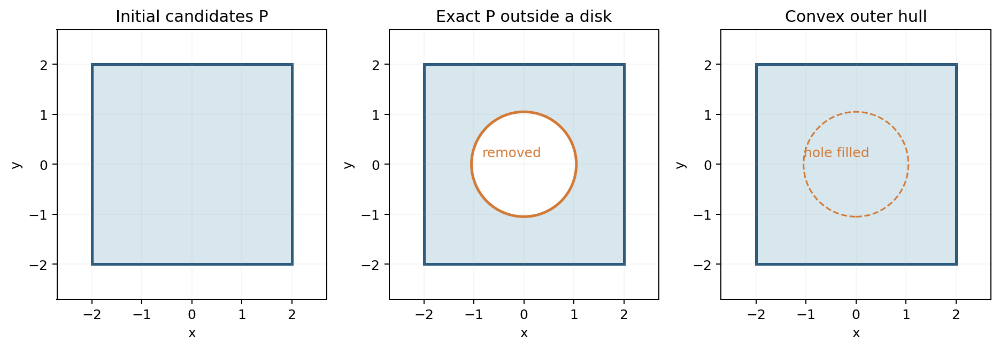
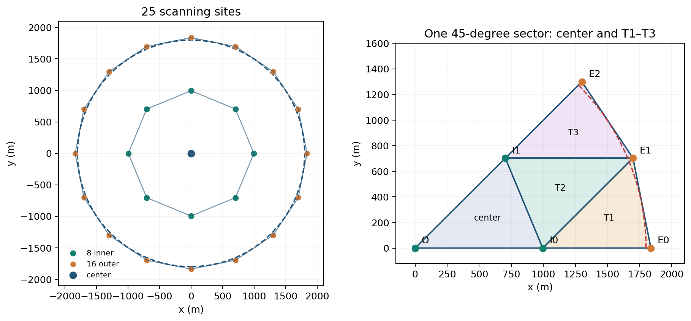

# 第 6 课　有界误差下的集合定位

测量有误差时，一个读数通常不能确定唯一真值。例如温度计显示 4，而它最多偏差 1，我们首先得到的不是“真值就是 4”，而是“真值只能落在某个范围里”。再测一次，就是再增加一个条件。

本课从一个整数读数例子开始，依次回答三个问题：哪些真值能解释读数？新读数怎样缩小范围？范围缩小到什么程度，才足以支持一次安全动作？

## 6.1　先算一次读数：4 可能从哪里来

设一个传感器测量固定的整数状态，例如一台设备的整数档位。用 $x$ 表示真实档位，用 $y$ 表示显示的读数。

**已知：**真实档位是 $0$ 到 $7$ 之间的整数，这次显示 $y=4$。**未知：**真实档位 $x$ 和本次测量误差。**条件：**误差只能是 $-1,0,1$，且“读数＝真值＋误差”。**求：**哪些真实档位能产生读数 4？

把本次误差记成 $\psi$，观测关系就是

\[
y=x+\psi,\qquad \psi\in\{-1,0,1\}.
\]

因为已经看到了 $y=4$，所以反过来计算 $x=4-\psi$：

| 假设本次误差 $\psi$ | 真值 $x=4-\psi$ | 代回检查 |
|---:|---:|---|
| $-1$ | $5$ | $5+(-1)=4$ |
| $0$ | $4$ | $4+0=4$ |
| $1$ | $3$ | $3+1=4$ |

**结论：**真值只能是 $3,4,5$。我们暂时不能区分这三个数，但可以排除 $0,1,2,6,7$。例如，若真值是 2，读数要变成 4 就需要误差 2，超过了允许范围。

这里“最多偏差 1”是一个确定的条件。它没有说三种误差等概率，也没有说多次测量的误差会互相抵消。有界误差模型的整数例子可见 LaValle 的 *Planning Algorithms*；本课的读数和计算序列是教学算例。[6-1]

## 6.2　给刚才的集合一个名字

与一条观测**相容**，就是存在某个允许的误差，使这个候选真值能够产生已经看到的读数。把所有这样的候选真值放在一起，得到这条观测的**相容集合**。

用 $H(y)$ 表示读数 $y$ 的相容集合。对于刚才的传感器，

\[
\begin{aligned}
x\in H(y)
&\Longleftrightarrow
\text{存在 }\psi\in\{-1,0,1\}\text{，使 }y=x+\psi\\
&\Longleftrightarrow
x\in\{y-1,y,y+1\}.
\end{aligned}
\]

因此 $H(4)=\{3,4,5\}$。这里的 $H(4)$ 只使用了“这次读到 4”这一条信息，还没有合并更早的读数。

“存在一个允许的误差”是关键。例如，候选值 $x=3$ 只需用误差 $\psi=1$ 就能解释读数 4，因此可以保留。我们并不要求它在所有误差下都显示 4。

若状态和误差都是实数，计算方式相同。已知 $y=x+\psi$、$|\psi|\le1$，则

\[
-1\le y-x\le1
\quad\Longleftrightarrow\quad
y-1\le x\le y+1,
\]

所以相容集合变成区间 $H(y)=[y-1,y+1]$。整数模型保留几个点，实数模型保留一段区间；两者都在回答“哪些真值能解释这条读数”。

## 6.3　再测两次：同时成立的条件取交集

**已知：**初始档位属于 $\{0,1,2,3,4,5,6,7\}$，连续三次读数为 $4,5,6$。**未知：**同一个真实档位。**条件：**三次测量期间档位没有改变，每次误差仍属于 $\{-1,0,1\}$。**求：**使用全部读数后，真值还可能是什么？

用 $F_k$ 表示使用前 $k$ 条读数后仍保留的集合，下标 $k$ 是已处理的读数个数。没有读数时，

\[
F_0=\{0,1,2,3,4,5,6,7\}.
\]

第一次读到 4，真值既要在初始集合里，又要能解释读数 4，因此

\[
F_1=F_0\cap H(4)=\{3,4,5\}.
\]

第二次读到 5，本次允许 $\{4,5,6\}$。真值必须同时解释两次读数，所以

\[
F_2=F_1\cap H(5)
=\{3,4,5\}\cap\{4,5,6\}
=\{4,5\}.
\]

第三次读到 6，同理得到

\[
F_3=F_2\cap H(6)
=\{4,5\}\cap\{5,6,7\}
=\{5\}.
\]

**结论：**在题给条件下，真实档位只能是 5。代回检查，三次误差依次为 $-1,0,1$，都在允许范围内。

| 已处理读数 | 本次相容集合 | 合并全部已有信息后的集合 |
|---|---|---|
| 无 | 无 | $F_0=\{0,1,2,3,4,5,6,7\}$ |
| $4$ | $H(4)=\{3,4,5\}$ | $F_1=\{3,4,5\}$ |
| $4,5$ | $H(5)=\{4,5,6\}$ | $F_2=\{4,5\}$ |
| $4,5,6$ | $H(6)=\{5,6,7\}$ | $F_3=\{5\}$ |

这三步可以合写成一条更新公式：

\[
\boxed{F_{k+1}=F_k\cap H(y_{k+1}).}
\]

交集里的点必须满足两个条件；并集里的点满足其中一个就够。因此，不能把这里的交集换成并集。例如 3 虽能解释第一次读数，却不能解释第二次读数，第二步就应被删除。

## 6.4　为什么反复取交集不会删掉真值

把实际但未知的真值记为 $x_*$。它与计算中逐一尝试的候选值 $x$ 不同：$x$ 可以有许多个，$x_*$ 只有一个。

**已知：**初始集合含有真值。**未知：**真值具体是哪一个元素。**条件：**状态固定，且每次误差都满足所用的误差界。**结论：**每次更新以后，真值仍在保留的集合里。

证明只用两步。

第一步，在没有处理任何读数时，已知 $x_*\in F_0$。

第二步，假设已经处理 $k$ 条读数后，仍有 $x_*\in F_k$。实际读数 $y_{k+1}$ 确实由真值和一个允许误差产生，所以按照相容集合的定义，$x_*\in H(y_{k+1})$。于是

\[
x_*\in F_k,\quad x_*\in H(y_{k+1})
\quad\Longrightarrow\quad
x_*\in F_k\cap H(y_{k+1})=F_{k+1}.
\]

这就把结论从第 $k$ 步传到了第 $k+1$ 步。从第 0 步开始反复使用，所有步骤都成立。这种在算法每一步都保持成立的性质叫作**不变量**。本课最重要的不变量是

\[
\boxed{x_*\in F_k.}
\]

集合还满足 $F_{k+1}\subseteq F_k$，因为取交集只会删去元素。不过，集合不一定每次都严格变小：同一条条件重复出现，可能没有带来新信息。

如果更新后得到空集 $\varnothing$，含义是“没有任何固定真值能同时解释全部读数”。例如先读 4、5，已经得到 $F_2=\{4,5\}$；随后读到 8，则

\[
F_3=\{4,5\}\cap\{7,8,9\}=\varnothing.
\]

这时应检查状态是否变化、误差是否超界或数据是否有误。空集不是更精确的定位结果，而是当前条件无法同时成立。

## 6.5　复杂集合怎样保存：用简单外包络包住它

精确集合有时很难表示。例如实数状态的剩余集合可能是两段分开的区间：

\[
F=[0,1]\cup[3,4].
\]

用一个区间 $P=[0,4]$ 保存它会方便一些。这个区间多留了 $(1,3)$ 内已经不可能的点，但它没有删掉任何可能的真值。这样的 $P$ 称为 $F$ 的**外包络**，意思是

\[
F\subseteq P.
\]

如果一个集合内任意两点之间的整条线段都还在集合内，这个集合就叫作**凸集合**。区间、圆盘和实心三角形都是凸集合；中间挖了洞的正方形通常不是。

平面中的外包络可以这样看。左图的整个正方形都是旧候选位置；中图根据一条观测排除中间圆盘，白色部分已经不可能；右图用凸集合保存剩余区域，于是把这个洞填回。右图仍包住中图的所有可能位置，所以没有误删真值。图中的坐标只用于展示形状，Q3 的章末应用会给出排除圆盘的具体原因。

在平面中，可以用凸多边形保存外包络。一个集合的**凸包**是包含它的最小凸集合，记为 $\operatorname{conv}(F)$。它会填平凹口，也会把分离部分之间的一些点补进来。

使用外包络后，仍沿用前面的更新逻辑。设精确更新是 $F^+=F\cap H$，程序保存的更新结果是 $P^+$。上标“$+$”表示更新以后。只要满足

\[
P^+\supseteq P\cap H,
\]

就有完整的包含链

\[
x_*\in F^+=F\cap H
\subseteq P\cap H
\subseteq P^+.
\]

**结论：**外包络允许多留一些候选点，仍能保留真值。代价是我们可能需要更多观测，才能把这个稍大的集合缩小到足以行动。

## 6.6　从数轴走到平面：方位读数给出一个角楔

现在把未知整数换成未知位置 $g=(x,y)$。接收器位于已知点 $p$，返回一个方位角 $\widehat\theta$，表示“从接收器看，源大约在这个方向”。

**已知：**检测点 $p$、方位读数 $\widehat\theta$、最大角误差 $\delta$，以及成功接收提供的距离上界 $R$。**未知：**源位置 $g$。**条件：**源与检测点不重合，方位误差不超过 $\delta$，源距检测点不超过 $R$。**求：**一次读数允许的平面位置。

记 $\arg(g-p)$ 为向量 $g-p$ 的方向角。两个方向角的差要沿圆周取最短差，记作 $\operatorname{wrap}$。例如 $359.9^\circ$ 与 $0.1^\circ$ 的最短角差是 $0.2^\circ$。相容集合为

\[
H(p,\widehat\theta)
=\left\{
g:
\left|\operatorname{wrap}\bigl(\arg(g-p)-\widehat\theta\bigr)\right|
\le\delta,\quad
0<\|g-p\|\le R
\right\}.
\]

符号 $\|g-p\|$ 表示两点之间的欧氏距离。这个集合是从 $p$ 出发、左右各张开 $\delta$、长度不超过 $R$ 的扇形。去掉距离限制，剩下的无限延伸部分叫作**角楔**。

为了计算，把坐标轴转到读数方向。定义

\[
u=(\cos\widehat\theta,\sin\widehat\theta),\qquad
v=(-\sin\widehat\theta,\cos\widehat\theta).
\]

$u$ 是沿读数方向的单位向量，$v$ 与它垂直。任意候选点可以写成

\[
g=p+s\,u+t\,v.
\]

其中 $s$ 是沿读数方向走了多远，$t$ 是向侧面偏了多远。设 $0<\delta<90^\circ$，角楔条件等价于

\[
s\ge0,\qquad |t|\le s\tan\delta.
\]

例如 $p=(0,0)$、读数为 $0^\circ$ 时，$u=(1,0)$、$v=(0,1)$，所以 $s=x,t=y$，角楔就是 $x\ge0,\ |y|\le x\tan\delta$。

精确距离条件是 $s^2+t^2\le R^2$。为了沿用多边形裁剪，可以把它放宽成 $s\le R$，得到三角形

\[
T(p,\widehat\theta,R)
=\{p+s\,u+t\,v:0\le s\le R,\ |t|\le s\tan\delta\}.
\]

这个三角形的三个顶点为 $p$、$p+Ru+R\tan\delta\,v$、$p+Ru-R\tan\delta\,v$。扇形完全在它里面，所以

\[
H(p,\widehat\theta)\subseteq T(p,\widehat\theta,R).
\]

一条直线把平面分成两侧，每一侧连同边界称为一个**闭半平面**。上述三角形由两条角边界和一条前端边界围成，可用三个半平面依次裁剪。于是，一维更新公式原样延续到平面：

\[
F^+=F\cap H,\qquad
P^+=P\cap T,\qquad
g_*\in F^+\subseteq P^+.
\]

## 6.7　位置还没变成一个点，为什么也能安全行动

假设需要在源附近执行一个动作，只要动作点距源不超过给定距离就有效。此时未必需要确定源的精确坐标：只要能保证**每一个仍可能的位置**都在动作范围内即可。

先看数轴上的例子。已知真值在 $[8,12]$，若在 $q=10$ 执行的动作能影响左右各 3 个单位，那么任一候选真值到 10 的距离都不超过 2，动作一定有效。

平面里可以用包围圆表达同一件事。设 $B(c,r)=\{g:\|g-c\|\le r\}$ 是圆心为 $c$、半径为 $r$ 的闭圆盘。

**已知：**位置外包络 $P$ 满足 $P\subseteq B(c,r)$。**未知：**真源 $g_*$ 在 $P$ 中的具体位置。**条件：**允许动作距离为 $A$，且 $r\le A$。**求：**哪些动作点 $q$ 一定有效？

如果选择 $\|q-c\|\le A-r$ 的点，那么对于任意候选源 $g\in P$，都可以经由圆心 $c$ 来估计距离。“直接从 $q$ 到 $g$ 的距离，不超过经 $c$ 绕行的距离”就是这里使用的**三角不等式**：

\[
\|q-g\|
\le\|q-c\|+\|c-g\|
\le(A-r)+r=A.
\]

**结论：**圆盘 $B(c,A-r)$ 中的每个点都是有保证的动作点。这种由不等式给出的保证称为**证书**；这里的证书是一条适用于全部候选源的距离上界。

若当前位置为 $p$，令 $d=\|p-c\|$。当 $d\le A-r$ 时，留在当前位置即可；否则，在从 $c$ 指向 $p$ 的射线上取

\[
q=c+\frac{A-r}{d}(p-c).
\]

这是安全小圆盘中离当前位置最近的点，所需移动距离为 $d-(A-r)$。

例如取 $A=19.8$ m、$r=12$ m、$c=(0,0)$、$p=(100,0)$，安全小圆盘半径为 $7.8$ m。最近动作点是 $q=(7.8,0)$，只需移动 $100-7.8=92.2$ m。所有候选源距这个点都不超过 $7.8+12=19.8$ m。

现在，整条推导已经连起来：

\[
\boxed{
\text{读数}
\ \Longrightarrow\ H
\ \Longrightarrow\ F^+=F\cap H
\ \subseteq P^+
\ \subseteq B(c,r)
\ \Longrightarrow\ \text{保证有效的动作点}.
}
\]

## 6.8　课内习题与详细解答

### 练习 6A：重复读数

整数传感器的误差仍属于 $\{-1,0,1\}$，初始集合为 $\{0,1,\ldots,7\}$。三次读数都是 4。求最终集合，并说明重复测量是否一定缩小集合。

**解答。**每次相容集合都是 $H(4)=\{3,4,5\}$。第一次更新得到 $F_1=\{3,4,5\}$，第二、三次得到

\[
F_2=F_1\cap H(4)=F_1,\qquad
F_3=F_2\cap H(4)=F_2.
\]

所以最终仍为 $\{3,4,5\}$。重复读数增加了测量次数，但在这个确定误差界模型下，没有增加新的集合约束。

### 练习 6B：从离散集合换成区间

状态为固定实数，每次误差在 $[-1,1]$ 内。初始范围为 $[0,7]$，连续读到 4 和 4.6。求两次更新。

**解答。**第一次读数允许 $H(4)=[3,5]$，所以 $F_1=[0,7]\cap[3,5]=[3,5]$。第二次允许 $H(4.6)=[3.6,5.6]$，因此

\[
F_2=[3,5]\cap[3.6,5.6]=[3.6,5].
\]

区间下端取两个下端中的较大者，上端取两个上端中的较小者。任何 $x\in[3.6,5]$ 到两个读数的差都不超过 1，因此整个区间都应保留。

### 练习 6C：遇到空集

按练习 6B 的条件，第三次读到 8。求新集合，并解释结论。

**解答。**第三次的相容集合是 $[7,9]$，与旧集合 $[3.6,5]$ 没有公共部分。因此 $F_3=\varnothing$。结论是“固定状态、误差至多 1、这三条读数”无法同时成立；它并不说明真值不存在。要继续估计，需先找到哪个条件发生了变化。

### 练习 6D：外包络为什么安全

已知 $F\subseteq P$。精确新观测集合为 $H$，程序返回一个满足 $P^+\supseteq P\cap H$ 的集合。证明更新后的精确集合仍被程序结果包含。

**解答。**取任意 $z\in F\cap H$。因为 $F\subseteq P$，所以 $z\in P$；又因为 $z\in H$，所以 $z\in P\cap H$。由题给条件，$z\in P^+$。因此

\[
F\cap H\subseteq P\cap H\subseteq P^+.
\]

这证明了包含关系。它没有要求 $P^+$ 与精确集合完全相等，也没有要求每次面积严格减少。

### 练习 6E：包围圆与动作距离

已知 $P\subseteq B((0,0),8)$，允许动作距离为 10。当前位置为 $(20,0)$。求一个最近的、由本课证书保证有效的动作点。如果改用一个半径为 12 的较松包围圆，还能直接应用同一公式吗？

**解答。**安全小圆盘半径为 $10-8=2$，所以最近认证点为 $(2,0)$，需移动 18。对任意候选源，距离最多为 $2+8=10$。

半径改为 12 后，$A-r=-2$，不能由这一个包围圆得到安全小圆盘。这只说明当前包围圆提供不了所需证书；若它很松，可以重新计算更小的包围圆或继续测量。

### 练习 6F：平均数会自动消除误差吗

已知真值固定，每次整数误差至多 1。有人说：“测量三次取平均，一定得到真值。”给出反例。

**解答。**令真值为 3，三次误差都为 1，则三次读数都是 4，平均仍为 4。每次误差都满足题目条件，所以该反例有效。有界误差条件没有提供“误差均值为零”或“多次误差独立”这样的额外信息。

## 6.9　章末应用：把集合定位用于 Q3

### B-6.1　代入题设中的已知量

Q3 的源为全向源，在有效半径内能接收到它的信号。源的位置固定，机器狗通过移动和测量寻找它。

| 通用模型中的量 | Q3 中的含义或数值 |
|---|---|
| 未知状态 $x_*$ | 固定源位置 $g_*$ |
| 初始集合 $F_0$ | 半径 1800 m 的源活动圆域 |
| 一次读数 | 方位、近场反馈或无信号 |
| 方位误差界 | 物理误差 $\pm1^\circ$ |
| 有效接收半径 $\rho$ | 未知，但在 $[1000,1500]$ m 内 |
| 程序保存的 $P$ | 含真源的凸多边形，变量名为 `poly` |
| 允许清除距离 | 20 m |
| 程序采用的认证距离 $A$ | 19.8 m，留出数值裕度 |

**已知：**检测点及返回的反馈。**未知：**频道是否存在源、源的位置和具体接收半径。**条件：**在对应频道确有未清除源时，接收遵循题设全向模型。**目标：**发现源后逐次缩小候选位置，最终给出安全清除点。

三类反馈对应的信息如下：

| 反馈 | 对一个存在且未清除的源意味着什么 | 程序主要动作 |
|---|---|---|
| `direction` | 已接收，距离大于 5 m，方位有误差，距离不超过 1500 m | 与角楔外包三角形相交 |
| `near` | 已接收，距离不超过 5 m | 可在当前位置请求清除 |
| `no_signal` | 对全向源，距离大于其接收半径，因而大于 1000 m | 保守排除保证接收圆内的位置 |

程序计算时用 $\delta=1.0051^\circ$：物理误差 1°，加上角度保留两位小数带来的 0.005° 舍入界，再加 0.0001° 计算保护。用于更新的三角形保留了顶点和近场区域，省去了“距离大于 5 m”的内边界，因此是一次 `direction` 反馈的外包络。

### B-6.2　完整算例：从一次方位读数到清除点

**已知：**某频道已经发现，旧候选多边形为 $P=[0,10]\times[0,10]$ m，机器狗位于 $p=(-10,5)$ m，得到方位读数 $0^\circ$。**未知：**真源在旧正方形中的具体位置。**条件：**读数满足上述误差界。**求：**更新后的外包络及一个认证清除点。

这里指定的是一个便于手算的中途状态。为检查它能对应真实观测，可取真源 $(5,5)$：它距检测点 15 m，位于正东，属于方向反馈的情形。

**第一步：把读数变成两个角条件。**记

\[
\tau=\tan(1.0051^\circ)\approx0.017544104.
\]

相对检测点，轴向坐标为 $x+10$，侧向坐标为 $y-5$，所以

\[
|y-5|\le(x+10)\tau.
\]

程序的轴向距离上界取旧多边形到检测点的最远距离与 1500 m 中较小者。本例最远距离为 $\sqrt{20^2+5^2}\approx20.616$ m，大于正方形中最大的轴向坐标 20 m，所以前端半平面没有再切掉点。

**第二步：求与旧正方形的交。**在左边界 $x=0$ 上，$y=5\pm10\tau$；在右边界 $x=10$ 上，$y=5\pm20\tau$。得到四个顶点，按边界顺序为

\[
\begin{aligned}
&(0,5.175441),\quad(0,4.824559),\\
&(10,4.649118),\quad(10,5.350882).
\end{aligned}
\]

真源 $(5,5)$ 满足新不等式。其他候选点只要也满足这些条件，仍应保留。

**第三步：求一个包住四点的圆。**四点关于 $y=5$ 对称，设圆心为 $(h,5)$。左侧半高 $a=10\tau$，右侧半高 $b=20\tau$。令圆心到左、右顶点的距离相等：

\[
\begin{aligned}
h^2+a^2&=(10-h)^2+b^2,\\
20h&=100+b^2-a^2,\\
h&\approx5.004617,\\
r&=\sqrt{h^2+a^2}\approx5.007691\ {\rm m}.
\end{aligned}
\]

四个顶点都在这个圆上；圆盘是凸的，所以四个顶点的凸包也在圆内。这已经足以作为距离证书。程序使用最小包围圆函数，并用所有顶点重新核定返回半径。

**第四步：选择最近认证点。**安全小圆盘半径为

\[
19.8-r\approx14.792309\ {\rm m}.
\]

当前位置到圆心的距离为 $h+10\approx15.004617$ m。因此沿水平方向向右移动约

\[
15.004617-14.792309=0.212308\ {\rm m}
\]

即可到达最近认证点 $q\approx(-9.787692,5)$。以上按几何值计算；代码额外加入的微小裕度会使末几位略有变化。对任意新候选源 $g$，

\[
\|q-g\|
\le\|q-(h,5)\|+r
=19.8<20\ {\rm m}.
\]

**结论：**不必知道真源在四边形中的哪一点，也不必走到圆心；这个距离不等式已经保证清除范围覆盖全部候选源。

### B-6.3　全向无信号怎样更新集合

第 6.5 节的图展示了“从多边形挖掉圆盘，再取凸包”的过程。现在说明这条圆盘约束从哪里来。设该频道确实存在未清除源。在检测点 $p$ 无信号，由全向模型可知

\[
\|g_*-p\|>\rho\ge1000.
\]

所以以 $p$ 为圆心、1000 m 为半径的圆盘内部不含真源。程序保留圆周边界，并取凸包，理想几何下的保存方式为

\[
P^+=\operatorname{conv}\bigl(P\setminus B^\circ(p,1000)\bigr),
\]

其中 $B^\circ$ 表示不含圆周的开圆盘。这仍是外包络：先保留所有没有排除的位置，再用凸包包住它们。实际代码略缩小排除半径，以留出浮点计算裕度。

如果圆盘完全落在多边形内部，挖出的洞会被凸包填回，当前多边形可能不变。这说明简单表示有时保存不下全部新信息。

如果频道此前尚未发现，无信号还可能意味着该频道没有源。程序先记录这种反馈；以后发现该频道的源，再使用这些历史位置约束。单次 `no_signal` 不能直接把频道状态写成 `ABSENT`。

### B-6.4　候选区还大时，下一步去哪里测

设旧外包络满足 $P\subseteq B(c,r)$。程序在圆心两侧各取一个候选测点：

\[
q_\pm=c\pm0.1r\,v,
\]

其中 $v$ 垂直于“当前位置指向圆心”的方向。

例如圆心在 $(0,0)$、半径为 100 m，机器狗在 $(-200,0)$。从机器狗指向圆心是向右的方向，所以可取竖直单位向量 $v=(0,1)$；两个候选测点就是 $(0,10)$ 和 $(0,-10)$。在纸上画出包围圆后，这两个点都位于圆心附近，分列行进方向的两侧。

**已知：**旧包围圆和当前位置。**未知：**下一次方位读数。**条件：**候选测点到全部候选源的距离都不超过保证接收距离。**目的：**换一个测量位置，让下一条角楔进一步缩小集合。

先用三角不等式估计从新点到真源的距离：

\[
\|q_\pm-g_*\|
\le\|q_\pm-c\|+\|c-g_*\|
\le0.1r+r=1.1r.
\]

代码还会检查候选点到全部多边形顶点的距离是否不超过 999 m。由于圆盘是凸的，全部顶点在接收圆盘内就能保证整个候选多边形在内。然后依据移动距离和下一覆盖站的位置选择其中一个点。

为什么新观测有利于收缩？在新检测点的局部坐标下，角楔外包三角形的顶点是

\[
(0,0),\qquad(R,R\tan\delta),\qquad(R,-R\tan\delta),
\]

这里 $R$ 可取新检测点到旧多边形的最远距离上界，满足 $R\le1.1r$。

上下对称，设包围圆圆心为 $(h,0)$。让它到原点与上顶点等距，得到

\[
\begin{aligned}
h^2&=(R-h)^2+(R\tan\delta)^2,\\
2Rh&=R^2(1+\tan^2\delta),\\
h&=\frac{R}{2\cos^2\delta}.
\end{aligned}
\]

此圆半径也是 $h$，它包住三个顶点，因而包住整个三角形。新候选集在三角形内部，所以可以取得半径上界

\[
r^+\le\frac{R}{2\cos^2\delta}
\le\frac{1.1}{2\cos^2\delta}\,r
\approx0.55017r.
\]

例如 $r=100$ m 时，先有 $R\le110$ m，再有 $r^+\le55.017$ m，忽略这里只为数值计算添加的微小裕度。

每次重新选点、重新测量、重新求交，便把这条推导重复一遍。代码按候选圆心到更新后全部顶点的实际距离复核半径；一旦 $r\le19.8$ m，就转入前面已经证明的安全清除步骤。

### B-6.5　从公式找到源码

读代码时，把三个对象分清：`poly` 保存位置外包络，`center, radius` 保存包围圆，`status` 保存频道的发现或清除状态。

| 数学步骤 | Q3 函数与行号 | 对应的量或操作 |
|---|---|---|
| 初始区域包住所有源位置 | `arena_polygon`，58–61 | 半径 1800 m 圆域的外切 48 边形 |
| 正观测更新 | `bearing_update`，63–76 | 两个角半平面与一个轴向半平面 |
| 全向负观测更新 | `exclude_disk_hull`，78–98 | 保留圆外顶点、边圆交点，再求凸包 |
| 计算并复核包围圆 | `mec`，120–146 | 返回圆心到全部原顶点的最远距离，加计算裕度 |
| 最近认证清除点 | `nearest_certified_clear`，148–154 | 小圆盘半径 `19.8-r` |
| 读取反馈并更新状态 | `_observe`，281–311 | `no_signal`、`near`、`direction` 三分支 |
| 下一观测位置 | `_tracking_point`，396–407 | 两侧点、999 m 检查、移动评分 |
| 继续定位或发起清除 | `_serve`，409–430 | 重复观察，半径达标后清除 |

源码：[Q3 本地求解器](../source/Q3/q3_local_solver.py)。表列部分在正式求解器中有相同的行号。

### B-6.6　应用练习与详细解答

**题 1。**已经得到 $P\subseteq B((0,0),12)$，机器狗位于 $(100,0)$。按 Q3 的认证规则，走到哪里即可清除？

**解答。**本题 $A=19.8$，所以安全小圆盘半径是 $19.8-12=7.8$。最近认证点为 $(7.8,0)$，移动距离为 92.2 m。任意真源 $g_*\in P$ 满足 $\|(7.8,0)-g_*\|\le7.8+12=19.8<20$ m，满足清除范围。

**题 2。**某同学把两个有误差的方位读数当成精确直线，求交点后直接去清除。还缺什么条件？

**解答。**误差允许真实方向偏离读数，因此真源只保证在两个角楔的交集中，不保证恰好在线交点。必须进一步证明所选动作点到交集中每一个候选源的距离都不超过 20 m。包围圆及三角不等式提供了本课使用的充分条件。

**题 3。**当前半径为 100 m，侧移比例为 0.1，计算误差半角为 $1.0051^\circ$。求下一次有效方向观测后的理论半径上界。

**解答。**新点到全部旧候选源的距离不超过 $1.1\times100=110$ m，因此新三角形可取 $R\le110$。再代入对称包围圆公式：

\[
r^+\le\frac{110}{2\cos^2(1.0051^\circ)}
\approx55.017\ {\rm m}.
\]

推导使用了“测点确按该侧移规则选取、读数符合角误差界、新集合保留在该三角形中”这些条件。程序中的顶点复核负责把几何圆落实为实际保存的圆。

# 第 7 课　定向观测与双负反馈

上一课中，全向源的无信号可以由距离解释。如果源只向某个方向发射，情况会改变：站得很近，也可能站在背面。本课先用一盏灯理解这个变化，再研究怎样主动选择测点，让无信号也能提供有用的位置约束。

## 7.1　一盏只照前半圆的灯

想象平面上放着一盏灯。我们把它简化为：灯只照前方半圆，且照明距离有限。一张小卡片放在某点，只有同时满足“足够近”和“在灯的前面”，才会被照亮。这个模型与定向发射、定向接收所用的扇区几何相同。[7-1]

**已知：**灯位于 $g=(0,0)$，朝正东，最大照明距离为 10。**未知：**各位置的卡片能否被照亮。**条件：**前半圆含左右两条边界。**求：**判断几个给定位置。

把朝向写成长度为 1 的向量 $n=(1,0)$，称为**单位朝向向量**。卡片位于 $q=(q_x,q_y)$ 时，从灯指向卡片的向量是 $q-g$。点积

\[
n\cdot(q-g)=n_x(q_x-g_x)+n_y(q_y-g_y)
\]

等于这个位移在灯朝向上的有符号投影长度。以 $q=(3,4)$ 为例，从卡片向朝向轴，也就是 $x$ 轴，作垂线，垂足为 $(3,0)$，沿正东投影了 3，所以点积为 3。对 $q=(-3,4)$，垂足为 $(-3,0)$，投影朝向正东的反方向，所以点积为 $-3$。因此，点积为正表示在前面，为负表示在背面，等于零表示在侧边界。

| 卡片位置 $q$ | 距离 $\|q-g\|$ | 点积 $n\cdot(q-g)$ | 是否照亮 |
|---|---:|---:|---|
| $(3,4)$ | $5$ | $3$ | 是：够近且在前面 |
| $(-3,4)$ | $5$ | $-3$ | 否：在背面 |
| $(0,5)$ | $5$ | $0$ | 是：位于包含的侧边界 |
| $(11,0)$ | $11$ | $11$ | 否：距离太远 |

图示把发射朝向转过了一定角度：圆表示距离限制，着色半圆表示朝向限制。过源的直线把平面分成前后两侧。方向条件和距离条件缺少任何一个，都不能保证收到信号。

设最大作用距离为 $\rho$，于是一般的接收条件为

\[
\boxed{
\|q-g\|\le\rho
\quad\text{且}\quad
n\cdot(q-g)\ge0.
}
\]

还要区分两个方向：$n$ 是源朝哪里发射；方位读数描述的是“从接收点看源在哪里”，对应向量 $g-q$。只知道方位读数，不能把它当成源的发射朝向。

## 7.2　无信号为什么是一个“或”命题

把“距离足够近”简写为 $D$，把“位于正面”简写为 $V$。收到信号要求 $D$ 与 $V$ 同时成立。

| 距离条件 $D$ | 方向条件 $V$ | 反馈 |
|---|---|---|
| 成立 | 成立 | 收到 |
| 成立 | 不成立 | 无信号 |
| 不成立 | 成立 | 无信号 |
| 不成立 | 不成立 | 无信号 |

因此，对于一个已知存在、尚未清除的源，在模型没有漏检的条件下，

\[
\boxed{
\text{无信号}
\quad\Longleftrightarrow\quad
\|q-g\|>\rho
\quad\text{或}\quad
n\cdot(q-g)<0.
}
\]

“或”允许两个解释中任意一个成立，也允许两个都成立。它不是说距离一定太远。例如上一节的 $(-3,4)$ 距灯只有 5，仍会无信号。

如果连源是否存在都不知道，还要把“不存在”加入可能解释。因此，反馈标签本身不能决定删去哪片位置；必须先结合当前模型解释它。

怎样让无信号更容易解释？一种办法是主动选择测点，使它对**全部候选源位置**都足够近。这样排除了“太远”，无信号才一定表示

\[
n\cdot(q-g)<0.
\]

不过，朝向 $n$ 仍是未知量。下一步需要研究怎样增加几何条件，把关于方向的信息转成关于位置的信息。

## 7.3　先解决发现：围住目标，为什么总有一个站在正面

### 一个三点坐标例子

**已知：**源位于 $g=(0,0)$，三个检测点为

\[
v_1=(2,0),\qquad v_2=(-1,2),\qquad v_3=(-1,-2).
\]

**未知：**单位朝向向量 $n$。**条件：**接收半径至少为 3。**求：**能否保证三个点中至少有一个收到信号？

先检查距离：三个距离分别为 $2,\sqrt5,\sqrt5$，都小于 3。接下来只需检查方向。

这三个向量的和为零，所以

\[
n\cdot v_1+n\cdot v_2+n\cdot v_3
=n\cdot(v_1+v_2+v_3)=0.
\]

如果三个点全在背面，三个点积就都小于零，它们的和必然小于零，与上式矛盾。因此至少一个点积大于或等于零。

**结论：**无论源朝哪边，三个检测点中至少一个在正面；该点又足够近，所以必能收到信号。

### 从这个例子得到三角形方法

刚才的 $g$ 是三个顶点的平均值，位于三角形内。一般地，点 $g$ 位于三角形 $v_1v_2v_3$ 内，意味着存在非负权重 $\lambda_1,\lambda_2,\lambda_3$，满足

\[
\lambda_1+\lambda_2+\lambda_3=1,\qquad
g=\lambda_1v_1+\lambda_2v_2+\lambda_3v_3.
\]

这叫作**凸组合**。三个权重可以理解成合成这个位置时，各顶点所占的比例。

两边减去 $g$ 再与 $n$ 做点积，得到

\[
\lambda_1n\cdot(v_1-g)
+\lambda_2n\cdot(v_2-g)
+\lambda_3n\cdot(v_3-g)=0.
\]

若三个点积全小于零，非负权重且总和为 1 的加权和也小于零，出现矛盾。因此，至少有一个顶点在源的前闭半平面内。

这个结论只保证方向。要同时保证距离，一种方便的条件是三角形每条边都不超过接收半径 $\rho$。对任一顶点 $v_i$，由凸组合与三角不等式，

\[
\begin{aligned}
\|v_i-g\|
&=\left\|\sum_{j=1}^3\lambda_j(v_i-v_j)\right\|\\
&\le\sum_{j=1}^3\lambda_j\|v_i-v_j\|\\
&\le\sum_{j=1}^3\lambda_j\rho=\rho.
\end{aligned}
\]

所以三角形内的每一点都距全部三个顶点足够近。

**三角形发现结论：**如果源在三个检测点组成的三角形内，且三角形每条边都不超过保证接收半径，那么无论源朝哪边，至少有一个检测点能够接收。

## 7.4　再解决定位：一个收到过信号的点能提供什么

一个曾经收到信号的位置，提供的不只是方位读数。它还提供了方向证据：这个位置位于源的接收侧。把这样的位置称为**正锚点**，记为 $a$。“正”表示有信号，“锚点”表示接下来以它作为几何参照。

先在简单坐标里讨论，避免同时处理平移和旋转。

**已知：**正锚点为 $a=(0,0)$，候选源位于细三角形

\[
0\le x\le10,\qquad |y|\le\frac{x}{50},
\]

并且保证接收半径至少为 6。**未知：**真实位置 $g=(x,y)$ 和固定朝向 $n$。**条件：**锚点确实收到过信号，测量期间源的位置、朝向及接收规则不变。**求：**能否利用两个新的无信号反馈排除一部分候选位置？

在竖直线 $x=5$ 上，选择

\[
q_+=(5,0.5),\qquad q_-=(5,-0.5).
\]

先检查这对点的两个几何性质。

第一，对任何候选位置，横向距离差不超过 5，纵向距离差不超过 $0.5+0.2=0.7$。所以

\[
\|q_\pm-g\|
\le\sqrt{5^2+0.7^2}
=\sqrt{25.49}<6.
\]

因此，若这两个点无信号，原因一定是背向。

第二，候选角楔在 $x=5$ 处只占 $-0.1\le y\le0.1$，完全落在线段 $[q_-,q_+]$ 内。这条探测线段横跨了整个候选角楔。

现在假设两个点都无信号。由于它们足够近，

\[
n\cdot(q_+-g)<0,\qquad n\cdot(q_--g)<0.
\]

我们要证明：真源一定在 $x<5$ 的近半边。

**反设真源在远半边，即 $x\ge5$。**从锚点 $a$ 连接到源 $g=(x,y)$，这条线段与 $x=5$ 相交于

\[
z=\left(5,\frac{5y}{x}\right).
\]

例如远端候选点为 $(8,0.1)$ 时，交点就是 $(5,0.0625)$。一般情况下，

\[
\left|\frac{5y}{x}\right|
\le\frac5{50}=0.1<0.5,
\]

所以 $z$ 确实在两个探点之间。它可以写成 $q_+$、$q_-$ 的凸组合。两个端点都在严格背面，点积的加权平均也小于零，因此

\[
n\cdot(z-g)<0.
\]

另一方面，$z$ 在从正锚点到源的线段上，并且

\[
z-g=\left(1-\frac5x\right)(a-g).
\]

由于 $x\ge5$，系数非负；由于锚点收到过信号，$n\cdot(a-g)\ge0$。于是

\[
n\cdot(z-g)
=\left(1-\frac5x\right)n\cdot(a-g)\ge0.
\]

同一个点积不可能同时小于零和大于等于零。反设不成立。

**结论：**两个探点都无信号时，可以确定 $x<5$。计算中保留闭半平面 $x\le5$，既保留真值，也便于多边形裁剪。

## 7.5　为什么只出现一次无信号还不够

刚才的证明用到了“两个端点都在背面”，从而推出整条探测线段都在背面。如果只有一个端点无信号，就没有这一步。

下面给出完整反例。取

\[
a=(0,0),\quad g=(8,0),\quad
q_+=(5,0.5),\quad q_-=(5,-0.5),
\]

并令源朝向为

\[
n=\frac{(-1,-10)}{\sqrt{101}},
\]

实际接收半径为 10。锚点距源为 8，两探点距源都为 $\sqrt{9.25}<10$，所以距离条件全部满足。

逐个计算点积：

\[
\begin{aligned}
n\cdot(a-g)&=\frac8{\sqrt{101}}>0,\\
n\cdot(q_+-g)&=\frac{3-5}{\sqrt{101}}
=-\frac2{\sqrt{101}}<0,\\
n\cdot(q_--g)&=\frac{3+5}{\sqrt{101}}
=\frac8{\sqrt{101}}>0.
\end{aligned}
\]

锚点收到信号，上探点无信号，下探点有信号，而真源仍在远半边 $x=8>5$。若只凭上探点一次无信号就裁到 $x\le5$，会删掉真源。

## 7.6　课内习题与详细解答

### 练习 7A：靠得近是否足够

目标在原点，三个检测点都位于严格左侧，且距离均小于保证接收半径。是否能保证任意朝向下都收到？

**解答。**不能。取朝向 $n=(1,0)$，则每个检测点 $q$ 都有 $q_x<0$，从而 $n\cdot(q-g)=q_x<0$。三个点虽然够近，却全在背面。距离保证不能代替方向保证。

### 练习 7B：只有三角形包围是否足够

源在 $g=(0,0)$，检测点为 $(3000,0),(-1,1),(-1,-1)$，源位于三角形内。有效接收半径为 1000。是否必有一个检测点收到？

**解答。**不能。取 $n=(1,0)$，右侧检测点在正面，但距源 3000，超过接收半径；左侧两点距源仅 $\sqrt2$，却都在背面，所以三个点都无信号。三角形包围保证“至少一个在正面”，并没有单独保证这个正面点足够近。

### 练习 7C：横截条件缺失会怎样

正锚点 $a=(0,0)$，真源可能为 $(8,0)$。改用两个探点 $(5,1)$、$(5,2)$；二者之间的线段没有横跨角楔中心线。证明即使两点足够近，双负反馈也未必能排除 $x>5$。

**解答。**仍取上一节的朝向 $n=(-1,-10)/\sqrt{101}$，接收半径为 10。锚点距源 8，能收到信号。两个探点的距离分别为 $\sqrt{10},\sqrt{13}$，也都小于 10；但它们的点积分别为

\[
\frac{3-10}{\sqrt{101}}=-\frac7{\sqrt{101}}<0,\qquad
\frac{3-20}{\sqrt{101}}=-\frac{17}{\sqrt{101}}<0.
\]

于是两点都无信号，真源仍在 $(8,0)$。锚点到源的线与 $x=5$ 相交于 $(5,0)$，不在两个探点之间，因此上一节的矛盾证明无法成立。

### 练习 7D：锚点能随意更新吗

在某点收到无信号后，能否把该点作为下一轮的正锚点？

**解答。**不能。正锚点必须提供 $n\cdot(a-g)\ge0$ 这一事实，而无信号点可能满足相反的不等式。它可以作为“最近测量位置”保存，却不能提供正锚点的方向证据。位置记录和观测证据是两个不同的信息。

## 7.7　章末应用：把定向模型用于 Q4

### B-7.1　题设改变了哪一个条件

Q4 仍要搜索、定位并清除源，但有些源只向前半平面发射。源的位置、是否定向以及定向源的朝向，最初都未知。

**已知：**源活动圆域、接收半径范围 $[1000,1500]$ m、角误差界及逐次反馈。**未知：**源位置 $g_*$、定向状态和朝向 $n$。**条件：**定位过程中源位置和朝向固定；定向源的接收条件为距离与朝向同时满足。**目标：**先确保发现所有可能朝向的源，再缩小已发现源的位置范围。

Q3 的一次全向无信号允许排除近处圆盘；Q4 的普通无信号保留了“在背面”这一解释。例如

\[
g=(100,0),\qquad q=(0,0),\qquad n=(1,0)
\]

时，距离只有 100 m，但 $n\cdot(q-g)=-100<0$。若把以 $q$ 为中心的 1000 m 圆盘删除，就会删掉真源。因此 Q4 的普通 `no_signal` 分支不直接裁剪位置多边形。

### B-7.2　发现阶段：用 25 个站点围住整个源活动区

左图给出中心、内圈和外圈的全部站点；虚线圆是源活动区边界。右图放大从 0° 到 45° 的一块：中心三角形连着三个环带三角形 $T_1,T_2,T_3$，没有留下空隙。把这块绕中心重复八次，就能看见整个外圈多边形的剖分。下面先检查它是否包住源活动圆域，再计算小三角形的边长。

Q4 采用的站点集合由三部分组成：

- 中心 $O=(0,0)$；
- 半径 995 m 的八个等角内圈点 $I_0,\ldots,I_7$；
- 半径 1838 m 的十六个等角外圈点 $E_0,\ldots,E_{15}$。

先证明站点围住全部源位置。外圈正十六边形的内切圆半径为

\[
1838\cos\frac{\pi}{16}\approx1802.683>1800\ {\rm m}.
\]

因此它包含半径 1800 m 的源活动圆域。

接着把这个多边形划分成小三角形。中央有八个三角形 $(O,I_k,I_{k+1})$；每个 45° 环带再分成三个：

\[
(I_k,E_{2k},E_{2k+1}),\quad
(I_k,E_{2k+1},I_{k+1}),\quad
(I_{k+1},E_{2k+1},E_{2k+2}).
\]

下标绕圈循环，例如 $I_8=I_0$。总数为 $8+8\times3=32$ 个。这些三角形拼满外圈多边形，所以每个可能源位置都位于其中至少一个三角形内。

最后检查边长。只出现以下五种长度：

| 边的类型 | 长度（m） |
|---|---:|
| 中心到内圈 | $995$ |
| 相邻内圈点 | $2\cdot995\sin(\pi/8)\approx761.540$ |
| 同方向内外圈点 | $1838-995=843$ |
| 相邻外圈点 | $2\cdot1838\sin(\pi/16)\approx717.152$ |
| 相差 22.5° 的内外圈点 | $\sqrt{995^2+1838^2-2\cdot995\cdot1838\cos(\pi/8)}\approx994.519$ |

所有边都不超过 995 m，小于保证接收半径 1000 m。

**结论：**每个可能源都被一个足够小的站点三角形包住。由 7.3 的发现结论，无论其朝向如何，至少有一个顶点既足够近又在正面。在这些站点扫描尚未发现的频道，就能完成发现任务。站点访问次序还会影响行走时间，第 5 课讨论的路径与在线调度在这里继续适用。

### B-7.3　定位阶段：把坐标例平移、旋转到正锚点

某频道取得方向反馈后，用该测量位置作为正锚点 $a$。设读数方向单位向量为 $u$，垂直单位向量为 $v$。把候选源写成

\[
g=a+xu+yv.
\]

已知方位误差界后，真源满足

\[
0\le x\le U,\qquad |y|\le x\tan\delta,
\qquad \delta=1.0051^\circ.
\]

这里 $U$ 是“从正锚点到真源的距离”的保守上界，满足 $U\le1500$ m；它与候选集包围圆的半径 $r$ 是不同的量。正锚点还提供

\[
n\cdot(a-g_*)\ge0.
\]

程序保存三个相关字段：`anchor` 是正锚点，`last` 是最近测量点，`U` 是上述距离上界。一次无信号会改变最近测量点，但不会把它变成正锚点。

图中取 $a=(0,0)$、$U=1000$ m，两个探点为 $(500,\pm50)$，一个远端候选源为 $(800,8)$。纵轴放大以显示狭窄角楔；距离按坐标计算。交点为 $z=(500,5)$，确实位于两探点之间。

沿读数方向走半个 $U$，再向两侧各偏移 $0.05U$，就得到这两个点。按照第 7.4 节坐标例的比例，平移、旋转后的通式是

\[
\boxed{
q_+=a+0.5Uu+0.05Uv,\qquad
q_-=a+0.5Uu-0.05Uv.
}
\]

### B-7.4　把距离条件和横截条件逐项代入

**距离条件。**对角楔外包三角形中的任一点，轴向差不超过 $0.5U$，侧向差不超过 $U(0.05+\tan\delta)$，所以

\[
\begin{aligned}
\|q_\pm-g\|
&\le U\sqrt{0.5^2+(0.05+\tan\delta)^2}\\
&\approx0.504542U\\
&\le0.504542\times1500\\
&<757<1000\ {\rm m}.
\end{aligned}
\]

所以两个探点对全部候选源都足够近。若它们无信号，只能由方向解释。

**横截条件。**在轴向坐标 $x=0.5U$ 处，角楔半宽为

\[
0.5U\tan\delta\approx0.008772U<0.05U.
\]

所以整个角楔截面都在两探点之间。

**结论及证明。**如果两点都无信号，则真源满足 $x<0.5U$。证明与坐标例相同，现把交点写到平移、旋转后的坐标中。反设 $x\ge0.5U$，令

\[
z=a+0.5Uu+\frac{0.5U}{x}yv.
\]

由横截条件，$z\in[q_-,q_+]$。两个探点都在背面，所以其凸组合满足 $n\cdot(z-g)<0$。但同时

\[
z-g=\left(1-\frac{0.5U}{x}\right)(a-g),
\]

右边系数非负，且正锚点满足 $n\cdot(a-g)\ge0$，于是 $n\cdot(z-g)\ge0$，矛盾。

因此程序可以安全保存

\[
\boxed{
P^+=P\cap\{g:u\cdot(g-a)\le0.5U\}.
}
\]

这仍是第 6 课的集合更新：根据新观测推出一个必含真值的半平面，再与旧外包络取交。对全向源，因为两点都足够近，这个双负分支不会出现。

### B-7.5　两种结果怎样让候选范围继续缩小

一次成对探测可能在第一点就得到方向读数。此时用新角楔更新集合，并以该点作为新正锚点，本轮即可结束。只有第一点无信号，才需要去第二点。

若第二点也无信号，使用刚证明的半平面裁剪，保留旧正锚点。由 $x\le0.5U$ 和 $|y|\le x\tan\delta$，

\[
\begin{aligned}
\|g-a\|
&=\sqrt{x^2+y^2}\\
&\le x\sqrt{1+\tan^2\delta}\\
&=\frac{x}{\cos\delta}
\le\frac{0.5}{\cos\delta}U.
\end{aligned}
\]

因此新的距离上界满足

\[
U^+\le\frac{0.5}{\cos\delta}U
\approx0.500077U.
\]

若某个探点收到新的方向读数，上一节已经证明旧候选区到该点的最远距离不超过 $0.504542U$，所以以它为新锚点时可取

\[
U^+\le0.504542U.
\]

**结论：**只要还未通过近场反馈直接清除，正观测与双负观测这两类完成的更新都会把距离尺度降到原来约一半。每轮必须用更新后的锚点和 $U$ 重新设计测点。

**一次双负的数值计算。**取 $a=(0,0)$、$u=(1,0)$、$U=1000$ m。旧外包角楔为

\[
0\le x\le1000,\qquad |y|\le x\tan(1.0051^\circ),
\]

两个探点是 $(500,50)$、$(500,-50)$。两点无信号后，保留 $x\le500$，得到三角形顶点

\[
(0,0),\qquad(500,8.772052),\qquad(500,-8.772052).
\]

新锚点仍为 $(0,0)$，从它到三角形最远顶点的距离为

\[
U^+=\frac{500}{\cos(1.0051^\circ)}
\approx500.076943\ {\rm m}.
\]

用第 6 课的对称包围圆公式，取轴向长度 $R=500$，得到

\[
c\approx(250.076949,0),\qquad
r\approx250.076949\ {\rm m}.
\]

这还大于 19.8 m，应继续设计下一轮测点。等候选多边形的包围圆半径达到 $r\le19.8$ m，就使用第 6 课同一条三角不等式证书清除。浮点实现会在边界和半径上保留微小裕度。

### B-7.6　从两种结果找到代码分支

`_pair_round` 的执行次序可以直接按观测信息理解：

1. 用当前正锚点、方向和 $U$ 构造一对点。
2. 先去距离当前位置较近的点。
3. 如果得到 `direction`，更新角楔和正锚点，本轮结束。
4. 如果得到 `near`，在当前位置清除，本轮结束。
5. 如果得到 `no_signal`，再去第二点。
6. 只有第二点仍是 `no_signal` 且目标仍待定位，才执行双负半平面裁剪。

| 数学或状态步骤 | Q4 函数与行号 | 保存的信息 |
|---|---|---|
| 初始位置外包络 | `arena_polygon`，39–41 | 圆域的外切正 64 边形 |
| 方向读数与旧集合相交 | `direction_update`，43–47 | 两条角边界和轴向上界 |
| 25 个覆盖站点 | `coverage_route`，85–89 | 中心、八个内圈点、十六个外圈点 |
| 保存正锚点与距离上界 | `_positive`，109–112 | `anchor`、`bearing_deg`、`U` |
| 普通观测处理 | `_observe`，121–129 | 负观测更新 `last`，不直接裁剪 `poly` |
| 停车时复测已发现频道 | `_reuse`，140–147 | 利用已有停车点增加观测 |
| 双负裁剪 | `_dual_negative`，155–158 | $u\cdot g\le u\cdot a+0.5U$ |
| 一轮成对探测 | `_pair_round`，159–169 | 两次都无信号后才调用负裁剪 |
| 继续定位或清除 | `_service`，170–178 | 半径达标后选择认证清除点 |

源码：[Q4 本地求解器](../source/Q4/q4_local_solver.py)。前 208 行与正式求解器一致。

`_reuse` 中的 999 m 检查只保证距离足够近。在 Q4 中，复测仍可能因为背向而无信号；这次普通无信号不会误删位置。完整发现由覆盖站点上的未知频道扫描负责，机会复测则用于加快已发现源的定位。

### B-7.7　应用练习与详细解答

**题 1：距离条件缺失。**两个探点都无信号，但其中某些候选源可能距探点 1200 m，源的接收半径只保证至少 1000 m。能否直接做双负裁剪？

**解答。**不能。对那些远处候选源，实际半径若为 1000 m，无信号可以由距离过远解释，不能推出两个点积都小于零。证明“整条探测线段都在背面”的前提失效，因此不能据此删除远半边。

**题 2：横截条件缺失。**两个点都足够近，但它们的连线段没有横跨全部候选角楔。能否照样裁剪？

**解答。**不能。锚点到某个远端候选源的线可能穿过探测直线，却落在两探点之间的线段之外。这个交点就不一定是两个负点的凸组合。练习 7C 给出了具体反例：两个探点都无信号，真源仍在远半边。

**题 3：单次无信号。**取 $a=(0,0)$、$g=(800,0)$、$U=1500$ m。两探点为 $(750,75)$、$(750,-75)$。令

\[
n=(-0.01,-\sqrt{1-0.01^2}).
\]

计算三个点积，说明为什么不能在第一个探点无信号时就裁到 $x\le750$。

**解答。**锚点到源为 800 m，两探点到源为 $\sqrt{50^2+75^2}\approx90.139$ m，都在保证接收距离内。锚点的点积为

\[
n\cdot(a-g)=(-0.01)(-800)=8>0.
\]

上探点的点积为

\[
(-0.01)(-50)-75\sqrt{0.9999}
\approx-74.496<0,
\]

下探点的点积为

\[
(-0.01)(-50)+75\sqrt{0.9999}
\approx75.496>0.
\]

所以锚点和下探点有信号，上探点无信号。真实源仍在 $x=800>750$，单负裁剪会误删它。

**题 4：更新上界。**已满足双负证明的全部条件，$U=1000$ m，$\delta=1.0051^\circ$。求新的 $U$ 上界，并说明下一轮能否原样重测 $(500,\pm50)$。

**解答。**裁剪后 $x\le500$，且 $|y|\le x\tan\delta$，所以

\[
U^+\le\sqrt{500^2+(500\tan\delta)^2}
=\frac{500}{\cos\delta}
\approx500.076943\ {\rm m}.
\]

正锚点没有改变，但新一轮应使用 $U^+$，因此轴向位置约为 $0.5U^+=250.038472$ m，侧移约为 $0.05U^+=25.003847$ m。原样重测旧点只是在重复原有约束，不能据此再声称上界减半。

**题 5：机会复测与完整发现。**为什么停车时只复测部分已经发现的频道，不妨碍完整发现？

**解答。**两类测量承担的任务不同。完整发现依赖 25 个站点的覆盖几何，以及对尚未发现频道的扫描；这保证存在的源迟早在某一站可见。停车时的 `_reuse` 只为已有候选集合补充观测，减少之后的定位工作。它可以少做，但不能替代未知频道扫描。

**题 6：换位置、换方向后的完整一轮。**已知正锚点为 $a=(100,200)$ m，方位读数为 $90^\circ$，$U=800$ m，计算半角为 $\delta=1.0051^\circ$。当前位置外包络取为这条读数的三角形外包络，源的保证接收半径为 1000 m。求两探点；若两点都无信号，求裁剪直线、新的 $U$ 上界和一个包围圆，并判断能否清除。

**解答。**

第一步，读数 $90^\circ$ 表示正北，因此

\[
u=(0,1),\qquad v=(-1,0).
\]

相对于锚点，把轴向坐标记为 $s$、侧向坐标记为 $t$，则候选源的全局坐标为

\[
g=a+su+tv=(100-t,200+s),
\qquad 0\le s\le800,\quad |t|\le s\tan\delta.
\]

第二步，代入两个探点的公式。轴向移动量为 $0.5U=400$ m，侧移量为 $0.05U=40$ m，所以

\[
q_+=(100,200)+(0,400)+(-40,0)=(60,600),
\]

\[
q_-=(100,200)+(0,400)+(40,0)=(140,600).
\]

第三步，检查双负证明的条件。两个探点到任一候选位置的距离均不超过 $0.504542\times800<404$ m，小于保证半径 1000 m。在 $s=400$ 的截面上，角楔半宽约为 $400\tan\delta=7.017642$ m，小于探点的半间距 40 m。因此距离和横截条件都成立，正锚点条件由题目给出。

第四步，双负反馈允许保留 $s\le400$。因为全局纵坐标是 $Y=200+s$，裁剪直线就是 $Y=600$，保留它的下侧。新的三角形顶点为

\[
(100,200),\qquad
(92.982358,600),\qquad
(107.017642,600).
\]

第五步，更新锚点距离上界和包围圆。锚点仍为 $(100,200)$，因此

\[
U^+\le\frac{400}{\cos\delta}
\approx400.061554\ {\rm m}.
\]

新三角形轴向长度为 $R=400$ m。使用第 6 课的对称圆公式，

\[
h=r=\frac{400}{2\cos^2\delta}
\approx200.061559\ {\rm m},
\qquad c=a+hu\approx(100,400.061559).
\]

第六步，$r>19.8$ m，尚不能按包围圆证书清除。下一轮应从同一正锚点出发，用更新后的 $U$ 构造新探点；若采用上述上界，它们约为 $(79.996922,400.030777)$ 和 $(120.003078,400.030777)$。这完成了从局部坐标、探点、反馈、集合裁剪到下一动作的全部计算。

## 两课贯通：同一条集合更新思路

第 6 课先从传感器模型反推相容集合，取交后保留真值；集合难以精确保存时，用外包络继续维持包含关系。第 7 课增加了未知朝向，因而必须先解释无信号的“或”关系，再设计能够排除其中一种解释的测量。

| 观测或动作 | 推出的条件 | 接下来的计算 |
|---|---|---|
| 有误差的正方位 | 真源位于相容角楔内 | 与旧位置集合相交 |
| Q3 合格的无信号 | 真源位于保证接收圆外 | 排除圆内位置并保守外包 |
| Q4 普通无信号 | 超距或背向等解释仍可能 | 保留位置，等待更多证据 |
| Q4 满足前提的双负 | 真源位于探测线的近半边 | 与该半平面相交 |
| 包围圆半径足够小 | 全部候选源距某动作点不超过阈值 | 执行认证清除 |

贯穿两课的要求始终是：每次删去位置都要有观测条件支持，每次清除都要有适用于全部候选位置的距离保证。

## 第 6–7 课来源与进一步阅读

- **[6-1]** Steven M. LaValle，*Planning Algorithms*，Cambridge University Press，2006，Chapter 11，§11.1.1，Example 11.7 “Sensor Disturbance”，p.564。该例给出整数状态和三值传感器扰动模型；本课据此设计读数序列及练习。[作者章节 PDF](https://lavalle.pl/planning/ch11.pdf)；[作者全书入口](https://lavalle.pl/planning/)。
- **[7-1]** Jing Ai、Alhussein A. Abouzeid，*Coverage by Directional Sensors*，WiOpt 2006，Fig. 1、§III-A、§III-B。可用于进一步了解朝向对覆盖的影响及扇区模型。[作者高校稿](https://sites.ecse.rpi.edu/~abouzeid/preprints/2006wiopt.pdf)。

本课的坐标例、读数序列、距离证书计算和 Q3/Q4 应用推导均按上述模型及所附源码独立编写。
