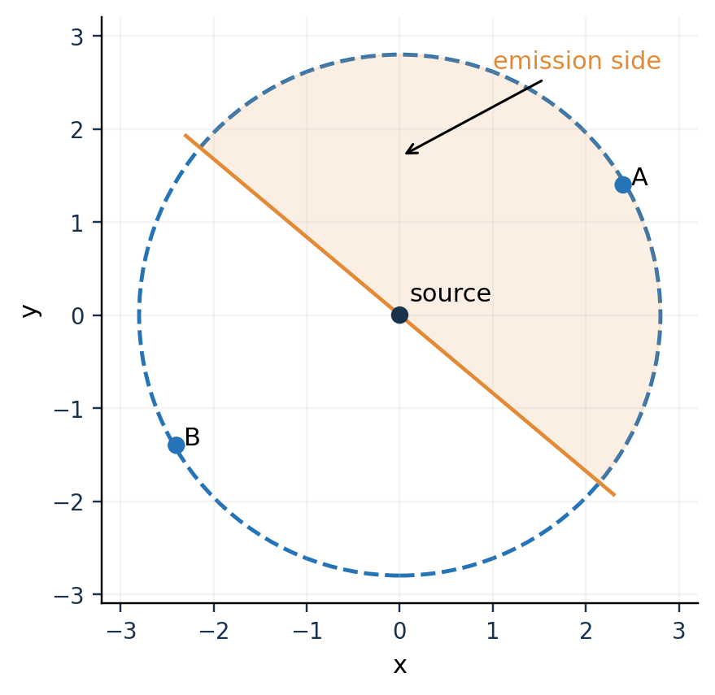
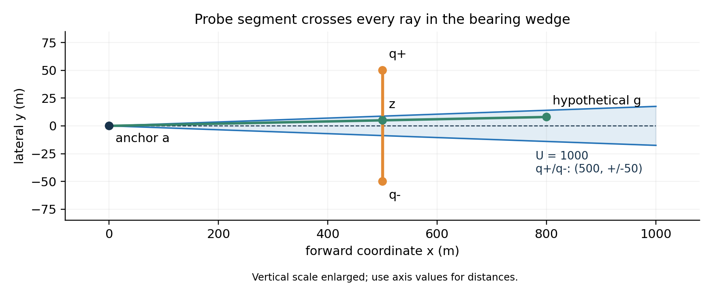

# 第 6 课　有界误差下的集合估计

前五课讨论几何区域、覆盖与路线；这些几何对象从何而来？答案是**观测之后仍可能的状态集合**。本课单独研究一件事：传感器有确定误差界时，怎样更新这个集合，同时保证真值不被删掉。第 7 课才改变传感器的方向模型。

**学习路线。** 整数传感器的原例 → 逐次相交与不变量 → 外包络 → 课内计算题 → Q3 的方位、负观测与清除应用 → 源码。先会算集合，再进入平面。

**预备知识。** 集合交并、区间、平面半平面（第 1–2 课）、最小包围圆（第 3 课）。读者应能在经典整数例中独立算出每一步相容集，才开始看本题代码。

## 6.1　问题的提出：一个读数允许哪些真值

假设一个读数最多会错 1，读出 4。真实值可以是 3、4、5。你现在不知道哪一个是真的，却知道其他整数都不可能。这已经是一条有用结论。

把全部仍可能的值保存在一个集合里，叫作**集合成员估计**（set-membership estimation）；“成员”的意思是我们要保证真值仍属于这个集合。机器人教材也把这类对象称为非概率的信息状态。

它处理的是“误差被确定地限制在某个范围”的模型。另一条路线是给误差规定概率分布，计算不同状态的概率；那是概率估计。只有上界而没有分布时，不能凭空说 4 比 3、5 更可能。

## 6.2　标准模型与教材原例：带扰动整数传感器

**原例出处：**Steven M. LaValle《Planning Algorithms》§11.1.1，Example 11.7 “Sensor Disturbance”，印刷页 564。教材给出整数状态 $x$、整数读数 $y$、扰动 $\psi\in\{-1,0,1\}$，观测模型是 $y=x+\psi$。[6-1]

先把模型中的每个角色念清：

| 符号 | 角色 | 我们是否知道 |
|---|---|---|
| $x$ | 真实状态 | 不知道，要估计 |
| $y$ | 实际读数 | 知道，传感器返回 |
| $\psi$ | 本次误差 | 只知道属于 $\{-1,0,1\}$ |

若收到 $y$，逐个考虑允许的误差：

\[
\begin{array}{c|ccc}
\psi&-1&0&1\\\hline
x=y-\psi&y+1&y&y-1
\end{array}
\]

因此与读数相容的状态集合为

\[
H(y)=\{y-1,y,y+1\}.
\]

这一步叫**从观测反推相容状态**。以后会看到“观测逆像”这个较抽象的词，它说的就是这件事。

## 6.3　算法：反推相容集，再取交集

下面的读数序列是本课基于原模型设计的纸笔练习，**并非原书给出的数值序列**。假定 $x$ 不随时间变化，起初只知道 $x\in\{0,1,2,3,4,5,6,7\}$。连续收到 4、5、6。

第一次读数 4，与它相容的是 $\{3,4,5\}$。第二次读数 5，与它相容的是 $\{4,5,6\}$。一个固定真值必须同时解释两次读数，因此取交集：

\[
F_2=\{3,4,5\}\cap\{4,5,6\}=\{4,5\}.
\]

再收到 6，相容集合为 $\{5,6,7\}$，所以

\[
F_3=\{4,5\}\cap\{5,6,7\}=\{5\}.
\]

| 时刻 | 新读数 | 仅看本次允许的状态 | 与旧集合取交后 |
|---|---:|---|---|
| 0 | 无 | 无 | $\{0,1,2,3,4,5,6,7\}$ |
| 1 | 4 | $\{3,4,5\}$ | $\{3,4,5\}$ |
| 2 | 5 | $\{4,5,6\}$ | $\{4,5\}$ |
| 3 | 6 | $\{5,6,7\}$ | $\{5\}$ |

**为什么不能取并集？**并集表示满足其中一次即可，会把 3 留下来；但 3 无法在误差不超过 1 时产生读数 5。多个同时必须成立的条件，使用交集。

**为什么又不能直接平均读数？**本例平均恰好是 5，这个巧合没有代替误差模型的证明。若真值 3，三次都读出 4，每次误差都是允许的 1，平均依然是 4。只有有界误差，不能承诺平均必然消除偏差。

## 6.4　正确性：为什么不会删掉真值

旧集合叫 $F_k$，新读数叫 $y_{k+1}$，那么

\[
\boxed{F_{k+1}=F_k\cap H(y_{k+1}).}
\]

其中

\[
H(y)=\{x:\text{存在一个允许误差，使 }y=h(x,\psi)\}.
\]

“存在一个允许误差”很关键：候选值只要**能**解释观测就保留；无需它在所有误差下都产生该读数。

算法只需要三步：先设置初始集合；每次按模型构造相容集合；取交。正确性的核心不变量是

\[
x_*\in F_k,
\]

这里 $x_*$ 是真实状态。如果初始集合含真值，而每次相容集合也含真值，交完后仍含真值。用数学归纳法重复这句话，就证明算法不会误删真值。

## 6.5　模型失配与空集

假设上例前两次读数为 4、5，第三次读出 8。此时

\[
\{4,5\}\cap\{7,8,9\}=\varnothing.
\]

结论是**没有一个固定整数能在规定误差界下解释全部读数**。可能是误差模型不成立，可能状态已经变化，也可能数据或程序有错。不能一边丢掉旧信息，一边继续声称仍保持原来的安全证明。

在比赛程序中看到“empty feasible set”抛异常，就是这种不一致报警。它不是告诉你“目标被精确定位成不存在的一点”。

## 6.6　计算方法：用外包络保存安全性

假设精确候选集合是两小块，存起来很麻烦。可以用一个更大的简单集合 $P_k$ 包住它：

\[
F_k\subseteq P_k.
\]

如果以后始终保留这个包含关系，真值仍被保留。外包络可能含有一些已经不可能的点，代价是后续定位更慢或清除判据更保守。

一个熟悉的二维例子是凸包。若精确剩余集合为 $A$，用 $\operatorname{conv}(A)$ 替代，就把凹口、洞或分离块之间的一部分空间填回去了。它们全都在外包络中，但并不都是真实可行点。

**这一段要达到的程度：**能画“两小块”和“包住两块的凸多边形”，指着图说明“允许多留，不能误删”。不必在七天内学完区间分析与所有集合表示算法。

## 6.7　课内习题与解答

**6A。** 按同一整数传感器模型，连续读数为 4、4、4。最终集合是什么？重复读数一定使集合继续缩小吗？

**6B。** 把状态改为实数、误差改为 $[-1,1]$，连续读数 4、4.6。手算集合更新。

**6C。** 已知 $F\subseteq P$，新观测的精确相容集为 $H$。若程序输出 $P^+\supseteq P\cap H$，能否保证 $F\cap H\subseteq P^+$？

**解答。**6A 为 $\{3,4,5\}$，重复相同约束不增加新信息。6B 为 $[3,5]\cap[3.6,5.6]=[3.6,5]$。6C 能，因为 $F\cap H\subseteq P\cap H\subseteq P^+$。注意这里保证包含关系，不保证外包络面积严格减少。

## 6.8　章末应用：Q3 的位置估计与安全清除

以下换掉标准例的状态空间与传感器：整数 $x$ 换成平面位置 $g$，整数读数换成有角误差的方位，观测集合仍用“与所有已知反馈相容”定义。**方法不变的是保留真值的不变量；新困难是角楔与距离圆盘的几何表示，以及动作必须满足 20 m 的最坏距离条件。**这几节是课后应用的解答过程，读者先独立写出集合更新式，再看源码。

### B-6.1　题目：把整数换成平面位置

现在未知量变成源坐标 $g=(x,y)$，观测变成从检测点 $p$ 指向它的方位读数 $\widehat\theta$，角误差有界。请仿照 $H(y)=\{y-1,y,y+1\}$ 写出平面中的相容集合。

**解答。**如果真实方向在读数左右 $\delta$ 内，允许区域是从 $p$ 出发的向前角楔。再利用成功接收给出的距离上界，有

\[
H(p,\widehat\theta)=
\{g:|\operatorname{wrap}(\arg(g-p)-\widehat\theta)|\le\delta,
\ \|g-p\|\le1500\}.
\]

`wrap` 表示圆周上的最短角差，例如 359.9° 与 0.1° 相差 0.2°。这与整数例题本质相同：把“能解释读数的所有状态”留下。

程序的计算半角为 1.0051°，由物理误差 1°、两位小数输出可能造成的 0.005° 舍入及 0.0001° 保护组成。物理误差仍是 ±1°；额外小量属于计算保护。

### B-6.2　为什么源码用了三个半平面

把读数方向单位向量记为 $u$，侧向记为 $v$，候选点写成 $g=p+xu+yv$。角楔可以写成

\[
x\ge0,\qquad |y|\le x\tan\delta.
\]

两条角边界对应两个半平面；角宽小于 180° 时，它们的交已经选出向前区域。成功接收还允许利用距离上界 $R\le1500$。程序用

\[
x\le R
\]

作为第三个半平面。得到的三角形包含真实扇形，但角点的欧氏距离略大于 $R$。这样用统一的 `clip` 就能完成更新，保留凸多边形表示；这是外近似。

Q3 `bearing_update` 第 63–76 行先取 $R=\min(1500,\max_{z\in P}\|z-p\|+\mathrm{EPS})$，再执行三次裁剪。它没有把一条精确方位射线当成观测，也没有精确保留圆弧边界。

### B-6.3　无信号为什么也可能提供集合约束

Q3 的源为全向，且有效接收半径至少 1000 m。在一个确实存在且未清除的频道上，如果检测点 $p$ 没收到信号，源不可能在保证接收的 1000 m 圆盘内部。

精确操作是从候选区挖掉开圆盘。挖完可能非凸，程序为继续用凸多边形，将其凸包作为外近似：

\[
P^+=\operatorname{conv}\bigl(P\setminus B^\circ(p,1000)\bigr).
\]

Q3 `exclude_disk_hull` 第 78–98 行收集圆外顶点及边与圆的交点，再求凸包，并用略缩小的排除半径防止数值误删。如果圆盘完全在多边形内部，凸包可能把洞全填回；这次负观测就未必缩小当前表示。

对未知频道，一次无信号还可能表示本来无源。因此代码先把负观测保存下来；以后发现该频道的源时，再与这些历史约束一起更新。不能一次无信号就把整个频道标为 `ABSENT`。

### B-6.4　为什么“小区域”可以成为清除证书

第 3 课学过最小包围圆。现在它的用途非常具体：如果候选区 $P$ 被 $B(c,r)$ 包住，而真源属于 $P$，那么真源距 $c$ 最多 $r$。

清除半径为 20 m，代码使用 19.8 m 作为认证阈值。如果 $r\le19.8$，直接去圆心是一个安全选择；但未必需要走到圆心。

任取满足 $\lVert q-c\rVert\le19.8-r$ 的点 $q$，对全部候选源都有

\[
\|q-g\|\le\|q-c\|+\|c-g\|
\le(19.8-r)+r=19.8<20.
\]

因此认证可清除点至少包含圆盘 $B(c,19.8-r)$。代码选其中距当前位置最近的点，以少走一些路。注意这是全部有效清除位置的**一个有保证的子集**，未声称精确枚举所有可行清除位置。

**纸笔检查。**若 $r=12$、当前位置距 $c$ 为 100，安全小圆盘半径为 $7.8$，沿向 $c$ 的直线走 $100-7.8=92.2$ m 就够。这是公式计算，不必估计真实源在圆内哪一点。

### B-6.5　候选区还太大时，为什么选下一测点

Q3 在候选包围圆中心附近取两个侧移候选点：

\[
q_\pm=c\pm0.1r\,v.
\]

侧向 $v$ 垂直于当前位置到圆心的方向。程序先检查每个点到全部候选顶点的最大距离不超过 999 m，确保真实源一定处在接收范围；再用移动距离及下一覆盖站方向选其中一个。

从新地点得到角楔，与旧集合取交，就会缩小不确定性。这里“换地方”有意义；同一点反复测并不能保证带来独立误差样本。

**进阶推导，第二遍读。**成功读数的三角形外包络 $0\le x\le R, \lvert y\rvert\le x\tan\delta$ 能装入半径 $R/(2\cos^2\delta)$ 的圆。新测点最多偏离旧圆心 $0.1r$，所以它到旧候选集的最大距离至多 $1.1r$。下次包围圆半径可界为

\[
r^+\lesssim\frac{1.1}{2\cos^2\delta}r\approx0.55017r,
\]

其中数值实现另有微小容差。Q3 第 304–308 行还计算独立的三角形包围圆并复核全部顶点，防止只依赖增量圆构造的内部值。`_serve` 设 18 步上限，并在信号丢失或明显未收缩时抛异常；不把这种异常冒充定位成功。

### B-6.6　逐项定位到代码

**先辨对象。** `poly` 是包含真源的候选多边形，`center, radius` 是罩住该多边形的圆，`status` 表示频道发现或清除状态；它们不是同一个变量。沿着这三个对象读代码，比逐行背语句更能检查证明是否落到了实现里。

| 教材动作 | Q3 函数与行号 | 读这一段时盯住什么 |
|---|---|---|
| 初始集合含全部可能位置 | `arena_polygon` 58–61 | 外切 48 边形，不能换成内接多边形 |
| 相交更新 | `bearing_update` 63–76 | 输入旧 `poly`，输出裁剪后的 `poly` |
| 负观测外近似 | `exclude_disk_hull` 78–98 | 保留点、边圆交点、凸包 |
| 包围圆最终复核 | `mec` 120–146 | 返回半径用所有原顶点重新求最大距离 |
| 选最近认证清除点 | `nearest_certified_clear` 148–154 | `slack=19.8-r` |
| 把响应变成状态变化 | `_observe` 281–311 | `no_signal`、`near`、`direction` 三分支 |
| 选择下一观测位置 | `_tracking_point` 396–407 | 两侧候选、999 m 检查、位置评分 |
| 循环定位直到满足清除条件 | `_serve` 409–430 | 半径门槛、实际动作、异常保护 |

文件：[Q3 本地求解器](../source/Q3/q3_local_solver.py)。这部分在正式文件中具有相同行号。

### B-6.7　应用练习与答辩追问

**练习。**一位同学说：“连续几个读数已经很接近，所以我对示向求平均，再取两线交点去清除。”请用本课模型指出他还缺哪个保证。

**解答。**近似读数或平均点不保证真值在 20 m 内；需要保留所有与有界误差相容的位置，或给出其他有效的最坏距离上界。当前代码用候选集外包络及包围圆，保证全部候选位置都能清除。

**问：为什么不用 Kalman 滤波？**

答：标准 Kalman 滤波通常围绕线性动态、噪声统计及均方误差工作；本题核心要求是确定误差界下保留真值并认证最坏距离。集合成员估计直接表达这种要求。可以研究概率方法辅助选点，但概率中心或协方差不能直接替代当前的确定性清除证书。

**问：有没有实现后才发现的偶然成功？**

答：保留真值、认证距离、覆盖发现是可以说明条件的几何论证；启发式节约了多少时间要用实验比较。不能拿若干局成功来代替全部前提下的证明。

# 第 7 课　定向观测与双负反馈

上一课的 Q3 源是全向的：在保证接收的距离内无信号，可以推出源不在那片圆盘。本课把一个前提改掉：源只向前方半圆发射。任务有两项，**先证明所有可能朝向下都能发现源，再利用连续两次负反馈缩小已发现源的位置范围**。两项证明依赖不同的几何事实，不能混讲。

**学习路线。** 独立传感器例 → 点积接收模型 → 负反馈的逻辑 → 凸包包围与方向覆盖 → 课内计算题 → Q4 的站位与成对探测 → 代码。

## 7.1　问题的提出：有距离还不够

一个探测器只看前方半圆。在同样近的两个点中，一个在前面，另一个在背后，接收结果不同。于是“没看到”至少有两种原因：太远，或方向不对。

Ai 与 Abouzeid 的论文《Coverage by Directional Sensors》Fig. 1 给了一个明确的公开例子：同样四个定向传感器和六个目标，某配置启用四个仍漏两个目标，另一配置只启用三个却覆盖全部。它展示了朝向对覆盖的影响。[7-1] 原图没有提供可供本课手算的坐标表，所以这里不编一组坐标冒充它的原始数据。

下面用独立图示和点积手算，学会同一个标准扇区模型。

图中虚线圆是距离限制，浅橙半圆是接收侧，穿过源的橙线是真正的方向边界。A、B 都在距离范围内；A 有机会接收，B 在背向一侧。图为本教材独立绘制；不是原论文图的复制。

## 7.2　标准模型：距离条件与方向条件

源在 $g$，单位朝向向量为 $n$，接收点在 $q$。向量 $q-g$ 从源指向接收点。

第 1 课的点积告诉我们

\[
n\cdot(q-g)=\|q-g\|\cos\alpha,
\]

其中 $\alpha$ 是接收点相对发射方向的夹角。前方左右各 90° 等价于 $\cos\alpha\ge0$。所以半圆接收条件是

\[
\boxed{\|q-g\|\le\rho\quad\text{且}\quad n\cdot(q-g)\ge0.}
\]

第一个是不太远，第二个是在前半平面。二者同时成立才可接收。

**独立手算例。**$g=(0,0)$、$n=(1,0)$、$\rho=10$。点 $(3,4)$ 距离 5、点积 3，接收；点 $(-3,4)$ 距离也为 5、点积 -3，不接收；点 $(0,5)$ 在边界，若模型含边界就接收。

要特别分清：$n$ 是源朝哪边发射；测向返回的方向是接收点指向源，即 $g-q$。它们不是同一个向量。

## 7.3　观测逻辑：负反馈是一个“或”命题

对于一个已知存在、尚未清除的源，没接收到的条件是

\[
\|q-g\|>\rho\quad\text{或}\quad n\cdot(q-g)<0.
\]

“或”关系不能只取前半句。若连源是否存在也未知，还需加“不存在”这个解释。

如果你设法让一次检测对全部候选位置都足够近，那么“距离太远”这个解释被排除了。这时负观测才必然来自方向盲区。**主动选测点的一个目的，就是使反馈更容易解释。**

仍然不能凭一个方向阴性立即得到源在前或在后；因为未知朝向还会造成多种解释。后面的成对方法会增加另一条证据。

## 7.4　定理：凸包包围保证至少一站位于正面

假设目标 $g$ 位于三个足够近的检测点 $v_1,v_2,v_3$ 组成的三角形内。则有非负权重 $\lambda_1,\lambda_2,\lambda_3$，和为 1，使

\[
g=\lambda_1v_1+\lambda_2v_2+\lambda_3v_3.
\]

这是“在三角形里”的凸组合表示。对任意朝向 $n$，

\[
\lambda_1n\cdot(v_1-g)
+\lambda_2n\cdot(v_2-g)
+\lambda_3n\cdot(v_3-g)=0.
\]

如果三个检测点全在严格背面，三个点积都小于零，它们的加权和不可能等于零。因此至少有一个点在接收闭半平面内。

**先用图理解，再记公式：**拿一条穿过三角形内部点的直线转一圈，不可能把三角形全部顶点都放到直线同一侧。这就是证明的几何含义。

距离条件还不能忘：如果三角形最长边不超过保证接收半径，内部任一点到每个顶点都不超过这个半径。因为到某顶点的距离不大于其他顶点距离的凸组合。于是“被包围”与“足够近”可以一起认证。

## 7.5　课内习题与解答

**7A。**三个检测点都在目标的左边，即使距离都很小，是否能保证任何未知朝向都收到？

**7B。**目标在三角形内，但三角形某条边长 3000、有效距离只有 1000，刚才的发现保证还能直接使用吗？

**7C。**读数 `no_signal` 的名字相同，能否自动沿用另一个物理模型的删除规则？

**解答。**7A 不能，目标可朝右。7B 不能，仅包围不足以证明距离。7C 不能，必须按当前观测模型重新写相容集合；标签的名字不决定信息量。

## 7.6　章末应用：Q4 的发现与定位

把标准模型中的“目标”换成本题源位置，把定向传感器的接收侧换成源自身的发射侧；机器狗在各站扫描频道。原模型是固定的点和朝向，本题源位置与朝向都未知。因此必须同时满足**连续位置覆盖**和**任意朝向覆盖**，不能仅在一些抽样位置模拟成功。下列小题先解决发现，再解决对已发现源的定位。

### B-7.1　第一道应用：为什么 Q3 的负观测操作会失效

题目：源在 $g=(100,0)$，朝正东，接收半径 1000。机器狗在 $q=(0,0)$ 检测无信号。如果套 Q3 排除以 $q$ 为圆心的 1000 m 圆盘，会怎样？

解答：会把真源删掉。距离仅 100 m，但 $n\cdot(q-g)=-100<0$，它在背面。Q4 `_observe` 第 121–129 行对普通 `no_signal` 不裁剪候选多边形；这是有意保守。

### B-7.2　第二道应用：把三角形覆盖方法用于 25 站

Q4 的 `coverage_route` 第 85–89 行构造：原点，半径 995 m 的八点内环，半径 1838 m 的十六点外环。

1. 外环正十六边形的内切半径为 $1838\cos(\pi/16)\approx1802.683>1800$，因此把整个源圆域包住。
2. 用这些站点把大多边形剖成小三角形，每条边不超过 995 m。
3. 任意源位于一个小三角形内，三个顶点足够近，且根据 7.4 至少一个顶点在源的接收侧。

这就把通用的凸组合事实变成了本题的完整发现保证。

**第二遍阅读：怎样核查“小三角形”不是一句空话。**记内圈 $I_k$，外圈 $E_j$，中心 $O$，下标按圈的点数循环。中央取 $(O,I_k,I_{k+1})$；每个 45° 环带取下面三个三角形：

\[
(I_k,E_{2k},E_{2k+1}),\quad
(I_k,E_{2k+1},I_{k+1}),\quad
(I_{k+1},E_{2k+1},E_{2k+2}).
\]

合计 $8+8\times3=32$ 个。边长类型为 995、$2\cdot995\sin(\pi/8)\approx761.540$、843、$2\cdot1838\sin(\pi/16)\approx717.152$，以及

\[
\sqrt{995^2+1838^2-2\cdot995\cdot1838\cos(\pi/8)}
\approx994.519.
\]

全部小于 1000。此证明针对连续位置与朝向，不用“随机抽样未发现漏点”替代。它也没有证明 25 站最少或访问次序最短。

原点、内环、外环的顺序影响时间；完整覆盖看站点集合。外圈大于 1800 的原因是它要把源所在圆域包在内部；题中源的活动区域与机器狗可走的区域不能混为一谈。

### B-7.3　第三道应用：保留一个曾经收到信号的位置

把最近一次取得正观测的位置记为锚点 $a$，读数方向记为单位向量 $u$，垂直方向记为 $v$，候选源写成

\[
g=a+xu+yv,\qquad 0\le x\le U,\quad |y|\le x\tan\delta.
\]

这里 $U\le1500$ 是以锚点为参照、保证真源距离不超过它的上界；它不是源实际接收半径，也不是包围圆半径。

锚点还有一个只写位置时容易忘的事实：它**确实收到过信号**，因此对未知朝向 $n$ 有

\[
n\cdot(a-g)\ge0.
\]

普通最近测点 `last` 可能无信号，不能替代正锚点 `anchor`。Q4 `Track` 第 97–100 行分别存这两个点和上界 `U`。

### B-7.4　第四道应用：设计一对测点

在角楔轴向的一半处，左右各偏移 $0.05U$：

\[
q_+=a+0.5Uu+0.05Uv,\qquad
q_-=a+0.5Uu-0.05Uv.
\]

图是本课独立示意，取 $U=1000$、锚点 $(0,0)$、两探点 $(500,\pm50)$、假想远端源 $(800,8)$。为看清狭窄角楔，纵轴放大；距离按坐标刻度计算。图中的 $z$ 是锚点到假想源的连线与探测线段的交点。

先检查两个条件，再谈收到什么结果：

**条件一：都足够近。**对角楔外包三角形内任一点，

\[
\|q_\pm-g\|
\le U\sqrt{0.5^2+(0.05+\tan\delta)^2}
\approx0.504542U\le756.813<1000.
\]

因此两点不可能因为太远而无信号。侧向差的上界为 $U(0.05+\tan\delta)$，轴向差的上界为 $U/2$，再用勾股定理。图中侧向画在纵轴，轴向画在横轴。

**条件二：两点之间的线段截住整个角楔。**在 $x=0.5U$ 处，角楔的半宽只有 $0.5U\tan\delta\approx0.008772U$，小于两探点的半间隔 $0.05U$。所以每条可能的源方向射线都穿过两点之间。

这两个检查解释了 0.5 与 0.05 的作用。它们不是凭“左右各测一次应该更稳”就足够，必须验证距离和跨楔条件。

### B-7.5　核心推理：为什么双负观测允许砍掉远半边

**结论：**在锚点确实正观测、两点足够近且跨住角楔、没有模型外漏检的条件下，如果两点都无信号，则真实源的轴向坐标 $x<0.5U$。

先读直观版：如果源在探测线的前方，连接正锚点与源的那条线会穿过探测线段；正锚点已经位于接收侧。穿过的那一点沿着锚点到源的方向，也必须位于接收闭半平面里。但如果两个端点都在严格背面，中间整条线段都在背面，产生矛盾。

再把每一句写成可检查的式子：

1. 两点都足够近，所以双负意味着 $n\cdot(q_+-g)<0$、$n\cdot(q_--g)<0$。对全向源，这种双负分支本来就不可能出现。
2. 反设 $x\ge0.5U$。锚点到源的线与探测直线交于

\[
z=a+0.5Uu+\frac{0.5U}{x}yv.
\]

3. 角楔条件给出 $\lvert (0.5U/x)y\rvert\le0.5U\tan\delta\le0.05U$，因此 $z$ 在 $[q_-,q_+]$ 上。它是两个背向点的凸组合，所以 $n\cdot(z-g)<0$。
4. 另一方面 $z-g=(1-0.5U/x)(a-g)$。括号非负，而正锚点满足 $n\cdot(a-g)\ge0$，所以 $n\cdot(z-g)\ge0$。矛盾。

由此可以安全保留闭半平面

\[
P^+=P\cap\{g:u\cdot(g-a)\le0.5U\}.
\]

使用“≤”而非强行在浮点数里排除边界，是保守处理。Q4 `_dual_negative` 第 155–158 行正是在做这一次半平面裁剪，然后更新上界及包围圆。

### B-7.6　必须会说出的反例：为什么一个阴性不够

取 $a=(0,0)$、$g=(800,0)$、$U=1500$，方向读数 0°，两探点为 $(750,75)$、$(750,-75)$。令源的朝向

\[
n=(-0.01,-\sqrt{1-0.01^2}).
\]

锚点的点积为 8，因此有信号。上探点的点积约 -74.496，因此无信号；下探点约 75.496，因此有信号。源仍在 $x=800>750$。如果收到上点一个阴性就裁到 $x\le750$，真实源会被删掉。

这是独立构造的数学反例，用来检验当前策略的必要前提；不把它包装成外部教材原题。

答辩时至少要能画出“正锚点、真源、一个背向测点和另一个正向测点”。只背“双负才能裁剪”而不知道单负反例，还没有真正掌握。

### B-7.7　代码为什么常常只测一个点

`_pair_round` 第 159–169 行按下列顺序执行：

1. 用旧锚点、旧方向和旧 $U$ 生成一对点。
2. 先去离当前设备较近的点。
3. 若返回 `direction`，更新位置集和正锚点，本轮结束。
4. 若返回 `near`，直接清除，本轮结束。
5. 只有第一点 `no_signal`，才去第二点。
6. 第二点仍 `no_signal`，才调用 `_dual_negative`。

“成对”表示设计与证据来自一对点，不表示无论结果如何都固定做两次检测。正观测已经能更新角楔，下一轮应该按新信息重建测点。

### B-7.8　为什么这个过程会缩小，而不是原地死循环

双负分支裁到 $x\le0.5U$，结合角楔得到真源距原锚点

\[
U^+\le\frac{0.5}{\cos\delta}U\approx0.500077U.
\]

正观测分支用新测点作锚点，旧候选区到它的距离已在 B-7.4 界为 $0.504542U$。因此更新后的 $U$ 也至多约为这个量。两条未清除分支都把尺度降到约一半。

程序每次重算包围圆，达到 $r\le19.8$ 后，使用第 6 课相同的距离证书清除。代码设置九轮保护上限；这个数字是实现保护，不要把“程序设了上限”本身当作收缩证明。收缩理由是上面两个分支的几何上界，精确的浮点容差另由程序保守处理。

### B-7.9　把方法、状态和代码逐项对上

**先辨信息。** `anchor` 带有“这里确实收到过信号”的历史证据；`last` 只记录最近动作位置；`U` 是从正锚点到真源的保守上界。只有这些含义同时成立，双负证明才允许调用 `_dual_negative`。

| 要回答的问题 | Q4 位置 | 具体证据 |
|---|---|---|
| 源在什么区域内初始化 | `arena_polygon` 39–41 | 外切正 64 边形 |
| 正观测怎样变成角楔 | `direction_update` 43–47 | 两条角边界＋轴向上界 |
| 新锚点与 `U` 从哪来 | `_positive` 109–112 | 只在正观测后更新 |
| 为什么单次阴性不裁剪 | `_observe` 121–129 | `no_signal` 返回但不改 `poly` |
| 两点坐标怎么写 | `_pair_round` 162–164 | `LAMBDA=.5`、`ETA=.05` |
| 什么条件才调用负裁剪 | 165–169 | 两次都 `no_signal` 且仍 `FOUND` |
| 负裁剪究竟是哪条线 | `_dual_negative` 155–158 | `dot(u,g) <= dot(u,anchor)+.5*U` |
| 什么时候允许清除 | `_service` 170–178 | 先查半径，不够再继续成对探测 |
| 距离近能否保证接收 | `_reuse` 140–147 | 近仅保证距离；方向可能仍无信号，故 `_observe` 不误裁 |

文件：[Q4 本地求解器](../source/Q4/q4_local_solver.py)。前 208 行与正式文件一致。特别留意最后一行：`_reuse` 的 999 m 条件在 Q4 只解决距离，不保证避开盲区；它的安全性来自普通负观测不删除位置。

### B-7.10　最后一组应用练习

**练习 1。**两个探测点都无信号，但它们距某候选源可能达到 1200 m。能否套用双负裁剪？

**练习 2。**两个点都足够近，但线段没截住全部角楔。能否套用同样结论？

**练习 3。**某次阴性之后，能否把该点写入 `anchor`，再进行下一轮？

**练习 4。**为何 `_reuse` 在一个停车点只选部分已发现频道复测，却不影响未知源的完整发现保证？

**参考解答。**

1. 不能，两个无信号可能来自超距；证明第一步失效。
2. 不能，假想远端源与锚点的连线可能绕过探测线段；交点不在两个负点之间。
3. 不能，锚点提供曾经接收的事实 $n\cdot(a-g)\ge0$，阴性点不具备该事实。可以更新 `last`，不能冒充正锚点。
4. `_reuse` 用于机会补测已发现目标、提高定位效率；完整发现由覆盖路线上的未知频道扫描负责。两种循环承担不同职责。

## 两课贯通：三项不同的结论

**先讲通用方法。**读数有误差时，保存全部能解释读数的状态；新读数出现就与旧集合相交。实现可用更大的简单集合包住精确集合，但始终必须保留真值。

**再讲 Q3。**方位读数变成角楔；全向阴性允许排除保证接收圆盘；包围圆给出最坏位置误差，半径足够小时才清除。

**最后讲 Q4 的新增困难。**阴性可能来自背向，因此普通阴性不直接裁剪。我们以正锚点为基准，设计足够近且横跨角楔的一对测点；双负说明源不在远半边，正观测则产生新的角楔。两条分支都收缩，再用同一个清除证书。

先会手算 6.3、7.2，再会画 B-7.5 的矛盾图，最后打开对应函数。达到这个次序，源码行号才会成为你已经理解的方法的位置提示。

## 第 6–7 课来源与进一步阅读

- **[6-1]** Steven M. LaValle，*Planning Algorithms*，Cambridge University Press，2006，Chapter 11，§11.1.1，Example 11.7 “Sensor Disturbance”，p.564。整数状态、三值扰动模型来自原例；读数 4、5、6 和各训练序列为本课明确标注的独立扩展。作者章节：<https://lavalle.pl/planning/ch11.pdf>；作者全书入口：<https://lavalle.pl/planning/>。
- **[7-1]** Jing Ai、Alhussein A. Abouzeid，*Coverage by Directional Sensors*，WiOpt 2006，Fig. 1、§III-A、§III-B。四定向传感器与六目标的配置对照及标准扇区模型来源。作者高校稿：<https://sites.ecse.rpi.edu/~abouzeid/preprints/2006wiopt.pdf>。该稿封面页脚为 2005 草稿日期，会议出版年为 2006。

两个原始来源已于 2026-09-29 在线核对。本章的半平面推导、程序正确性分析与 B 题练习独立编写；没有声称某本通用教材直接给出了本题的 25 站或这份成对探测程序。那部分必须由题设和实际代码逐步推导。
