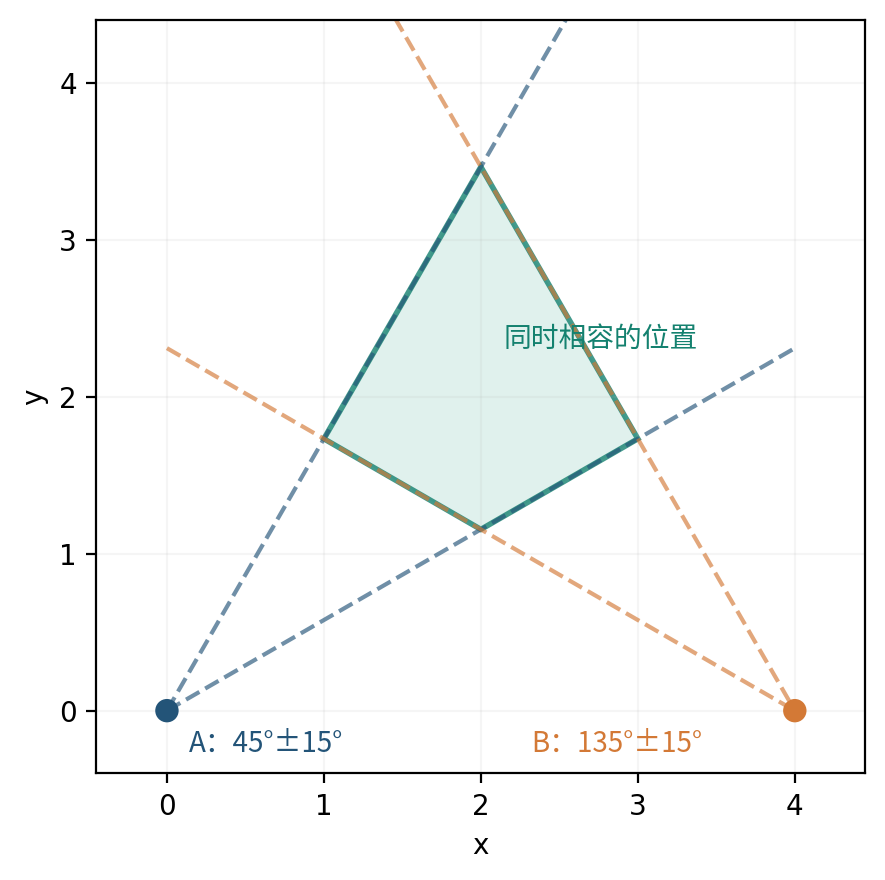

# 第1章　从两次指向到一块可能区域

校园里有一座雕塑，需要把它标在平面地图上。两位同学分别站在 \(A=(0,0)\) 米和 \(B=(4,0)\) 米处，从向东的方向开始逆时针量角，读到的方向分别为 \(45^\circ\) 和 \(135^\circ\)。每次读数最多可能偏差 \(15^\circ\)。已知两处测量位置和两次读数，未知雕塑的位置：哪些位置仍然可能？这些可能位置中，最远的两个能相差多少米？

本章先把这件事算清楚，再学习怎样让计算机处理同类问题。所有具体坐标和读数均为**教学算例**，不是从文献或赛题中摘录的数据。地图裁剪、点集外边界和多边形直径是经典计算几何问题；相应一手来源列在章末。阅读时准备方格纸，把每个例子的点画出来，会比只看公式容易得多。

## 小课一　先把没有误差的两次指向算清楚

### 1.1　位置、位移和距离各表示什么

先暂时认为两次读数完全准确。地图向右为东，向上为北，横坐标 \(x\)、纵坐标 \(y\) 的单位都是米。未知位置记为 \(X=(x,y)\)。

从 \(A=(0,0)\) 看，\(45^\circ\) 方向上的点满足 \(y=x\)，而且要在出发点的前方，所以 \(x\geq0\)。从 \(B=(4,0)\) 看，\(135^\circ\) 指向左上方：横坐标每减少一米，纵坐标增加一米。因此

\[
y=4-x,\qquad x\leq4.
\]

让两条指向同时成立，解方程

\[
x=4-x,
\]

得到 \(x=2, y=2\)。准确读数给出的雕塑位置是 \((2,2)\) 米。

这里同时用了三个不同的量。\(A=(0,0)\) 是一个**位置**；从 \(A\) 到 \(X\) 的位移是 \(X-A=(2,2)\)；两者的距离是

\[
|X-A|=\sqrt{2^2+2^2}=2\sqrt2\ \text{米}.
\]

一般地，从 \(S=(s_x,s_y)\) 到 \(X=(x,y)\) 的位移写成

\[
X-S=(x-s_x,y-s_y),
\]

距离为

\[
|X-S|=\sqrt{(x-s_x)^2+(y-s_y)^2}.
\tag{1}
\]

位移有两个分量，距离只有一个非负数；把两者区分开，后面的角度公式才不会混乱。

### 1.2　把一个方向写成两个数

长度为一的箭头可以专门表示方向。从向东的方向逆时针转过角度 \(\theta\)，这个箭头的横、纵分量为

\[
u(\theta)=(\cos\theta,\sin\theta).
\tag{2}
\]

例如，\(u(0^\circ)=(1,0)\)，\(u(90^\circ)=(0,1)\)，\(u(45^\circ)=(1/\sqrt2,1/\sqrt2)\)。两个分量没有长度单位。由 \(\cos^2\theta+\sin^2\theta=1\)，箭头的长度确实为一。

从位置 \(S\) 沿方向 \(\theta\) 出发，走 \(r\) 米，便到达

\[
X=S+r\,u(\theta),\qquad r\geq0.
\tag{3}
\]

这里的 \(r\) 是距离，单位为米。允许 \(r\) 取所有非负值，得到的是一条从 \(S\) 出发的射线；如果允许 \(r\) 为负，就把背后的半条直线也加入了。

本章手算角度使用“度”。程序中的三角函数接收弧度，换算为

\[
\theta_{\rm rad}=\theta_{\rm deg}\frac{\pi}{180}.
\]

同一方向可以有不同角度写法，例如 \(-1^\circ\) 与 \(359^\circ\)。需要显示角度时可以把它归入 \([0^\circ,360^\circ)\)；代入正弦、余弦时，周期性会自动表达同一方向。

### 1.3　换一组位置

把两位同学移到 \(S=(1,2)\)、\(T=(5,2)\)，仍读到准确的 \(45^\circ\)、\(135^\circ\)。第一条指向满足

\[
y-2=x-1,
\]

第二条满足

\[
y-2=5-x.
\]

令右边相等，得到 \(x=3\)，再得 \(y=4\)。从 \(S\) 到交点的位移仍是 \((2,2)\)，距离仍是 \(2\sqrt2\) 米。改变地图原点不会改变相对位移和距离。

**课内练习1。** 两处位置改为 \(S=(2,-1)\)、\(T=(6,-1)\)，准确方向仍为 \(45^\circ\)、\(135^\circ\)。求交点、从 \(S\) 到交点的位移、距离和单位方向向量。答案集中在本章后部。

## 小课二　方向允许摆动后，要保留一整块区域

### 2.1　先看一个测量点

回到 \(A=(0,0)\)。读数是 \(45^\circ\)，最多偏差 \(15^\circ\)，所以真实方向可以是 \(30^\circ\) 到 \(60^\circ\) 中的任何一个方向。方格纸上先画出这两条边界射线。

下边界为

\[
y=(\tan30^\circ)x=\frac{x}{\sqrt3},
\]

上边界为

\[
y=(\tan60^\circ)x=\sqrt3x.
\]

两条射线之间的所有点满足

\[
\frac{x}{\sqrt3}\leq y\leq\sqrt3x.
\tag{4}
\]

这两个不等式也排除了 \(x<0\)：若 \(x<0\)，则 \(x/\sqrt3>\sqrt3x\)，不可能再让 \(y\) 夹在两者之间。它们描述的是向右张开的区域。

这块由两条射线夹出的区域称为**角楔**。读数只限定方向，没有提供沿射线的距离，因此一条读数通常留下一个向远处延伸的角楔。

### 2.2　为什么要改用乘法和加法判断左右

式（4）很直观，但方向为 \(90^\circ\) 时，直线不能写成有限斜率的 \(y=kx+b\)。我们需要一个对竖直方向也能使用的判断方法。

给定两个平面箭头 \(p=(p_x,p_y)\)、\(q=(q_x,q_y)\)，定义

\[
p\times q=p_xq_y-p_yq_x.
\tag{5}
\]

这个数称为二维叉积。先用最简单的箭头检查它的意义：若 \(p=(1,0)\) 指向右方，则 \(p\times q=q_y\)。位于箭头左侧，也就是上方的点给出正值；右侧给出负值；在直线上给出零。

对于任意方向 \(u(\alpha)=(\cos\alpha,\sin\alpha)\)，把 \(q=r(\cos\varphi,\sin\varphi)\) 代入，可得

\[
\begin{aligned}
u(\alpha)\times q
&=r(\cos\alpha\sin\varphi-\sin\alpha\cos\varphi)\\
&=r\sin(\varphi-\alpha).
\end{aligned}
\tag{6}
\]

在从 \(\alpha\) 逆时针转动不超过 \(180^\circ\) 的一侧，正弦非负。这样，叉积的符号就把“在射线左边还是右边”变成了坐标运算。

若两个输入都是以米计的位移，叉积的单位是平方米，其绝对值是它们张成的平行四边形面积。若一个输入是无单位的方向箭头，另一个是以米计的位移，叉积的单位就是米。后面两种用法都会出现。

### 2.3　从角度误差推出两个一次不等式

现在用 \(S=(s_x,s_y)\) 表示测量位置，\(\theta\) 表示方向读数，\(\varepsilon\) 表示误差半宽。这里先假定

\[
0<\varepsilon<90^\circ.
\]

两条边界的角度为 \(\ell=\theta-\varepsilon\)、\(h=\theta+\varepsilon\)，夹角 \(2\varepsilon\) 小于 \(180^\circ\)。可能位置 \(X\) 必须在下边界的左侧，同时在上边界的右侧：

\[
u(\ell)\times(X-S)\geq0,
\qquad
u(h)\times(X-S)\leq0.
\tag{7}
\]

展开第一个不等式：

\[
\cos\ell\,(y-s_y)-\sin\ell\,(x-s_x)\geq0.
\]

移项，把未知量放在左边，得到

\[
\sin\ell\,x-\cos\ell\,y
\leq
\sin\ell\,s_x-\cos\ell\,s_y.
\tag{8}
\]

同样，展开第二个不等式得到

\[
-\sin h\,x+\cos h\,y
\leq
-\sin h\,s_x+\cos h\,s_y.
\tag{9}
\]

这两式没有除以 \(\cos\theta\)，所以竖直边界也能计算。若读数为 \(359^\circ\)、误差半宽为 \(2^\circ\)，直接使用边界角 \(357^\circ\) 和 \(361^\circ\) 即可；不能把这个小角楔误认成从 \(1^\circ\) 到 \(357^\circ\) 的大角区间。

在几何上，我们把边界和顶点 \(S\) 一并保留，得到闭区域。真实目标恰好位于测量点时，方向本身没有定义；角楔的闭合表示仍包含这一顶点。若应用另有“目标与测量点不能重合”的条件，应单独表达这个条件。

还有一个需要单独处理的情形：\(\varepsilon=0\)。此时式（7）的两条约束合起来只给出一整条直线，前后两个方向都在其中。准确示向要求再加

\[
u(\theta)\cdot(X-S)\geq0.
\tag{10}
\]

符号“\(\cdot\)”表示对应分量相乘后相加。例如 \(u\cdot v=u_xv_x+u_yv_y\)。式（10）要求位移在示向方向上的投影非负，从而留下前方射线。

### 2.4　把两次读数放在同一张图上

第二位同学位于 \(B=(4,0)\)，读数 \(135^\circ\pm15^\circ\)，真实方向在 \(120^\circ\) 到 \(150^\circ\) 之间。它的角楔满足

\[
\frac{4-x}{\sqrt3}\leq y\leq\sqrt3(4-x).
\tag{11}
\]

雕塑必须同时符合两次读数。因此我们保留式（4）和式（11）共同允许的点。先把四条边界标成

\[
\begin{array}{ll}
L_1:y=x/\sqrt3,&L_2:y=\sqrt3x,\\
L_3:y=(4-x)/\sqrt3,&L_4:y=\sqrt3(4-x).
\end{array}
\]

四条直线共有六组两两组合。每组联立方程后，必须把交点代回**全部四个**不等式，不能只因为它是两条线的交点就保留。

| 联立的边界 | 解出的交点，单位米 | 检查其他约束后的结论 |
|---|---|---|
| \(L_1,L_2\) | \((0,0)\) | 不满足 \(y\geq(4-x)/\sqrt3\)，舍去 |
| \(L_1,L_3\) | \((2,2/\sqrt3)\) | 全部满足，保留 |
| \(L_1,L_4\) | \((3,\sqrt3)\) | 全部满足，保留 |
| \(L_2,L_3\) | \((1,\sqrt3)\) | 全部满足，保留 |
| \(L_2,L_4\) | \((2,2\sqrt3)\) | 全部满足，保留 |
| \(L_3,L_4\) | \((4,0)\) | 不满足 \(y\geq x/\sqrt3\)，舍去 |

例如求 \(L_1,L_4\) 的交点时，先写

\[
\frac{x}{\sqrt3}=\sqrt3(4-x),
\]

两边乘 \(\sqrt3\)，得到 \(x=12-3x\)，所以 \(x=3, y=\sqrt3\)。其余交点按同样方法求出。

按逆时针顺序连接保留的四点，便得到整个可能区域：

\[
(2,2/\sqrt3),\quad(3,\sqrt3),\quad
(2,2\sqrt3),\quad(1,\sqrt3).
\tag{12}
\]



为什么这次没有向无穷远延伸？第一个角楔要求 \(x\geq0\)，第二个要求 \(x\leq4\)；两条上边界又把 \(y\) 限制在 \(2\sqrt3\) 以下。所有可能点都被限制在一个有限矩形内。

### 2.5　换数据时，先看能否沿用已有计算

若两处位置改为 \((1,1)\)、\((7,1)\)，角度读数与误差不变，新的基线长六米，是原来四米的 \(3/2\)。把式（12）中的坐标先乘 \(3/2\)，再平移 \((1,1)\)，得到

\[
(4,1+\sqrt3),\quad
(11/2,1+3\sqrt3/2),\quad
(4,1+3\sqrt3),\quad
(5/2,1+3\sqrt3/2).
\]

例如第一个新点相对新站 \((1,1)\) 的位移是 \((3,\sqrt3)\)，斜率为 \(1/\sqrt3\)，正好落在第一条下边界上。这一步代回检查说明，平移和等比例缩放没有改变方向关系。

**课内练习2。** 测量位置为 \(S=(2,1)\)，读数为 \(90^\circ\pm45^\circ\)。写出两个一次不等式，判断 \((2,0)\)、\((3,2)\) 是否被保留。再把误差改为零，写出准确向北的射线需要的全部约束。

## 小课三　沿着边界，把不可能的部分剪掉

### 3.1　从一个不等式认识半平面

地图软件要显示矩形 \(0\leq x\leq4, 0\leq y\leq3\)，但只保留其中满足 \(x+y\leq5\) 的部分。这是本小课的裁剪任务，坐标单位仍为米，矩形是已知的显示范围。

先算几个点：\((1,1)\) 有 \(x+y=2\leq5\)，保留；\((4,3)\) 有 \(x+y=7>5\)，删去；\((4,1)\) 有 \(x+y=5\)，位于边界，保留。

直线 \(x+y=5\) 把平面分成两半，连同边界一起保留其中一半，便得到一个**闭半平面**。一般写成

\[
ax+by\leq c,\qquad (a,b)\neq(0,0).
\tag{13}
\]

令 \(n=(a,b)\)，还可以写成 \(n\cdot X\leq c\)。\(n\) 垂直于边界直线，称为法向量。取 \(a,b\) 为无单位系数时，\(c\) 的单位为米。

计算

\[
f(X)=ax+by-c
\tag{14}
\]

就能判断点的位置：\(f(X)<0\) 在保留的一侧，\(f(X)=0\) 在边界，\(f(X)>0\) 在被删去的一侧。这个带正负号的量称为约束的残差。

上节的每个角楔正是两个半平面的共同部分。多个条件的共同部分记作集合的交：

\[
P=H_1\cap H_2\cap\cdots\cap H_k.
\tag{15}
\]

其中 \(H_i\) 表示第 \(i\) 个半平面，\(k\) 是半平面的个数。“\(X\in P\)”的意思就是 \(X\) 通过了全部 \(k\) 次不等式检查。

### 3.2　为什么剪完仍然没有凹口

如果区域内任取两点，连接它们的线段都完全留在区域内，这个区域就称为**凸集**。线段上的点可写成

\[
Z=(1-t)U+tV,\qquad 0\leq t\leq1,
\tag{16}
\]

其中 \(U,V\) 是两端点，\(t\) 是无单位的比例。当 \(t=0\) 时到达 \(U\)，\(t=1\) 时到达 \(V\)，中间值给出线段内部的点。

若 \(U,V\) 都满足 \(n\cdot X\leq c\)，那么

\[
\begin{aligned}
n\cdot Z
&=(1-t)n\cdot U+t\,n\cdot V\\
&\leq(1-t)c+tc=c.
\end{aligned}
\]

所以一个半平面是凸的。若两点同时满足许多半平面约束，上面的计算对每个约束都成立，整条线段也同时满足它们。因此**半平面的交仍是凸集**。

有界且有内部的有限个半平面之交，是由有限条线段围成的凸多边形。它也可能退化成一条线段或一个点；还可能为空，或者无界。后面会分别处理这些情形。

### 3.3　新边界与旧边相交的位置从哪里来

设旧多边形的一条边从 \(U\) 走到 \(V\)。如果两端点分居新边界两侧，新交点一定在这条线段上。把式（16）代入边界条件 \(f(Z)=0\)：

\[
\begin{aligned}
0&=f((1-t)U+tV)\\
&=(1-t)f(U)+tf(V)\\
&=f(U)+t\bigl(f(V)-f(U)\bigr).
\end{aligned}
\]

所以

\[
t=\frac{f(U)}{f(U)-f(V)},\qquad
I=U+t(V-U).
\tag{17}
\]

当两端残差严格异号时，分母不为零，而且 \(0<t<1\)，所以 \(I\) 确实落在边内部。端点在边界上时，交点就是这个端点；两个端点都在边界上时，整条边保留，不使用一个分母为零的交点公式。

例如 \(U=(4,0)\)、\(V=(4,3)\)，新条件为 \(x+y\leq5\)。有 \(f(U)=-1\)、\(f(V)=2\)，故

\[
t=\frac{-1}{-1-2}=\frac13,
\qquad
I=(4,0)+\frac13(0,3)=(4,1).
\]

### 3.4　一次完整的逐边裁剪

按原多边形的逆时针顺序逐边走，把应保留的新顶点依次写入空表。每一条有向边 \(U\to V\) 只有四种情况。

| \(U\) 的位置 | \(V\) 的位置 | 向新顶点表追加什么 | 原因 |
|---|---|---|---|
| 内部或边界 | 内部或边界 | \(V\) | 这一整段都满足约束 |
| 内部或边界 | 外部 | 交点 \(I\) | 从 \(I\) 之后开始不满足约束 |
| 外部 | 内部或边界 | \(I\)，再追加 \(V\) | 从 \(I\) 开始重新进入保留区域 |
| 外部 | 外部 | 不追加 | 残差在线段上是两个正数的加权平均，始终为正 |

现在裁剪矩形。起始顶点顺序为 \((0,0),(4,0),(4,3),(0,3)\)。第一条遍历的边取“最后一个点到第一个点”，这样第一项输出容易与原表对照。

| 依次处理的旧边 \(U\to V\) | \(f(U),f(V)\)，其中 \(f=x+y-5\) | 交点参数 | 本步追加 | 累计输出 |
|---|---|---|---|---|
| \((0,3)\to(0,0)\) | \(-2,-5\) | 不需要 | \((0,0)\) | \((0,0)\) |
| \((0,0)\to(4,0)\) | \(-5,-1\) | 不需要 | \((4,0)\) | \((0,0),(4,0)\) |
| \((4,0)\to(4,3)\) | \(-1,2\) | \(t=1/3\) | \((4,1)\) | \((0,0),(4,0),(4,1)\) |
| \((4,3)\to(0,3)\) | \(2,-2\) | \(t=1/2\) | \((2,3),(0,3)\) | \((0,0),(4,0),(4,1),(2,3),(0,3)\) |

最后一行的交点为

\[
(4,3)+\tfrac12(-4,0)=(2,3).
\]

四条旧边都处理完，就完成了**这一条半平面**的裁剪。新的五边形恰好等于旧矩形与 \(x+y\leq5\) 的交。

接着增加第二个条件 \(x\geq1\)。把它写成 \(-x\leq-1\)，残差为 \(g(X)=1-x\)。下一轮的输入必须使用上一轮的五个顶点。

| 依次处理的旧边 | \(g(U),g(V)\) | 本步追加 | 累计输出 |
|---|---|---|---|
| \((0,3)\to(0,0)\) | \(1,1\) | 无 | 空表 |
| \((0,0)\to(4,0)\) | \(1,-3\) | \(t=1/4\)，追加 \((1,0),(4,0)\) | \((1,0),(4,0)\) |
| \((4,0)\to(4,1)\) | \(-3,-3\) | \((4,1)\) | \((1,0),(4,0),(4,1)\) |
| \((4,1)\to(2,3)\) | \(-3,-1\) | \((2,3)\) | \((1,0),(4,0),(4,1),(2,3)\) |
| \((2,3)\to(0,3)\) | \(-1,1\) | \(t=1/2\)，追加 \((1,3)\) | \((1,0),(4,0),(4,1),(2,3),(1,3)\) |

最终五边形的顶点记为

\[
A=(1,0),\quad B=(4,0),\quad C=(4,1),\quad
D=(2,3),\quad E=(1,3).
\tag{18}
\]

后面将持续使用这五个点。字母 \(A,B\) 在这里是多边形顶点标签，不再表示开篇的测量点。

对每条新约束重复一轮，处理完全部约束后停止；某一轮输出空表时，后续交集也一定为空，可以提前停止。连续重复点只保留一次，以免把同一个顶点算成两条零长度边。这种按边界反复裁剪的思路可查 Sutherland 与 Hodgman 的原论文[1]。

### 3.5　换一个原多边形

把原图形改成三角形 \((0,0),(6,0),(0,4)\)，保留 \(x\leq3\)。从 \((0,4)\to(0,0)\) 开始遍历，第一条边全部保留。底边 \((0,0)\to(6,0)\) 在 \(t=1/2\) 处离开，交点为 \((3,0)\)。斜边 \((6,0)\to(0,4)\) 在 \(t=1/2\) 处进入，交点为 \((3,2)\)，再保留终点 \((0,4)\)。结果为

\[
(0,0),(3,0),(3,2),(0,4).
\]

顶点数变了，四种进出规则没有改变。

这一方法需要一个已知的起始多边形。显示窗口本来就是矩形，所以可以直接开始。若手中只有示向半平面，却没有已知位置边界，任意画一个“大矩形”会额外删去矩形外的可能位置，并可能把无界区域伪装成有界区域。下一小课介绍直接处理半平面边界的做法。

**课内练习3。** 从矩形 \(0\leq x\leq3, 0\leq y\leq2\) 出发，先保留 \(x+y\leq4\)，再保留 \(y\geq1\)。分别写出两轮的每条旧边、残差、交点和输出顶点。边界上的点应如何处理？

## 小课四　直接整理起作用的边界

### 4.1　两条边界的交点公式

把两条边界写成

\[
a_1x+b_1y=c_1,\qquad
a_2x+b_2y=c_2.
\]

第一式乘 \(b_2\)，第二式乘 \(b_1\)，相减以消去 \(y\)：

\[
(a_1b_2-a_2b_1)x=c_1b_2-c_2b_1.
\]

记 \(\Delta=a_1b_2-a_2b_1\)。当 \(\Delta\neq0\) 时，同样消去 \(x\)，得到

\[
x=\frac{c_1b_2-c_2b_1}{\Delta},\qquad
y=\frac{a_1c_2-a_2c_1}{\Delta}.
\tag{19}
\]

当 \(\Delta=0\) 时，两条边界平行或重合，不能除以零。此时需要检查它们保留的方向以及各自的位置。

### 4.2　先统一尺度，再按边界的方向排序

例如 \(x\leq4\) 与 \(2x\leq8\) 是同一个半平面。为了让它们使用统一表示，把 \(ax+by\leq c\) 的三项同时除以正数

\[
\sqrt{a^2+b^2}.
\]

这样法向量长度变为一，保留的点完全不变。此时式（14）的残差还具有沿法向量的带符号距离意义。

同方向的约束中，只保留更严格的一条。例如归一化后的 \(x\leq4\)、\(x\leq5\)，共同作用等于 \(x\leq4\)。必须先统一法向量长度，才能直接比较右端常数。

对半平面 \(ax+by\leq c\)，取沿边界行走的方向

\[
d=(-b,a).
\tag{20}
\]

因为 \(n\cdot d=a(-b)+ba=0\)，它确实平行于边界。若 \(S\) 是边界上的一点，则

\[
d\times(X-S)=c-n\cdot X.
\]

所以满足约束的点总在这条有向边界的左侧。把每条边界都这样定向，再按方向角从小到大排序，就统一了绕区域走一圈的顺序。

### 4.3　一张完整的边界队列表

式（18）的五边形由以下五条约束确定：\(y\geq0, x\leq4, x+y\leq5, y\leq3, x\geq1\)。现在额外输入一条 \(2x+y\leq11\)，观察算法怎样识别它没有必要保留为最终边界。

按式（20）排序后，各边界如下。方向角只用于排序，表中约束仍用便于手算的未归一化形式。

| 名称 | 半平面 | 边界行走方向 | 方向角 |
|---|---|---|---|
| \(H_0\) | \(y\geq0\) | \((1,0)\) | \(0^\circ\) |
| \(H_1\) | \(x\leq4\) | \((0,1)\) | \(90^\circ\) |
| \(H_r\) | \(2x+y\leq11\) | \((-1,2)\) | 约 \(116.565^\circ\) |
| \(H_2\) | \(x+y\leq5\) | \((-1,1)\) | \(135^\circ\) |
| \(H_3\) | \(y\leq3\) | \((-1,0)\) | \(180^\circ\) |
| \(H_4\) | \(x\geq1\) | \((0,-1)\) | \(270^\circ\) |

维护一张按上述顺序排列的边界表，允许从开头或末尾删去元素。这种两端都能删除的表称为**双端队列**。队列里的相邻边界交点，是当前暂存的拐角。

新半平面到来时，先检查队尾两条边界的交点。若交点被新约束切掉，就删去队尾边界，再检查新的队尾两条；然后对队首做相同检查，必要时删去队首边界。最后加入新边界。排序保证边界按绕行顺序出现；当末端暂存拐角落在新约束外时，要向前退回到还能与新边界接续的边界。这是不断修改末端拐角的过程。

| 新加入的边界 | 队尾检查及删除 | 队首检查 | 本轮结束的队列 |
|---|---|---|---|
| \(H_0\) | 不足两条，不检查 | 不检查 | \([H_0]\) |
| \(H_1\) | 不足两条，不检查 | 不检查 | \([H_0,H_1]\) |
| \(H_r\) | \(H_0,H_1\) 的边界交于 \((4,0)\)，\(2x+y=8\leq11\)，保留 | 同一点，满足 | \([H_0,H_1,H_r]\) |
| \(H_2\) | \(H_1,H_r\) 的边界交于 \((4,3)\)，\(x+y=7>5\)，删 \(H_r\)；重查 \((4,0)\)，\(4\leq5\)，停止删除 | \(H_0,H_1\) 的边界交于 \((4,0)\)，满足 | \([H_0,H_1,H_2]\) |
| \(H_3\) | \(H_1,H_2\) 的边界交于 \((4,1)\)，\(1\leq3\)，保留 | \((4,0)\)，满足 | \([H_0,H_1,H_2,H_3]\) |
| \(H_4\) | \(H_2,H_3\) 的边界交于 \((2,3)\)，\(2\geq1\)，保留 | \((4,0)\)，满足 | \([H_0,H_1,H_2,H_3,H_4]\) |

所有新边界都加入后，还要把队列首尾接成一圈。用第一条 \(H_0\) 检查最后两条的交点 \((1,3)\)，满足 \(y\geq0\)；再用最后一条 \(H_4\) 检查最前两条的交点 \((4,0)\)，满足 \(x\geq1\)。本例闭合时不需要继续删除。

最终相邻边界交点依次为

\[
(4,0),(4,1),(2,3),(1,3),(1,0).
\]

它与逐边裁剪所得五边形相同，只是从不同的顶点开始记录。最后仍应把这些顶点代回全部输入约束；例如已从队列删去的 \(2x+y\leq11\) 也要参与核验。

### 4.4　这一步为什么能少算

若有 \(k\) 条边界，逐一枚举边界对，需要检查 \(k(k-1)/2\) 个组合，每个交点还要代回其他约束。队列方法先排序，再让每条边界进入一次、最多离开一次。排序后的队列维护只需与 \(k\) 成正比的操作；主要开销是排序，通常记为 \(O(k\log k)\)。这里的 \(O\) 用来描述数据量变大时的运算增长级别。

它依靠有序边界的几何性质精确排除不起作用的边界，并没有为了速度随意抽掉一部分观测。浮点数对几乎平行、几乎共线数据的处理，则属于另一层数值问题。

换一组平行约束：若输入 \(2x\leq6\) 和 \(x\leq2\)，归一化后为 \(x\leq3\) 与 \(x\leq2\)，留下后者。若输入 \(x\leq2\) 和 \(x\geq3\)，保留方向相反，不能按“同方向取较小常数”合并；它们实际上互相矛盾。

**课内练习4。** 输入 \(x\geq0, y\geq0, x\leq5, y\leq2, x+y\leq4\)。按边界方向排序，并手算队列。在加入哪条约束时，哪条旧边界需要从队尾删除？最后的顶点是什么？

## 小课五　没有得到闭合多边形，分别意味着什么

### 5.1　先区分几种几何结果

两个相同方向的示向并不一定能确定有限位置区域。甚至不同测量给出的约束也可能互相矛盾。因此不能看到“没有多边形”就统一报告“没有目标”。

| 约束例子 | 允许的点 | 几何结果 | 最远距离的含义 |
|---|---|---|---|
| \(x\leq0, x\geq1\) | 没有点能同时满足 | 空集 | 没有可报告的位置直径 |
| \(x\geq0, y\geq0\) | 第一象限及边界 | 无界区域 | 点间距离可以任意大 |
| \(x=2, y=-1\) | 只有 \((2,-1)\) | 点 | 直径为零 |
| \(0\leq x\leq3, y=1\) | 水平线段 | 线段 | 直径为三米 |
| 式（18）的五个半平面 | 五边形及内部 | 有界多边形 | 可以求有限直径 |

等式可以写成两个不等式。例如 \(y=1\) 等价于 \(y\leq1\) 与 \(-y\leq-1\)。点和线段都是合法结果，不应因为面积为零就删掉。

### 5.2　怎样找到一个满足全部约束的点

一个满足全部约束的点，可以用来证明交集非空，称为可行点。先从一个点出发逐条检查。如果当前点通过新约束，就继续；如果没通过，就到新边界上寻找满足已有约束的点。

为什么可以只查新边界？设旧可行点 \(P\) 违反新约束，但新旧约束的共同部分中存在 \(Y\)。连接 \(P,Y\) 的线段仍满足全部旧约束，因为旧约束的交是凸的。这条线段从新约束外走到新约束内，必然经过新边界。因此共同部分存在时，新边界上也存在一个符合旧约束的点。

设新半平面已归一化为 \(n\cdot X\leq c\)，其中 \(|n|=1\)。新边界上一点可取 \(X_0=cn\)，因为 \(n\cdot(cn)=c\)。沿边界的单位方向为 \(d=(-n_y,n_x)\)。边界上的全部点写成

\[
X=X_0+t\,d,\qquad -\infty<t<+\infty,
\tag{21}
\]

这里 \(t\) 的单位为米。把一个旧约束 \(a\cdot X\leq b\) 代入，得到

\[
(a\cdot d)t\leq b-a\cdot X_0.
\tag{22}
\]

左侧系数为正时，给出 \(t\) 的上限；为负时，除法要反向，给出下限；为零时，右侧若非负则没有新增限制，右侧若为负则无解。所有旧约束都变成 \(t\) 的区间限制，求这些区间的共同部分即可。

例如旧条件为 \(x\geq0, y\geq0\)，当前点是 \((0,0)\)。加入 \(x+y\geq2\) 后，当前点被排除。新边界 \(x+y=2\) 可写为

\[
X=(1,1)+t(1/\sqrt2,-1/\sqrt2).
\]

旧约束分别给出

\[
1+t/\sqrt2\geq0\Rightarrow t\geq-\sqrt2,
\]

\[
1-t/\sqrt2\geq0\Rightarrow t\leq\sqrt2.
\]

区间 \([-\sqrt2,\sqrt2]\) 非空，取 \(t=0\)，得到新可行点 \((1,1)\)。它证明共同部分非空，但还没有证明共同部分有界。

换一组约束：旧区域是 \(0\leq x\leq2, 0\leq y\leq2\)，新约束为 \(x+y\geq5\)。新边界写为

\[
X=(5/2,5/2)+t(1/\sqrt2,-1/\sqrt2).
\]

仅 \(x\leq2\) 就要求 \(t\leq-1/\sqrt2\)，而 \(y\leq2\) 要求 \(t\geq1/\sqrt2\)。上下限冲突，新旧约束没有共同点。

### 5.3　怎样判断还能不能无限走远

已知可行点 \(X_0\) 后，考虑沿非零方向 \(v\) 不断前进。这里 \(v\) 是无单位的方向向量，不必为单位长度；下面的参数 \(t\) 以米计：

\[
X(t)=X_0+tv,\qquad t\geq0.
\]

为了对所有 \(t\) 都满足第 \(i\) 个约束 \(n_i\cdot X\leq c_i\)，需要

\[
n_i\cdot v\leq0.
\tag{23}
\]

因为代入后左边为 \(n_i\cdot X_0+t(n_i\cdot v)\)，只要后一个系数不正，走远就不会破坏约束。对有限个平面一次不等式形成的非空区域，存在这样的非零方向，当且仅当区域无界。

在二维可以从法向量方向看出这个条件。若全部法向量都落在某个闭半圆内，选取朝向相反半圆中心的方向 \(v\)，就有所有 \(n_i\cdot v\leq0\)。反过来，若有这样一个 \(v\)，所有法向量都必须位于与 \(v\) 点积非正的那个闭半圆中。

把法向量方向排序，并把最后一个角度到第一个角度加 \(360^\circ\) 的间隙也算上。全部法向量落在一个闭半圆内，等价于这些相邻间隙中存在一个至少 \(180^\circ\) 的空档。因此，对**已经确认非空**的区域：

\[
\text{有界}\quad\Longleftrightarrow\quad
\text{最大的圆周方向间隙}<180^\circ.
\tag{24}
\]

例如第一象限的两个外法向量为 \((-1,0)\)、\((0,-1)\)，角度是 \(180^\circ,270^\circ\)，两个圆周间隙为 \(90^\circ,270^\circ\)，所以无界。矩形的四个外法向量方向每隔 \(90^\circ\) 出现一次，最大间隙只有 \(90^\circ\)，所以有界。

程序若在有限精度下无法可靠拼出合法顶点，还可能返回 `uncertain`。这是计算未能确认的状态，不是继空集、线段之外的一种新几何形状。

**课内练习5。** 分别分类下面的交集，并说明理由：① \(x\geq0,y\geq0\)；② \(0\leq x\leq3,y=1\)；③ \(x\leq0,x\geq1\)；④ \(0\leq x\leq1,0\leq y\leq1\)；⑤ \(x=2,y=-1\)。对其中无界的一组，给出式（23）中的一个非零方向。

## 小课六　从一堆候选点恢复外边界

### 6.1　先做一根围住钉子的橡皮筋

把式（18）的五个点 \(A,B,C,D,E\) 标在纸上，再补上 \(F=(2,0)\)、\(G=(3,1)\)，并把 \(D\) 重复记录一次。如果用绷紧的橡皮筋围住这些点，橡皮筋仍经过 \(A,B,C,D,E\)。\(F\) 在底边上，\(G\) 在内部，重复的 \(D\) 不增加形状信息。

包含全部给定点的最小凸集称为它们的**凸包**。这里要做的，是从可能无序、重复、夹杂边上点或内部点的记录中，恢复依次绕边界排列的顶点。

对一个正确求出的凸多边形顶点集再求凸包，可以统一顺序并去掉冗余点。如果手中只有区域内部的一些采样点，凸包只包住这些样本，通常不能代表原区域的全部可能位置。

### 6.2　三个点是否向左转

按 \(P\to Q\to R\) 行走，两个连续位移为 \(Q-P\)、\(R-Q\)。计算

\[
T(P,Q,R)=(Q-P)\times(R-Q).
\tag{25}
\]

正值表示左转，负值表示右转，零表示三个点共线。它与 \((Q-P)\times(R-P)\) 相等，因为 \(R-P=(R-Q)+(Q-P)\)，而一个向量与自身的叉积为零。

例如 \(P=(1,0),Q=(1,3),R=(2,0)\)，得到

\[
T=(0,3)\times(1,-3)=-3.
\]

从向上走转向右下方，这是右转。要沿凸多边形的逆时针边界前进，只应留下向左转的拐角。

### 6.3　先整理下边界，再整理上边界

先删除完全重复的点，再按横坐标从小到大排序；横坐标相同时，按纵坐标从小到大排序。教学点集因此变为

\[
A,E,F,D,G,B,C.
\]

从左向右处理，维护一张暂存下边界的点表。准备加入新点 \(R\) 时，如果表内至少有两点 \(P,Q\)，就检查式（25）：

- \(T>0\)：末端是左转，追加 \(R\)。
- \(T\leq0\)：删去末点 \(Q\)，用新的末尾两点重新检查。
- 表内不足两点：直接追加 \(R\)。

为什么删中间点？在按横坐标推进的下边界上，若 \(P,Q,R\) 右转，\(Q\) 位于从 \(P\) 连到 \(R\) 的弦的上方，不能继续作为这三个点的下方外拐角。若三点共线，中间点也不改变边界。反复退回，是因为删掉一个点后，前一个拐角也可能需要重算。

以下是下边界的完整过程；“待加入”一列的点要在本行全部删除结束后才追加。

| 待加入点 | 本行依次计算的转向值 | 删除动作 | 本行结束的下边界点表 |
|---|---|---|---|
| \(A\) | 不足两点 | 无 | \([A]\) |
| \(E\) | 不足两点 | 无 | \([A,E]\) |
| \(F\) | \(T(A,E,F)=-3\) | 删 \(E\) | \([A,F]\) |
| \(D\) | \(T(A,F,D)=3\) | 无 | \([A,F,D]\) |
| \(G\) | \(T(F,D,G)=-3\)；重查 \(T(A,F,G)=1\) | 删 \(D\) | \([A,F,G]\) |
| \(B\) | \(T(F,G,B)=-2\)；重查 \(T(A,F,B)=0\) | 先删 \(G\)，再删 \(F\) | \([A,B]\) |
| \(C\) | \(T(A,B,C)=3\) | 无 | \([A,B,C]\) |

上边界使用同一套规则，只把输入顺序反过来，即 \(C,B,G,D,F,E,A\)。

| 待加入点 | 本行依次计算的转向值 | 删除动作 | 本行结束的上边界点表 |
|---|---|---|---|
| \(C\) | 不足两点 | 无 | \([C]\) |
| \(B\) | 不足两点 | 无 | \([C,B]\) |
| \(G\) | \(T(C,B,G)=-1\) | 删 \(B\) | \([C,G]\) |
| \(D\) | \(T(C,G,D)=-2\) | 删 \(G\) | \([C,D]\) |
| \(F\) | \(T(C,D,F)=6\) | 无 | \([C,D,F]\) |
| \(E\) | \(T(D,F,E)=-3\)；重查 \(T(C,D,E)=2\) | 删 \(F\) | \([C,D,E]\) |
| \(A\) | \(T(D,E,A)=3\) | 无 | \([C,D,E,A]\) |

下边界和上边界各去掉末尾的重复端点，再连接：

\[
[A,B]+[C,D,E]=[A,B,C,D,E].
\]

所有点都扫描完，上下两条边界都完成时停止。这就是 Andrew 单调链构造凸包的基本做法[2]。每个点在每条链上最多进入一次、离开一次；排序之后的扫描是线性的。

### 6.4　换成全部共线的点

输入 \((0,0),(1,1),(2,2),(1,1)\)。去重排序后有三个点。扫描到 \((2,2)\) 时，叉积为零，删去中间点 \((1,1)\)。下链留下两个端点，上链也留下两个端点；去重连接后得到 \((0,0),(2,2)\)。

此时凸包是一条线段。若去重后只剩一个点，凸包就是这个点；若输入为空，凸包为空。算法应保留这些含义。

**课内练习6。** 对点集 \((0,0),(0,2),(1,1),(2,0),(2,2),(1,0)\) 完成去重排序、下链、上链和连接。写出每次删点所依据的叉积，不能仅画出一个外框作为答案。

## 小课七　可能位置中，最远的两个相差多少

### 7.1　先用最直接的方法得到答案

对于非空、有界的区域 \(P\)，定义它的直径为区域内任意两点距离的最大值：

\[
D(P)=\max_{X,Y\in P}|X-Y|.
\tag{26}
\]

这里 \(D(P)\) 的单位为米。它衡量两个仍然可能的解释最多能相隔多远。

先对五边形 \(A,B,C,D,E\) 把顶点两两比较。为了省去反复开方，先比较距离的平方；平方根在非负数上随输入增大，所以最大项不变。

| 点对 | 距离平方，单位平方米 | 点对 | 距离平方，单位平方米 |
|---|---:|---|---:|
| \(A,B\) | \(3^2=9\) | \(B,D\) | \((-2)^2+3^2=13\) |
| \(A,C\) | \(3^2+1^2=10\) | \(B,E\) | \((-3)^2+3^2=18\) |
| \(A,D\) | \(1^2+3^2=10\) | \(C,D\) | \((-2)^2+2^2=8\) |
| \(A,E\) | \(3^2=9\) | \(C,E\) | \((-3)^2+2^2=13\) |
| \(B,C\) | \(1^2=1\) | \(D,E\) | \((-1)^2=1\) |

表中最大值为 \(18\)，对应 \(B,E\)，所以顶点间最大距离为 \(3\sqrt2\) 米。

但区域中还有边上的点和内部点。为什么可以只查顶点？这个理由必须先说明，才能把上表当作整个区域的答案。

### 7.2　为什么最远点对可以从顶点中找

先固定一个点 \(Y\)。如果候选点 \(X\neq Y\) 在多边形内部，从 \(Y\) 沿 \(YX\) 的方向继续走，直到第一次碰到边界，距离只会增大。因此最远点可放在边界上。

若这个边界点在线段 \(UV\) 内，写为 \(X=(1-t)U+tV\)，其中 \(0\leq t\leq1\)。按坐标展开距离平方，可以验证

\[
\begin{aligned}
|X-Y|^2
&=(1-t)|U-Y|^2+t|V-Y|^2\\
&\quad-t(1-t)|U-V|^2.
\end{aligned}
\tag{27}
\]

最后一项非正，所以

\[
|X-Y|^2\leq
(1-t)|U-Y|^2+t|V-Y|^2
\leq\max\{|U-Y|^2,|V-Y|^2\}.
\]

也就是说，在一条边上找离 \(Y\) 最远的点，至少有一个端点不比任何边内点近。于是固定 \(Y\) 时，可以把最远的 \(X\) 放到顶点上。再固定这个顶点 \(X\)，对 \(Y\) 重复同样论证，就把两个端点都放到了顶点集里。

因此，有限凸多边形的直径等于顶点集的最大两点距离。穷举所有顶点对是一种精确方法，顶点数少时尤其适合纸笔核对。

### 7.3　为什么两个“贴住图形”的平行尺子会有用

若一条直线碰到凸多边形，而整个多边形都位于这条线的一侧，就把它称为支撑线。现在设 \(U,V\) 是一对最远点，距离为 \(D\)。在 \(U,V\) 处各画一条垂直于 \(UV\) 的直线，它们一定都是支撑线。

以 \(V\) 那一侧为例。如果有点 \(Z\) 越过这条线，沿 \(UV\) 方向的投影已经比 \(D\) 长，那么实际距离 \(|Z-U|\) 至少与这个投影一样长，于是 \(|Z-U|>D\)，与 \(U,V\) 最远矛盾。\(U\) 一侧同理。

因此最远点对必然能被两条平行支撑线分别碰到。让这两条线绕凸多边形旋转，接触点沿边界向前移动；只有在某条支撑线与一条多边形边平行时，接触的顶点才会切换。按这些边界事件追踪候选点对，就是旋转卡壳方法的几何来源[3]。

接下来将这个“旋转”写成不需要真的计算旋转角度的坐标运算。

### 7.4　用三角形面积寻找另一侧接触点

设逆时针顶点为 \(V_0,V_1,\ldots,V_{m-1}\)，其中 \(m\geq3\)，并已删除边上的多余共线点。下标走到末尾后回到零，例如 \(V_m=V_0\)。固定有向边 \(V_iV_{i+1}\)，令

\[
e_i=V_{i+1}-V_i.
\]

顶点 \(V_j\) 与这条边形成的三角形，其两倍面积为

\[
H_i(j)=e_i\times(V_j-V_i).
\tag{28}
\]

由于顶点顺序为逆时针，整个凸多边形位于每条有向边的左侧，所以 \(H_i(j)\geq0\)。同一条边的底边长度不变，面积最大的点就是离这条边所在直线最远的点，也是另一条平行支撑线碰到的点。

沿顶点顺序考察面积的变化：

\[
H_i(j+1)-H_i(j)=e_i\times(V_{j+1}-V_j).
\tag{29}
\]

凸多边形各条边的方向沿绕行顺序逐渐转动。对于固定的 \(e_i\)，右侧叉积的符号沿一圈先为正、可能为零、再为负，随后回到起点。因此从边端点开始前进，面积会先增加，到达最大值后再减少。按边 \(i\) 顺序推进时，对面的最高点也沿同一方向推进，不需要每换一条边就从零重新找。

保留一个下标 \(j\)，称为指针。对当前边不断比较 \(H_i(j+1)\) 与 \(H_i(j)\)：前者严格更大就把 \(j\) 移到下一个顶点；否则停止。然后比较 \(V_i,V_j\) 和 \(V_{i+1},V_j\) 两个点对的距离平方，更新目前找到的最大值。处理完 \(m\) 条边，返回最大距离及一对达到它的点。

当两点等高时，对面支撑线贴住了一整条边。手算可以额外列出两个等高端点作核对。下面的状态表按原程序的规则追踪：等高时暂不移动 \(j\)，后继边继续从这个 \(j\) 开始。这种连续处理保留了求最大距离需要的候选；它并不负责列出所有并列最远点对。

这里有一个几何理由帮助理解等高情况。若两条平行支撑线各贴住一条边，四个端点形成一个凸四边形；跨两条支撑线的四种连接中，最大者可在两条对角线中取得。随着相邻边接续处理，这两类交叉端点组合会被比较。保留一个等高端点不等于永久丢弃另一个。

### 7.5　把每一次指针移动完整写出来

使用式（18）的五边形，编号为

\[
V_0=A,\ V_1=B,\ V_2=C,\ V_3=D,\ V_4=E.
\]

初始 \(j=1\)，最大距离平方记为 \(M=0\)。表中的 \(H\) 均为式（28）的两倍面积，单位平方米。“下一点”使用绕回下标。

| 当前边 | 进入本轮时的 \(j\) | 完整面积比较和指针动作 | 停止的 \(j\) | 本轮两个距离平方 | 更新后的 \(M\) |
|---|---:|---|---:|---|---:|
| \(AB, e=(3,0)\) | 1 | \(H(B)=0<H(C)=3\)，移到2；\(3<H(D)=9\)，移到3；\(H(E)=9\) 等高，停止 | 3，即 \(D\) | \(AD^2=10, BD^2=13\) | 13 |
| \(BC, e=(0,1)\) | 3 | \(H(D)=2<H(E)=3\)，移到4；下一点 \(A\) 的 \(H=3\)，等高，停止 | 4，即 \(E\) | \(BE^2=18, CE^2=13\) | 18 |
| \(CD, e=(-2,2)\) | 4 | \(H(E)=2<H(A)=8\)，绕回0；下一点 \(B\) 的 \(H=2<8\)，停止 | 0，即 \(A\) | \(CA^2=10, DA^2=10\) | 18 |
| \(DE, e=(-1,0)\) | 0 | \(H(A)=3, H(B)=3\)，等高，停止 | 0，即 \(A\) | \(DA^2=10, EA^2=9\) | 18 |
| \(EA, e=(0,-3)\) | 0 | \(H(A)=0<H(B)=9\)，移到1；下一点 \(C\) 的 \(H=9\)，等高，停止 | 1，即 \(B\) | \(EB^2=18, AB^2=9\) | 18 |

例如第三行的面积计算是

\[
H_{CD}(A)=(-2,2)\times((1,0)-(4,1))
=(-2,2)\times(-3,-1)=8.
\]

五条边处理完后停止，返回

\[
D=\sqrt{18}=3\sqrt2\ \text{米},
\qquad \text{最远点对为 }B=(4,0),E=(1,3).
\]

它与前面的十组穷举一致。第一次寻找最高点至多扫描一圈，此后对面接触点随边方向推进再绕一圈即可；指针总移动次数与顶点数成正比。因此凸包给定后，直径计算为 \(O(m)\)。

### 7.6　换成一个长方形，检查等高情况

输入逆时针顶点 \((0,0),(3,0),(3,4),(0,4)\)，分别编号0到3，初始 \(j=1\)。

| 边下标 \(i\) | \(j\) 的变化 | 停止原因 | 比较的距离平方 |
|---:|---|---|---|
| 0 | \(1\to2\) | 顶点2、3都高四米，等高 | \(25,16\) |
| 1 | \(2\to3\) | 顶点3、0都离右边三米，等高 | \(25,9\) |
| 2 | \(3\to0\) | 顶点0、1都离上边四米，等高 | \(25,16\) |
| 3 | \(0\to1\) | 顶点1、2都离左边三米，等高 | \(25,9\) |

最大平方距离为25，直径为五米。两条对角线都达到这个值，返回其中任意一对即可。

**课内练习7。** 对逆时针三角形 \((0,0),(4,0),(1,2)\)，从 \(j=1\) 开始，逐边列出面积比较、\(j\) 的更新、两组候选距离平方和最终直径。再穷举三条边长核对。

## 小课八　面积和“以直径为直径的圆”各说明什么

### 8.1　面积的计算也是叉积的应用

把一个凸多边形从某个顶点切成若干三角形，每块面积可用叉积的一半求出。把这些三角形的式子相加，内部重复项抵消，得到

\[
\operatorname{Area}(P)
=\frac12\left|\sum_{i=0}^{m-1}V_i\times V_{i+1}\right|,
\qquad V_m=V_0.
\tag{30}
\]

这里 \(V_i\times V_{i+1}=x_i y_{i+1}-y_i x_{i+1}\)，坐标单位为米时，面积单位为平方米。

抵消过程可以从每一块三角形看出：

\[
(V_i-V_0)\times(V_{i+1}-V_0)
=V_i\times V_{i+1}-V_i\times V_0-V_0\times V_{i+1}.
\]

从 \(i=1\) 加到 \(m-2\)，含 \(V_0\) 的相邻项成对抵消，留下闭合边界上的叉积和。逆时针时该和非负，反向记录时符号相反，所以取绝对值。

对于五边形 \(A,B,C,D,E\)，依次得到

\[
A\times B=0,\quad B\times C=4,\quad
C\times D=10,\quad D\times E=3,\quad E\times A=-3.
\]

故面积为 \((0+4+10+3-3)/2=7\) 平方米。也可以从三米乘三米的矩形中减去直角边均为两米的三角形，得到 \(9-2=7\) 平方米，作为独立核对。

面积与直径表达不同性质。长十米、宽0.1米的矩形面积只有一平方米，但它的直径为 \(\sqrt{100.01}\) 米。小面积本身不能保证每个可能位置都聚得很近。

### 8.2　半径等于直径一半的圆，需要另做覆盖检查

设一对最远顶点为 \(U,V\)，先取它们的中点

\[
C_0=\frac{U+V}{2},\qquad r_0=\frac{|U-V|}{2}.
\tag{31}
\]

这个圆经过 \(U,V\)。它是否包含整个区域，需要检查其他顶点：

\[
\max_i|V_i-C_0|\leq r_0.
\tag{32}
\]

为什么查顶点足够？先从一个顶点把多边形分成若干三角形，点 \(X\) 总落在其中一个三角形 \(UVW\) 中。若 \(X=U\)，直接使用这个顶点即可；否则沿 \(U\) 到 \(X\) 的方向延长，与对边相交于 \(Q\)。存在 \(0\leq s,t\leq1\)，使

\[
Q=(1-s)V+sW,\qquad X=(1-t)U+tQ.
\]

把第一式代入第二式，得到 \(X=(1-t)U+t(1-s)V+tsW\)。三个系数非负，相加为一。这说明内部点可以通过顶点的非负加权平均表示；落在边界上的点也包含在取零或一的情形中。

一般写成 \(X=\sum_i\lambda_iV_i\)，其中 \(\lambda_i\geq0\)、\(\sum_i\lambda_i=1\)。由三角不等式，

\[
|X-C_0|
=\left|\sum_i\lambda_i(V_i-C_0)\right|
\leq\sum_i\lambda_i|V_i-C_0|
\leq r_0.
\]

因此包含全部顶点的圆盘也包含整个凸多边形。

对五边形的最远点 \(B,E\)，中点为 \(C_0=(5/2,3/2)\)，半径平方为 \(18/4=9/2\)。五个顶点到中点的距离平方依次为

\[
9/2,\quad9/2,\quad5/2,\quad5/2,\quad9/2.
\]

本例圆盘确实覆盖全部区域。

换成边长为两米的等边三角形 \((0,0),(2,0),(1,\sqrt3)\)。任意两顶点距离都是两米；取底边两端作为最远点，中点为 \((1,0)\)，半径为一米。但顶点 \((1,\sqrt3)\) 到中点的距离是 \(\sqrt3>1\) 米，圆盘没有覆盖三角形。由此可见，式（31）产生的圆不能未经检查就当作全区域的覆盖圆。

**课内练习8。** 对练习7的三角形，求面积、最远点中点、直径一半，并检查该圆是否覆盖第三个顶点。写出“半径减去最远顶点距离”的数值或精确表达式，说明正负号的含义。

## 课内练习的详细答案

请先独立完成前面的题，再从这里核对。若数值不一致，优先检查坐标是否相对测量点平移、边界方向是否写反、裁剪的下一轮是否用了上一轮的输出。

### 练习1

第一条指向为 \(y+1=x-2\)，第二条为 \(y+1=6-x\)。联立得 \(x-2=6-x\)，所以 \(x=4, y=1\)。

从 \(S\) 出发的位移为 \((4,1)-(2,-1)=(2,2)\)，长度为 \(\sqrt{2^2+2^2}=2\sqrt2\) 米。位移除以自身长度，得到单位方向向量 \((1/\sqrt2,1/\sqrt2)\)。

### 练习2

下边界角为 \(45^\circ\)，上边界角为 \(135^\circ\)。先在相对坐标中写

\[
y-1\geq x-2,\qquad y-1\geq-(x-2).
\]

移项得到

\[
x-y\leq1,\qquad -x-y\leq-3.
\]

点 \((2,0)\) 在第一式中给出 \(2>1\)，被排除；点 \((3,2)\) 给出 \(1\leq1\) 与 \(-5\leq-3\)，位于角楔中，包括边界。

误差为零时，向北意味着横坐标等于二、纵坐标不小于一。全部半平面约束为

\[
x\leq2,\qquad -x\leq-2,\qquad -y\leq-1.
\]

前两条只给出直线 \(x=2\)，第三条才限定向北。

### 练习3

第一轮用残差 \(f=x+y-4\)。

| 旧边 | 两端残差 | 本步输出 |
|---|---|---|
| \((0,2)\to(0,0)\) | \(-2,-4\) | \((0,0)\) |
| \((0,0)\to(3,0)\) | \(-4,-1\) | \((3,0)\) |
| \((3,0)\to(3,2)\) | \(-1,1\) | \(t=1/2\)，交点 \((3,1)\) |
| \((3,2)\to(0,2)\) | \(1,-2\) | \(t=1/3\)，交点 \((2,2)\)，再追加 \((0,2)\) |

得到 \((0,0),(3,0),(3,1),(2,2),(0,2)\)。第二轮用残差 \(g=1-y\)。

| 旧边 | 两端残差 | 本步输出 |
|---|---|---|
| \((0,2)\to(0,0)\) | \(-1,1\) | \(t=1/2\)，交点 \((0,1)\) |
| \((0,0)\to(3,0)\) | \(1,1\) | 无 |
| \((3,0)\to(3,1)\) | \(1,0\) | 交点等于终点 \((3,1)\)，记录一次 |
| \((3,1)\to(2,2)\) | \(0,-1\) | \((2,2)\) |
| \((2,2)\to(0,2)\) | \(-1,-1\) | \((0,2)\) |

最终顶点为 \((0,1),(3,1),(2,2),(0,2)\)。边界残差为零，属于保留区域；同一点被“交点”和“终点”两种身份记录时，去掉重复项。

### 练习4

排序依次为 \(H_0:y\geq0\)、\(H_1:x\leq5\)、\(H_2:x+y\leq4\)、\(H_3:y\leq2\)、\(H_4:x\geq0\)，方向角为 \(0^\circ,90^\circ,135^\circ,180^\circ,270^\circ\)。

| 新边界 | 关键检查 | 结束队列 |
|---|---|---|
| \(H_0\) | 直接加入 | \([H_0]\) |
| \(H_1\) | 直接加入 | \([H_0,H_1]\) |
| \(H_2\) | 旧交点 \((5,0)\) 有 \(x+y=5>4\)，删去 \(H_1\) | \([H_0,H_2]\) |
| \(H_3\) | \((4,0)\) 满足 \(y\leq2\) | \([H_0,H_2,H_3]\) |
| \(H_4\) | 尾交点 \((2,2)\)、首交点 \((4,0)\) 均满足 \(x\geq0\) | \([H_0,H_2,H_3,H_4]\) |

闭合时，末端交点 \((0,2)\) 满足 \(y\geq0\)，首端交点 \((4,0)\) 满足 \(x\geq0\)。相邻边界交点为 \((4,0),(2,2),(0,2),(0,0)\)。其中 \(x\leq5\) 已不再形成边界，但全部顶点仍满足它。

### 练习5

① 是无界区域。取方向 \(v=(1,1)\)，两个外法向量 \((-1,0)\)、\((0,-1)\) 与它的点积都是 \(-1\leq0\)，所以从原点沿此方向可以无限走远。

② 是从 \((0,1)\) 到 \((3,1)\) 的线段，直径为三米，面积为零。③ 为空集，因为不存在一个实数同时不大于零又不小于一。

④ 是单位正方形，有界且有内部；最远顶点距离为 \(\sqrt2\) 米。⑤ 是单点 \((2,-1)\)，直径为零。把等式写成两个反向不等式，不会改变这些结论。

### 练习6

给六点依次命名：\(A=(0,0),B=(0,2),C=(1,0),D=(1,1),E=(2,0),F=(2,2)\)。这已经是排序后的顺序。

下链的完整状态为：

| 新点 | 转向计算及动作 | 结束状态 |
|---|---|---|
| \(A\) | 直接加入 | \([A]\) |
| \(B\) | 直接加入 | \([A,B]\) |
| \(C\) | \(T(A,B,C)=-2\)，删 \(B\) | \([A,C]\) |
| \(D\) | \(T(A,C,D)=1\)，保留 | \([A,C,D]\) |
| \(E\) | \(T(C,D,E)=-1\)，删 \(D\)；\(T(A,C,E)=0\)，删 \(C\) | \([A,E]\) |
| \(F\) | \(T(A,E,F)=4\)，保留 | \([A,E,F]\) |

上链按 \(F,E,D,C,B,A\) 扫描：

| 新点 | 转向计算及动作 | 结束状态 |
|---|---|---|
| \(F\) | 直接加入 | \([F]\) |
| \(E\) | 直接加入 | \([F,E]\) |
| \(D\) | \(T(F,E,D)=-2\)，删 \(E\) | \([F,D]\) |
| \(C\) | \(T(F,D,C)=1\)，保留 | \([F,D,C]\) |
| \(B\) | \(T(D,C,B)=-1\)，删 \(C\)；\(T(F,D,B)=-2\)，删 \(D\) | \([F,B]\) |
| \(A\) | \(T(F,B,A)=4\)，保留 | \([F,B,A]\) |

两链各删末尾再连接，得到 \([A,E,F,B]\)，即 \((0,0),(2,0),(2,2),(0,2)\)。

### 练习7

令 \(V_0=(0,0),V_1=(4,0),V_2=(1,2)\)，初始 \(j=1,M=0\)。

| 当前边 | 面积与指针 | 两个候选距离平方 | 更新后的 \(M\) |
|---|---|---|---:|
| \(V_0V_1\) | \(H(1)=0<H(2)=8\)，移至2；下一点0的面积为0，停止 | \(5,13\) | 13 |
| \(V_1V_2\) | \(H(2)=0<H(0)=8\)，绕回0；下一点1的面积为0，停止 | \(16,5\) | 16 |
| \(V_2V_0\) | \(H(0)=0<H(1)=8\)，移至1；下一点2的面积为0，停止 | \(13,16\) | 16 |

故直径为 \(\sqrt{16}=4\) 米，最远点对为 \((0,0),(4,0)\)。穷举的三组距离平方分别为16、5、13，结果一致。

### 练习8

三角形底长四米，高两米，面积为 \(4\times2/2=4\) 平方米。最远点中点为 \(C_0=(2,0)\)，半径为 \(r_0=2\) 米。第三点到中点的距离为

\[
|(1,2)-(2,0)|=\sqrt{(-1)^2+2^2}=\sqrt5>2.
\]

所以该圆没有覆盖第三点。覆盖余量为

\[
r_0-\max_i|V_i-C_0|=2-\sqrt5\approx-0.2361\ \text{米}.
\]

负值表示至少有一个顶点在圆外；零表示最远顶点恰在圆周上；正值表示全部顶点距圆周还留有余量。对于由最远点对本身确定的圆，那两个端点就在圆周上，所以精确计算时覆盖余量不可能为正，只能为零或负数。

## 章末应用　把普通模型换成 B 题 Q1 的量

### 9.1　Q1 的已知、未知和目标

Q1 的输入是若干次对同一个固定信号源的测向记录。每条记录给出检测位置和示向度；本题使用有界的角度误差，默认半宽为 \(1^\circ\)。未知量是信号源平面位置。要输出全部观测共同允许的位置区域，并计算该区域的直径等几何量。

把前面普通模型的量逐项换成题目中的量：

| 普通模型中的量 | Q1 中对应的量 | 单位及作用 |
|---|---|---|
| 测量位置 \(S_i=(s_{ix},s_{iy})\) | 第 \(i\) 次检测的位置 `position_m` | 米；角楔顶点 |
| 方向读数 \(\theta_i\) | 第 \(i\) 次检测的 `bearing_deg` | 度；按求解器坐标约定从正 \(x\) 方向逆时针计 |
| 误差半宽 \(\varepsilon\) | `epsilon_deg`，默认1 | 度；限定真实方向与读数的最大差 |
| 未知点 \(X=(x,y)\) | 固定信号源的位置 | 米；需要保留的所有可能坐标 |
| 每次指向的允许区域 | 每条记录对应的角楔 \(W_i\) | 两个半平面的交 |
| 所有允许区域的共同部分 \(P\) | Q1 的位置可行区域 | 输出有序顶点及状态 |
| 最远两点距离 \(D(P)\) | `diameter_m` | 米；位置区域最大跨度 |

从普通例子转到本题，新增的具体条件是误差半宽采用题设的 \(1^\circ\)，并使用输入中的全部测向记录共同约束**同一个**位置。这个误差界没有赋予不同方向概率；它表示界内方向均应保留。测量点坐标在该模型中作为已知输入使用。

### 9.2　逐项代换，得到可计算的 Q1 约束

对第 \(i\) 条记录，先计算

\[
\ell_i=\theta_i-\varepsilon,\qquad
h_i=\theta_i+\varepsilon.
\]

把式（8）、（9）中的普通测量点和角度替换为本次检测数据：

\[
\begin{cases}
\sin\ell_i\,x-\cos\ell_i\,y
\leq\sin\ell_i\,s_{ix}-\cos\ell_i\,s_{iy},\\[2mm]
-\sin h_i\,x+\cos h_i\,y
\leq-\sin h_i\,s_{ix}+\cos h_i\,s_{iy}.
\end{cases}
\tag{33}
\]

若有 \(N\) 条观测且 \(0<\varepsilon<90^\circ\)，共得到 \(2N\) 条半平面约束，允许区域为

\[
P=\bigcap_{i=1}^{N}W_i.
\tag{34}
\]

先判断交集状态，再对有限非空结果求凸包、直径和面积。角楔交也可能为空或无界，此时不能按一个普通有限多边形继续解释输出。若输入误差为零，还需为每条记录加入式（10）的前向约束。

### 9.3　完成一次 Q1 格式的纸笔计算

下面仍是自编教学数据，选用 \(1^\circ\) 的误差，并保留对称性以便核算：

\[
S_1=(0,0),\ \theta_1=45^\circ;
\qquad
S_2=(1000,0),\ \theta_2=135^\circ;
\qquad\varepsilon=1^\circ.
\]

用普通计算器求出两个无单位的斜率

\[
a=\tan44^\circ\approx0.9656887748,\qquad
b=\tan46^\circ\approx1.0355303138.
\]

因为 \(44^\circ+46^\circ=90^\circ\)，有 \(ab=1\)。两次观测共同给出

\[
ax\leq y\leq bx,\qquad
a(1000-x)\leq y\leq b(1000-x).
\tag{35}
\]

先求两条下边界的交点：\(ax=a(1000-x)\)，因 \(a>0\)，得 \(x=500\)，所以

\[
V_{\rm 下}=(500,500a).
\]

两条上边界同理给出 \(V_{\rm 上}=(500,500b)\)。左侧交点由 \(bx=a(1000-x)\) 得到

\[
x=\frac{1000a}{a+b},\qquad
y=\frac{1000ab}{a+b}=\frac{1000}{a+b}.
\]

右侧交点由 \(ax=b(1000-x)\) 得到

\[
x=\frac{1000b}{a+b},\qquad
y=\frac{1000}{a+b}.
\]

四个交点代回式（35）均满足约束；同一个测量点的两条边界还会交于该测量点，但该点违反另一站约束，所以舍去。逆时针顶点可从下点开始写为：

| 顶点 | 横坐标，米 | 纵坐标，米 |
|---|---:|---:|
| \(V_{\rm 下}\) | 500.000000 | 482.844387 |
| \(V_{\rm 右}\) | 517.449748 | 499.695414 |
| \(V_{\rm 上}\) | 500.000000 | 517.765157 |
| \(V_{\rm 左}\) | 482.550252 | 499.695414 |

继续求直径。上下两点距离为

\[
d_{\rm 竖}=500(b-a)\approx34.920769\ \text{米},
\]

左右两点距离为

\[
d_{\rm 横}=\frac{1000(b-a)}{a+b}
\approx34.899497\ \text{米}.
\]

还需检查相邻顶点的距离，不能只凭图形外观认定对角线最长。由左右对称，只需算两种：

\[
\begin{aligned}
d_{\rm 下右}^2
&=(517.449748-500)^2\\
&\quad+(499.695414-482.844387)^2,\\
d_{\rm 上右}^2
&=(517.449748-500)^2\\
&\quad+(517.765157-499.695414)^2.
\end{aligned}
\]

这两项分别约为 \(588.4508\)、\(631.0093\) 平方米，均小于 \(d_{\rm 竖}^2\approx1219.4601\) 平方米。因此

\[
\boxed{D(P)\approx34.920769\ \text{米}},
\]

最远点对为上下两点。用对角线互相垂直的四边形面积公式，或式（30），都可得到

\[
\operatorname{Area}(P)
=\frac12d_{\rm 竖}d_{\rm 横}
\approx609.358640\ \text{平方米}.
\]

完整过程依次是：读入坐标和读数，建立四个半平面，求并检查边界交点，按边界排序，比较点对，最后计算几何量。真实输入有更多观测时，继续增加对应的半平面；从第五条开始也使用同一套规则。

### 9.4　回头回答本章开篇的问题

开篇已经得到四点式（12）。上下两点相距 \(4/\sqrt3\) 米，左右两点相距两米；上下两种相邻边长分别为 \(2/\sqrt3\) 米与两米，都不超过 \(4/\sqrt3\)。所以雕塑所有可能位置构成式（12）的四边形，最大位置差为

\[
\boxed{4/\sqrt3\approx2.3094\ \text{米}}.
\]

这回答了“可能位置最远能相差多少”，而实际位置仍需要由更多有效信息进一步缩小。

## 源码入口：只追踪已经学过的公式和状态

本章对应文件为 [`source/Q1/q1_solver.py`](../source/Q1/q1_solver.py)。以下行号以当前仓库文件为准；逐物理行的说明另见 `course/code_atlas/` 伴读册。

| 源码位置 | 需要的已学公式 | 输入、改变的状态与返回值 |
|---|---|---|
| `_wedge`，257行起 | 式（8）—（10）、（33） | 接收位置、读数和误差；返回两个半平面，零误差时再加前向半平面 |
| `_ordered`、`_intersection`，73、90行起 | 归一化、式（19）、（20） | 排序并合并同方向约束；求两个边界交点，平行时返回 `None` |
| `intersect_halfplanes`，201行起 | 小课四的队列表 | 更新 `active` 队列，首尾收口，提取相邻交点并代回全部约束；返回区域状态与结果字典 |
| `_feasible_point`、`_is_bounded`，110、135行起 | 式（21）—（24） | 更新参数上下限、寻找可行点；检查法向量的最大圆周间隙，以区分空集和无界集 |
| `_convex_hull`，144行起 | 式（25）及上下链状态表 | 排序去重，反复删除末端非左转点；返回逆时针外边界顶点 |
| `polygon_diameter`，160行起 | 式（26）—（29） | 更新边下标 `i`、对面指针 `j`、最大平方距离 `best2`；返回直径和一对最远点 |
| `_finite_result`，184行起 | 式（30）—（32） | 汇总点、线段或多边形状态，面积、直径及直径圆覆盖检查；返回结果字典 |
| `solve_localization`，268行起 | 式（33）、（34） | 把全部观测转为半平面并求交，在结果中附回观测和误差半宽 |

最小调用只需要两条观测和误差半宽：

```python
observations = [(0.0, 0.0, 45.0), (1000.0, 0.0, 135.0)]
result = solve_localization(observations, epsilon_deg=1.0)
```

这段调用假定已从求解器中导入 `solve_localization`。它应返回 `status="polygon"`，`diameter_m` 约为 `34.9207694917`，`area_m2` 约为 `609.3586398630`。顶点表从哪个顶点开始、最远点对以哪个端点在前，不影响几何结果。

读代码时还要分清两类量：`epsilon_deg` 是物理模型的角度误差；`EPS`、`PARALLEL_EPS` 是浮点比较所用的数值阈值。正文手算使用精确的零比较，程序会容忍极小残差和近似共线。这样的容忍不等于新增一次物理观测，也不自动给出任意尺度下的严格误差保证。`uncertain` 应按未确认处理。

`diameter_circle_covers` 使用小课八的顶点检查；它只回答由最远点对确定的那个圆是否覆盖区域。参数名 `include_circle` 在当前半平面交函数中仅为接口兼容保留，不能据其名字认为这里计算了另一个最优覆盖圆。

## 本章出口卡

合上正文，完成下面四件事，便可以进入下一章。

- **重做普通例。** 从矩形的四个点开始，独立完成两轮裁剪，再对五边形跟踪上下链和五次卡壳迭代。
- **写出题目代换。** 给定 \(S_i,\theta_i,\varepsilon\)，从叉积的左右关系重新推得式（33），说明为什么要取所有角楔的交。
- **迁移到换数据题。** 独立完成练习3、6、7，并分别用残差、画图、穷举距离做核对。
- **指出程序的输入输出。** 在 `_wedge`、`intersect_halfplanes`、`polygon_diameter` 中指出输入、被更新的状态和返回值；解释空集、无界、点、线段与多边形的差别。

## 一手来源与算例说明

本章所有坐标、角度、状态表与练习数字均为自编教学算例。下列资料用于核查经典方法的来源，不表示算例数据来自这些论文；正文推导和计算按本章符号独立展开。

1. Ivan E. Sutherland, Gary W. Hodgman. “Reentrant Polygon Clipping.” *Communications of the ACM*, 17(1), 32–42, 1974。[ACM 原论文及 DOI](https://dl.acm.org/doi/10.1145/360767.360802)。对应小课三按一条边界裁剪、再对下一条边界重复的思路。
2. A. M. Andrew. “Another Efficient Algorithm for Convex Hulls in Two Dimensions.” *Information Processing Letters*, 9(5), 216–219, 1979。[Elsevier 原论文记录](https://www.sciencedirect.com/science/article/abs/pii/0020019079900723)，[DOI](https://doi.org/10.1016/0020-0190(79)90072-3)。对应小课六的单调链凸包。
3. Godfried T. Toussaint. “Solving Geometric Problems with the Rotating Calipers.” *Proceedings of IEEE MELECON’83*, Athens, May 1983。[作者的旋转卡壳说明及原论文入口](https://www-cgrl.cs.mcgill.ca/~godfried/research/calipers.html)。作者页面同时说明：用于凸多边形直径的基本思想见 Michael Shamos 1978 年博士论文，Toussaint 在后续工作中命名并推广了旋转卡壳方法。
