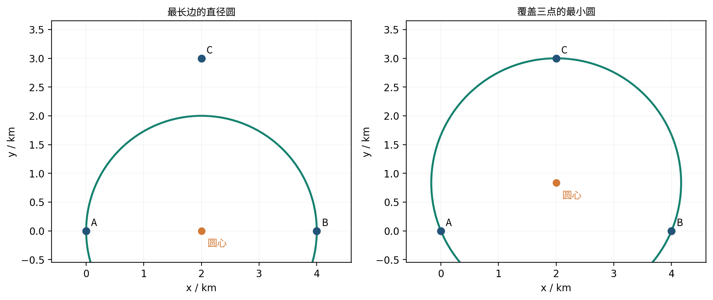

# 第 2 章　包围圆与最坏选址

三个村庄在一张平面地图上的坐标是 $A=(0,0)$、$B=(6,0)$、$C=(3,2)$，坐标单位为千米。现在要建一座消防站，允许建在平面上的任意位置；暂时把消防车行驶距离看作直线距离，忽略道路和地形。村庄的位置已经知道，消防站的位置还不知道。我们希望最远村庄到消防站的距离尽可能短。消防站应该建在哪里，最远需要走多少千米？这是本章的第一个教学算例，数字为自编。

## 基本理论　包围圆、极小极大与数值搜索

**定义 2.1（最小包围圆）。** 对非空有界闭集 $P\subset\mathbb R^2$，中心 $c$ 对应的最远距离为 $r_P(c)=\max_{x\in P}\|x-c\|$；在自由平面内选择中心，定义 $R(P)=\min_c r_P(c)$。两个量的量词不同：先固定中心才求该中心的最远点，然后在中心中取最小。若 $P$ 是凸多边形，任意内部点是顶点的凸组合；范数的凸性保证 $r_P(c)=\max_{v\in V(P)}\|v-c\|$。所以仅顶点参与数值求圆，但圆仍覆盖整个 $P$。

**定理 2.1（支撑点结构）。** 平面上有限非空点集的最小包围圆由至多三个圆周上的输入点决定：若由两个不同点决定，这两个点构成直径；若必须由三个点决定，它们不共线，圆是三点外接圆。此处的“决定”表示对这组支撑点求出的最小圆恰好覆盖全部输入点；任取三个点的外接圆通常并不是最终答案。证明思想是：若圆周上所有接触方向落在某个开半圆，圆心就能向接触点一侧微移并降低最大距离，与最小性矛盾；平面上围住圆心所需的接触方向可取不超过三个。后面的成对、三点枚举因此是一个**有穷且完备**的算法。

把证明补成可复述的步骤。设最优圆心为 $c_*$、半径为 $R_*>0$，令 $E=\{p:\|p-c_*\|=R_*\}$ 为接触点。如果零向量不在 $\operatorname{conv}\{p-c_*:p\in E\}$ 内，由有限点集的严格分离性质，存在单位方向 $d$ 使所有接触点都满足 $d\cdot(p-c_*)>0$。将圆心沿 $d$ 移动极小的 $t>0$，对接触点有 $\|p-(c_*+td)\|^2=R_*^2-2t\,d\cdot(p-c_*)+t^2<R_*^2$；非接触点原本有严格余量，有限多个点可同时保持小于 $R_*$。这和最小性矛盾。故零向量在接触方向的凸包内。

平面凸组合若用了四个或更多向量，它们的系数存在仿射依赖；沿这组依赖调整系数、保持非负与和为 1，直到至少一个系数变零，重复后只需至多三个接触方向。若恰需两个等长向量的正系数组合为零，它们必相反且权重各半，两个接触点是直径两端。若需三个不共线接触点，圆心与它们等距，圆为外接圆。这完成“至多三点”的理论依据；三点外接圆仍要逐点验证是否包住全部输入。

**命题 2.2（逐点增量算法的不变量）。** 把有限点依某一顺序逐个加入。处理前 $i$ 点后，保持的圆必须是这 $i$ 点的最小包围圆；若新点落在当前圆内，圆仍最小，因为旧点集已给出相同下界。若新点 $p_i$ 在外，新的最小圆必以 $p_i$ 为支撑点，否则删去它不会改变最优圆，和它在旧圆外矛盾。固定 $p_i$ 后，重新扫描以前的点；遇到圈外点 $p_j$，在这一受限子问题中再固定两个支撑点；若又遇圈外点 $p_k$，用三点圆。每层循环只处理更小的已处理前缀，并复核候选圆是否覆盖该前缀。这个不变量解释为什么程序有一、二、三层循环；它不是“三个任意点的外接圆一定正确”。对退化共线点须采用最长直径圆或等价处理，数值实现还需检查浮点余量。

更具体地，外层每处理 $p_i$ 保存前缀最小圆；当 $p_i$ 在外时，内层建立一个**必须让 $p_i$ 位于边界**的最小圆，并逐个纳入 $p_1,\ldots,p_{i-1}$。内层若遇到新点 $p_j$ 在外，则在当前前缀的受限问题中，$p_i,p_j$ 都成为边界约束，继续扫描更早的点；第三层每遇到圈外点 $p_k$，用 $p_i,p_j,p_k$ 构造决定圆，再处理下一个较早点。循环完内层，得到加入 $p_i$ 后的前缀最小圆。随机重排改变遇到“圈外”的频率和平均运行成本，不改变最后必须覆盖全部点的数学定义。

**定义 2.2（先决策、后受扰动的极小极大）。** 设先选行动 $s\in S$，其后自然状态或报告 $y\in Y(s)$ 才发生；损失为 $\ell(s,y)$。鲁棒决策写为 $\inf_{s\in S}\sup_{y\in Y(s)}\ell(s,y)$。内层 $\sup$ 表示在既定行动下发生最坏的允许情况，外层 $\inf$ 表示预先选使该最坏损失尽量小的行动；若最优行动确实存在，$\inf$ 可写成 $\min$。只有在不确定量的允许集合 $Y$ 与行动无关时，才可以另行比较 $\inf_s\sup_{y\in Y}\ell(s,y)$ 与 $\sup_{y\in Y}\inf_s\ell(s,y)$；后者让行动在看到 $y$ 后选取，是信息更多的另一个问题。当允许报告本身为 $Y(s)$ 时，不能机械交换两个符号而不重定行动—报告的允许关系。

对于二次观测，第一次得到的相容集合记作 $P_0$。第二站位 $s$ 必须属于安全站域 $S_{\rm safe}$；该站可能出现的报告集为 $Y(s)$；收到报告 $y$ 后留下的相容集记为 $P(s,y)\subseteq P_0$。若以最小包围圆半径评价最坏定位质量，一般模型为

$$
V^*=\inf_{s\in S_{\rm safe}}\sup_{y\in Y(s)}
\underbrace{\min_{c\in\mathbb R^2}\max_{x\in P(s,y)}\|x-c\|}_{R(P(s,y))}.
\tag{理2.1}
$$

从左到右读成“先选安全站、再遇到最坏可实现报告、报告固定后才选最小包围圆圆心、最后检查剩余候选点中的最远者”。这里的 $s,y,c,x$ 是四种不同的变量；圆心 $c$ 是**报告之后**为评价后验集合计算的，它不必是第二测点 $s$。若用外包络 $\widetilde P(s,y)\supseteq P(s,y)$ 代替后验集合，由包含关系得 $R(P(s,y))\le R(\widetilde P(s,y))$；数值外包结果是保守上界，不能反推真实最优值相等。

**定义 2.3（有限搜索与认证）。** 用站位网格 $S_h\subset S_{\rm safe}$ 和报告采样 $Y_h(s)\subset Y(s)$ 代替连续集合，可计算一个有限表：对每个站位遍历报告、计算包围圆、记采样最大值，再从站位中取最小值。只采样报告会漏掉更坏报告，只采样站位会漏掉更优站位；两种截断朝不同方向作用，因此一个有限表的最小项本身既不是连续问题的最优性证明，也未必构成单向误差界。要声称全局误差界，必须另给网格间函数变化的界或区间证书。

**命题 2.3（黄金分割搜索的前提）。** 若连续函数 $f$ 在闭区间 $[a,b]$ 上有唯一峰点，且在峰点之前严格递增、之后严格递减，可在内部放两点 $x_1=b-\tau(b-a)$、$x_2=a+\tau(b-a)$，其中 $\tau=(\sqrt5-1)/2$。若 $f(x_1)<f(x_2)$，峰点在 $[x_1,b]$；若 $f(x_1)>f(x_2)$，峰点在 $[a,x_2]$；若相等，在上述严格单峰前提下峰点处于 $[x_1,x_2]$。据此舍弃不可能包含峰点的一侧，并复用旧采样点；非等值的标准步骤每轮区间长度乘以 $\tau$。有平坦段、多峰或采样舍入导致等值时，不能随意沿用某一侧删除并宣称全局保证；本题将其作为内层局部数值细化。计算停止条件可取区间宽度小于容差，有限精度下还应限制轮数。本章后面从区间自相似推导 $\tau$。

以下村庄例先算 $R(P)$；再将“站位先定、报告后发生”的量词链带入第二站模型。计算结果需按上述前提注明是定理、保守界还是有限搜索近似。

## 1　从最远村庄到最小包围圆

### 1.1　先只管两个村庄

先暂时盖住地图上的 $C$。假设消防站建在 $c=(x,y)$，其中 $x,y$ 是以千米为单位的未知坐标。无论怎样选 $c$，从 $A$ 经 $c$ 到 $B$ 的折线路程都不会短于 $AB$ 的直线距离，因此

$$
6=\|A-B\|\le \|A-c\|+\|c-B\|.
$$

这里 $\|p-q\|$ 表示两点 $p,q$ 的直线距离。若消防站到两个村庄的距离都小于 $3$，右边就小于 $6$，与上式矛盾。因此，**任何选址的最远服务距离都至少为 $3$ km**。

这个下界能达到吗？把消防站放在中点 $c=(3,0)$，就有

$$
\|c-A\|=3,\qquad \|c-B\|=3.
$$

下界为 $3$，又找到了达到 $3$ 的选址，所以两村问题的最优答案已经确定。

现在把 $C$ 放回地图。它到 $c=(3,0)$ 的距离是

$$
\sqrt{(3-3)^2+(2-0)^2}=2<3.
$$

三个村庄都在以 $(3,0)$ 为圆心、$3$ km 为半径的圆盘内；而 $A,B$ 仍然使任何服务半径都不能小于 $3$。所以原问题的答案仍是

$$
\boxed{c_*=(3,0)\ \mathrm{km},\qquad R_*=3\ \mathrm{km}.}
$$

我们用了两个不同的步骤：先说明任何方案都不能更小，再检查一个方案确实达到这个值。只画出一个能罩住村庄的圆，还没有完成“最小”的证明。

### 1.2　把这次计算写成一般模型

设需要服务的位置集合为 $P$。它可以是有限个村庄，也可以是一整片可能起火的区域。对一个已经选定的站点 $c$，所需服务半径为

$$
r(c;P)=\max_{g\in P}\|c-g\|.
$$

$g$ 表示集合 $P$ 中的一个位置；$r(c;P)$ 与坐标使用相同的长度单位。最大号表示要检查全部位置，其中最远的那个决定服务半径。继续选择最好的站点，得到

$$
\boxed{R(P)=\min_{c\in\mathbb R^2}\max_{g\in P}\|c-g\|.}
$$

$R(P)$ 叫作 **最小包围圆半径**。最小包围圆的英文是 minimum enclosing circle，缩写为 MEC。达到这个半径的 $c$ 叫作最小包围圆圆心。覆盖要求包含圆内部，因此几何对象严格说是闭圆盘：

$$
B(c,r)=\{g:\|g-c\|\le r\}.
$$

以后我们仍按习惯称“包围圆”。对非空有限点集和非空有界闭多边形，本章中的最小值、最大值都可以达到。空集代表没有相容位置，要单独处理；它不需要被当成一个普通定位区域去求圆心。

若上一章已经把区域写成一个凸多边形，只检查顶点就够了。理由如下：多边形中的任一点 $g$ 都能写成顶点 $v_1,\ldots,v_n$ 的加权平均

$$
g=\sum_i\lambda_i v_i,\qquad \lambda_i\ge0,\qquad\sum_i\lambda_i=1.
$$

若每个顶点都满足 $\|v_i-c\|\le r$，则由三角不等式

$$
\|g-c\|\le\sum_i\lambda_i\|v_i-c\|
\le\sum_i\lambda_i r=r.
$$

所以覆盖全部顶点的圆盘也覆盖多边形内部。这一步把“检查无穷多个位置”变成了“检查有限个顶点”。

### 1.3　换一组数据：最远点对的中点可能不够

把村庄改为 $A=(0,0)$、$B=(4,0)$、$C=(2,3)$，单位仍为千米。这也是教学算例。

三条边的长度为

$$
AB=4,\qquad AC=BC=\sqrt{13}\approx3.606.
$$

最远点对是 $A,B$。以 $AB$ 为直径的圆，圆心为 $(2,0)$，半径为 $2$；但是 $C$ 到圆心的距离为 $3$，在圆外。因此不能把“最远点对距离的一半”直接当成最小包围圆半径。

怎样求真正的圆心？先利用左右对称。任意中心 $(x,y)$ 到 $A,B$ 的最大距离为

$$
\sqrt{(2+|x-2|)^2+y^2}.
$$

把横坐标改成 $2$，这个量不会增加；到 $C$ 的距离也从 $\sqrt{(x-2)^2+(y-3)^2}$ 降为 $|y-3|$。因此至少有一个最优中心位于直线 $x=2$ 上。

令中心为 $(2,y)$。在 $0\le y\le3$ 内，两项需要同时照顾的距离是

$$
d_{AB}(y)=\sqrt{4+y^2},\qquad d_C(y)=3-y.
$$

第一项随 $y$ 增加而增加，第二项随 $y$ 增加而减少。若两项还不相等，就能向较大项下降的方向挪一点，直到两者相遇。因此最优处满足

$$
\sqrt{4+y^2}=3-y.
$$

两边非负，可以平方：

$$
4+y^2=9-6y+y^2
\quad\Longrightarrow\quad y=\frac56.
$$

对应半径为 $3-5/6=13/6$。$y<0$ 时到 $C$ 的距离大于 $3$；$y>3$ 时到 $A$ 的距离大于 $\sqrt{13}$，都不可能优于这个结果。于是

$$
\boxed{c_*=(2,5/6),\qquad R(P)=13/6\approx2.166667\ \mathrm{km}.}
$$



这一次三个村庄都在圆周上。对三个不共线的点，这个圆也叫它们的外接圆。

把四个容易构造的候选圆全部列出来，可以再次核验：

| 候选圆 | 圆心 | 半径 | 覆盖检查 |
|---|---|---:|---|
| 以 $AB$ 为直径 | $(2,0)$ | $2$ | 到 $C$ 为 $3$，失败 |
| 以 $AC$ 为直径 | $(1,1.5)$ | $\sqrt{13}/2$ | 到 $B$ 为 $\sqrt{11.25}$，失败 |
| 以 $BC$ 为直径 | $(3,1.5)$ | $\sqrt{13}/2$ | 到 $A$ 为 $\sqrt{11.25}$，失败 |
| 三点外接圆 | $(2,5/6)$ | $13/6$ | 三个距离都为 $13/6$，通过 |

### 1.4　从小例得到一个有限算法

平面有限点集的最小包围圆可以由至多三个边界点确定：只有一个不同点时半径为零；两个点起决定作用时，它们是直径两端；三个点起决定作用时，圆是三点的外接圆。这个基本性质也可在 [CGAL 的最小包围圆文档](https://doc.cgal.org/latest/Bounding_volumes/classCGAL_1_1Min__circle__2.html)中核对。

直观地说，若所有接触圆周的点都挤在某个开半圆内，圆心还能向这些点移动一点并缩小半径，原圆就不是最小的。最小圆的边界接触点必须从不同方向“撑住”圆心；在平面上，两个相对点或三个合适的点就能提供这种限制。

据此可以写出一个适合手算的完整算法。

**输入：** 非空有限点集 $v_1,\ldots,v_n$。**输出：** 一个覆盖全部点且半径最小的圆。

1. 若只有一个不同点，返回该点和半径 $0$，停止。
2. 对每一对不同点，计算中点和半距离，得到一个直径圆。
3. 对每组三个不共线的点，解“到三个点距离相等”的方程，得到外接圆；共线的三点不构造外接圆。具体做法是设圆心 $c=(x,y)$、三点为 $v_1,v_2,v_3$，写 $\|c-v_1\|^2=\|c-v_2\|^2$ 和 $\|c-v_1\|^2=\|c-v_3\|^2$；把每式两边展开，$x^2+y^2$ 都会抵消，剩下关于 $x,y$ 的两条一次方程。先解出圆心，再代回任一等距式求半径。
4. 对每个候选圆，逐点检查距离是否不超过半径；只保留全部通过的候选圆。
5. 全部候选检查完毕后，在保留的圆中选择半径最小者，停止。

上一节的表就是 $n=3$ 时的完整执行记录。点多时，这样枚举会做很多重复工作；后文源码使用增量算法。不过它最后仍然要完成同一件事：给出圆心，并核对全部顶点是否被覆盖。

顺便记住直径与半径的关系。若 $D(P)$ 是区域中最远两点的距离，那么任意覆盖圆都满足

$$
D(P)\le2R(P).
$$

因此 $D(P)/2$ 是半径的下界。第二个村庄例子中，$D(P)/2=2$，而 $R(P)=13/6$，说明这个下界有时达不到。

## 2　第二个观测站为什么比较最坏报告

### 2.1　先把“还不知道什么”写清楚

仍考虑消防问题。现在真正起火的仓库只有一处，但第一次观测后还不能确定是哪一处。三个可能位置为

$$
P=(0,0),\qquad Q=(4,0),\qquad T=(4,3),
$$

单位为千米。第一观测站在 $s_1=(-20,0)$，方向报告为正东 $0^\circ$，误差不超过 $15^\circ$。三个仓库的真实方位分别为 $0^\circ,0^\circ,\arctan(3/24)\approx7.125^\circ$，因此它们都与第一次报告相容。设已知火源只能在这三个仓库之一，所有观测站的视距都足够远，没有遮挡。上述数据与规则均为教学自编。

第一次报告之后、第二次报告之前，可能位置集合是

$$
F_1=\{P,Q,T\}.
$$

这里的“先验”只表示**第二次观测前保留的可能位置**，没有给三个位置分配概率。

现在可选的第二站是 $s_A=(-4,0)$ 或 $s_B=(4,-4)$。第二次报告记作 $z$，误差仍不超过 $15^\circ$。我们必须先选站，到站后才知道 $z$，然后才能确定消防车的集合覆盖中心。

### 2.2　枚举相容报告，算出两个站的分数

在 $s_A$ 处，指向 $P,Q$ 的真实方位都是 $0^\circ$，指向 $T$ 的真实方位是

$$
\theta_T=\arctan(3/8)\approx20.556^\circ.
$$

真实方位为 $\theta$ 时，允许报告是 $[\theta-15^\circ,\theta+15^\circ]$。为便于写区间，接近正东的角度暂时用负数表示，不在 $0^\circ$ 处断开。

| 第二站 $s_A$ 的报告 $z$ | 与报告相容的位置 | 最小包围圆圆心 | 半径/km |
|---|---|---|---:|
| $[-15^\circ,5.556^\circ)$ | $P,Q$ | $(2,0)$ | $2$ |
| $[5.556^\circ,15^\circ]$ | $P,Q,T$ | $(2,1.5)$ | $2.5$ |
| $(15^\circ,35.556^\circ]$ | $T$ | $T$ | $0$ |

表中 $5.556^\circ$ 和 $35.556^\circ$ 分别代表未四舍五入的 $\theta_T-15^\circ$、$\theta_T+15^\circ$。第二行的三角形在 $Q$ 处为直角，斜边 $PT=5$，以 $PT$ 为直径的圆覆盖三点，所以半径是 $2.5$。其余报告不能由三个候选仓库中的任何一个产生，应排除。

在 $s_B$ 处，指向 $Q,T$ 的方位都是 $90^\circ$，指向 $P$ 的方位是 $135^\circ$。报告区间为

$$
Q,T:\ [75^\circ,105^\circ],\qquad
P:\ [120^\circ,150^\circ].
$$

这两个区间互不相交。因此报告落在前一区间时，后验集合是 $\{Q,T\}$，圆心为 $(4,1.5)$、半径为 $1.5$；落在后一区间时，后验集合是 $\{P\}$，半径为 $0$。

两个站的结果可以压缩成一张决策表：

| 第二站 | 可能出现的后验半径/km | 最坏后验半径/km |
|---|---|---:|
| $s_A$ | $2,2.5,0$ | $2.5$ |
| $s_B$ | $1.5,0$ | $1.5$ |

若要求无论允许的报告是什么都能应付，就应选 $s_B$。这个决定没有使用报告出现的频率；题目只给误差范围，所以我们比较其中最大的半径。

### 2.3　从表格提炼量词顺序

给定第二站 $s$ 和报告 $z$，把相容位置集合记为 $F_2(s,z)$，也叫收到报告后的后验集合。下标 $2$ 表示已经使用两次观测。令

$$
Y(s)=\{z:F_2(s,z)\ne\varnothing\}
$$

表示可实现的报告集合。一个报告只有在至少有一个位置能解释它时，才属于 $Y(s)$。

站点 $s$ 的最坏分数为

$$
Q_R(s)=\max_{z\in Y(s)}R(F_2(s,z)).
$$

如果允许的第二站集合为 $\mathcal S$，选址问题就是

$$
\boxed{\min_{s\in\mathcal S}\ \max_{z\in Y(s)}R(F_2(s,z)).}
$$

把半径定义代入，还可以写成

$$
\min_{s\in\mathcal S}\ \max_{z\in Y(s)}\quad
\min_{c\in\mathbb R^2}\ \max_{g\in F_2(s,z)}\|c-g\|.
$$

四层符号对应四个具体问题：

| 顺序 | 变量 | 此时做什么 |
|---|---|---|
| 1 | 第二站 $s$ | 根据已有观测选站 |
| 2 | 报告 $z$ | 检查这个站可能收到的各种报告 |
| 3 | 覆盖中心 $c$ | 收到这一报告后，为对应后验集合选中心 |
| 4 | 位置 $g$ | 检查该中心能否覆盖集合中的每个位置 |

不同报告可以对应不同的覆盖中心。也不能把某个仓库的位置与一个它根本不可能产生的报告拼在一起；相容集合 $F_2(s,z)$ 正是用来保持这层联系的。

## 3　把两站问题变成能够逐步运行的数值搜索

### 3.1　一个连续位置的教学算例

为了看清每次计算，换成一条笔直的防火带。第一次观测和地形信息已经把火源限定在线段

$$
F_1=\{(x,0):0\le x\le4\}\quad\text{（km）}.
$$

可以把第一站理解为 $s_1=(-1,0)$，它在这个简化例子中给出了无角误差的正东方向；防火带的位置和两端已经另行知道。第二站只能在 $s=(0,h)$ 处选择，高度参数满足 $1\le h\le4$ km。这里的 $h$ 是地图上的南北坐标，不是离地高度。第二次方向误差为 $\delta=15^\circ$，全部位置均可见。

本小节把方向角从第二站的**竖直向下方向**向右量。真实火源为 $(x,0)$ 时，由直角三角形可得

$$
\tan\theta=\frac{x}{h},\qquad
\theta=\arctan(x/h).
$$

真实角度范围为 $0\le\theta\le\theta_{\max}$，其中

$$
\theta_{\max}=\arctan(4/h).
$$

收到报告 $z$ 后，真实角度既要符合 $[z-15^\circ,z+15^\circ]$，又要属于原来的真实角度范围，所以

$$
\alpha=\max(0,z-15^\circ),\qquad
\beta=\min(\theta_{\max},z+15^\circ).
$$

若 $\alpha>\beta$，交集为空，报告不可实现；否则后验线段的两端为

$$
x_-=h\tan\alpha,\qquad x_+=h\tan\beta.
$$

它的最小包围圆很容易算：

$$
\boxed{
c(s,z)=\left(\frac{x_-+x_+}{2},0\right),\qquad
R(s,z)=\frac{x_+-x_-}{2}.}
$$

这给出了一个完整的“评价器”：输入 $h,z$，先交角度区间，再算两个端点，最后返回圆心和半径。整个过程没有求导。

### 3.2　先固定站点，粗找最坏报告

固定 $h=1$ km。此时 $\theta_{\max}=\arctan4\approx75.963757^\circ$，可实现报告范围为

$$
-15^\circ\le z\le90.963757^\circ.
$$

记 $f(z)=R((0,1),z)$。用刚才的评价器得到下表。表中角度采用度数，半径采用千米；区间端点按精确表达式代入，显示时才四舍五入。

| 报告 $z$ | $x_-$ | $x_+$ | $f(z)$ |
|---:|---:|---:|---:|
| $-15$ | $0$ | $0$ | $0$ |
| $0$ | $0$ | $\tan15^\circ=0.267949$ | $0.133975$ |
| $15$ | $0$ | $\tan30^\circ=0.577350$ | $0.288675$ |
| $30$ | $0.267949$ | $1$ | $0.366025$ |
| $45$ | $0.577350$ | $1.732051$ | $0.577350$ |
| $60$ | $1$ | $3.732051$ | $1.366025$ |
| $75$ | $1.732051$ | $4$ | $1.133975$ |
| $90.963757$ | $4$ | $4$ | $0$ |

在已算的报告中，$60^\circ$ 的半径最大。它比相邻的 $45^\circ$ 和 $75^\circ$ 都大，所以接下来可以在 $[45^\circ,75^\circ]$ 中细找。

为什么这个小区间适合只保留一部分、逐步缩短？在上端尚未碰到 $x=4$ 时，

$$
f(z)=\frac{\tan(z+15^\circ)-\tan(z-15^\circ)}2
=\frac{\sin30^\circ}{2\cos(z+15^\circ)\cos(z-15^\circ)}.
$$

在这里的角度范围内，两项余弦都为正，并随 $z$ 增加而减小，因此 $f(z)$ 增加。上端到达 $4$ 后，

$$
f(z)=\frac{4-\tan(z-15^\circ)}2,
$$

它随 $z$ 增加而减小。于是这个区间只有一个峰：先增加，再减少。这样的函数称为单峰函数。本例的峰恰在

$$
z_*+15^\circ=\arctan4,
\qquad z_*\approx60.963757^\circ.
$$

有了这个独立结果，接下来便能核验数值搜索是否在找正确的地方。

### 3.3　黄金分割：每轮保留一个旧结果

现在假设只调用评价器，不利用刚才的峰位置公式。输入一个含有单峰的区间 $[a,b]$，目的是找函数 $f$ 的**最大值**。令

$$
\tau=\frac{\sqrt5-1}{2}\approx0.618034,
$$

并在区间内选两点

$$
u=b-\tau(b-a),\qquad v=a+\tau(b-a),\qquad u<v.
$$

若 $f(u)\ge f(v)$，可以保留 $[a,v]$：若所有最大点都在 $v$ 的右侧，函数从 $u$ 到 $v$ 应当仍在增加，与比较结果矛盾。若 $f(u)<f(v)$，同理保留 $[u,b]$。这里采用的单峰条件是先严格增加、后严格减少，最高处可以是一段平台；保留的区间至少含有一个最大点。

为什么选 $0.618034$？以保留左区间为例，新长度为 $\tau(b-a)$。希望旧点 $u$ 正好成为新区间的右内点，就要求

$$
1-\tau=\tau^2.
$$

解 $\tau^2+\tau-1=0$ 得到上述正根。这样每轮只需再算一个新点，另一个函数值可以直接沿用。

**可以照着执行的状态更新：**

1. 保存 $a,b,u,v,f(u),f(v)$ 六个量。
2. 若 $f(u)\ge f(v)$，令新 $b=v$，把旧 $u$ 和旧 $f(u)$ 移到新 $v,f(v)$；再按公式计算新 $u$ 和 $f(u)$。
3. 否则令新 $a=u$，把旧 $v$ 和旧 $f(v)$ 移到新 $u,f(u)$；再计算新 $v$ 和 $f(v)$。
4. 若区间宽度仍大于事先给定的角度容差，重复第 2–3 步。
5. 停止时再比较区间端点、两个内点及中点，返回其中实际算到的最大值及对应角度，同时保留最终区间。

对 $[45^\circ,75^\circ]$ 运行，取停止条件 $b-a\le1^\circ$，得到下表。计算用未舍入的数继续迭代；表格只为阅读而保留小数。

| 轮次 | 本轮 $[a,b]$/度 | $u$/度 | $f(u)$/km | $v$/度 | $f(v)$/km | 保留区间/度 |
|---:|---|---:|---:|---:|---:|---|
| 0 | $[45,75]$ | 56.459 | 1.0491 | 63.541 | 1.4340 | $[56.459,75]$ |
| 1 | $[56.459,75]$ | 63.541 | 1.4340 | 67.918 | 1.3385 | $[56.459,67.918]$ |
| 2 | $[56.459,67.918]$ | 60.836 | 1.4664 | 63.541 | 1.4340 | $[56.459,63.541]$ |
| 3 | $[56.459,63.541]$ | 59.164 | 1.2771 | 60.836 | 1.4664 | $[59.164,63.541]$ |
| 4 | $[59.164,63.541]$ | 60.836 | 1.4664 | 61.869 | 1.4663 | $[59.164,61.869]$ |
| 5 | $[59.164,61.869]$ | 60.197 | 1.3886 | 60.836 | 1.4664 | $[60.197,61.869]$ |
| 6 | $[60.197,61.869]$ | 60.836 | 1.4664 | 61.231 | 1.4780 | $[60.836,61.869]$ |
| 7 | $[60.836,61.869]$ | 61.231 | 1.4780 | 61.475 | 1.4736 | $[60.836,61.475]$ |

八次缩短后的宽度为 $30\tau^8\approx0.638588^\circ$，满足停止条件。最后五个检查点为

| 角度/度 | 60.835921 | 61.079840 | 61.155215 | 61.230590 | 61.474508 |
|---|---:|---:|---:|---:|---:|
| 半径/km | 1.466396 | 1.480789 | 1.479420 | 1.478047 | 1.473579 |

本次返回的已评价最大值为 $1.480789$ km，对应 $61.079840^\circ$。作为核验，精确峰值为

$$
f(z_*)=\frac{4-\tan(\arctan4-30^\circ)}2
\approx1.482890\ \mathrm{km}.
$$

两者的差约为 $0.002101$ km。角度容差限定的是搜索区间宽度；若没有额外的函数变化率信息，不能把 $1^\circ$ 自动换算成一个半径误差上限。

### 3.4　换数据复算：防火带缩短到 2 km

保持第二站 $(0,1)$ 和误差 $15^\circ$，只把先验线段改成 $0\le x\le2$。评价器只需将 $\theta_{\max}$ 改成 $\arctan2\approx63.434949^\circ$，其余步骤不变。

粗算有 $f(30^\circ)=0.366025$、$f(45^\circ)=0.577350$、$f(60^\circ)=0.5$，选区间 $[30^\circ,60^\circ]$。本次取停止宽度 $5^\circ$。

| 轮次 | 本轮区间/度 | $u$/度 | $f(u)$/km | $v$/度 | $f(v)$/km | 保留区间/度 |
|---:|---|---:|---:|---:|---:|---|
| 0 | $[30,60]$ | 41.459 | 0.5054 | 48.541 | 0.6685 | $[41.459,60]$ |
| 1 | $[41.459,60]$ | 48.541 | 0.6685 | 52.918 | 0.6105 | $[41.459,52.918]$ |
| 2 | $[41.459,52.918]$ | 45.836 | 0.5975 | 48.541 | 0.6685 | $[45.836,52.918]$ |
| 3 | $[45.836,52.918]$ | 48.541 | 0.6685 | 50.213 | 0.6471 | $[45.836,50.213]$ |

宽度 $30\tau^4\approx4.376941^\circ<5^\circ$，停止。最后依次检查五个角度与半径：

| 角度 / 度 | 半径 / km |
|---:|---:|
| 45.835921 | 0.597478 |
| 47.507764 | 0.642179 |
| 48.024392 | 0.657332 |
| 48.541020 | 0.668542 |
| 50.212862 | 0.647121 |

因此返回 $48.541020^\circ$ 及 $0.668542$ km。

同样可以独立核验：峰在 $\arctan2-15^\circ\approx48.434949^\circ$，精确峰值为

$$
\frac{2-\tan(\arctan2-30^\circ)}2\approx0.669873\ \mathrm{km}.
$$

换了数据以后，搜索区间、函数值和最后结果都变了，但每轮六个状态量的更新规则完全相同。

### 3.5　再选择站点：外层用粗网格和细网格

回到长 $4$ km 的防火带，允许 $1\le h\le4$。每选一个 $h$，都应先求这个站的最坏报告半径，再比较不同站的分数。为便于手算，本例还能把内层结果化成一个明确公式。

最坏报告恰好让后验右端到达 $4$，因此

$$
z_* = \arctan(4/h)-15^\circ.
$$

在本例的 $h$ 范围内，$\arctan(4/h)\ge45^\circ>30^\circ$，后验左端仍在防火带内部。利用正切差角公式，

$$
x_-=h\tan\bigl(\arctan(4/h)-30^\circ\bigr)
=\frac{h(4-h/\sqrt3)}{h+4/\sqrt3}.
$$

所以站点的最坏分数为

$$
\boxed{Q(h)=\frac{4-x_-}{2}
=\frac{h^2+16}{2(\sqrt3h+4)}\quad\mathrm{km}.}
$$

先用 $1$ km 的粗步长计算全部粗候选：

| $h$/km | 1 | 2 | 3 | 4 |
|---|---:|---:|---:|---:|
| $Q(h)$/km | 1.482890 | 1.339746 | 1.359264 | 1.464102 |

粗网格中最好的是 $h=2$。在它前后各一个粗步长内，即 $[1,3]$，再用 $0.25$ km 的细步长计算：

| $h$/km | $Q(h)$/km |
|---:|---:|
| 1.00 | 1.482890 |
| 1.25 | 1.424357 |
| 1.50 | 1.382979 |
| 1.75 | 1.355587 |
| 2.00 | 1.339746 |
| 2.25 | 1.333557 |
| 2.50 | 1.335514 |
| 2.75 | 1.344410 |
| 3.00 | 1.359264 |

全部细候选计算完就停止。此次返回 $h=2.25$ km、分数 $1.333557$ km。这个结果的准确含义是：在本次评价过的站点中，它的最坏报告半径最小。

本例可以用代数核验精确答案：

$$
Q(h)-\frac43
=\frac{(\sqrt3h-4)^2}{6(\sqrt3h+4)}\ge0.
$$

当 $h=4/\sqrt3\approx2.309401$ km 时等号成立，精确最小值为 $4/3$ km。细网格没有恰好踩中这个高度，所以返回值略大。

把外层算法也写成能够执行的步骤：

1. 给定站点参数的允许区间、粗步长和细步长。
2. 按粗步长列出候选站点，逐个调用“该站的最坏报告”评价器。
3. 取粗候选中分数最小者，在它附近一个粗步长的范围内列细候选，并截断到允许区间内。
4. 对细候选再次评价；全部评价完，返回所有已评价站点中分数最小者。

这是一条明确的省算规则：把细算集中到粗网格中表现好的位置附近。若分数函数在别处有窄而低的谷，粗网格可能没有发现它。实际没有单峰依据时，这种有限比较比直接对整段区间使用黄金分割更容易说明自己究竟比较了哪些位置。

到这里，应当分清两个搜索：**内层为一个已选站点寻找大的后验半径，外层寻找小的最坏半径。** 本节的黄金分割在内层做最大化；外层网格在站点之间做最小化。

## 4　课内练习：先做完，再翻答案

以下坐标均为教学自编，长度单位为千米。每题应写计算过程。

1. 三个村庄为 $(0,0),(8,0),(4,3)$。求最小包围圆，并给出“不能更小”的理由。
2. 三个村庄为 $(0,0),(6,0),(3,4)$。检查最远点对的直径圆，再利用对称性求真正的最小包围圆。
3. 第 2 节的仓库 $T$ 改成 $(4,4)$，两个候选站及 $15^\circ$ 误差保持不变。分别列出可实现报告的分组，比较最坏半径并选站。
4. 长 $4$ km 的防火带例中，第二站取 $(0,2)$，报告为 $45^\circ$。求后验线段、最小包围圆，并说明这个报告对应的半径是否等于该站的最坏半径。
5. 对一个已确认单峰的报告评分函数，当前区间为 $[10^\circ,20^\circ]$。按黄金分割取两个内点，计算得到左内点分数为 $7$ m、右内点分数为 $9$ m。写出下一轮保留区间、可直接复用的点及新计算点。

## 5　课内练习答案

### 第 1 题

两端村庄距离为 $8$，所以任何覆盖半径都至少为 $4$。中点为 $(4,0)$，到第三个村庄的距离是 $3$，其余两点距离均为 $4$。因此圆心 $(4,0)$、半径 $4$ 达到下界，是最优答案。

### 第 2 题

底边长 $6$，另外两边长 $5$。最远点对中点为 $(3,0)$，对应半径 $3$，但到第三点的距离为 $4$，不能覆盖。

由对称性可取中心 $(3,y)$。在 $0\le y\le4$ 内平衡两项距离：

$$
\sqrt{9+y^2}=4-y
\ \Longrightarrow\ 9+y^2=16-8y+y^2
\ \Longrightarrow\ y=7/8.
$$

半径为 $4-7/8=25/8=3.125$。把中心移到 $y<0$ 或 $y>4$ 都会使至少一项距离更大，因此圆心 $(3,7/8)$、半径 $25/8$ 就是最优答案。

### 第 3 题

在 $s_A=(-4,0)$，$P,Q$ 的真实方位为 $0^\circ$，$T$ 的真实方位为 $\arctan(4/8)\approx26.565051^\circ$。因此 $P,Q$ 的报告区间为 $[-15^\circ,15^\circ]$，$T$ 的报告区间为 $[11.565051^\circ,41.565051^\circ]$。

三个报告段的后验集合依次为 $\{P,Q\}$、$\{P,Q,T\}$、$\{T\}$；中间重叠段为 $[11.565051^\circ,15^\circ]$。对应半径为 $2,2\sqrt2,0$，因为中间三角形的斜边 $PT=4\sqrt2$。所以 $Q_R(s_A)=2\sqrt2\approx2.828427$。

在 $s_B=(4,-4)$，$Q,T$ 的方位仍为 $90^\circ$，$P$ 的方位仍为 $135^\circ$；报告区间仍为 $[75^\circ,105^\circ]$ 与 $[120^\circ,150^\circ]$。前一段后验为 $\{Q,T\}$，半径 $QT/2=2$；后一段为单点，半径 $0$。因此 $Q_R(s_B)=2$，应选 $s_B$。

### 第 4 题

$\theta_{\max}=\arctan(4/2)=\arctan2\approx63.434949^\circ$。报告允许真实角度 $[30^\circ,60^\circ]$，完全在先验真实角度范围内。于是

$$
x_-=2\tan30^\circ=2/\sqrt3,\qquad
x_+=2\tan60^\circ=2\sqrt3.
$$

后验线段为 $[2/\sqrt3,2\sqrt3]\times\{0\}$。圆心横坐标为 $4/\sqrt3\approx2.309401$，半径为 $2/\sqrt3\approx1.154701$。而 $Q(2)=20/[2(2\sqrt3+4)]\approx1.339746$，所以这个报告还没有达到最坏值。最坏报告是 $\arctan2-15^\circ\approx48.434949^\circ$。

### 第 5 题

初始两个内点为

$$
u=20-10\tau\approx13.819660^\circ,\qquad
v=10+10\tau\approx16.180340^\circ.
$$

因为左分数 $7<9$，做最大化时保留 $[13.819660^\circ,20^\circ]$。旧右内点 $16.180340^\circ$ 成为新左内点，其分数 $9$ 可以复用。新右内点为

$$
13.819660+\tau(20-13.819660)
\approx17.639320^\circ.
$$

只需评价这个新角度的分数。尚未给出新分数，所以这一轮之后不能继续决定删哪一边。

## 6　章末应用：把普通两站模型换成 B 题 Q2

### 6.1　先重述本题在这里需要的信息

现在回到无线电源定位。源位置 $g=(x,y)$ 的坐标单位改为米，位于以地图原点为圆心、半径 $1800$ m 的场地圆盘

$$
\Omega=B((0,0),1800).
$$

已知第一检测点 $s_1$ 和第一次普通方向报告 $z_1$。方向从地图正 $x$ 轴逆时针量，误差半宽为 $\delta=1^\circ$。有效接收半径记为 $\rho$，它固定但未知，范围为 $1000\le\rho\le1500$ m。第一次已经接收到信号。接下来要选第二检测点 $s$，要求能保证第二次接收；收到第二报告 $z$ 后，再选择清除位置 $c$。清除成功要求 $c$ 到真实源的距离不超过 $20$ m。

这里未知的有源位置 $g$、接收半径 $\rho$ 和未来报告 $z$；我们可以选择的是第二站 $s$，以及收到报告以后的清除中心 $c$。误差只给了范围，不能据此给角度误差指定均匀分布。

把普通问题的量逐项代换：

| 普通消防观测模型 | Q2 中对应的量 |
|---|---|
| 第一次观测后可能起火的位置 $F_1$ | 首次接收、场地和首次角楔共同允许的源位置 |
| 可以选择的第二观测站 $s$ | 必须满足接收保证的第二检测点 |
| 带误差的方向报告 $z$ | 误差不超过 $1^\circ$ 的第二示向度 |
| 相容报告集合 $Y(s)$ | 至少能由一个相容源位置解释的第二报告 |
| 报告后的可能火源集合 $F_2(s,z)$ | 两次方向及距离条件的交集 |
| 消防服务中心 $c$ | 收到报告后可选的清除中心 |
| 覆盖半径 $R(F_2)$ | 保证覆盖全部相容源所需的最小清除半径 |
| 最小化最坏服务半径 | 最小化最坏第二报告下的 MEC 半径 |

新增的主要条件是未知接收半径和第二站的接收保证。另有近场反馈：源在检测点 $5$ m 内时不按普通方向报告处理。以下先建立普通方向报告的凸外包络模型；近场部分在构造外包络时保留，这会扩大可能集合。

### 6.2　第一次报告给出的先验集合

记 $W(s,z)$ 为以 $s$ 为顶点、中心方向为 $z$、两侧各允许 $1^\circ$ 的角楔。角差必须按圆周上的最短差计算，例如 $359.5^\circ$ 与 $0.2^\circ$ 相差 $0.7^\circ$。

第一次接收到信号说明 $\|g-s_1\|\le\rho\le1500$。因此使用的闭外包络为

$$
\boxed{F_1=\Omega\cap B(s_1,1500)\cap W(s_1,z_1).}
$$

若明确是普通方向反馈，还知道 $\|g-s_1\|>5$；从上式挖去这部分会产生非凸小孔。为保留凸集合并方便裁剪，本章所对应的求解器没有挖孔。真实相容位置仍包含在这个较大的 $F_1$ 内。

这里还应保留一条物理关系：源若离首站 $1400$ m，接收半径就不能是 $1000$ m。对于给定源位置 $g$，与首次接收相容的最小半径为

$$
\rho_{\min}(g)=\max\{1000,\|g-s_1\|\}.
$$

所以充分利用首次接收信息时，第二站保证接收的要求可以写为

$$
\|s-g\|\le\max\{1000,\|g-s_1\|\}
\quad\text{对所有相容的 }g.
$$

下面采用程序主流程所使用的、更容易检验的统一 $1000$ m 保证。

### 6.3　先保证接收，再比较定位质量

统一保证要求

$$
\boxed{\max_{g\in F_1}\|s-g\|\le1000.}
$$

固定一个可能源 $g$，满足该要求的站点位于 $B(g,1000)$；要对全部源都成立，允许站点集合就是这些圆盘的交集。这是一个可行性条件，尚未涉及选点的好坏。

实际检查时，先建立以首站为原点、首报告方向为正横轴的局部坐标。在局部坐标中，完整首测扇区为

$$
F_{\rm sec}=\{r(\cos\eta,\sin\eta):0\le r\le1500,\ |\eta|\le1^\circ\}.
$$

场地可能把这个扇区截掉一部分，因此 $F_1\subseteq F_{\rm sec}$（此处已把 $F_1$ 变换到局部坐标）。对整个扇区保证接收，自然也对 $F_1$ 保证接收。程序主流程使用的安全站域是

$$
\mathcal S_{\rm sec}=
\left\{s:\max_{g\in F_{\rm sec}}\|s-g\|\le1000\right\}.
$$

这说明安全判定使用的扇区与后验计算使用的场地截断区域各承担什么工作。

把第二站写成

$$
s=(L\cos\psi,L\sin\psi).
$$

$L>0$ 是首站到第二站的距离，单位为米，称为基线长度；$\psi$ 是相对首报告的偏角，单位为度。对扇区中的位置 $g=r(\cos\eta,\sin\eta)$，余弦定理给出

$$
\|s-g\|^2=L^2+r^2-2Lr\cos(\psi-\eta).
$$

先固定 $\eta$。右边是关于 $r$ 的开口向上的二次式，在闭区间 $[0,1500]$ 上的最大值出现在端点。也可以直接核验：若右边记为 $q(r)$，则

$$
q(r)=\left(1-\frac r{1500}\right)q(0)
+\frac r{1500}q(1500)-r(1500-r)
\le\max\{q(0),q(1500)\}.
$$

因此只需检查扇区顶点 $r=0$ 与外弧 $r=1500$。在所考虑的前方安全弧上，最大的角差为 $|\psi|+1^\circ$；这个角差小于 $180^\circ$，余弦随角差增加而减小。于是

$$
\max_{g\in F_{\rm sec}}\|s-g\|^2
=\max\left\{L^2,
L^2+1500^2-3000L\cos(|\psi|+1^\circ)\right\}.
$$

要求这两个数都不超过 $1000^2$，得到

$$
0<L\le1000,
$$

以及

$$
\boxed{
|\psi|\le
\arccos\!\left(\frac{L^2+1500^2-1000^2}{3000L}\right)-1^\circ.}
$$

先检查分式是否在反余弦定义域内，再检查右边是否为正；若没有正的允许偏角，就没有该基线上的非共线候选。比如 $L=1000$ m 时，分式等于 $0.75$，因此

$$
|\psi|\le\arccos0.75-1^\circ\approx40.409622^\circ.
$$

以上推导处理的是局部坐标。若首站地图坐标为 $(x_1,y_1)$，首报告为 $z_1$，局部第二站为 $(a,b)$，则实际地图坐标为

$$
\boxed{
s=(x_1+a\cos z_1-b\sin z_1,\,
y_1+a\sin z_1+b\cos z_1).}
$$

先选安全站、再换回地图坐标，两个坐标系中的数值不能混用。

### 6.4　可实现报告、后验集合和最坏目标

对一个已选第二站 $s$，第二次能够接收还给出 $\|g-s\|\le1500$。收到普通方向报告 $z$ 后，采用的闭外包络为

$$
\boxed{F_2(s,z)=F_1\cap B(s,1500)\cap W(s,z).}
$$

即使在严格的统一接收保证下，第二个 $1500$ m 圆盘对精确 $F_1$ 是冗余的，把这条观测条件保留在集合式里仍便于逐项核对。两个检测点附近的小孔仍未从这个外包络中挖去。

在这个闭外包络模型中，允许报告集合为

$$
Y(s)=\{z\in[0^\circ,360^\circ):F_2(s,z)\ne\varnothing\}.
$$

为什么用“交集非空”判断？若交集里有一个普通示向位置 $g$，它同时符合两次方位，且两站距离都不超过 $1500$；选择

$$
\rho=\max\{1000,\|g-s_1\|,\|g-s\|\}\le1500
$$

就得到一个相容接收半径。因此该位置、接收半径和角误差能共同解释报告。反过来，真实能够产生普通报告的位置一定在这个交集中。保留近场小孔、稍后再外包圆弧，会让计算中允许的报告集合有所扩大；报告筛选的含义始终与当前使用的集合一致。

主目标为

$$
\boxed{
\min_{s\in\mathcal S_{\rm sec}} Q_R(s),\qquad
Q_R(s)=\max_{z\in Y(s)}R(F_2(s,z)).}
$$

这是第 2 节的选址模型，只是可行站域和后验集合换成了本题的约束。若某个站确实满足连续报告域上的 $Q_R(s)\le20$ m，就表示每个允许报告之后都能找到一个覆盖全部相容源的清除中心。

另外定义

$$
Q_D(s)=\max_{z\in Y(s)}D(F_2(s,z)),\qquad
Q_A(s)=\max_{z\in Y(s)}A(F_2(s,z)),
$$

其中 $D$ 为直径，单位米；$A$ 为面积，单位平方米。它们可以辅助比较区域大小。求 $Q_D,Q_R,Q_A$ 时，达到最坏值的报告未必相同。

为什么清除条件直接看 MEC 半径？清除动作选择一个中心，并要求它离所有相容源都不超过 $20$ m，恰好就是覆盖圆问题。取三个可能源 $(0,0),(40,0),(20,30)$，坐标单位为米，它们构成的三角形与第 1.3 节的例子相似。这里直径为 $40$ m，包围圆半径却为 $65/3\approx21.667$ m。单有“直径不超过 $40$ m”还不能完成清除保证。

### 6.5　一次完整的纸笔过程

取教学数据

$$
s_1=(0,0),\quad z_1=0^\circ,\quad s=(800,400)\ \mathrm m.
$$

**第一步：检查安全。**

第二站基线为 $L=\sqrt{800^2+400^2}\approx894.427191$ m，偏角为 $\psi=\arctan(1/2)\approx26.565051^\circ$。扇区顶点到第二站的距离为 $894.427191$ m。最远外弧端点的距离平方为

$$
L^2+1500^2-3000L\cos(\psi+1^\circ)
\approx671308.419349\ \mathrm{m^2},
$$

距离约 $819.334132$ m。两项都不超过 $1000$ m，所以这个站满足完整扇区的统一接收保证。

**第二步：给定一个可实现报告。**

假设第二报告为 $z=270^\circ$，即正南。源 $g=(800,0)$ 可以解释这两个报告：它到首站和第二站的距离分别为 $800$ m、$400$ m，真实方位分别为 $0^\circ,270^\circ$，取 $\rho=1000$ m、两次误差为零即可。因此这不是凭空指定的不可能报告。

**第三步：求后验四个顶点。**

令 $t=\tan1^\circ\approx0.017455065$。第一角楔给出

$$
-tx\le y\le tx.
$$

第二角楔向南，给出

$$
|x-800|\le t(400-y).
$$

四条边界两两相交。把第一边界写为 $y=ktx$，其中 $k\in\{-1,1\}$；第二边界写为 $x=800+\sigma t(400-y)$，其中 $\sigma\in\{-1,1\}$。代入后得到

$$
x=\frac{800+400\sigma t}{1+\sigma kt^2},\qquad y=ktx.
$$

所以顶点依次为

| 顶点 | $(k,\sigma)$ | $x$/m | $y$/m |
|---|---|---:|---:|
| $A$ | $(1,-1)$ | 793.259664 | 13.846399 |
| $B$ | $(1,1)$ | 806.736230 | 14.081633 |
| $C$ | $(-1,1)$ | 807.227972 | -14.090217 |
| $D$ | $(-1,-1)$ | 792.776431 | -13.837964 |

这些点到原点均小于 $808$ m，到第二站均小于 $415$ m，所以场地圆盘和两个 $1500$ m 圆盘都不会进一步裁去这个四边形。由于圆盘为凸集，顶点全部在圆盘内也保证四边形内部在内。

**第四步：求覆盖圆。**

在顶点 $B$ 处，两条边所在直线的斜率为 $t$ 和 $-1/t$，乘积为 $-1$，所以夹角为直角。在 $D$ 处同样为直角。因此 $B,D$ 都在以 $AC$ 为直径的圆上。这个圆覆盖四个顶点，从而覆盖整个后验四边形。

任意覆盖圆必须覆盖 $A,C$，半径至少为 $AC/2$；这个直径圆已达到下界，所以就是 MEC。由顶点式计算

$$
c=\frac{A+C}{2}
=\left(\frac{800}{1-t^2},\frac{-400t^2}{1-t^2}\right)
\approx(800.243818,-0.121909)\ \mathrm m,
$$

$$
R=\frac{AC}{2}
=\frac{\sqrt{800^2+400^2}\,t}{1-t^2}
\approx15.617043\ \mathrm m.
$$

因此对这个报告，存在满足 $20$ m 要求的清除中心。

**第五步：识别一个不可实现报告。**

若第二站报告正西 $180^\circ$，第二角楔要求 $x\le800$，且

$$
y\ge400-t(800-x)=400-800t+tx.
$$

第一角楔同时要求 $y\le tx$。两式合起来要求 $400-800t\le0$，但 $800t\approx13.964052<400$，矛盾。因此两个角楔已经没有交集，该报告应从比较中排除。

这次纸笔过程完成了“安全判定—报告相容—后验求交—最小包围圆”。它求的是一个报告的半径；下一步还必须换报告，才能评价整座第二站。

### 6.6　把连续对象换成有限计算

本题的后验区域由圆弧和直线围成。为了调用多边形裁剪，先用圆的**外切正多边形**代替圆盘。对圆心 $o$、半径 $r$，取 $n$ 个单位法向量

$$
n_k=(\cos(2\pi k/n),\sin(2\pi k/n)),\qquad k=0,\ldots,n-1.
$$

每条切线的内侧半平面为

$$
n_k\mathbin\cdot(g-o)\le r.
$$

圆盘中的点满足全部不等式，所以它们的交集包含原圆盘。多边形顶点到圆心的距离为 $r/\cos(\pi/n)$，比 $r$ 略大。增加边数能减小这部分外扩。随后使用上一章的半平面裁剪，得到报告对应的有限顶点集，再求 $D,R,A$。

对固定站点，报告搜索按以下步骤进行。

1. 给定报告粗步长 $\Delta z$。取 $N=\lceil360^\circ/\Delta z\rceil$，评价 $z_i=i\,360^\circ/N$，其中 $i=0,\ldots,N-1$。
2. 后验为空的报告跳过；非空的报告记录直径、MEC 半径和面积。角度在首尾循环相邻。
3. 分别对三个指标，找到分数不小于两侧邻居的粗局部峰。在每项指标的这些峰中，选分数最大的至多八个。
4. 对每个被选峰，以它左右各一个报告粗间隔为局部区间，做 34 次黄金分割最大化。不可行报告在这次最大化比较中记为负无穷，表示不参与竞争。
5. 每段细化结束后，补算端点、两个内点和中点。用粗网格与这些结束点形成最终比较表，分别取 $R,D,A$ 的最大记录及其报告角度，停止。

第 3 节的线段例能够证明局部区间单峰。一般多边形的顶点和 MEC 支撑点会随着报告改变，整个报告评分未必单峰。因此这里先粗扫多个峰，再局部细化；一次黄金分割负责检查一个候选峰附近。最终结果表示有限搜索中记录到的最大值。

对上一节的站点 $(800,400)$，取外切多边形边数 $n=96$、报告粗步长 $2^\circ$，得到一些可复算的评价记录：

| 第二报告/度 | 后验 MEC 半径/m |
|---:|---:|
| 180 | 后验为空 |
| 230 | 20.374183 |
| 250 | 16.609186 |
| 270 | 15.617043 |
| 290 | 21.600610 |
| 310 | 34.788828 |
| 327.665596（局部细化结果） | 68.852550 |

该次搜索记录到的最坏半径约为 $68.852550$ m。因此 $270^\circ$ 时能在 $20$ m 内清除，不能推出选择该站后每次都能做到。

也可以做一张很小的站点候选表。固定 $L=1000$ m，只比较 $\psi=20^\circ,30^\circ,40^\circ$，三者都满足 $40.409622^\circ$ 的安全限值；每站仍使用 $n=96$、$\Delta z=2^\circ$ 的报告搜索：

| 偏角 $\psi$ | 第二站坐标/m | 搜索所得最坏半径/m | 对应报告/度 |
|---:|---|---:|---:|
| $20^\circ$ | $(939.692621,342.020143)$ | 61.256567 | 325.689316 |
| $30^\circ$ | $(866.025404,500.000000)$ | 56.067260 | 319.308200 |
| $40^\circ$ | $(766.044443,642.787610)$ | 56.635516 | 316.652119 |

这张有限表应返回 $30^\circ$。它没有比较 $31^\circ$ 或别的基线，所以结果应表述为“三个候选中最好”。完整程序继续做更密的站点比较。

需要同时记住两种近似各改变了什么：外切多边形把**同一已评价报告**的区域扩大，其直径、覆盖半径和面积是保守的；报告采样只检查了连续报告中的一部分角度。因此采样表中的最大值不能直接充当连续报告域的严格上界。实际使用时记录边数、步长和站点范围，再加密复算，便能检查结果是否稳定。

### 6.7　完整求解流程与停止条件

常规运行先对两种目标独立选点：一种最小化 $Q_D$，另一种最小化 $Q_R$。各自按下面的顺序运行。

1. 读取首站和首次报告，取基线候选 $600,700,800,900,1000$ m。
2. 对一条基线算安全偏角上限。分别搜索首报告轴的两侧；只有首站居中且场地没有造成不对称截断时，两侧才会等价。
3. 每侧从偏角绝对值 $1^\circ$ 开始，以 $1^\circ$ 递增到允许上限。每个候选先检查安全，再调用报告搜索评价。
4. 在每侧最好的粗偏角前后各 $1^\circ$ 内，用 $0.1^\circ$ 步长细算，仍限制在安全弧和原来一侧内。该流程避开完全共线的 $0^\circ$。
5. 每个粗候选和细候选都计算完后，选该基线的最好记录；所有基线都处理完后，再选该目标的最好记录。
6. 分别对直径目标和 MEC 目标选出的站点加密复算，输出二者的 $R,D,A$ 及最坏报告。

搜索阶段使用 $96$ 边外切多边形、$1^\circ$ 报告粗步长；最终比较阶段使用 $360$ 边、$0.2^\circ$ 报告粗步长。内层各局部峰都执行固定 34 次黄金更新。外层在规定的候选表评完以后停止，并没有对整个二维安全域穷举。

快跑模式把站点粗步长改为 $2^\circ$、细步长改为 $0.25^\circ$，搜索使用 $72$ 边和 $2^\circ$ 报告步长，最终使用 $180$ 边和 $0.5^\circ$ 报告步长。先用快跑熟悉输入、输出和计算过程，再用常规参数复算，能看清精度与计算量的关系。

输出若写“已评价报告满足 $20$ m”，它只描述本轮评价表。要把它提升为连续报告域上每种报告都满足的结论，还需对未评价角度给出额外界。当前流程提供的是可以复现和加密的数值解。

### 6.8　章末练习

1. 首站在原点、首报告为 $0^\circ$，基线 $L=1000$ m。分别检查 $\psi=40^\circ$ 与 $41^\circ$ 是否满足完整扇区的统一接收保证。写出需要比较的两项距离。
2. 有两座已通过安全检查的站。有限报告表中，甲站的 MEC 半径记录为 $18,22,19$ m，乙站为 $20,20.5,20$ m。按本章目标应选择哪座？是否能据此宣布对所有连续报告都能在 $20$ m 内清除？
3. 同一首测下，某次输出的最坏半径报告为 $318.2^\circ$，最坏面积报告为 $319.0^\circ$。这是否矛盾？应当怎样构造两个最坏值？

### 6.9　章末练习答案

第 1 题：扇区顶点到站距离均为 $1000$ m。外弧最远距离分别为

$$
\sqrt{1000^2+1500^2-3000000\cos41^\circ}
\approx992.910499\ \mathrm m,
$$

$$
\sqrt{1000^2+1500^2-3000000\cos42^\circ}
\approx1010.230431\ \mathrm m.
$$

前者与顶点距离的最大值为 $1000$ m，通过；后者超过 $1000$ m，不通过。

第 2 题：甲站的表内最坏半径为 $22$ m，乙站为 $20.5$ m，应选乙站。乙站的已评价表中已有 $20.5>20$，所以这次记录本身就没有达到全部表内报告均可清除的条件；也不能用有限表代替连续域的证明。

第 3 题：不矛盾。应先对每个可实现报告分别计算半径和面积，再各自在自己的记录列上取最大值。细长区域与较圆区域可能在两个指标下排名不同，不能只在最坏半径报告处读取面积，就称它为最坏面积。

## 7　最后再打开源码

这一章的模型、手算与搜索步骤已经完整建立。现在打开 `source/Q2/q2_solver.py`，只沿下面这些入口阅读；每个物理行的详细伴读在 `course/code_atlas/Q2_逐行伴读.md`。

- `safe_angle_limit`、`safe_uniform_1000`。**所需输入：**基线或局部站点、误差半宽。
  **依据：**扇区最远距离与安全偏角式。**输出或变化：**允许偏角，或安全布尔值。

- `local_to_world`。**所需输入：**首站、首报告、局部 $(a,b)$。
  **依据：**平移和旋转。**输出或变化：**第二站地图坐标。

- `first_feasible_polygon`。**所需输入：**首站、首报告、圆盘边数。
  **依据：**$\Omega\cap B(s_1,1500)\cap W_1$ 的外包络。**输出或变化：**首测多边形。

- `physical_base`、`post_region`。**所需输入：**首测多边形、第二站、第二报告。
  **依据：**先交第二接收圆盘，再交第二角楔。**输出或变化：**当前报告的后验多边形。

- `minimum_enclosing_circle`、`polygon_metrics`。**所需输入：**非空顶点表。
  **依据：**顶点覆盖圆、直径和面积。**输出或变化：**圆心半径，或 $D,R,A$ 记录。

- `robust_quality`。**所需输入：**一个第二站及边数、报告步长。
  **依据：**粗报告扫描、局部黄金最大化。**输出或变化：**该站的最坏记录及对应报告。

- `optimize_fixed_baseline`。**所需输入：**一条基线、安全域、目标指标。
  **依据：**两侧粗网格与局部细网格。**输出或变化：**该基线中分数最小的已评价站。

- `solve_case`。**所需输入：**首测输入及基线表。
  **依据：**对 $D,R$ 各自选站，再加密复算。**输出或变化：**两种选点方法的比较结果。


读 `minimum_enclosing_circle` 时，跟踪的状态是“当前已覆盖的点”和“当前圆”。新点在圆内就继续；新点在圆外，就让它成为需要重新考虑的边界点，再检查前面的点。程序用固定随机种子打乱次序，因此同样输入可以复现；最后重新求全部点到当前圆心的最大距离，并加 $10^{-7}$ m 的数值余量，确保返回半径确实覆盖输入顶点。

读黄金分割循环时，对照第 3.3 节的六个状态量。源码中的 `left,right,c,d,fc,fd` 依次对应本章的 $a,b,u,v,f(u),f(v)$；`fc >= fd` 保留左段，因为这里在求最大值。它的停止规则是 34 次更新。参数名 `refine_step_deg` 虽然仍在函数接口中，但当前函数体没有用它决定黄金分割的停止。

读最外层时，注意两种目标分别重新选站。`worst_R_m` 是半径列的最大记录，`report_at_worst_R_deg` 是取得该记录的角度。以下两项取值提醒使用者按本章有限搜索范围解释结果：

```text
continuous_report_maximum_certified = False
continuous_global_optimum_claimed = False
```

若要复算第 6.6 节的教学数值，在工作区根目录运行以下片段即可。它直接调用同一份求解器，不读取生成器保存的真实源坐标。

```python
import runpy

q2 = runpy.run_path("source/Q2/q2_solver.py")
quality = q2["robust_quality"](
    (800.0, 400.0),
    first=(0.0, 0.0),
    first_bearing_deg=0.0,
    disk_sides=96,
    report_step_deg=2.0,
)
print(quality.worst_R_m)
print(quality.report_at_worst_R_deg)

for psi in (20.0, 30.0, 40.0):
    second = q2["candidate"](1000.0, psi)
    quality = q2["robust_quality"](
        second, disk_sides=96, report_step_deg=2.0
    )
    print(psi, second, quality.worst_R_m)
```

预期首两行约为 `68.85255028` 和 `327.66559550`。后三行按角度 20°、30°、40° 顺序输出的半径，分别约为 `61.25656723`、`56.06726023`、`56.63551610`。圆盘外包、报告采样和浮点余量都已包含在这些数值中。

## 本章出口卡

- **重做普通例：** 不看答案，算出三村 MEC，并能解释为什么最远点对的直径圆有时失败。
- **写出本题代换式：** 写清 $F_1$、安全域、$F_2(s,z)$、$Y(s)$ 和 $\min_s\max_z R(F_2(s,z))$，口述每个变量何时确定。
- **独立完成换数据题：** 改变防火带长度或第二站高度，先求相容角度区间，再完成一轮黄金更新及一次站点评分。
- **在源码指出输入与返回值：** 从一个安全站点进入 `robust_quality`，说明报告如何变成多边形、半径如何进入记录，最后哪一层取最大、哪一层取最小。

**例题与资料说明。** 本章全部村庄、仓库、防火带和 Q2 纸笔坐标均为自编教学数据；简化观测规则在各例开头单独给定。最小包围圆的支撑点性质参考 CGAL 官方文档，推导与文字为本章重写。Q2 模型及数值流程依据本工作区 `source/Q2/q2_solver.py`；实际结果可用本章末尾代码复算。
